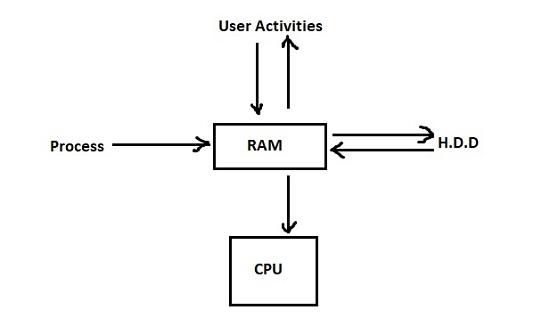

# 200.1. Measure and Troubleshoot Resource Usage

## **200.1 Measure and Troubleshoot Resource Usage**

**Weight:** 6

**Description:** Candidates should be able to measure hardware resource and network bandwidth, identify and troubleshoot resource problems.

**Key Knowledge Areas:**

* Measure CPU usage
* Measure memory usage
* Measure disk I/O
* Measure network I/O
* Measure firewalling and routing throughput
* Map client bandwidth usage
* Match / correlate system symptoms with likely problems
* Estimate throughput and identify bottlenecks in a system including networking

**The following is a partial list of the used files, terms and utilities:**

* iostat
* netstat
* w
* top
* sar
* processes blocked on I/O
* blocks out
* vmstat
* pstree, ps
* Isof
* uptime
* swap
* blocks in

Computers hang, People Nags and Applications run with lags. Handling all of this problems is on administrators' shoulders. It doesn't matter if we are talking about a single computer or we are some where in the cloud. We need some tools to explore the behavior of a system in order to find a solution. Performance problems have two main roots, Sometimes lack of system resources such as CPU, Memory, HDD or even Network cause them, Sometimes we as humankind make mistakes. When there is a paradox between what we expect, what is in need and how we configure computers hang.

## Measure memory usage

RAM is like a gateway of a town, everything goes through RAM. If we have a process, it should be loaded in RAM first inorder to be served by CPU later. CPU feeds its Caches from RAM data. How about User activities? If user ask to read some data From HardDisk it is loaded in RAM and then user can work with that.



As it seeam RAM is pretty busy and always in need.Linux uses some Techniques to over come problem, to make it simple lets explain Memory Terminology

| Item | Description |
| :--- | :--- |
| Page | The blocks that are used in memory, Ususally 4K size |
| Paging | Used to get memory from secondary storage to primary storage |
| Swap | emulated memory  on HDD |
| Virtual Memory | Total allocatable  memory, \[known as process address space\]Linux supports Tera Bytes of virtual memory and use TLB to allocate physial memory. |
| Translation Look aside Buffer\(TLB\) | Kind of cache which speedup translation between RAM and virtual memory, stored in RAM |
| Page cache | Recently used  memory pages are stored here\(not cpu cache \) Used for parked data |
| Dirty Cache | Data which are waiting to go to HDD from RAM\(Works Like a buffer\) |
| Buffers | Used for some Block devices and cache file system metadata.not really important |

Lets explorer whats going inside with some tools and commands.

```text
root@server1:~# vmstat
procs -----------memory---------- ---swap-- -----io---- -system-- ------cpu-----
 r  b   swpd   free   buff  cache   si   so    bi    bo   in   cs us sy id wa st
 2  0  98012  79256  12136 319060    4   17   170    93   85  174  4  1 95  0  0
```

the command vmstat show virtual memory status and some other information. For periodic check with interval you can use `vmstat 2 5`. Lets try free command:

```text
root@server1:~# free -h
              total        used        free      shared  buff/cache   available
Mem:           971M        637M         93M         36M        241M        116M
Swap:          1.0G        403M        617M
```

if you use -h option you can see human readable values, you can use `-m` for megabyte and `-g` for gigabyte view.

as you can see 241M is allocated to buff/cache. to clear buff/cache:

`echo 3 > /proc/sys/vm/drop_caches ; free -h`

this system just has 1 GigaByte of Ram, so obviously it starts using swap, Whats swappiness?

Swappiness is the kernel parameter that defines how much \(and how often\) your Linux kernel will copy RAM contents to swap. This parameter's default value is “60” and it can take anything from “0” to “100”. The higher the value of the swappiness parameter, the more aggressively your kernel will swap.

```text
root@server1:~# cd /proc/sys/vm/
root@server1:/proc/sys/vm# cat swappiness 
60
root@server1:/proc/sys/vm# echo 90 > swappiness
```

## Monitoring CPU

Monitor and measure the load that you have put on your system by uptime command:

```text
root@server1:~# uptime
 06:05:24 up  7:02,  1 user,  load average: 0.85, 1.04, 1.08
```

uptime command shows uptime obviously :\), number of current logged users, and Load average in last 1 min, Last 5 min and last 15 min.The way that uptime calculate system load average is base on CPU Load average and Disk I/O.But the way it shows Load Average is base on \# of CPU cores. So to find out % of Real System Load we need some calculations:

```text
(Load average / number of cpu cores) x 100 ===> %real load average in our system
```

so if you are going beyond your CPU capability.You need to investigate more. Sometimes CPU is the bottleneck and some times Disk is bottleneck. top command is here to help us :

```text
top - 05:06:59 up  6:04,  1 user,  load average: 0.44, 0.16, 0.05
Tasks: 239 total,   3 running, 236 sleeping,   0 stopped,   0 zombie
%Cpu(s): 98.9 us,  1.1 sy,  0.0 ni,  0.0 id,  0.0 wa,  0.0 hi,  0.0 si,  0.0 st
KiB Mem :   994868 total,    77944 free,   594552 used,   322372 buff/cache
KiB Swap:  1045500 total,   571124 free,   474376 used.   180436 avail Mem 

   PID USER      PR  NI    VIRT    RES    SHR S %CPU %MEM     TIME+ COMMAND     
  8738 root      20   0    7480     96      0 R 93.0  0.0   0:26.89 stress      
  7478 myuser     20   0  884192 110216  48640 S  4.7 11.1   4:01.21 oxide-rend+ 
     1 root      20   0  185136   3436   2300 S  0.0  0.3   0:03.40 systemd     
     2 root      20   0       0      0      0 S  0.0  0.0   0:00.01 kthreadd    
     4 root       0 -20       0      0      0 S  0.0  0.0   0:00.00 kworker/0:+ 
     6 root      20   0       0      0      0 S  0.0  0.0   0:04.64 ksoftirqd/0 
     7 root      20   0       0      0      0 R  0.0  0.0   0:04.30 rcu_sched   
     8 root      20   0       0      0      0 S  0.0  0.0   0:00.00 rcu_bh      
     9 root      rt   0       0      0      0 S  0.0  0.0   0:00.00 migration/0 
    10 root       0 -20       0      0      0 S  0.0  0.0   0:00.00 lru-add-dr+ 
    11 root      rt   0       0      0      0 S  0.0  0.0   0:00.10 watchdog/0  
    12 root      20   0       0      0      0 S  0.0  0.0   0:00.00 cpuhp/0     
    13 root      20   0       0      0      0 S  0.0  0.0   0:00.00 kdevtmpfs   
    14 root       0 -20       0      0      0 S  0.0  0.0   0:00.00 netns       
    15 root      20   0       0      0      0 S  0.0  0.0   0:00.09 khungtaskd  
    16 root      20   0       0      0      0 S  0.0  0.0   0:00.00 oom_reaper  
    17 root       0 -20       0      0      0 S  0.0  0.0   0:00.00 writeback
```

top command gives us information about system uptime, load avarage, and detailed info about processes. top also has some tricks:

| Key | Description |
| :--- | :--- |
| press "1" | shows all cpu cores load |
| "shift" + "&lt;" or "&gt;" | sort top based on different culoms |
| "shift" + "p" | sort based CPU usage |
| "shift" + "m" | sort based memory usage |
| press "c" | shows absolute patch of process |
| press "z" | will running process in color |
| press "d" and then delay number | by default top command runs every 3.0 second |
| press "k" and insetr PID of process | Kill the process by using PID |
| press "r"  and PID of process | to renice a process |
| "shift" + "w" | ro write top command results |
| press "q" | to exit |

So top command is usefull for monitoring both CPU and RAM and also show us I/O wait processes.For more detailed lets take a look at third line of top command result. Linux has two Spaces from OS point of view, User space and System space , top command classified process this way :

```text
us:% CPU time spent in user space #####Linux has two Spaces from OS point of view, User space and Kernel space 
sy:% CPU time spent in kernel space####
ni:% CPU time spent on low priority processes
id:% CPU time spent idle
wa:io wait cpu time (or) % CPU time spent in wait (on disk)#######  IO WAIT ######
hi: % CPU time spent servicing/handling hardware interrupts
si:% CPU time spent servicing/handling software interrupts
st:% CPU time in involuntary wait by virtual cpu while hypervisor is servicing another processor
```

did you see wa? it shows IO wait processes and it happens when the bottleneck is Disk. In this condition a process needs some data to be read from the Hard Disk, but Hard Disk is pretty busy and can not read Data When is needed. So poor process must be waited till Disk dose its jobs. Process is I/O Blocked and sleep :\) from CPU point of view process goes in an "Unintrruptable Sleep".This Condition is so bad because we can't even kill that process :\( so monitor processes with top command and always make sure that % of I/O waited process is Zero.

## Measure disk I/O

If finally we have detected that the problem is Disk speed, We should monitor Disk I/O, top command is amazing but we need to know what program has caused the problem. we use iotop \[need to be installed based on your distro, kernel &gt;= 2.6 \]:

```text
Total DISK READ :     805.10 B/s | Total DISK WRITE :      43.24 K/s
Actual DISK READ:     805.10 B/s | Actual DISK WRITE:      34.59 K/s
   TID  PRIO  USER     DISK READ  DISK WRITE  SWAPIN     IO>    COMMAND         
   343 be/3 root        0.00 B/s    5.50 K/s  0.00 %  0.08 % [jbd2/sda1-8]
  3399 be/4 payam       0.00 B/s    2.36 K/s  0.00 %  0.05 % firefox [~M Worker]
  3344 be/4 root        0.00 B/s    0.00 B/s  0.00 %  0.01 % [kworker/u256:0]
  3539 be/4 _apt        0.00 B/s   35.38 K/s  0.00 %  0.00 % http
  1894 be/4 payam     805.10 B/s    0.00 B/s  0.06 %  0.00 % ibus-ui-gtk3
     1 be/4 root        0.00 B/s    0.00 B/s  0.00 %  0.00 % init auto noprompt
     2 be/4 root        0.00 B/s    0.00 B/s  0.00 %  0.00 % [kthreadd]
     4 be/0 root        0.00 B/s    0.00 B/s  0.00 %  0.00 % [kworker/0:0H]
  2053 be/4 payam       0.00 B/s    0.00 B/s  0.00 %  0.00 % indicator~e [gdbus]
     6 be/4 root        0.00 B/s    0.00 B/s  0.00 %  0.00 % [ksoftirqd/0]
     7 be/4 root        0.00 B/s    0.00 B/s  0.00 %  0.00 % [rcu_sched]
     8 be/4 root        0.00 B/s    0.00 B/s  0.00 %  0.00 % [rcu_bh]
     9 rt/4 root        0.00 B/s    0.00 B/s  0.00 %  0.00 % [migration/0]
    10 be/0 root        0.00 B/s    0.00 B/s  0.00 %  0.00 % [lru-add-drain]
    11 rt/4 root        0.00 B/s    0.00 B/s  0.00 %  0.00 % [watchdog/0]
    12 be/4 root        0.00 B/s    0.00 B/s  0.00 %  0.00 % [cpuhp/0]
    13 be/4 root        0.00 B/s    0.00 B/s  0.00 %  0.00 % [cpuhp/1]
    14 rt/4 root        0.00 B/s    0.00 B/s  0.00 %  0.00 % [watchdog/1]
    15 rt/4 root        0.00 B/s    0.00 B/s  0.00 %  0.00 % [migration/1]
    16 be/4 root        0.00 B/s    0.00 B/s  0.00 %  0.00 % [ksoftirqd/1]
    18 be/0 root        0.00 B/s    0.00 B/s  0.00 %  0.00 % [kworker/1:0H
```

There is another tool which gives us less info but its quick and handy, Like vmstat that we have talked about, we have iostat which gives us a snap shot of current situation of Disk I/O: \[iostat is a part of sysstat package and need to be installed\]:

```text
root@server1:~# iostat
Linux 4.10.0-28-generic (server1)     11/29/2017     _x86_64_    (4 CPU)

avg-cpu:  %user   %nice %system %iowait  %steal   %idle
           2.95    4.12    8.76    1.46    0.00   82.72

Device:            tps    kB_read/s    kB_wrtn/s    kB_read    kB_wrtn
sda             126.67      2487.11      5265.57    3756449    7952952
```

There is another tool which is sar, yes that is funny because that is the name of a bird in Farsi :\) but here it is acronym for "System Activity Report". For running sar command you should define delay and time for it:

```text
root@server1:~# sar 1 7
Linux 4.10.0-28-generic (server1)     11/29/2017     _x86_64_    (4 CPU)

12:26:42 AM     CPU     %user     %nice   %system   %iowait    %steal     %idle
12:26:43 AM     all      0.25      0.00      0.00      0.00      0.00     99.75
12:26:44 AM     all      0.76      0.00      0.25      0.00      0.00     98.99
12:26:45 AM     all      0.50      0.00      0.50      0.00      0.00     99.00
12:26:46 AM     all      0.50      0.00      0.75      0.00      0.00     98.74
12:26:47 AM     all      0.51      0.00      0.51      0.00      0.00     98.99
12:26:48 AM     all      0.50      0.00      0.25      0.00      0.00     99.25
12:26:49 AM     all      0.75      0.00      0.75      0.00      0.00     98.49
Average:        all      0.54      0.00      0.43      0.00      0.00     99.03
```

Some times we need to know what files are opened in out system. Weather we have performance issue or just for monitoring whats going on before rebooting the computer. lsof gives us " LiSt of Open Files" :

```text
COMMAND     PID  TID             USER   FD      TYPE             DEVICE SIZE/OFF       NODE NAME
systemd       1                  root  cwd       DIR                8,1     4096          2 /
systemd       1                  root  rtd       DIR                8,1     4096          2 /
systemd       1                  root  txt       REG                8,1  1577232     135885 /lib/systemd/systemd
systemd       1                  root  mem       REG                8,1    18976     136484 /lib/x86_64-linux-gnu/libuuid.so.1.3.0
systemd       1                  root  mem       REG                8,1   262408     136292 /lib/x86_64-linux-gnu/libblkid.so.1.1.0
systemd       1                  root  mem       REG                8,1    14608     136324 /lib/x86_64-linux-gnu/libdl-2.23.so
systemd       1                  root  mem       REG                8,1   456632     136429 /lib/x86_64-linux-gnu/libpcre.so.3.13.2
systemd       1                  root  mem       REG                8,1  1868984     136300 /lib/x86_64-linux-gnu/libc-2.23.so
systemd       1                  root  mem       REG                8,1   138696     136446 /lib/x86_64-linux-gnu/libpthread-2.23.so
systemd       1                  root  mem       REG                8,1   286824     136376 /lib/x86_64-linux-gnu/libmount.so.1.1.0
systemd       1                  root  mem       REG                8,1    64144     136282 /lib/x86_64-linux-gnu/libapparmor.so.1.4.0
systemd       1                  root  mem       REG                8,1    92864     136363 /lib/x86_64-linux-gnu/libkmod.so.2.3.0
systemd       1                  root  mem       REG                8,1   117288     136290 /lib/x86_64-linux-gnu/libaudit.so.1.0.0
systemd       1                  root  mem       REG                8,1    55904     136416 /lib/x86_64-linux-gnu/libpam.so.0.83.1
systemd       1                  root  mem       REG                8,1   252152     136457 /lib/x86_64-linux-gnu/libseccomp.so.2.2.3
systemd       1                  root  mem       REG                8,1    31712     136454 /lib/x86_64-linux-gnu/librt-2.23.so
systemd       1                  root  mem       REG                8,1    23128     136303 /lib/x86_64-linux-gnu/libcap.so.2.24
systemd       1                  root  mem       REG                8,1   130224     136458 /lib/x86_64-linux-gnu/libselinux.so.1
systemd       1                  root  mem       REG                8,1   162632     136272 /lib/x86_64-linux-gnu/ld-2.23.so
```

lsof gives us a very very long list of open files, you can see part of that above. But we usually use it with grep and also we can use it for a specific user lsof -u myuser.

## Measure Network I/O

By spreading Internet and growth of personal Networks, the importance of Network grows. When we want explore what has caused problem in network, we should consider whole path, from beginning to the end and visa versa. That is Like talking about car traffic in big cities. Lets get familiar with some commands and tools.

### iftop

Let add another member to top series commands, iftop. iftop gives you info about Sessions on your NIC and sort them based on transfer rate.

```text
                12.5Kb          25.0Kb          37.5Kb          50.0Kb    62.5Kb
└───────────────┴───────────────┴───────────────┴───────────────┴───────────────
192.168.10.131             => ec2-52-35-5-132.us-west-2   444b   1.76Kb   450b
                           <=                             320b   5.51Kb  1.38Kb
192.168.10.131             => ec2-35-162-5-204.us-west-     0b   1.58Kb   405b
                           <=                               0b   5.51Kb  1.38Kb
192.168.10.131             => sof02s18-in-f42.1e100.net     0b   1.33Kb   340b
                           <=                               0b   4.77Kb  1.19Kb
192.168.10.131             => 192.168.10.2                  0b   1.87Kb   691b
                           <=                               0b   3.25Kb  0.99Kb
192.168.10.131             => sof02s18-in-f14.1e100.net     0b    494b    123b
                           <=                               0b    696b    174b
192.168.10.131             => 93.184.220.29                 0b    768b    192b
                           <=                               0b      0b      0b
192.168.10.131             => a95-101-72-121.deploy.aka     0b     32b     95b
                           <=                               0b    339b    102b
224.0.0.252                => 192.168.10.1                  0b      0b      0b
                           <=                               0b    170b    212b
239.255.255.250            => 192.168.10.1                  0b      0b      0b
                           <=                             804b    161b     40b
────────────────────────────────────────────────────────────────────────────────
TX:             cum:   11.8KB   peak:   20.5Kb  rates:    444b   7.80Kb  2.24Kb
RX:                    28.0KB           62.1Kb           1.10Kb  20.4Kb  5.46Kb
TOTAL:                 39.8KB           82.6Kb           1.53Kb  28.2Kb  7.70Kb
```

Like top, you can use &lt; &gt; keys to sort based on different columns, and you can prees 1 or 2 or 3 inorder to sort based on last 2secs, 10 secs or 40 secs network activities. also you can pick specific Interface by using iftop -i eth1

### nload

Networl Load nload is another Handy tool, this time for monitoring current bandwidth.

```text
Device ens33 [192.168.10.131] (1/2):
================================================================================
Incoming:


                                                       Curr: 235.20 kBit/s
                                                       Avg: 452.10 kBit/s
             #|..                                      Min: 0.00 Bit/s
    .|    ..#####|.                ..  ||.|      ..    Max: 2.56 MBit/s
###.##.  .#########| ......  ..|..###|.####| ..||## .  Ttl: 35.37 MByte
Outgoing:


                                                       Curr: 10.84 kBit/s
                                                       Avg: 46.62 kBit/s
                                                       Min: 0.00 Bit/s
                                                       Max: 370.35 kBit/s
             ..                                        Ttl: 1.69 MByte
```

If you have enjoyed then try ifstat for yourself.

For Testing Connection between two nodes of network we have nice iperf tool.

```text
### MAchine A 192.168.10.131 ### as server###
root@server1:~# iperf -s
------------------------------------------------------------
Server listening on TCP port 5001
TCP window size: 85.3 KByte (default)
------------------------------------------------------------
[  4] local 192.168.10.131 port 5001 connected with 192.168.10.130 port 41784
[ ID] Interval       Transfer     Bandwidth
[  4]  0.0-10.0 sec  3.44 GBytes  2.95 Gbits/sec


###machine B 192.168.10.130 ### as client ###
iperf -c 192.168.10.131
------------------------------------------------------------
Client connecting to 192.168.10.131, TCP port 5001
TCP window size: 85.0 KByte (default)
------------------------------------------------------------
[  3] local 192.168.10.130 port 41784 connected with 192.168.10.131 port 5001
[ ID] Interval       Transfer     Bandwidth
[  3]  0.0-10.0 sec  3.44 GBytes  2.96 Gbits/sec
```

as both of nodes in my example are virtual machines, you can see amazing 2.95 Gbits/sec bandwidth. Who knows some day in future this might happened in real world :\)

And finally, lets introduce a tiny tool to check you internet speed from command line:

apt install speedtest-cli

```text
root@server1:~# speedtest
Retrieving speedtest.net configuration...
Retrieving speedtest.net server list...
Testing from WestHost (107.182.226.165)...
Selecting best server based on latency...
Hosted by Sprint (New York City, NY) [2.13 km]: 581.08 ms
Testing download speed........................................
Download: 1.24 Mbit/s
Testing upload speed..................................................
Upload: 3.23 Mbit/s
```

.

.

.

