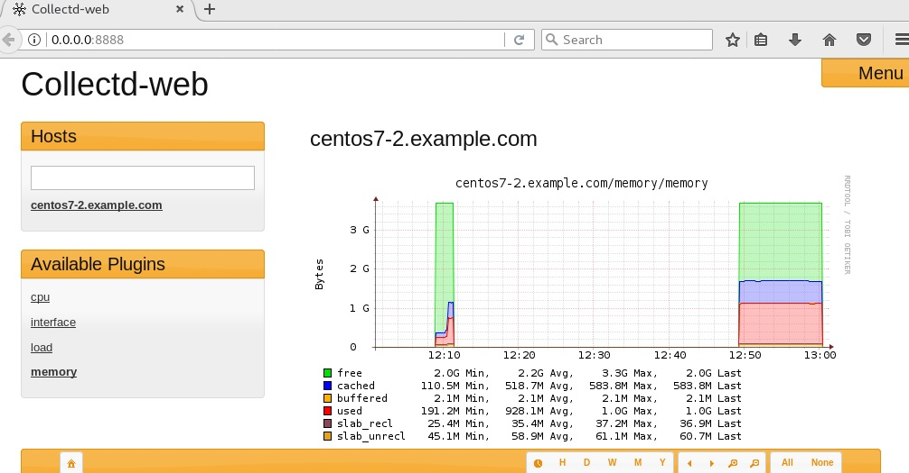

# 200.2. Predict Future Resource Needs

**Weight:** 2

**Description:** Candidates should be able to monitor resource usage to predict future resource needs.

**Key Knowledge Areas:**

* Use monitoring and measurement tools to monitor IT infrastructure usage.
* Predict capacity break point of a configuration
* Observe growth rate of capacity usage
* Graph the trend of capacity usage
* Awareness of monitoring solutions such as Icinga2, Nagios, collectd, MRTG and Cacti

**The following is a partial list of the used files, terms and utilities:**

* diagnose
* predict growth
* resource exhaustion

Predicting The future is one of the hardest works ever, can you remember "Dorithy and the witches of the OZ"? :\) Many System Administrators wish if they had some thing like Glass Ball. They wish they could realize what kind of problems might happen next day, in order to avoid it today. But unfortunately that is impossible. So forget about that and lets talk about real environment. In computer science predicting future is possible just by archiving and processing what has happened in past.Mathematical science and statistics can analyze old data and graph trends to predict future.


there are some tools to help us:

* Icinga2
* Nagios
* collectd
* MRTG
* Cacti

We can spend a whole course for each of these tools, but for LPI exam we are wanted to know about their existence. At beginning we spend some time on collectd to show atlead one solution and see how does it look like. And then we just Introduce other solutions.

## collectd

Collectd, a Unix daemon that collects statistics related to system performance and also provides means for storing the values in different formats like RRD \(Round Robin Database\) files. The statistics gathered by Collectd help to detect the current performance blocks and predict system load in future.

collectd is installed by default in many distributions how ever it can be easily installed from repositories in redhat or debian systems, here we use CentOS7 system:

```text
[root@centos7-2 ~]# yum install collectd
```

To configure what to monitor, modify collect.conf file:

```text
[root@centos7-2 ~]# rpm -ql collectd | grep etc
/etc/collectd.conf
/etc/collectd.d

[root@centos7-2 etc]# ls -l  | grep collectd
-rw-r--r--.  1 root root     42077 May 17 04:46 collectd.conf
drwxr-xr-x.  2 root root         6 May 17 04:46 collectd.d

[root@centos7-2 etc]# wc -l collectd.conf 
1820 collectd.conf
```

and that is a huge configuration file consist of different sections . Which are not part of our exam!\(File has been abstracted\) :

```text
##############################################################################
# Global                                                                     #
#----------------------------------------------------------------------------#
# Global settings for the daemon.                                            #
##############################################################################

#Hostname    "localhost"
#FQDNLookup   true
#BaseDir     "/var/lib/collectd"
#PIDFile     "/var/run/collectd.pid"
#PluginDir   "/usr/lib64/collectd"
#TypesDB     "/usr/share/collectd/types.db"

#----------------------------------------------------------------------------#
# When enabled, plugins are loaded automatically with the default options    #
# when an appropriate <Plugin ...> block is encountered.                     #
# Disabled by default.                                                       #
#----------------------------------------------------------------------------#
#AutoLoadPlugin false

#----------------------------------------------------------------------------#
# When enabled, internal statistics are collected, using "collectd" as the   #
# plugin name.                                                               #
# Disabled by default.                                                       #
#----------------------------------------------------------------------------#
#CollectInternalStats false

#----------------------------------------------------------------------------#
# Interval at which to query values. This may be overwritten on a per-plugin #
# base by using the 'Interval' option of the LoadPlugin block:               #
#   <LoadPlugin foo>                                                         #
#       Interval 60                                                          #
#   </LoadPlugin>                                                            #
#----------------------------------------------------------------------------#
#Interval     10

#MaxReadInterval 86400
#Timeout         2
#ReadThreads     5
#WriteThreads    5

# Limit the size of the write queue. Default is no limit. Setting up a limit is
# recommended for servers handling a high volume of traffic.
#WriteQueueLimitHigh 1000000
#WriteQueueLimitLow   800000

##############################################################################
# Logging                                                                    #
#----------------------------------------------------------------------------#
# Plugins which provide logging functions should be loaded first, so log     #
# messages generated when loading or configuring other plugins can be        #
# accessed.                                                                  #
##############################################################################

LoadPlugin syslog
#LoadPlugin logfile
#LoadPlugin log_logstash

#<Plugin logfile>
#    LogLevel info
#    File STDOUT
#    Timestamp true
#    PrintSeverity false
#</Plugin>

#<Plugin log_logstash>
#    LogLevel info
#    File "/var/log/collectd.json.log"
#</Plugin>

#<Plugin syslog>
#    LogLevel info
#</Plugin>

##############################################################################
# LoadPlugin section                                                         #
#----------------------------------------------------------------------------#
# Lines beginning with a single `#' belong to plugins which have been built  #
# but are disabled by default.                                               #
#                                                                            #
# Lines beginning with `##' belong to plugins which have not been built due  #
# to missing dependencies or because they have been deactivated explicitly.  #
##############################################################################
.
..
....

LoadPlugin cpu
#LoadPlugin cpufreq
#LoadPlugin cpusleep

#LoadPlugin df
#LoadPlugin disk
#LoadPlugin dns

LoadPlugin interface
#LoadPlugin ipc
#LoadPlugin ipmi
#LoadPlugin iptables
#LoadPlugin ipvs
#LoadPlugin irq
#LoadPlugin java
LoadPlugin load
##LoadPlugin lpar
#LoadPlugin lua
#LoadPlugin lvm
#LoadPlugin madwifi
#LoadPlugin mbmon
#LoadPlugin mcelog
#LoadPlugin md
#LoadPlugin memcachec
#LoadPlugin memcached
LoadPlugin memory
##LoadPlugin mic
#LoadPlugin modbus
#LoadPlugin mqtt
#LoadPlugin multimeter
#LoadPlugin mysql
##LoadPlugin netapp
#LoadPlugin netlink
LoadPlugin network
#LoadPlugin nfs

#LoadPlugin rrdtool
......
....
..
.
##############################################################################
# Plugin configuration                                                       #
#----------------------------------------------------------------------------#
# In this section configuration stubs for each plugin are provided. A desc-  #
# ription of those options is available in the collectd.conf(5) manual page. #
##############################################################################
.
..
...
#<Plugin apache>
#  <Instance "local">
#    URL "http://localhost/status?auto"
#    User "www-user"
#    Password "secret"
#    CACert "/etc/ssl/ca.crt"
#  </Instance>
#</Plugin>

#<Plugin rrdtool>
#       DataDir "/var/lib/collectd/rrd"
#       CreateFilesAsync false
#       CacheTimeout 120
#       CacheFlush   900
#       WritesPerSecond 50
#</Plugin>

...
..
##############################################################################
# Filter configuration                                                       #
#----------------------------------------------------------------------------#
# The following configures collectd's filtering mechanism. Before changing   #
# anything in this section, please read the `FILTER CONFIGURATION' section   #
# in the collectd.conf(5) manual page.                                       #
##############################################################################

# Load required matches:
#LoadPlugin match_empty_counter
#LoadPlugin match_hashed
#LoadPlugin match_regex
#LoadPlugin match_value
#LoadPlugin match_timediff
..
...
..
#############################################################################
# Threshold configuration                                                    #
#----------------------------------------------------------------------------#
# The following outlines how to configure collectd's threshold checking      #
# plugin. The plugin and possible configuration options are documented in    #
# the collectd-threshold(5) manual page.                                     #
##############################################################################

#LoadPlugin "threshold"
#<Plugin threshold>
#  <Type "foo">
#    WarningMin    0.00
#    WarningMax 1000.00
#    FailureMin    0.00
#    FailureMax 1200.00
#    Invert false
#    Instance "bar"
#  </Type>
#
#  <Plugin "interface">
#    Instance "eth0"
#    <Type "if_octets">
#      FailureMax 10000000
#      DataSource "rx"
#    </Type>
#  </Plugin>
#
#  <Host "hostname">
#    <Type "cpu">
#      Instance "idle"
#      FailureMin 10
#    </Type>
...
..
```

In order to monitor specific item we can enable it by removing comment sign in Load Plugin and plugin configuration sections. What we have done here is enabling network module .

Lets restart the service :

```text
[root@centos7-2 etc]# systemctl restart collectd.service
```

Now we have to give collectd enough time to gather information about network and other modules which have been enabled.Unfortunately collectd doesn't come with an interface for viewing collected data by default, so we need some extra works to install and a web interface for that.

### Configure Collectd-web to monitor a server

**Collectd-web** is a web front-end monitoring tool based on RRDtool \(Round-Robin Database Tool\), which interprets and graphical outputs the data collected by the Collectd service on Linux systems.

So first lets install and enable rrdtool module:

```text
[root@centos7-2 ~]# yum install  collectd-rrdtool.x86_64 rrdtool rrdtool-devel rrdtool-perl perl-HTML-Parser perl-JSON perl-CGI
```

and modify this parts of collectd.conf file:

```text
.
..
...
LoadPlugin rrdtool
...
..

<Plugin rrdtool>
        DataDir "/var/lib/collectd/rrd"
#       CreateFilesAsync false
#       CacheTimeout 120
#       CacheFlush   900
#       WritesPerSecond 50
</Plugin>
...
..
.
```

installing git "

```text
[root@centos7-2 ~]# yum install git
```

and Cloning collectd-web from the its repository:

```text
[root@centos7-2 opt]# ls -l | grep collectd
drwxr-xr-x. 7 root root 251 Oct 15 19:29 collectd-web
[root@centos7-2 opt]# cd collectd-web/
[root@centos7-2 collectd-web]# ls
AUTHORS  CHANGELOG      COPYING  index.html  media       runserver.py
cgi-bin  check_deps.sh  docs     iphone      README.rst
```

We use **Collectd-web CGI** scripts which interprets and generates the graphical html page statistics. First we need to make it executable for further use :

```text
[root@centos7-2 collectd-web]# chmod +x cgi-bin/graphdefs.cgi
```

By default, collectd-web is configured to run on the loopback address 127.0.0.1. You will need to edit the runserver.py script and change 127.0.0.1 to 0.0.0.0, in order to bind on all network interface IP Adresses and access the collectd-web interface from a remote machine.

```text
[root@centos7-2 collectd-web]# vim runserver.py 
[root@centos7-2 collectd-web]# cat runserver.py 
#!/usr/bin/env python

import CGIHTTPServer
import BaseHTTPServer
from optparse import OptionParser

class Handler(CGIHTTPServer.CGIHTTPRequestHandler):
    cgi_directories = ["/cgi-bin"]

PORT = 8888

def main():
    parser = OptionParser()
    opts, args = parser.parse_args()
    if args:
        httpd = BaseHTTPServer.HTTPServer((args[0], int(args[1])), Handler)
        print "Collectd-web server running at http://%s:%s/" % (args[0], args[1])
    else:
        httpd = BaseHTTPServer.HTTPServer(("0.0.0.0", PORT), Handler)
        print "Collectd-web server running at http://%s:%s/" % ("127.0.0.1", PORT)
    httpd.serve_forever()

if __name__ == "__main__":
    main()
```

Next we need to create /etc/collectd directory and collection.conf file inside that, this specifies where collectd-web can read data from:

```text
[root@centos7-2 collectd-web]# cd /etc/
[root@centos7-2 etc]# mkdir collectd
[root@centos7-2 etc]# cd collectd
[root@centos7-2 collectd]# touch collection.conf 
[root@centos7-2 collectd]# vim collection.conf 
[root@centos7-2 collectd]# cat collection.conf 
DataDir: "/var/lib/collectd/rrd/"
```

After modifying the Python server script, we can start the server by running runserver.py :

```text
[root@centos7-2 collectd-web]# ./runserver.py &
```

If we have firewall up and running , add required port for collect-web insterface.Here we are using CentOS so we should deal with firewalld:

```text
[root@centos7-2 ~]# firewall-cmd --zone=public --permanent --add-port=8888/tcp
success
[root@centos7-2 ~]# firewall-cmd --reload
success
```

Finally, we can access the collectd-web interface at the URL [`http://our-server-ip:8888`](http://our-server-ip:8888) in our web browser:



How does it work? Collectd uses data sets which are defines in types.db:

```text
[root@centos7-2 ~]# ls /usr/share/collectd/
types.db
[root@centos7-2 ~]# cat /usr/share/collectd/types.db | grep cpu
cpu                     value:DERIVE:0:U
cpu_affinity            value:GAUGE:0:1
cpufreq                 value:GAUGE:0:U
ps_cputime              user:DERIVE:0:U, syst:DERIVE:0:U
vcpu                    value:GAUGE:0:U
virt_cpu_total          value:DERIVE:0:U
virt_vcpu               value:DERIVE:0:U
```

to gather data in a special format\(Round Robin DataBase \) in /var/lib/directory/rrd directory which we previously enabled in collectd.conf:

```text
[root@centos7-2 ~]# cat /etc/collectd.conf | grep rrd
#LoadPlugin rrdcached
LoadPlugin rrdtool
#<Plugin rrdcached>
#    DaemonAddress "unix:/tmp/rrdcached.sock"
#    DataDir "/var/lib/collectd/rrd"
<Plugin rrdtool>
#    DataDir "/var/lib/collectd/rrd"


  [root@centos7-2 ~]# tree /var/lib/collectd/rrd
/var/lib/collectd/rrd
└── centos7-2.example.com
    ├── cpu-0
    │   ├── cpu-idle.rrd
    │   ├── cpu-interrupt.rrd
    │   ├── cpu-nice.rrd
    │   ├── cpu-softirq.rrd
    │   ├── cpu-steal.rrd
    │   ├── cpu-system.rrd
    │   ├── cpu-user.rrd
    │   └── cpu-wait.rrd
    ├── cpu-1
    │   ├── cpu-idle.rrd
    │   ├── cpu-interrupt.rrd
    │   ├── cpu-nice.rrd
    │   ├── cpu-softirq.rrd
    │   ├── cpu-steal.rrd
    │   ├── cpu-system.rrd
    │   ├── cpu-user.rrd
    │   └── cpu-wait.rrd
    ├── cpu-2
    │   ├── cpu-idle.rrd
    │   ├── cpu-interrupt.rrd
    │   ├── cpu-nice.rrd
    │   ├── cpu-softirq.rrd
    │   ├── cpu-steal.rrd
    │   ├── cpu-system.rrd
    │   ├── cpu-user.rrd
    │   └── cpu-wait.rrd
    ├── cpu-3
    │   ├── cpu-idle.rrd
    │   ├── cpu-interrupt.rrd
    │   ├── cpu-nice.rrd
    │   ├── cpu-softirq.rrd
    │   ├── cpu-steal.rrd
    │   ├── cpu-system.rrd
    │   ├── cpu-user.rrd
    │   └── cpu-wait.rrd
    ├── interface-ens33
    │   ├── if_dropped.rrd
    │   ├── if_errors.rrd
    │   ├── if_octets.rrd
    │   └── if_packets.rrd
    ├── interface-lo
    │   ├── if_dropped.rrd
    │   ├── if_errors.rrd
    │   ├── if_octets.rrd
    │   └── if_packets.rrd
    ├── interface-virbr0
    │   ├── if_dropped.rrd
    │   ├── if_errors.rrd
    │   ├── if_octets.rrd
    │   └── if_packets.rrd
    ├── interface-virbr0-nic
    │   ├── if_dropped.rrd
    │   ├── if_errors.rrd
    │   ├── if_octets.rrd
    │   └── if_packets.rrd
    ├── load
    │   └── load.rrd
    └── memory
        ├── memory-buffered.rrd
        ├── memory-cached.rrd
        ├── memory-free.rrd
        ├── memory-slab_recl.rrd
        ├── memory-slab_unrecl.rrd
        └── memory-used.rrd

11 directories, 55 files
```

Okey do not forget that the installation process is not part of LPIC exam and based on your distribution and version the installation steps might be different from what we have done here.

## Awareness of other monitoring tools:

There are some monitoring tools which are available both in open source \(in core versions \) as well as enterprise versions or are incorporated with other products from enterprise perspective. they offer support and additional functionality.

## Nagios

Nagios has been available from late 90s, early 2000. It is really a collection of production of products.


* Nagios Core : freely available open source core monitoring system.
* Collectd-nagios plugin : Query information form the collectd daemon and then create some beautiful graphs in nagios monitoring dashboard.
* Nagios XI : Full enterprise package.
* nagios Log Server
* Nagios Network analyzer
* Nagiod Fusion 
* ...

web site: [https://www.nagios.com](https://www.nagios.com)

## MRTG

Multi Router Traffic Grapher \(MRTG\) is a network admins tool that offer enterprise extentions to mrtg including Scrutinizer , FlowPro and replicator.


MRTG monitors network traffic loads, reads that traffic and create the statistics from the informations from routers and switches and creates logs for later use. It is written in perl. It works in Unix, Linux and windows


web site: [https://www.mrtg.com/](https://www.mrtg.com/)

## Cacti

Cacti is a complete network graphing solution designed to harness the power of RRDTool's data storage and graphing functionality. Cacti provides a fast poller, advanced graph templating, multiple data acquisition methods, and user management features out of the box. All of this is wrapped in an intuitive, easy to use interface that makes sense for LAN-sized installations up to complex networks with thousands of devices.


Cacti can be used in conjunction with collectd due to the fact both use rrdTools.

web site: [https://www.cacti.net/](https://www.cacti.net/)

and to summarize, take a look at comparison chart below:

|  | Cacti | Collectd | Icinga | Nagios |
| :--- | :--- | :--- | :--- | :--- |
| IP SLA Report | Yes | No | Via Plugin | Via Pugin |
| Logical Grouping | Yes | No | Yes | Yes |
| Trending | Yes | No | Yes | Yes |
| Trend Prediction | Yes | No | No | No |
| Auto Discovery | Yes | Push Model ,Multicast possible | Via Plugin | Via Plugin |
| Agentless | Yes | Supported | Supported | Supported |
| SNMP | Yes | Yes | Via Plugin | Via Plugin |
| Syslog | Yes | Yes | Via Plugin | Via PLugin |
| Plugins | Yes | Yes | Yes | Yes |
| Triggers / Alerts | Yes | Yes | Yes | Yes |
| WebApp | Full Controll | Viewing | Full Control | Yes |
| Distributed Monitoring | Yes | Yes | Yes | Yes |
| Inventory | Yes | No | Via Plugin | Via PLugin |
| Platform | PHP | C | C | C |
| Data Storage Method | RRD tool,MySQL | RRD tool | MySQL,PostgreSQL,Oracle Database | Flat File, SQL, MySQL |
| License | Commercial | GPL V2 | GPL | GPL |
| Maps | Yes | No | Via Plugin | Yes |
| Access Control | Yes | Apache acl | Yes | Yes |

Do not forget, Capacity Calculation, Predicting future needs and have a good sense of IT environment need years of experience.

.

.

.

sources:

[https://www.tecmint.com/install-collectd-and-collectd-web-to-monitor-server-resources-in-linux/](https://www.tecmint.com/install-collectd-and-collectd-web-to-monitor-server-resources-in-linux/)

[https://devops.profitbricks.com/tutorials/how-to-install-and-configure-collectd-and-collectd-web-to-monitor-a-centos-7-server/](https://devops.profitbricks.com/tutorials/how-to-install-and-configure-collectd-and-collectd-web-to-monitor-a-centos-7-server/)

