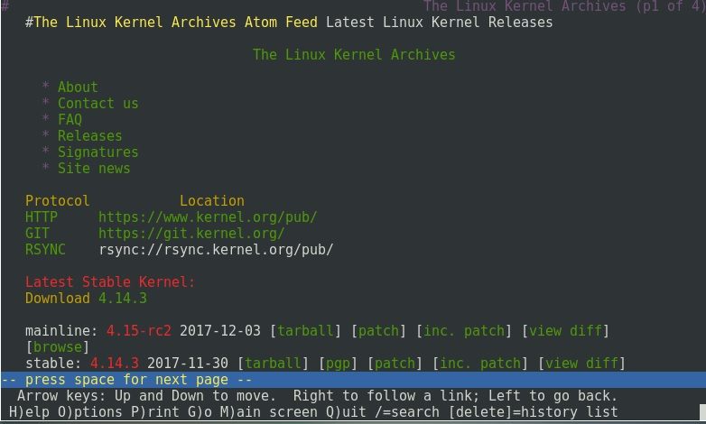
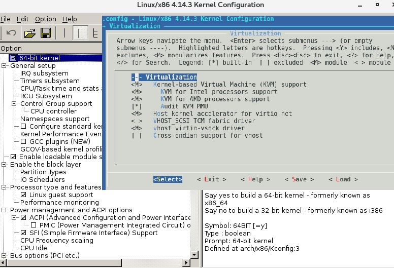

# 201.2. Compiling a kernel

## **201.2 Compiling a kernel**

## **Weight:** 3

**Description:** Candidates should be able to properly configure a kernel to include or disable specific features of the Linux kernel as necessary. This objective includes compiling and recompiling the Linux kernel as needed, updating and noting changes in a new kernel, creating an initrd image and installing new kernels.

**Key Knowledge Areas:**

* /usr/src/linux/
* Kernel Makefiles
* Kernel 2.6.x/3.x make targets
* Customize the current kernel configuration.
* Build a new kernel and appropriate kernel modules.
* Install a new kernel and any modules.
* Ensure that the boot manager can locate the new kernel and associated files.
* Module configuration files
* Use DKMS to compile kernel modules.
* Awareness of dracut

**Terms and Utilities:**

* mkinitrd
* mkinitramfs
* make
* make targets \(all, config, xconfig, menuconfig, gconfig, oldconfig, mrproper, zImage, bzImage, modules, modules\_install, rpm-pkg, binrpm-pkg, deb-pkg\)
* gzip
* bzip2
* module tools
* /usr/src/linux/.config
* /lib/modules/kernel-version/
* depmod
* dkms

## Kernel

Why we should compile our linux kernel or upgrade it ? to tell the truth as linux kernel is so modular and flexible, most of the time there is no need to manipulate kernel. Specially When we are talking about commercial versions of linux like redhat, manipulating kernel cause support issues. In contrast in embedded linux system, you should try to make kernel as small as possible. So compile or upgrade kernel just if there is a good reason.

Upgrading kernel and compiling it is very distro specific. The way that we traverse to achive that might be different in Ubuntu, Open Suse or cent OS. Upgrading kernel include compiling, so here we start with downloading new version of kernel and compiling it, but as an administrator you might recompile current version of your linux inorder to add / remove some modules and futures.

### Upgrading kernel

First go to [https://kernel.org](https://kernel.org) inorder to get the desired kernel version:



We chose latest stable kernel version, do not forget we have to be in /usr/src/ and from now on work in this directory only, in this demonstartion we use CentOS7 machine:

```text
[root@server1 ~]# cd /usr/src/
[root@server1 src]# ls -l
total 0
drwxr-xr-x. 2 root root 6 Nov  5  2016 debug
drwxr-xr-x. 2 root root 6 Nov  5  2016 kernels
[root@server1 src]# wget https://cdn.kernel.org/pub/linux/kernel/v4.x/linux-4.14.3.tar.xz
--2017-12-04 08:34:00--  https://cdn.kernel.org/pub/linux/kernel/v4.x/linux-4.14.3.tar.xz
Resolving cdn.kernel.org (cdn.kernel.org)... 151.101.1.176, 151.101.65.176, 151.101.129.176, ...
Connecting to cdn.kernel.org (cdn.kernel.org)|151.101.1.176|:443... connected.
HTTP request sent, awaiting response... 200 OK
Length: 100778240 (96M) [application/x-xz]
Saving to: ‘linux-4.14.3.tar.xz’

100%[=============================================>] 100,778,240  247KB/s   in 8m 15s 

2017-12-04 08:42:20 (199 KB/s) - ‘linux-4.14.3.tar.xz’ saved [100778240/100778240]

[root@server1 src]# ls -l
total 98420
drwxr-xr-x. 2 root root         6 Nov  5  2016 debug
drwxr-xr-x. 2 root root         6 Nov  5  2016 kernels
-rw-r--r--. 1 root root 100778240 Nov 30 03:52 linux-4.14.3.tar.xz
```

Now lets extract .xz file. Also we should make a symbolic link as linux which point to downloaded kernel:

```text
[root@server1 src]# tar -Jxvf linux-4.14.3.tar.xz 
********
******
****
**
[root@server1 src]# ls -l
total 98424
drwxr-xr-x.  2 root root         6 Nov  5  2016 debug
drwxr-xr-x.  2 root root         6 Nov  5  2016 kernels
drwxrwxr-x. 24 root root      4096 Nov 30 03:41 linux-4.14.3
-rw-r--r--.  1 root root 100778240 Nov 30 03:52 linux-4.14.3.tar.xz
[root@server1 src]# ln -s linux-4.14.3 linux
[root@server1 src]# ls -l
total 98424
drwxr-xr-x.  2 root root         6 Nov  5  2016 debug
drwxr-xr-x.  2 root root         6 Nov  5  2016 kernels
lrwxrwxrwx.  1 root root        12 Dec  4 08:48 linux -> linux-4.14.3
drwxrwxr-x. 24 root root      4096 Nov 30 03:41 linux-4.14.3
-rw-r--r--.  1 root root 100778240 Nov 30 03:52 linux-4.14.3.tar.xz
```

Before continue there is document folder inside downloaded kernel, There are amazing help text file:

```text
[root@server1 src]# cd linux/Documentation/
[root@server1 Documentation]# ls 
00-INDEX                    gpio                         parport-lowlevel.txt
ABI                         gpu                          PCI
accounting                  hid                          pcmcia
acpi                        highuid.txt                  percpu-rw-semaphore.txt
admin-guide                 hwmon                        perf
aoe                         hw_random.txt                phy
arm                         hwspinlock.txt               phy.txt
arm64                       i2c                          pi-futex.txt
atomic_bitops.txt           ia64                         platform
atomic_t.txt                ide                          pnp.txt
auxdisplay                  iio                          power
backlight                   index.rst                    powerpc
bcache.txt                  infiniband                   pps
blackfin                    input                        preempt-locking.txt
block                       Intel-IOMMU.txt              printk-formats.txt
blockdev                    intel_txt.txt                process
bt8xxgpio.txt               ioctl                        pti
btmrvl.txt                  io-mapping.txt               ptp
bus-devices                 io_ordering.txt              pwm.txt
bus-virt-phys-mapping.txt   iostats.txt                  rapidio
cachetlb.txt                IPMI.txt                     rbtree.txt
cdrom                       IRQ-affinity.txt             RCU
cgroup-v1                   IRQ-domain.txt               remoteproc.txt
cgroup-v2.txt               irqflags-tracing.txt         rfkill.txt
Changes                     IRQ.txt                      robust-futex-ABI.txt
circular-buffers.txt        isapnp.txt                   robust-futexes.txt
clk.txt                     isa.txt                      rpmsg.txt
cma                         isdn                         rtc.txt
CodingStyle                 kbuild                       s390
conf.py                     kdump                        SAK.txt
connector                   kernel-doc-nano-HOWTO.txt    scheduler
console                     kernel-hacking               scsi
core-api                    kernel-per-CPU-kthreads.txt  security
cpu-freq                    kobject.txt                  serial
cpuidle                     kprobes.txt                  sgi-ioc4.txt
cpu-load.txt                kref.txt                     sh
cputopology.txt             laptops                      siphash.txt
crc32.txt                   ldm.txt                      SM501.txt
cris                        leds                         smsc_ece1099.txt
crypto                      lightnvm                     sound
dcdbas.txt                  livepatch                    sparc
debugging-modules.txt       locking                      sphinx
debugging-via-ohci1394.txt  lockup-watchdogs.txt         sphinx-static
dell_rbu.txt                logo.gif                     spi
device-mapper               logo.txt                     static-keys.txt
devicetree                  lsm.txt                      SubmittingPatches
dev-tools                   lzo.txt                      svga.txt
digsig.txt                  m68k                         switchtec.txt
DMA-API-HOWTO.txt           mailbox.txt                  sync_file.txt
DMA-API.txt                 Makefile                     sysctl
DMA-attributes.txt          md                           target
dmaengine                   media                        tee.txt
DMA-ISA-LPC.txt             memory-barriers.txt          thermal
doc-guide                   memory-devices               this_cpu_ops.txt
docutils.conf               memory-hotplug.txt           timers
dontdiff                    men-chameleon-bus.txt        trace
driver-api                  metag                        translations
driver-model                mic                          unaligned-memory-access.txt
early-userspace             mips                         usb
EDID                        misc-devices                 userspace-api
efi-stub.txt                mmc                          vfio-mediated-device.txt
eisa.txt                    mn10300                      vfio.txt
errseq.rst                  mtd                          video-output.txt
extcon                      namespaces                   virtual
fault-injection             netlabel                     vm
fb                          networking                   w1
features                    nfc                          watchdog
filesystems                 nios2                        wimax
firmware_class              nommu-mmap.txt               x86
flexible-arrays.txt         ntb.txt                      xillybus.txt
fmc                         numastat.txt                 xtensa
fpga                        nvdimm                       xz.txt
frv                         nvmem                        zorro.txt
futex-requeue-pi.txt        padata.txt
gcc-plugins.txt             parisc
```

Before continue there are some Development tools which is need to compile the kernel lets install them first:

```text
[root@server1 linux]# yum groupinstall "Development tools"
[root@server1 ~]# yum install  elfutils-libelf-devel
```

Next step is making kernel with modules that we like, compile it and make other kernel required components. to do do that we use make. make is a command that make a program from the source code. Make can do somany thing and is used for many targets.

```text
[root@server1 ~]# cd /usr/src/linux
[root@server1 linux]# make help
./scripts/gcc-version.sh: line 26: gcc: command not found
./scripts/gcc-version.sh: line 27: gcc: command not found
make: gcc: Command not found
make: gcc: Command not found
Cleaning targets:
  clean          - Remove most generated files but keep the config and
                    enough build support to build external modules
  mrproper      - Remove all generated files + config + various backup files
  distclean      - mrproper + remove editor backup and patch files

Configuration targets:
  config      - Update current config utilising a line-oriented program
  nconfig         - Update current config utilising a ncurses menu based
                    program
  menuconfig      - Update current config utilising a menu based program
  xconfig      - Update current config utilising a Qt based front-end
  gconfig      - Update current config utilising a GTK+ based front-end
  oldconfig      - Update current config utilising a provided .config as base
  localmodconfig  - Update current config disabling modules not loaded
  localyesconfig  - Update current config converting local mods to core
  silentoldconfig - Same as oldconfig, but quietly, additionally update deps
  defconfig      - New config with default from ARCH supplied defconfig
  savedefconfig   - Save current config as ./defconfig (minimal config)
  allnoconfig      - New config where all options are answered with no
  allyesconfig      - New config where all options are accepted with yes
  allmodconfig      - New config selecting modules when possible
  alldefconfig    - New config with all symbols set to default
  randconfig      - New config with random answer to all options
  listnewconfig   - List new options
  olddefconfig      - Same as silentoldconfig but sets new symbols to their
                    default value
  kvmconfig      - Enable additional options for kvm guest kernel support
  xenconfig       - Enable additional options for xen dom0 and guest kernel support
  tinyconfig      - Configure the tiniest possible kernel

Other generic targets:
  all          - Build all targets marked with [*]
* vmlinux      - Build the bare kernel
* modules      - Build all modules
  modules_install - Install all modules to INSTALL_MOD_PATH (default: /)
  dir/            - Build all files in dir and below
  dir/file.[ois]  - Build specified target only
  dir/file.ll     - Build the LLVM assembly file
                    (requires compiler support for LLVM assembly generation)
  dir/file.lst    - Build specified mixed source/assembly target only
                    (requires a recent binutils and recent build (System.map))
  dir/file.ko     - Build module including final link
  modules_prepare - Set up for building external modules
  tags/TAGS      - Generate tags file for editors
  cscope      - Generate cscope index
  gtags           - Generate GNU GLOBAL index
  kernelrelease      - Output the release version string (use with make -s)
  kernelversion      - Output the version stored in Makefile (use with make -s)
  image_name      - Output the image name (use with make -s)
  headers_install - Install sanitised kernel headers to INSTALL_HDR_PATH
                    (default: ./usr)

Static analysers:
  checkstack      - Generate a list of stack hogs
  namespacecheck  - Name space analysis on compiled kernel
  versioncheck    - Sanity check on version.h usage
  includecheck    - Check for duplicate included header files
  export_report   - List the usages of all exported symbols
  headers_check   - Sanity check on exported headers
  headerdep       - Detect inclusion cycles in headers
  coccicheck      - Check with Coccinelle.

Kernel selftest:
  kselftest       - Build and run kernel selftest (run as root)
                    Build, install, and boot kernel before
                    running kselftest on it
  kselftest-clean - Remove all generated kselftest files
  kselftest-merge - Merge all the config dependencies of kselftest to existing
                    .config.

Userspace tools targets:
  use "make tools/help"
  or  "cd tools; make help"

Kernel packaging:
  rpm-pkg             - Build both source and binary RPM kernel packages
  binrpm-pkg          - Build only the binary kernel RPM package
  deb-pkg             - Build both source and binary deb kernel packages
  bindeb-pkg          - Build only the binary kernel deb package
  tar-pkg             - Build the kernel as an uncompressed tarball
  targz-pkg           - Build the kernel as a gzip compressed tarball
  tarbz2-pkg          - Build the kernel as a bzip2 compressed tarball
  tarxz-pkg           - Build the kernel as a xz compressed tarball
  perf-tar-src-pkg    - Build perf-4.14.3.tar source tarball
  perf-targz-src-pkg  - Build perf-4.14.3.tar.gz source tarball
  perf-tarbz2-src-pkg - Build perf-4.14.3.tar.bz2 source tarball
  perf-tarxz-src-pkg  - Build perf-4.14.3.tar.xz source tarball

Documentation targets:
 Linux kernel internal documentation in different formats from ReST:
  htmldocs        - HTML
  latexdocs       - LaTeX
  pdfdocs         - PDF
  epubdocs        - EPUB
  xmldocs         - XML
  linkcheckdocs   - check for broken external links (will connect to external hosts)
  cleandocs       - clean all generated files

  make SPHINXDIRS="s1 s2" [target] Generate only docs of folder s1, s2
  valid values for SPHINXDIRS are: networking input core-api userspace-api media process sound crypto sh dev-tools doc-guide driver-api filesystems kernel-hacking admin-guide gpu

  make SPHINX_CONF={conf-file} [target] use *additional* sphinx-build
  configuration. This is e.g. useful to build with nit-picking config.

Architecture specific targets (x86):
* bzImage      - Compressed kernel image (arch/x86/boot/bzImage)
  install      - Install kernel using
                  (your) ~/bin/installkernel or
                  (distribution) /sbin/installkernel or
                  install to $(INSTALL_PATH) and run lilo
  fdimage      - Create 1.4MB boot floppy image (arch/x86/boot/fdimage)
  fdimage144   - Create 1.4MB boot floppy image (arch/x86/boot/fdimage)
  fdimage288   - Create 2.8MB boot floppy image (arch/x86/boot/fdimage)
  isoimage     - Create a boot CD-ROM image (arch/x86/boot/image.iso)
                  bzdisk/fdimage*/isoimage also accept:
                  FDARGS="..."  arguments for the booted kernel
                  FDINITRD=file initrd for the booted kernel

  i386_defconfig           - Build for i386
  x86_64_defconfig         - Build for x86_64

  make V=0|1 [targets] 0 => quiet build (default), 1 => verbose build
  make V=2   [targets] 2 => give reason for rebuild of target
  make O=dir [targets] Locate all output files in "dir", including .config
  make C=1   [targets] Check re-compiled c source with $CHECK (sparse by default)
  make C=2   [targets] Force check of all c source with $CHECK
  make RECORDMCOUNT_WARN=1 [targets] Warn about ignored mcount sections
  make W=n   [targets] Enable extra gcc checks, n=1,2,3 where
        1: warnings which may be relevant and do not occur too often
        2: warnings which occur quite often but may still be relevant
        3: more obscure warnings, can most likely be ignored
        Multiple levels can be combined with W=12 or W=123

Execute "make" or "make all" to build all targets marked with [*] 
For further info see the ./README file
```

Lets classified each target with it usefull commands:

| Cleaning Targets \(used if you have tried to compile before\) | Description |
| :--- | :--- |
| clean | Remove partially Generated Files From Previous compile and refresh the code but keeps config file |
| mrproper | clean everything + config + backup |

| Configuration Targets\(To configure desired kernel modules\) | Description |
| :--- | :--- |
| config | line oriented program, take days \(very hard tool\) |
| nconfig | ncurses based menu program \(hard tool\) \[need to nstall ncurses-devel\] |
| menuconfig | menu base program \(recommanded tool\) |
| xconfig | QT-Based menu program, like menu config \[need to install qt-devel\] |
| oldconfig | use the current setting of current kernel for the next one |

The thing we are going to do is making kernel image \(zImage / BigzImage if you remember :\) \)and we need to make modules that should be available in the kernel. Final step is installation process. Because we need to put what we have made in proper place. Let take a look at make xconfig , make menuconfig:



No matter what you choose, a module can have different states:

| Condition To choose | Description |
| :--- | :--- |
| &lt;&gt;:Not Available | not even  compiled to the kernel |
| &lt;M&gt;:Loadable as module | compiled with the new kernel, but not loaded as default |
| &lt;\*&gt;:available | Compiled and loaded , Built into the kernel |

We are happy with current kernel configuration so lets try:

```text
[root@server1 src]#make oldconfig
```

Wow after answering tons of questions finall:

```text
#
# configuration written to .config
#
```

## Make bzImage

```text
[root@server1 linux]# make bzImage
scripts/kconfig/conf  --silentoldconfig Kconfig

  SYSTBL  arch/x86/entry/syscalls/../../include/generated/asm/syscalls_32.h
  SYSHDR  arch/x86/entry/syscalls/../../include/generated/asm/unistd_32_ia32.h
  SYSHDR  arch/x86/entry/syscalls/../../include/generated/asm/unistd_64_x32.h
  SYSTBL  arch/x86/entry/syscalls/../../include/generated/asm/syscalls_64.h
  HYPERCALLS arch/x86/entry/syscalls/../../include/generated/asm/xen-hypercalls.h
  SYSHDR  arch/x86/entry/syscalls/../../include/generated/uapi/asm/unistd_32.h
  SYSHDR  arch/x86/entry/syscalls/../../include/generated/uapi/asm/unistd_64.h
  SYSHDR  arch/x86/entry/syscalls/../../include/generated/uapi/asm/unistd_x32.h
  HOSTCC  scripts/basic/bin2c
  HOSTCC  arch/x86/tools/relocs_32.o
  HOSTCC  arch/x86/tools/relocs_64.o
  HOSTCC  arch/x86/tools/relocs_common.o
  HOSTLD  arch/x86/tools/relocs
  CHK     include/config/kernel.release
  UPD     include/config/kernel.release
  WRAP    arch/x86/include/generated/asm/clkdev.h
  WRAP    arch/x86/include/generated/asm/dma-contiguous.h
  WRAP    arch/x86/include/generated/asm/early_ioremap.h
  WRAP    arch/x86/include/generated/asm/mcs_spinlock.h
  WRAP    arch/x86/include/generated/asm/mm-arch-hooks.h
  CHK     include/generated/uapi/linux/version.h
  UPD     include/generated/uapi/linux/version.h
  CHK     include/generated/utsrelease.h
  UPD     include/generated/utsrelease.h
  CC      arch/x86/purgatory/purgatory.o
  AS      arch/x86/purgatory/stack.o
  AS      arch/x86/purgatory/setup-x86_64.o
  CC      arch/x86/purgatory/sha256.o
  AS      arch/x86/purgatory/entry64.o
  CC      arch/x86/purgatory/string.o
  LD      arch/x86/purgatory/purgatory.ro
  BIN2C   arch/x86/purgatory/kexec-purgatory.c
  CC      kernel/bounds.s
  CHK     include/generated/bounds.h
  UPD     include/generated/bounds.h
  CHK     include/generated/timeconst.h
  UPD     include/generated/timeconst.h
  CC      arch/x86/kernel/asm-offsets.s
  CHK     include/generated/asm-offsets.h
  UPD     include/generated/asm-offsets.h
  CALL    scripts/checksyscalls.sh
  HOSTCC  scripts/genksyms/genksyms.o
  SHIPPED scripts/genksyms/parse.tab.c
  HOSTCC  scripts/genksyms/parse.tab.o
  SHIPPED scripts/genksyms/lex.lex.c
  SHIPPED scripts/genksyms/parse.tab.h
  HOSTCC  scripts/genksyms/lex.lex.o
  HOSTLD  scripts/genksyms/genksyms
  CC      scripts/mod/empty.o
  HOSTCC  scripts/mod/mk_elfconfig
  MKELF   scripts/mod/elfconfig.h
  HOSTCC  scripts/mod/modpost.o
  CC      scripts/mod/devicetable-offsets.s
  CHK     scripts/mod/devicetable-offsets.h
  UPD     scripts/mod/devicetable-offsets.h
  HOSTCC  scripts/mod/file2alias.o
  HOSTCC  scripts/mod/sumversion.o
  HOSTLD  scripts/mod/modpost
  HOSTCC  scripts/selinux/genheaders/genheaders
  HOSTCC  scripts/selinux/mdp/mdp
  HOSTCC  scripts/kallsyms
  HOSTCC  scripts/pnmtologo
  HOSTCC  scripts/conmakehash
  HOSTCC  scripts/recordmcount
  HOSTCC  scripts/sortextable
  HOSTCC  scripts/asn1_compiler
  HOSTCC  scripts/sign-file
scripts/sign-file.c:25:30: fatal error: openssl/opensslv.h: No such file or directory
 #include <openssl/opensslv.h>
                              ^
compilation terminated.
make[1]: *** [scripts/sign-file] Error 1
make: *** [scripts] Error 2
```

ops we encounter a problem, lets resolve it:

```text
[root@server1 linux]# yum install openssl-devel
```

And Finally our bzImage is ready:

```text
.....
...
..
Setup is 16860 bytes (padded to 16896 bytes).
System is 6386 kB
CRC e17db93b
Kernel: arch/x86/boot/bzImage is ready  (#1)
```

### make modules

Modules need to be compiled too, so do the same thing for them:

```text
[root@server1 linux]# make modules
........
....
..
  CC      sound/usb/snd-usbmidi-lib.mod.o
  LD [M]  sound/usb/snd-usbmidi-lib.ko
  CC      sound/usb/usx2y/snd-usb-us122l.mod.o
  LD [M]  sound/usb/usx2y/snd-usb-us122l.ko
  CC      sound/usb/usx2y/snd-usb-usx2y.mod.o
  LD [M]  sound/usb/usx2y/snd-usb-usx2y.ko
  CC      virt/lib/irqbypass.mod.o
  LD [M]  virt/lib/irqbypass.ko
```

### make modules\_install

Now that every thing is prepared, its time to put all part to the their right places, First let put compiled modules to /lib/modules/

```text
......
....
..
  INSTALL sound/soc/snd-soc-core.ko
  INSTALL sound/soundcore.ko
  INSTALL sound/synth/emux/snd-emux-synth.ko
  INSTALL sound/synth/snd-util-mem.ko
  INSTALL sound/usb/6fire/snd-usb-6fire.ko
  INSTALL sound/usb/bcd2000/snd-bcd2000.ko
  INSTALL sound/usb/caiaq/snd-usb-caiaq.ko
  INSTALL sound/usb/hiface/snd-usb-hiface.ko
  INSTALL sound/usb/line6/snd-usb-line6.ko
  INSTALL sound/usb/line6/snd-usb-pod.ko
  INSTALL sound/usb/line6/snd-usb-podhd.ko
  INSTALL sound/usb/line6/snd-usb-toneport.ko
  INSTALL sound/usb/line6/snd-usb-variax.ko
  INSTALL sound/usb/misc/snd-ua101.ko
  INSTALL sound/usb/snd-usb-audio.ko
  INSTALL sound/usb/snd-usbmidi-lib.ko
  INSTALL sound/usb/usx2y/snd-usb-us122l.ko
  INSTALL sound/usb/usx2y/snd-usb-usx2y.ko
  INSTALL virt/lib/irqbypass.ko
  DEPMOD  4.14.3
```

to confirm what has been done:

```text
[root@server1 linux]# ls -lrth /lib/modules
total 8.0K
drwxr-xr-x. 7 root root 4.0K Oct 28 11:25 3.10.0-693.el7.x86_64
drwxr-xr-x. 3 root root 4.0K Dec  5 07:14 4.14.3
```

### make install

make install write required files into the /boot and modified grub and set everything for us

```text
[root@server1 linux]# make install
sh ./arch/x86/boot/install.sh 4.14.3 arch/x86/boot/bzImage \
    System.map "/boot"
[root@server1 linux]# uname -r
3.10.0-693.el7.x86_64
```

and reboot and enjoy your new kernel!

```text
[root@server1 ~]# uname -r
4.14.3
```

### dracut

As we have seen kernel needs RAM to be populated with some drivers and modules.In old days each distro tries to implement its own taste of initrd/initramfs. It made hard for users and developers to work with each distro. dracut is a tool which has tried to standardize the process of making initrd/initramfs.

dracut uses udev deamon events \(uevents\) and based on them create general purpose initramfs. All we need to know is that dracut is a program wich is used behind kernel installation process to create initrd/initramfs. It considers current kernel and settings and generates desired initramfs/initrd base on them and put initramfs/initrd on the right place and modified grub.

dracut also can be used to just modifying initrd/initramfs:

```text
###in ubuntu
root@server1:~# dracut
The program 'dracut' is currently not installed. You can install it by typing:
apt install dracut-core
root@server1:~# apt install dracut-core
```

dracut reads its configurations from /etc/dracut.conf :

```text
[root@server1 ~]# vi /etc/dracut.conf
```

```text
# PUT YOUR CONFIG HERE OR IN separate files named *.conf
# in /etc/dracut.conf.d
# SEE man dracut.conf(5)

# Sample dracut config file

#logfile=/var/log/dracut.log
#fileloglvl=6

# Exact list of dracut modules to use.  Modules not listed here are not going
# to be included.  If you only want to add some optional modules use
# add_dracutmodules option instead.
#dracutmodules+=""

# dracut modules to omit
#omit_dracutmodules+=""

# dracut modules to add to the default
#add_dracutmodules+=""

# additional kernel modules to the default
#add_drivers+=""

# list of kernel filesystem modules to be included in the generic initramfs
#filesystems+=""

# build initrd only to boot current hardware
#hostonly="yes"
#

# install local /etc/mdadm.conf
#mdadmconf="no"

# install local /etc/lvm/lvm.conf
#lvmconf="no"

# A list of fsck tools to install. If it's not specified, module's hardcoded
# default is used, currently: "umount mount /sbin/fsck* xfs_db xfs_check
# xfs_repair e2fsck jfs_fsck reiserfsck btrfsck". The installation is
# opportunistic, so non-existing tools are just ignored.
#fscks=""

# inhibit installation of any fsck tools
#nofscks="yes"

# mount / and /usr read-only by default
#ro_mnt="no"

# set the directory for temporary files
# default: /var/tmp
#tmpdir=/tmp
```

in dracut.conf you can commented out module/driver that you like and then run dracut --force to make your falavor of initrd/initramfs.

.

.

.

