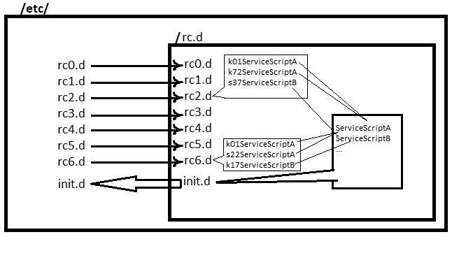

# 202.1. Customizing SysV-init system startup

## **202.1 Customizing SysV-init system startup**

**Weight:** 3

**Description:** Candidates should be able to query and modify the behaviour of system services at various targets / run levels. A thorough understanding of the systemd, SysV Init and the Linux boot process is required. This objective includes interacting with systemd targets and SysV init run levels.

**Key Knowledge Areas:**

* Systemd
* SysV init
* Linux Standard Base Specification \(LSB\)

**Terms and Utilities:**

* /usr/lib/systemd/
* /etc/systemd/
* /run/systemd/
* systemctl
* systemd-delta
* /etc/inittab
* /etc/init.d/
* /etc/rc.d/
* chkconfig
* update-rc.d
* init and telinit

### Over View

During the previous lessons we talked about initrd/initramfs. When the kernel completly loaded it searchs for init process to start it. init process can be init, upstart or systemd. Traditionally System v init is used to start other services but it has some short comings. So other solutions invented like upstart and systemd.

/sbin/init can be linked to upstart or systemd. to check which system you are running, check each directory existence:

| Directpry | Description \[if exist\] |
| :--- | :--- |
| /etc/init.d | Shows you have SysV in your linux box |
| /usr/share/upstart | You are on a Upstart Based system |
| /usr/lib/systemd | You are using Systemd-Based system |

also try stat /proc/1/exe

| link | Description |
| :--- | :--- |
| File: ‘/proc/1/exe’ -&gt; ‘/sbin/init’ | in SysV and upstart system |
| File: '/proc/1/exe' -&gt; '/lib/systemd/systemd' | in Systemd box |

### Sys v

System "5" or Sys "v" is an ancient method of handling system services from unix world back to 1980s. SysV uses serial loading of services, in another word each service must be loaded in sequence \(after each other\). SysV uses runlevels concept to define which stat the server should boot in. In each runlevel specific amount of shell scripts is processed to reach the state we desire.

runlevels start from 0 upto 6 and they are different in Redhat based and Debian based systems.

| runlevel | Redhat | Debian |
| :--- | :--- | :--- |
| 0 | System Halt \(do not set as default\) | System Halt \(do not use as default\) |
| 1 | Single User Mode | Single User Mode |
| 2 | Multi User without NFS | Full multi User mode with GUI\(default\) |
| 3 | Full Multi User Mode | --same as 2-- --unused-- |
| 4 | ---unused-- | --same as 2-- --unused-- |
| 5 | X11/Full Multi user Mode\(default\) | --same as 2-- --unused-- |
| 6 | reboot \(Do not set as initdefault\) | rebbot \(do not set as default\) |

/etc/inittab is SysV configuration file where default runlevel can be set, We use CentOS 5 for demonstration :

```text
#
# inittab       This file describes how the INIT process should set up
#               the system in a certain run-level.
#
# Author:       Miquel van Smoorenburg, <miquels@drinkel.nl.mugnet.org>
#               Modified for RHS Linux by Marc Ewing and Donnie Barnes
#

# Default runlevel. The runlevels used by RHS are:
#   0 - halt (Do NOT set initdefault to this)
#   1 - Single user mode
#   2 - Multiuser, without NFS (The same as 3, if you do not have networking)
#   3 - Full multiuser mode
#   4 - unused
#   5 - X11
#   6 - reboot (Do NOT set initdefault to this)
# 
id:5:initdefault:

# System initialization.
si::sysinit:/etc/rc.d/rc.sysinit

l0:0:wait:/etc/rc.d/rc 0
l1:1:wait:/etc/rc.d/rc 1
l2:2:wait:/etc/rc.d/rc 2
l3:3:wait:/etc/rc.d/rc 3
l4:4:wait:/etc/rc.d/rc 4
l5:5:wait:/etc/rc.d/rc 5
l6:6:wait:/etc/rc.d/rc 6

# Trap CTRL-ALT-DELETE
ca::ctrlaltdel:/sbin/shutdown -t3 -r now

# When our UPS tells us power has failed, assume we have a few minutes
# of power left.  Schedule a shutdown for 2 minutes from now.
# This does, of course, assume you have powerd installed and your
# UPS connected and working correctly.  
pf::powerfail:/sbin/shutdown -f -h +2 "Power Failure; System Shutting Down"

# If power was restored before the shutdown kicked in, cancel it.
pr:12345:powerokwait:/sbin/shutdown -c "Power Restored; Shutdown Cancelled"


# Run gettys in standard runlevels
1:2345:respawn:/sbin/mingetty tty1
2:2345:respawn:/sbin/mingetty tty2
3:2345:respawn:/sbin/mingetty tty3
4:2345:respawn:/sbin/mingetty tty4
5:2345:respawn:/sbin/mingetty tty5
6:2345:respawn:/sbin/mingetty tty6

# Run xdm in runlevel 5
x:5:respawn:/etc/X11/prefdm -nodaemon
```

By modifying id:5:initdefault: we can change the run level for the next time boot but there is another proper way :

### init / telinit

init and telinit commands are the same.how ever telinit is recommended. They are both used to change current system runlevel

```text
[root@centos5 ~]# telinit 3
```

and for come back to previous run level:

```text
[root@centos5 ~]# telinit 5
```

and to see previous runlevel and current runlevel use runlevel command:

```text
[root@centos5 ~]# runlevel
3 5
```

as you can see 3 was our previous runlevel and we have switched from it to 5.

### /etc/init.d and /etc/rc.d

as we said SysV runs scripts in sequence to start services. But how and where they are managed? its simple but implementation is some how complicated.



all scripts are inside /etc/rc.d/init.d but there are symbolic links to desired rc folder. each rc folder specify one runlevel. so if you want to manually start a service in a run level you can create a symbolic link inside desired rc folder from init.d folder and put a name with sequence for that. "K" for Kill the service and "S" to Start it.

### chkconfig

Exploring rc folders, creating symbolic links is a hard job. chkconfig is a great tool which let us turn on or off specific service or services in desired runlevel.lets start:

```text
[root@centos5 ~]# chkconfig 
chkconfig version 1.3.30.2 - Copyright (C) 1997-2000 Red Hat, Inc.
This may be freely redistributed under the terms of the GNU Public License.

usage:   chkconfig --list [name]
         chkconfig --add <name>
         chkconfig --del <name>
         chkconfig [--level <levels>] <name> <on|off|reset|resetpriorities>
[root@centos5 ~]# chkconfig --list
NetworkManager  0:off   1:off   2:off   3:off   4:off   5:off   6:off
acpid           0:off   1:off   2:on    3:on    4:on    5:on    6:off
anacron         0:off   1:off   2:on    3:on    4:on    5:on    6:off
atd             0:off   1:off   2:off   3:on    4:on    5:on    6:off
auditd          0:off   1:off   2:on    3:on    4:on    5:on    6:off
autofs          0:off   1:off   2:off   3:on    4:on    5:on    6:off
avahi-daemon    0:off   1:off   2:off   3:on    4:on    5:on    6:off
avahi-dnsconfd  0:off   1:off   2:off   3:off   4:off   5:off   6:off
bluetooth       0:off   1:off   2:on    3:on    4:on    5:on    6:off
conman          0:off   1:off   2:off   3:off   4:off   5:off   6:off
cpuspeed        0:off   1:on    2:on    3:on    4:on    5:on    6:off
crond           0:off   1:off   2:on    3:on    4:on    5:on    6:off
cups            0:off   1:off   2:on    3:on    4:on    5:on    6:off
dnsmasq         0:off   1:off   2:off   3:off   4:off   5:off   6:off
dund            0:off   1:off   2:off   3:off   4:off   5:off   6:off
firstboot       0:off   1:off   2:off   3:on    4:off   5:on    6:off
gpm             0:off   1:off   2:on    3:on    4:on    5:on    6:off
haldaemon       0:off   1:off   2:off   3:on    4:on    5:on    6:off
hidd            0:off   1:off   2:on    3:on    4:on    5:on    6:off
httpd           0:off   1:off   2:off   3:off   4:off   5:off   6:off
ip6tables       0:off   1:off   2:on    3:on    4:on    5:on    6:off
ipmi            0:off   1:off   2:off   3:off   4:off   5:off   6:off
iptables        0:off   1:off   2:on    3:on    4:on    5:on    6:off
irda            0:off   1:off   2:off   3:off   4:off   5:off   6:off
irqbalance      0:off   1:off   2:on    3:on    4:on    5:on    6:off
iscsi           0:off   1:off   2:off   3:on    4:on    5:on    6:off
iscsid          0:off   1:off   2:off   3:on    4:on    5:on    6:off
kudzu           0:off   1:off   2:off   3:on    4:on    5:on    6:off
lvm2-monitor    0:off   1:on    2:on    3:on    4:on    5:on    6:off
mcstrans        0:off   1:off   2:on    3:on    4:on    5:on    6:off
mdmonitor       0:off   1:off   2:on    3:on    4:on    5:on    6:off
mdmpd           0:off   1:off   2:off   3:off   4:off   5:off   6:off
messagebus      0:off   1:off   2:off   3:on    4:on    5:on    6:off
microcode_ctl   0:off   1:off   2:on    3:on    4:on    5:on    6:off
multipathd      0:off   1:off   2:off   3:off   4:off   5:off   6:off
netconsole      0:off   1:off   2:off   3:off   4:off   5:off   6:off
netfs           0:off   1:off   2:off   3:on    4:on    5:on    6:off
netplugd        0:off   1:off   2:off   3:off   4:off   5:off   6:off
network         0:off   1:off   2:on    3:on    4:on    5:on    6:off
nfs             0:off   1:off   2:off   3:off   4:off   5:off   6:off
nfslock         0:off   1:off   2:off   3:on    4:on    5:on    6:off
nscd            0:off   1:off   2:off   3:off   4:off   5:off   6:off
ntpd            0:off   1:off   2:off   3:off   4:off   5:off   6:off
oddjobd         0:off   1:off   2:off   3:off   4:off   5:off   6:off
pand            0:off   1:off   2:off   3:off   4:off   5:off   6:off
pcscd           0:off   1:off   2:on    3:on    4:on    5:on    6:off
portmap         0:off   1:off   2:off   3:on    4:on    5:on    6:off
psacct          0:off   1:off   2:off   3:off   4:off   5:off   6:off
rawdevices      0:off   1:off   2:off   3:on    4:on    5:on    6:off
rdisc           0:off   1:off   2:off   3:off   4:off   5:off   6:off
readahead_early 0:off   1:off   2:on    3:on    4:on    5:on    6:off
readahead_later 0:off   1:off   2:off   3:off   4:off   5:on    6:off
restorecond     0:off   1:off   2:on    3:on    4:on    5:on    6:off
rpcgssd         0:off   1:off   2:off   3:on    4:on    5:on    6:off
rpcidmapd       0:off   1:off   2:off   3:on    4:on    5:on    6:off
rpcsvcgssd      0:off   1:off   2:off   3:off   4:off   5:off   6:off
saslauthd       0:off   1:off   2:off   3:off   4:off   5:off   6:off
sendmail        0:off   1:off   2:on    3:on    4:on    5:on    6:off
smartd          0:off   1:off   2:on    3:on    4:on    5:on    6:off
sshd            0:off   1:off   2:on    3:on    4:on    5:on    6:off
svnserve        0:off   1:off   2:off   3:off   4:off   5:off   6:off
syslog          0:off   1:off   2:on    3:on    4:on    5:on    6:off
vmware-tools    0:off   1:off   2:on    3:on    4:on    5:on    6:off
vmware-tools-thinprint  0:off   1:off   2:on    3:on    4:on    5:on    6:off
vncserver       0:off   1:off   2:off   3:off   4:off   5:off   6:off
wdaemon         0:off   1:off   2:off   3:off   4:off   5:off   6:off
wpa_supplicant  0:off   1:off   2:off   3:off   4:off   5:off   6:off
xfs             0:off   1:off   2:on    3:on    4:on    5:on    6:off
ypbind          0:off   1:off   2:off   3:off   4:off   5:off   6:off
yum-updatesd    0:off   1:off   2:on    3:on    4:on    5:on    6:off
```

to change see some usefull examples:

| command | description |
| :--- | :--- |
| chkconfig &lt;service name&gt; on | start service on any unspecial run level\(3,4,5 centOS\) |
| chkconfig &lt;service name&gt; off | turn service off in all runlevels |
| chkconfig  --list &lt;service name&gt; | List service condition in all unlevels |
| chkconfig --level  345 &lt;service name&gt; on/off | Turn serve on/off in runlevel 3,4 and 5 |

### update-rc.d

in Debian based systems like ubuntu update-rc.d used as a command instead of chkconfig command

```text
root@ubuntu:/etc# update-rc.d
usage: update-rc.d [-n] [-f] <basename> remove
       update-rc.d [-n] <basename> defaults [NN | SS KK]
       update-rc.d [-n] <basename> start|stop NN runlvl [runlvl] [...] .
       update-rc.d [-n] <basename> disable|enable [S|2|3|4|5]
        -n: not really
        -f: force

The disable|enable API is not stable and might change in the future.

root@ubuntu:/etc# update-rc.d apparmor disable
update-rc.d: warning: apparmor start runlevel arguments (none) do not match LSB Default-Start values (S)
 Disabling system startup links for /etc/init.d/apparmor ...
 Removing any system startup links for /etc/init.d/apparmor ...
   /etc/rc0.d/K63apparmor
 Adding system startup for /etc/init.d/apparmor ...
   /etc/rc0.d/K63apparmor -> ../init.d/apparmor
```

### upstart

The first serious attempt to replace systemV was upstart, created by ubuntu. upstart is reactionary, means it takes events and based on them run jobs. In comparison with SysV upstart is more flexible but still it uses scripts and like SysV has some shortages. Although upstart is backward compatible and lets us to use SysV commands. if your system has /etc/init directory it us using upstart.

upstart keeps all previous SysV Folders and uses it, We use Ubuntu 14 machine :

```text
root@server1:/etc# cd /etc/init.d/ && ls
acpid          dns-clean          procps      single
anacron        friendly-recovery  pulseaudio  skeleton
apparmor       grub-common        rc          speech-dispatcher
apport         halt               rc.local    sudo
avahi-daemon   irqbalance         rcS         thermald
bluetooth      kerneloops         README      udev
brltty         killprocs          reboot      umountfs
console-setup  kmod               resolvconf  umountnfs.sh
cron           lightdm            rsync       umountroot
cups           networking         rsyslog     unattended-upgrades
cups-browsed   ondemand           saned       urandom
dbus           pppd-dns           sendsigs    x11-common

root@server1:~# cd /etc/rc6.d/ && ls -l
total 4
lrwxrwxrwx 1 root root  29 Dec  9 02:07 K10unattended-upgrades -> ../init.d/unattended-upgrades
lrwxrwxrwx 1 root root  20 Dec  9 02:07 K20kerneloops -> ../init.d/kerneloops
lrwxrwxrwx 1 root root  15 Dec  9 02:07 K20rsync -> ../init.d/rsync
lrwxrwxrwx 1 root root  27 Dec  9 02:07 K20speech-dispatcher -> ../init.d/speech-dispatcher
-rw-r--r-- 1 root root 351 Mar 12  2014 README
lrwxrwxrwx 1 root root  18 Dec  9 02:07 S20sendsigs -> ../init.d/sendsigs
lrwxrwxrwx 1 root root  17 Dec  9 02:07 S30urandom -> ../init.d/urandom
lrwxrwxrwx 1 root root  22 Dec  9 02:07 S31umountnfs.sh -> ../init.d/umountnfs.sh
lrwxrwxrwx 1 root root  18 Dec  9 02:07 S40umountfs -> ../init.d/umountfs
lrwxrwxrwx 1 root root  20 Dec  9 02:07 S60umountroot -> ../init.d/umountroot
lrwxrwxrwx 1 root root  16 Dec  9 02:07 S90reboot -> ../init.d/reboot
```

The configuration files of native upstart services are in /etc/init/ directory :

```text
root@server1:/etc/init# ls 
acpid.conf                   mtab.sh.conf
alsa-restore.conf            networking.conf
alsa-state.conf              network-interface.conf
alsa-store.conf              network-interface-container.conf
anacron.conf                 network-interface-security.conf
apport.conf                  network-manager.conf
avahi-cups-reload.conf       passwd.conf
avahi-daemon.conf            plymouth.conf
bluetooth.conf               plymouth-log.conf
bootmisc.sh.conf             plymouth-ready.conf
checkfs.sh.conf              plymouth-shutdown.conf
checkroot-bootclean.sh.conf  plymouth-splash.conf
checkroot.sh.conf            plymouth-stop.conf
console.conf                 plymouth-upstart-bridge.conf
console-font.conf            procps.conf
console-setup.conf           pulseaudio.conf
container-detect.conf        rc.conf
control-alt-delete.conf      rcS.conf
cron.conf                    rc-sysinit.conf
cups-browsed.conf            resolvconf.conf
cups.conf                    rfkill-restore.conf
dbus.conf                    rfkill-store.conf
dmesg.conf                   rsyslog.conf
failsafe.conf                setvtrgb.conf
failsafe-x.conf              shutdown.conf
flush-early-job-log.conf     startpar-bridge.conf
friendly-recovery.conf       systemd-logind.conf
gpu-manager.conf             thermald.conf
hostname.conf                tty1.conf
hwclock.conf                 tty2.conf
hwclock-save.conf            tty3.conf
irqbalance.conf              tty4.conf
kmod.conf                    tty5.conf
lightdm.conf                 tty6.conf
modemmanager.conf            udev.conf
mountall-bootclean.sh.conf   udev-fallback-graphics.conf
mountall.conf                udev-finish.conf
mountall-net.conf            udevmonitor.conf
mountall-reboot.conf         udevtrigger.conf
mountall.sh.conf             ufw.conf
mountall-shell.conf          upstart-file-bridge.conf
mountdevsubfs.sh.conf        upstart-socket-bridge.conf
mounted-debugfs.conf         upstart-udev-bridge.conf
mounted-dev.conf             ureadahead.conf
mounted-proc.conf            ureadahead-other.conf
mounted-run.conf             usb-modeswitch-upstart.conf
mounted-tmp.conf             vmware-tools.conf
mounted-var.conf             vmware-tools-thinprint.conf
mountkernfs.sh.conf          wait-for-state.conf
mountnfs-bootclean.sh.conf   whoopsie.conf
```

as an example let take a look at inside of ufw.conf:

```text
# ufw - Uncomplicated Firewall
#
# The Uncomplicated Firewall is a front-end for iptables, to make managing a
# Netfilter firewall easier.

description     "Uncomplicated firewall"

# Make sure we start before an interface receives traffic
start on (starting network-interface
          or starting network-manager
          or starting networking)

stop on runlevel [!023456]

console output

pre-start exec /lib/ufw/ufw-init start quiet
post-stop exec /lib/ufw/ufw-init stop
```

How upstart keeps backward compatibility and live beside old SysV? the secret is inside /etc/init/rcS.conf :

```text
# rcS - System V single-user mode compatibility
#
# This task handles the old System V-style single-user mode, this is
# distinct from the other runlevels since running the rc script would
# be bad.

description    "System V single-user mode compatibility"
author        "Scott James Remnant <scott@netsplit.com>"

start on runlevel S
stop on runlevel [!S]

console owner
exec /sbin/sulogin

post-stop script
    # Don't switch runlevels if we were stopped by an event, since that
    # means we're already switching runlevels
    if [ -n "${UPSTART_STOP_EVENTS}" ]
    then
    exit 0
    fi

    # Switch, passing a magic flag
    start --no-wait rc-sysinit FROM_SINGLE_USER_MODE=y
end script
```

bu using rcS.conf upstart can run SysV scripts which haven't been developed for upstart natively .

### Systemd

Systemd is used in all modern linuxes. Its a new way of starting linux services but that is not all. The idea of Systemd project is scary! Systemd developers have this idea to create Systemd OS which runs on linux OS. So it seems usual if we know it has its own tool which work like cron, or fstab, rsyslog ... .

In Systemd world we have tragets and unit files, targets is like our goal which we want to reach. But for reaching targets we need to specified what ever is needed to be load in unit files. As Systemd doing variety of thing, there for different types of unit files exists:

* service : unit file to start a service considering its dependencies
* mount : replace the mount in /etc/fstab
* timer : replacement for cron 
* automount : mount a directory when needed
* target : as we said a bunch of unit files :\), target is an end point, tragets can be used as runlevel .
* path :observ activities on a path and start a service associated with that
* ... 

### /usr/lib/systemd/system and /etc/systemd/system

Orginal systemd ubit files are in /usr/lib/systemd/system directory but they should not be modified by administrators. Modification should be done in /etc/systemd/system and its good to know that they are linked. Inorde to do any modification we should copy service files from /usr/lib/systemd/system to /etc/systemd/system and then set our settings, we use Ubuntu 16:

```text
[root@server1 system]# cd /usr/lib/systemd/system && ls 
abrt-ccpp.service                        plymouth-poweroff.service
abrtd.service                            plymouth-quit.service
abrt-oops.service                        plymouth-quit-wait.service
abrt-pstoreoops.service                  plymouth-read-write.service
abrt-vmcore.service                      plymouth-reboot.service
abrt-xorg.service                        plymouth-start.service
accounts-daemon.service                  plymouth-switch-root.service
alsa-restore.service                     polkit.service
alsa-state.service                       postfix.service
alsa-store.service                       poweroff.target
anaconda-direct.service                  poweroff.target.wants
anaconda-nm-config.service               printer.target
anaconda-noshell.service                 proc-fs-nfsd.mount
anaconda-pre.service                     proc-sys-fs-binfmt_misc.automount
anaconda.service                         proc-sys-fs-binfmt_misc.mount
anaconda-shell@.service                  psacct.service
anaconda-sshd.service                    qemu-guest-agent.service
anaconda.target                          quotaon.service
anaconda-tmux@.service                   radvd.service
arp-ethers.service                       rc-local.service
atd.service                              rdisc.service
auditd.service                           rdma-ndd.service
auth-rpcgss-module.service               rdma.service
autofs.service                           realmd.service
autovt@.service                          reboot.target
avahi-daemon.service                     reboot.target.wants
avahi-daemon.socket                      remote-fs-pre.target
basic.target                             remote-fs.target
basic.target.wants                       rescue.service
blk-availability.service                 rescue.target
bluetooth.service                        rescue.target.wants
bluetooth.target                         rhel-autorelabel-mark.service
brandbot.path                            rhel-autorelabel.service
brandbot.service                         rhel-configure.service
brltty.service                           rhel-dmesg.service
canberra-system-bootup.service           rhel-domainname.service
canberra-system-shutdown-reboot.service  rhel-import-state.service
canberra-system-shutdown.service         rhel-loadmodules.service
certmonger.service                       rhel-readonly.service
cgconfig.service                         rngd.service
cgdcbxd.service                          rpcbind.service
cgred.service                            rpcbind.socket
chrony-dnssrv@.service                   rpcbind.target
chrony-dnssrv@.timer                     rpc-gssd.service
chronyd.service                          rpcgssd.service
chrony-wait.service                      rpcidmapd.service
colord.service                           rpc-rquotad.service
configure-printer@.service               rpc-statd-notify.service
console-getty.service                    rpc-statd.service
console-shell.service                    rsyncd.service
container-getty@.service                 rsyncd@.service
cpupower.service                         rsyncd.socket
crond.service                            rsyslog.service
cryptsetup-pre.target                    rtkit-daemon.service
cryptsetup.target                        runlevel0.target
ctrl-alt-del.target                      runlevel1.target
cups-browsed.service                     runlevel1.target.wants
cups.path                                runlevel2.target
cups.service                             runlevel2.target.wants
cups.socket                              runlevel3.target
dbus-org.freedesktop.hostname1.service   runlevel3.target.wants
dbus-org.freedesktop.import1.service     runlevel4.target
dbus-org.freedesktop.locale1.service     runlevel4.target.wants
dbus-org.freedesktop.login1.service      runlevel5.target
dbus-org.freedesktop.machine1.service    runlevel5.target.wants
dbus-org.freedesktop.timedate1.service   runlevel6.target
dbus.service                             saslauthd.service
dbus.socket                              selinux-policy-migrate-local-changes@.service
dbus.target.wants                        serial-getty@.service
debug-shell.service                      shutdown.target
default.target                           shutdown.target.wants
default.target.wants                     sigpwr.target
dev-hugepages.mount                      sleep.target
dev-mqueue.mount                         -.slice
dm-event.service                         slices.target
dm-event.socket                          smartcard.target
dmraid-activation.service                smartd.service
dnsmasq.service                          sockets.target
dracut-cmdline.service                   sockets.target.wants
dracut-initqueue.service                 sound.target
dracut-mount.service                     speech-dispatcherd.service
dracut-pre-mount.service                 spice-vdagentd.service
dracut-pre-pivot.service                 spice-vdagentd.target
dracut-pre-trigger.service               sshd-keygen.service
dracut-pre-udev.service                  sshd.service
dracut-shutdown.service                  sshd@.service
ebtables.service                         sshd.socket
emergency.service                        sssd-autofs.service
emergency.target                         sssd-autofs.socket
fcoe.service                             sssd-nss.service
final.target                             sssd-nss.socket
firewalld.service                        sssd-pac.service
firstboot-graphical.service              sssd-pac.socket
flatpak-system-helper.service            sssd-pam-priv.socket
fprintd.service                          sssd-pam.service
fstrim.service                           sssd-pam.socket
fstrim.timer                             sssd-secrets.service
gdm.service                              sssd-secrets.socket
geoclue.service                          sssd.service
getty@.service                           sssd-ssh.service
getty.target                             sssd-ssh.socket
graphical.target                         sssd-sudo.service
graphical.target.wants                   sssd-sudo.socket
gssproxy.service                         suspend.target
halt-local.service                       svnserve.service
halt.target                              swap.target
halt.target.wants                        sys-fs-fuse-connections.mount
hibernate.target                         sysinit.target
hybrid-sleep.target                      sysinit.target.wants
hypervfcopyd.service                     sys-kernel-config.mount
hypervkvpd.service                       sys-kernel-debug.mount
hypervvssd.service                       syslog.socket
initial-setup-graphical.service          syslog.target.wants
initial-setup-reconfiguration.service    sysstat.service
initial-setup.service                    systemd-ask-password-console.path
initial-setup-text.service               systemd-ask-password-console.service
initrd-cleanup.service                   systemd-ask-password-plymouth.path
initrd-fs.target                         systemd-ask-password-plymouth.service
initrd-parse-etc.service                 systemd-ask-password-wall.path
initrd-root-fs.target                    systemd-ask-password-wall.service
initrd-switch-root.service               systemd-backlight@.service
initrd-switch-root.target                systemd-binfmt.service
initrd-switch-root.target.wants          systemd-bootchart.service
initrd.target                            systemd-firstboot.service
initrd.target.wants                      systemd-fsck-root.service
initrd-udevadm-cleanup-db.service        systemd-fsck@.service
instperf.service                         systemd-halt.service
iprdump.service                          systemd-hibernate-resume@.service
iprinit.service                          systemd-hibernate.service
iprupdate.service                        systemd-hostnamed.service
iprutils.target                          systemd-hwdb-update.service
ipsec.service                            systemd-hybrid-sleep.service
irqbalance.service                       systemd-importd.service
iscsid.service                           systemd-initctl.service
iscsid.socket                            systemd-initctl.socket
iscsi.service                            systemd-journal-catalog-update.service
iscsi-shutdown.service                   systemd-journald.service
iscsiuio.service                         systemd-journald.socket
iscsiuio.socket                          systemd-journal-flush.service
kdump.service                            systemd-kexec.service
kexec.target                             systemd-localed.service
kexec.target.wants                       systemd-logind.service
kmod-static-nodes.service                systemd-machined.service
kpatch.service                           systemd-machine-id-commit.service
ksm.service                              systemd-modules-load.service
ksmtuned.service                         systemd-nspawn@.service
libstoragemgmt.service                   systemd-poweroff.service
libvirtd.service                         systemd-quotacheck.service
lldpad.service                           systemd-random-seed.service
lldpad.socket                            systemd-readahead-collect.service
local-fs-pre.target                      systemd-readahead-done.service
local-fs.target                          systemd-readahead-done.timer
local-fs.target.wants                    systemd-readahead-drop.service
lvm2-lvmetad.service                     systemd-readahead-replay.service
lvm2-lvmetad.socket                      systemd-reboot.service
lvm2-lvmpolld.service                    systemd-remount-fs.service
lvm2-lvmpolld.socket                     systemd-rfkill@.service
lvm2-monitor.service                     systemd-shutdownd.service
lvm2-pvscan@.service                     systemd-shutdownd.socket
machine.slice                            systemd-suspend.service
machines.target                          systemd-sysctl.service
mdadm-grow-continue@.service             systemd-timedated.service
mdadm-last-resort@.service               systemd-tmpfiles-clean.service
mdadm-last-resort@.timer                 systemd-tmpfiles-clean.timer
mdmonitor.service                        systemd-tmpfiles-setup-dev.service
mdmon@.service                           systemd-tmpfiles-setup.service
messagebus.service                       systemd-udevd-control.socket
microcode.service                        systemd-udevd-kernel.socket
ModemManager.service                     systemd-udevd.service
multipathd.service                       systemd-udev-settle.service
multi-user.target                        systemd-udev-trigger.service
multi-user.target.wants                  systemd-update-done.service
netcf-transaction.service                systemd-update-utmp-runlevel.service
NetworkManager-dispatcher.service        systemd-update-utmp.service
NetworkManager.service                   systemd-user-sessions.service
NetworkManager-wait-online.service       systemd-vconsole-setup.service
network-online.target                    system.slice
network-online.target.wants              system-update.target
network-pre.target                       system-update.target.wants
network.target                           target.service
nfs-blkmap.service                       tcsd.service
nfs-client.target                        teamd@.service
nfs-config.service                       timers.target
nfs-idmapd.service                       timers.target.wants
nfs-idmap.service                        time-sync.target
nfs-lock.service                         tmp.mount
nfslock.service                          tuned.service
nfs-mountd.service                       udisks2.service
nfs-rquotad.service                      umount.target
nfs-secure.service                       upower.service
nfs-server.service                       usb_modeswitch@.service
nfs.service                              usbmuxd.service
nfs-utils.service                        user.slice
nss-lookup.target                        var-lib-nfs-rpc_pipefs.mount
nss-user-lookup.target                   vgauthd.service
ntpdate.service                          virt-guest-shutdown.target
ntpd.service                             virtlockd.service
numad.service                            virtlockd.socket
oddjobd.service                          virtlogd.service
packagekit-offline-update.service        virtlogd.socket
packagekit.service                       vmtoolsd.service
paths.target                             wacom-inputattach@.service
plymouth-halt.service                    wpa_supplicant.service
plymouth-kexec.service                   zram.service


[root@server1 system]# cd /etc/systemd/system/ && ls -l
total 4
drwxr-xr-x. 2 root root   31 Oct 28 11:21 basic.target.wants
drwxr-xr-x. 2 root root   31 Oct 28 11:20 bluetooth.target.wants
lrwxrwxrwx. 1 root root   41 Oct 28 11:20 dbus-org.bluez.service -> /usr/lib/systemd/system/bluetooth.service
lrwxrwxrwx. 1 root root   41 Oct 28 11:20 dbus-org.fedoraproject.FirewallD1.service -> /usr/lib/systemd/system/firewalld.service
lrwxrwxrwx. 1 root root   44 Oct 28 11:21 dbus-org.freedesktop.Avahi.service -> /usr/lib/systemd/system/avahi-daemon.service
lrwxrwxrwx. 1 root root   44 Oct 28 11:21 dbus-org.freedesktop.ModemManager1.service -> /usr/lib/systemd/system/ModemManager.service
lrwxrwxrwx. 1 root root   46 Oct 28 11:20 dbus-org.freedesktop.NetworkManager.service -> /usr/lib/systemd/system/NetworkManager.service
lrwxrwxrwx. 1 root root   57 Oct 28 11:20 dbus-org.freedesktop.nm-dispatcher.service -> /usr/lib/systemd/system/NetworkManager-dispatcher.service
lrwxrwxrwx. 1 root root   36 Oct 28 11:25 default.target -> /lib/systemd/system/graphical.target
drwxr-xr-x. 2 root root   87 Oct 28 11:20 default.target.wants
drwxr-xr-x. 2 root root   38 Oct 28 11:21 dev-virtio\x2dports-org.qemu.guest_agent.0.device.wants
lrwxrwxrwx. 1 root root   35 Oct 28 11:21 display-manager.service -> /usr/lib/systemd/system/gdm.service
drwxr-xr-x. 2 root root   32 Oct 28 11:20 getty.target.wants
drwxr-xr-x. 2 root root   65 Oct 28 11:27 graphical.target.wants
drwxr-xr-x. 2 root root 4096 Oct 28 11:27 multi-user.target.wants
drwxr-xr-x. 2 root root   26 Oct 28 11:21 printer.target.wants
drwxr-xr-x. 2 root root   31 Oct 28 11:20 remote-fs.target.wants
drwxr-xr-x. 2 root root  188 Oct 28 11:21 sockets.target.wants
drwxr-xr-x. 2 root root   36 Oct 28 11:21 spice-vdagentd.target.wants
drwxr-xr-x. 2 root root   26 Oct 28 11:20 sssd.service.d
drwxr-xr-x. 2 root root  169 Oct 28 11:20 sysinit.target.wants
drwxr-xr-x. 2 root root   44 Oct 28 11:20 system-update.target.wants
drwxr-xr-x. 2 root root   29 Oct 28 11:20 vmtoolsd.service.requires
```

As you have probably seen Systemd works with different dependencies:

| Dependency | Description |
| :--- | :--- |
| Requires | define unit files must beloaded, if not load it |
| wants | \[seen in targets\], specify unit files which must be loaded but if not, takes it easy and continue |
| requisite | must be already loaded, if not loaded fails |
| confilicts | unit files which never be activated with current unit file |
| before | current unit files activated before listed unit files |
| after | current unit file activated after listed unit file |

### systemctl

systemctl is systemd magic command to work with services:

| systemctl useful commands |  |
| :--- | :--- |
| systemctl start &lt;ServiceName&gt; | to start a service |
| systemctl stop &lt;ServiceName&gt; | to stop |
| systemctl disable &lt;ServiceName&gt; | disable it, won't be activated even after reboot |
| systemctl enable &lt;ServiceName&gt; | enable a service |
| systemctl relaod &lt;ServiceName&gt; | reload a service by reading its conf file,\[might not work\] |
| systemctl restart &lt;ServiceName&gt; | stop and start a service |
| systemctl list-unit-files --type=service | same as chkconf --list but in systemd environment |
| systemctl daemon-reload | Reload systemd Daemon, used after unit files modification |
| systemctl list-depencencies | List targets and services dependencies |

### For the History:

| Distro | Pre 2006 | 2006 \(14.04\)-2019 | 2015\(15.10\)-???? |
| :--- | :--- | :--- | :--- |
| ubuntu | SysV | Upstart | Systemd |

|  | 2007 | 2011-2020 | 2014-???? |
| :--- | :--- | :--- | :--- |
| centOS | SysV \(centOS 5\) | Upstart \(centOS6\) | systemd \(centOS 7\) |

.

.

.

