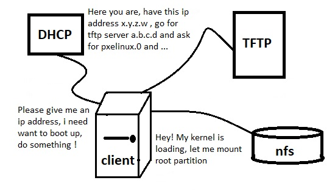

# 202.3. Alternate Bootloaders

1. [ ] **202.3 Alternate Bootloaders**

**Weight:** 2

Description: Candidates should be aware of other bootloaders and their major features.

**Key Knowledge Areas:**

* SYSLINUX, ISOLINUX, PXELINUX
* Understanding of PXE for both BIOS and UEFI
* Awareness of systemd-boot and U-Boot

**Terms and Utilities:**

* syslinux
* extlinux
* isolinux.bin
* isolinux.cfg
* isohdpfx.bin
* efiboot.img
* pxelinux.0
* pxelinux.cfg/
* uefi/shim.efi
* uefi/grubx64.efi

### Linux Boot Loader

The grandfather of all linux boot loaders is LiLo \(Linux boot Loader\). LiLo has its configuration file in /etc/lilo.conf which was compiled to binary and reside on first sectors of hard disk. But all those good days of simplicity have been passed.

```text
#sample lilo.conf of system configured to boot 2 operating system.
boot=/dev/hda
map=/boot/map
install=/boot/boot.b
prompt
timeout=50
message=/boot/message
lba32
default=linux

image=/boot/vmlinuz-2.4.0-0.43.6
    label=linux
    initrd=/boot/initrd-2.4.0-0.43.6.img
    read-only
    root=/dev/hda5

other=/dev/hda1
    label=dos
```

LiLo has some shortages which is way grub and grub2 has developed. But beside these Boot Loaders there are some other Boot Loaders which are not leaders but have been developed for specific purposes. As not all system has ext file system, we might need to load linux from inside of other files systems or partitions:

| Boor Loader | Supported File System\(s\) | Used Media |
| :--- | :--- | :--- |
| syslinux | ms-dos \(FAT32\) | USB |
| ext linux | FAT32 , ext3, ext4 | usually used on Hard Disk |
| iso linux | create .iso files | CD/DVD |

## syslinux

Lets try syslinux , we want to make a bootable usb disk using syslinux on 8 gig flash with FAT32 file system:

```text
root@server1:~# lsblk
NAME   MAJ:MIN RM  SIZE RO TYPE MOUNTPOINT
sdb      8:16   1  7.5G  0 disk 
└─sdb1   8:17   1  7.5G  0 part /media/myflash
sr0     11:0    1  1.5G  0 rom  /media/payam/Ubuntu 16.04.3 LTS amd64
fd0      2:0    1    4K  0 disk 
sda      8:0    0   50G  0 disk 
├─sda2   8:2    0    1K  0 part 
├─sda5   8:5    0 1021M  0 part [SWAP]
└─sda1   8:1    0   49G  0 part /
root@server1:~# umount /media/myflash 
root@server1:~# mkfs.vfat -F 32 -n KING8GIG /dev/sdb1
mkfs.fat 3.0.28 (2015-05-16)
root@server1:~# fdisk -l /dev/sdb1
Disk /dev/sdb1: 7.5 GiB, 8026849280 bytes, 15677440 sectors
Units: sectors of 1 * 512 = 512 bytes
Sector size (logical/physical): 512 bytes / 512 bytes
I/O size (minimum/optimal): 512 bytes / 512 bytes
Disklabel type: dos
Disk identifier: 0x00000000
```

Lets install syslinux in our system:

```text
root@server1:~# apt install syslinux syslinux-utils
```

And install syslinux on the flash:

```text
root@server1:~# syslinux -maf /dev/sdb1
```

This command copy tiny file /usr/lib/syslinux/mbr/mbr.bin on the first 512 bytes of flash disk and make it bootbale.

```text
root@server1:~# mount /dev/sdb1 /media/myflash/
root@server1:~# mkdir /media/myflash/syslinux
root@server1:~# cp /usr/lib/syslinux/modules/bios/{libcom32.c32,libutil.c32,vesamenu.c32} /media/myflash/syslinux/
```

make a folder in order to put linux sources there:

```text
root@server1:~# mkdir /media/myflash/iso
root@server1:~# mkdir /media/myflash/iso/ubuntu_1604
```

syslinux configuration file is syslinux.cfg, create like this:

```text
DEFAULT Ubuntu_1604
PROMPT 0
allowoptions 0
TIMEOUT 100
UI vesamenu.c32
MENU syslinux USB Multiboot Key

LABEL Ubuntu_1604
MENU LABEL Ubuntu 14.04 Trusty Thar
kernel /syslinux/iso/ubuntu_1604/casper/vmlinuz.efi
append initrd=/syslinux/iso/ubuntu_1604/casper/initrd.lz live-media-path=/syslinux/iso/ubuntu_1604/casper boot=live console-setup/layoutcode=it ignore_uuid boot=casper quiet splash --

LABEL 2nd OS
MENU LABEL Your 2nd OS
kernel 
append 

LABEL 3rd OS
MENU LABEL Your 3rd OS
kernel 
append
```

Now make desired folder in /syslinux/iso/... and copy source files:

```text
root@server1:~# mkdir /media/myflash/syslinux/iso
root@server1:~# mkdir /media/myflash/syslinux/iso/ubuntu_1404
root@server1:~# mkdir /media/ubuntu1404
root@server1:~# mount -t iso9660 -o loop,ro /tmp/ubuntu-14.04.3-desktop-amd64.iso /media/ubuntu1404/
root@server1:~# cp -r /media/ubuntu1404/* /media/myflash/syslinux/iso/ubuntu_1404/
cp: cannot create symbolic link '/media/myflash/syslinux/iso/ubuntu_1404/dists/stable': Operation not permitted
cp: cannot create symbolic link '/media/myflash/syslinux/iso/ubuntu_1404/dists/unstable': Operation not permitted
cp: cannot create symbolic link '/media/myflash/syslinux/iso/ubuntu_1404/ubuntu': Operation not permitted
```

as we are using FAT32 file system symbolic links are not supported so that right, lets chek:


## extlinux

extlinux is another member of syslinux family, lets install and use it intead of grub in our system:

```text
root@server1:~# apt install extlinux syslinux-common
root@server1:~# extlinux --install /boot/extlinux/
/boot/extlinux/ is device /dev/sda1
root@server1:~# dd if=/usr/lib/syslinux/mbr/mbr.bin of=/dev/sda
0+1 records in
0+1 records out
440 bytes copied, 0.0061595 s, 71.4 kB/s
root@server1:~# cp /usr/lib/syslinux/modules/bios/{libcom32.c32,libutil.c32,vesamenu.c32} /boot/extlinux/
```

and create syslinux.cfg in /boot/extlinux/ directory like this:

```text
PROMPT 0
TIMEOUT 100
UI vesamenu.c32
MENU TITLE extlinux bootloader menu
label Ubuntu
      menu label Ubuntu 16.04.3 
      kernel /boot/vmlinuz-4.10.0-28-generic 
      append root=/dev/sda1 initrd=/boot/initrd.img-4.10.0-28-generic
```

and enjoy the result:


## isolinux

```text
root@server1:~# wget https://www.kernel.org/pub/linux/utils/boot/syslinux/syslinux-6.03.tar.gz
root@server1:~# tar -xvf syslinux-6.03.tar.gz 
root@server1:~# ls -l
total 11404
drwxrwxr-x 33 1026 1026     4096 Oct  6  2014 syslinux-6.03
-rw-r--r--  1 root root 11671940 Oct  6  2014 syslinux-6.03.tar.gz
root@server1:~# mkdir cdroot

root@server1:~# cp syslinux-6.03/bios/core/isolinux.bin cdroot/

root@server1:~# cp syslinux-6.03/bios/com32/elflink/ldlinux/ldlinux.c32 cdroot/

root@server1:~# cp syslinux-6.03/bios/com32/lib/libcom32.c32 cdroot/
root@server1:~# cp syslinux-6.03/bios/com32/libutil/libutil.c32 cdroot/
root@server1:~# cp syslinux-6.03/bios/com32/menu/vesamenu.c32 cdroot/

root@server1:~# cp /boot/vmlinuz-4.10.0-28-generic cdroot/vmlinuz
root@server1:~# cp /boot/initrd.img-4.10.0-28-generic  cdroot/initrd
```

now create isolinux.cfg file insode cdroot/ directory :

```text
PROMPT 0
TIMEOUT 100
UI vesamenu.c32
MENU TITLE isolinux bootloader menu
label Ubuntu
 menu label Ubuntu 16.04.3 
    kernel vmlinuz
    append initrd=initrd root=/dev/sda1
```

Lets create bootable media from folder that we have made:

```text
root@server1:~# cp syslinux-6.03/bios/core/isolinux.bin .
root@server1:~# mkisofs -o bootcd.iso -b isolinux.bin -c boot.cat -no-emul-boot -boot-load-size 4 -boot-info-table -input-charset utf8 cdroot
Size of boot image is 4 sectors -> No emulation
 20.58% done, estimate finish Sun Dec 24 00:31:31 2017
 41.09% done, estimate finish Sun Dec 24 00:31:33 2017
 61.66% done, estimate finish Sun Dec 24 00:31:32 2017
 82.17% done, estimate finish Sun Dec 24 00:31:32 2017
Total translation table size: 2048
Total rockridge attributes bytes: 0
Total directory bytes: 0
Path table size(bytes): 10
Max brk space used 0
24339 extents written (47 MB)
```

and lets boot the system with bootcd.iso :


you can see that the system will be booted up using initrd and vmlinuz that we have put in CD and then follow next required steps from hard disk.

## uefi/shim.efi & uefi/grubx64.efi

As we have talked uefi runs everything which we have put inside EFI System Partition, special FAT32 partition. So from security perspective its some how dangerous. Because boot loaders might be changed or manipulated.To avoid that we can digitally sign boot loaders. But the problem is that boot loaders update! They are changed time to time. Using a tiny fix boot loader before main boot bootloader which loads before main bootloader\(grub\) and run it in sub sequence. So in case of update or upgrade this tiny boot loader remains safe and secure and just watch for grub folder changes in order to refer to it. this tine bootloader is shim.efi.

```text
root@server3:/boot/efi/EFI/ubuntu# pwd
/boot/efi/EFI/ubuntu
root@server3:/boot/efi/EFI/ubuntu# tree
.
├── fw
├── fwupx64.efi
├── grub.cfg
├── grubx64.efi
├── mmx64.efi
└── shimx64.efi

1 directory, 5 files

root@server3:/boot/efi/EFI/ubuntu# dpkg -S shimx64.efi 
shim: /usr/lib/shim/shimx64.efi
shim-signed: /usr/lib/shim/shimx64.efi.signed
```

lets take a look at inside and verify if its calling grub:

```text
root@server3:/boot/efi/EFI/ubuntu# hexdump -C shimx64.efi | egrep -i -C 2 'grub|g.r.u.b'
000ab900  74 00 20 00 4d 00 6f 00  6b 00 49 00 67 00 6e 00  |t. .M.o.k.I.g.n.|
000ab910  6f 00 72 00 65 00 44 00  42 00 3a 00 20 00 25 00  |o.r.e.D.B.:. .%.|
000ab920  72 00 0a 00 00 00 5c 00  67 00 72 00 75 00 62 00  |r.....\.g.r.u.b.|
000ab930  78 00 36 00 34 00 2e 00  65 00 66 00 69 00 00 00  |x.6.4...e.f.i...|
000ab940  46 00 61 00 69 00 6c 00  65 00 64 00 20 00 74 00  |F.a.i.l.e.d. .t.|
--
000abcb0  69 00 6e 00 20 00 69 00  6e 00 73 00 65 00 63 00  |i.n. .i.n.s.e.c.|
000abcc0  75 00 72 00 65 00 20 00  6d 00 6f 00 64 00 65 00  |u.r.e. .m.o.d.e.|
000abcd0  0a 00 00 00 00 00 00 00  5c 67 72 75 62 78 36 34  |........\grubx64|
000abce0  2e 65 66 69 00 74 66 74  70 3a 2f 2f 00 00 00 00  |.efi.tftp://....|
000abcf0  55 00 52 00 4c 00 53 00  20 00 4d 00 55 00 53 00  |U.R.L.S. .M.U.S.|
--
00111990  58 35 30 39 5f 41 54 54  52 49 42 55 54 45 5f 63  |X509_ATTRIBUTE_c|
001119a0  72 65 61 74 65 5f 62 79  5f 4f 42 4a 00 69 6e 69  |reate_by_OBJ.ini|
001119b0  74 5f 67 72 75 62 00 58  35 30 39 5f 74 72 75 73  |t_grub.X509_trus|
001119c0  74 5f 63 6c 65 61 72 00  42 49 4f 5f 73 5f 6e 75  |t_clear.BIO_s_nu|
001119d0  6c 6c 00 58 35 30 39 76  33 5f 67 65 74 5f 65 78  |ll.X509v3_get_ex|
```

and to see what is inside grubx64.efi:

```text
root@server3:/boot/efi/EFI/ubuntu# strings grubx64.efi | grep grub.cfg 
%s/grub.cfg

root@server3:/boot/efi/EFI/ubuntu# dpkg -S shimx64.efi 
shim: /usr/lib/shim/shimx64.efi
shim-signed: /usr/lib/shim/shimx64.efi.signed
```

## PXELINUX

Up to now we have booted up our system with Hard Disk, USB drive and CD/DVD ROM. The last topic here is booting up your system trough the network. Pixie or Pre Execution Environment is a name which is called to this environment. It describe standardize client-server environment at which client has a pxe-support network interface and its able to boot up from the network. Obviously client cant be alone in this environment and we need DHCP, TFTP and nfs servers.

### How dose it work ?



When Client boots up it starts asking for an ip address, DHCP server receives its requests and as our client is pxe-support, DHCP gives it an IP Address and the IP address of TFTP server and required files. Now taht client has an IP address goes for TFTP server and download boot loader and the kernel stuff form TFTP server. Kernel and its modules are downloaded by the client trough the network and they are loaded into RAM. And part of kernel loading process it Tries to mount root partition by mounting it from a NFS server. and system boots up .

