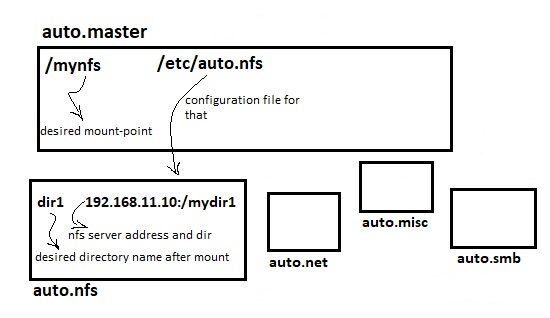

# 203.3. Creating and configuring filesystem options

**203.3 Creating and configuring filesystem options**

**Weight:** 2

**Description:** Candidates should be able to configure automount filesystems using AutoFS. This objective includes configuring automount for network and device filesystems. Also included is creating filesystems for devices such as CD-ROMs and a basic feature knowledge of encrypted filesystems.

**Key Knowledge Areas:**

* autofs configuration files
* Understanding of automount units
* UDF and ISO9660 tools and utilities
* Awareness of other CD-ROM filesystems \(HFS\)
* Awareness of CD-ROM filesystem extensions \(Joliet, Rock Ridge, El Torito\)
* Basic feature knowledge of data encryption \(dm-crypt / LUKS\)

**Terms and Utilities:**

* /etc/auto.master
* /etc/auto.\[dir\]
* mkisofs
* cryptsetup

### autofs

We have already worked with fstab and its usage. When we mount a device using fstab it is always mounted and ready.It is okey except when we are using nfs, cifs, smb , ... trough the network. autofs idea is mount when you need. that is all! this way we avoid network over head .

```text
root@server1:~# apt install autofs
```

autofs puts its configuration files in /etc directory :

```text
root@server1:~# ls -l /etc/auto*
-rw-r--r-- 1 root root 12596 Jun 22  2017 /etc/autofs.conf
-rw-r--r-- 1 root root   797 Jun 22  2017 /etc/auto.master
-rw-r--r-- 1 root root   524 Jun 22  2017 /etc/auto.misc
-rwxr-xr-x 1 root root  1039 Jun 22  2017 /etc/auto.net
-rwxr-xr-x 1 root root  2191 Jun 22  2017 /etc/auto.smb
```

### auto.master

auto.master is autofs main configuration and it is first configuration file autofs checks. Inside autofs.master we mention where we want the mount-point to be and where is related configuration file. It is strange but that is the way autofs works. So beside auto.master file , you might need other auto.\[\*\] configuration files which auto.master refers to, to create and mount.The format of master map is:

```text
mount-point map-name options
```



and the result would be /mynfs/dir1 . Lets make our hands dirty and see what is inside auto.master:

```text
#
# Sample auto.master file
# This is a 'master' automounter map and it has the following format:
# mount-point [map-type[,format]:]map [options]
# For details of the format look at auto.master(5).
#
#/misc    /etc/auto.misc
#
# NOTE: mounts done from a hosts map will be mounted with the
#    "nosuid" and "nodev" options unless the "suid" and "dev"
#    options are explicitly given.
#
#/net    -hosts
#
# Include /etc/auto.master.d/*.autofs
# The included files must conform to the format of this file.
#
+dir:/etc/auto.master.d
#
# Include central master map if it can be found using
# nsswitch sources.
#
# Note that if there are entries for /net or /misc (as
# above) in the included master map any keys that are the
# same will not be seen as the first read key seen takes
# precedence.
#
+auto.master

# Added by Me and You :)
/root/mynfs    /etc/auto.nfs
```

so mynfs directory would be created and would be used as mount point, then it refers to /etc/auto.nfs configuration file.We can use `--timeout=60` to define mount timeout in seconds.

### auto.nfs

`vi /etc/auto.nfs`

```text
dir1    192.168.10.150:/root/nfsshared/mydir1
```

and then restart autofs service in order to changes take effect:

```text
root@server1:~# systemctl restart autofs  
root@server1:~# ls
mynfs
root@server1:~# ls mynfs/
root@server1:~# mount | grep mynfs
/etc/auto.nfs on /root/mynfs type autofs (rw,relatime,fd=6,pgrp=1738,timeout=300,minproto=5,maxproto=5,indirect,pipe_ino=25202)

root@server1:~# ls mynfs/dir1
myfile1  myfile2  myfile3

root@server1:~# mount | grep mynfs
/etc/auto.nfs on /root/mynfs type autofs (rw,relatime,fd=6,pgrp=1738,timeout=300,minproto=5,maxproto=5,indirect,pipe_ino=25202)
192.168.10.150:/root/nfsshared/mydir1 on /root/mynfs/dir1 type nfs4 (rw,relatime,vers=4.0,rsize=131072,wsize=131072,namlen=255,hard,proto=tcp,port=0,timeo=600,retrans=2,sec=sys,clientaddr=192.168.10.149,local_lock=none,addr=192.168.10.150)
```

Also `watch mount` command is usefull to observe what is going.

## CDROM File Systems

Previously we have seen different type of File Systems on Hard Drive. Like Hard Disk There are some standards and File System to stores Files on CD-Rom or DVD-Rom.

### ISO9606

ISO 9660 is a file system for optical disc media. Being published by the International Organization for Standardization \(ISO\) the file system is considered an international technical standard.ISO standard was issued in 1988 and as time passed they add some extensions to it, to overcome some shortages it has.

| ISO9660 extension | Description |
| :--- | :--- |
| Joliet | By Microsoft, adds support for longer file names and the Unicode character set |
| Rock Ridge | adds support for POSIX file permissions and ownership, symbolic links, and longer file names |
| El torito | enables a disc to boot an x86 compatible system |

### UDF\(date range 1995-...\)

the UDF \(Universal Disk Format\) is a more recent file system format. This format is managed by OSTA \(Optical Storage Technology Association\), and was created to overshadow the shortcomings of the ISO standard.  
It includes both CD and DVDs and as its name says, it makes a universal compatibility across major platforms.  
UDF system also enables a more efficient writing process for CD recordable and rewritable disks.

### HFS \( date range 1904-2040\)

Hierarchical File System \(HFS\) is a proprietary file system developed by Apple Inc. for use in computer systems running Mac OS. Originally designed for use on floppy and hard disks, it can also be found on read-only media such as CD-ROMs. HFS is also referred to as Mac OS Standard, while its successor, HFS Plus, is also called Mac OS Extended .  
With the introduction of Mac OS X 10.6, Apple dropped support for formatting or writing HFS disks and images, which remain supported as read-only volumes.

## mkisofs

mkisofs is a tool to create ISO9660/UDF/HFS files. The general format of command is:

```text
mkisofs -o MY.iso MYDIR/
```

| usefull switches | Description |
| :--- | :--- |
| -o | Output, specify out put file |
| -J | Generates Joliet Directory Information |
| -r   -rational-rock | Generates Rationalize Rock Ridge Directory Information |
| -b | Set El torito boot image name, "isolinux.bin" |

for more information use mkisofs -help.Lets see how it works:

```text
root@server3:~# mkdir MYDIR
root@server3:~# cd MYDIR/
root@server3:~/MYDIR# touch myfile1,myfile2,myfile3
root@server3:~# ls MYDIR/
mufile1,myfile2  mufile3
root@server3:~# mkisofs -r -o MY.iso MYDIR/
I: -input-charset not specified, using utf-8 (detected in locale settings)
Total translation table size: 0
Total rockridge attributes bytes: 335
Total directory bytes: 494
Path table size(bytes): 10
Max brk space used 0
175 extents written (0 MB)
root@server3:~# ls -l
total 356
drwxr-xr-x 2 root root   4096 Jan  2 07:56 MYDIR
-rw-r--r-- 1 root root 358400 Jan  2 07:56 MY.iso
```

## cryptsetup

Cryptsetup is utility used to easily setup disk encryption based on DMCrypt kernel module

```text
root@server1:~# cryptsetup
The program 'cryptsetup' is currently not installed. You can install it by typing:
apt install cryptsetup-bin
root@server1:~# apt install cryptsetup
cryptsetup      cryptsetup-bin  
root@server1:~# apt install cryptsetup
root@server1:~# cryptsetup --help
cryptsetup 1.6.6
Usage: cryptsetup [OPTION...] <action> <action-specific>
      --version                       Print package version
  -v, --verbose                       Shows more detailed error messages
      --debug                         Show debug messages
  -c, --cipher=STRING                 The cipher used to encrypt the disk (see
                                      /proc/crypto)
  -h, --hash=STRING                   The hash used to create the encryption
                                      key from the passphrase
  -y, --verify-passphrase             Verifies the passphrase by asking for it
                                      twice
  -d, --key-file=STRING               Read the key from a file.
      --master-key-file=STRING        Read the volume (master) key from file.
      --dump-master-key               Dump volume (master) key instead of
                                      keyslots info.
  -s, --key-size=BITS                 The size of the encryption key
  -l, --keyfile-size=bytes            Limits the read from keyfile
      --keyfile-offset=bytes          Number of bytes to skip in keyfile
      --new-keyfile-size=bytes        Limits the read from newly added keyfile
      --new-keyfile-offset=bytes      Number of bytes to skip in newly added
                                      keyfile
  -S, --key-slot=INT                  Slot number for new key (default is
                                      first free)
  -b, --size=SECTORS                  The size of the device
  -o, --offset=SECTORS                The start offset in the backend device
  -p, --skip=SECTORS                  How many sectors of the encrypted data
                                      to skip at the beginning
  -r, --readonly                      Create a readonly mapping
  -i, --iter-time=msecs               PBKDF2 iteration time for LUKS (in ms)
  -q, --batch-mode                    Do not ask for confirmation
  -t, --timeout=secs                  Timeout for interactive passphrase
                                      prompt (in seconds)
  -T, --tries=INT                     How often the input of the passphrase
                                      can be retried
      --align-payload=SECTORS         Align payload at <n> sector boundaries -
                                      for luksFormat
      --header-backup-file=STRING     File with LUKS header and keyslots
                                      backup.
      --use-random                    Use /dev/random for generating volume
                                      key.
      --use-urandom                   Use /dev/urandom for generating volume
                                      key.
      --shared                        Share device with another
                                      non-overlapping crypt segment.
      --uuid=STRING                   UUID for device to use.
      --allow-discards                Allow discards (aka TRIM) requests for
                                      device.
      --header=STRING                 Device or file with separated LUKS
                                      header.
      --test-passphrase               Do not activate device, just check
                                      passphrase.
      --tcrypt-hidden                 Use hidden header (hidden TCRYPT device).
      --tcrypt-system                 Device is system TCRYPT drive (with
                                      bootloader).
      --tcrypt-backup                 Use backup (secondary) TCRYPT header.
  -M, --type=STRING                   Type of device metadata: luks, plain,
                                      loopaes, tcrypt.
      --force-password                Disable password quality check (if
                                      enabled).

Help options:
  -?, --help                          Show this help message
      --usage                         Display brief usage

<action> is one of:
    open <device> [--type <type>] [<name>] - open device as mapping <name>
    close <name> - close device (remove mapping)
    resize <name> - resize active device
    status <name> - show device status
    benchmark <name> - benchmark cipher
    repair <device> - try to repair on-disk metadata
    erase <device> - erase all keyslots (remove encryption key)
    luksFormat <device> [<new key file>] - formats a LUKS device
    luksAddKey <device> [<new key file>] - add key to LUKS device
    luksRemoveKey <device> [<key file>] - removes supplied key or key file from LUKS device
    luksChangeKey <device> [<key file>] - changes supplied key or key file of LUKS device
    luksKillSlot <device> <key slot> - wipes key with number <key slot> from LUKS device
    luksUUID <device> - print UUID of LUKS device
    isLuks <device> - tests <device> for LUKS partition header
    luksDump <device> - dump LUKS partition information
    tcryptDump <device> - dump TCRYPT device information
    luksSuspend <device> - Suspend LUKS device and wipe key (all IOs are frozen).
    luksResume <device> - Resume suspended LUKS device.
    luksHeaderBackup <device> - Backup LUKS device header and keyslots
    luksHeaderRestore <device> - Restore LUKS device header and keyslots

You can also use old <action> syntax aliases:
    open: create (plainOpen), luksOpen, loopaesOpen, tcryptOpen
    close: remove (plainClose), luksClose, loopaesClose, tcryptClose

<name> is the device to create under /dev/mapper
<device> is the encrypted device
<key slot> is the LUKS key slot number to modify
<key file> optional key file for the new key for luksAddKey action

Default compiled-in key and passphrase parameters:
    Maximum keyfile size: 8192kB, Maximum interactive passphrase length 512 (characters)
Default PBKDF2 iteration time for LUKS: 1000 (ms)

Default compiled-in device cipher parameters:
    loop-AES: aes, Key 256 bits
    plain: aes-cbc-essiv:sha256, Key: 256 bits, Password hashing: ripemd160
    LUKS1: aes-xts-plain64, Key: 256 bits, LUKS header hashing: sha1, RNG: /dev/urandom
```

### LUKS

Linux Unified Key Setup-on-disk-format \(LUKS\) is the standard for Linux hard disk encryption. By providing a standard on-disk-format, it does not only facilitate compatibility among distributions, but also provides secure management of multiple user passwords. In contrast to existing solution, LUKS stores all setup necessary setup information in the partition header, enabling the user to transport or migrate his data very easily.

