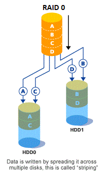
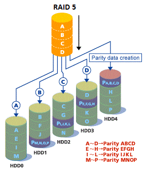
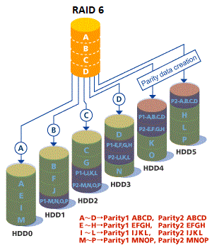

# 204.1. Configuring RAID

## **204.1 Configuring RAID**

**Weight:** 3

**Description:** Candidates should be able to configure and implement software RAID. This objective includes using and configuring RAID 0, 1 and 5.

**Key Knowledge Areas:**

* Software raid configuration files and utilities

**Terms and Utilities:**

* mdadm.conf
* mdadm
* /proc/mdstat
* partition type 0xFD

### What is RAID?

RAID \(redundant array of independent disks; originally redundant array of inexpensive disks\) is a way of storing the same data in different places on multiple hard disks to protect data in the case of a drive failure. However, not all RAID levels provide redundancy.

### How RAID Works?

RAID works by placing data on multiple disks and allowing input/output \(I/O\) operations to overlap in a balanced way, improving performance. Because the use of multiple disks increases the mean time between failures \(MTBF\), storing data redundantly also increases fault tolerance.

RAID arrays appear to the operating system \(OS\) as a single logical hard disk. RAID employs the techniques of disk mirroring or disk striping.

* Mirroring copies identical data onto more than one drive.
* Striping partitions each drive's storage space into units ranging from a sector \(512 bytes\) up to several megabytes\(designed based on needs of a system\). The stripes of all the disks are interleaved and addressed in order.

Parity is a concept, which is also streamlined into RAID technology as another way of storage method. It involves saving of information across the disk arrays, so that, the same information can be used to recreate or reconstruct the affected data, which is otherwise filled with errors or data loss, when disk drive fails.

Disk mirroring and disk striping can be combined on a RAID array.

### RAID Controller

A RAID controller can be used as a level of abstraction between the OS and the physical disks, presenting groups of disks as logical units. Using a RAID controller can improve performance and help protect data in case of a crash.

A RAID controller can be used in both hardware- and software-based RAID arrays.

* In a hardware-based RAID product, a physical controller manages the array. When in the form of a Peripheral Component Interconnect or PCI Express card, the controller can be designed to support drive formats such as SATA and SCSI. A physical RAID controller can also be part of the motherboard.
* With software-based RAID, the controller uses the resources of the hardware system. While it performs the same functions as a hardware-based RAID controller, software-based RAID controllers may not enable as much of a performance boost.

### RAID Levels

Data is distributed across the drives in one of several ways, referred to as RAID levels, depending on the required level of redundancy and performance. The different data distribution layouts, are named by the word "RAID" followed by a number, for example RAID 0 or RAID 1. Each RAID level, provides a different balance among reliability, availability, performance, and capacity.

* When RAID was introduced first in 1988 six different RAID Levels were introduced, known as "standrad RAID levels".





* As time passes "Nested RAID Levels" are created based on a combination of "Standard RAID Levels"


* and then there are some " Nonstandard RAID levels". Like RAID7 that are not popular and we don't talk about here.

## RAID levels comparison chart:

| RAID LEVELS | RAID0 | RAID1 | RAID5 | RAID6 | RAID10 |
| :--- | :--- | :--- | :--- | :--- | :--- |
| Min \# of Disks | 2 | 2 | 3 | 4 | 4 |
| Fault Tolerance | None | 1 disk | 1 disk | 2 disks | Up to one disk failure in each sub-array |
| Disk Space Over-Head | None | 50% | 1 disk | 2 disks | 50% |
| Read Speed | fast | fast | slow | slow | fast |
| Write Speed | fast | fair | slow | slow | fair |
| Cost | cheap | high\(disks\) | high | very high | high\(disks\) |
| Usage | High End Workstations, data logging, real-time rendering, very transitory data | Operating System, transaction databases | Data warehousing, web serving, archiving | Data archive, backup to disk, high availability solutions, servers with large capacity requirements | Fast databases, application servers |

For lpic2-202 examp we just expected to know about RAID Levels 0,1 and 5. Obviously we do not talk about any hardware-based RAID controller and we talk about software-raid in linux.

## /proc/mdstat

/proc/mdstat provides a way to check the state of the md driver. It also shows information about software RAID Array if exists.

```text
root@server1:~# cat /proc/mdstat 
Personalities : 
unused devices: <none>
```

Lets start creating a RAID Array, consist of two disk Drives with RAID level0:

```text
root@server1:~# ls /dev/sd*
/dev/sda  /dev/sda1  /dev/sda2  /dev/sda5  /dev/sdb  /dev/sdc
```

## partition type 0xFD

Each Disk Drive need to be formated with the special partition type 0xFD before play a role in RAID Array. This separating has some benefits, first if these disk drives moved to another system, operating system read this format and realize that its dealing with a RAID Array.

```text
root@server1:~# fdisk /dev/sdb

Welcome to fdisk (util-linux 2.27.1).
Changes will remain in memory only, until you decide to write them.
Be careful before using the write command.


Command (m for help): n
Partition type
   p   primary (0 primary, 0 extended, 4 free)
   e   extended (container for logical partitions)
Select (default p): p
Partition number (1-4, default 1): 1
First sector (2048-20971519, default 2048): 
Last sector, +sectors or +size{K,M,G,T,P} (2048-20971519, default 20971519): 

Created a new partition 1 of type 'Linux' and of size 10 GiB.

Command (m for help): t
Selected partition 1
Partition type (type L to list all types): l

 0  Empty           24  NEC DOS         81  Minix / old Lin bf  Solaris        
 1  FAT12           27  Hidden NTFS Win 82  Linux swap / So c1  DRDOS/sec (FAT-
 2  XENIX root      39  Plan 9          83  Linux           c4  DRDOS/sec (FAT-
 3  XENIX usr       3c  PartitionMagic  84  OS/2 hidden or  c6  DRDOS/sec (FAT-
 4  FAT16 <32M      40  Venix 80286     85  Linux extended  c7  Syrinx         
 5  Extended        41  PPC PReP Boot   86  NTFS volume set da  Non-FS data    
 6  FAT16           42  SFS             87  NTFS volume set db  CP/M / CTOS / .
 7  HPFS/NTFS/exFAT 4d  QNX4.x          88  Linux plaintext de  Dell Utility   
 8  AIX             4e  QNX4.x 2nd part 8e  Linux LVM       df  BootIt         
 9  AIX bootable    4f  QNX4.x 3rd part 93  Amoeba          e1  DOS access     
 a  OS/2 Boot Manag 50  OnTrack DM      94  Amoeba BBT      e3  DOS R/O        
 b  W95 FAT32       51  OnTrack DM6 Aux 9f  BSD/OS          e4  SpeedStor      
 c  W95 FAT32 (LBA) 52  CP/M            a0  IBM Thinkpad hi ea  Rufus alignment
 e  W95 FAT16 (LBA) 53  OnTrack DM6 Aux a5  FreeBSD         eb  BeOS fs        
 f  W95 Ext'd (LBA) 54  OnTrackDM6      a6  OpenBSD         ee  GPT            
10  OPUS            55  EZ-Drive        a7  NeXTSTEP        ef  EFI (FAT-12/16/
11  Hidden FAT12    56  Golden Bow      a8  Darwin UFS      f0  Linux/PA-RISC b
12  Compaq diagnost 5c  Priam Edisk     a9  NetBSD          f1  SpeedStor      
14  Hidden FAT16 <3 61  SpeedStor       ab  Darwin boot     f4  SpeedStor      
16  Hidden FAT16    63  GNU HURD or Sys af  HFS / HFS+      f2  DOS secondary  
17  Hidden HPFS/NTF 64  Novell Netware  b7  BSDI fs         fb  VMware VMFS    
18  AST SmartSleep  65  Novell Netware  b8  BSDI swap       fc  VMware VMKCORE 
1b  Hidden W95 FAT3 70  DiskSecure Mult bb  Boot Wizard hid fd  Linux raid auto
1c  Hidden W95 FAT3 75  PC/IX           bc  Acronis FAT32 L fe  LANstep        
1e  Hidden W95 FAT1 80  Old Minix       be  Solaris boot    ff  BBT            
Partition type (type L to list all types): fd
Changed type of partition 'Linux' to 'Linux raid autodetect'.

Command (m for help): w
The partition table has been altered.
Calling ioctl() to re-read partition table.
Syncing disks.
```

and lets do it for another Disk Drive:

```text
root@server1:~# fdisk /dev/sdc

Welcome to fdisk (util-linux 2.27.1).
Changes will remain in memory only, until you decide to write them.
Be careful before using the write command.

Device does not contain a recognized partition table.
Created a new DOS disklabel with disk identifier 0xbc1e0832.

Command (m for help): n
Partition type
   p   primary (0 primary, 0 extended, 4 free)
   e   extended (container for logical partitions)
Select (default p): p
Partition number (1-4, default 1): 1
First sector (2048-20971519, default 2048): 
Last sector, +sectors or +size{K,M,G,T,P} (2048-20971519, default 20971519): 

Created a new partition 1 of type 'Linux' and of size 10 GiB.

Command (m for help): t
Selected partition 1
Partition type (type L to list all types): fd
Changed type of partition 'Linux' to 'Linux raid autodetect'.

Command (m for help): w
The partition table has been altered.
Calling ioctl() to re-read partition table.
Syncing disks.

root@server1:~# ls /dev/sd* -l
brw-rw---- 1 root disk 8,  0 Jan  6 21:26 /dev/sda
brw-rw---- 1 root disk 8,  1 Jan  6 21:26 /dev/sda1
brw-rw---- 1 root disk 8,  2 Jan  6 21:26 /dev/sda2
brw-rw---- 1 root disk 8,  5 Jan  6 21:26 /dev/sda5
brw-rw---- 1 root disk 8, 16 Jan  6 22:14 /dev/sdb
brw-rw---- 1 root disk 8, 17 Jan  6 22:14 /dev/sdb1
brw-rw---- 1 root disk 8, 32 Jan  6 22:15 /dev/sdc
brw-rw---- 1 root disk 8, 33 Jan  6 22:15 /dev/sdc1
```

okey time to use Multiple Devices\(Disk\) administration tool to create RAID Array.

## mdadm

Linux Software RAID devices are implemented through the md \(Multiple Devices\) device driver. mdadm is a tool for creating, managing, and monitoring RAID devices using the md driver in Linux. based on your distro you might need to install mdadm:

```text
root@server1:~# apt install mdadm 

root@server1:~# mdadm --create --verbose /dev/md0 --level=0 --raid-devices=2 /dev/sdb1 /dev/sdc1
mdadm: chunk size defaults to 512K
mdadm: Defaulting to version 1.2 metadata
mdadm: array /dev/md0 started.
```

Now /dev/md0 is created, consist of two 10 Gigabytes Disk Drives with RAID level 0.

```text
root@server1:~# ls /dev/md*
/dev/md0
root@server1:~# lsblk
NAME    MAJ:MIN RM  SIZE RO TYPE  MOUNTPOINT
sdb       8:16   0   10G  0 disk  
└─sdb1    8:17   0   10G  0 part  
  └─md0   9:0    0   20G  0 raid0 
sr0      11:0    1 1024M  0 rom   
sdc       8:32   0   10G  0 disk  
└─sdc1    8:33   0   10G  0 part  
  └─md0   9:0    0   20G  0 raid0 
sda       8:0    0   50G  0 disk  
├─sda2    8:2    0    1K  0 part  
├─sda5    8:5    0 1021M  0 part  [SWAP]
└─sda1    8:1    0   49G  0 part  /

root@server1:~# ls /dev/md*
/dev/md0
root@server1:~# fdisk /dev/md0 

Welcome to fdisk (util-linux 2.27.1).
Changes will remain in memory only, until you decide to write them.
Be careful before using the write command.

Device does not contain a recognized partition table.
Created a new DOS disklabel with disk identifier 0x5b547cee.

Command (m for help): n
Partition type
   p   primary (0 primary, 0 extended, 4 free)
   e   extended (container for logical partitions)
Select (default p): p
Partition number (1-4, default 1): 1
First sector (2048-41906175, default 2048): 
Last sector, +sectors or +size{K,M,G,T,P} (2048-41906175, default 41906175): 

Created a new partition 1 of type 'Linux' and of size 20 GiB.

Command (m for help): w
The partition table has been altered.
Calling ioctl() to re-read partition table.
Syncing disks.
```

lets take a look at mdstat:

```text
root@server1:~# cat /proc/mdstat 
Personalities : [linear] [multipath] [raid0] [raid1] [raid6] [raid5] [raid4] [raid10] 
md0 : active raid0 sdc1[1] sdb1[0]
      20953088 blocks super 1.2 512k chunks

unused devices: <none>
```

some usefull switches of mdadm

| mdadm switch | Description |
| :--- | :--- |
| -v | --verbose |
| -C /dev/md01 | --create /dev/md01 |
| -l2 | --level=2 |
| -n2 | --raid-devices=2 |
| -x 3 /dev/sdX1 /dev/sdY1 /dev/sdZ1 | --spare-device=3 /dev/sdX1 /dev/sdY1 /dev/sdZ1 |

## mdadm.conf

Normally Linux system doesn’t automatically remember all the components that are part of the RAID set. This information has to be added it on mdadm.conf file under /etc directory. It helps to start, rebuild,re-activate the raid etc.., by default, the file will not be available, it has to be created manually.

Following command scan the availbe RAID levels on the system:

```text
root@server1:~# mdadm --detail --scan 
ARRAY /dev/md0 metadata=1.2 name=server1:0 UUID=f34215ab:8f1bf031:5597e3ff:02303fc7
```

and for more details about specific RAID Array:

```text
root@server1:~# mdadm --detail /dev/md0 
/dev/md0:
        Version : 1.2
  Creation Time : Wed Jan 10 03:41:35 2018
     Raid Level : raid0
     Array Size : 20953088 (19.98 GiB 21.46 GB)
   Raid Devices : 2
  Total Devices : 2
    Persistence : Superblock is persistent

    Update Time : Wed Jan 10 03:41:35 2018
          State : clean 
 Active Devices : 2
Working Devices : 2
 Failed Devices : 0
  Spare Devices : 0

     Chunk Size : 512K

           Name : server1:0  (local to host server1)
           UUID : f34215ab:8f1bf031:5597e3ff:02303fc7
         Events : 0

    Number   Major   Minor   RaidDevice State
       0       8       17        0      active sync   /dev/sdb1
       1       8       33        1      active sync   /dev/sdc1
```

and finally lets add configuration to mdadm.conf:

```text
root@server1:~# mdadm --detail --scan >> /etc/mdadm/mdadm.conf 
root@server1:~# cat /etc/mdadm/mdadm.conf 
# mdadm.conf
#
# Please refer to mdadm.conf(5) for information about this file.
#

# by default (built-in), scan all partitions (/proc/partitions) and all
# containers for MD superblocks. alternatively, specify devices to scan, using
# wildcards if desired.
#DEVICE partitions containers

# auto-create devices with Debian standard permissions
CREATE owner=root group=disk mode=0660 auto=yes

# automatically tag new arrays as belonging to the local system
HOMEHOST <system>

# instruct the monitoring daemon where to send mail alerts
MAILADDR root

# definitions of existing MD arrays

# This file was auto-generated on Sat, 06 Jan 2018 22:23:08 -0800
# by mkconf $Id$
ARRAY /dev/md0 metadata=1.2 name=server1:0 UUID=f34215ab:8f1bf031:5597e3ff:02303fc7
```

and thats all our seetings have become persistent. Some other usefull mdadm commands:

#### Remove a Disk From Array

We can’t remove a disk directly from the array, unless it is failed, so we first have to fail it\( if its not Failed normally\):

```text
mdadm --fail /dev/md0 /dev/sdb1
mdadm --remove /dev/md0 /dev/sdb1
```

#### Add a Disk to an Existing Array

```text
mdadm --add /dev/md0 /dev/sdb1
```

#### Stop and Delete a Raid Array

```text
mdadm --stop /dev/md0
mdadm --remove /dev/md0
```

and finally we can even delete the superblock from each drive

```text
mdadm --zero-superblock /dev/sdb
mdadm --zero-superblock /dev/sdc
```

that all people.

