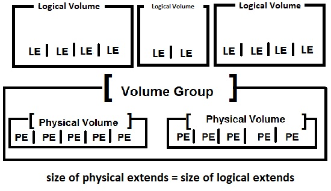
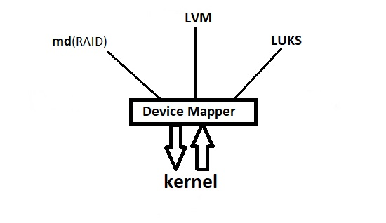

# 204.3. Logical Volume Manager

## **204.3 Logical Volume Manager**

**Weight:** 3

**Description:** Candidates should be able to create and remove logical volumes, volume groups, and physical volumes. This objective includes snapshots and resizing logical volumes.

**Key Knowledge Areas:**

* Tools in the LVM suite
* Resizing, renaming, creating, and removing logical volumes, volume groups, and physical volumes
* Creating and maintaining snapshots
* Activating volume groups

**Terms and Utilities:**

* /sbin/pv\*
* /sbin/lv\*
* /sbin/vg\*
* mount
* /dev/mapper/
* lvm.conf

## LVM

In traditional storage management, Operating system searchs for Disk Drives like /dev/sda, /dev/sdb and then looks for what partitions are available on the disks like /dev/sda1, /dev/sdb1 .Partitions are limited to the disks and they are not so flexible. Logical Volume Manager \(LVM\) bring us flexibility by creating an abstraction layer between Operating System and Disk Devices.

LVM functions by layering abstractions on top of physical storage devices, The basic layers that LVM use are:


* physical volumes\(pv\):A physical volume is typically a hard disk, though it may be a device that looks like a hard disk \(ex:software raid device\).It can be a partition or entire of a disk.
* volume groups\(vg\): The Volume Group is central level and heart of the LVM. It gathers together a collection of Physical Volumes and create a pool of different storage resources.
* logical volumes\(lv\):The equivalent of a disk partition in a non-LVM system. logical volume takes disk space from disk space which is available on volume group. On top of logical volumes we create File Systems\( xfs, ext4, ...\)

LVM is capable of doing operations such as increasing, decreasing the size of a logical volume\(which we will be discussing later\) because the physical volume is made up of small chunks which are always of fixed size. Each physical disk that combinely makes up a volume group will have a number of small chunks of equal size, where data will reside.



This small chunks of equal size, which makes up the physical volumes are called as Physical Extents. Creating a volume group simply combines all the physical extents of all the physical volumes to form one large logical volume group.

Redhat base Systems use LVM by default, they setup LVM during installation, so here we use ubuntu to create lvm :

```text
root@server2:~# apt-get install lvm2
```

### Working with physical volumes\(pv\)

Here we use sdb, sdc to create pv. In order to prepare a partition to be a physical volume in LVM, it is recommended to format it with LVM tag:

```text
root@server2:~# ls -l /dev/sd*
brw-rw---- 1 root disk 8,  0 Jan 13 21:55 /dev/sda
brw-rw---- 1 root disk 8,  1 Jan 13 21:55 /dev/sda1
brw-rw---- 1 root disk 8,  2 Jan 13 21:55 /dev/sda2
brw-rw---- 1 root disk 8,  5 Jan 13 21:55 /dev/sda5
brw-rw---- 1 root disk 8, 16 Jan 13 22:02 /dev/sdb
brw-rw---- 1 root disk 8, 32 Jan 13 22:02 /dev/sdc

root@server2:~# fdisk /dev/sdb 

Welcome to fdisk (util-linux 2.27.1).
Changes will remain in memory only, until you decide to write them.
Be careful before using the write command.


Command (m for help): n
Partition type
   p   primary (0 primary, 0 extended, 4 free)
   e   extended (container for logical partitions)
Select (default p): p
Partition number (1-4, default 1): 
First sector (2048-2097151, default 2048): 
Last sector, +sectors or +size{K,M,G,T,P} (2048-2097151, default 2097151): 

Created a new partition 1 of type 'Linux' and of size 1023 MiB.

Command (m for help): t
Selected partition 1
Partition type (type L to list all types): L

 0  Empty           24  NEC DOS         81  Minix / old Lin bf  Solaris        
 1  FAT12           27  Hidden NTFS Win 82  Linux swap / So c1  DRDOS/sec (FAT-
 2  XENIX root      39  Plan 9          83  Linux           c4  DRDOS/sec (FAT-
 3  XENIX usr       3c  PartitionMagic  84  OS/2 hidden or  c6  DRDOS/sec (FAT-
 4  FAT16 <32M      40  Venix 80286     85  Linux extended  c7  Syrinx         
 5  Extended        41  PPC PReP Boot   86  NTFS volume set da  Non-FS data    
 6  FAT16           42  SFS             87  NTFS volume set db  CP/M / CTOS / .
 7  HPFS/NTFS/exFAT 4d  QNX4.x          88  Linux plaintext de  Dell Utility   
 8  AIX             4e  QNX4.x 2nd part 8e  Linux LVM       df  BootIt         
 9  AIX bootable    4f  QNX4.x 3rd part 93  Amoeba          e1  DOS access     
 a  OS/2 Boot Manag 50  OnTrack DM      94  Amoeba BBT      e3  DOS R/O        
 b  W95 FAT32       51  OnTrack DM6 Aux 9f  BSD/OS          e4  SpeedStor      
 c  W95 FAT32 (LBA) 52  CP/M            a0  IBM Thinkpad hi ea  Rufus alignment
 e  W95 FAT16 (LBA) 53  OnTrack DM6 Aux a5  FreeBSD         eb  BeOS fs        
 f  W95 Ext'd (LBA) 54  OnTrackDM6      a6  OpenBSD         ee  GPT            
10  OPUS            55  EZ-Drive        a7  NeXTSTEP        ef  EFI (FAT-12/16/
11  Hidden FAT12    56  Golden Bow      a8  Darwin UFS      f0  Linux/PA-RISC b
12  Compaq diagnost 5c  Priam Edisk     a9  NetBSD          f1  SpeedStor      
14  Hidden FAT16 <3 61  SpeedStor       ab  Darwin boot     f4  SpeedStor      
16  Hidden FAT16    63  GNU HURD or Sys af  HFS / HFS+      f2  DOS secondary  
17  Hidden HPFS/NTF 64  Novell Netware  b7  BSDI fs         fb  VMware VMFS    
18  AST SmartSleep  65  Novell Netware  b8  BSDI swap       fc  VMware VMKCORE 
1b  Hidden W95 FAT3 70  DiskSecure Mult bb  Boot Wizard hid fd  Linux raid auto
1c  Hidden W95 FAT3 75  PC/IX           bc  Acronis FAT32 L fe  LANstep        
1e  Hidden W95 FAT1 80  Old Minix       be  Solaris boot    ff  BBT            
Partition type (type L to list all types): 8e
Changed type of partition 'Linux' to 'Linux LVM'.

Command (m for help): w
The partition table has been altered.
Calling ioctl() to re-read partition table.
Syncing disks.

root@server2:~# fdisk /dev/sdc

Welcome to fdisk (util-linux 2.27.1).
Changes will remain in memory only, until you decide to write them.
Be careful before using the write command.


Command (m for help): n
Partition type
   p   primary (0 primary, 0 extended, 4 free)
   e   extended (container for logical partitions)
Select (default p): p
Partition number (1-4, default 1): 
First sector (2048-4194303, default 2048): 
Last sector, +sectors or +size{K,M,G,T,P} (2048-4194303, default 4194303): 

Created a new partition 1 of type 'Linux' and of size 2 GiB.

Command (m for help): t
Selected partition 1
Partition type (type L to list all types): 8e
Changed type of partition 'Linux' to 'Linux LVM'.

Command (m for help): w
The partition table has been altered.
Calling ioctl() to re-read partition table.
Syncing disks.
```

Now lets chek weather any LVM has been setup or not and start:

```text
root@server2:~# pvdisplay 
root@server2:~# pvcreate /dev/sdb1 /dev/sdc1
  Physical volume "/dev/sdb1" successfully created
  Physical volume "/dev/sdc1" successfully created
root@server2:~# pvdisplay 
  "/dev/sdc1" is a new physical volume of "2.00 GiB"
  --- NEW Physical volume ---
  PV Name               /dev/sdc1
  VG Name               
  PV Size               2.00 GiB
  Allocatable           NO
  PE Size               0   
  Total PE              0
  Free PE               0
  Allocated PE          0
  PV UUID               5XaGvK-vjWs-lzNk-IPMA-grXi-yFZ8-AeLUBk

  "/dev/sdb1" is a new physical volume of "1023.00 MiB"
  --- NEW Physical volume ---
  PV Name               /dev/sdb1
  VG Name               
  PV Size               1023.00 MiB
  Allocatable           NO
  PE Size               0   
  Total PE              0
  Free PE               0
  Allocated PE          0
  PV UUID               JZ3DkI-goy7-tNIW-MpgH-NC3T-02dT-YB2WTL
```

| physical volume commands | Description |
| :--- | :--- |
| pvdisplay | display physical volume details |
| pvscan | scan all disks for physical volume |
| pvs | report info about physical volumes |
| pvcreate  /dev/sdb1 /dev/sdc1 | create physical volume |
| pvchange | Activate, de-Activate physical volume |
| pvmove | move data from one pv to another pv |
| pvremove /dev/sdc1 | remove a physical volume |

### Working with  volume group\(vg\)

Now we create a volume group consist of two pv, /dev/sdb1 and /dev/sdc1:

```text
root@server2:~# vgdisplay 
root@server2:~# vgcreate myfirstvg /dev/sdb1 /dev/sdc1
  Volume group "myfirstvg" successfully created
root@server2:~# vgdisplay 
  --- Volume group ---
  VG Name               myfirstvg
  System ID             
  Format                lvm2
  Metadata Areas        2
  Metadata Sequence No  1
  VG Access             read/write
  VG Status             resizable
  MAX LV                0
  Cur LV                0
  Open LV               0
  Max PV                0
  Cur PV                2
  Act PV                2
  VG Size               2.99 GiB
  PE Size               4.00 MiB
  Total PE              766
  Alloc PE / Size       0 / 0   
  Free  PE / Size       766 / 2.99 GiB
  VG UUID               pBA82t-uB9F-VGpT-PKjn-HL9K-1KyN-Yo1VLg
```

| volume group commands | Description |
| :--- | :--- |
| vgdisplay | Display volume group details |
| vgscan | scans  disk devices in the system looking for  PV and VG |
| vgs | Report info about volume groups |
| vgcreate myfirstvg /dev/sdb1 /dev/sdc1 | Create a volume group |
| vgextend myfirstvg /dev/sdd1 /dev/sde1 | Add a new PV to VG |
| vgreduce myfirstvg /dev/sde1 | Remove PV from VG |
| vgexport  myfirstvg | Export VG to system |
| vgimport myfirstvg /dev/sdb1 /dev/sdd1 | Import VG system |
| vgchange -a y myfirstvg | Activate VG, use "-a n" to deactivate |
| vgremove myfirstvg | Remove VG from the system |
| vgrename myfirstvg myvg00 | Rename VG |
| vgsync /dev/myfirstvg | Sync stale PE in VG |

### Working with  logical volume\(lv\)

```text
root@server2:~# lvdisplay 
root@server2:~# lvcreate --name myfirstlv --size 1G myfirstvg
  Logical volume "myfirstlv" created.
root@server2:~# lvdisplay 
  --- Logical volume ---
  LV Path                /dev/myfirstvg/myfirstlv
  LV Name                myfirstlv
  VG Name                myfirstvg
  LV UUID                g75etD-o9YW-iAeM-sU2d-nKat-K84V-yle2qv
  LV Write Access        read/write
  LV Creation host, time server2, 2018-01-13 22:47:49 -0800
  LV Status              available
  # open                 0
  LV Size                1.00 GiB
  Current LE             256
  Segments               1
  Allocation             inherit
  Read ahead sectors     auto
  - currently set to     256
  Block device           253:0
```

And lets format it and mount it:

```text
root@server2:~# mkfs.ext4 /dev/myfirstvg/myfirstlv 
mke2fs 1.42.13 (17-May-2015)
Creating filesystem with 262144 4k blocks and 65536 inodes
Filesystem UUID: fe539cb4-596c-456d-b337-9e90b6e47b28
Superblock backups stored on blocks: 
    32768, 98304, 163840, 229376

Allocating group tables: done                            
Writing inode tables: done                            
Creating journal (8192 blocks): done
Writing superblocks and filesystem accounting information: done

root@server2:~# mount /dev/myfirstvg/myfirstlv /mnt/
root@server2:~# mount
sysfs on /sys type sysfs (rw,nosuid,nodev,noexec,relatime)
proc on /proc type proc (rw,nosuid,nodev,noexec,relatime)
udev on /dev type devtmpfs (rw,nosuid,relatime,size=474520k,nr_inodes=118630,mode=755)
devpts on /dev/pts type devpts (rw,nosuid,noexec,relatime,gid=5,mode=620,ptmxmode=000)
tmpfs on /run type tmpfs (rw,nosuid,noexec,relatime,size=99492k,mode=755)
/dev/sda1 on / type ext4 (rw,relatime,errors=remount-ro,data=ordered)
securityfs on /sys/kernel/security type securityfs (rw,nosuid,nodev,noexec,relatime)
tmpfs on /dev/shm type tmpfs (rw,nosuid,nodev)
tmpfs on /run/lock type tmpfs (rw,nosuid,nodev,noexec,relatime,size=5120k)
tmpfs on /sys/fs/cgroup type tmpfs (ro,nosuid,nodev,noexec,mode=755)
cgroup on /sys/fs/cgroup/systemd type cgroup (rw,nosuid,nodev,noexec,relatime,xattr,release_agent=/lib/systemd/systemd-cgroups-agent,name=systemd)
pstore on /sys/fs/pstore type pstore (rw,nosuid,nodev,noexec,relatime)
cgroup on /sys/fs/cgroup/freezer type cgroup (rw,nosuid,nodev,noexec,relatime,freezer)
cgroup on /sys/fs/cgroup/cpu,cpuacct type cgroup (rw,nosuid,nodev,noexec,relatime,cpu,cpuacct)
cgroup on /sys/fs/cgroup/net_cls,net_prio type cgroup (rw,nosuid,nodev,noexec,relatime,net_cls,net_prio)
cgroup on /sys/fs/cgroup/devices type cgroup (rw,nosuid,nodev,noexec,relatime,devices)
cgroup on /sys/fs/cgroup/blkio type cgroup (rw,nosuid,nodev,noexec,relatime,blkio)
cgroup on /sys/fs/cgroup/memory type cgroup (rw,nosuid,nodev,noexec,relatime,memory)
cgroup on /sys/fs/cgroup/hugetlb type cgroup (rw,nosuid,nodev,noexec,relatime,hugetlb)
cgroup on /sys/fs/cgroup/cpuset type cgroup (rw,nosuid,nodev,noexec,relatime,cpuset)
cgroup on /sys/fs/cgroup/perf_event type cgroup (rw,nosuid,nodev,noexec,relatime,perf_event)
cgroup on /sys/fs/cgroup/pids type cgroup (rw,nosuid,nodev,noexec,relatime,pids)
systemd-1 on /proc/sys/fs/binfmt_misc type autofs (rw,relatime,fd=25,pgrp=1,timeout=0,minproto=5,maxproto=5,direct,pipe_ino=15263)
mqueue on /dev/mqueue type mqueue (rw,relatime)
debugfs on /sys/kernel/debug type debugfs (rw,relatime)
hugetlbfs on /dev/hugepages type hugetlbfs (rw,relatime)
sunrpc on /run/rpc_pipefs type rpc_pipefs (rw,relatime)
nfsd on /proc/fs/nfsd type nfsd (rw,relatime)
fusectl on /sys/fs/fuse/connections type fusectl (rw,relatime)
configfs on /sys/kernel/config type configfs (rw,relatime)
vmware-vmblock on /run/vmblock-fuse type fuse.vmware-vmblock (rw,nosuid,nodev,relatime,user_id=0,group_id=0,default_permissions,allow_other)
tmpfs on /run/user/1000 type tmpfs (rw,nosuid,nodev,relatime,size=99492k,mode=700,uid=1000,gid=1000)
gvfsd-fuse on /run/user/1000/gvfs type fuse.gvfsd-fuse (rw,nosuid,nodev,relatime,user_id=1000,group_id=1000)
/dev/mapper/myfirstvg-myfirstlv on /mnt type ext4 (rw,relatime,data=ordered)
```

We can now easily resize volume group with lvresize:

```text
root@server2:~# lvresize --help
  lvresize: Resize a logical volume

lvresize
    [-A|--autobackup y|n]
    [--alloc AllocationPolicy]
    [--commandprofile ProfileName]
    [-d|--debug]
    [-f|--force]
    [-h|--help]
    [-i|--stripes Stripes [-I|--stripesize StripeSize]]
    {-l|--extents [+|-]LogicalExtentsNumber[%{VG|LV|PVS|FREE|ORIGIN}] |
     -L|--size [+|-]LogicalVolumeSize[bBsSkKmMgGtTpPeE]}
     --poolmetadatasize [+]MetadataVolumeSize[bBsSkKmMgG]}
    [-n|--nofsck]
    [--noudevsync]
    [-r|--resizefs]
    [-t|--test]
    [--type VolumeType]
    [-v|--verbose]
    [--version]
    LogicalVolume[Path] [ PhysicalVolumePath... ]

root@server2:~# df -h
Filesystem                       Size  Used Avail Use% Mounted on
udev                             464M     0  464M   0% /dev
tmpfs                             98M  6.2M   92M   7% /run
/dev/sda1                         49G  4.6G   42G  10% /
tmpfs                            486M  212K  486M   1% /dev/shm
tmpfs                            5.0M  4.0K  5.0M   1% /run/lock
tmpfs                            486M     0  486M   0% /sys/fs/cgroup
tmpfs                             98M   60K   98M   1% /run/user/1000
/dev/mapper/myfirstvg-myfirstlv  978M  1.3M  915M   1% /mnt

root@server2:~# lvresize -L +999M -r /dev/myfirstvg/myfirstlv 
  Rounding size to boundary between physical extents: 1000.00 MiB
  Size of logical volume myfirstvg/myfirstlv changed from 1.00 GiB (256 extents) to 1.98 GiB (506 extents).
  Logical volume myfirstlv successfully resized.
resize2fs 1.42.13 (17-May-2015)
Filesystem at /dev/mapper/myfirstvg-myfirstlv is mounted on /mnt; on-line resizing required
old_desc_blocks = 1, new_desc_blocks = 1
The filesystem on /dev/mapper/myfirstvg-myfirstlv is now 518144 (4k) blocks long.

root@server2:~# df -h
Filesystem                       Size  Used Avail Use% Mounted on
udev                             464M     0  464M   0% /dev
tmpfs                             98M  6.2M   92M   7% /run
/dev/sda1                         49G  4.6G   42G  10% /
tmpfs                            486M  212K  486M   1% /dev/shm
tmpfs                            5.0M  4.0K  5.0M   1% /run/lock
tmpfs                            486M     0  486M   0% /sys/fs/cgroup
tmpfs                             98M   60K   98M   1% /run/user/1000
/dev/mapper/myfirstvg-myfirstlv  2.0G  1.5M  1.9G   1% /mnt
```

if we havn't used `-r`switch then we had to use `resizefs /dev/myfirstvg/myfirstlv`command inorder to get File System .informed about size changes.

| logical volume commands | Description |
| :--- | :--- |
| lvdisplay | Display logical volume details |
| lvscan | Scan for logical volumes |
| lvs | show logical volume info |
| lvcreate --name --size 1G my2ndlv | Create logical volume |
| lvremove /dev/myfirstvg/myfirstlv | Remove logical volume |
| lvrename my2ndlv my3rdlv | Rename logical volume |
| lvextend -L1G /dev/myfirstvg/myfirstlv | Increase size of logical volume |
| lvreduce -L1G /dev/myfirstvg/myfirstlv | Decrease size of logical volume |
| lvchange -ay /dev/myfirstvg/myfirstlv | Active logical volume, use "-an" to Deactivate |
| lvsync /dev/myfirstvg/myfirstlv | Sync stale LE of logical volume |
| lvlnboot \[-b/-d/-r/-s/-R/-v\] /dev/myfirstvg/myfirstlv | Set lv as root, boot, swap, dump volume |

## LVM snapshots

snapshots lets us to freeze the current state of logical volume.Every thing which is added or removed doesn't make any changes in our snapshot and we can easily reverse to previous stat of volume. snapshots can help us to create a short term backup when no files are open. For creating snap shots we should define the size of snap shot, so we should consider amount of future changes:

```text
root@server2:~# lsblk
NAME                    MAJ:MIN RM  SIZE RO TYPE MOUNTPOINT
sdb                       8:16   0    1G  0 disk 
└─sdb1                    8:17   0 1023M  0 part 
sr0                      11:0    1 1024M  0 rom  
sdc                       8:32   0    2G  0 disk 
└─sdc1                    8:33   0    2G  0 part 
  └─myfirstvg-myfirstlv 253:0    0    2G  0 lvm  /mnt
sda                       8:0    0   50G  0 disk 
├─sda2                    8:2    0    1K  0 part 
├─sda5                    8:5    0 1021M  0 part [SWAP]
└─sda1                    8:1    0   49G  0 part /
root@server2:~# cp /etc/[abc]* /mnt/
cp: omitting directory '/etc/acpi'
cp: omitting directory '/etc/alternatives'
cp: omitting directory '/etc/apm'
cp: omitting directory '/etc/apparmor'
cp: omitting directory '/etc/apparmor.d'
cp: omitting directory '/etc/apport'
cp: omitting directory '/etc/apt'
cp: omitting directory '/etc/aptdaemon'
cp: omitting directory '/etc/at-spi2'
cp: omitting directory '/etc/avahi'
cp: omitting directory '/etc/bash_completion.d'
cp: omitting directory '/etc/binfmt.d'
cp: omitting directory '/etc/bluetooth'
cp: omitting directory '/etc/brltty'
cp: omitting directory '/etc/ca-certificates'
cp: omitting directory '/etc/calendar'
cp: omitting directory '/etc/chatscripts'
cp: omitting directory '/etc/compizconfig'
cp: omitting directory '/etc/console-setup'
cp: omitting directory '/etc/cracklib'
cp: omitting directory '/etc/cron.d'
cp: omitting directory '/etc/cron.daily'
cp: omitting directory '/etc/cron.hourly'
cp: omitting directory '/etc/cron.monthly'
cp: omitting directory '/etc/cron.weekly'
cp: omitting directory '/etc/cups'
cp: omitting directory '/etc/cupshelpers'

root@server2:~# lvcreate -s --size 100M  --name myfirstsnap /dev/myfirstvg/myfirstlv
  Logical volume "myfirstsnap" created.

root@server2:~# lvs
  LV          VG        Attr       LSize   Pool Origin    Data%  Meta%  Move Log Cpy%Sync Convert
  myfirstlv   myfirstvg owi-aos---   1.98g                                                       
  myfirstsnap myfirstvg swi-a-s--- 100.00m      myfirstlv 0.01
```

Lets remove some data and restore snap shot, do not forget to unmount before restoring snap shot:

```text
root@server2:~# cd /mnt/
root@server2:/mnt# ls
adduser.conf  appstream.conf   bindresvport.blacklist  ca-certificates.conf
anacrontab    bash.bashrc      brlapi.key              crontab
apg.conf      bash_completion  brltty.conf             lost+found

root@server2:/mnt# rm a*
root@server2:/mnt# ls
bash.bashrc      bindresvport.blacklist  brltty.conf           crontab
bash_completion  brlapi.key              ca-certificates.conf  lost+found
root@server2:/mnt# cd

root@server2:~# umount /mnt 

root@server2:~# lvconvert --merg /dev/myfirstvg/myfirstsnap 
  Merging of volume myfirstsnap started.
  myfirstlv: Merged: 100.0%

root@server2:~# mount /dev/myfirstvg/myfirstlv /mnt
root@server2:~# ls /mnt/
adduser.conf  appstream.conf   bindresvport.blacklist  ca-certificates.conf
anacrontab    bash.bashrc      brlapi.key              crontab
apg.conf      bash_completion  brltty.conf             lost+found
```

## /etc/lvm/\*

Lets take a look at /etc/lvm/ directory:

```text
root@server2:~# tree /etc/lvm/
/etc/lvm/
├── archive    ###where automatic archives go after a volume group change 
│   ├── myfirstvg_00000-1093593173.vg
│   ├── myfirstvg_00001-830021442.vg
│   ├── myfirstvg_00002-880534144.vg
│   ├── myfirstvg_00003-1582663489.vg
│   ├── myfirstvg_00004-912884793.vg
│   ├── myfirstvg_00005-61387558.vg
│   ├── myfirstvg_00006-950931226.vg
│   ├── myfirstvg_00007-1556055507.vg
│   ├── myfirstvg_00008-122687836.vg
│   ├── myfistvg_00000-1042362796.vg
│   ├── myfistvg_00001-1480349148.vg
│   ├── myvg_00000-1839154512.vg
│   ├── myvg_00001-1559838799.vg
│   ├── myvg_00002-477252563.vg
│   └── myvg_00003-455796415.vg
├── backup    ###where the automatic backups go
│   └── myfirstvg
└── lvm.conf
```

lvm.conf is loaded during the initialisation phase of lvm. This file can in turn lead to other files being loaded - settings read in later override earlier settings. File timestamps are checked between commands and if any have changed, all the files are reloaded.

Metadata backups and archives are automatically created on every volume group and logical volume configuration change unless disabled in the lvm.conf file. By default, the metadata backup is stored in the /etc/lvm/backup file and the metadata archives are stored in the /etc/lvm/archive file. How long and how many meta data archive are kept? it is determined by parameters we can set in the lvm.conf file.

### Logical Volume Backup

A daily system backup should include the contents of the /etc/lvm directory in the backup. Note that a metadata backup does not back up the user and system data contained in the logical volumes.We can manually back up the metadata to the /etc/lvm/backup file with the vgcfgbackup command.And we can restore metadata with the vgcfgrestore command.

## /dev/mapper

The Device mapper is a generic interface to the linux kernel that can be used by different storage solutions.

Lets Take a look:

```text
root@server2:~# ls -l /dev/myfirstvg/myfirstlv 
lrwxrwxrwx 1 root root 7 Jan 14 00:22 /dev/myfirstvg/myfirstlv -> ../dm-0
root@server2:~# ls -l /dev/dm-0 
brw-rw---- 1 root disk 253, 0 Jan 14 00:22 /dev/dm-0
```

By using LVM or RAID or LUKS more md-X devices are created and used. Nice interface to that is:

```text
root@server2:~# ls -l /dev/mapper/
total 0
crw------- 1 root root 10, 236 Jan 13 21:55 control
lrwxrwxrwx 1 root root       7 Jan 13 22:55 myfirstvg-myfirstlv -> ../dm-0
```

Some Device Mapper Devices might be created just for the system to do it things. We can work with Device Mapper Directly with dmsetup command but thats not straightforward and it is beyond the scope of LPIC exam.

```text
root@server2:/dev# dmsetup ls
myfirstvg-myfirstlv    (253:0)
root@server2:/dev# dmsetup info myfirstvg-myfirstlv
Name:              myfirstvg-myfirstlv
State:             ACTIVE
Read Ahead:        256
Tables present:    LIVE
Open count:        1
Event number:      0
Major, minor:      253, 0
Number of targets: 1
UUID: LVM-pBA82tuB9FVGpTPKjnHL9K1KyNYo1VLgg75etDo9YWiAeMsU2dnKatK84Vyle2qv
```

so we have seen while using RAID can give us performance and reliability, LVM cause flexibility.

