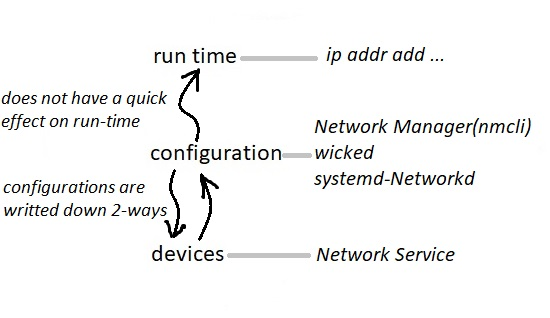
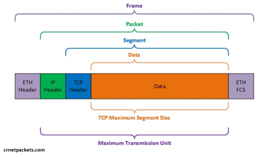
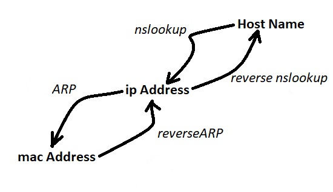

# 205.1. Basic networking configuration

## **205.1 Basic networking configuration**

**Weight:** 3

**Description:** Candidates should be able to configure a network device to be able to connect to a local, wired or wireless, and a wide-area network. This objective includes being able to communicate between various subnets within a single network including both IPv4 and IPv6 networks.

**Key Knowledge Areas:**

* Utilities to configure and manipulate ethernet network interfaces
* Configuring basic access to wireless networks

**Terms and Utilities:**

* ip
* ifconfig
* route
* arp
* iw
* iwconfig
* iwlist

In this course we spend some time on Networking tools and review what we has learned. As more experienced we become, less time we spend on troubleshooting.But before that lets draw a big picture.

## Network Configuration

Network Configuration in Linux can be pretty confusing. In linux, Network setting can be done in different levels and each level has different tools.



here we mostly talk about run time configuration tools although some times we say where to save configs to make it persistence.

## ifconfig

ifconfig \(interface configuration\) is a utility to configure, manage and query network interface parameters via command line interface or in a system configuration scripts.

The ifconfig command is used for displaying current network configuration information, setting up an ip address, netmask or broadcast address to an network interface, creating an alias for network interface, setting up hardware address and enable or disable network interfaces.

```text
root@server1:~# ifconfig 
ens33     Link encap:Ethernet  HWaddr 00:0c:29:03:64:0d  
          inet addr:192.168.10.152  Bcast:192.168.10.255  Mask:255.255.255.0
          inet6 addr: fe80::6650:e873:a8c5:ea55/64 Scope:Link
          UP BROADCAST RUNNING MULTICAST  MTU:1500  Metric:1
          RX packets:4583 errors:0 dropped:0 overruns:0 frame:0
          TX packets:2056 errors:0 dropped:0 overruns:0 carrier:0
          collisions:0 txqueuelen:1000 
          RX bytes:4402094 (4.4 MB)  TX bytes:138013 (138.0 KB)

lo        Link encap:Local Loopback  
          inet addr:127.0.0.1  Mask:255.0.0.0
          inet6 addr: ::1/128 Scope:Host
          UP LOOPBACK RUNNING  MTU:65536  Metric:1
          RX packets:255 errors:0 dropped:0 overruns:0 frame:0
          TX packets:255 errors:0 dropped:0 overruns:0 carrier:0
          collisions:0 txqueuelen:1000 
          RX bytes:19604 (19.6 KB)  TX bytes:19604 (19.6 KB)
```

Now let have a review over ifconfig command family:

| ifconfig command | Description |
| :--- | :--- |
| ifconfig | Display all Active Network Interfaces. |
| ifconfig -a | Display all Network Interfaces \(weather Enable or Disable\) |
| ifconfig eth0 | Network Settings of specific Interface |
| ifconfig eth0 \[up/down\] | Enable or Disable a Network Interface |
| ifconfig eth0 192.168.10.63 | Assign an IP Address   to Network Interface |
| ifconfig eth0 netmask 255.255.255.0 | Assign a Networkmask  to Network Interface |
| ifconfig broadcast  192.168.10.255 | Assign a Broadcast to Network Interface |
| ifconfig eth0 192.168.10.63 netmask 255.255.255.0 | Set both IP Address and netmask at the |
| ifconfig  eth0 hw ether AA:BB:CC:DD:EE:FF | Change the mac Address of Network  Interface |

### mapping multiple IP addresses to a single NIC:

When we setup a system's network, we usually assign one IP address per network interface\(NIC\).This serves as the primary address.But in some situations we might require set multiple IP addresses on a machine. Good news is that we don not need one NIC per IP Address. Linux is capable of mapping multiple IP addresses to a single NIC by using IP aliasing

note that alias network address in same sub-net mask. For example, if your eth0 network ip address is 192.168.10.63, then alias ip address must be 192.168.10.64

```text
root@server1:~# ifconfig ens33:0 192.168.10.153
root@server1:~# ifconfig ens33:0
ens33:0   Link encap:Ethernet  HWaddr 00:0c:29:03:64:0d  
          inet addr:192.168.10.153  Bcast:192.168.10.255  Mask:255.255.255.0
          UP BROADCAST RUNNING MULTICAST  MTU:1500  Metric:1
```

and to remove alias

```text
root@server1:~# ifconfig ens33:0 down
root@server1:~# ifconfig ens33:0
ens33:0   Link encap:Ethernet  HWaddr 00:0c:29:03:64:0d  
          UP BROADCAST RUNNING MULTICAST  MTU:1500  Metric:1
```

note that alias network address in same sub-net mask. For example, if your eth0 network ip address is 192.168.10.63, then alias ip address must be 192.168.10.64.

### Promiscuous Mode

In normal mode, when a packet received by a network card, it verifies that the packet belongs to itself. If not, it drops the packet normally, but in the promiscuous mode is used to accept all the packets that flows through the network card.

```text
root@server1:~# ifconfig ens33 promisc    ### to enable promiscuous
root@server1:~# ifconfig ens33 -promisc    ###to disable promiscuous
```

### MTU

The mtu argument set the maximum transmission unit to an interface. The MTU allows us to set the limit size of packets that are transmitted on an interface. The MTU able to handle maximum number of octets to an interface in one single transaction. Not all network interfaces supports MTU settings.



to set mtu:

```text
root@server1:~# ifconfig ens33
ens33     Link encap:Ethernet  HWaddr 00:0c:29:03:64:0d  
          inet addr:192.168.10.152  Bcast:192.168.10.255  Mask:255.255.255.0
          inet6 addr: fe80::6650:e873:a8c5:ea55/64 Scope:Link
          UP BROADCAST RUNNING MULTICAST  MTU:1500  Metric:1
          RX packets:489 errors:0 dropped:0 overruns:0 frame:0
          TX packets:1113 errors:0 dropped:0 overruns:0 carrier:0
          collisions:0 txqueuelen:1000 
          RX bytes:56725 (56.7 KB)  TX bytes:86720 (86.7 KB)

root@server1:~# ifconfig ens33 mtu 1600
root@server1:~# ifconfig ens33 | grep mtu
root@server1:~# ifconfig ens33 | grep -i mtu
          UP BROADCAST RUNNING MULTICAST  MTU:1600  Metric:1
```

## ip

As we said ifconfig is deprecated and it is replaced with ip command. ip command can show, manipulate routing, devices, policy routing and tunnels.

```text
root@server1:~# ip
Usage: ip [ OPTIONS ] OBJECT { COMMAND | help }
       ip [ -force ] -batch filename
where  OBJECT := { link | address | addrlabel | route | rule | neighbor | ntable |
                   tunnel | tuntap | maddress | mroute | mrule | monitor | xfrm |
                   netns | l2tp | fou | tcp_metrics | token | netconf }
       OPTIONS := { -V[ersion] | -s[tatistics] | -d[etails] | -r[esolve] |
                    -h[uman-readable] | -iec |
                    -f[amily] { inet | inet6 | ipx | dnet | mpls | bridge | link } |
                    -4 | -6 | -I | -D | -B | -0 |
                    -l[oops] { maximum-addr-flush-attempts } | -br[ief] |
                    -o[neline] | -t[imestamp] | -ts[hort] | -b[atch] [filename] |
                    -rc[vbuf] [size] | -n[etns] name | -a[ll] | -c[olor]}
```

| ip command | Description |
| :--- | :--- |
| ip addr show | Display deep  information about all Network Interfaces |
| ip a show eth0 | Network Settings of specific Network Interface |
| ip link set eth0 \[up/down\] | Disable / Enbale Network interface |
| ip addr add 192.168.10.63/24 dev eth0 | Assign IP Address to specific Network Interface |
| ip addr del 192.168.10.63/24 dev eth0 | Remove IP Address |
| ip addr add broadcast 192.168.10.255 dev eth0 | Add Broadcast Address to the Network Interface |
| ip link set mtu 1500 dev eth0 AA:BB:CC:DD:EE:FF | Set mac Address of Network Interface |
| ip link set mtu 1500 dev eth0 | Set MTU of Network Device |

### add alias to an Interface

```text
ip addr add 192.168.10.64/24 dev eth0 label eth0:1
ip addr del 192.168.10.64/24 dev eth0 label eth0:1
```

Plaese note that if we use ip addr add command to add alias, ifconfig doesn't show any thing because it doesn't know how to deal with it.

### set promiscuous

```text
ip link set eth0 promisc on
ip link set eth0 promisc off
```

### Change MTU

```text
ip link set dev eth0 mtu 1600
```

Do not Forget all chnages that we have made are not persistence, To make it persistence modify /etc/sysconfig/network-scripts/ifcfg-eth0 in RedHat or edit /etc/network/interfaces in debian based systems.

## route

route command shows and manipulate ip routing table.

```text
root@server1:~# route --help
Usage: route [-nNvee] [-FC] [<AF>]           List kernel routing tables
       route [-v] [-FC] {add|del|flush} ...  Modify routing table for AF.

       route {-h|--help} [<AF>]              Detailed usage syntax for specified AF.
       route {-V|--version}                  Display version/author and exit.

        -v, --verbose            be verbose
        -n, --numeric            don't resolve names
        -e, --extend             display other/more information
        -F, --fib                display Forwarding Information Base (default)
        -C, --cache              display routing cache instead of FIB

  <AF>=Use '-A <af>' or '--<af>'; default: inet
  List of possible address families (which support routing):
    inet (DARPA Internet) inet6 (IPv6) ax25 (AMPR AX.25) 
    netrom (AMPR NET/ROM) ipx (Novell IPX) ddp (Appletalk DDP) 
    x25 (CCITT X.25) 
root@server1:~# route
Kernel IP routing table
Destination     Gateway         Genmask         Flags Metric Ref    Use Iface
default         192.168.10.2    0.0.0.0         UG    100    0        0 ens33
link-local      *               255.255.0.0     U     1000   0        0 ens33
192.168.10.0    *               255.255.255.0   U     100    0        0 ens33
```

By default route command displays the host name in its output. We can request it to display the numerical IP address using -n option:

```text
root@server1:~# route -n
Kernel IP routing table
Destination     Gateway         Genmask         Flags Metric Ref    Use Iface
0.0.0.0         192.168.10.2    0.0.0.0         UG    100    0        0 ens33
169.254.0.0     0.0.0.0         255.255.0.0     U     1000   0        0 ens33
192.168.10.0    0.0.0.0         255.255.255.0   U     100    0        0 ens33
```

There are two more commands to see routing table:

```text
root@server1:~# netstat -rn
Kernel IP routing table
Destination     Gateway         Genmask         Flags   MSS Window  irtt Iface
0.0.0.0         192.168.10.2    0.0.0.0         UG        0 0          0 ens33
169.254.0.0     0.0.0.0         255.255.0.0     U         0 0          0 ens33
192.168.10.0    0.0.0.0         255.255.255.0   U         0 0          0 ens33

root@server1:~# ip route show
default via 192.168.10.2 dev ens33  proto static  metric 100 
169.254.0.0/16 dev ens33  scope link  metric 1000 
192.168.10.0/24 dev ens33  proto kernel  scope link  src 192.168.10.152  metric 100
```

Some other commands:

| route command | Description |
| :--- | :--- |
| route add default gw 192.168.10.2 | Add  Default Gateway, use "del" to Delete |
| route add -net 192.168.10.0/24 gw 192.168.10.2 dev eth0 | Add Route, use "del" for Deleting , "dev" can be ommited |
| ip route add 192.168.10.0/24 via 192.168.10.2 | using "ip" command, use "del" for deleting |

To make route setting persistence, We need to edit /etc/sysconfig/network-scripts/route-eth0 file to define static routes for eth0 interface. In Debian based systems we need to edit /etc/network/interfaces file.

## arp

In computer networks computers talk to each other with their physical addresses in fact. Address Resolution Protocol \(ARP\) is used to convert ip address to the physical address.

How dose it work ? When an incoming packet destined for a host machine on a LAN arrives at a gateway, the gateway asks the ARP program to find a physical host or MAC address that matches the IP address. The ARP program looks in the ARP cache and, if it finds the address, provides it so that the packet can be converted to the right packet length and format and sent to the machine. If no entry is found for the IP address, ARP broadcasts a request packet in a special format to all the machines on the LAN to see if one machine knows that it has that IP address associated with it. A machine that recognizes the IP address as its own returns a reply so indicating. ARP updates the ARP cache for future reference and then sends the packet to the MAC address that replied.

```text
root@server1:~# arp --help
Usage:
  arp [-vn]  [<HW>] [-i <if>] [-a] [<hostname>]             <-Display ARP cache
  arp [-v]          [-i <if>] -d  <host> [pub]               <-Delete ARP entry
  arp [-vnD] [<HW>] [-i <if>] -f  [<filename>]            <-Add entry from file
  arp [-v]   [<HW>] [-i <if>] -s  <host> <hwaddr> [temp]            <-Add entry
  arp [-v]   [<HW>] [-i <if>] -Ds <host> <if> [netmask <nm>] pub          <-''-

        -a                       display (all) hosts in alternative (BSD) style
        -s, --set                set a new ARP entry
        -d, --delete             delete a specified entry
        -v, --verbose            be verbose
        -n, --numeric            don't resolve names
        -i, --device             specify network interface (e.g. eth0)
        -D, --use-device         read <hwaddr> from given device
        -A, -p, --protocol       specify protocol family
        -f, --file               read new entries from file or from /etc/ethers

  <HW>=Use '-H <hw>' to specify hardware address type. Default: ether
  List of possible hardware types (which support ARP):
    ash (Ash) ether (Ethernet) ax25 (AMPR AX.25) 
    netrom (AMPR NET/ROM) rose (AMPR ROSE) arcnet (ARCnet) 
    dlci (Frame Relay DLCI) fddi (Fiber Distributed Data Interface) hippi (HIPPI) 
    irda (IrLAP) x25 (generic X.25) eui64 (Generic EUI-64) 

root@server1:~# arp -a
? (192.168.10.2) at 00:50:56:fb:49:80 [ether] on ens33
? (192.168.10.254) at 00:50:56:e5:83:09 [ether] on ens33
root@server1:~# ping 192.168.10.151
PING 192.168.10.151 (192.168.10.151) 56(84) bytes of data.
64 bytes from 192.168.10.151: icmp_seq=1 ttl=64 time=0.704 ms
64 bytes from 192.168.10.151: icmp_seq=2 ttl=64 time=1.47 ms
64 bytes from 192.168.10.151: icmp_seq=3 ttl=64 time=1.28 ms
^C
--- 192.168.10.151 ping statistics ---
3 packets transmitted, 3 received, 0% packet loss, time 2029ms
rtt min/avg/max/mdev = 0.704/1.156/1.475/0.328 ms

root@server1:~# arp -a
? (192.168.10.2) at 00:50:56:fb:49:80 [ether] on ens33
? (192.168.10.254) at 00:50:56:e5:83:09 [ether] on ens33
? (192.168.10.151) at 00:0c:29:40:b1:ca [ether] on ens33
```

some usefull switches:

| arp command switches | Description |
| :--- | :--- |
| -a | Print All contents of ARP Table |
| -v | Verbose |
| -d 00:0c:29:40:b1:ca | Delete mac address from ARP Table |
| arp -s 192.168.10.151 00:0c:29:40:b1:ca | Add a new Entry to ARP Table |

arp is replace by`ip n` command.

Its good to know that all Network Switches has some thing like MAC Address table to work.

## iw,iwconfig,iwlist

Linux has great tools for working with wireless connections, iw is a new configuration utility for wireless devices which supports all new drivers that have been added to the kernel recently. iw is still under development. The old tool is iwconfig which is deprecated but still exist.

| iw command | iwconfig command | description |
| :--- | :--- | :--- |
| iw dev wlp1s0 link | iwconfig wlp1s0 | Getting info about Wir interface |
| iwlist  wlp1s0 scan | - | Getting List of Avaialble SSIDs |
| iw wlp1s0 connect BB | iwconfig wlp1s0 essid BB | Connecting to an Open Network |

Lets see what we have in our box:

```text
root@blackbird:~# ifconfig 
enp0s31f6 Link encap:Ethernet  HWaddr 50:7b:9d:8e:56:04  
          UP BROADCAST MULTICAST  MTU:1500  Metric:1
          RX packets:0 errors:0 dropped:0 overruns:0 frame:0
          TX packets:0 errors:0 dropped:0 overruns:0 carrier:0
          collisions:0 txqueuelen:1000 
          RX bytes:0 (0.0 B)  TX bytes:0 (0.0 B)
          Interrupt:16 Memory:f2300000-f2320000 


wlp1s0    Link encap:Ethernet  HWaddr e0:94:67:97:3e:2f  
          UP BROADCAST MULTICAST  MTU:1500  Metric:1
          RX packets:12025 errors:0 dropped:0 overruns:0 frame:0
          TX packets:11422 errors:0 dropped:0 overruns:0 carrier:0
          collisions:0 txqueuelen:1000 
          RX bytes:13907076 (13.9 MB)  TX bytes:2207427 (2.2 MB)
```

Before starting, we stop NetworkManager service, otherwise it doesn't let us work:

```text
root@blackbird:~# systemctl stop NetworkManager
```

And lets start:

```text
root@blackbird:~# iwconfig wlp1s0 
wlp1s0    IEEE 802.11  ESSID:off/any  
          Mode:Managed  Access Point: Not-Associated   Tx-Power=22 dBm   
          Retry short limit:7   RTS thr:off   Fragment thr:off
          Encryption key:off
          Power Management:on

root@blackbird:~# iwlist wlp1s0 scan | grep -i essid
                    ESSID:"BB"
                    ESSID:"Infra-AP"
                    ESSID:"MobileBank"
                    ESSID:"SKYPE"
                    ESSID:"PORTAL-AP"
                    ESSID:"DIRECT-88-HP M252 LaserJet"
                    ESSID:"TP-LINK_M7350_3369C3"
                    ESSID:"ADV_AP"
                    ESSID:"Irancell-4G-CA60-781163_1"
                    ESSID:"Infra-AP"
                    ESSID:"ADV_AP"
                    ESSID:"\x00\x00\x00\x00\x00"
                    ESSID:"Mi Phone"
                    ESSID:"TP-LINK_6EA880"
                    ESSID:"Irancell-3G-4G-MF910"
                    ESSID:"Tramontina-Pars"
                    ESSID:"Galaxys"
                    ESSID:"Irancell-4G-CA60-781163_2"
                    ESSID:"Tramontina_5GHz"
                    ESSID:"Mabna1"

root@blackbird:~# iwconfig wlp1s0 essid BB
root@blackbird:~# iwconfig wlp1s0
wlp1s0    IEEE 802.11  ESSID:"BB"  
          Mode:Managed  Frequency:2.437 GHz  Access Point: CC:9F:7A:E4:76:4D   
          Bit Rate=72.2 Mb/s   Tx-Power=22 dBm   
          Retry short limit:7   RTS thr:off   Fragment thr:off
          Encryption key:off
          Power Management:on
          Link Quality=70/70  Signal level=-31 dBm  
          Rx invalid nwid:0  Rx invalid crypt:0  Rx invalid frag:0
          Tx excessive retries:0  Invalid misc:0   Missed beacon:0

root@blackbird:~# ifconfig wlp1s0
wlp1s0    Link encap:Ethernet  HWaddr e0:94:67:97:3e:2f  
          inet addr:192.168.43.196  Bcast:192.168.43.255  Mask:255.255.255.0
          UP BROADCAST RUNNING MULTICAST  MTU:1500  Metric:1
          RX packets:4028 errors:0 dropped:0 overruns:0 frame:0
          TX packets:4338 errors:0 dropped:0 overruns:0 carrier:0
          collisions:0 txqueuelen:1000 
          RX bytes:2305108 (2.3 MB)  TX bytes:738104 (738.1 KB)
```

every thing seems okey except IP Address, so lets try to get an ip address:

```text
root@blackbird:~# dhclient  wlp1s0root@blackbird:~# ifconfig wlp1s0
wlp1s0    Link encap:Ethernet  HWaddr e0:94:67:97:3e:2f  
          inet addr:192.168.43.196  Bcast:192.168.43.255  Mask:255.255.255.0
          UP BROADCAST RUNNING MULTICAST  MTU:1500  Metric:1
          RX packets:5962 errors:0 dropped:0 overruns:0 frame:0
          TX packets:6250 errors:0 dropped:0 overruns:0 carrier:0
          collisions:0 txqueuelen:1000 
          RX bytes:4291225 (4.2 MB)  TX bytes:1215085 (1.2 MB)

root@blackbird:~# ping 8.8.8.8
PING 8.8.8.8 (8.8.8.8) 56(84) bytes of data.
64 bytes from 8.8.8.8: icmp_seq=1 ttl=47 time=181 ms
64 bytes from 8.8.8.8: icmp_seq=2 ttl=47 time=180 ms
^C
--- 8.8.8.8 ping statistics ---
2 packets transmitted, 2 received, 0% packet loss, time 1001ms
rtt min/avg/max/mdev = 180.731/181.264/181.797/0.533 ms
```

and every thing is working.

