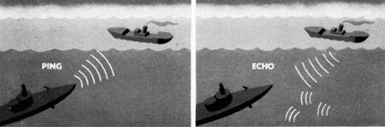
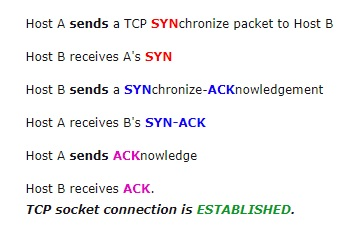

# 205.2. Advanced Network Configuration and Troubleshooting

* [ ] **205.2 Advanced Network Configuration and Troubleshooting**

**Weight:** 4

**Description:** Candidates should be able to configure a network device to implement various network authentication schemes. This objective includes configuring a multi-homed network device and resolving communication problems.

**Key Knowledge Areas:**

* Utilities to manipulate routing tables
* Utilities to configure and manipulate ethernet network interfaces
* Utilities to analyze the status of the network devices
* Utilities to monitor and analyze the TCP/IP traffic

**Terms and Utilities:**

* ip
* ifconfig
* route
* arp
* ss
* netstat
* lsof
* ping, ping6
* nc
* tcpdump
* nmap

In this lesson we discuss about some other Network tools which help up in network trouble shooting.

### What is socket?

In computer networking, and more definitely in software terms, a port is a logical entity which acts as a endpoint of communication to identify a given application or process on an Linux operating system. It is a 16-bit number \(0 to 65535\) which differentiates one application from another on end systems. Different categories of ports are:

* 0-1023 – the Well Known Ports, also referred to as System Ports.
* 1024-49151 – the Registered Ports, also known as User Ports.
* 49152-65535 – the Dynamic Ports, also referred to as the Private Ports.

The two most popular Internet transport protocols, Transmission Control Protocol \(TCP\) and the User Datagram Protocol \(UDP\) and other less known protocols use port numbers for communication sessions.

A combination of an IP address, port and protocol such as TCP/UDP is known as a socket, and every service must have a unique socket.

## netstat

netstat \(network statistics\)outputs network connections form local host perspective, routing, interface statistics, connections and multicast information. so its pretty handy.

```text
root@server1:~# netstat 
Active Internet connections (w/o servers)
Proto Recv-Q Send-Q Local Address           Foreign Address         State      
tcp        1      0 192.168.10.152:44480    hanger.canonical.c:http CLOSE_WAIT 
tcp        0      0 192.168.10.152:42844    yukinko.canonical.:http ESTABLISHED
udp        0      0 localhost:57079         ubuntu:domain           ESTABLISHED
udp        0      0 localhost:47407         ubuntu:domain           ESTABLISHED
Active UNIX domain sockets (w/o servers)
Proto RefCnt Flags       Type       State         I-Node   Path
unix  2      [ ]         DGRAM                    26445    /run/user/1000/systemd/notify
unix  2      [ ]         DGRAM                    22660    /run/user/108/systemd/notify
unix  9      [ ]         DGRAM                    15796    /run/systemd/journal/socket
unix  2      [ ]         DGRAM                    15797    /run/systemd/journal/syslog
unix  20     [ ]         DGRAM                    15798    /run/systemd/journal/dev-log
unix  3      [ ]         DGRAM                    14516    /run/systemd/notify
unix  3      [ ]         STREAM     CONNECTED     27303    
unix  3      [ ]         DGRAM                    16955    
unix  3      [ ]         STREAM     CONNECTED     23403    @/tmp/dbus-0tx8y6voha
unix  3      [ ]         STREAM     CONNECTED     30750    /run/systemd/journal/stdout
unix  3      [ ]         STREAM     CONNECTED     23522    /run/systemd/journal/stdout
unix  3      [ ]         STREAM     CONNECTED     28047    
unix  3      [ ]         STREAM     CONNECTED     22005    /run/systemd/journal/stdout
unix  3      [ ]         STREAM     CONNECTED     28223    @/tmp/dbus-K7JvDcncxI
unix  3      [ ]         STREAM     CONNECTED     22006    /run/systemd/journal/stdout
unix  3      [ ]         DGRAM                    28279    
unix  3      [ ]         STREAM     CONNECTED     27098    /var/run/dbus/system_bus_socket
unix  3      [ ]         STREAM     CONNECTED     28737    /var/run/cups/cups.sock
unix  3      [ ]         STREAM     CONNECTED     18372    /var/run/dbus/system_bus_socket
unix  3      [ ]         STREAM     CONNECTED     29963    
unix  3      [ ]         DGRAM                    16958    
unix  3      [ ]         STREAM     CONNECTED     23372    
unix  3      [ ]         STREAM     CONNECTED     22015    
unix  2      [ ]         DGRAM                    18086    
unix  3      [ ]         STREAM     CONNECTED     30009    
unix  3      [ ]         STREAM     CONNECTED     23529    /var/run/dbus/system_bus_socket
unix  3      [ ]         STREAM     CONNECTED     18188    /var/run/dbus/system_bus_socket
unix  3      [ ]         STREAM     CONNECTED     28042    
unix  3      [ ]         STREAM     CONNECTED     19237    /run/systemd/journal/stdout
unix  3      [ ]         STREAM     CONNECTED     30014    @/tmp/dbus-K7JvDcncxI
unix  3      [ ]         STREAM     CONNECTED     23289    
unix  3      [ ]         STREAM     CONNECTED     29849    
unix  3      [ ]         STREAM     CONNECTED     28050    @/com/ubuntu/upstart-session/1000/2169
unix  3      [ ]         STREAM     CONNECTED     23332    @/tmp/.X11-unix/X0
unix  3      [ ]         STREAM     CONNECTED     30806    
unix  2      [ ]         DGRAM                    22687    
unix  3      [ ]         STREAM     CONNECTED     27237    
unix  3      [ ]         STREAM     CONNECTED     28915    
unix  3      [ ]         STREAM     CONNECTED     26586    
unix  3      [ ]         STREAM     CONNECTED     24238    /run/systemd/journal/stdout
unix  2      [ ]         DGRAM                    22556    
unix  3      [ ]         STREAM     CONNECTED     27263    
unix  3      [ ]         STREAM     CONNECTED     30005    @/tmp/.X11-unix/X0
unix  3      [ ]         STREAM     CONNECTED     27232    
unix  3      [ ]         STREAM     CONNECTED     27174    @/tmp/dbus-K7JvDcncxI
unix  3      [ ]         STREAM     CONNECTED     18371    /var/run/dbus/system_bus_socket
unix  3      [ ]         STREAM     CONNECTED     25098    
unix  3      [ ]         STREAM     CONNECTED     17382    
unix  3      [ ]         STREAM     CONNECTED     28751    /run/systemd/journal/stdout
unix  3      [ ]         STREAM     CONNECTED     23256    
unix  3      [ ]         STREAM     CONNECTED     19416    /run/systemd/journal/stdout
unix  3      [ ]         STREAM     CONNECTED     27276    @/tmp/dbus-K7JvDcncxI
unix  3      [ ]         STREAM     CONNECTED     19418    /run/systemd/journal/stdout
unix  3      [ ]         STREAM     CONNECTED     28226    @/tmp/dbus-K7JvDcncxI
unix  3      [ ]         STREAM     CONNECTED     23528    
unix  3      [ ]         STREAM     CONNECTED     29966    
unix  3      [ ]         DGRAM                    16957    
unix  3      [ ]         STREAM     CONNECTED     19739    /var/run/dbus/system_
.....
....
..
.
```

netstat it self give us a log list of network information which might not be useful, so lets try some useful switches:

| useful netstat command switches | Description |
| :--- | :--- |
| -s , --statistics | gives summary by protocol type and message type |
| -i , --interfaces | Display a table of all network interfaces |
| -r , --route | shows  routing table  information |
| -a , --all | Show both listening and non-listening sockets |
| -t , --tcp | Enabales listening of tcp ports |
| -u , --udp | Enables listening of udp ports |
| -l , --listening | Prints only listening  sockets |
| -p , --program | Shows PID and the name of associated program |
| -e , --extend | Shows additional information, use twice for more info |
| -n , --numeric | Shows numerical addresses |

netstat supports ipv6.

## ss

The ss command is capable of showing more information than the netstat and is faster. The netstat command reads various /proc files to gather information. However this approach falls weak when there are lots of connections to display. This makes it slower.

The ss command gets its information directly from kernel space. The options used with the ss commands are very similar to netstat making it an easy replacement.

If we use the ss command without any arguments or options, it will return a complete list of TCP sockets with established connections:

```text
Netid  State      Recv-Q Send-Q Local Address:Port                 Peer Address:Port                
u_str  ESTAB      0      0       * 23433                 * 27689                
u_str  ESTAB      0      0       * 19210                 * 19211                
u_str  ESTAB      0      0       * 28948                 * 30007                
u_str  ESTAB      0      0       * 23378                 * 25314                
u_str  ESTAB      0      0      @/tmp/dbus-FSfvGgFOBN 23345                 * 25
283                
u_str  ESTAB      0      0       * 30024                 * 28207                
u_str  ESTAB      0      0       * 27840                 * 23551                
u_str  ESTAB      0      0      @/tmp/dbus-FSfvGgFOBN 25388                 * 23
459                
u_str  ESTAB      0      0      @/tmp/dbus-FSfvGgFOBN 29978                 * 31
023                
u_str  ESTAB      0      0      @/tmp/.X11-unix/X0 30930                 * 28156

u_str  ESTAB      0      0      /run/systemd/journal/stdout 28986               
  * 31082                
u_str  ESTAB      0      0      @/tmp/dbus-FSfvGgFOBN 27007                 * 23
483                
u_str  ESTAB      0      0      /var/run/dbus/system_bus_socket 20007           
      * 19011                
u_str  ESTAB      0      0       * 28949                 * 30010                
--More--
```

| useful ss command | Description |
| :--- | :--- |
| -l , --listening | Display only listening sockets |
| -4 | for IPv4 |
| -6 | for IPv6 |
| -a , --all | Display both listening and non-listening \(for TCP this means established connections\) sockets |
| -t , --tcp | Shows established or CONNECTED tcp connections |
| -u , --udp | Shows established or CONNECTED tcp connections |
| -s , --summary | Print summary statistics. |
| -o , --options | time information of each connection would be displayed |
| -n , --numeric | Do not try to resoleve service names |

## lsof

To get a list of files which are opened by users and associated processes with them we use lsof \(LiSt Open Files\).

```text
root@server1:~# lsof | more
COMMAND    PID  TID             USER   FD      TYPE             DEVICE SIZE/OFF       NODE NAME
systemd      1                  root  cwd       DIR                8,1     4096          2 /
systemd      1                  root  rtd       DIR                8,1     4096          2 /
systemd      1                  root  txt       REG                8,1  1577232     135885 /lib/systemd/systemd
systemd      1                  root  mem       REG                8,1    18976     136484 /lib/x86_64-linux-gnu/libuuid.so.1.3.0
systemd      1                  root  mem       REG                8,1   262408     136292 /lib/x86_64-linux-gnu/libblkid.so.1.1.0
systemd      1                  root  DEL       REG                8,1              136324 /lib/x86_64-linux-gnu/libdl-2.23.so
systemd      1                  root  mem       REG                8,1   456632     136429 /lib/x86_64-linux-gnu/libpcre.so.3.13.2
systemd      1                  root  DEL       REG                8,1              136300 /lib/x86_64-linux-gnu/libc-2.23.so
systemd      1                  root  DEL       REG                8,1              136446 /lib/x86_64-linux-gnu/libpthread-2.23.so
systemd      1                  root  mem       REG                8,1   286824     136376 /lib/x86_64-linux-gnu/libmount.so.1.1.0
systemd      1                  root  mem       REG                8,1    64144     136282 /lib/x86_64-linux-gnu/libapparmor.so.1.4.0
systemd      1                  root  mem       REG                8,1    92864     136363 /lib/x86_64-linux-gnu/libkmod.so.2.3.0
systemd      1                  root  mem       REG                8,1   117288     136290 /lib/x86_64-linux-gnu/libaudit.so.1.0.0
systemd      1                  root  mem       REG                8,1    55904     136416 /lib/x86_64-linux-gnu/libpam.so.0.83.1
systemd      1                  root  mem       REG                8,1   252152     136457 /lib/x86_64-linux-gnu/libseccomp.so.2.2.3
```

| lsof useful commmands | Description |
| :--- | :--- |
| lsof -n | Do not tries to resolve IP Addresses to DNS |
| lsof  /var/log/syslog | Shows which processes have opened specific file |
| lsof +D /var/log | List opened files under a Directory |
| lsof /home | List processes using a mount point |
| lsof -u payam | List files opened by a specific user |
| lsof -p 1357 | all open files by specific process |
| lsof -c ssh | List opened files based on process names starting with ... |
| lsof -t /var/log/syslog | list process id of a process which opened /var/log/syslog |
| lsof -i | list all network connections |

## ping

PING \(Packet INternet Groper\) command is the best way to test connectivity between two nodes. Whether it is Local Area Network \(LAN\) or Wide Area Network \(WAN\).

How does ping work? Ping use ICMP \(Internet Control Message Protocol\) to communicate to other devices.When a user pings a host on the Internet, a series of ICMP packets are sent to the host, which responds by sending packets in return. The user’s client is then able to compute the round trip time between two points on the Internet.



You can ping host name or ip address :

```text
root@server1:~# ping 8.8.8.8
PING 8.8.8.8 (8.8.8.8) 56(84) bytes of data.
64 bytes from 8.8.8.8: icmp_seq=1 ttl=128 time=244 ms
64 bytes from 8.8.8.8: icmp_seq=2 ttl=128 time=239 ms
^C
--- 8.8.8.8 ping statistics ---
2 packets transmitted, 2 received, 0% packet loss, time 1001ms
rtt min/avg/max/mdev = 239.179/241.812/244.446/2.679 ms

root@server1:~# ping yahoo.com
PING yahoo.com (98.139.180.180) 56(84) bytes of data.
64 bytes from media-router-fp1.prod.media.vip.bf1.yahoo.com (98.139.180.180): icmp_seq=1 ttl=128 time=248 ms
64 bytes from media-router-fp1.prod.media.vip.bf1.yahoo.com (98.139.180.180): icmp_seq=2 ttl=128 time=224 ms
64 bytes from media-router-fp1.prod.media.vip.bf1.yahoo.com (98.139.180.180): icmp_seq=3 ttl=128 time=232 ms
^C
--- yahoo.com ping statistics ---
3 packets transmitted, 3 received, 0% packet loss, time 2003ms
rtt min/avg/max/mdev = 224.253/235.002/248.218/9.953 ms
```

In Linux ping command keep executing until we interrupt.

| useful ping switches | Description |
| :--- | :--- |
| -v | verbose mode |
| -V | Show version and exit |
| -c 5 | Stop after sending 5 ECHO\_REQUEST packets. |
| -i 0.9 | Increase / decrease pint time interval |
| -O | Report outstanding ECHO REPLAY before sending next packet |
| - w 10 | Specify a timeout, in seconds, before ping exits regardless of how many packets have been sent or received |
| -s 100 | Change the default packet size from 56 to 100 |
| -R | Record and print route of how ECHO\_REQUEST sent and ECHO\_REPLY received |
| -a | Audible ping: Give beep when the peer is reachable |

## ping6

Regular ping command only works with IPv4 address. Use ping6 command to send ICMPv6 ECHO\_REQUEST packets to network hosts from a host or gateway. Try to set IPv6 gateway and test:

```text
ping6 ipv6.google.com
```

## nc

Netcat \(also known as ‘nc’ or ‘Swiss Army knife’\) is a networking utility used for reading or writing from TCP and UDP sockets using an easy interface. Netcat is used by Administrators, Developers and pen testers because of its features.

```text
  .       .       
  \`-"'"-'/       
   } 6 6 {        
  ==. Y ,==       
    /^^^\  .      
   /     \  )     
  (  )-(  )/     _
  -""---""---   / 
 /           \_/  
(     ____        
 \_.=|____E 

root@server1:~# nc
This is nc from the netcat-openbsd package. An alternative nc is available
in the netcat-traditional package.
usage: nc [-46bCDdhjklnrStUuvZz] [-I length] [-i interval] [-O length]
      [-P proxy_username] [-p source_port] [-q seconds] [-s source]
      [-T toskeyword] [-V rtable] [-w timeout] [-X proxy_protocol]
      [-x proxy_address[:port]] [destination] [port]
```

With netcat \(nc\) we can setup kind of client server connection over a specific port. For demo lets start chatting between two servers, server1 starts listening on port 12345:

```text
root@server1:~# nc -l 12345
```

send text stream from server2 to server1:

```text
root@server2:~$ su 
Password: 
root@server2:/home/payam# su -
root@server2:~# nc 192.168.10.152 80
Hello!
I'm here to send some messages over port 80
using netcat :)
```

and see the result on server1:

```text
Hello!
I'm here to send some messages over port 80
using netcat :)
```

| netcat useful switches | Description |
| :--- | :--- |
| -4 | Forces nc to use IP v4 only |
| -6 | Forces nc to use IP v6 only |
| -v | Give more verbose output |
| -n | Do not DNS Lookup for IP Addresses, Host Name or ports |
| -k | allow server to  continue listening  after client disconnect |
| -u | use udp |
| -w | setting up time out |

also we can use nc for prt scanning although netcat is not the best tool for the job:

```text
root@server2:~# nc -v 192.168.10.152 -z 12340-12346
nc: connect to 192.168.10.152 port 12340 (tcp) failed: Connection refused
nc: connect to 192.168.10.152 port 12341 (tcp) failed: Connection refused
nc: connect to 192.168.10.152 port 12342 (tcp) failed: Connection refused
nc: connect to 192.168.10.152 port 12343 (tcp) failed: Connection refused
nc: connect to 192.168.10.152 port 12344 (tcp) failed: Connection refused
Connection to 192.168.10.152 12345 port [tcp/*] succeeded!
nc: connect to 192.168.10.152 port 12346 (tcp) failed: Connection refused
```

-z says that nc should just scan for listening daemons, without sending any data to them. can not be used with -l option.

## tcpdump

tcpdump is command-line packet sniffers and analyzer tool which is used to capture or filter TCP/IP packets which recieved or transfered over a network on a specific interface.

tcpdump also give us a option to save captured packets in a file in a pcap format. It is very useful for future analysis and also file can be viewed by tcpdump command or a open source GUI based tool like Wireshark.

```text
root@server1:~# tcpdump 
tcpdump: verbose output suppressed, use -v or -vv for full protocol decode
listening on ens33, link-type EN10MB (Ethernet), capture size 262144 bytes
03:12:41.296807 IP economy.canonical.com.http > 192.168.10.152.60388: Flags [P.], seq 877174157:877175557, ack 3379990991, win 64240, length 1400: HTTP
03:12:41.297065 IP 192.168.10.152.60388 > economy.canonical.com.http: Flags [.], ack 1400, win 65535, length 0
03:12:41.298574 IP economy.canonical.com.http > 192.168.10.152.60388: Flags [P.], seq 1400:2800, ack 1, win 64240, length 1400: HTTP
03:12:41.298621 IP economy.canonical.com.http > 192.168.10.152.60388: Flags [P.], seq 2800:7000, ack 1, win 64240, length 4200: HTTP
03:12:41.298650 IP 192.168.10.152.60388 > economy.canonical.com.http: Flags [.], ack 7000, win 65535, length 0
03:12:41.299625 IP economy.canonical.com.http > 192.168.10.152.60388: Flags [P.], seq 7000:8400, ack 1, win 64240, length 1400: HTTP
03:12:41.300067 IP 192.168.10.152.60388 > economy.canonical.com.http: Flags [.], ack 8400, win 65535, length 0
03:12:41.798839 IP economy.canonical.com.http > 192.168.10.152.60388: Flags [P.], seq 92300:93600, ack 1, win 64240, length 1300: HTTP
03:12:41.799351 IP 192.168.10.152.60388 > economy.canonical.com.http: Flags [.], ack 93600, win 65535, length 0
03:12:41.800018 IP economy.canonical.com.http > 192.168.10.152.60388: Flags [P.], seq 93600:96200, ack 1, win 64240, length 2600: HTTP
03:12:41.800610 IP 192.168.10.152.60388 > economy.canonical.com.http: Flags [.], ack 96200, win 65535, length 0
03:12:41.801294 IP economy.canonical.com.http > 192.168.10.152.60388: Flags [P.], seq 96200:101600, ack 1, win 64240, length 5400: HTTP
03:12:41.801393 IP 192.168.10.152.60388 > economy.canonical.com.http: Flags [.], ack 101600, win 65535, length 0
03:12:41.801538 IP economy.canonical.com.http > 192.168.10.152.60388: Flags [P.], seq 101600:103000, ack 1, win 64240, length 1400: HTTP
03:12:41.801743 IP 192.168.10.152.60388 > economy.canonical.com.http: Flags [.], ack 103000, win 65535, length 0
03:12:41.807292 IP economy.canonical.com.http > 192.168.10.152.60388: Flags [P.], seq 103000:114200, ack 1, win 64240, length 11200: HTTP
03:12:41.807493 IP 192.168.10.152.60388 > economy.canonical.com.http: Flags [.], ack 114200, win 65535, length 0
03:12:41.808278 IP economy.canonical.com.http > 192.168.10.152.60388: Flags [P.], seq 114200:118400, ack 1, win 64240, length 4200: HTTP
03:12:41.808417 IP 192.168.10.152.60388 > economy.canonical.com.http: Flags [.], ack 118400, win 65535, length 0
03:12:41.809282 IP economy.canonical.com.http > 192.168.10.152.60388: Flags [P.], seq 118400:123500, ack 1, win 64240, length 5100: HTTP
03:12:41.809402 IP 192.168.10.152.60388 > economy.canonical.com.http: Flags [.], ack 123500, win 65535, length 0
03:12:41.952442 IP economy.canonical.com.http > 192.168.10.152.60388: Flags [P.], seq 123500:124800, ack 1, win 64240, length 1300: HTTP
03:12:41.952677 IP 192.168.10.152.60388 > economy.canonical.com.http: Flags [.], ack 124800, win 65535, length 0
03:12:41.961111 IP economy.canonical.com.http > 192.168.10.152.60388: Flags [P.], seq 124800:127400, ack 1, win 64240, length 2600: HTTP
03:12:41.961181 IP 192.168.10.152.60388 > economy.canonical.com.http: Flags [.], ack 127400, win 65535, length 0
^C
27 packets captured
71 packets received by filter
44 packets dropped by kernel
```

watch some usefull tcpdum commands:

| useful tcpdump command | Description |
| :--- | :--- |
| tcpdump -D | Display available interfaces |
| tcpdum -i ens33 | Capture Packets from specific interface |
| tcpdump -c 10 -i ens33 | Capture only N neumber of packets |
| tcpdump -w myfile.pcap -i ens33 | Capture and save packets in a file |
| tcpdump -r myfile.pcap | Read captured packets file |
| tcpdump -n -i ens33 | Capture IP address Packets |
| tcpdum -i ens33 tcp | Only TCP Packets are captured |
| tcpdump -i ens33 port 22 | Capture packets from specific  port |
| tcpdump -i eth0 src 192.168.10.150 | Capture packets from source IP |
| tcpdump -i eth0 dst 209.85.144.139 | Capture packets from destination IP |
| tcpdump -i ens33 ipv6 | Sniffing for IPv6 |

## nmap

nmap \(Network Mapper\) is a security scanner.It is used to discover hosts and services on a computer network, whith the goal of building a "map" of the network. To accomplish it, Nmap sends specially designed packets to the target host\(s\) and then analyzes the responses. Nmap can adapt to network conditions including latency and congestion during a scan. The Nmap user community continues to develop and refine the tool.


Nmap was originally written for Linux, but it has been ported to major operating systems, such as Windows, Solaris, HP-UX, etc. There is even a free and open source GUI called Zenmap.

Although usually used for port scanning, Nmap offers many additional features:

* host discovery.
* operating system detection.
* service version detection.
* network information about targets, such as DNS names, device types, and MAC addresses.
* ability to scan for well-known vulnerabilities.

  nmap is not installed by default on most of linux distros and we need to install it:

```text
root@server1:~# apt install  nmap
```

Before start scanning please note that Port scanning without authorization is sometimes against the provider's acceptable use policy \(AUP\).


Till the end of war Its better to test it on your own network and do not take the risk. nmap command with no option just prints its long list of switches and options. For our demonstartion we scan scanme.nmap.org :

```text
root@server1:~# nmap -v scanme.nmap.org

Starting Nmap 7.01 ( https://nmap.org ) at 2018-01-22 03:25 PST
Initiating Ping Scan at 03:25
Scanning scanme.nmap.org (45.33.32.156) [4 ports]
Completed Ping Scan at 03:25, 0.24s elapsed (1 total hosts)
Initiating Parallel DNS resolution of 1 host. at 03:25
Completed Parallel DNS resolution of 1 host. at 03:25, 0.35s elapsed
Initiating SYN Stealth Scan at 03:25
Scanning scanme.nmap.org (45.33.32.156) [1000 ports]
Discovered open port 80/tcp on 45.33.32.156
Discovered open port 22/tcp on 45.33.32.156
Increasing send delay for 45.33.32.156 from 0 to 5 due to 11 out of 24 dropped probes since last increase.
SYN Stealth Scan Timing: About 12.63% done; ETC: 03:29 (0:03:34 remaining)
SYN Stealth Scan Timing: About 14.37% done; ETC: 03:32 (0:06:04 remaining)
Increasing send delay for 45.33.32.156 from 5 to 10 due to 11 out of 11 dropped probes since last increase.
SYN Stealth Scan Timing: About 58.53% done; ETC: 03:28 (0:01:04 remaining)
Completed SYN Stealth Scan at 03:27, 109.38s elapsed (1000 total ports)
Nmap scan report for scanme.nmap.org (45.33.32.156)
Host is up (0.0018s latency).
Other addresses for scanme.nmap.org (not scanned): 2600:3c01::f03c:91ff:fe18:bb2f
Not shown: 987 filtered ports
PORT     STATE  SERVICE
21/tcp   closed ftp
22/tcp   open   ssh
53/tcp   closed domain
80/tcp   open   http
110/tcp  closed pop3
143/tcp  closed imap
443/tcp  closed https
587/tcp  closed submission
993/tcp  closed imaps
995/tcp  closed pop3s
3389/tcp closed ms-wbt-server
8080/tcp closed http-proxy
8291/tcp closed unknown

Read data files from: /usr/bin/../share/nmap
Nmap done: 1 IP address (1 host up) scanned in 110.55 seconds
           Raw packets sent: 3033 (133.256KB) | Rcvd: 1500 (60.008KB)
```

The `-v` option enables verbose mode.

| nmap Target selection | Description |
| :--- | :--- |
| nmap 192.168.10.151 | scan a single IP |
| nmap scanme.nmap.org | scan a host |
| nmap 192.168.10.150-155 | scan a range of IPs |
| nmap 192.168.10.0/24 | scan a subnet |
| nmap -iL myserverlist.txt | scan targets from a text file |
| nmap -6 \[IP-V6-HERE\] | enables IP v6 scanning |

okey and ports:

| nmap port selection | Dedscription |
| :--- | :--- |
| nmap -p 22 192.168.10.151 | scan a single port |
| nmap -p 1-100 192.168.10.151 | scan a range of port |
| nmap -F 192.168.10.151 | Fast-scan 100 most common ports |
| nmap -p- 192.168.10.151 | scan all 65535 ports |

Hmm. nmap has different techniques for scanning. But before explaining them we review some fundamentals.

### TCP 3-Way Handshake Diagram

Below is a very simplified diagram of the TCP 3-way handshake process. Have a look at the diagram on the right as you examine the list of events on the left.

| Event | Diagram |
| :--- | :---: |
|  |  |

after this small review we can talk about nmap different methods of scanning:

* **TCP SYN Scan \(-sS\)**

It is a basic scan, and it is also called half-open scanning because this technique allows Nmap to get information from the remote host without the complete TCP handshake process, Nmap sends SYN packets to the destination, but it does not create any sessions, As a result, the target computer can’t create any log of the interaction because no session was initiated, making this feature an advantage of the TCP SYN scan.`nmap -sT 192.168.10.151`

* **TCP connect\(\) scan \(-sT\)**

This the default scanning technique used, if and only if the SYN scan is not an option, because the SYN scan requires root privilege. Unlike the TCP SYN scan, it completes the normal TCP three way handshake process and requires the system to call connect\(\), which is a part of the operating system. Keep in mind that this technique is only applicable to find out the TCP ports, not the UDP ports. `nmap -sT 192.168.10.151`

* **UDP Scan \(-sU\)**

As the name suggests, this technique is used to find an open UDP port of the target machine. It does not require any SYN packet to be sent because it is targeting the UDP ports. But we can make the scanning more effective by using -sS along with –sU. UDP scans send the UDP packets to the target machine, and waits for a response—if an error message arrives saying the ICMP is unreachable, then it means that the port is closed; but if it gets an appropriate response, then it means that the port is open.

`nmap -sU 192.168.10.151`

* **FIN Scan \(-sF\)**

Sometimes a normal TCP SYN scan is not the best solution because of the firewall. IDS and IPS scans might be deployed on the target machine, but a firewall will usually block the SYN packets. A FIN scan sends the packet only set with a FIN flag, so it is not required to complete the TCP handshaking.

The target computer is not able to create a log of this scan \(again, an advantage of FIN\). Just like a FIN scan, we can perform an xmas scan \(-sX\) and Null scan \(-sN\). The idea is same but there is a difference between each type of scan.

* **Ping Scan \(-sP\)**

Ping scanning is unlike the other scan techniques because it is only used to find out whether the host is alive or not, it is not used to discover open ports. Ping scans require root access s ICMP packets can be sent, but if the user does not have administrator privilege, then the ping scan uses connect\(\) call. `nmap -sP 192.168.10.151`

* **Version Detection \(-sV\)**

Version detection is the right technique that is used to find out what software version is running on the target computer and on the respective ports. It is unlike the other scanning techniques because it is not used to detect the open ports, but it requires the information from open ports to detect the software version. In the first step of this scan technique, version detection uses the TCP SYN scan to find out which ports are open. ****`nmap -sV 192.168.10.151`

* **Idle Scan \(-sI\)**

Idle scan is one of my favorite techniques, and it is an advance scan that provides complete anonymity while scanning. In idle scan, Nmap doesn’t send the packets from your real IP address—instead of generating the packets from the attacker machine, Nmap uses another host from the target network to send the packets. ex: ****`nmap -sI 192.168.1.6 192.168.1.1`

The idle scan technique \(as mentioned above\) is used to discover the open ports on 192.168.1.1 while it uses the zombie\_host \(192.168.1.6\) to communicate with the target host. So this is an ideal technique to scan a target computer anonymously.

There are many other scanning techniques are available like FTP bounce, fragmentation scan, ... but that is enough for LPIC exam.

