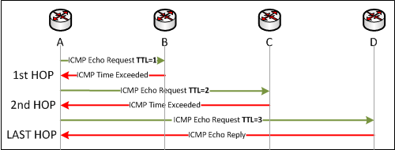
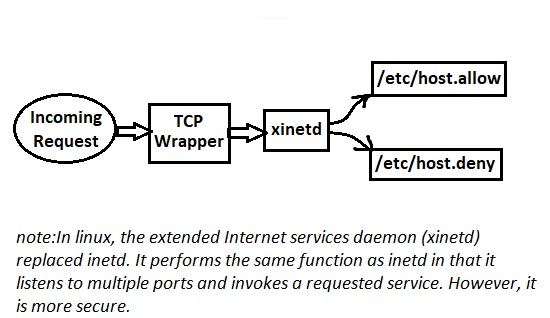

# 205.3 Troubleshooting Network Issues

## **205.3 Troubleshooting Network Issues**

**Weight:** 4

**Description:** Candidates should be able to identify and correct common network setup issues, to include knowledge of locations for basic configuration files and commands.

**Key Knowledge Areas:**

* Location and content of access restriction files
* Utilities to configure and manipulate ethernet network interfaces
* Utilities to manage routing tables
* Utilities to list network states.
* Utilities to gain information about the network configuration
* Methods of information about the recognized and used hardware devices
* System initialization files and their contents \(SysV init process\)
* Awareness of NetworkManager and its impact on network configuration

**Terms and Utilities:**

* ip
* ifconfig
* route
* ss
* netstat
* /etc/network/, /etc/sysconfig/network-scripts/
* ping, ping6
* traceroute, traceroute6
* mtr
* hostname
* System log files such as /var/log/syslog, /var/log/messages and the systemd journal
* dmesg
* /etc/resolv.conf
* /etc/hosts
* /etc/hostname, /etc/HOSTNAME
* /etc/hosts.allow, /etc/hosts.deny

Network Configuration files are different in Debian and Redhat systems.

| Debian | RedHat |
| :--- | :--- |
| /etc/networks/ | /etc/sysconfig/network-scripts |

Lets take a closer look at both of them, in RedHat :

```text
root@server1:/etc/network# tree
.
├── if-down.d
│   ├── avahi-autoipd
│   ├── resolvconf
│   ├── upstart
│   └── wpasupplicant -> ../../wpa_supplicant/ifupdown.sh
├── if-post-down.d
│   ├── avahi-daemon -> ../if-up.d/avahi-daemon
│   ├── wireless-tools
│   └── wpasupplicant -> ../../wpa_supplicant/ifupdown.sh
├── if-pre-up.d
│   ├── ethtool
│   ├── wireless-tools
│   └── wpasupplicant -> ../../wpa_supplicant/ifupdown.sh
├── if-up.d
│   ├── 000resolvconf
│   ├── avahi-autoipd
│   ├── avahi-daemon
│   ├── ethtool
│   ├── openssh-server
│   ├── upstart
│   └── wpasupplicant -> ../../wpa_supplicant/ifupdown.sh
├── interfaces
└── interfaces.d

5 directories, 18 files
```

and in CentOS:

```text
[root@server1 network-scripts]# tree
.
├── ifcfg-ens33
├── ifcfg-ens34
├── ifcfg-lo
├── ifdown -> ../../../usr/sbin/ifdown
├── ifdown-bnep
├── ifdown-eth
├── ifdown-ib
├── ifdown-ippp
├── ifdown-ipv6
├── ifdown-isdn -> ifdown-ippp
├── ifdown-post
├── ifdown-ppp
├── ifdown-routes
├── ifdown-sit
├── ifdown-Team
├── ifdown-TeamPort
├── ifdown-tunnel
├── ifup -> ../../../usr/sbin/ifup
├── ifup-aliases
├── ifup-bnep
├── ifup-eth
├── ifup-ib
├── ifup-ippp
├── ifup-ipv6
├── ifup-isdn -> ifup-ippp
├── ifup-plip
├── ifup-plusb
├── ifup-post
├── ifup-ppp
├── ifup-routes
├── ifup-sit
├── ifup-Team
├── ifup-TeamPort
├── ifup-tunnel
├── ifup-wireless
├── init.ipv6-global
├── network-functions
└── network-functions-ipv6

0 directories, 38 files
```

In both distributions there are many scripts and directories. Many linux networking features are configured under this directory.

as quick review over LPIC1:

Network Configuration Files:

| Debian | RedHat |
| :--- | :--- |
| /etc/network/interfaces | /etc/sysconfig/network-scripts/ifcfg-ens33 |

While Debian based systems usually use a file for any available network interfaces in RedHat based distro each NIC has a specific file for its configuration.

Debian:

```text
# interfaces(5) file used by ifup(8) and ifdown(8)
auto lo
iface lo inet loopback
#auto ens33

iface ens33 inet static
address 192.168.10.152
netmask 255.255.255.0
network 192.168.10.0
broadcast 192.168.10.255
gateway 192.168.10.2
dns-nameservers 8.8.8.8
gateway 192.168.10.2
```

RedHat:

```text
TYPE=Ethernet
PROXY_METHOD=none
BROWSER_ONLY=no
BOOTPROTO=dhcp
DEFROUTE=yes
IPV4_FAILURE_FATAL=no
IPV6INIT=yes
IPV6_AUTOCONF=yes
IPV6_DEFROUTE=yes
IPV6_FAILURE_FATAL=no
IPV6_ADDR_GEN_MODE=stable-privacy
NAME=ens33
UUID=8b2c8289-3eac-42cb-bf01-113cf1cac8ad
DEVICE=ens33
ONBOOT=no
DNS1=8.8.8.8
```

In Debain based systems Default Gateway setting are defines in networks configuration file but In RedHat systems, the Default Gateway is configured in /etc/sysconfig/network file.

## /etc/resolv.conf

List DNS servers for internet domain name resolution.

In Debian:

```text
root@server1:~# cat /etc/resolv.conf 
# Dynamic resolv.conf(5) file for glibc resolver(3) generated by resolvconf(8)
#     DO NOT EDIT THIS FILE BY HAND -- YOUR CHANGES WILL BE OVERWRITTEN
```

in RedHat:

```text
# Generated by NetworkManager
search localdomain
nameserver 192.168.10.2
nameserver 8.8.8.8
```

When we change the DNS configuration using /etc/resolv.conf file, we must have noticed that the changes are not permanent. A reboot and your changes might revert to the original settings.

/etc/resolv.conf gets overwritten by several things. the scripts /etc/sysconfig/network-scripts/ifcfg-xxx files in redhat or /etc/network/interfaces in Debian , /etc/sysconfig/network \(sometimes\), DHCP client \(depending on its configuration\), and NetworkManager. as an example to make a persistent change in resolv.conf using DHCP client config file, uncomment :

```text
root@server1:/# cat /etc/dhcp/dhclient.conf | grep prepend\ domain-name-servers
#prepend domain-name-servers 127.0.0.1;
```

another way is to edit head or base or tail file under resolv.d directory :

```text
root@server1:/etc# tree resolvconf/
resolvconf/
├── interface-order
├── resolv.conf.d
│   ├── base
│   └── head
├── update.d
│   └── libc
└── update-libc.d
    └── avahi-daemon

3 directories, 5 files
```

* base: Used when no other data can be found
* head: Used for the header of resolv.conf, can be used to ensure a DNS server is always the first one in the list
* tail: Any entry in tail is appended at the end of the resulting resolv.conf.

It has been getting harder to trace the changes ever since systemd has been added to the system since much of the startup is being hidden. systemd-resolved is a caching only name server that modified resolv.conf to include it in the search.It also generates /run/systemd/resolve/resolv.conf for compatibility which may be symlinked from /etc/resolv.conf \(Ubuntu\):

```text
root@server1:/etc# ls -l | grep resolv.conf 
lrwxrwxrwx  1 root root      29 Nov 26 02:38 resolv.conf -> ../run/resolvconf/resolv.conf
```

## traceroute, traceroute6

traceroute print the route packets take to network host.

```text
root@server1:~# traceroute google.com
traceroute to google.com (74.125.236.132), 30 hops max, 60 byte packets
1  220.224.141.129 (220.224.141.129)  89.174 ms  89.094 ms  89.054 ms
2  115.255.239.65 (115.255.239.65)  109.037 ms  108.994 ms  108.963 ms
3  124.124.251.245 (124.124.251.245)  108.937 ms  121.322 ms  121.300 ms
4  * 115.255.239.45 (115.255.239.45)  113.754 ms  113.692 ms
5  72.14.212.118 (72.14.212.118)  123.585 ms  123.558 ms  123.527 ms
6  72.14.232.202 (72.14.232.202)  123.499 ms  123.475 ms  143.523 ms
7  216.239.48.179 (216.239.48.179)  143.503 ms  95.106 ms  95.026 ms
8  bom03s02-in-f4.1e100.net (74.125.236.132)  94.980 ms  104.989 ms  104.954 ms
```

But How traceroute command bring this information to us ? Like ping, trace route uses ICMP packets. But Traceroute utility uses the TTL field in the IP header to achieve its operation. Hmm, What is TTL then ?

Simply it is lifetime of the packet on network. Each time the packet is held on a router, it decreases the TTL value by 1. When a router finds the TTL value of 1 in a received packet then that packet is not forwarded but instead discarded.

After discarding the packet, router sends an ICMP error message of “Time exceeded” back to the source from where packet generated. The ICMP packet that is sent back contains the IP address of the router. :\)



So now it can be easily understood that traceroute operates by sending packets with TTL value starting from 1 and then incrementing by one each time. Each time a router receives the packet, it checks the TTL field, if TTL field is 1 then it discards the packet and sends the ICMP error packet containing its IP address and this is what traceroute requires. So traceroute incrementally fetches the IP of all the routers between the source and the destination.

| traceroute useful commands | Description |
| :--- | :--- |
| traceroute -i ens33 google.com | Specify the Interface to use |
| traceroute google.com -n | Disable Host Name and IP address mapping |
| traceroute google.com -w 0.2 | Configure Response Wait Time |
| traceroute google.com -q 5 | Configure Number of queries per Hop \(default: 3\) |
| traceroute google.com -f 8 | Configure The TTL Value to start with |
| traceroute -6 ipv6.google.com | trace the route using IPv6 |

traceroute6 is equivalent to traceroute -6.

## mtr

We have talked about ping and traceroute. How about combining the functionality of both command into one mtr command? MTR is a powerful network diagnostic tool that enables administrators to diagnose and provide helpful reports of network status. \(mtr might not be installed, install it and use it\):

```text
root@server1:~# mtr google.com
```

```text
HOST: server1                      Loss%   Snt   Last   Avg  Best  Wrst StDev
  1. inner-cake                    0.0%    10    2.8   2.1   1.9   2.8   0.3
  2. outer-cake                    0.0%    10    3.2   2.6   2.4   3.2   0.3
  3. 68.85.118.13                  0.0%    10    9.8  12.2   8.7  18.2   3.0
  4. po-20-ar01.absecon.nj.panjde  0.0%    10   10.2  10.4   8.9  14.2   1.6
  5. be-30-crs01.audubon.nj.panjd  0.0%    10   10.8  12.2  10.1  16.6   1.7
  6. pos-0-12-0-0-ar01.plainfield  0.0%    10   13.4  14.6  12.6  21.6   2.6
  7. pos-0-6-0-0-cr01.newyork.ny.  0.0%    10   15.2  15.3  13.9  18.2   1.3
  8. pos-0-4-0-0-pe01.111eighthav  0.0%    10   16.5  16.2  14.5  19.3   1.3
  9. as15169-3.111eighthave.ny.ib  0.0%    10   16.0  17.1  14.2  27.7   3.9
 10. 72.14.238.232                 0.0%    10   19.1  22.0  13.9  43.3  11.1
 11. 209.85.241.148                0.0%    10   15.1  16.2  14.8  20.2   1.6
 12. lga15s02-in-f104.1e100.net    0.0%    10   15.6  16.9  15.2  20.6   1.7
```

How does it work ? Like other Networking diagnostic tools including ping, traceroute, mtr use ICMP packets to test contention and traffic between two points on the Internet. and like traceroute it gathers required information of network by increasing TTL of packets.

| useful mtr switches | Description |
| :--- | :--- |
| -h , --help | Print the summary of command line argument options |
| -v , --version | Print the installed version of mtr |
| -r , --report | This option puts mtr into report mode. When in this mode, mtr will run for the number of cycles specified by the -c option, and then print statistics and exit. -c COUNT |
| -n , --no-dns | force mtr to display numeric IP numbers and not try to resolve the hostnames |
| -F serverslist.txt | Read servers list  From a file |
| -4 | Use IPv4 Only |
| -6 | Use IPv6 Only |

## hostname

Device or system hostnames are used to easily recognize a machine within a network in a human readable format. It is not much of a surprise, but on Linux system, the hostname can be easily changed by using simple command as hostname .

```text
root@server1:~# hostname
server1
root@server1:~# hostname myhostname
root@server1:~# hostname
myhostname
```

This will change the hostname of your system immediately, but there is one problem – the original hostname will be restored upon next reboot.

### Set System hostname permanently

The way tht we make system hostname permanent is different in RedHat and Ubuntu, also it has been changed in Latest modern linux with systemd. Lets go:

* For Older Linux distributions, which uses SysV , We can change hostname by simply editing the hostname file located in /etc/hostname and then we have to add another record for hostname in /etc/hosts:

```text
127.0.0.1 myhostname
```

and Finally:

```text
hostname restart
```

* On RHEL/CentOS based systems that use init, the hostname is changed by modifying /etc/sysconfig/network

  ```text
  [root@myhostname ~]# cat /etc/sysconfig/network
  NETWORKING=yes
  NETWORKING_IPV6=yes
  HOSTNAME=myhostname
  ```

* Newer version of different Linux distributions such as latest Ubuntu, Debian, CentOS, Fedora, RedHat, etc. comes with systemd, a system and service manager that provides a hostnamectl command to manage hostnames in Linux.

```text
root@server1:~# hostnamectl set-hostname myhostname
```

## /etc/host

As our machine gets started, it will need to know the mapping of some hostnames to IP addresses before DNS can be referenced. This mapping is kept in the /etc/hosts file. In the absence of a name server, any network program on our system consults this file to determine the IP address that corresponds to a host name.

```text
root@server1:~# 
cat /etc/hosts
127.0.0.1    localhost
127.0.1.1    ubuntu

# The following lines are desirable for IPv6 capable hosts
::1     ip6-localhost ip6-loopback
fe00::0 ip6-localnet
ff00::0 ip6-mcastprefix
ff02::1 ip6-allnodes
ff02::2 ip6-allrouters
```

## /etc/host.allow , /etc/host.deny

Can you remmember TCP wrappers ? as a quick review TCP wrappers are used to restrict access to network services running on a Linux server. However, we must clarify that the use of TCP wrappers does not eliminate the need for a properly configured firewall. We can think of this tool as a host-based access control list, and not as the ultimate security measure for our system.But how they are related to /etc/host.allow and host.deny?



When a network request reaches server, TCP wrappers uses hosts.allow and hosts.deny \(in that order\) to determine if the client should be allowed to use a given service.

By default, these files are empty, all commented out, or do not exist. Thus, everything is allowed through the TCP wrappers layer and our system is left to rely on the firewall for full protection.To resolve this edit host.allow / host.deny file.First make sure that they do exist:

```text
root@server1:~# ls -l /etc/hosts.allow /etc/hosts.deny 
-rw-r--r-- 1 root root 411 Aug  1  2017 /etc/hosts.allow
-rw-r--r-- 1 root root 711 Aug  1  2017 /etc/hosts.deny
```

The syntax of both files is:

```text
<services> : <clients> [: <option1> : <option2> : ...]
```

* services is a comma-separated list of services the current rule should be applied to.
* clients  list of comma-separated hostnames or IP addresses affected by the rule.

The following wildcards are accepted:

| Wildcards Description |
| :--- |
| ALL matches everything. Applies both to clients and services. |
| LOCAL matches hosts without a period in their FQDN, such as localhost. |
| KNOWN indicate a situation where the hostname, host address, or user are known. |
| UNKNOWN is the opposite of KNOWN. |
| PARANOID causes a connection to be dropped if reverse DNS lookups  return a different address in each case. |

* Finally, an optional list of colon-separated actions indicate what should happen when a given rule is triggered.

Unfortunately, not all network services support the use of TCP wrappers. libwrap should be included among shared libraries which used by a program to show TCP wrappers is supported. `ldd /path/to/binary | grep libwrap`

```text
root@server1:~# ldd $(which sshd) | grep libwrap
    libwrap.so.0 => /lib/x86_64-linux-gnu/libwrap.so.0 (0x00007fc2bbfca000)
```

okey, as an example To allow SSH and FTP access only to 192.168.10.151 and localhost and deny all others, add these two lines in /etc/hosts.deny:

```text
sshd,vsftpd : ALL
ALL : ALL
```

and the following line in /etc/hosts.allow:

```text
sshd,vsftpd : 192.168.10.151,LOCAL
```

and Done

