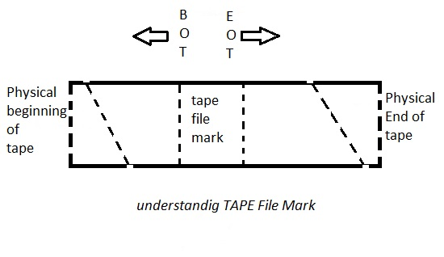
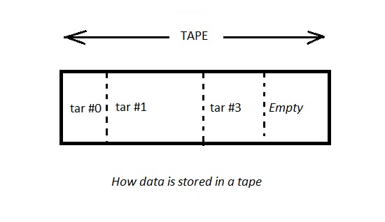

# 206.2. Backup operations

## **206.2 Backup operations**

**Weight:** 3

**Description:** Candidates should be able to use system tools to back up important system data.

**Key Knowledge Areas:**

* Knowledge about directories that have to be include in backups
* Awareness of network backup solutions such as Amanda, Bacula, Bareos and BackupPC
* Knowledge of the benefits and drawbacks of tapes, CDR, disk or other backup media
* Perform partial and manual backups.
* Verify the integrity of backup files.
* Partially or fully restore backups.

**Terms and Utilities:**

* /bin/sh
* dd
* tar
* /dev/st\* and /dev/nst\*
* mt
* rsync

## Why do we need to Backup?

We have already talk about RAID and LVM, although making RAID group or creating LVM, make sort of reliability and safetiness but they are not consider as backup solutions. We might lose data and experience failure because of different reasons:

* electricity goes off
* Hardware failure \(mobo, cpu, ram, hard disks, ...\)
* human kind miss configuration
* ...

To tell the truth the last reason is the most common and the most dangerous one. To avoid them we need to backup, we have to backup, we are forced to backup.

## What to backup?

Not all directories and file are required to be backed up especially when there backup space issues. In linux File System Hierarchy Standard \(FHS\) there are directories and files with different priority for backing up:

| Directory | Priority | Description |
| :--- | :--- | :--- |
| /etc/ | high | system wide configuration files required for all programs |
| /home/ | high | Home directories for all users to store their personal files |
| /usr/local/ | high | contains users programs that you install from source |
| /var/lib/ | medium | contains lots of data, getting full backup leave us on the safe side. |
| /var/mail/ | medium | local emails |
| /var/www/ | medium | deafult web root |
| /var/spool/ | medium | printer queues but might used by some applications |
| /var/log/ | low | system log files |
| /opt/ | medium | Contains add-on applications from individual vendors |
| /usr/ | low | Contains binaries, libraries, documentation, and source-code for second level program |

## How to backup?

In any platform there are always some native tools and third party programs for backing up:

| Package | Licence | Language | Graphical user \(GUI\) interface | Command Line\(CMD\)interface |
| :--- | :--- | :--- | :--- | :--- |
|  | BSD | C , Perl | No \(except with Amanda Enterprise\) | Yes |
|  | GPLv2.0 | Perl | Yes | Yes |
|  | AGPLv3.0 | C , C++ | Yes | Yes |

All three Packages has Linux, windows, MacOS versions. Now lets spend time on some traditional native tools for backing up.

### tape

Using tapes for backing up is some how out modded but tapes are still used because they are cheap and huge but they are very slow. If we have had chance to administrate a system with tape device plugged, we would see these directories.

* /dev/st0
* /dev/nst0

The /dev/nst0 device is a non rewinding tape device, where as the /dev/st0 device is a rewinding tape device. The device you choose to use depends on your goal. Both devices are for the same piece of hardware but they behave differently. we can rewind /dev/st0 by using software but we can not use software for /dev/nst0 so we have to rewind it physically.

### Understanding tape file marks and block size



Each tape device can store multiple tape backup files. Tape backup files are created using cpio, tar, dd, and so on. However, tape device can be opened, written data to, and closed by the various program. We can store several backups \(tapes\) on physical tape. Between each tape file is a “tape file mark”. This is used to indicate where one tape file ends and another begins on physical tape. You need to use mt command to positions the tape \(winds forward and rewinds and marks\).

### mt command

mt command is used to control operations of the tape drive, such as finding status or seeking through files on a tape or writing tape control marks to the tape.

| some mt command examples | Description |
| :--- | :--- |
| mt -f /dev/st0 rewind | rewind tape drive |
| mt -f /dev/st0 status | Display status  information about tape unit |
| mt -f /dev/st0 erase | erase the tape |
| mt -f /dev/st0 eject | eject tape drive |
| mt -f /dev/st0 eof | Writes n EOF marks in the current position of tape |

Here is the list of tape position commands:

```text
       fsf    Forward space count files.  The tape is positioned on the first block of the next file.

       fsfm   Forward space count files.  The tape is positioned on the last block of the previous file.

       bsf    Backward space count files.  The tape is positioned on the last block of the previous file.

       bsfm   Backward space count files.  The tape is positioned on the first block of the next file.

       asf    The tape is positioned at the beginning of the count file.
              Positioning is done by first rewinding the tape and then spacing forward over count filemarks.

       fsr    Forward space count records.

       bsr    Backward space count records.

       fss    (SCSI tapes) Forward space count setmarks.

       bss    (SCSI tapes) Backward space count setmarks.
```

and many many other options.

### How is data stored on a tape drive ?



All data is stored subsequently in sequential tape archive format using tar. The first tape archive will start on the physical beginning of the tape \(tar \#0\). The next will be tar \#1 and so on.

## tar

We have got to use tar \(tape archive\(r\)\) to create tar files, but infact its designed to archive files on tape device.

```text
root@server1:~# tree mydirectory/
mydirectory/
├── dir1
│   └── file1.txt
├── dir2
│   └── file2.txt
├── dir3
│   └── file3.txt
└── myfile

3 directories, 4 files
root@server1:~# tar -cvf backup-mydirectory.tar mydirectory/
mydirectory/
mydirectory/dir3/
mydirectory/dir3/file3.txt
mydirectory/myfile
mydirectory/dir1/
mydirectory/dir1/file1.txt
mydirectory/dir2/
mydirectory/dir2/file2.txt

root@server1:~# ls
backup-mydirectory.tar  mydirectory  pooler-cpuminer-2.5.0.tar.gz
cpuminer                mynfs
```

Opps, delete some file inorder to restore it from our backup:

```text
root@server1:~# rm -rf mydirectory/myfile , mydirectory/dir3
root@server1:~# tree mydirectory/
mydirectory/
├── dir1
│   └── file1.txt
└── dir2
    └── file2.txt

2 directories, 2 files
root@server1:~# ls
backup-mydirectory.tar  mydirectory  pooler-cpuminer-2.5.0.tar.gz
cpuminer                mynfs
```

List the files inside tar file with -tvf switches:

```text
root@server1:~# tar -tvf backup-mydirectory.tar 
drwxr-xr-x root/root         0 2018-02-05 03:54 mydirectory/
drwxr-xr-x root/root         0 2018-02-05 03:54 mydirectory/dir3/
-rw-r--r-- root/root         0 2018-02-05 03:54 mydirectory/dir3/file3.txt
-rw-r--r-- root/root         0 2018-02-05 03:53 mydirectory/myfile
drwxr-xr-x root/root         0 2018-02-05 03:54 mydirectory/dir1/
-rw-r--r-- root/root         0 2018-02-05 03:54 mydirectory/dir1/file1.txt
drwxr-xr-x root/root         0 2018-02-05 03:54 mydirectory/dir2/
-rw-r--r-- root/root         0 2018-02-05 03:54 mydirectory/dir2/file2.txt
```

We need to restore myfile and dir3 from our backup:

```text
root@server1:~# tar -xvf backup-mydirectory.tar  mydirectory/myfile
mydirectory/myfile
root@server1:~# tree mydirectory/
mydirectory/
├── dir1
│   └── file1.txt
├── dir2
│   └── file2.txt
└── myfile

2 directories, 3 files
root@server1:~# tar -xvf backup-mydirectory.tar  mydirectory/dir3/file3.txt 
mydirectory/dir3/file3.txt
root@server1:~# tree mydirectory/
mydirectory/
├── dir1
│   └── file1.txt
├── dir2
│   └── file2.txt
├── dir3
│   └── file3.txt
└── myfile

3 directories, 4 files
```

Lets combine usefull tar switches as a quick review:

| tar command | Description |
| :--- | :--- |
| tar -cvf mybackup.tar myfiles/ | Create tar backup file |
| tar -cvzf mybackup.tar.gz myfiles/ | Create tar.gzip backup file |
| tar -cvjf mybackup.tar.bz2 myfiles/ | Create tar.bzip2 backup file |
| tar -xvf mybackup.tar | Uncompress tar or gzip or bzip2 files |
| tar -tvf mybackup.tar | List content of tar or gzip or bzip2  files |
| tar -xvf mybackup.tar myfile | Extract a single file from tar, tar.gz and tar.bz2 file |
| tar -xvf mybackup.tar "file1.txt" "file2.txt" | Untar Multiple files from tar, tar.gz and tar.bz2 file |
| tar -xvf mybackup.tar --wildcards '\*.conf' | Extract group of files using wildcard |
| tar -rvf mybackup.tar xyz.txt | Add files or directories to a tar, tar.gz and tar.bz2 file |
| tar -xvfW mybackup.tar | Verify tar, tar.gz and tar.bz2 Archive File |
| tar -czf mybackup.tar | Check the Size of the tar, tar.gz and tar.bz2 Archive File |

## rsync

Rsync \(Remote Sync\) is a most commonly used command for copying and synchronizing files and directories remotely as well as locally in Linux systems. With the help of rsync command we can copy and synchronize our data remotely and locally across directories, across disks and networks, perform data backups and mirroring between two Linux machines.

#### Some advantages and features of Rsync:

* It efficiently copies and sync files to or from a remote system.
* Supports copying links, devices, owners, groups and permissions.
* It’s faster than scp \(Secure Copy\) Why ? because rsync uses remote-update protocol which allows to transfer just the differences between two sets of files. First time, it copies the whole content of a file or a directory from source to destination but from next time, it copies only the changed blocks and bytes to the destination.
* Rsync consumes less bandwidth as it uses compression and decompression method while sending and receiving data both ends.

We might need to install rsync using `yum install rsync` command or `apt install rsync` in Debian.

Basic syntax of rsync is like `rsync options source destination` , and what are options:

| rsync common options | Description |
| :--- | :--- |
| -v | copies data recursively \(but don’t preserve timestamps and permission while transferring data\) |
| -r | copies data recursively \(but don’t preserve timestamps and permission while transferring data |
| -a | archive mode, archive mode allows copying files recursively and it also preserves symbolic links, file permissions, user & group ownerships and timestamps |
| -z | compress file data |
| -h | human-readable, output numbers in a human-readable format |

Enough introduction lets see rsync in action:

```text
root@server1:~# ls
backup-mydirectory.tar  mydirectory  pooler-cpuminer-2.5.0.tar.gz
cpuminer                mynfs

### copy / sync a file on a local computer
root@server1:~# rsync -zvh backup-mydirectory.tar /tmp/backups/
backup-mydirectory.tar

sent 316 bytes  received 35 bytes  702.00 bytes/sec
total size is 10.24K  speedup is 29.17

### copy/sync a directory on a local computer
root@server1:~# tree mydirectory/
mydirectory/
├── dir1
│   └── file1.txt
├── dir2
│   └── file2.txt
├── dir3
│   └── file3.txt
└── myfile

3 directories, 4 files

root@server1:~# rsync -avzh mydirectory/ /tmp/backups/
sending incremental file list
./
myfile
dir1/
dir1/file1.txt
dir2/
dir2/file2.txt
dir3/
dir3/file3.txt

sent 379 bytes  received 115 bytes  988.00 bytes/sec
total size is 0  speedup is 0.00
```

and to Copy a Directory from Local Server to a Remote Server:

```text
root@server1:~# rsync -azv mydirectory root@192.168.10.151:/home/
root@192.168.10.151's password: 
sending incremental file list
mydirectory/
mydirectory/myfile
mydirectory/dir1/
mydirectory/dir1/file1.txt
mydirectory/dir2/
mydirectory/dir2/file2.txt
mydirectory/dir3/
mydirectory/dir3/file3.txt

sent 389 bytes  received 112 bytes  143.14 bytes/sec
total size is 0  speedup is 0.00
```

and result:

```text
root@server2:/home# ls
mydirectory  payam
```

And visa versa, Copy/Sync a Remote Directory to a Local Machine:

```text
root@192.168.10.151's password: 
receiving incremental file list
mydirectory/
mydirectory/myfile
mydirectory/dir1/
mydirectory/dir1/file1.txt
mydirectory/dir2/
mydirectory/dir2/file2.txt
mydirectory/dir3/
mydirectory/dir3/file3.txt

sent 124 bytes  received 389 bytes  146.57 bytes/sec
total size is 0  speedup is 0.00

root@server1:~# ls /tmp/
backups
_cafenv-appconfig_
config-err-aoEHBZ
mydirectory
systemd-private-5c9b83ef1a904073864354a680e17c01-colord.service-JNMAsj
systemd-private-5c9b83ef1a904073864354a680e17c01-rtkit-daemon.service-wp0M3z
systemd-private-5c9b83ef1a904073864354a680e17c01-systemd-timesyncd.service-fh7T2M
unity_support_test.0
VMwareDnD
vmware-payam
vmware-root
```

### rsync over ssh

Most of the time, rsync is run on top of ssh.  
In the rare case where someone has bothered to set up an rsync daemon, that uses port 873:

```text
root@server1:~# cat /etc/services | grep rsync
rsync        873/tcp
rsync        873/udp
```

using SSH protocol while transferring our data you can be ensured that your data is being transferred in a secured connection with encryption so that nobody can read your data while it is being transferred over the wire on the internet.

when we use rsync we need to provide the user/root password to accomplish that particular task, so using SSH option will send our logins in an encrypted manner so that our password will be safe. use -e option to make sure we are using rsync over ssh:

```text
### Copy a Directory from a Local Server to a Remote Server with SSH
root@server1:~# rsync -azve ssh mydirectory root@192.168.10.151:/home/
root@192.168.10.151's password: 
sending incremental file list

sent 233 bytes  received 20 bytes  72.29 bytes/sec
total size is 0  speedup is 0.00

### Copy a directory from a Remote Server to a Local Server with SSH
root@server1:~# rsync -azve ssh root@192.168.10.151:/home/mydirectory /tmp/
root@192.168.10.151's password: 
receiving incremental file list

sent 28 bytes  received 225 bytes  33.73 bytes/sec
total size is 0  speedup is 0.00
```

Other rsync usefull commands:

* Show Progress While Transferring Data with rsync:

`rsync -azve ssh --progress mydirectory root@192.168.10.151:/home/`

* Include and exclude:

`rsync -azve ssh --include 'D*' --exclude '*' mydirectory root@192.168.10.151:/home/` : include those files and directory only which starts with ‘D’ and exclude all other files and directory

* delete option

If a file or directory not exist at the source, but already exists at the destination, you might want to delete that existing file/directory at the target while syncing .

We can use ‘–delete‘ option to delete files that are not there in source directory:

`rsync -azv --delete root@192.168.10.151:/home/mydirectory`

| rsync other usefull options \(might seen in exam\) | Description |
| :--- | :--- |
| --max-size='200K' | Set the Max Size of Files to be Transferred |
| --remove-source-files | Automatically Delete source Files after successful Transfer |
| --bwlimit=100 | Set Bandwidth Limit and Transfer File |
| --dry-run | Do dry run, does not doing any thing, just show what would be done |

by default rsync syncs changed blocks and bytes only, if you want explicitly want to sync whole file then you use `‘-W‘` option with it:

```text
rsync -zvhW backup.tar /tmp/backups/backup.tar
```

## dd

The dd command stands for “data duplicator” and used for copying and converting data. It is very powerful low level utility of Linux. We should be very careful while working with this utility, data loss can convert the dd utility as a “data destroyer” for us. That’s why it is recommended that do not use dd command on a production machine until you get familiarity on this.

It can be used for making clones of volumes, filesystems, writing images to disks, and even erasing drives. The syntax of dd command is `dd if=<source file name> of=<target file name> [Options]`

| dd command | Description |
| :--- | :--- |
| dd if=/dev/sda of=/dev/sdb | Clone one hard disk to another hard disk |
| dd if =/dev/sda2 of=~/hddpar1.img | Backing up a partition to a file |
| dd if=hddpar1.img of=/dev/sdb1 | Restoring image to another disk |
| dd if =/dev/sda2 \| bzip2 hddpar1.img.bz2 | using bzip2 to compress when creating image |
| dd if=/home/myuser/abc.txt of=/mnt/abc.txt | dd command can be used as file copier as well |

dd command can be pretty dangerous, watch out when using it.

