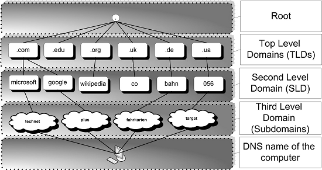
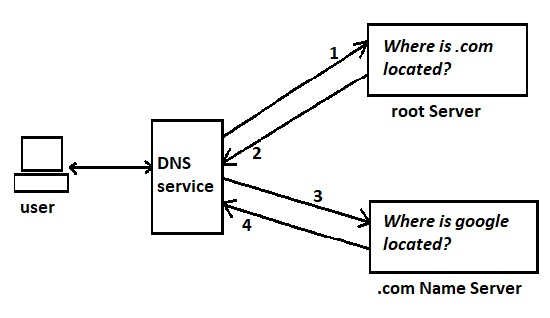
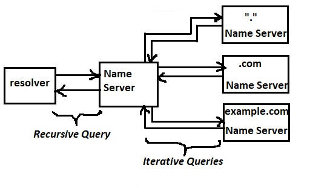
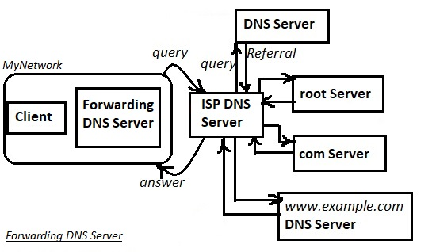
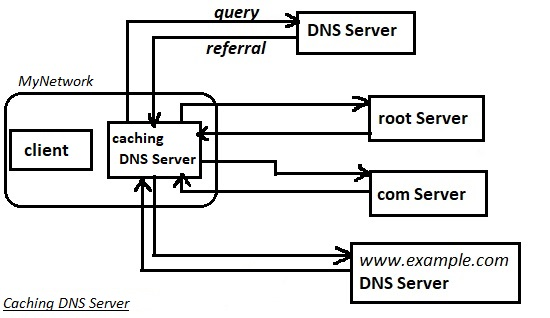
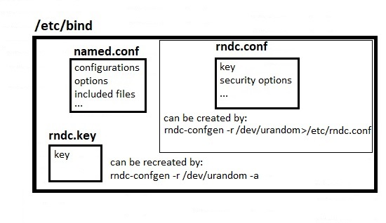
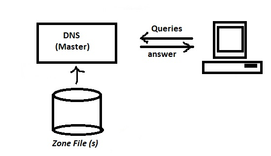
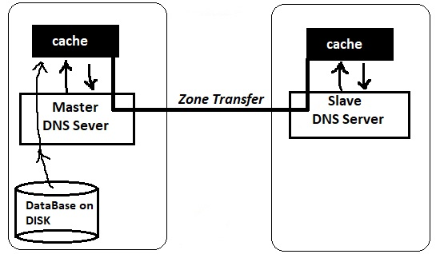
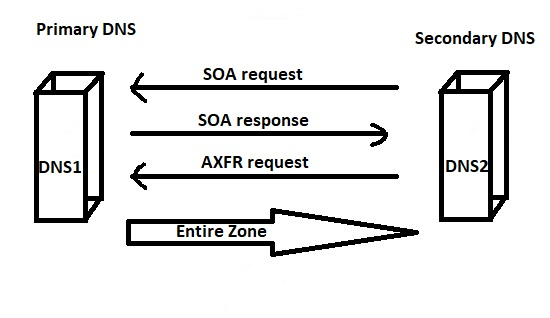

# 207.1. Basic DNS server configuration

## **207.1 Basic DNS server configuration**

**Weight:** 3

**Description:** Candidates should be able to configure BIND to function as a caching-only DNS server. This objective includes the ability to managing a running server and configuring logging.

**Key Knowledge Areas:**

* BIND 9.x configuration files, terms and utilities
* Defining the location of the BIND zone files in BIND configuration files
* Reloading modified configuration and zone files
* Awareness of dnsmasq, djbdns and PowerDNS as alternate name servers

**The following is a partial list of the used files, terms and utilities:**

* /etc/named.conf
* /var/named/
* /usr/sbin/rndc
* kill
* host
* dig

## Whats is DNS?

Thirty years ago, when we wanted to visit a website we had to know the IP address of that site. That’s because computers are and were only able to communicate using numbers. As we are human and we are not robots It is very hard to remember. We needed a way to translate computer-readable information into human-readable. First the idea of using host files seemed great but weren't useful as time passed and internet growth.

In the early 1980’s, Paul Mockapetris came up with a system that automatically mapped IP addresses to domain names. and the DNS was born. so The Domain Name System \( DNS\) converts human readable domain names \(like: www.google.com\) into Internet Protocol \(IP\) addresses \(like: 172.217.16.206\).DNS still serves as the backbone of the modern Internet, today.

## DNS Structure

The Domain Name System \(DNS\) is a hierarchical decentralized naming system for computers, services, or other resources connected to the Internet or a private network.



At the highest level "." is considered as root and at other lower levels there are Top Level Domains \(TLD\)s.

When a query is received by the name server, first it looks at its cache, if the answer is found then name server answers query from its cache.

if nothing is found in the cache, then it tries to mach smaller parts of query to return an answer to help client to send its query to another Name server.

## How does it work ?

When we type www.google.com the system will look for www.google.com. Whenever we type some domain name, there is a hidden " . "\(dot\) at the end of the www.google.com that say to search the root server of namespace.



Then our router will contact our default DNS Service for DNS resolution. The DNS service will contact DNS Root Servers and ask for the IP address of server containing .com records. This address is sent back to your DNS service. The DNS service again reaches the Name Server containing addresses of .com domains and asks it for the address of [http://google.com](http://google.com). Upon obtaining the IP address of the servers that host google.com, our DNS service will return the IP address to our computer which then fires up our browser to download the main webpage. Where root servers are defined?

```text
root@server1:/etc/bind# cat db.root 
;       This file holds the information on root name servers needed to
;       initialize cache of Internet domain name servers
;       (e.g. reference this file in the "cache  .  <file>"
;       configuration file of BIND domain name servers).
;
;       This file is made available by InterNIC 
;       under anonymous FTP as
;           file                /domain/named.cache
;           on server           FTP.INTERNIC.NET
;       -OR-                    RS.INTERNIC.NET
;
;       last update:    February 17, 2016
;       related version of root zone:   2016021701
;
; formerly NS.INTERNIC.NET
;
.                        3600000      NS    A.ROOT-SERVERS.NET.
A.ROOT-SERVERS.NET.      3600000      A     198.41.0.4
A.ROOT-SERVERS.NET.      3600000      AAAA  2001:503:ba3e::2:30
;
; FORMERLY NS1.ISI.EDU
;
.                        3600000      NS    B.ROOT-SERVERS.NET.
B.ROOT-SERVERS.NET.      3600000      A     192.228.79.201
B.ROOT-SERVERS.NET.      3600000      AAAA  2001:500:84::b
;
; FORMERLY C.PSI.NET
;
.                        3600000      NS    C.ROOT-SERVERS.NET.
C.ROOT-SERVERS.NET.      3600000      A     192.33.4.12
C.ROOT-SERVERS.NET.      3600000      AAAA  2001:500:2::c
;
; FORMERLY TERP.UMD.EDU
;
.                        3600000      NS    D.ROOT-SERVERS.NET.
D.ROOT-SERVERS.NET.      3600000      A     199.7.91.13
D.ROOT-SERVERS.NET.      3600000      AAAA  2001:500:2d::d
;
; FORMERLY NS.NASA.GOV
;
.                        3600000      NS    E.ROOT-SERVERS.NET.
E.ROOT-SERVERS.NET.      3600000      A     192.203.230.10
;
; FORMERLY NS.ISC.ORG
;
.                        3600000      NS    F.ROOT-SERVERS.NET.
F.ROOT-SERVERS.NET.      3600000      A     192.5.5.241
F.ROOT-SERVERS.NET.      3600000      AAAA  2001:500:2f::f
;
; FORMERLY NS.NIC.DDN.MIL
;
.                        3600000      NS    G.ROOT-SERVERS.NET.
G.ROOT-SERVERS.NET.      3600000      A     192.112.36.4
;
; FORMERLY AOS.ARL.ARMY.MIL
;
.                        3600000      NS    H.ROOT-SERVERS.NET.
H.ROOT-SERVERS.NET.      3600000      A     198.97.190.53
H.ROOT-SERVERS.NET.      3600000      AAAA  2001:500:1::53
;
; FORMERLY NIC.NORDU.NET
;
.                        3600000      NS    I.ROOT-SERVERS.NET.
I.ROOT-SERVERS.NET.      3600000      A     192.36.148.17
I.ROOT-SERVERS.NET.      3600000      AAAA  2001:7fe::53
;
; OPERATED BY VERISIGN, INC.
;
.                        3600000      NS    J.ROOT-SERVERS.NET.
J.ROOT-SERVERS.NET.      3600000      A     192.58.128.30
J.ROOT-SERVERS.NET.      3600000      AAAA  2001:503:c27::2:30
;
; OPERATED BY RIPE NCC
;
.                        3600000      NS    K.ROOT-SERVERS.NET.
K.ROOT-SERVERS.NET.      3600000      A     193.0.14.129
K.ROOT-SERVERS.NET.      3600000      AAAA  2001:7fd::1
;
; OPERATED BY ICANN
;
.                        3600000      NS    L.ROOT-SERVERS.NET.
L.ROOT-SERVERS.NET.      3600000      A     199.7.83.42
L.ROOT-SERVERS.NET.      3600000      AAAA  2001:500:3::42
;
; OPERATED BY WIDE
;
.                        3600000      NS    M.ROOT-SERVERS.NET.
M.ROOT-SERVERS.NET.      3600000      A     202.12.27.33
M.ROOT-SERVERS.NET.      3600000      AAAA  2001:dc3::35
```

DNS is consist of resource records which are stored in Zone files. lets talk about types of DNS Records.

## DNS Resource Records \(RRs\)

Resource Records define data types in the Domain Name System \(DNS\).Resource Records are stored in binary format internally for use by DNS software. But resource records are sent across a network in text format while they perform zone transfers. Some common ones are A record which contains the IP address of the domain, AAAA record which holds the IPv6 information, and MX record which has mail servers of a domain.

### DNS Resource Records Types

DNS servers might have different types of records, each type of records is used for a specific purpose , which can be queried by nslookup using --query=mx or --query=ns.

| DNS record type | Description |
| :--- | :--- |
| A/AAA | A Records are the most basic type of DNS record and are used to point a domain or subdomain to an IP address. A is an IPv4 adrress record and AAA is an IPv6 address record. |
| CNAME | Common Name record is used to point a domain or subdomain to another hostname |
| MX | the Mail Exchange \(MX\) record for mail delivery , required "priority" value as a part of their entry to indicate which mail sever should be used first |
| NS | The NS record specifies an authoritative name server for given host. |
| SRV | the Server Locator record to designate a host and port for certain services, such as LDAP, for a domain. |
| SOA | The  Start Of Authority record specifies core information about a DNS zone, including the primary name server, the email of the domain administrator, the domain serial number, and several timers relating to refreshing the zone |

Now that we have got familiar with Types of Records in DNS lets learn about one of DNS client tools :

## nslookup

name server lookup\(nslookup\) is a network administration command-line tool available for many computer operating systems for querying the Domain Name System \(DNS\) to obtain domain name or IP address mapping or for any other specific DNS record. to find out IP Address of a Domain:

```text
root@server1:~# nslookup google.com
Server:        192.168.10.2
Address:    192.168.10.2#53

Non-authoritative answer:
Name:    google.com
Address: 172.217.16.174
```

and to do reverse domain lookup:

```text
root@server1:~# nslookup 172.217.16.174
Server:        192.168.10.2
Address:    192.168.10.2#53

Non-authoritative answer:
174.16.217.172.in-addr.arpa    name = fra15s11-in-f14.1e100.net.
174.16.217.172.in-addr.arpa    name = fra15s11-in-f174.1e100.net.
174.16.217.172.in-addr.arpa    name = fra15s11-in-f14.1e100.net.
174.16.217.172.in-addr.arpa    name = fra15s11-in-f174.1e100.net.
```

to query for MX records to find out list of mail servers and their priority:

```text
root@server1:~# nslookup -query=mx google.com
Server:        192.168.10.2
Address:    192.168.10.2#53

Non-authoritative answer:
google.com    mail exchanger = 40 alt3.aspmx.l.google.com.
google.com    mail exchanger = 30 alt2.aspmx.l.google.com.
google.com    mail exchanger = 20 alt1.aspmx.l.google.com.
google.com    mail exchanger = 10 aspmx.l.google.com.
google.com    mail exchanger = 50 alt4.aspmx.l.google.com.

Authoritative answers can be found from:
```

also to To query SOA \(Start of Authority\) record:

```text
root@server1:~# nslookup -type=soa google.com
Server:        192.168.10.2
Address:    192.168.10.2#53

Non-authoritative answer:
google.com
    origin = ns1.google.com
    mail addr = dns-admin.google.com
    serial = 187115749
    refresh = 900
    retry = 900
    expire = 1800
    minimum = 60

Authoritative answers can be found from:
```

and to query for all types of DNS records of a domain:

```text
root@server1:~# nslookup -query=any google.com
Server:        192.168.10.2
Address:    192.168.10.2#53

Non-authoritative answer:
Name:    google.com
Address: 172.217.22.110
google.com    has AAAA address 2a00:1450:4001:81d::200e
google.com    rdata_257 = 0 issue "pki.goog"
google.com
    origin = ns1.google.com
    mail addr = dns-admin.google.com
    serial = 186975566
    refresh = 900
    retry = 900
    expire = 1800
    minimum = 60
google.com    text = "v=spf1 include:_spf.google.com ~all"
google.com    mail exchanger = 30 alt2.aspmx.l.google.com.
google.com    text = "docusign=05958488-4752-4ef2-95eb-aa7ba8a3bd0e"
google.com    nameserver = ns4.google.com.
google.com    nameserver = ns3.google.com.
google.com    mail exchanger = 40 alt3.aspmx.l.google.com.
google.com    nameserver = ns2.google.com.
google.com    mail exchanger = 50 alt4.aspmx.l.google.com.
google.com    mail exchanger = 10 aspmx.l.google.com.
google.com    mail exchanger = 20 alt1.aspmx.l.google.com.
google.com    nameserver = ns1.google.com.

Authoritative answers can be found from:
```

By default, nslookup will query the same DNS the system is configured to use for all network operations. We can specify a custom DNS to query:

```text
root@server1:~# nslookup google.com 8.8.4.4
Server:        8.8.4.4
Address:    8.8.4.4#53

Non-authoritative answer:
Name:    google.com
Address: 172.217.18.14
```

to enable debugging modem, which is very useful for troubleshooting:

```text
root@server1:~# nslookup -debug linux.com
Server:        192.168.10.2
Address:    192.168.10.2#53

------------
    QUESTIONS:
    linux.com, type = A, class = IN
    ANSWERS:
    ->  linux.com
    internet address = 151.101.193.5
    ttl = 5
    ->  linux.com
    internet address = 151.101.129.5
    ttl = 5
    ->  linux.com
    internet address = 151.101.65.5
    ttl = 5
    ->  linux.com
    internet address = 151.101.1.5
    ttl = 5
    AUTHORITY RECORDS:
    ADDITIONAL RECORDS:
------------
Non-authoritative answer:
Name:    linux.com
Address: 151.101.193.5
Name:    linux.com
Address: 151.101.129.5
Name:    linux.com
Address: 151.101.65.5
Name:    linux.com
Address: 151.101.1.5
```

By default, domain name servers accept queries on port 53. If this is configured differently on the server we are trying to query, we can specify another port number using the `-port= option` `nslookup -port=54 mycompanydns.com` .

it is good to know that nslookup command has an interactive mode also:

```text
root@server1:~# nslookup 
> yahoo.com
Server:        192.168.10.2
Address:    192.168.10.2#53

Non-authoritative answer:
Name:    yahoo.com
Address: 98.139.180.180
Name:    yahoo.com
Address: 98.138.252.38
Name:    yahoo.com
Address: 206.190.39.42
> server 8.8.4.4
Default server: 8.8.4.4
Address: 8.8.4.4#53
> linux.com
Server:        8.8.4.4
Address:    8.8.4.4#53

Non-authoritative answer:
Name:    linux.com
Address: 151.101.129.5
Name:    linux.com
Address: 151.101.193.5
Name:    linux.com
Address: 151.101.65.5
Name:    linux.com
Address: 151.101.1.5
> exit
```

use `-timeout=10` to Change timeout interval to wait for a reply `nslookup -timeout=10 google.com` .

How ever nslookup is somehow old and deprecated but it can be used to show ipv6 AAAA and PTR records too.nslookup is very useful and widely used by most of famous operation systems.

### Authoritative Answer vs Non-Authoritative Answer

You may also noticed the keyword “Authoritative Answer” and “Non-Authoritative Answer” in the above output.

Any answer that originates from the DNS Server which has the complete zone file information available for the domain is said to be authoritative answer.

In many cases, DNS servers will not have the complete zone file information available for a given domain. Instead, it maintains a cache file which has the results of all queries performed in the past for which it has gotten authoritative response. When a DNS query is given, it searches the cache file, and return the information available as “Non-Authoritative Answer”.

## host

host comman is another tool for performing DNS lookups. It is minimal and easy to use and like nslookup command, it can list and verify different types of DNS record like NS and MX records.

```text
root@server1:~# host google.com
google.com has address 172.217.16.206
google.com has IPv6 address 2a00:1450:4001:824::200e
google.com mail is handled by 40 alt3.aspmx.l.google.com.
google.com mail is handled by 10 aspmx.l.google.com.
google.com mail is handled by 30 alt2.aspmx.l.google.com.
google.com mail is handled by 50 alt4.aspmx.l.google.com.
google.com mail is handled by 20 alt1.aspmx.l.google.com.
```

some useful host commands are:

| host command | Description |
| :--- | :--- |
| host -t ns google.com | find domain name servers, it can be -t cname or  -t mx |
| host -C google.com | find domain SOA record |
| host google.com 8.8.4.4 | Query specific DNS |
| host -a google.com | All Information of Domain Records and Zones |
| host -4 google.com or host -6 google.com | Use Either IPv4 or IPv6 |
| host -T google.com | By default, host uses UDP.  -T option makes it use a TCP |
| host -w 10 google.com | Set Query Time Wait for Reply |
| host 172.217.16.174 | performs a reverse lookup on the IP address |

## dig

Dig stands for \(Domain Information Groper\) is a network administration command-line tool for querying DNS. It is useful for verifying and troubleshooting DNS problems and also to perform DNS lookups and displays the answers that are returned from the DNS, with no options dig find "A" record of a domain:

```text
root@server1:~# dig google.com

; <<>> DiG 9.10.3-P4-Ubuntu <<>> google.com
;; global options: +cmd
;; Got answer:
;; ->>HEADER<<- opcode: QUERY, status: NOERROR, id: 47904
;; flags: qr rd ra; QUERY: 1, ANSWER: 1, AUTHORITY: 0, ADDITIONAL: 1

;; OPT PSEUDOSECTION:
; EDNS: version: 0, flags:; MBZ: 0005 , udp: 512
;; QUESTION SECTION:
;google.com.            IN    A

;; ANSWER SECTION:
google.com.        5    IN    A    172.217.16.174

;; Query time: 1041 msec
;; SERVER: 192.168.10.2#53(192.168.10.2)
;; WHEN: Tue Feb 27 00:01:27 PST 2018
;; MSG SIZE  rcvd: 55
```

there are some stats about the query. We can turn off these stats using the `+nostats` option.

```text
root@server1:~# dig google.com +nostat

; <<>> DiG 9.10.3-P4-Ubuntu <<>> google.com +nostat
;; global options: +cmd
;; Got answer:
;; ->>HEADER<<- opcode: QUERY, status: NOERROR, id: 8713
;; flags: qr rd ra; QUERY: 1, ANSWER: 1, AUTHORITY: 0, ADDITIONAL: 1

;; OPT PSEUDOSECTION:
; EDNS: version: 0, flags:; MBZ: 0005 , udp: 512
;; QUESTION SECTION:
;google.com.            IN    A

;; ANSWER SECTION:
google.com.        5    IN    A    172.217.22.78
```

By default dig is quite verbose. One way to cut down the output is to use the `+short` option:

```text
root@server1:~# dig google.com +short
216.58.207.46
```

some other useful dig commands:

| dig command | Description |
| :--- | :--- |
| dig google.com MX | Querying MX record for a domain |
| dig google.com SOA | Querying SOA record for a domain |
| dig google.com TTL | Querying TTL Record for Domain |
| dig @8.8.8.8 google.com | Using another DNS server for querying |
| dig | Shows dig command version and root DNS servers |
| dig google.com +nocomments +noquestion +noauthority +noadditional +nostats | Querying only answer section |
| dig google.com ANY +noall +answer | Querying ALL DNS Records Types |

dig command has lots of options, and its hard to type options every time.We can store options like `+noall +answer`options permanently in`.digrc` file under user’s home directory. This way , whenever dig command execute it will show only answer section of dig output.

dig is part of the BIND domain name server software suite. dig command replaces older tool such as nslookup and the host.

## The Different DNS Servers

There are many different DNS servers which have been developed and they have some differences with each other from different aspects. Some of famous DNS servers are:

* bjdns , forked and now used as dbdns in debian
* powerdns
* dnsmasq
* BIND
* Microsoft DNS

Lets Compare them:

| feature\DNS | djbdns | powerdns | dnsmasq | BIND | Microsoft DNS |
| :--- | :--- | :--- | :--- | :--- | :--- |
| Authorative | Yes | Yes | Partial | Yes | Yes |
| Recursive | Yes | Yes | No | Yes | Yes |
| Slave Mode | Yes | Yes | No | Yes | Yes |
| Caching | Yes | Yes | Yes | Yes | Yes |
| DNS SEC | Partial | Yes | Yes | Yes | Yes |
| TSIG | No | Yes | No | Yes | Yes |
| IPv6 | Partial | Yes | Yes | Yes | Yes |
| Free-Software | Yes | Yes | Yes | Yes | No |
| Interface | CMD Line & Web | Web CMD Line | CMD Line | Web CMD Line | GUI CMD Line |
| Description | Tiny DNS | Modularity | small-simple-forwarder | Most popular | Easy to setup |

There is no need to memorize all features of DNS servers for LPIC exam, just get familiar with names. Also we will discuss about some of features that we have mentioned here in the next lessons. Here we use Berkeley Internet Name Domain \(BIND9\) for lpic2 exam.

## Different Types of DNS queries

As a client when we ask for the IP address of a web site we query a DNS Server, But thats is not all. As its impossible to store all domain names and records in the world in one DNS server, DNS servers asks each other for getting information, that make different types of DNS queries

There are two types of DNS queries :

* Recursive query
* Iterative quries
* Inverse queries



* Recursive name queries are generally made by a DNS client to a DNS server, or by a forwarder DNS server that is configured to pass unresolved name queries to another DNS server.
* An iterative name query is one in which a DNS client allows the DNS server to return the best answer it can give based on its cache or zone data\(Delegation\). If the queried DNS server does not have an exact match for the queried name, the best possible information it can return is a referral \(that is, a pointer to a DNS server authoritative for a lower level of the domain namespace\). The DNS client can then query the DNS server for which it obtained a referral. It continues this process until it locates a DNS server that is authoritative for the queried name, or until an error or time-out condition is met.
* Inverse/Reverse queries , usually we ask DNS server for the IP address\(es\) of a Domain Name, and DNS Server answer our query using A or AAA record if it has, but some times because of security issues or any other reason we know the IP address of a Host but we want to verify that, so we ask host name of an IP address that we have and DNS Server answers our Reverse Query using PTR record it has.

## DNS implementation types

* Forwarding Name Server
* Caching Name Server
* Master/Slave Name servers

## Forwarding DNS vs caching DNS



* Forwarding:  just passes the DNS query to another DNS server \( our ISP's\). Home routers use forwarding to pass DNS queries from our  network's clients to our ISP's DNS servers. For example, for foo.example.com, a forwarding DNS server would first check its cache \(did it already ask this question before\), and if the answer is not in its cache, it would ask its forwarder \(our ISP's DNS server\) for the answer, which would respond with either a cached response, or would perform recursion until it figured out the answer.



* Caching :  In this case our DNS server receiving the query and takes it upon itself to figure out the answer to that query by recursively querying authoritative DNS servers for that domain. For example, for foo.example.com, a recursor would first query the root servers for what DNS servers are responsible for the .com TLD, then it would ask those servers for example.com, then it would query the servers for example.com for foo.example.com, finally getting the answer to the original query.

## BIND Caching DNS Server

Now lets setup BIND DNS and configure it to work as Caching DNS\(Ubuntu 16.04\):

```text
root@server1:~# apt install bind9 bind9utils 
Reading package lists... Done
Building dependency tree       
Reading state information... Done
The following packages were automatically installed and are no longer required:
  linux-headers-4.13.0-31 linux-headers-4.13.0-31-generic
  linux-image-4.13.0-31-generic linux-image-extra-4.13.0-31-generic
Use 'apt autoremove' to remove them.
The following additional packages will be installed:
  libirs141
Suggested packages:
  bind9-doc
The following NEW packages will be installed:
  bind9 bind9utils libirs141
0 upgraded, 3 newly installed, 0 to remove and 169 not upgraded.
Need to get 591 kB of archives.
After this operation, 2,957 kB of additional disk space will be used.
Do you want to continue? [Y/n] y
Get:1 http://us.archive.ubuntu.com/ubuntu xenial-updates/main amd64 libirs141 amd64 1:9.10.3.dfsg.P4-8ubuntu1.10 [18.0 kB]
Get:2 http://us.archive.ubuntu.com/ubuntu xenial-updates/main amd64 bind9utils amd64 1:9.10.3.dfsg.P4-8ubuntu1.10 [201 kB]
Get:3 http://us.archive.ubuntu.com/ubuntu xenial-updates/main amd64 bind9 amd64 1:9.10.3.dfsg.P4-8ubuntu1.10 [372 kB]
Fetched 591 kB in 12s (48.4 kB/s)                                              
Preconfiguring packages ...
Selecting previously unselected package libirs141:amd64.
(Reading database ... 253579 files and directories currently installed.)
Preparing to unpack .../libirs141_1%3a9.10.3.dfsg.P4-8ubuntu1.10_amd64.deb ...
Unpacking libirs141:amd64 (1:9.10.3.dfsg.P4-8ubuntu1.10) ...
Selecting previously unselected package bind9utils.
Preparing to unpack .../bind9utils_1%3a9.10.3.dfsg.P4-8ubuntu1.10_amd64.deb ...
Unpacking bind9utils (1:9.10.3.dfsg.P4-8ubuntu1.10) ...
Selecting previously unselected package bind9.
Preparing to unpack .../bind9_1%3a9.10.3.dfsg.P4-8ubuntu1.10_amd64.deb ...
Unpacking bind9 (1:9.10.3.dfsg.P4-8ubuntu1.10) ...
Processing triggers for libc-bin (2.23-0ubuntu10) ...
Processing triggers for man-db (2.7.5-1) ...
Processing triggers for ufw (0.35-0ubuntu2) ...
Processing triggers for systemd (229-4ubuntu21.1) ...
Processing triggers for ureadahead (0.100.0-19) ...
Setting up libirs141:amd64 (1:9.10.3.dfsg.P4-8ubuntu1.10) ...
Setting up bind9utils (1:9.10.3.dfsg.P4-8ubuntu1.10) ...
Setting up bind9 (1:9.10.3.dfsg.P4-8ubuntu1.10) ...
Adding group `bind' (GID 129) ...
Done.
Adding system user `bind' (UID 123) ...
Adding new user `bind' (UID 123) with group `bind' ...
Not creating home directory `/var/cache/bind'.
wrote key file "/etc/bind/rndc.key"
#
Processing triggers for libc-bin (2.23-0ubuntu10) ...
Processing triggers for systemd (229-4ubuntu21.1) ...
Processing triggers for ureadahead (0.100.0-19) ...
Processing triggers for ufw (0.35-0ubuntu2) ...
```

Okey it creates files which it needs:

```text
root@server1:~# cd /etc/bind
root@server1:/etc/bind# ls
bind.keys  db.empty    named.conf.default-zones  zones.rfc1918
db.0       db.local    named.conf.local
db.127     db.root     named.conf.options
db.255     named.conf  rndc.key
```

## /etc/named.conf

named.conf \(or name daemon configuration file\) is main BIND DNS server configuration file.Based on our linux distribution BIND configuration file\(s\) might look a little bit different. in cent OS there is a one big named.conf \(CentOS7.1\):

```text
[root@server1 etc]# cat named.conf 
//
// named.conf
//
// Provided by Red Hat bind package to configure the ISC BIND named(8) DNS
// server as a caching only nameserver (as a localhost DNS resolver only).
//
// See /usr/share/doc/bind*/sample/ for example named configuration files.
//

options {
    listen-on port 53 { 127.0.0.1; };
    listen-on-v6 port 53 { ::1; };
    directory     "/var/named";
    dump-file     "/var/named/data/cache_dump.db";
        statistics-file "/var/named/data/named_stats.txt";
        memstatistics-file "/var/named/data/named_mem_stats.txt";
    allow-query     { localhost; };
    recursion yes;

    dnssec-enable yes;
    dnssec-validation yes;

    /* Path to ISC DLV key */
    bindkeys-file "/etc/named.iscdlv.key";

    managed-keys-directory "/var/named/dynamic";
};

logging {
        channel default_debug {
                file "data/named.run";
                severity dynamic;
        };
};

zone "." IN {
    type hint;
    file "named.ca";
};

include "/etc/named.rfc1912.zones";
include "/etc/named.root.key";
```

in ubuntu bind configuration files are separated \(Ubuntu 16.04\):

```text
root@server1:/etc/bind# ls -l
total 68
-rw-r--r-- 1 root root 3954 Jan 16 05:50 bind.keys
-rw-r--r-- 1 root root  237 Jan 16 05:50 db.0
-rw-r--r-- 1 root root  271 Jan 16 05:50 db.127
-rw-r--r-- 1 root root  237 Jan 16 05:50 db.255
-rw-r--r-- 1 root root  353 Jan 16 05:50 db.empty
-rw-r--r-- 1 root root  270 Jan 16 05:50 db.local
-rw-r--r-- 1 root root 3171 Jan 16 05:50 db.root
-rw-r--r-- 1 root bind  501 Apr  9 03:36 named.conf
-rw-r--r-- 1 root bind  490 Jan 16 05:50 named.conf.default-zones
-rw-r--r-- 1 root bind  455 Mar 18 05:01 named.conf.local
-rw-r--r-- 1 root bind  890 Mar  5 22:20 named.conf.options
-rw-r--r-- 1 root bind   76 Mar 12 05:13 named.conf.tsig
-rw-r----- 1 bind bind   77 Mar  5 22:20 rndc.key
-rw-r--r-- 1 root root 1317 Jan 16 05:50 zones.rfc1918
```

as we use ubuntu for demonstration in this lesson Lets take a look at inside:

```text
root@server1:/etc/bind# cat named.conf
// This is the primary configuration file for the BIND DNS server named.
//
// Please read /usr/share/doc/bind9/README.Debian.gz for information on the 
// structure of BIND configuration files in Debian, *BEFORE* you customize 
// this configuration file.
//
// If you are just adding zones, please do that in /etc/bind/named.conf.local

include "/etc/bind/named.conf.options";
include "/etc/bind/named.conf.local";
include "/etc/bind/named.conf.default-zones";
```

named.conf wrap up all the configuration files which BIND daemon need. It is kind of pointer which include required configuration files. For now there is nothing to change in named.conf , lets get into `named.conf.options` :

```text
options {
    directory "/var/cache/bind";

    // If there is a firewall between you and nameservers you want
    // to talk to, you may need to fix the firewall to allow multiple
    // ports to talk.  See http://www.kb.cert.org/vuls/id/800113

    // If your ISP provided one or more IP addresses for stable 
    // nameservers, you probably want to use them as forwarders.  
    // Uncomment the following block, and insert the addresses replacing 
    // the all-0's placeholder.

    // forwarders {
    //     0.0.0.0;
    // };

    //========================================================================
    // If BIND logs error messages about the root key being expired,
    // you will need to update your keys.  See https://www.isc.org/bind-keys
    //========================================================================
    dnssec-validation auto;

    auth-nxdomain no;    # conform to RFC1035
    listen-on-v6 { any; };
};
```

in`named.conf.options` as its obvious, most of BIND options are defined. For example if we wanted to make it forwarder, just uncomment forwarders section, but to make our BIND Caching DNS Server add

`recursion yes;` at the end this file. And then we need to restart bind service in order to our changes take effect:

```text
root@server1:/etc/bind# systemctl restart bind9.service
root@server1:/etc/bind# systemctl status bind9.service
● bind9.service - BIND Domain Name Server
   Loaded: loaded (/lib/systemd/system/bind9.service; enabled; vendor preset: en
  Drop-In: /run/systemd/generator/bind9.service.d
           └─50-insserv.conf-$named.conf
   Active: active (running) since Wed 2018-02-28 00:13:52 PST; 11s ago
     Docs: man:named(8)
 Main PID: 84563 (named)
   CGroup: /system.slice/bind9.service
           └─84563 /usr/sbin/named -f -u bind

Feb 28 00:13:52 server1 named[84563]: all zones loaded
Feb 28 00:13:52 server1 named[84563]: running
Feb 28 00:13:52 server1 named[84563]: network unreachable resolving './DNSKEY/IN
Feb 28 00:13:52 server1 named[84563]: network unreachable resolving './NS/IN': 2
Feb 28 00:13:52 server1 named[84563]: network unreachable resolving 'G.ROOT-SERV
Feb 28 00:13:52 server1 named[84563]: network unreachable resolving 'E.ROOT-SERV
Feb 28 00:13:52 server1 named[84563]: network unreachable resolving 'G.ROOT-SERV
Feb 28 00:13:52 server1 named[84563]: network unreachable resolving 'E.ROOT-SERV
Feb 28 00:13:52 server1 named[84563]: network unreachable resolving './DNSKEY/IN
Feb 28 00:13:52 server1 named[84563]: network unreachable resolving './NS/IN': 2
lines 1-20/20 (END)
```

darradaaa thats all, setting up BIND DNS server as a caching only server is finished.and check if its working:

```text
root@server1:/etc/bind# dig @localhost google.com

; <<>> DiG 9.10.3-P4-Ubuntu <<>> @localhost google.com
; (1 server found)
;; global options: +cmd
;; Got answer:
;; ->>HEADER<<- opcode: QUERY, status: NOERROR, id: 8395
;; flags: qr rd ra; QUERY: 1, ANSWER: 1, AUTHORITY: 4, ADDITIONAL: 9

;; OPT PSEUDOSECTION:
; EDNS: version: 0, flags:; udp: 4096
;; QUESTION SECTION:
;google.com.            IN    A

;; ANSWER SECTION:
google.com.        300    IN    A    216.58.207.78

;; AUTHORITY SECTION:
google.com.        172797    IN    NS    ns4.google.com.
google.com.        172797    IN    NS    ns2.google.com.
google.com.        172797    IN    NS    ns3.google.com.
google.com.        172797    IN    NS    ns1.google.com.

;; ADDITIONAL SECTION:
ns1.google.com.        172797    IN    A    216.239.32.10
ns1.google.com.        172797    IN    AAAA    2001:4860:4802:32::a
ns2.google.com.        172797    IN    A    216.239.34.10
ns2.google.com.        172797    IN    AAAA    2001:4860:4802:34::a
ns3.google.com.        172797    IN    A    216.239.36.10
ns3.google.com.        172797    IN    AAAA    2001:4860:4802:36::a
ns4.google.com.        172797    IN    A    216.239.38.10
ns4.google.com.        172797    IN    AAAA    2001:4860:4802:38::a

;; Query time: 1176 msec
;; SERVER: 127.0.0.1#53(127.0.0.1)
;; WHEN: Wed Feb 28 00:17:14 PST 2018
;; MSG SIZE  rcvd: 303
```

Good job, its working but does it do caching? Lets query again to see the time:

```text
root@server1:/etc/bind# dig @localhost google.com

; <<>> DiG 9.10.3-P4-Ubuntu <<>> @localhost google.com
; (1 server found)
;; global options: +cmd
;; Got answer:
;; ->>HEADER<<- opcode: QUERY, status: NOERROR, id: 21081
;; flags: qr rd ra; QUERY: 1, ANSWER: 1, AUTHORITY: 4, ADDITIONAL: 9

;; OPT PSEUDOSECTION:
; EDNS: version: 0, flags:; udp: 4096
;; QUESTION SECTION:
;google.com.            IN    A

;; ANSWER SECTION:
google.com.        177    IN    A    216.58.207.78

;; AUTHORITY SECTION:
google.com.        172674    IN    NS    ns4.google.com.
google.com.        172674    IN    NS    ns2.google.com.
google.com.        172674    IN    NS    ns3.google.com.
google.com.        172674    IN    NS    ns1.google.com.

;; ADDITIONAL SECTION:
ns1.google.com.        172674    IN    A    216.239.32.10
ns1.google.com.        172674    IN    AAAA    2001:4860:4802:32::a
ns2.google.com.        172674    IN    A    216.239.34.10
ns2.google.com.        172674    IN    AAAA    2001:4860:4802:34::a
ns3.google.com.        172674    IN    A    216.239.36.10
ns3.google.com.        172674    IN    AAAA    2001:4860:4802:36::a
ns4.google.com.        172674    IN    A    216.239.38.10
ns4.google.com.        172674    IN    AAAA    2001:4860:4802:38::a

;; Query time: 0 msec
;; SERVER: 127.0.0.1#53(127.0.0.1)
;; WHEN: Wed Feb 28 00:19:17 PST 2018
;; MSG SIZE  rcvd: 303
```

Yes, because query time is 0 msec :\) . 177 and 172674 are TTL numbers and show how much our data would be valid in our cache and when it expires and then our DNS server has to require for the domain:

```text
root@server1:/etc/bind# dig @localhost google.com

; <<>> DiG 9.10.3-P4-Ubuntu <<>> @localhost google.com
; (1 server found)
;; global options: +cmd
;; Got answer:
;; ->>HEADER<<- opcode: QUERY, status: NOERROR, id: 37436
;; flags: qr rd ra; QUERY: 1, ANSWER: 1, AUTHORITY: 4, ADDITIONAL: 9

;; OPT PSEUDOSECTION:
; EDNS: version: 0, flags:; udp: 4096
;; QUESTION SECTION:
;google.com.            IN    A

;; ANSWER SECTION:
google.com.        300    IN    A    216.58.207.78

;; AUTHORITY SECTION:
google.com.        172204    IN    NS    ns3.google.com.
google.com.        172204    IN    NS    ns2.google.com.
google.com.        172204    IN    NS    ns4.google.com.
google.com.        172204    IN    NS    ns1.google.com.

;; ADDITIONAL SECTION:
ns1.google.com.        172204    IN    A    216.239.32.10
ns1.google.com.        172204    IN    AAAA    2001:4860:4802:32::a
ns2.google.com.        172204    IN    A    216.239.34.10
ns2.google.com.        172204    IN    AAAA    2001:4860:4802:34::a
ns3.google.com.        172204    IN    A    216.239.36.10
ns3.google.com.        172204    IN    AAAA    2001:4860:4802:36::a
ns4.google.com.        172204    IN    A    216.239.38.10
ns4.google.com.        172204    IN    AAAA    2001:4860:4802:38::a

;; Query time: 327 msec
;; SERVER: 127.0.0.1#53(127.0.0.1)
;; WHEN: Wed Feb 28 00:27:07 PST 2018
;; MSG SIZE  rcvd: 303
```

as we saw, making recursion enabled in our DNS Server is very easy but do not forget security issues. Enabling recursion and make our DNS server publicly available make a target from us for different kind of attacks. So we use ACLs and other configurations to limit acceptable queries.

## BIND Forwarder DNS Server

To make our Bind DNS Server a forwarder just edit forwarder section like this:

```text
options {
    directory "/var/cache/bind";

    // If there is a firewall between you and nameservers you want
    // to talk to, you may need to fix the firewall to allow multiple
    // ports to talk.  See http://www.kb.cert.org/vuls/id/800113

    // If your ISP provided one or more IP addresses for stable 
    // nameservers, you probably want to use them as forwarders.  
    // Uncomment the following block, and insert the addresses replacing 
    // the all-0's placeholder.

     forwarders {
         8.8.8.8;
     };
     forward only;

    //========================================================================
    // If BIND logs error messages about the root key being expired,
    // you will need to update your keys.  See https://www.isc.org/bind-keys
    //========================================================================
    dnssec-validation auto;

    auth-nxdomain no;    # conform to RFC1035
    listen-on-v6 { any; };
};
```

## /usr/sbin/rndc

BIND includes a utility called rndc \(Remote Name Daemon Control\) which allows command line administration of the named daemon from the localhost or a remote host.

In order to prevent unauthorized access to the named daemon, BIND uses a shared secret key authentication method to grant privileges to hosts. This means an identical key must be present in both /etc/named.conf and the rndc configuration file, /etc/rndc.conf.

The name server control utility, rndc, sends named digitally signed commands over a TCP connection. The configuration file for rndc is ‘/etc/rndc.conf’. This configuration file stores configuration information such as the name server to connect to and which key to use for the digital signature. The rndc utility is started when named is started using the initialization script. An rndc.conf file can be generated with a random key with the rndc-confgen commandline utility. rndc related files are like this:



lets takea look at rndc.key file:

```text
root@server1:/etc/bind# ls -al rndc*
-rw-r----- 1 bind bind 77 Mar  5 22:20 rndc.key
root@server1:/etc/bind# cat rndc.key 
key "rndc-key" {
    algorithm hmac-md5;
    secret "JFLwN7Sd/sGbIdan+y/XtQ==";
};
root@server1:/etc/bind# rndc reload
server reload successful
```

for demonstration lets remove and recreate rndc.key :

```text
root@server1:/etc/bind# rm rndc.key 
root@server1:/etc/bind# ls -al rndc*
ls: cannot access 'rndc*': No such file or directory
root@server1:/etc/bind# rndc reload
rndc: neither /etc/bind/rndc.conf nor /etc/bind/rndc.key was found

root@server1:/etc/bind# rndc-confgen -r /dev/urandom -a
wrote key file "/etc/bind/rndc.key"
root@server1:/etc/bind# ls -al rndc*
-rw------- 1 root bind 77 Apr 17 23:48 rndc.key
root@server1:/etc/bind# cat rndc.key 
key "rndc-key" {
    algorithm hmac-md5;
    secret "sIfJgn3msN0RnyzNz6mixQ==";
};
```

We have removed and recreate a rndc.key lets set rights:

```text
root@server1:/etc/bind# chown bind.bind rndc.key 
root@server1:/etc/bind# chmod 640 rndc.key
```

and check it:

```text
root@server1:/etc/bind# systemctl start bind9.service 
root@server1:/etc/bind# systemctl status bind9.service 
● bind9.service - BIND Domain Name Server
   Loaded: loaded (/lib/systemd/system/bind9.service; enabled; vendor preset: en
  Drop-In: /run/systemd/generator/bind9.service.d
           └─50-insserv.conf-$named.conf
   Active: active (running) since Wed 2018-04-18 00:10:51 PDT; 27min ago
     Docs: man:named(8)

root@server1:/etc/bind# rndc reload
server reload successful
```

for generating rndc.cong and requred key use `rndc-confgen -r /dev/urandom>/etc/bind/rndc.conf` command, after creating that we have to include the file , and use it but that is not our topic for now.

Except rndc remote features of rndc we can use it locally. Like most of Services in Linux world, when we change a configuration file in BIND or change zones\(as we see in next lessons\) we need to restart bind service, but there a problem! By restarting bind service all caches would be cleared and that it not acceptable, so instead of that, we use rndc tool. rndc read configuration files and reflect zone changes but does not clear cahce.

```text
root@server1:/etc/bind# rndc reload
server reload successful
```

also it is possible to clear specific domain name from cache results with `rndc flushname google.com` . to flush every thing in the system `rndc flush` and many other features, but that is enough for now!

## Master/ Slave DNS



In Small environments having just one DNS server as a Master is enough but in Large environments we should find a way to provide availability. Having a second DNS Server as a Slave DNS Server is a solution.



Master DNS server \(Primary Server\) is the original zone data handler and Slave DNS server \(Secondary Server\) is just a backup server which is used to copy the same zone information’s from the master servers. Master Server will resolve the names for every hosts which we defined in the zone database . But the Slave server transfer Zone Data after a while from Master Server. When master Server become unavailable Slave Server answer queries. Do not forget that it is impossible to modify or change zone data in Slave Server.

## Zone transfers - AXFR and IXFR

When a master nameserver is updated , the working contents of the zone held in memory that have changed need to be transferred to the other servers that are authoritative for that zone \(the slave servers\). This process is called 'zone transfer'.



There are two types of zone transfer - full \(AXFR\) and incremental \(IXFR\). A full zone transfer is of the entire zones. An Incremental zone transfer is a list of changes that, when applied, bring the slave zone up to date. The use of incremental zone transfers requires that both the provider and the recipient are maintaining a separate journal file of changes for each zone. The default is that slaves will request IXFR \(unless otherwise configured\) but they will always handle being given an AXFR instead, if no IXFR is available.

The critical component that controls the decision on whether or not the zone has changed is the serial number that is maintained in the zone's SOA record. BIND assumes that if the serial number remains the same, then the zone is unchanged.

Zone transfers are always initiated by the slave server \(they are 'requested' or 'pulled'\). Although there are mechanisms in place to alert slaves that they should check to see if a zone transfer is needed, the transfer itself is always started by the slave.

to check AXFR transfer we can use `dig AXFR example.com @10.10.0.4` .

