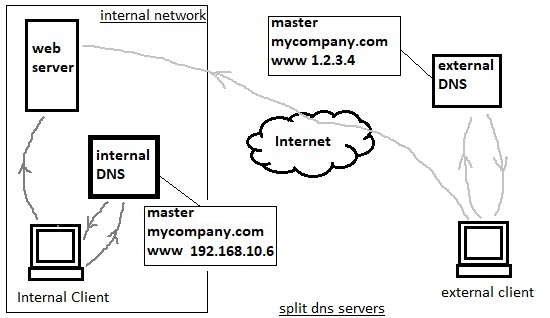

# 207.3. Securing a DNS server

### **207.3 Securing a DNS server**

**Weight:** 2

**Description:** Candidates should be able to configure a DNS server to run as a non-root user and run in a chroot jail. This objective includes secure exchange of data between DNS servers.

**Key Knowledge Areas:**

* BIND 9 configuration files
* Configuring BIND to run in a chroot jail
* Split configuration of BIND using the forwarders statement
* Configuring and using transaction signatures \(TSIG\)
* Awareness of DNSSEC and basic tools
* Awareness of DANE and related records

**Terms and Utilities:**

* /etc/named.conf
* /etc/passwd
* DNSSEC
* dnssec-keygen
* dnssec-signzone

When DNS was first implemented, it did not include any security, and soon after being put into use, several vulnerabilities were discovered. As a result, some security solutions was developed in the form of extensions that could be added to existing DNS protocols. This solutions were later tested, modified and approved as a standard by the Internet Engineering Task Force \(IETF\).

### Domain Name Security Extentions \(DNSSEC\)

The original purpose of DNSSEC was to protect Internet clients from fake DNS data by verifying digital signatures embedded in the data. If the digital signatures in the data match those that are stored in the master DNS servers, then the data is allowed to continue to the client computer making the request.


DNSSEC uses a system of public keys and digital signatures to verify data. These public keys can also be used by security systems that encrypt data as it is sent through the Internet and then decrypt it when it is received by the intended recipient. However, DNSSEC cannot protect the privacy or confidentiality of data because it does not include encryption algorithms. It only carries the keys required to authenticate DNS data as genuine or genuinely not available.

## How DNSSEC works?

For explaining how DNSSEC works first we should know about some items. what are RRsets ? ZSK ? RRSIG ? DSKEY?KSK ?

### Resource Records sets \(RRsets\)

The first step towards securing a zone with DNSSEC is to group all the records with the same type into a resource record set \(RRset\). For example, if you have three AAAA records in your zone on the same label \(i.e. label.example.com\), they would all be bundled into a single AAAA RRset. Here we omit that as we don't ahve lots of records.


DNSSEC uses two pairs of keys ZSK and KSK.

### Zone Signing Keys

Each zone in DNSSEC has a zone-signing key pair \(ZSK\). the private portion of the key digitally signs each RRset in the zone, while the public portion verifies the signature.


### RRSIG

To enable DNSSEC, a zone operator creates digital signatures for each RRset using the private ZSK and stores them in their name server as RRSIG records. This is like saying, “These are my DNS records, they come from my server, and they should look like this.”

When a DNSSEC resolver requests a particular record type \(e.g., AAAA\), the name server also returns the corresponding RRSIG. The resolver can then pull the DNSKEY record containing the public ZSK from the name server. Together, the RRset, RRSIG, and public ZSK can validate the response.


If we trust the zone-signing key in the DNSKEY record, we can trust all the records in the zone. But, what if the the zone-signing key was compromised? HA HA HA, We need a way to validate the public ZSK. The solution is finding a way to verify the Public ZSK . Lets use KSK!

### Key Signing Keys

In addition to a zone-signing key, DNSSEC name servers also have a key-signing key \(KSK\). The KSK validates the DNSKEY record in exactly the same way as our ZSK secured the rest of our RRsets in the previous section: It signs the public ZSK \(which is stored in a DNSKEY record\), creating an RRSIG for the DNSKEY.


Just like the public ZSK, the name server publishes the public KSK in another DNSKEY record, which gives us the DNSKEY RRset shown above. Both the public KSK and public ZSK are signed by the private KSK. Resolvers can then use the public KSK to validate the public ZSK.

#### Validation

Validation for resolvers now looks like this:

* Request the desired RRset, which also returns the corresponding RRSIG record.
* Request the DNSKEY records containing the public ZSK and public KSK, which also returns the RRSIG for the DNSKEY RRset.
* Verify the RRSIG of the requested RRset with the public ZSK.
* Verify the RRSIG of the DNSKEY RRset with the public KSK.


### Implementing DNSSEC

For now we partially demonstrate DNSSEC.To start we need two pairs of keys , first KSK \(Key Signing Key \) for DNSKEY record it self and another a of ZSK \(Zone Signing Key\) to sign the zone and zone validation.

### dnssec-keygen

dnssec-keygen generates keys for DNSSEC \(Secure DNS\), first lets generate KSK keys, that is easy:

```text
root@server1:/etc/bind# mkdir dnsseckeys
root@server1:/etc/bind# cd dnsseckeys/
root@server1:/etc/bind/dnsseckeys# dnssec-keygen -a RSASHA256 -b 512 -n ZONE -f KSK myzone.
Generating key pair..++++++++++++ .....++++++++++++ 
Kmyzone.+008+44989
root@server1:/etc/bind/dnsseckeys# ls -l
total 8
-rw-r--r-- 1 root bind 334 Apr  9 00:30 Kmyzone.+008+44989.key
-rw------- 1 root bind 624 Apr  9 00:30 Kmyzone.+008+44989.private

root@server1:/etc/bind/dnsseckeys# cat Kmyzone.+008+44989.key 
; This is a key-signing key, keyid 44989, for myzone.
; Created: 20180409072341 (Mon Apr  9 00:23:41 2018)
; Publish: 20180409072341 (Mon Apr  9 00:23:41 2018)
; Activate: 20180409072341 (Mon Apr  9 00:23:41 2018)
myzone. IN DNSKEY 257 3 8 AwEAAZkoKDolZNo2nlCxcRYncVQ+U1eg6f+0pAKA9W1GThUWYrnbm/T2 tcOKptbVf3Ly406hiPdSqVx/yhFYfPq2J6M=

root@server1:/etc/bind/dnsseckeys# cat Kmyzone.+008+44989.private 
Private-key-format: v1.3
Algorithm: 8 (RSASHA256)
Modulus: mSgoOiVk2jaeULFxFidxVD5TV6Dp/7SkAoD1bUZOFRZiudub9Pa1w4qm1tV/cvLjTqGI91KpXH/KEVh8+rYnow==
PublicExponent: AQAB
PrivateExponent: XbbRroqVBGTpSEza+ohV8wtT6cmfhQReWt3Xzu529rVSg9EyNjDc8qRgCiow5Phf3O4iZwHpZPrJ/ViztqKz+Q==
Prime1: ydBI9XugtVxwcPXa+N7jRtE2vuLvyxmLM+g+i4kAycc=
Prime2: wkdv2F4vUHqaY1dkSX1vToWJlufRfe3yTSQPXv1KE0U=
Exponent1: PbkiV1I0WMOo8COBkVQ6FtKt97vYszlgxcNmPa7tOsk=
Exponent2: EKLlZPXLv2yAQ/l70P84xNSSj6WSPuJdWVW5Kz0tVrE=
Coefficient: H/1FEkLLkgaxuXntlJ3illIhWvu9u1pD9DW7Qvab7A8=
Created: 20180409072341
Publish: 20180409072341
Activate: 20180409072341
```

Whereas

| dnssec-keygen switches |  |
| :--- | :--- |
| -a | Defines algorithm |
| -b | keysize |
| -n | nametype,can be weather ZONE for DNSSEC or HOST for TSIG |
| -f | Set the specified flag in the flag field of the KEY/DNSKEY record.The only recognized flags are KSK \(Key Signing Key\) and REVOKE. |

dnssec also need a pair of ZSK keys to sign the zone with them:

```text
root@server1:/etc/bind/dnsseckeys# dnssec-keygen -a RSASHA256 -b 512 -n ZONE myzone.
Generating key pair....++++++++++++ ..............++++++++++++ 
Kmyzone.+008+63075
root@server1:/etc/bind/dnsseckeys# ls -l
total 20
-rw-r--r-- 1 root bind 368 Apr  9 00:53 db.myzone
-rw-r--r-- 1 root bind 334 Apr  9 00:30 Kmyzone.+008+44989.key
-rw------- 1 root bind 624 Apr  9 00:30 Kmyzone.+008+44989.private
-rw-r--r-- 1 root bind 335 Apr  9 01:33 Kmyzone.+008+63075.key
-rw------- 1 root bind 624 Apr  9 01:33 Kmyzone.+008+63075.private
```

### dnssec-signzone

Obviously dnssec-signzone signs a zone and produces a signed version of the zone.

```text
root@server1:/etc/bind/dnsseckeys# cp ../zonedbfiles/db.myzone .

root@server1:/etc/bind/dnsseckeys# dnssec-signzone -o myzone. -S db.myzoneFetching ZSK 63075/RSASHA256 from key repository.
Fetching KSK 44989/RSASHA256 from key repository.
Verifying the zone using the following algorithms: RSASHA256.
Zone fully signed:
Algorithm: RSASHA256: KSKs: 1 active, 0 stand-by, 0 revoked
                      ZSKs: 1 active, 0 stand-by, 0 revoked
db.myzone.signed
```

Lets take a look at inside:

```text
root@server1:/etc/bind/dnsseckeys# cat db.myzone.signed 
; File written on Mon Apr  9 01:45:42 2018
; dnssec_signzone version 9.10.3-P4-Ubuntu
myzone.            604800    IN SOA    myzone. root.myzone. (
                    51         ; serial
                    604800     ; refresh (1 week)
                    86400      ; retry (1 day)
                    2419200    ; expire (4 weeks)
                    604800     ; minimum (1 week)
                    )
            604800    RRSIG    SOA 8 1 604800 (
                    20180509074542 20180409074542 63075 myzone.
                    eHu3B0s9AcclEMfkaXK+zUcqnhYTRXO2BBoR
                    s4z9DGxbwcTXoy8MbIACkuVOhkM6+tQ8r7pr
                    clIKoUALm4I4mQ== )
            604800    NS    ns1.myzone.
            604800    NS    ns2.myzone.
            604800    RRSIG    NS 8 1 604800 (
                    20180509074542 20180409074542 63075 myzone.
                    f6jD5tilUCY71BOMAWWbsfDQr2CFKOE6NRPs
                    LcQ4blDvxOjwpAXNk0w9b3eInZJESuKBOERB
                    jlPB3FEarNzZdA== )
            604800    A    192.168.10.129
            604800    RRSIG    A 8 1 604800 (
                    20180509074542 20180409074542 63075 myzone.
                    QyHHXI2o/akKQsm1tSmKkomlnfo0ASTC4Pj5
                    uV1gFMj4Pb9sPGhq6ommZ6xtMOoezJ2sKyql
                    6RvPZeTyxPJHsQ== )
            604800    NSEC    host3.myzone. A NS SOA RRSIG NSEC DNSKEY
            604800    RRSIG    NSEC 8 1 604800 (
                    20180509074542 20180409074542 63075 myzone.
                    ZMUmj8nPWCPRUICoWcS72BmeGOv/mHn9ofIs
                    fFuX8WxDnmIVhGA5sUcz6cmUV9BebqwOGXdw
                    f5U1+5gqyLvydg== )
            604800    DNSKEY    256 3 8 (
                    AwEAAaSTszWl/atXNh8wJrYaEKAQdJ4b7yyZ
                    aue+io6wOnVIivFgOmMXshGVPHF5CCbomw7L
                    2qzSv4f/vaxmvVStlSc=
                    ) ; ZSK; alg = RSASHA256; key id = 63075
            604800    DNSKEY    257 3 8 (
                    AwEAAZkoKDolZNo2nlCxcRYncVQ+U1eg6f+0
                    pAKA9W1GThUWYrnbm/T2tcOKptbVf3Ly406h
                    iPdSqVx/yhFYfPq2J6M=
                    ) ; KSK; alg = RSASHA256; key id = 44989
            604800    RRSIG    DNSKEY 8 1 604800 (
                    20180509074542 20180409074542 44989 myzone.
                    GJ2phK3TxoSGoAYaA9T6Af9mZH4hj/G6rBXk
                    N1x/wmiHiQ2n2vpzUkwb3VJzCWXmYR/TSukw
                    RuNJlcKoPs3g7Q== )
            604800    RRSIG    DNSKEY 8 1 604800 (
                    20180509074542 20180409074542 63075 myzone.
                    G52jVRTYWp/rJME8j/pz/Aw/MKO8nUlDZAla
                    mls2Dniq3z5ySB1dXxQmHVTzwnnvu5BLNlad
                    ok/EzwXqB882Gw== )
host3.myzone.        604800    IN A    192.168.10.153
            604800    RRSIG    A 8 2 604800 (
                    20180509074542 20180409074542 63075 myzone.
                    aMgusMuRQORqwrRHPgCW3RROohncCFl7ONQY
                    jqlgDcB1Wyxu59ITLKSv9We6RhTu8PVcj/Si
                    0zBNdTnzlJ6Eyg== )
            604800    NSEC    ns1.myzone. A RRSIG NSEC
            604800    RRSIG    NSEC 8 2 604800 (
                    20180509074542 20180409074542 63075 myzone.
                    LQ/LlsulT95cOl6RGZSoUWzyBJ48EeLisSNQ
                    4lAAQr7pSAOZAawqznFGI4JPGeJvi+RH4L6l
                    ZDRlpyOX78QCtw== )
ns1.myzone.        604800    IN A    192.168.10.129
            604800    RRSIG    A 8 2 604800 (
                    20180509074542 20180409074542 63075 myzone.
                    J0w5HnJzXoJvG1tjmbNXkIlOle/9KWgZgCMH
                    Ndm0IPnV25VHsvUtI7PZ5u3uLztoZ6UC5eVW
                    gDyYmJAC9nI8wg== )
            604800    NSEC    ns2.myzone. A RRSIG NSEC
            604800    RRSIG    NSEC 8 2 604800 (
                    20180509074542 20180409074542 63075 myzone.
                    ibN/9JFAAo7fCM8tbkaFKmZMU0ew1elgx7mY
                    +FKfkzVr4Hd/nq6dvBNtRDWAKfcFHeOz5hJs
                    6NC1OcQfFSGT6w== )
test.myzone.        604800    IN A    1.1.1.1
            604800    RRSIG    A 8 2 604800 (
                    20180509074542 20180409074542 63075 myzone.
                    mJGjp/M9gAMrbi0MiydDiFiTa2ooTASS+9Dk
                    kKP9hoCohCvk1Dy0TaT5mZ9LOjLYExUNhNat
                    H6zi8+dJtfog3A== )
            604800    NSEC    myzone. A RRSIG NSEC
            604800    RRSIG    NSEC 8 2 604800 (
                    20180509074542 20180409074542 63075 myzone.
                    NIUD/EuZd7NKnEt9CDTLAIOje79JxN62jqSS
                    ObvlER7FKoKH4vOt1sEXaIKghS0g0+T2eJIK
                    lQMwrWWz0+BsEw== )
ns2.myzone.        604800    IN A    192.168.10.151
            604800    RRSIG    A 8 2 604800 (
                    20180509074542 20180409074542 63075 myzone.
                    W2yxllU1jAFubmbI0Le2WZOixOA9wObNsN0k
                    4dTtQFedzyVQrRbNWjlQhIp5aBibeKhXUKLA
                    KfiCYpiA4HuVFA== )
            604800    NSEC    test.myzone. A RRSIG NSEC
            604800    RRSIG    NSEC 8 2 604800 (
                    20180509074542 20180409074542 63075 myzone.
                    lSv8Tgiv3AXp4yNbvGrYFLjgcpgcPvnsgWjl
                    RcxL6lmKA4B4/Wg0znEHnhuour8IOrEcnvJ8
                    1Htsc4dURyxltg== )
```

It generates additional required NSEC and RRSIG records :\) also. its required to add

```text
 dnssec-enable yes; 
 dnssec-validation yes; 
 dns-seclookaside auto;
```

in `/etc/bind/named.conf.options`

include the key files in `/etc/bind/named.conf` and finally use signed file `db.myzone.signed` in `/etc/bind/named.conf.local` .

that is enough for lpic 2 exam.

### transaction signatures \(TSIG\)

Transaction aasignatures \(TSIG\) is a mechanism used to secure DNS messages and to provide secure server-to-server communication \(usually between master and slave server, but it can be extended for dynamic updates as well\). TSIG can protect the following type of transactions between two DNS servers:

* Zone transfer
* Notify
* Dynamic updates
* Recursive query messages etc

TSIG is available for BIND v8.2 and above.

#### How TSIG works ?


In a simplest way we use tsig to secure zone transfer between Master and slave dns server. TSIG uses shared secrets and a one-way hash function to authenticate DNS messages. TSIG is easy and lightweight for resolvers and named.

#### Configuring TSIG

Configuring TSIG between Master and Slave DNS servers is no that much hard, We just create a shared key and copy it on both severs, and then configure Zone files to use that shared key.

For generating a shared-key we use dnssec-keygen tool.

As we mentioned dnssec-keygen generates keys for DNSSEC \(Secure DNS\). It can also generate keys for use with TSIG \(Transaction Signatures\) or TKEY \(Transaction Key\).

The name of the key is specified on the command line. For DNSSEC keys, this must match the name of the zone for which the key is being generated.

On master server:

```text
root@server1:~# cd /etc/bind
root@server1:/etc/bind# mkdir mykeys
root@server1:/etc/bind# cd mykeys/
root@server1:/etc/bind/mykeys# dnssec-keygen -a HMAC-MD5 -b 128 -n HOST -r /dev/urandom mykey
Kmykey.+157+08981
root@server1:/etc/bind/mykeys# ls -l
total 8
-rw------- 1 root bind  49 Mar 12 04:44 Kmykey.+157+08981.key
-rw------- 1 root bind 165 Mar 12 04:44 Kmykey.+157+08981.private

root@server1:/etc/bind/mykeys# cat Kmykey.+157+08981.key 
mykey. IN KEY 512 3 157 b5aPd9u//WDzXeZIfF7vQw==
root@server1:/etc/bind/mykeys# cat Kmykey.+157+08981.private 
Private-key-format: v1.3
Algorithm: 157 (HMAC_MD5)
Key: b5aPd9u//WDzXeZIfF7vQw==
Bits: AAA=
Created: 20180312114414
Publish: 20180312114414
Activate: 20180312114414
```

For implementing DNS-SEC use `-n ZONE` but here for TSIG we have used `-n HOST`.

As we said TSIG use a shared-key so we just need 1 key. We use `Key: b5aPd9u//WDzXeZIfF7vQw==` item from `Kmykey.+157+08981.private` for both servers. Lets create our desired key file :

```text
root@server1:/etc/bind# vim named.conf.tsig
root@server1:/etc/bind# cat named.conf.tsig 
key "mykey" {
    algorithm HMAC-MD5;
    secret "b5aPd9u//WDzXeZIfF7vQw=="
    };
```

now we need to include the key file that we have alredy made inside named.conf :

```text
root@server1:/etc/bind# vim named.conf
root@server1:/etc/bind# cat named.conf
// This is the primary configuration file for the BIND DNS server named.
//
// Please read /usr/share/doc/bind9/README.Debian.gz for information on the 
// structure of BIND configuration files in Debian, *BEFORE* you customize 
// this configuration file.
//
// If you are just adding zones, please do that in /etc/bind/named.conf.local

include "/etc/bind/named.conf.options";
include "/etc/bind/named.conf.local";
include "/etc/bind/named.conf.default-zones";

include "/etc/bind/named.conf.tsig";
```

Okey it is time to change zone file configuration and allow zone transfer with with whom has the shared-key. So change

`allow-transfer {192.168.10.151;};` to `allow-transfer { key "mykey" ; };` like this:

```text
root@server1:/etc/bind# cat named.conf.local 
//
// Do any local configuration here
//

// Consider adding the 1918 zones here, if they are not used in your
// organization
//include "/etc/bind/zones.rfc1918";

zone "myzone" {
    type master;
    file "/etc/bind/zonedbfiles/db.myzone";
    allow-transfer    { key "mykey"; };
};

zone "10.168.192.in-addr.arpa" {
    type master;
    file "/etc/bind/zonedbfiles/db.10.168.192";
};
```

okey lets check it

```text
root@server1:/etc/bind# rndc reload
rndc: 'reload' failed: failure

Mar 12 05:10:12 server1 named[4129]: reloading configuration failed: failure
Mar 12 05:12:07 server1 named[4129]: received control channel command 'reload'
Mar 12 05:12:07 server1 named[4129]: loading configuration from '/etc/bind/named.conf'
Mar 12 05:12:07 server1 named[4129]: /etc/bind/named.conf.tsig:4: missing ';' before '}'
Mar 12 05:12:07 server1 named[4129]: reloading configuration failed: failure
root@server1:/etc/bind# vim named.conf.tsig
```

opps we have forgot tiny miny ; in named.local.tsig .add it and then check again:

```text
root@server1:/etc/bind# rndc reload
server reload successful
```

Now in Slave side, we should have some problems with zone tarnsfer as we haven't inserted shared-key . To test, increase the serial number of db.myzone file on master :

```text
root@server1:/etc/bind/zonedbfiles# cat db.myzone 
;
; BIND data file for local loopback interface
;
$TTL    604800
@    IN    SOA    myzone. root.myzone. (
                 50        ; Serial
             604800        ; Refresh
              86400        ; Retry
            2419200        ; Expire
             604800 )    ; Negative Cache TTL
;
@    IN    NS    ns1.myzone.
@    IN    NS    ns2.myzone.
@    IN    A    192.168.10.129
host3    IN    A    192.168.10.153
ns1    IN    A    192.168.10.129
ns2    IN    A    192.168.10.151
```

and see logs on slave:

```text
root@server2:/var/cache/bind# cat /var/log/syslog
Mar 12 05:34:12 server2 named[49966]: all zones loaded
Mar 12 05:34:12 server2 named[49966]: running
Mar 12 05:34:12 server2 named[49966]: zone myzone/IN: sending notifies (serial 49)
Mar 12 05:35:34 server2 named[49966]: client 192.168.10.129#40292: received notify for zone 'myzone'
Mar 12 05:35:34 server2 named[49966]: zone myzone/IN: notify from 192.168.10.129#40292: serial 50
Mar 12 05:35:34 server2 named[49966]: zone myzone/IN: Transfer started.
Mar 12 05:35:34 server2 named[49966]: transfer of 'myzone/IN' from 192.168.10.129#53: connected using 192.168.10.151#47929
Mar 12 05:35:34 server2 named[49966]: transfer of 'myzone/IN' from 192.168.10.129#53: resetting
Mar 12 05:35:34 server2 named[49966]: transfer of 'myzone/IN' from 192.168.10.129#53: connected using 192.168.10.151#56589
Mar 12 05:35:34 server2 named[49966]: transfer of 'myzone/IN' from 192.168.10.129#53: failed while receiving responses: REFUSED
Mar 12 05:35:34 server2 named[49966]: transfer of 'myzone/IN' from 192.168.10.129#53: Transfer status: REFUSED
Mar 12 05:35:34 server2 named[49966]: transfer of 'myzone/IN' from 192.168.10.129#53: Transfer completed: 0 messages, 0 records, 0 bytes, 0.001 secs (0 bytes/sec)
Mar 12 05:35:42 server2 named[49966]: client 192.168.10.129#56251: received notify for zone 'myzone'
Mar 12 05:35:42 server2 named[49966]: zone myzone/IN: notify from 192.168.10.129#56251: serial 50
Mar 12 05:35:42 server2 named[49966]: zone myzone/IN: Transfer started.
Mar 12 05:35:42 server2 named[49966]: transfer of 'myzone/IN' from 192.168.10.129#53: connected using 192.168.10.151#60793
Mar 12 05:35:42 server2 named[49966]: transfer of 'myzone/IN' from 192.168.10.129#53: resetting
Mar 12 05:35:42 server2 named[49966]: transfer of 'myzone/IN' from 192.168.10.129#53: connected using 192.168.10.151#43951
Mar 12 05:35:42 server2 named[49966]: transfer of 'myzone/IN' from 192.168.10.129#53: failed while receiving responses: REFUSED
Mar 12 05:35:42 server2 named[49966]: transfer of 'myzone/IN' from 192.168.10.129#53: Transfer status: REFUSED
Mar 12 05:35:42 server2 named[49966]: transfer of 'myzone/IN' from 192.168.10.129#53: Transfer completed: 0 messages, 0 records, 0 bytes, 0.001 secs (0 bytes/sec)
```

To solve the problem lets add our shared-key to the Slave Server too:

```text
root@server2:/etc/bind# cat named.conf.tsig 
key "mykey" {
    algorithm HMAC-MD5;
    secret "b5aPd9u//WDzXeZIfF7vQw==" ;
    };

server 192.168.10.129 {
    keys { "mykey" ; };
    };
```

We defined using the key for zone transfer from the master.

and finally include the key file on named.conf :

```text
root@server2:/etc/bind# cat named.conf
// This is the primary configuration file for the BIND DNS server named.
//
// Please read /usr/share/doc/bind9/README.Debian.gz for information on the 
// structure of BIND configuration files in Debian, *BEFORE* you customize 
// this configuration file.
//
// If you are just adding zones, please do that in /etc/bind/named.conf.local

include "/etc/bind/named.conf.options";
include "/etc/bind/named.conf.local";
include "/etc/bind/named.conf.default-zones";

include "/etc/bind/named.conf.tsig";

root@server2:/etc/bind# rndc reload
server reload successful
```

and check the zone transfer:

```text
root@server2:/etc/bind# cat /var/log/syslog

Mar 12 06:23:15 server2 named[51324]: all zones loaded
Mar 12 06:23:15 server2 named[51324]: running
Mar 12 06:25:02 server2 CRON[51405]: (root) CMD (test -x /usr/sbin/anacron || ( cd / && run-parts --report /etc/cron.daily ))
Mar 12 06:25:28 server2 named[51324]: client 192.168.10.129#41507: received notify for zone 'myzone'
Mar 12 06:25:28 server2 named[51324]: zone myzone/IN: notify from 192.168.10.129#41507: serial 51
Mar 12 06:25:28 server2 named[51324]: zone myzone/IN: Transfer started.
Mar 12 06:25:28 server2 named[51324]: transfer of 'myzone/IN' from 192.168.10.129#53: connected using 192.168.10.156#38053
Mar 12 06:25:28 server2 named[51324]: zone myzone/IN: transferred serial 51: TSIG 'mykey'
Mar 12 06:25:28 server2 named[51324]: transfer of 'myzone/IN' from 192.168.10.129#53: Transfer status: success
Mar 12 06:25:28 server2 named[51324]: transfer of 'myzone/IN' from 192.168.10.129#53: Transfer completed: 1 messages, 9 records, 303 bytes, 0.002 secs (151500 bytes/sec)
```

### DNS-based Authentication of Named Entities \(DANE\)

TLS/SSL encryption is currently based on certificates issued by certificate authorities \(CAs\). Within the last few years, a number of CA providers suffered serious security breaches. Like allowing the issuance of certificates for well-known domains to those who don't own those domains!


Trusting a large number of CAs might be a problem because any breached CA could issue a certificate for any domain name. DANE enables the administrator of a domain name to certify the keys used in that domain's TLS clients or servers by storing them in the Domain Name System \(DNS\). DANE needs the DNS records to be signed with DNSSEC for its security model to work.

Additionally DANE allows a domain owner to specify which CA is allowed to issue certificates for a particular resource, which solves the problem of any CA being able to issue certificates for any domain.

#### **TLSA** Resource **Record**

The TLSA DNS resource record \(RR\) is used to associate a TLS server certificate or public key with the domain name where the record is found, thus forming a "TLSA certificate association". In conjunction with DNSSEC signatures, this will permit better and more secure ways for applications to authenticate certificates. Here's an example for the HTTPS service \(port 443, TCP\) at www.example.com:

```text
 _443._tcp.www.example.com. IN TLSA ( 0 0 1 
                                d2abde240d7cd3ee6b4b28c54df034b9
                                7983a1d16e8a410e4561cb106618e971 )
```

### split DNS Server

Split Domain Name System \(Split DNS\) is an implementation in which separate DNS servers are provided for internal and external networks as a means of security and privacy management. But why we should use split dns servers? Lets see what happens when we use an external dns server for accessing our web server:


Using single external dns having security issues, consume bandwidth, and has dependency to internet connection, while using split DNS servers bring us security and privacy. Split DNS uses two separate DNS servers:



An external DNS contains only small zone files for a domain with information like file transfer protocol \(FTP\), Web addresses and other server addresses that can be publicly published. An internal DNS server holds DNS records for an internal network.

When internal network users look up host names, the internal DNS answers and externally forwards this information as needed.

External users that lookup hostname from external network are answered by external DNS , which contains data limited to publicly accessible resources.

Also we can configure our Internal DNS server to return external IP address of host name to the guests who are in our internal network ! this prevents internal secrets from being divulged.

### split DNS configuration

Implementing split DNS servers is so easy, no matter our internal DNS server is Forwarding requests or it is a Caching only DNS server, its just enough to make a master zone file for desired host name:

```text
root@server1:/etc/bind# ls
bind.keys  db.empty  named.conf                named.conf.tsig
db.0       db.local  named.conf.default-zones  rndc.key
db.127     db.root   named.conf.local          zonedbfiles
db.255     mykeys    named.conf.options        zones.rfc1918

root@server1:/etc/bind# vim named.conf.local 

root@server1:/etc/bind# cat named.conf.local 
//
// Do any local configuration here
//

// Consider adding the 1918 zones here, if they are not used in your
// organization
//include "/etc/bind/zones.rfc1918";

zone "myzone" {
    type master;
    file "/etc/bind/zonedbfiles/db.myzone";
    allow-transfer    { key "mykey"; };
};

zone "mycompany.com" {
    type master;
    file "/etc/bind/zonedbfiles/db.mycompany";
    };

zone "10.168.192.in-addr.arpa" {
    type master;
    file "/etc/bind/zonedbfiles/db.10.168.192";
};
```

Now lets use one of our previous zone db files to configure zone file for mycompany.com hostname:

```text
root@server1:/etc/bind# cd zonedbfiles/
root@server1:/etc/bind/zonedbfiles# ls
db.10.168.192  db.lo  db.myzone
root@server1:/etc/bind/zonedbfiles# cp db.myzone db.mycompany
root@server1:/etc/bind/zonedbfiles# vim db.mycompany 
root@server1:/etc/bind/zonedbfiles# cat db.mycompany 
;
; BIND data file for local loopback interface
;
$TTL    604800
@    IN    SOA    mycompany. root.mycompany. (
                 51        ; Serial
             604800        ; Refresh
              86400        ; Retry
            2419200        ; Expire
             604800 )    ; Negative Cache TTL
;
@    IN    NS    ns1.mycompany.
@    IN    A    192.168.10.129
ns1    IN    A    192.168.10.129
www    IN    A    192.168.10.6

root@server1:/etc/bind# rndc reload
server reload successful
```

Now lets query our local DNS server and compare answers with the answers that google DNS returns to us:

```text
root@server1:/etc/bind# dig @localhost www.mycompany.com

; <<>> DiG 9.10.3-P4-Ubuntu <<>> @localhost www.mycompany.com
; (1 server found)
;; global options: +cmd
;; Got answer:
;; ->>HEADER<<- opcode: QUERY, status: NOERROR, id: 25981
;; flags: qr aa rd ra; QUERY: 1, ANSWER: 1, AUTHORITY: 1, ADDITIONAL: 1

;; OPT PSEUDOSECTION:
; EDNS: version: 0, flags:; udp: 4096
;; QUESTION SECTION:
;www.mycompany.com.        IN    A

;; ANSWER SECTION:
www.mycompany.com.    604800    IN    A    192.168.10.6

;; AUTHORITY SECTION:
mycompany.com.        604800    IN    NS    ns1.mycompany.

;; Query time: 0 msec
;; SERVER: 127.0.0.1#53(127.0.0.1)
;; WHEN: Sun Mar 18 05:02:21 PDT 2018
;; MSG SIZE  rcvd: 89

root@server1:/etc/bind# dig @8.8.8.8 www.mycompany.com

; <<>> DiG 9.10.3-P4-Ubuntu <<>> @8.8.8.8 www.mycompany.com
; (1 server found)
;; global options: +cmd
;; Got answer:
;; ->>HEADER<<- opcode: QUERY, status: NOERROR, id: 42000
;; flags: qr rd ra; QUERY: 1, ANSWER: 1, AUTHORITY: 0, ADDITIONAL: 1

;; OPT PSEUDOSECTION:
; EDNS: version: 0, flags:; udp: 512
;; QUESTION SECTION:
;www.mycompany.com.        IN    A

;; ANSWER SECTION:
www.mycompany.com.    299    IN    A    52.5.196.34

;; Query time: 416 msec
;; SERVER: 8.8.8.8#53(8.8.8.8)
;; WHEN: Sun Mar 18 05:02:35 PDT 2018
;; MSG SIZE  rcvd: 62
```

as you can see they are different, that is what we expected!

### chroot

The term chroot refers to a process of creating a virtualized environment in a Unix operating system, separating it from the main operating system and directory structure.


This process essentially generates a isolated space, with its own root directory, to run software programs. This virtual environment runs separately from the main operating system's root directory. Any software program run in this environment can only access files within its own directory tree. It cannot access files outside of that directory tree. This confined virtual environment is often called a "chroot jail".

A chroot jail is a way to isolate a process and its children from the rest of the system. It should only be used for processes that don't run as root, as root users can break out of the jail very easily.

### Configuring BIND to run in a chroot jail

Confguring BIND DNS server to run in chroot jail can be pretty strait forward. But based on distro that we choose, many configurations might be done automatically. Here we use CentOS6 for demonstartion:

```text
[root@server1 ~]# yum install bind bind-utils -y

[root@server1 ~]# chkconfig --list | grep named
named              0:off    1:off    2:off    3:off    4:off    5:off    6:off
[root@server1 ~]# chkconfig --level 235 named on
[root@server1 ~]# chkconfig --list | grep named
named              0:off    1:off    2:on    3:on    4:off    5:on    6:off

[root@server1 ~]# service named start
Generating /etc/rndc.key:                                  [  OK  ]
Starting named:                                            [  OK  ]
[root@server1 ~]# service named status
version: 9.8.2rc1-RedHat-9.8.2-0.62.rc1.el6_9.5
CPUs found: 4
worker threads: 4
number of zones: 19
debug level: 0
xfers running: 0
xfers deferred: 0
soa queries in progress: 0
query logging is OFF
recursive clients: 0/0/1000
tcp clients: 0/100
server is up and running
named (pid  3321) is running..
```

In CentOS by default all configuration are placed in /etc/named.conf :

```text
[root@server1 ~]# cd /etc/named
[root@server1 named]# ls
[root@server1 named]# cd ..
[root@server1 etc]# cat named
named/               named.iscdlv.key     named.root.key
named.conf           named.rfc1912.zones  
[root@server1 etc]# cat named.conf 
//
// named.conf
//
// Provided by Red Hat bind package to configure the ISC BIND named(8) DNS
// server as a caching only nameserver (as a localhost DNS resolver only).
//
// See /usr/share/doc/bind*/sample/ for example named configuration files.
//

options {
    listen-on port 53 { 127.0.0.1; };
    listen-on-v6 port 53 { ::1; };
    directory     "/var/named";
    dump-file     "/var/named/data/cache_dump.db";
        statistics-file "/var/named/data/named_stats.txt";
        memstatistics-file "/var/named/data/named_mem_stats.txt";
    allow-query     { localhost; };
    recursion yes;

    dnssec-enable yes;
    dnssec-validation yes;

    /* Path to ISC DLV key */
    bindkeys-file "/etc/named.iscdlv.key";

    managed-keys-directory "/var/named/dynamic";
};

logging {
        channel default_debug {
                file "data/named.run";
                severity dynamic;
        };
};

zone "." IN {
    type hint;
    file "named.ca";
};

include "/etc/named.rfc1912.zones";
include "/etc/named.root.key";

[root@server1 etc]#
```

Lets use CentOS bind-chroot package to put every thing in chroot jail:

```text
[root@server1 etc]# yum install bind-chroot
```

This package create chroot environment and create required links for BIND daemon :

```text
[root@server1 etc]# cd sysconfig/
[root@server1 sysconfig]# ls
acpid         init              network          sandbox
atd           ip6tables         networking       saslauthd
auditd        ip6tables-config  network-scripts  selinux
authconfig    ip6tables.old     nspluginwrapper  smartmontools
cbq           iptables          ntpd             sshd
clock         iptables-config   ntpdate          sysstat
console       iptables.old      prelink          sysstat.ioconf
cpuspeed      irqbalance        quota_nld        system-config-firewall
crond         kdump             raid-check       system-config-firewall.old
firstboot     kernel            readahead        system-config-users
grub          keyboard          readonly-root    udev
htcacheclean  modules           rngd             wpa_supplicant
httpd         named             rsyslog
i18n          netconsole        samba
[root@server1 sysconfig]# cat named
# BIND named process options
# ~~~~~~~~~~~~~~~~~~~~~~~~~~
# Currently, you can use the following options:
#
# ROOTDIR="/var/named/chroot"  --  will run named in a chroot environment.
#                            you must set up the chroot environment 
#                            (install the bind-chroot package) before
#                            doing this.
#    NOTE:
#         Those directories are automatically mounted to chroot if they are
#         empty in the ROOTDIR directory. It will simplify maintenance of your
#         chroot environment.
#          - /var/named
#          - /etc/pki/dnssec-keys
#          - /etc/named
#          - /usr/lib64/bind or /usr/lib/bind (architecture dependent)
#
#      Those files are mounted as well if target file doesn't exist in
#      chroot.
#          - /etc/named.conf
#          - /etc/rndc.conf
#          - /etc/rndc.key
#          - /etc/named.rfc1912.zones
#          - /etc/named.dnssec.keys
#       - /etc/named.iscdlv.key
#
#    Don't forget to add "$AddUnixListenSocket /var/named/chroot/dev/log"
#    line to your /etc/rsyslog.conf file. Otherwise your logging becomes
#    broken when rsyslogd daemon is restarted (due update, for example).
#
# OPTIONS="whatever"     --  These additional options will be passed to named
#                            at startup. Don't add -t here, use ROOTDIR instead.
#
# KEYTAB_FILE="/dir/file"    --  Specify named service keytab file (for GSS-TSIG)
#
# DISABLE_ZONE_CHECKING  -- By default, initscript calls named-checkzone
#                utility for every zone to ensure all zones are
#                valid before named starts. If you set this option
#                to 'yes' then initscript doesn't perform those
#                checks.
ROOTDIR=/var/named/chroot
```

Lets get in /var/named/chroot and say hello :

```text
[root@server1 sysconfig]# cd /var/named/chroot/

[root@server1 chroot]# ls
dev  etc  lib64  usr  var

[root@server1 chroot]# ls *
dev:
null  random  zero

etc:
localtime  named.conf        named.rfc1912.zones  pki        rndc.key
named      named.iscdlv.key  named.root.key       protocols  services

lib64:
libnss_files.so.2

usr:
lib64

var:
log  named  run  tmp

[root@server1 chroot]# ls -l
total 20
drwxr-x---. 2 root named 4096 Mar 18 06:09 dev
drwxr-x---. 4 root named 4096 Mar 18 06:09 etc
drwxr-xr-x. 2 root root  4096 Mar 18 06:09 lib64
drwxr-xr-x. 3 root root  4096 Mar 18 06:09 usr
drwxr-x---. 6 root named 4096 Mar 18 06:09 var
```

bind-chroot package has built every thing.

To do the same thing we have to edit /etc/default/bind9

```text
root@server1:/etc# cd default/
root@server1:/etc/default# cat bind9 
# run resolvconf?
RESOLVCONF=no

# startup options for the server
OPTIONS="-u bind"
```

with -t option, The -t option changes the root directory from which bind operates to be /var/named/chroot :

```text
# run resolvconf?
RESOLVCONF=no

# startup options for the server
OPTIONS="-u bind -t /var/named/chroot"
```

and then make all required folders under /var/named/chroot directory and copy and link required files.

more info: [https://www.cloudflare.com/dns/dnssec/how-dnssec-works/](https://www.cloudflare.com/dns/dnssec/how-dnssec-works/)

