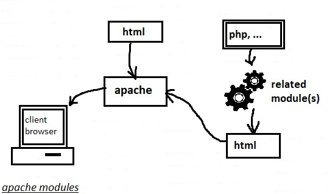

# 208.1. Implementing a web server

## **208.1 Implementing a webserver**

**Weight:**4

**Description:**Candidates should be able to install and configure a web server. This objective includes monitoring the server’s load and performance, restricting client user access, configuring support for scripting languages as modules and setting up client user authentication. Also included is configuring server options to restrict usage of resources. Candidates should be able to configure a web server to use virtual hosts and customize file access.

**KeyKnowledgeAreas:**

* Apache 2.4 configuration files, terms and utilities
* Apache log files configuration and content
* Access restriction methods and files
* mod\_perl and PHP configuration
* Client user authentication files and utilities
* Configuration of maximum requests, minimum and maximum servers and clients
* Apache 2.4 virtual host implementation \(with and without dedicated IP addresses\)
* Using redirect statements in Apache’s configuration files to customize file access

**TermsandUtilities:**

* access logs and error logs
* .htaccess
* httpd.conf
* mod\_auth\_basic, mod\_authz\_host and mod\_access\_compat
* htpasswd
* AuthUserFile, AuthGroupFile
* apachectl, apache2ctl
* httpd, apache2

## WhatisTheWebServer?

A Web server is a program that uses HTTP \(Hypertext Transfer Protocol\) to serve the files that form Web pages to users, in response to their requests, which are forwarded by their computers' HTTP clients. Dedicated computers and appliances may be referred to as Web servers as well.


There are some considerations in choosing a Web server include how well it works with the operating system and other servers, its ability to handle server-side programming, security characteristics, and the particular publishing, search engine and site building tools that come with it.

Leading Web servers include Apache \(the most widely-installed Web server\), Microsoft's Internet Information Server \(IIS\) and nginx \(pronounced engine X\) from NGNIX. Other Web servers include Novell's NetWare server, Google Web Server \(GWS\) and IBM's family of Domino servers.

## Apache

The Apache HTTP Server Project is an effort to develop and maintain an open-source HTTP server for modern operating systems including UNIX and Windows. The goal of this project is to provide a secure, efficient and extensible server that provides HTTP services in sync with the current HTTP standards.

The Apache HTTP Server \("httpd"\) was launched in 1995 and it has been the most popular web server on the Internet since April 1996. It has celebrated its 20th birthday as a project in February 2015. The Apache HTTP Server is a project of The Apache Software Foundation. The current version of apache is version 2.0.

## httpd.conf

Apache configuration file\(s\) are stored differently in different distributions, but they are mostly the same thing. There is one standard configuration file which might be broked to many pieces.

| apache | Redhat / CentOS | Debian / Ubuntu |
| :--- | :--- | :--- |
| Package Name | httpd | apache2 |
| Configuration Files Location | /etc/httpd | /etc/apache2 |

Configuration files are broken up in differently in Redhat or Debian :


### apache on Ubuntu

ok.Lets install apache2 on ubuntu first:

```text
root@server1:~# apt-get install apache2
root@server1:~# dpkg -L apache2 | egrep -i "\/etc|\/var"
/etc
/etc/logrotate.d
/etc/logrotate.d/apache2
/etc/default
/etc/default/apache-htcacheclean
/etc/apache2
/etc/apache2/mods-available
/etc/apache2/mods-available/slotmem_plain.load
/etc/apache2/mods-available/dav_fs.conf
/etc/apache2/mods-available/remoteip.load
/etc/apache2/mods-available/cache_socache.load
...shorten....
/etc/apache2/mods-available/dir.conf
/etc/apache2/mods-available/reflector.load
/etc/apache2/mods-available/lbmethod_heartbeat.load
/etc/apache2/mods-available/env.load
/etc/apache2/mods-available/proxy_http.load
/etc/apache2/mods-available/suexec.load
/etc/apache2/mods-enabled
/etc/apache2/conf-available
/etc/apache2/conf-available/serve-cgi-bin.conf
/etc/apache2/conf-available/other-vhosts-access-log.conf
/etc/apache2/conf-available/localized-error-pages.conf
/etc/apache2/conf-available/security.conf
/etc/apache2/conf-available/charset.conf
/etc/apache2/sites-available
/etc/apache2/sites-available/default-ssl.conf
/etc/apache2/sites-available/000-default.conf
/etc/apache2/sites-enabled
/etc/apache2/magic
/etc/apache2/conf-enabled
/etc/apache2/ports.conf
/etc/apache2/envvars
/etc/apache2/apache2.conf
/etc/ufw
/etc/ufw/applications.d
/etc/ufw/applications.d/apache2
/etc/ufw/applications.d/apache2-utils.ufw.profile
/etc/init.d
/etc/init.d/apache-htcacheclean
/etc/init.d/apache2
/etc/cron.daily
/etc/cron.daily/apache2
/var
/var/www
/var/www/html
/var/cache
/var/cache/apache2
/var/cache/apache2/mod_cache_disk
/var/lib
/var/lib/apache2
/var/log
/var/log/apache2
```

the main configuration file httpd.conf:

```text
root@server1:/# cd /etc/apache2/
root@server1:/etc/apache2# cat apache2.conf 
# This is the main Apache server configuration file.  It contains the
# configuration directives that give the server its instructions.
# See http://httpd.apache.org/docs/2.4/ for detailed information about
# the directives and /usr/share/doc/apache2/README.Debian about Debian specific
# hints.
#
#
# Summary of how the Apache 2 configuration works in Debian:
# The Apache 2 web server configuration in Debian is quite different to
# upstream's suggested way to configure the web server. This is because Debian's
# default Apache2 installation attempts to make adding and removing modules,
# virtual hosts, and extra configuration directives as flexible as possible, in
# order to make automating the changes and administering the server as easy as
# possible.

# It is split into several files forming the configuration hierarchy outlined
# below, all located in the /etc/apache2/ directory:
#
#    /etc/apache2/
#    |-- apache2.conf
#    |    `--  ports.conf
#    |-- mods-enabled
#    |    |-- *.load
#    |    `-- *.conf
#    |-- conf-enabled
#    |    `-- *.conf
#     `-- sites-enabled
#         `-- *.conf
#
#
# * apache2.conf is the main configuration file (this file). It puts the pieces
#   together by including all remaining configuration files when starting up the
#   web server.
#
# * ports.conf is always included from the main configuration file. It is
#   supposed to determine listening ports for incoming connections which can be
#   customized anytime.
#
# * Configuration files in the mods-enabled/, conf-enabled/ and sites-enabled/
#   directories contain particular configuration snippets which manage modules,
#   global configuration fragments, or virtual host configurations,
#   respectively.
#
#   They are activated by symlinking available configuration files from their
#   respective *-available/ counterparts. These should be managed by using our
#   helpers a2enmod/a2dismod, a2ensite/a2dissite and a2enconf/a2disconf. See
#   their respective man pages for detailed information.
#
# * The binary is called apache2. Due to the use of environment variables, in
#   the default configuration, apache2 needs to be started/stopped with
#   /etc/init.d/apache2 or apache2ctl. Calling /usr/bin/apache2 directly will not
#   work with the default configuration.


# Global configuration
#

#
# ServerRoot: The top of the directory tree under which the server's
# configuration, error, and log files are kept.
#
# NOTE!  If you intend to place this on an NFS (or otherwise network)
# mounted filesystem then please read the Mutex documentation (available
# at <URL:http://httpd.apache.org/docs/2.4/mod/core.html#mutex>);
# you will save yourself a lot of trouble.
#
# Do NOT add a slash at the end of the directory path.
#
#ServerRoot "/etc/apache2"

#
# The accept serialization lock file MUST BE STORED ON A LOCAL DISK.
#
Mutex file:${APACHE_LOCK_DIR} default

#
# PidFile: The file in which the server should record its process
# identification number when it starts.
# This needs to be set in /etc/apache2/envvars
#
PidFile ${APACHE_PID_FILE}

#
# Timeout: The number of seconds before receives and sends time out.
#
Timeout 300

#
# KeepAlive: Whether or not to allow persistent connections (more than
# one request per connection). Set to "Off" to deactivate.
#
KeepAlive On

#
# MaxKeepAliveRequests: The maximum number of requests to allow
# during a persistent connection. Set to 0 to allow an unlimited amount.
# We recommend you leave this number high, for maximum performance.
#
MaxKeepAliveRequests 100

#
# KeepAliveTimeout: Number of seconds to wait for the next request from the
# same client on the same connection.
#
KeepAliveTimeout 5


# These need to be set in /etc/apache2/envvars
User ${APACHE_RUN_USER}
Group ${APACHE_RUN_GROUP}

#
# HostnameLookups: Log the names of clients or just their IP addresses
# e.g., www.apache.org (on) or 204.62.129.132 (off).
# The default is off because it'd be overall better for the net if people
# had to knowingly turn this feature on, since enabling it means that
# each client request will result in AT LEAST one lookup request to the
# nameserver.
#
HostnameLookups Off

# ErrorLog: The location of the error log file.
# If you do not specify an ErrorLog directive within a <VirtualHost>
# container, error messages relating to that virtual host will be
# logged here.  If you *do* define an error logfile for a <VirtualHost>
# container, that host's errors will be logged there and not here.
#
ErrorLog ${APACHE_LOG_DIR}/error.log

#
# LogLevel: Control the severity of messages logged to the error_log.
# Available values: trace8, ..., trace1, debug, info, notice, warn,
# error, crit, alert, emerg.
# It is also possible to configure the log level for particular modules, e.g.
# "LogLevel info ssl:warn"
#
LogLevel warn

# Include module configuration:
IncludeOptional mods-enabled/*.load
IncludeOptional mods-enabled/*.conf

# Include list of ports to listen on
Include ports.conf


# Sets the default security model of the Apache2 HTTPD server. It does
# not allow access to the root filesystem outside of /usr/share and /var/www.
# The former is used by web applications packaged in Debian,
# the latter may be used for local directories served by the web server. If
# your system is serving content from a sub-directory in /srv you must allow
# access here, or in any related virtual host.
<Directory />
    Options FollowSymLinks
    AllowOverride None
    Require all denied
</Directory>

<Directory /usr/share>
    AllowOverride None
    Require all granted
</Directory>

<Directory /var/www/>
    Options Indexes FollowSymLinks
    AllowOverride None
    Require all granted
</Directory>

#<Directory /srv/>
#    Options Indexes FollowSymLinks
#    AllowOverride None
#    Require all granted
#</Directory>


# AccessFileName: The name of the file to look for in each directory
# for additional configuration directives.  See also the AllowOverride
# directive.
#
AccessFileName .htaccess

#
# The following lines prevent .htaccess and .htpasswd files from being
# viewed by Web clients.
#
<FilesMatch "^\.ht">
    Require all denied
</FilesMatch>


#
# The following directives define some format nicknames for use with
# a CustomLog directive.
#
# These deviate from the Common Log Format definitions in that they use %O
# (the actual bytes sent including headers) instead of %b (the size of the
# requested file), because the latter makes it impossible to detect partial
# requests.
#
# Note that the use of %{X-Forwarded-For}i instead of %h is not recommended.
# Use mod_remoteip instead.
#
LogFormat "%v:%p %h %l %u %t \"%r\" %>s %O \"%{Referer}i\" \"%{User-Agent}i\"" vhost_combined
LogFormat "%h %l %u %t \"%r\" %>s %O \"%{Referer}i\" \"%{User-Agent}i\"" combined
LogFormat "%h %l %u %t \"%r\" %>s %O" common
LogFormat "%{Referer}i -> %U" referer
LogFormat "%{User-agent}i" agent

# Include of directories ignores editors' and dpkg's backup files,
# see README.Debian for details.

# Include generic snippets of statements
IncludeOptional conf-enabled/*.conf

# Include the virtual host configurations:
IncludeOptional sites-enabled/*.conf
```

Wow that is a big configuration file but it gives us good information about how apache include other directories and configuration files.

```text
root@server1:/etc/apache2# tree
.
├── apache2.conf
├── conf-available
│   ├── charset.conf
│   ├── localized-error-pages.conf
│   ├── other-vhosts-access-log.conf
│   ├── security.conf
│   └── serve-cgi-bin.conf
├── conf-enabled
│   ├── charset.conf -> ../conf-available/charset.conf
│   ├── localized-error-pages.conf -> ../conf-available/localized-error-pages.conf
│   ├── other-vhosts-access-log.conf -> ../conf-available/other-vhosts-access-log.conf
│   ├── security.conf -> ../conf-available/security.conf
│   └── serve-cgi-bin.conf -> ../conf-available/serve-cgi-bin.conf
├── envvars
├── magic
├── mods-available
│   ├── access_compat.load
│   ├── actions.conf
│   ├── actions.load
│   ├── alias.conf
│   ├── alias.load
│   ├── allowmethods.load
│   ├── asis.load
│   ├── auth_basic.load
│   ├── auth_digest.load
│   ├── auth_form.load
...... shorten ......
│   ├── userdir.conf
│   ├── userdir.load
│   ├── usertrack.load
│   ├── vhost_alias.load
│   └── xml2enc.load
├── mods-enabled
│   ├── access_compat.load -> ../mods-available/access_compat.load
│   ├── alias.conf -> ../mods-available/alias.conf
│   ├── alias.load -> ../mods-available/alias.load
│   ├── auth_basic.load -> ../mods-available/auth_basic.load
│   ├── authn_core.load -> ../mods-available/authn_core.load
│   ├── authn_file.load -> ../mods-available/authn_file.load
│   ├── authz_core.load -> ../mods-available/authz_core.load
│   ├── authz_host.load -> ../mods-available/authz_host.load
│   ├── authz_user.load -> ../mods-available/authz_user.load
│   ├── autoindex.conf -> ../mods-available/autoindex.conf
│   ├── autoindex.load -> ../mods-available/autoindex.load
│   ├── deflate.conf -> ../mods-available/deflate.conf
│   ├── deflate.load -> ../mods-available/deflate.load
│   ├── dir.conf -> ../mods-available/dir.conf
│   ├── dir.load -> ../mods-available/dir.load
│   ├── env.load -> ../mods-available/env.load
│   ├── filter.load -> ../mods-available/filter.load
│   ├── mime.conf -> ../mods-available/mime.conf
│   ├── mime.load -> ../mods-available/mime.load
│   ├── mpm_event.conf -> ../mods-available/mpm_event.conf
│   ├── mpm_event.load -> ../mods-available/mpm_event.load
│   ├── negotiation.conf -> ../mods-available/negotiation.conf
│   ├── negotiation.load -> ../mods-available/negotiation.load
│   ├── setenvif.conf -> ../mods-available/setenvif.conf
│   ├── setenvif.load -> ../mods-available/setenvif.load
│   ├── status.conf -> ../mods-available/status.conf
│   └── status.load -> ../mods-available/status.load
├── ports.conf
├── sites-available
│   ├── 000-default.conf
│   └── default-ssl.conf
└── sites-enabled
    └── 000-default.conf -> ../sites-available/000-default.conf

6 directories, 175 files
root@server1:/etc/apache2/sites-enabled# ls -l
total 0
lrwxrwxrwx 1 root root 35 Apr 28 02:02 000-default.conf -> ../sites-available/000-default.conf
```

and see how 000-default.conf configuration file looks like:

```text
root@server1:/etc/apache2/sites-enabled# cat 000-default.conf 
<VirtualHost *:80>
    # The ServerName directive sets the request scheme, hostname and port that
    # the server uses to identify itself. This is used when creating
    # redirection URLs. In the context of virtual hosts, the ServerName
    # specifies what hostname must appear in the request's Host: header to
    # match this virtual host. For the default virtual host (this file) this
    # value is not decisive as it is used as a last resort host regardless.
    # However, you must set it for any further virtual host explicitly.
    #ServerName www.example.com

    ServerAdmin webmaster@localhost
    DocumentRoot /var/www/html

    # Available loglevels: trace8, ..., trace1, debug, info, notice, warn,
    # error, crit, alert, emerg.
    # It is also possible to configure the loglevel for particular
    # modules, e.g.
    #LogLevel info ssl:warn

    ErrorLog ${APACHE_LOG_DIR}/error.log
    CustomLog ${APACHE_LOG_DIR}/access.log combined

    # For most configuration files from conf-available/, which are
    # enabled or disabled at a global level, it is possible to
    # include a line for only one particular virtual host. For example the
    # following line enables the CGI configuration for this host only
    # after it has been globally disabled with "a2disconf".
    #Include conf-available/serve-cgi-bin.conf
</VirtualHost>

# vim: syntax=apache ts=4 sw=4 sts=4 sr noet
```

### apache on CentOS

In centOS there are some minor differences:

```text
root@centos7 ~]# yum search httpd | grep -i  server  | grep -i apache
httpd.x86_64 : Apache HTTP Server
httpd-devel.x86_64 : Development interfaces for the Apache HTTP server
httpd-itk.x86_64 : MPM Itk for Apache HTTP Server
httpd-manual.noarch : Documentation for the Apache HTTP server
httpd-tools.x86_64 : Tools for use with the Apache HTTP Server
mod_dav_svn.x86_64 : Apache httpd module for Subversion server

[root@centos7 ~]# yum -y  install httpd.x86_64 

[root@centos7 ~]# rpm -ql httpd | egrep -i "\/etc|\/var"
/etc/httpd
/etc/httpd/conf
/etc/httpd/conf.d
/etc/httpd/conf.d/README
/etc/httpd/conf.d/autoindex.conf
/etc/httpd/conf.d/userdir.conf
/etc/httpd/conf.d/welcome.conf
/etc/httpd/conf.modules.d
/etc/httpd/conf.modules.d/00-base.conf
/etc/httpd/conf.modules.d/00-dav.conf
/etc/httpd/conf.modules.d/00-lua.conf
/etc/httpd/conf.modules.d/00-mpm.conf
/etc/httpd/conf.modules.d/00-proxy.conf
/etc/httpd/conf.modules.d/00-systemd.conf
/etc/httpd/conf.modules.d/01-cgi.conf
/etc/httpd/conf/httpd.conf
/etc/httpd/conf/magic
/etc/httpd/logs
/etc/httpd/modules
/etc/httpd/run
/etc/logrotate.d/httpd
/etc/sysconfig/htcacheclean
/etc/sysconfig/httpd
/var/cache/httpd
/var/cache/httpd/proxy
/var/lib/dav
/var/log/httpd
/var/www
/var/www/cgi-bin
/var/www/html

[root@centos7 ~]# cd /etc/httpd/
[root@centos7 httpd]# tree
.
├── conf
│   ├── httpd.conf
│   └── magic
├── conf.d
│   ├── autoindex.conf
│   ├── README
│   ├── userdir.conf
│   └── welcome.conf
├── conf.modules.d
│   ├── 00-base.conf
│   ├── 00-dav.conf
│   ├── 00-lua.conf
│   ├── 00-mpm.conf
│   ├── 00-proxy.conf
│   ├── 00-systemd.conf
│   └── 01-cgi.conf
├── logs -> ../../var/log/httpd
├── modules -> ../../usr/lib64/httpd/modules
└── run -> /run/httpd

6 directories, 13 files
```

and the main configuration file in CentOS /etc/httpd/httpd.conf :

```text
[root@centos7 httpd]# ll
total 0
drwxr-xr-x. 2 root root  37 Apr 28 06:22 conf
drwxr-xr-x. 2 root root  82 Apr 28 06:22 conf.d
drwxr-xr-x. 2 root root 146 Apr 28 06:22 conf.modules.d
lrwxrwxrwx. 1 root root  19 Apr 28 06:22 logs -> ../../var/log/httpd
lrwxrwxrwx. 1 root root  29 Apr 28 06:22 modules -> ../../usr/lib64/httpd/modules
lrwxrwxrwx. 1 root root  10 Apr 28 06:22 run -> /run/httpd

[root@centos7 httpd]# cd conf
[root@centos7 conf]# ll
total 28
-rw-r--r--. 1 root root 11753 Oct 19  2017 httpd.conf
-rw-r--r--. 1 root root 13077 Oct 19  2017 magic

[root@centos7 conf]# cat httpd.conf 
#
# This is the main Apache HTTP server configuration file.  It contains the
# configuration directives that give the server its instructions.
# See <URL:http://httpd.apache.org/docs/2.4/> for detailed information.
# In particular, see 
# <URL:http://httpd.apache.org/docs/2.4/mod/directives.html>
# for a discussion of each configuration directive.
#
# Do NOT simply read the instructions in here without understanding
# what they do.  They're here only as hints or reminders.  If you are unsure
# consult the online docs. You have been warned.  
#
# Configuration and logfile names: If the filenames you specify for many
# of the server's control files begin with "/" (or "drive:/" for Win32), the
# server will use that explicit path.  If the filenames do *not* begin
# with "/", the value of ServerRoot is prepended -- so 'log/access_log'
# with ServerRoot set to '/www' will be interpreted by the
# server as '/www/log/access_log', where as '/log/access_log' will be
# interpreted as '/log/access_log'.

#
# ServerRoot: The top of the directory tree under which the server's
# configuration, error, and log files are kept.
#
# Do not add a slash at the end of the directory path.  If you point
# ServerRoot at a non-local disk, be sure to specify a local disk on the
# Mutex directive, if file-based mutexes are used.  If you wish to share the
# same ServerRoot for multiple httpd daemons, you will need to change at
# least PidFile.
#
ServerRoot "/etc/httpd"

#
# Listen: Allows you to bind Apache to specific IP addresses and/or
# ports, instead of the default. See also the <VirtualHost>
# directive.
#
# Change this to Listen on specific IP addresses as shown below to 
# prevent Apache from glomming onto all bound IP addresses.
#
#Listen 12.34.56.78:80
Listen 80

#
# Dynamic Shared Object (DSO) Support
#
# To be able to use the functionality of a module which was built as a DSO you
# have to place corresponding `LoadModule' lines at this location so the
# directives contained in it are actually available _before_ they are used.
# Statically compiled modules (those listed by `httpd -l') do not need
# to be loaded here.
#
# Example:
# LoadModule foo_module modules/mod_foo.so
#
Include conf.modules.d/*.conf

#
# If you wish httpd to run as a different user or group, you must run
# httpd as root initially and it will switch.  
#
# User/Group: The name (or #number) of the user/group to run httpd as.
# It is usually good practice to create a dedicated user and group for
# running httpd, as with most system services.
#
User apache
Group apache

# 'Main' server configuration
#
# The directives in this section set up the values used by the 'main'
# server, which responds to any requests that aren't handled by a
# <VirtualHost> definition.  These values also provide defaults for
# any <VirtualHost> containers you may define later in the file.
#
# All of these directives may appear inside <VirtualHost> containers,
# in which case these default settings will be overridden for the
# virtual host being defined.
#

#
# ServerAdmin: Your address, where problems with the server should be
# e-mailed.  This address appears on some server-generated pages, such
# as error documents.  e.g. admin@your-domain.com
#
ServerAdmin root@localhost

#
# ServerName gives the name and port that the server uses to identify itself.
# This can often be determined automatically, but we recommend you specify
# it explicitly to prevent problems during startup.
#
# If your host doesn't have a registered DNS name, enter its IP address here.
#
#ServerName www.example.com:80

#
# Deny access to the entirety of your server's filesystem. You must
# explicitly permit access to web content directories in other 
# <Directory> blocks below.
#
<Directory />
    AllowOverride none
    Require all denied
</Directory>

#
# Note that from this point forward you must specifically allow
# particular features to be enabled - so if something's not working as
# you might expect, make sure that you have specifically enabled it
# below.
#

#
# DocumentRoot: The directory out of which you will serve your
# documents. By default, all requests are taken from this directory, but
# symbolic links and aliases may be used to point to other locations.
#
DocumentRoot "/var/www/html"

#
# Relax access to content within /var/www.
#
<Directory "/var/www">
    AllowOverride None
    # Allow open access:
    Require all granted
</Directory>

# Further relax access to the default document root:
<Directory "/var/www/html">
    #
    # Possible values for the Options directive are "None", "All",
    # or any combination of:
    #   Indexes Includes FollowSymLinks SymLinksifOwnerMatch ExecCGI MultiViews
    #
    # Note that "MultiViews" must be named *explicitly* --- "Options All"
    # doesn't give it to you.
    #
    # The Options directive is both complicated and important.  Please see
    # http://httpd.apache.org/docs/2.4/mod/core.html#options
    # for more information.
    #
    Options Indexes FollowSymLinks

    #
    # AllowOverride controls what directives may be placed in .htaccess files.
    # It can be "All", "None", or any combination of the keywords:
    #   Options FileInfo AuthConfig Limit
    #
    AllowOverride None

    #
    # Controls who can get stuff from this server.
    #
    Require all granted
</Directory>

#
# DirectoryIndex: sets the file that Apache will serve if a directory
# is requested.
#
<IfModule dir_module>
    DirectoryIndex index.html
</IfModule>

#
# The following lines prevent .htaccess and .htpasswd files from being 
# viewed by Web clients. 
#
<Files ".ht*">
    Require all denied
</Files>

#
# ErrorLog: The location of the error log file.
# If you do not specify an ErrorLog directive within a <VirtualHost>
# container, error messages relating to that virtual host will be
# logged here.  If you *do* define an error logfile for a <VirtualHost>
# container, that host's errors will be logged there and not here.
#
ErrorLog "logs/error_log"

#
# LogLevel: Control the number of messages logged to the error_log.
# Possible values include: debug, info, notice, warn, error, crit,
# alert, emerg.
#
LogLevel warn

<IfModule log_config_module>
    #
    # The following directives define some format nicknames for use with
    # a CustomLog directive (see below).
    #
    LogFormat "%h %l %u %t \"%r\" %>s %b \"%{Referer}i\" \"%{User-Agent}i\"" combined
    LogFormat "%h %l %u %t \"%r\" %>s %b" common

    <IfModule logio_module>
      # You need to enable mod_logio.c to use %I and %O
      LogFormat "%h %l %u %t \"%r\" %>s %b \"%{Referer}i\" \"%{User-Agent}i\" %I %O" combinedio
    </IfModule>

    #
    # The location and format of the access logfile (Common Logfile Format).
    # If you do not define any access logfiles within a <VirtualHost>
    # container, they will be logged here.  Contrariwise, if you *do*
    # define per-<VirtualHost> access logfiles, transactions will be
    # logged therein and *not* in this file.
    #
    #CustomLog "logs/access_log" common

    #
    # If you prefer a logfile with access, agent, and referer information
    # (Combined Logfile Format) you can use the following directive.
    #
    CustomLog "logs/access_log" combined
</IfModule>

<IfModule alias_module>
    #
    # Redirect: Allows you to tell clients about documents that used to 
    # exist in your server's namespace, but do not anymore. The client 
    # will make a new request for the document at its new location.
    # Example:
    # Redirect permanent /foo http://www.example.com/bar

    #
    # Alias: Maps web paths into filesystem paths and is used to
    # access content that does not live under the DocumentRoot.
    # Example:
    # Alias /webpath /full/filesystem/path
    #
    # If you include a trailing / on /webpath then the server will
    # require it to be present in the URL.  You will also likely
    # need to provide a <Directory> section to allow access to
    # the filesystem path.

    #
    # ScriptAlias: This controls which directories contain server scripts. 
    # ScriptAliases are essentially the same as Aliases, except that
    # documents in the target directory are treated as applications and
    # run by the server when requested rather than as documents sent to the
    # client.  The same rules about trailing "/" apply to ScriptAlias
    # directives as to Alias.
    #
    ScriptAlias /cgi-bin/ "/var/www/cgi-bin/"

</IfModule>

#
# "/var/www/cgi-bin" should be changed to whatever your ScriptAliased
# CGI directory exists, if you have that configured.
#
<Directory "/var/www/cgi-bin">
    AllowOverride None
    Options None
    Require all granted
</Directory>

<IfModule mime_module>
    #
    # TypesConfig points to the file containing the list of mappings from
    # filename extension to MIME-type.
    #
    TypesConfig /etc/mime.types

    #
    # AddType allows you to add to or override the MIME configuration
    # file specified in TypesConfig for specific file types.
    #
    #AddType application/x-gzip .tgz
    #
    # AddEncoding allows you to have certain browsers uncompress
    # information on the fly. Note: Not all browsers support this.
    #
    #AddEncoding x-compress .Z
    #AddEncoding x-gzip .gz .tgz
    #
    # If the AddEncoding directives above are commented-out, then you
    # probably should define those extensions to indicate media types:
    #
    AddType application/x-compress .Z
    AddType application/x-gzip .gz .tgz

    #
    # AddHandler allows you to map certain file extensions to "handlers":
    # actions unrelated to filetype. These can be either built into the server
    # or added with the Action directive (see below)
    #
    # To use CGI scripts outside of ScriptAliased directories:
    # (You will also need to add "ExecCGI" to the "Options" directive.)
    #
    #AddHandler cgi-script .cgi

    # For type maps (negotiated resources):
    #AddHandler type-map var

    #
    # Filters allow you to process content before it is sent to the client.
    #
    # To parse .shtml files for server-side includes (SSI):
    # (You will also need to add "Includes" to the "Options" directive.)
    #
    AddType text/html .shtml
    AddOutputFilter INCLUDES .shtml
</IfModule>

#
# Specify a default charset for all content served; this enables
# interpretation of all content as UTF-8 by default.  To use the 
# default browser choice (ISO-8859-1), or to allow the META tags
# in HTML content to override this choice, comment out this
# directive:
#
AddDefaultCharset UTF-8

<IfModule mime_magic_module>
    #
    # The mod_mime_magic module allows the server to use various hints from the
    # contents of the file itself to determine its type.  The MIMEMagicFile
    # directive tells the module where the hint definitions are located.
    #
    MIMEMagicFile conf/magic
</IfModule>

#
# Customizable error responses come in three flavors:
# 1) plain text 2) local redirects 3) external redirects
#
# Some examples:
#ErrorDocument 500 "The server made a boo boo."
#ErrorDocument 404 /missing.html
#ErrorDocument 404 "/cgi-bin/missing_handler.pl"
#ErrorDocument 402 http://www.example.com/subscription_info.html
#

#
# EnableMMAP and EnableSendfile: On systems that support it, 
# memory-mapping or the sendfile syscall may be used to deliver
# files.  This usually improves server performance, but must
# be turned off when serving from networked-mounted 
# filesystems or if support for these functions is otherwise
# broken on your system.
# Defaults if commented: EnableMMAP On, EnableSendfile Off
#
#EnableMMAP off
EnableSendfile on

# Supplemental configuration
#
# Load config files in the "/etc/httpd/conf.d" directory, if any.
IncludeOptional conf.d/*.conf
```

If want to load some thing we should put it in conf.d with ".conf" extention. No symbolic linking. So While in ubuntu we can enable / disable some thing with symbolic links, In centos we have to rename the configuration file and use any thing except ".conf" ath the end of file name to disable it.

You can see that the configuration files are the same although in ubuntu its some how classified but in centos all configurations have been wrapped up in one big file.

Another point is that in ubuntu apache service "apache2" is enabled and started right after installation but in centos we have to enable and start apache service "httpd" .

Some of common directives which we have to know are:

* ServerRoot : Is what defines the base directory that all of configurations, modules, ... for our apache instance is configured to be. It can be changed but it needs to update specific links or directories with reference that start with /etc/httpd .
* Listen: It can do two things for us. it allows us to define the port which apache service listen on\(by default 80tcp\). Also it allows us to bind a service to a specific IP Address on the system.
* DocumentRoot: Determine the base directory that all contents are served from. bedefault it is`/var/www/` . We can change it but if we have selinux enbaled in our system, there are some consideration about that .\(beyond the scope of LPIC2, LPIC3\)

```text
### Ubuntu ###
root@server1:~# cd /var/www/
root@server1:/var/www# ls -la
total 12
drwxr-xr-x  3 root root 4096 Apr 28 02:02 .
drwxr-xr-x 15 root root 4096 Apr 28 02:02 ..
drwxr-xr-x  2 root root 4096 Apr 28 02:02 html

### CentOS ###
[root@centos7 ~]# cd /var/www
[root@centos7 www]# ls -la
total 4
drwxr-xr-x.  4 root root   33 Apr 28 06:22 .
drwxr-xr-x. 22 root root 4096 Apr 28 06:22 ..
drwxr-xr-x.  2 root root    6 Oct 19  2017 cgi-bin
drwxr-xr-x.  2 root root    6 Oct 19  2017 html
```

to check if it works, use same html file below:

```text
<html>
    <head>
    </head>
    <body>
        It works!
    </body>
</html>
```

* LogLevels : There are two log files by default which every site writes to. They are in `/var/log/apache2`\(ubuntu\) or in `/var/log/httpd`\(CentOS\)
  * Access Log: Contains all information about whose accessing the web sever, IP address , user agent and number of other things.
  * ErrorLog : Determines and displays errors that are related to files missing, or some one who tries to log in to secure directory with a wrong password

```text
### Ubuntu ###
  root@server1:~# ls -la /var/log/apache2/
  total 16
  drwxr-x---  2 root adm    4096 Apr 28 02:02 .
  drwxrwxr-x 15 root syslog 4096 Apr 28 02:02 ..
  -rw-r-----  1 root adm     729 Apr 29 03:32 access.log
  -rw-r-----  1 root adm     279 Apr 28 02:02 error.log
  -rw-r-----  1 root adm       0 Apr 28 02:02 other_vhosts_access.log
### Cent OS ###
  [root@centos7 ~]# ls -la /var/log/httpd/
  total 12
  drwx------.  2 root root   41 Apr 29 03:06 .
  drwxr-xr-x. 20 root root 4096 Apr 29 03:06 ..
  -rw-r--r--.  1 root root  334 Apr 29 03:11 access_log
  -rw-r--r--.  1 root root 1438 Apr 29 03:09 error_log
```

* LogLevel can have several different values that we can set it for, debug, info, notice, warn, error, crit, alert, emerg \\(default : warn\\) it depends what we are doing.

All the thing we have seen till now were . Directives are lines ,\(can be within a section \),in the configuration file that contains one or more values define our use in the configuration .

```text
Directive1 yes
Directive2 no
<Section>
Directive3 all
Directive4 none
</Section>
```

* Directory Section: sections have directives in them that tell the site how to eather protect or display the type of content in any messages about what can be viewed or what cannot be viewed.

We can restrict access to directories with “Allow” and “Deny” options . Here is an example, This will make root dierctory secure:

```text
<Directory />
    Options None
    Order deny,allow
    Deny from all
</Directory>
```

* Options “None” – This option will not allow users to enable any optional features.
* Order deny, allow – This is the order in which the “Deny” and “Allow” directives will be processed. Here it will “deny” first and “allow” next.
* Deny from all – This will deny request from everybody to the root directory, nobody will be able to access root director

## Apache Modules

What has made apache web server so powerful and popular is its modules. Apache is designed modular and we can add or remove modules based on our needs.



apache deals with html files, so if we have used other languages like "php" we have to install required module.

### installing php module

For demonstaration we use Ubuntu here. Lets search and install php module for apache:

```text
root@server1:~# apt-cache search php | grep apache
libapache2-mod-php - server-side, HTML-embedded scripting language (Apache 2 module) (default)
libapache2-mod-php7.0 - server-side, HTML-embedded scripting language (Apache 2 module)
libapache2-mod-auth-memcookie - Apache2 authentication and authorization module.
libapache2-mod-auth-tkt - lightweight single-sign-on authentication module for Apache
libapache2-mod-authn-yubikey - Yubikey authentication provider for Apache
libapache2-mod-watchcat - Process monitoring Apache module
libapache2-mod-xsendfile - Serve large static files efficiently from web applications

root@server1:~# apt-get install libapache2-mod-php
```

congratulations, from now on we can use index.php in `/var/www/` directory. Now lets do more investigation on how php module has became available:

```text
root@server1:~# cd /etc/apache2/
root@server1:/etc/apache2# ls
apache2.conf    conf-enabled  magic           mods-enabled  sites-available
conf-available  envvars       mods-available  ports.conf    sites-enabled

root@server1:/etc/apache2# ls -l mods-available | grep php
-rw-r--r-- 1 root root  867 Mar 15 08:42 php7.0.conf
-rw-r--r-- 1 root root   79 Mar 15 08:42 php7.0.load

root@server1:/etc/apache2# ls -l mods-enabled/ | grep php
lrwxrwxrwx 1 root root 29 Apr 29 22:49 php7.0.conf -> ../mods-available/php7.0.conf
lrwxrwxrwx 1 root root 29 Apr 29 22:49 php7.0.load -> ../mods-available/php7.0.load
```

In CentOS all available modules are exist in /etc/httpd/conf.modules.d folder.

```text
[root@centos7 ~]# cd /etc/httpd/modules/
[root@centos7 modules]# ls -l
total 2472
-rwxr-xr-x. 1 root root  11208 Oct 19  2017 mod_access_compat.so
-rwxr-xr-x. 1 root root  11168 Oct 19  2017 mod_actions.so
-rwxr-xr-x. 1 root root  15360 Oct 19  2017 mod_alias.so
-rwxr-xr-x. 1 root root  11136 Oct 19  2017 mod_allowmethods.so
...........shorten............
-rwxr-xr-x. 1 root root  11096 Oct 19  2017 mod_version.so
-rwxr-xr-x. 1 root root  15272 Oct 19  2017 mod_vhost_alias.so
-rwxr-xr-x. 1 root root  19472 Oct 19  2017 mod_watchdog.so
```

these modules can be loaded if related ".conf" file exist in modules.conf.d :

```text
[root@centos7 modules]# cd ..
[root@centos7 httpd]# ls
conf  conf.d  conf.modules.d  logs  modules  run
[root@centos7 httpd]# cd conf.modules.d/
[root@centos7 conf.modules.d]# ls
00-base.conf  00-lua.conf  00-proxy.conf    01-cgi.conf
00-dav.conf   00-mpm.conf  00-systemd.conf
[root@centos7 conf.modules.d]# cat 00-dav.conf 
LoadModule dav_module modules/mod_dav.so
LoadModule dav_fs_module modules/mod_dav_fs.so
LoadModule dav_lock_module modules/mod_dav_lock.so
```

because every ".conf" file is included by /etc/httpd//conf/httpd.conf file:

```text
[root@centos7 conf.modules.d]# cd ..
[root@centos7 httpd]# ls
conf  conf.d  conf.modules.d  logs  modules  run
[root@centos7 httpd]# cd conf
[root@centos7 conf]# ls
httpd.conf  magic
[root@centos7 conf]# cat httpd.conf | grep -i includeoptional
IncludeOptional conf.d/*.conf
```

Now lets install php module on CentOS:

```text
[root@centos7 httpd]# yum install php
```

and the configuration files:

```text
[root@centos7 httpd]# cd /etc/httpd/modules/
[root@centos7 modules]# ls | grep php
libphp5.so

[root@centos7 modules]# cd ..
[root@centos7 httpd]# ls
conf  conf.d  conf.modules.d  logs  modules  run
[root@centos7 httpd]# cd conf.modules.d/
[root@centos7 conf.modules.d]# ls -l
total 32
-rw-r--r--. 1 root root 3739 Oct 19  2017 00-base.conf
-rw-r--r--. 1 root root  139 Oct 19  2017 00-dav.conf
-rw-r--r--. 1 root root   41 Oct 19  2017 00-lua.conf
-rw-r--r--. 1 root root  742 Oct 19  2017 00-mpm.conf
-rw-r--r--. 1 root root  957 Oct 19  2017 00-proxy.conf
-rw-r--r--. 1 root root   88 Oct 19  2017 00-systemd.conf
-rw-r--r--. 1 root root  451 Oct 19  2017 01-cgi.conf
-rw-r--r--. 1 root root  216 Mar  7 08:37 10-php.conf

[root@centos7 conf.modules.d]# cat 10-php.conf 
#
# PHP is an HTML-embedded scripting language which attempts to make it
# easy for developers to write dynamically generated webpages.
#
<IfModule prefork.c>
  LoadModule php5_module modules/libphp5.so
</IfModule>

[root@centos7 conf.modules.d]# systemctl restart httpd.service
[root@centos7 conf.modules.d]#
```

now we can put a php file in /var/www/html and chek it!

```text
<html>
 <head>
  <title>PHP Test</title>
 </head>
 <body>
 <?php echo '<p>Hello Linux Learners PHP is working properly </p>'; ?> 
 If this is the only line you see then PHP is not enabled!
 </body>
</html>
```

### Installing Perl Module

First start with ubuntu:

```text
root@server1:~# apt-cache search perl | grep apache2
libapache2-mod-perl2 - Integration of perl with the Apache2 web server
libapache2-mod-perl2-dev - Integration of perl with the Apache2 web server - development files
libapache2-mod-perl2-doc - Integration of perl with the Apache2 web server - documentation
libapache2-reload-perl - module for reloading Perl modules when changed on disk
libapache2-authcassimple-perl - Apache2 module to authenticate trough a CAS server
libapache2-authcookie-perl - Perl Authentication and Authorization via cookies
libapache2-authenntlm-perl - module for Microsoft NTLM and Basic User Authentication
libapache2-mod-apreq2 - generic Apache request library - Apache module
libapache2-mod-auth-tkt - lightweight single-sign-on authentication module for Apache
libapache2-mod-log-sql - Use SQL to store/write your Apache queries logs - Base
libapache2-mod-musicindex - Browse, stream, download and search through MP3/Ogg/FLAC/MP4 files
libapache2-mod-watchcat - Process monitoring Apache module
libapache2-mod-xsendfile - Serve large static files efficiently from web applications
libapache2-request-perl - generic Apache request library - Perl modules
libapache2-sitecontrol-perl - perl web site authentication/authorization system
libapache2-mod-fastcgi - Apache 2 FastCGI module for long-running CGI scripts
root@server1:~# 
root@server1:~# apt-get install libapache2-mod-perl2
```

after finishing installation:

```text
root@server1:~# ls -l /etc/apache2/mods-enabled/ | grep perl
lrwxrwxrwx 1 root root 27 Apr 30 02:43 perl.load -> ../mods-available/perl.load
```

as perl scripts are almost server side script \(means they need to be processed on the server based on client condition and then turns back to the client\) we need to make a directory to keep perl scripts inside:

```text
root@server1:/var/www# ls
html
root@server1:/var/www# mkdir perl
```

and now add some confogurations to /etc/apache2/apache2.conf :

```text
################# Perl support
Alias /perl /var/www/perl
<Directory /var/www/perl>
    AddHandler perl-script .cgi .pl
    PerlResponseHandler ModPerl::PerlRun
    PerlOptions +ParseHeaders
    Options +ExecCGI
</Directory>
```

and then put perl script in /var/www/perl:

```text
root@server1:/var/www/perl# vim hello.pl
root@server1:/var/www/perl# ls -l
total 4
-rwxr-xr-x 1 root root 166 Apr 30 03:56 hello.pl
```

and check it out!

Now lets install Perl module on cetOS:

```text
[root@centos7 ~]# yum install mod_perl
[root@centos7 ~]# cd /etc/httpd/
[root@centos7 httpd]# ls
conf  conf.d  conf.modules.d  logs  modules  run
root@centos7 httpd]# cd conf.modules.d/

[root@centos7 conf.modules.d]# ls -l | grep perl
-rw-r--r--. 1 root root  448 Jan  4  2017 02-perl.conf

[root@centos7 conf.modules.d]# cat 02-perl.conf 
#
# Mod_perl incorporates a Perl interpreter into the Apache web server,
# so that the Apache web server can directly execute Perl code.
# Mod_perl links the Perl runtime library into the Apache web server
# and provides an object-oriented Perl interface for Apache's C
# language API.  The end result is a quicker CGI script turnaround
# process, since no external Perl interpreter has to be started.
#

LoadModule perl_module modules/mod_perl.so
```

Ok as we mentioned above, perl scripts are processed in server side so we need to make a place for scripts an then configure httpd service to deal with:

```text
[root@centos7 conf.modules.d]#  mkdir /var/www/html/perl-cgi
```

```text
[root@centos7 conf.modules.d]# cd ..
[root@centos7 httpd]# ls
conf  conf.d  conf.modules.d  logs  modules  run
[root@centos7 httpd]# cd conf
[root@centos7 conf]# vim httpd.conf
```

and add bellow part to httpd.conf:

```text
#enable perl server side CGI
<Directory /var/www/html/perl-cgi>
    AllowOverride All
    SetHandler perl-script
    PerlHandler ModPerl::Registry
    PerlOptions +ParseHeaders
    Options ExecCGI
    Order allow,deny
    Allow from all
</Directory>
```

next we need to restart httpd service and then add a perl script like this to test:

```text
[root@centos7 conf]# cd /var/www/html/perl-cgi/
[root@centos7 perl-cgi]# vim hello.pl
[root@centos7 perl-cgi]# cat hello.pl 
#!/usr/bin/perl

print "Content-type: text/html\n\n";
print "<font size=+1>Environment</font>\n";

foreach (sort keys %ENV) {
    print "<b>$_</b>: $ENV{$_}<br>\n";
            }

            1;

[root@centos7 perl-cgi]# chmod 755 hello.pl 
[root@centos7 perl-cgi]# ls -l
total 4
-rwxr-xr-x. 1 root root 172 Apr 30 22:26 hello.pl
```

a sample perl script could be like this:

```text
#!/usr/bin/perl

print "Content-type: text/html\n\n";
print "<font size=+1>Environment</font>\n";

foreach (sort keys %ENV) {
    print "<b>$_</b>: $ENV{$_}<br>\n";
            }
```

check it out!

## a2enmod , a2dismod

Apache provides easiest way to enable and disable apache modules by using simple commands.

a2dismod is an inbuilt script that disabling the given module from an apache configuration file by removing symlinks.

* **a2dismod \[module name\]**

```text
root@server1:~# a2dismod php7.0 
Module php7.0 disabled.
To activate the new configuration, you need to run:
  service apache2 restart
root@server1:~# systemctl restart apache2.service 
root@server1:~# ls -l /etc/apache2/mods-enabled/ | grep -i php
```

a2enmod is an inbuilt script that enabling the given module in apache configuration file by creating symlinks.

* **a2enmod \[module name\]**

```text
root@server1:~# a2enmod php7.0 
Considering conflict php5 for php7.0:
Enabling module php7.0.
To activate the new configuration, you need to run:
  service apache2 restart
root@server1:~# systemctl restart apache2.service 
root@server1:~# ls -l /etc/apache2/mods-enabled/ | grep -i php
lrwxrwxrwx 1 root root 29 May  1 02:41 php7.0.conf -> ../mods-available/php7.0.conf
lrwxrwxrwx 1 root root 29 May  1 02:41 php7.0.load -> ../mods-available/php7.0.load
```

### MPM Modules

MPM stands for Multi Processing Modules, actually Apache follows some mechanism to accept and complete web server requests. In practice, MPMs extend the modular functionality of Apache by allowing us to decide how to configure the web server to bind to network ports on the machine, accept requests from clients, and use children processes \(and threads, alternatively\) to handle such requests.

Apache offers three different MPMs to choose from, depending on our needs \(Beginning with version 2.4\):

* **prefork**
* **worker**
* **event**

The **prefork** MPM uses multiple child processes without threading. Each process handles one connection at a time without creating separate threads for each. Without going into too much detail, we can say that you will want to use this MPM only when debugging an application that uses, or if our application needs to deal with, non-thread-safe modules like _**mod\_php**_.


The **worker** MPM uses several threads per child processes, where each thread handles one connection at a time. This is a good choice for high-traffic servers as it allows more concurrent connections to be handled with less RAM than in the previous case.


Finally, the **event** MPM is the default MPM in most Apache installations for versions 2.4 and above. It is similar to the worker MPM in that it also creates multiple threads per child process but with an advantage: it causes KeepAlive or idle connections \(while they remain in that state\) to be handled by a single thread, thus freeing up memory that can be allocated to other threads. This MPM is not suitable for use with non-thread-safe modules like mod\_php, for which a replacement such a PHP-FPM must be used instead.

To check the MPM used by our Apache installation use httpd -V \(CentOS\):

```text
 -D SERVER_CONFIG_FILE="conf/httpd.conf"
[root@centos7 perl-cgi]# httpd -V | grep -i mpm
AH00558: httpd: Could not reliably determine the server's fully qualified domain name, using fe80::20c:29ff:fea0:58c8. Set the 'ServerName' directive globally to suppress this message
Server MPM:     prefork
```

or apache2ctl -V \(ubuntu\):

```text
root@server1:/var/www/perl# apache2ctl -V | grep -i mpm
AH00557: apache2: apr_sockaddr_info_get() failed for server1
AH00558: apache2: Could not reliably determine the server's fully qualified domain name, using 127.0.0.1. Set the 'ServerName' directive globally to suppress this message
Server MPM:     prefork
```

Here we see how ubuntu mpm modules work:

```text
root@server1:~# cd /etc/apache2/mods-available/
root@server1:/etc/apache2/mods-available# ls -l | grep -i mpm
-rw-r--r-- 1 root root  668 Mar 19  2016 mpm_event.conf
-rw-r--r-- 1 root root  106 Mar 19  2016 mpm_event.load
-rw-r--r-- 1 root root  571 Mar 19  2016 mpm_prefork.conf
-rw-r--r-- 1 root root  108 Mar 19  2016 mpm_prefork.load
-rw-r--r-- 1 root root  836 Mar 19  2016 mpm_worker.conf
-rw-r--r-- 1 root root  107 Mar 19  2016 mpm_worker.load
root@server1:/etc/apache2/mods-available# cd ..
root@server1:/etc/apache2# cd mods-enabled/
root@server1:/etc/apache2/mods-enabled# ls -l | grep -i mpm
lrwxrwxrwx 1 root root 34 Apr 29 22:48 mpm_prefork.conf -> ../mods-available/mpm_prefork.conf
lrwxrwxrwx 1 root root 34 Apr 29 22:48 mpm_prefork.load -> ../mods-available/mpm_prefork.load
```

as we have installed php module, apache server load prefork mpm. lets take alook at mpm\_prefork.conf file:

```text
root@server1:/etc/apache2/mods-enabled# cat mpm_prefork.conf 
# prefork MPM
# StartServers: number of server processes to start
# MinSpareServers: minimum number of server processes which are kept spare
# MaxSpareServers: maximum number of server processes which are kept spare
# MaxRequestWorkers: maximum number of server processes allowed to start
# MaxConnectionsPerChild: maximum number of requests a server process serves

<IfModule mpm_prefork_module>
    StartServers             5
    MinSpareServers          5
    MaxSpareServers         10
    MaxRequestWorkers      150
    MaxConnectionsPerChild   0
</IfModule>

# vim: syntax=apache ts=4 sw=4 sts=4 sr noet
```

now that we have a good back ground about mpm modules we can easily change mpm module either by removing or creating symbolic links in mods-enabled or we can use `a2dismod mpm_prefork` and `a2enmod mpm_worker` commands. But do not forget that php just works with prefork.

## Using Authentication for security

Some times we want to limit access to a specific web directory in order to protect it against the outside world.In order to make a folder password protected we need a tool to generate username and passwords and that is seperate from system authentication. htpasswd is a tool and that is part of apache2-utils package which usually is installed. But before that we have to tell apache that a directory is password protected and then create credentials.

We use Ubuntu for this demonstartion, lets start with default site:

```text
root@server1:~# cd /etc/apache2/
root@server1:/etc/apache2# ls
apache2.conf    conf-enabled  magic           mods-enabled  sites-available
conf-available  envvars       mods-available  ports.conf    sites-enabled

root@server1:/etc/apache2# cat apache2.conf | grep -i includeoption
IncludeOptional mods-enabled/*.load
IncludeOptional mods-enabled/*.conf
IncludeOptional conf-enabled/*.conf
IncludeOptional sites-enabled/*.conf

root@server1:/etc/apache2# ls -l sites-enabled/
total 0
lrwxrwxrwx 1 root root 35 Apr 28 02:02 000-default.conf -> ../sites-available/000-default.conf
```

Lets add some parts in the default site:

```text
root@server1:/etc/apache2# vim sites-enabled/000-default.conf 

<VirtualHost *:80>
    # The ServerName directive sets the request scheme, hostname and port that
    # the server uses to identify itself. This is used when creating
    # redirection URLs. In the context of virtual hosts, the ServerName
    # specifies what hostname must appear in the request's Host: header to
    # match this virtual host. For the default virtual host (this file) this
    # value is not decisive as it is used as a last resort host regardless.
    # However, you must set it for any further virtual host explicitly.
    #ServerName www.example.com

    ServerAdmin webmaster@localhost
    DocumentRoot /var/www/html

    ### Creating password protected directory
    ### using mod_auth module which is installed and enabled by default

    <Directory /var/www/html/protected>

        AuthType Basic
        AuthName "This name will be appeared in dialog box"
        #Passord file wich we will create using htpasswd tool
        AuthUserFile /etc/apache2/webpass 
        #Only user who have valid user nad pass word can access
        Require valid-user 
    </Directory>

    # Available loglevels: trace8, ..., trace1, debug, info, notice, warn,
    # error, crit, alert, emerg.
    # It is also possible to configure the loglevel for particular
    # modules, e.g.
    #LogLevel info ssl:warn

    ErrorLog ${APACHE_LOG_DIR}/error.log
    CustomLog ${APACHE_LOG_DIR}/access.log combined

    # For most configuration files from conf-available/, which are
    # enabled or disabled at a global level, it is possible to
    # include a line for only one particular virtual host. For example the
    # following line enables the CGI configuration for this host only
    # after it has been globally disabled with "a2disconf".
    #Include conf-available/serve-cgi-bin.conf
</VirtualHost>

# vim: syntax=apache ts=4 sw=4 sts=4 sr noet
```

Now it is time to create user name and password using htpasswd:

```text
root@server1:/etc/apache2# apt-get install apache2.utils
root@server1:/etc/apache2# htpasswd -c /etc/apache2/webpass user1
New password: 
Re-type new password: 
Adding password for user user1
root@server1:/etc/apache2# cat webpass 
user1:$apr1$4oFb123N$5.sK3e56UVvju3oCj6qXL/
```

to add more users to existing file use htpasswd command without -C switch.

```text
root@server1:/etc/apache2# htpasswd webpass user2
New password: 
Re-type new password: 
Adding password for user user2
root@server1:/etc/apache2# cat webpass 
user1:$apr1$4oFb123N$5.sK3e56UVvju3oCj6qXL/
user2:$apr1$ZqlOUMJR$yemL1BCgqQZ2Xv5Ccb6j01
```

And finally we need to restart apache service inorder our changes take affect, for that we can weather use apache daemon special tool call apache2ctl or restart the service like always.

### apache2ctl

apache2ctl is a part of apache2-utils and usually is installed with the main package, if not installe it:

```text
root@server1:~# apt-get install apache2-utils 
Reading package lists... Done
Building dependency tree       
Reading state information... Done
apache2-utils is already the newest version (2.4.18-2ubuntu3.8).
apache2-utils set to manually installed.
0 upgraded, 0 newly installed, 0 to remove and 428 not upgraded.

root@server1:/etc/apache2# apache2ctl restart
AH00557: apache2: apr_sockaddr_info_get() failed for server1
AH00558: apache2: Could not reliably determine the server's fully qualified domain name, using 127.0.0.1. Set the 'ServerName' directive globally to suppress this message
root@server1:/etc/apache2# service apache2 restart
```

Now lets creat sample index.html file inside /var/www/html/protected directory wich we defined in configuration file before:

```text
root@server1:/etc/apache2# mkdir /var/www/html/protected
root@server1:/etc/apache2# vim /var/www/html/protected/index.html
root@server1:/etc/apache2# cat /var/www/html/protected/index.html
CTYPE html>
<html>
<body>

<h1>This must be password protected</h1>
<p>Test it!</p>

</body>
</html>
```

and finally we used elinks to check the result `elinks http://localhost/protected`:


this was one way for protecting specific location in our web server and requiring basic authentication but there is another way which is using ".htaccess" file in a directory itself.

### .htaccess

Alternative method to secure content of a directory is using htaccess file, which is simpler and need less modifications inside the main configuration file. The idea is using a seperate file called "htaccess" inside the directory which we need to be protected and then putting sort of configurations inside that \(.htaccess\). Then modify appache configuration file\(apache2.conf / httpd.conf \) or our web site \(000-default.conf\) to let htaccess confoguaration be played.

Lets create second directory and create ".htaccess" file insude that:

```text
root@server1:/etc/apache2# mkdir /var/www/html/protected2
root@server1:/etc/apache2# cd /var/www/html/protected2
root@server1:/var/www/html/protected2# vim .htaccess

root@server1:/var/www/html/protected2# cat .htaccess 
AuthName "secure folder2"
AuthType Basic
AuthUserFile /etc/apache2/webpass
Require valid-user
```

Now lets configureour default web site confoguration file inorder to let setting inside ".htaccess" over ride main configs:

```text
root@server1:/var/www/html/protected2# cd /etc/apache2/
root@server1:/etc/apache2# vim apache2.conf 
root@server1:/etc/apache2# cd sites-enabled/
root@server1:/etc/apache2/sites-enabled# vim 000-default.conf
```

```text
 ### secured with ".htaccess"
        <Directory /var/www/html/protected2>
                AllowOverride AuthConfig
        </Directory>
```

and finnaly restart the service and check it:

```text
 root@server1:/etc/apache2/sites-enabled# systemctl restart apache2.service
root@server1:/etc/apache2/sites-enabled# elinks http://localhost/protected2
```

### Redirection

Redirects are used whenever a site needs people requesting one address to be directed to another address. There are many situations where we may find ourselves in this position.

* Moving to a Different Domain
* Expanding to Capture Similar Domains
* Creating a Persistent Experience In Spite of Page Name Changes
* Forcing SSL

#### Redirect Methods:

* **Temporary Redirects** : Temporary redirects are useful if our web content for a certain URL temporarily needs to be served out of a different location. For example, if we are performing site maintenance. Temporary redirects inform that browser that the content is temporarily located at a different location, but that they should continue to attempt to access the original URL.
* **Permanent Redirects** : Permanent redirects are useful when our content has been moved to a new location forever.This is useful for when we need to change domains or when the URL needs to change for other reasons and the old location will no longer be used.This redirect informs the browser that it should no longer request the old URL and should update its information to point to the new URL.

### How to Redirect in Apache

Apache can redirect using a few different tools. The simplest ways are accomplished with tools from the "mod\_alias" module, but more extensive redirects can be created with "mod\_rewrite".

* **Using the Redirect Directive**

In Apache, we can accomplish simple, single-page redirects using the "Redirect" directive, which is included in the "mod\_alias" module. This directive takes at least two arguments: the old URL and the new URL.

In its simplest form it would be like this:

```text
<VirtualHost *:80>

 #Redirecting form one directory to another directory
 Redirect /protected /redirected
</VirtualHost>
```

This redirect instructs the browser to direct all requests for "[http://localhost/protected](http://localhost/protected)" to "[http://localhost/redirected](http://localhost/redirected)". This is only for a single page, not for the entire site

If we want e to create a permanent redirect, we can do so in either of the following two ways:

```text
Redirect permanent /oldlocation http://www.example.com/newlocation
Redirect 301 /oldlocation http://www.example.com/newlocation
```

As with the "Redirect" directive, you can specify the type of redirect by adding the redirect code before the URL location rules.

* **Using the RedirectMatch Directive**

To redirect more than a single page, we can use the "RedirectMatch" directive, which allows us to specify directory matching patterns using regular expressions.This will allow us to redirect entire directories instead of just single files.

For example, if we wanted to match every request for something within the "/images" directory to a subdomain named "images.example.com", we could use the following:

```text
RedirectMatch ^/images/(.*)$ http://images.example.com/$1
```

RedirectMatch matches patterns in parenthesis and then references the matched text in the redirect using "$1", where 1 is the first group of text. Subsequent groups are given numbers sequentially.

* **Using mod\_rewrite to Redirect**

The most flexible, but complicated way to create redirect rules is with the module called "mod\_rewrite". This is outside of the scope of this article , but you can learn it from [here](https://www.digitalocean.com/community/tutorials/how-to-set-up-mod_rewrite).

## Apache Virtual Hosting

Apache is a very powerful, highly flexible and configurable Web server. One more feature of Apache is Virual hosting which allows us to host more than one website on a single Linux machine. Implementing virtual hosting with Apache web server can help us to save costs you are investing on our server maintenance and their administration.

#### Types of Virtual Host

There are two types of virtual hosting is available with Apache:

* **Name Based Virtual Hosting**

With the name based virtual hosting we can host **several domains/websites** on a **single machine** with a **single IP**. All domains on that server will be sharing a single IP. It’s easier to configure than IP based virtual hosting, we only need to configure DNS of the domain to map it with its correct IP address and then configure Apache to recognize it with the domain names.

* **IP Based Virtual Hosting**

With the IP based virtual hosting, we can assign a separate IP for each domain on a single server, these IP’s can be attached to the server with single NIC cards and as well as multiple NICs.


For demontration we use ubuntu, \(in CentOS all the thing would be configured in one single httpd.conf file\)

Simple Virtual directory in the defualt web site confoguration is like this:

```text
root@server1:/etc/apache2/sites-enabled# cat 000-default.conf 
<VirtualHost *:80>
    # The ServerName directive sets the request scheme, hostname and port that
    # the server uses to identify itself. This is used when creating
    # redirection URLs. In the context of virtual hosts, the ServerName
    # specifies what hostname must appear in the request's Host: header to
    # match this virtual host. For the default virtual host (this file) this
    # value is not decisive as it is used as a last resort host regardless.
    # However, you must set it for any further virtual host explicitly.
    #ServerName www.example.com

    ServerAdmin webmaster@localhost
    DocumentRoot /var/www/html    

    ErrorLog ${APACHE_LOG_DIR}/error.log
    CustomLog ${APACHE_LOG_DIR}/access.log combined

</VirtualHost>
```

"\*" indicates that this virtual directory is listening to all ip addresses which are available on this server on port "80"

"ServerName" has been commented out but it could specifies which header should be serverd by this virtual directory as it is a default site it is used to serverd all kinds of requests if apropriate virtula directory hasn't been configured.

"DocumentRoot" is a defualt directory which is used as a defualt.

First lest create two directories with simple html file in each of them :

```text
root@server1:~# cd /var/www/html/
root@server1:/var/www/html# ls
index.html  protected  protected2
root@server1:/var/www/html# mkdir example1
root@server1:/var/www/html# mkdir example2
root@server1:/var/www/html# echo "<h1> This is example1 site</h1>" > example1/index.html
root@server1:/var/www/html# echo "<h1> This is example2 site</h1>" > example2/index.html
```

Lets add secondary ip address to the existing NIC:

```text
root@server1:/var/www/html# ifconfig ens33:0 192.168.10.133
root@server1:/var/www/html# ip a s
1: lo: <LOOPBACK,UP,LOWER_UP> mtu 65536 qdisc noqueue state UNKNOWN group default qlen 1000
    link/loopback 00:00:00:00:00:00 brd 00:00:00:00:00:00
    inet 127.0.0.1/8 scope host lo
       valid_lft forever preferred_lft forever
    inet6 ::1/128 scope host 
       valid_lft forever preferred_lft forever
2: ens33: <BROADCAST,MULTICAST,UP,LOWER_UP> mtu 1500 qdisc pfifo_fast state UP group default qlen 1000
    link/ether 00:0c:29:03:64:0d brd ff:ff:ff:ff:ff:ff
    inet 192.168.10.128/24 brd 192.168.10.255 scope global dynamic ens33
       valid_lft 1769sec preferred_lft 1769sec
    inet 192.168.10.133/24 brd 192.168.10.255 scope global secondary ens33:0
       valid_lft forever preferred_lft forever
    inet6 fe80::6650:e873:a8c5:ea55/64 scope link 
       valid_lft forever preferred_lft forever
```

and finally cheat on dns sever by configuring host file to resolve example1.com and example2.com :

```text
root@server1:/var/www/html# cat /etc/hosts
127.0.0.1    localhost
127.0.1.1    ubuntu
192.168.10.128    example1.com
192.168.10.133    example2.com
# The following lines are desirable for IPv6 capable hosts
::1     ip6-localhost ip6-loopback
fe00::0 ip6-localnet
ff00::0 ip6-mcastprefix
ff02::1 ip6-allnodes
ff02::2 ip6-allrouters
```

then make sure every thing is okey by pinging example1.com\(192.168.10.128\) and example2.com\(192.168.10.133\).

Now lets go to available sites and configure two web sites configuration files like this\(Name Based Virtual Hosting\):

```text
root@server1:/var/www/html# cd /etc/apache2/
root@server1:/etc/apache2# cd sites-available/
root@server1:/etc/apache2/sites-available# vim example1.conf
root@server1:/etc/apache2/sites-available# vim example2.conf
```

```text
### example1.conf
<VirtualHost 192.168.10.128:80>
    ServerAdmin webmaster@example1.com
    DocumentRoot /var/www/html/example1
    ServerName www.example1.com
    ErrorLog ${APACHE_LOG_DIR}/error-example1.log
    CustomLog ${APACHE_LOG_DIR}/access-example1.log combined

</VirtualHost>
```

```text
### example2.conf
<VirtualHost *:80>
    ServerAdmin webmaster@example2.com
    DocumentRoot /var/www/html/example2
    ServerName www.example2.com
    ErrorLog ${APACHE_LOG_DIR}/error-example2.log
    CustomLog ${APACHE_LOG_DIR}/access-example2.log combined

</VirtualHost>
```

```text
root@server1:/etc/apache2/sites-available# ls
000-default.conf  default-ssl.conf  example1.conf  example2.conf
```

If we go to available web sites directory we would see that there is no link for example1 and example2 web sites.

### a2ensite

a2ensite is a script that enables the specified site \(which contains a &lt;VirtualHost&gt; block\) within the apache2 configuration. It does this by creating symlinks within /etc/apache2/sites-enabled. Likewise, a2dissite disables a site by removing those symlinks. It is not an error to enable a site which is already enabled, or to disable one which is already disabled.

```text
root@server1:/etc/apache2/sites-available# cd ../sites-enabled/
root@server1:/etc/apache2/sites-enabled# ls -l
total 0
lrwxrwxrwx 1 root root 35 Apr 28 02:02 000-default.conf -> ../sites-available/000-default.conf
root@server1:/etc/apache2/sites-enabled# a2ensite example1
Enabling site example1.
To activate the new configuration, you need to run:
  service apache2 reload
root@server1:/etc/apache2/sites-enabled# a2ensite example2
Enabling site example2.
To activate the new configuration, you need to run:
  service apache2 reload
root@server1:/etc/apache2/sites-enabled# ls -l
total 0
lrwxrwxrwx 1 root root 35 Apr 28 02:02 000-default.conf -> ../sites-available/000-default.conf
lrwxrwxrwx 1 root root 32 May  6 05:56 example1.conf -> ../sites-available/example1.conf
lrwxrwxrwx 1 root root 32 May  6 05:56 example2.conf -> ../sites-available/example2.conf
```

and lets disable default web site with `a2dissite`:

```text
root@server1:/etc/apache2/sites-enabled# a2dissite 000-default.conf 
Site 000-default disabled.
To activate the new configuration, you need to run:
  service apache2 reload
root@server1:/etc/apache2/sites-enabled# ls -l
total 0
lrwxrwxrwx 1 root root 32 May  6 05:56 example1.conf -> ../sites-available/example1.conf
lrwxrwxrwx 1 root root 32 May  6 05:56 example2.conf -> ../sites-available/example2.conf

root@server1:/etc/apache2/sites-enabled# systemctl restart  apache2.service
root@server1:/etc/apache2/sites-enabled#
```

and its time to test it:

```text
root@server1:~# elinks http://192.168.10.128
    This is example1 site
root@server1:~# elinks http://example2.com
    this is example2 site
```

In CentOS most of configuration is done in httpd.conf file, and Virtual Hosting Configuration would be like this:

```text
### Name Based Virtual Hosting

NameVirtualHost 192.168.10.128:80

<VirtualHost 192.168.10.128:80>
    ServerAdmin webmaster@example1.com
    DocumentRoot /var/www/html/example1
    ServerName www.example1.com
    ErrorLog /var/log/httpd/error_log
    CustomLog /var/log/httpd/access_log
</VirtualHost>
<VirtualHost *:80>
    ServerAdmin webmaster@example2.com
    DocumentRoot /var/www/html/example2
    ServerName www.example2.com
    ErrorLog /var/log/httpd/error_log
    CustomLog /var/log/httpd/access_log
</VirtualHost>
```

```text
### IP Based Virtual Hosting
<VirtualHost 192.168.10.128:80>
    ServerAdmin webmaster@example1.com
    DocumentRoot /var/www/html/example1
    ServerName www.example1.com
    ErrorLog /var/log/httpd/error_log
    TransferLog /var/log/httpd/access_log
</VirtualHost>
<VirtualHost 192.168.10.133:80>
    ServerAdmin webmaster@example2.com
    DocumentRoot /var/www/html/example2
    ServerName www.example2.com
    ErrorLog /var/log/httpd/error_log
    TransferLog /var/log/httpd/access_log
</VirtualHost>
```

That's all!

