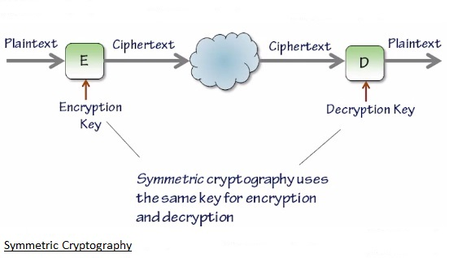
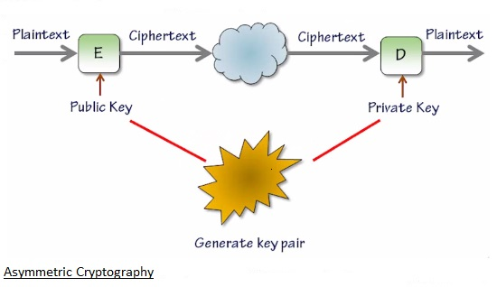
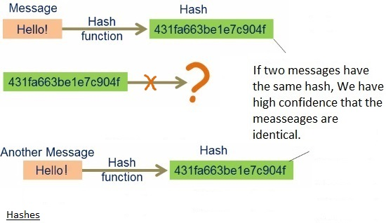
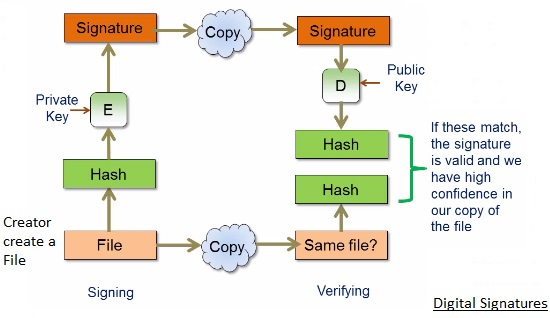
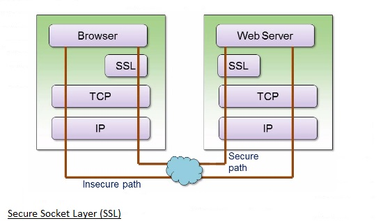
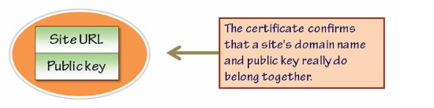
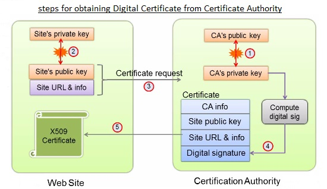
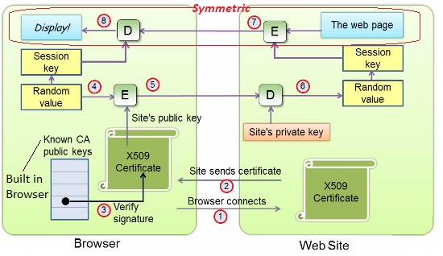

# 208.2. Apache configuration for HTTPS

## **208.2 Apache configuration for HTTPS**

#### **Weight**: 3

**Description:** Candidates should be able to configure a web server to provide HTTPS.

**Key Knowledge Areas:**

* SSL configuration files, tools and utilities
* Generate a server private key and CSR for a commercial CA
* Generate a self-signed Certificate
* Install the key and certificate, including intermediate CAs
* Configure Virtual Hosting using SNI
* Awareness of the issues with Virtual Hosting and use of SSL
* Security issues in SSL use, disable insecure protocols and ciphers

**Terms and Utilities:**

* Apache2 configuration files
* /etc/ssl/, /etc/pki/
* openssl, CA.pl
* SSLEngine, SSLCertificateKeyFile, SSLCertificateFile
* SSLCACertificateFile, SSLCACertificatePath
* SSLProtocol, SSLCipherSuite, ServerTokens, ServerSignature, TraceEnable

This lesson is almost theory, first lets review some concepts and then we will see how secure an apache web server using them.

### Encryption and Decryption



Plaintext can be every thing a message, a file, a document , ... . Then it is encrypted using and Encryption Key and we would have Ciphertext. After transfer it would be Decrypted using Decryption Key \(the same same key for Encryption\) and as a result we would have the original plain text. The simplest for of Encryption\( as above\) use the same key for Encryption and Decryption is known as Symmetric Encryption. But the security is tied up to the security of the key, if some one get access to the key the whole afforts would be useless !

A Symmetric Encryption uses a public and private key pairs. Data Encrypted with either key can be Decrypted with the other.



usually one of the keys is made public and the other one is held private and typically stored in a file, and it is self encrypted with a passphrase which is need to be supplied if the private key is to be used.

## Hashes

A hash is a one-way transformation.

* Variable lenght input , fixed lenght output.
* Can not "Reverse Enginner" the hash back to the orginal message.



### Digital Signatures

Combining Public and private key with hashes create Digital Signatures. These Digital Signatures giva us high confidence that the file we have recived really have come from the person we think come from, and has n't been modifiend either by accident or maliciously, since it was signed.



One thing to notice about all of this, is we are asuming here, that the publickey we have obtained really is the public key of the creator who originate the document whith signature we trying to check.

### The Secure Socket Layer \(SSL\)

Digital Signatures are used in Secure Sockets Layer, which is a Layer in protocol stack, it seats above the transfor Layer, and it verifies the server identity and negotiates asymmetric session key that will be used to encrypt all the traffic between the browser and the server.



In this diagram the browser and the server first communicate trough the regular TCP/IP protocol stack and that communication is not encrypetd\(Insecure path\).

SSL is a Layer above the transport Layer at the both client and server end and the hand shake is preformed when the SSL connection is made, it verifies the server identity and negotiate the asymmatric session key that gives us a secure path between the browser and the server

SSL relies on the use of Digital Certificates. And basically a Digital Certificates is a collection of information identifying a site, signed by some trusted tird party certification authority. Digital certificates contain:

* The issuer'd identity Certification Authority \(CA\)
* The site's domain name and public key 
* expiry date
* The signature of the CA



### So a web site needs to obtain digital certificate inroder to be able to offer secure service.

### How SSL works with Apache ?

In The linux world all of these functionalities are done by using a couple of packages.

## Open SSL

Open SSL is an open-source toolkit containing command-line tools and libraries that support a wide range of cryptographic operations related to ssl.

The openssl command can be used for:

* Creation and management of public and private keys
* Creation of X509 certificates and certificate request
* Calculation of message digests \(hashes\)
* Encryption and decryption

## The mod\_ssl Module


The mod\_ssl module provides SSL support for Apache.

package include:

1. The module itself \(mod\_ssl.so\)
2. A config file added to /etc/httpd/conf.d

#### Apache Directives for SSL

The mod\_ssl module supports serveral SSL-specific directives:

| Directive | Meaning |
| :--- | :--- |
| SSLCertificateFile | The name of the file containing the site's digital certificate |
| SSLCertificateKeyFile | The name of the file containing the site's private key |
| SSLCipherSuite | Specifies the ciphers \(encryption algorithms\) that the browser may use |
| SSLEngine \(on/off\) | Enable or Disable SSL \(usually within VirtualHost\) |
| SSLRequire | Supports access control based on multiple server variables, time of day, ... |

Okey enough theory, Lets Demonstrate how to make our web site secure using SSL connection. For that we could either generate private key and then create a certificate signing request \(.csr\) from that and then send it to a real CA to sign it\(which is impossible to demostrate here\), or as we would do we will create a self signed certificate and then configure apache to use that.

We will use Cent OS in this example because in ubuntu sort of setting are done. Lets quicky install apache and setup example.com:

```text
###Lets install and start apache service
Complete!
[root@localhost ~]# systemctl start httpd
[root@localhost ~]# lsof -i | grep httpd
httpd     3078   root    4u  IPv6  36013      0t0  TCP *:http (LISTEN)
httpd     3082 apache    4u  IPv6  36013      0t0  TCP *:http (LISTEN)
httpd     3083 apache    4u  IPv6  36013      0t0  TCP *:http (LISTEN)
httpd     3084 apache    4u  IPv6  36013      0t0  TCP *:http (LISTEN)
httpd     3085 apache    4u  IPv6  36013      0t0  TCP *:http (LISTEN)
httpd     3086 apache    4u  IPv6  36013      0t0  TCP *:http (LISTEN)

###lets make index.html for example.com
[root@localhost ~]# cd /var/www/html
[root@localhost html]# vim index.html
[root@localhost html]# cat index.html 
<!DOCTYPE html>
<html>
<body>

<h1>This is example.com</h1>

</body>
</html>

### cheating DNS by configuring hosts file
[root@localhost html]# cat /etc/hosts
127.0.0.1   localhost localhost.localdomain localhost4 localhost4.localdomain4
::1         localhost localhost.localdomain localhost6 localhost6.localdomain6
192.168.10.132 example.com
[root@localhost html]# ping example.com -c 2
PING example.com (192.168.10.132) 56(84) bytes of data.
64 bytes from example.com (192.168.10.132): icmp_seq=1 ttl=64 time=0.043 ms
64 bytes from example.com (192.168.10.132): icmp_seq=2 ttl=64 time=0.094 ms

--- example.com ping statistics ---
2 packets transmitted, 2 received, 0% packet loss, time 1001ms
rtt min/avg/max/mdev = 0.043/0.068/0.094/0.026 ms

### Lets correct the server name in httpd.conf file
[root@localhost ~]# vim /etc/httpd/conf/httpd.conf
[root@localhost ~]# cat /etc/httpd/conf/httpd.conf | grep -i servername
# ServerName gives the name and port that the server uses to identify itself.
ServerName www.example.com:80

### check it on port 80:
[root@localhost conf]# elinks http://example.com

                                This is example.com
```

Okey lets start with generating self signed certificates:

```text
[root@localhost ~]# mkdir /etc/httpd/ssl
[root@localhost ~]# openssl req -x509 -nodes -days 365 \
> -newkey rsa:2048 -keyout /etc/httpd/ssl/example.key \
> -out /etc/httpd/ssl/example.crt
Generating a 2048 bit RSA private key
........+++
......................+++
writing new private key to '/etc/httpd/ssl/example.key'
-----
You are about to be asked to enter information that will be incorporated
into your certificate request.
What you are about to enter is what is called a Distinguished Name or a DN.
There are quite a few fields but you can leave some blank
For some fields there will be a default value,
If you enter '.', the field will be left blank.
-----
Country Name (2 letter code) [XX]:us
State or Province Name (full name) []:
Locality Name (eg, city) [Default City]:NY
Organization Name (eg, company) [Default Company Ltd]:The example company
Organizational Unit Name (eg, section) []:
Common Name (eg, your name or your server's hostname) []:example.com
Email Address []:nowhere@example.com
```

-nodes option means that we are not going to encrypt private key, -days 365 define expiry date. rsa stands for tha asymmetric algorithem that we are used here. And now the certificate and the key should be created:

```text
[root@localhost ~]# cd /etc/httpd/ssl/
[root@localhost ssl]# ls -l
total 8
-rw-r--r--. 1 root root 1350 May 15 04:04 example.crt
-rw-r--r--. 1 root root 1704 May 15 04:04 example.key
[root@localhost ssl]# openssl x509 -in example.crt -text 
Certificate:
    Data:
        Version: 3 (0x2)
        Serial Number:
            d1:83:ae:d3:2e:d5:d3:f8
    Signature Algorithm: sha256WithRSAEncryption
        Issuer: C=us, L=NY, O=The example company, CN=example.com/emailAddress=nowhere@example.com
        Validity
            Not Before: May 15 08:04:14 2018 GMT
            Not After : May 15 08:04:14 2019 GMT
        Subject: C=us, L=NY, O=The example company, CN=example.com/emailAddress=nowhere@example.com
        Subject Public Key Info:
            Public Key Algorithm: rsaEncryption
                Public-Key: (2048 bit)
                Modulus:
                    00:a4:eb:94:5d:68:f1:1e:29:3e:00:72:63:61:8d:
                    77:d8:dd:7b:2b:4c:03:0a:3e:d1:a7:9b:aa:c2:d8:
                    20:82:64:dd:81:20:72:f6:29:4b:df:b2:f6:37:40:
                    82:42:fe:3d:3b:b9:06:3e:14:95:56:12:28:88:4f:
                    23:d7:1e:c0:22:54:1c:46:73:dd:e8:36:f5:8a:9e:
                    32:f6:7b:24:6b:ea:7e:77:03:c4:94:b2:0f:07:23:
                    00:7a:c8:d5:48:f7:e0:9a:4a:fc:05:41:00:e2:fd:
                    46:fa:09:0d:ec:e5:57:79:9f:be:73:5f:41:c4:da:
                    16:ef:f8:11:e8:e8:05:e0:e0:21:d2:16:e5:db:54:
                    56:60:c8:86:37:84:4f:56:3b:3d:6c:96:cd:2f:c2:
                    e3:23:18:d8:0b:3e:da:8e:7c:1a:ad:14:4f:1d:1e:
                    e7:f2:15:7d:2a:72:fe:e4:ec:15:d2:6a:ff:c4:60:
                    60:0f:49:04:98:4d:23:41:19:a0:7d:db:3c:d2:17:
                    7a:fb:4e:83:0f:cd:87:99:2f:4b:c4:bb:6c:c9:09:
                    e5:74:3e:c1:0f:96:a8:e2:13:14:2e:29:21:04:3a:
                    2a:d0:10:9d:5e:a1:30:b1:2e:25:83:17:48:7d:e9:
                    1e:ef:be:87:13:87:16:a5:c9:29:18:3d:ca:ce:e5:
                    44:91
                Exponent: 65537 (0x10001)
        X509v3 extensions:
            X509v3 Subject Key Identifier: 
                83:C6:F7:3A:4D:5F:96:F8:72:C9:66:14:D0:86:6A:AD:9F:9B:8A:1F
            X509v3 Authority Key Identifier: 
                keyid:83:C6:F7:3A:4D:5F:96:F8:72:C9:66:14:D0:86:6A:AD:9F:9B:8A:1F

            X509v3 Basic Constraints: 
                CA:TRUE
    Signature Algorithm: sha256WithRSAEncryption
         9e:dd:87:b9:d9:23:ea:23:f8:18:8c:9a:2d:97:d6:17:0a:04:
         c3:2b:84:0b:86:65:c0:24:37:f7:47:80:a0:69:e7:bc:a2:3e:
         5e:64:4b:0b:03:96:9c:0a:6b:c6:22:49:be:4a:a0:25:e9:b5:
         57:f8:17:8b:2d:c8:1d:99:54:1c:34:67:60:a7:26:45:a2:42:
         a6:77:7c:d9:e2:95:d0:8d:9d:ff:28:c6:9e:e7:28:a7:0f:8b:
         78:df:bb:69:ae:9e:aa:72:68:87:01:83:f0:79:f4:46:d7:5f:
         87:7c:e4:29:91:e0:36:c8:60:f4:a3:6a:ef:22:de:25:42:64:
         75:00:3b:ce:5e:16:68:80:eb:2f:ea:c8:31:6a:ae:9f:43:a6:
         ad:83:dc:6c:88:73:e4:65:05:8d:98:e1:a3:e9:25:8d:4a:ac:
         e7:07:0b:15:62:7f:84:ae:92:e1:16:ed:c4:21:ff:05:6b:ca:
         95:3a:2f:9f:44:43:c0:08:98:3a:c3:20:7f:45:8a:dc:80:6b:
         2a:41:9a:3c:f8:c8:e5:20:84:59:0e:a4:6b:79:4a:b1:77:1b:
         e1:7f:c6:03:26:8f:d9:ff:42:ce:11:a5:1a:86:76:d0:8d:88:
         1f:12:3d:95:ec:60:e1:06:6d:ed:e4:9e:5f:26:9e:b0:49:01:
         53:e0:e3:dc
-----BEGIN CERTIFICATE-----
MIIDtzCCAp+gAwIBAgIJANGDrtMu1dP4MA0GCSqGSIb3DQEBCwUAMHIxCzAJBgNV
BAYTAnVzMQswCQYDVQQHDAJOWTEcMBoGA1UECgwTVGhlIGV4YW1wbGUgY29tcGFu
eTEUMBIGA1UEAwwLZXhhbXBsZS5jb20xIjAgBgkqhkiG9w0BCQEWE25vd2hlcmVA
ZXhhbXBsZS5jb20wHhcNMTgwNTE1MDgwNDE0WhcNMTkwNTE1MDgwNDE0WjByMQsw
CQYDVQQGEwJ1czELMAkGA1UEBwwCTlkxHDAaBgNVBAoME1RoZSBleGFtcGxlIGNv
bXBhbnkxFDASBgNVBAMMC2V4YW1wbGUuY29tMSIwIAYJKoZIhvcNAQkBFhNub3do
ZXJlQGV4YW1wbGUuY29tMIIBIjANBgkqhkiG9w0BAQEFAAOCAQ8AMIIBCgKCAQEA
pOuUXWjxHik+AHJjYY132N17K0wDCj7Rp5uqwtgggmTdgSBy9ilL37L2N0CCQv49
O7kGPhSVVhIoiE8j1x7AIlQcRnPd6Db1ip4y9nska+p+dwPElLIPByMAesjVSPfg
mkr8BUEA4v1G+gkN7OVXeZ++c19BxNoW7/gR6OgF4OAh0hbl21RWYMiGN4RPVjs9
bJbNL8LjIxjYCz7ajnwarRRPHR7n8hV9KnL+5OwV0mr/xGBgD0kEmE0jQRmgfds8
0hd6+06DD82HmS9LxLtsyQnldD7BD5ao4hMULikhBDoq0BCdXqEwsS4lgxdIfeke
776HE4cWpckpGD3KzuVEkQIDAQABo1AwTjAdBgNVHQ4EFgQUg8b3Ok1flvhyyWYU
0IZqrZ+bih8wHwYDVR0jBBgwFoAUg8b3Ok1flvhyyWYU0IZqrZ+bih8wDAYDVR0T
BAUwAwEB/zANBgkqhkiG9w0BAQsFAAOCAQEAnt2Hudkj6iP4GIyaLZfWFwoEwyuE
C4ZlwCQ390eAoGnnvKI+XmRLCwOWnAprxiJJvkqgJem1V/gXiy3IHZlUHDRnYKcm
RaJCpnd82eKV0I2d/yjGnucopw+LeN+7aa6eqnJohwGD8Hn0Rtdfh3zkKZHgNshg
9KNq7yLeJUJkdQA7zl4WaIDrL+rIMWqun0OmrYPcbIhz5GUFjZjho+kljUqs5wcL
FWJ/hK6S4RbtxCH/BWvKlTovn0RDwAiYOsMgf0WK3IBrKkGaPPjI5SCEWQ6ka3lK
sXcb4X/GAyaP2f9CzhGlGoZ20I2IHxI9lexg4QZt7eSeXyaesEkBU+Dj3A==
-----END CERTIFICATE-----
```

Now we install apache module mod\_ssl:

```text
[root@localhost ssl]# yum install mod_ssl
......
....
..
Installed:
  mod_ssl.x86_64 1:2.4.6-80.el7.centos                                                 

Complete!

[root@localhost ssl]# rpm -ql mod_ssl
/etc/httpd/conf.d/ssl.conf
/etc/httpd/conf.modules.d/00-ssl.conf
/usr/lib64/httpd/modules/mod_ssl.so
/usr/libexec/httpd-ssl-pass-dialog
/var/cache/httpd/ssl
```

Now lets go and see mod\_ssl main configuration file:

```text
[root@localhost ssl]#  cd /etc/httpd/conf.d/
[root@localhost conf.d]# cat ssl.conf 
#
# When we also provide SSL we have to listen to the 
# the HTTPS port in addition.
#
Listen 443 https

##
##  SSL Global Context
##
##  All SSL configuration in this context applies both to
##  the main server and all SSL-enabled virtual hosts.
##

#   Pass Phrase Dialog:
#   Configure the pass phrase gathering process.
#   The filtering dialog program (`builtin' is a internal
#   terminal dialog) has to provide the pass phrase on stdout.
SSLPassPhraseDialog exec:/usr/libexec/httpd-ssl-pass-dialog

#   Inter-Process Session Cache:
#   Configure the SSL Session Cache: First the mechanism 
#   to use and second the expiring timeout (in seconds).
SSLSessionCache         shmcb:/run/httpd/sslcache(512000)
SSLSessionCacheTimeout  300

#   Pseudo Random Number Generator (PRNG):
#   Configure one or more sources to seed the PRNG of the 
#   SSL library. The seed data should be of good random quality.
#   WARNING! On some platforms /dev/random blocks if not enough entropy
#   is available. This means you then cannot use the /dev/random device
#   because it would lead to very long connection times (as long as
#   it requires to make more entropy available). But usually those
#   platforms additionally provide a /dev/urandom device which doesn't
#   block. So, if available, use this one instead. Read the mod_ssl User
#   Manual for more details.
SSLRandomSeed startup file:/dev/urandom  256
SSLRandomSeed connect builtin
#SSLRandomSeed startup file:/dev/random  512
#SSLRandomSeed connect file:/dev/random  512
#SSLRandomSeed connect file:/dev/urandom 512

#
# Use "SSLCryptoDevice" to enable any supported hardware
# accelerators. Use "openssl engine -v" to list supported
# engine names.  NOTE: If you enable an accelerator and the
# server does not start, consult the error logs and ensure
# your accelerator is functioning properly. 
#
SSLCryptoDevice builtin
#SSLCryptoDevice ubsec

##
## SSL Virtual Host Context
##

<VirtualHost _default_:443>

# General setup for the virtual host, inherited from global configuration
#DocumentRoot "/var/www/html"
#ServerName www.example.com:443

# Use separate log files for the SSL virtual host; note that LogLevel
# is not inherited from httpd.conf.
ErrorLog logs/ssl_error_log
TransferLog logs/ssl_access_log
LogLevel warn

#   SSL Engine Switch:
#   Enable/Disable SSL for this virtual host.
SSLEngine on

#   SSL Protocol support:
# List the enable protocol levels with which clients will be able to
# connect.  Disable SSLv2 access by default:
SSLProtocol all -SSLv2 -SSLv3

#   SSL Cipher Suite:
#   List the ciphers that the client is permitted to negotiate.
#   See the mod_ssl documentation for a complete list.
SSLCipherSuite HIGH:3DES:!aNULL:!MD5:!SEED:!IDEA

#   Speed-optimized SSL Cipher configuration:
#   If speed is your main concern (on busy HTTPS servers e.g.),
#   you might want to force clients to specific, performance
#   optimized ciphers. In this case, prepend those ciphers
#   to the SSLCipherSuite list, and enable SSLHonorCipherOrder.
#   Caveat: by giving precedence to RC4-SHA and AES128-SHA
#   (as in the example below), most connections will no longer
#   have perfect forward secrecy - if the server's key is
#   compromised, captures of past or future traffic must be
#   considered compromised, too.
#SSLCipherSuite RC4-SHA:AES128-SHA:HIGH:MEDIUM:!aNULL:!MD5
#SSLHonorCipherOrder on 

#   Server Certificate:
# Point SSLCertificateFile at a PEM encoded certificate.  If
# the certificate is encrypted, then you will be prompted for a
# pass phrase.  Note that a kill -HUP will prompt again.  A new
# certificate can be generated using the genkey(1) command.
SSLCertificateFile /etc/pki/tls/certs/localhost.crt

#   Server Private Key:
#   If the key is not combined with the certificate, use this
#   directive to point at the key file.  Keep in mind that if
#   you've both a RSA and a DSA private key you can configure
#   both in parallel (to also allow the use of DSA ciphers, etc.)
SSLCertificateKeyFile /etc/pki/tls/private/localhost.key

#   Server Certificate Chain:
#   Point SSLCertificateChainFile at a file containing the
#   concatenation of PEM encoded CA certificates which form the
#   certificate chain for the server certificate. Alternatively
#   the referenced file can be the same as SSLCertificateFile
#   when the CA certificates are directly appended to the server
#   certificate for convinience.
#SSLCertificateChainFile /etc/pki/tls/certs/server-chain.crt

#   Certificate Authority (CA):
#   Set the CA certificate verification path where to find CA
#   certificates for client authentication or alternatively one
#   huge file containing all of them (file must be PEM encoded)
#SSLCACertificateFile /etc/pki/tls/certs/ca-bundle.crt

#   Client Authentication (Type):
#   Client certificate verification type and depth.  Types are
#   none, optional, require and optional_no_ca.  Depth is a
#   number which specifies how deeply to verify the certificate
#   issuer chain before deciding the certificate is not valid.
#SSLVerifyClient require
#SSLVerifyDepth  10

#   Access Control:
#   With SSLRequire you can do per-directory access control based
#   on arbitrary complex boolean expressions containing server
#   variable checks and other lookup directives.  The syntax is a
#   mixture between C and Perl.  See the mod_ssl documentation
#   for more details.
#<Location />
#SSLRequire (    %{SSL_CIPHER} !~ m/^(EXP|NULL)/ \
#            and %{SSL_CLIENT_S_DN_O} eq "Snake Oil, Ltd." \
#            and %{SSL_CLIENT_S_DN_OU} in {"Staff", "CA", "Dev"} \
#            and %{TIME_WDAY} >= 1 and %{TIME_WDAY} <= 5 \
#            and %{TIME_HOUR} >= 8 and %{TIME_HOUR} <= 20       ) \
#           or %{REMOTE_ADDR} =~ m/^192\.76\.162\.[0-9]+$/
#</Location>

#   SSL Engine Options:
#   Set various options for the SSL engine.
#   o FakeBasicAuth:
#     Translate the client X.509 into a Basic Authorisation.  This means that
#     the standard Auth/DBMAuth methods can be used for access control.  The
#     user name is the `one line' version of the client's X.509 certificate.
#     Note that no password is obtained from the user. Every entry in the user
#     file needs this password: `xxj31ZMTZzkVA'.
#   o ExportCertData:
#     This exports two additional environment variables: SSL_CLIENT_CERT and
#     SSL_SERVER_CERT. These contain the PEM-encoded certificates of the
#     server (always existing) and the client (only existing when client
#     authentication is used). This can be used to import the certificates
#     into CGI scripts.
#   o StdEnvVars:
#     This exports the standard SSL/TLS related `SSL_*' environment variables.
#     Per default this exportation is switched off for performance reasons,
#     because the extraction step is an expensive operation and is usually
#     useless for serving static content. So one usually enables the
#     exportation for CGI and SSI requests only.
#   o StrictRequire:
#     This denies access when "SSLRequireSSL" or "SSLRequire" applied even
#     under a "Satisfy any" situation, i.e. when it applies access is denied
#     and no other module can change it.
#   o OptRenegotiate:
#     This enables optimized SSL connection renegotiation handling when SSL
#     directives are used in per-directory context. 
#SSLOptions +FakeBasicAuth +ExportCertData +StrictRequire
<Files ~ "\.(cgi|shtml|phtml|php3?)$">
    SSLOptions +StdEnvVars
</Files>
<Directory "/var/www/cgi-bin">
    SSLOptions +StdEnvVars
</Directory>

#   SSL Protocol Adjustments:
#   The safe and default but still SSL/TLS standard compliant shutdown
#   approach is that mod_ssl sends the close notify alert but doesn't wait for
#   the close notify alert from client. When you need a different shutdown
#   approach you can use one of the following variables:
#   o ssl-unclean-shutdown:
#     This forces an unclean shutdown when the connection is closed, i.e. no
#     SSL close notify alert is send or allowed to received.  This violates
#     the SSL/TLS standard but is needed for some brain-dead browsers. Use
#     this when you receive I/O errors because of the standard approach where
#     mod_ssl sends the close notify alert.
#   o ssl-accurate-shutdown:
#     This forces an accurate shutdown when the connection is closed, i.e. a
#     SSL close notify alert is send and mod_ssl waits for the close notify
#     alert of the client. This is 100% SSL/TLS standard compliant, but in
#     practice often causes hanging connections with brain-dead browsers. Use
#     this only for browsers where you know that their SSL implementation
#     works correctly. 
#   Notice: Most problems of broken clients are also related to the HTTP
#   keep-alive facility, so you usually additionally want to disable
#   keep-alive for those clients, too. Use variable "nokeepalive" for this.
#   Similarly, one has to force some clients to use HTTP/1.0 to workaround
#   their broken HTTP/1.1 implementation. Use variables "downgrade-1.0" and
#   "force-response-1.0" for this.
BrowserMatch "MSIE [2-5]" \
         nokeepalive ssl-unclean-shutdown \
         downgrade-1.0 force-response-1.0

#   Per-Server Logging:
#   The home of a custom SSL log file. Use this when you want a
#   compact non-error SSL logfile on a virtual host basis.
CustomLog logs/ssl_request_log \
          "%t %h %{SSL_PROTOCOL}x %{SSL_CIPHER}x \"%r\" %b"

</VirtualHost>            
```

Bellow the SSL Virtual Host Content we edit our Name Virtual Host Directive :

```text
##
## SSL Virtual Host Context
##

NameVirtualHost *:443

<VirtualHost _default_:443>

# General setup for the virtual host, inherited from global configuration
DocumentRoot "/var/www/html"
ServerName www.example.com:443
```

Now lets tell apache where the Certificate File and key are :

```text
#   Server Certificate:
# Point SSLCertificateFile at a PEM encoded certificate.  If
# the certificate is encrypted, then you will be prompted for a
# pass phrase.  Note that a kill -HUP will prompt again.  A new
# certificate can be generated using the genkey(1) command.
SSLCertificateFile /etc/httpd/ssl/example.crt

#   Server Private Key:
#   If the key is not combined with the certificate, use this
#   directive to point at the key file.  Keep in mind that if
#   you've both a RSA and a DSA private key you can configure
#   both in parallel (to also allow the use of DSA ciphers, etc.)
SSLCertificateKeyFile /etc/httpd/ssl/example.key
```

Now every thing seems fine Lets checks the configuration for syntax errors :

```text
[root@localhost ~]# httpd -V
AH00548: NameVirtualHost has no effect and will be removed in the next release /etc/httpd/conf.d/ssl.conf:56
AH00526: Syntax error on line 96 of /etc/httpd/conf.d/ssl.conf:
Invalid command 'i', perhaps misspelled or defined by a module not included in the server configuration
```

ops we got an error lets fix it and restrat the service:

```text
[root@localhost ~]# vim /etc/httpd/conf.d/ssl.conf 
[root@localhost ~]# httpd -V
AH00548: NameVirtualHost has no effect and will be removed in the next release /etc/httpd/conf.d/ssl.conf:56
Server version: Apache/2.4.6 (CentOS)
Server built:   Apr 20 2018 18:10:38
Server's Module Magic Number: 20120211:24
Server loaded:  APR 1.4.8, APR-UTIL 1.5.2
Compiled using: APR 1.4.8, APR-UTIL 1.5.2
Architecture:   64-bit
Server MPM:     prefork
  threaded:     no
    forked:     yes (variable process count)
Server compiled with....
 -D APR_HAS_SENDFILE
 -D APR_HAS_MMAP
 -D APR_HAVE_IPV6 (IPv4-mapped addresses enabled)
 -D APR_USE_SYSVSEM_SERIALIZE
 -D APR_USE_PTHREAD_SERIALIZE
 -D SINGLE_LISTEN_UNSERIALIZED_ACCEPT
 -D APR_HAS_OTHER_CHILD
 -D AP_HAVE_RELIABLE_PIPED_LOGS
 -D DYNAMIC_MODULE_LIMIT=256
 -D HTTPD_ROOT="/etc/httpd"
 -D SUEXEC_BIN="/usr/sbin/suexec"
 -D DEFAULT_PIDLOG="/run/httpd/httpd.pid"
 -D DEFAULT_SCOREBOARD="logs/apache_runtime_status"
 -D DEFAULT_ERRORLOG="logs/error_log"
 -D AP_TYPES_CONFIG_FILE="conf/mime.types"
 -D SERVER_CONFIG_FILE="conf/httpd.conf"

 [root@localhost ~]# systemctl restart httpd
[root@localhost ~]# systemctl status httpd
● httpd.service - The Apache HTTP Server
   Loaded: loaded (/usr/lib/systemd/system/httpd.service; disabled; vendor preset: disabled)
   Active: active (running) since Tue 2018-05-15 04:53:21 EDT; 12s ago
     Docs: man:httpd(8)
           man:apachectl(8)
  Process: 39126 ExecStop=/bin/kill -WINCH ${MAINPID} (code=exited, status=0/SUCCESS)
 Main PID: 39136 (httpd)
   Status: "Total requests: 0; Current requests/sec: 0; Current traffic:   0 B/sec"
   CGroup: /system.slice/httpd.service
           ├─39136 /usr/sbin/httpd -DFOREGROUND
           ├─39137 /usr/sbin/httpd -DFOREGROUND
           ├─39138 /usr/sbin/httpd -DFOREGROUND
           ├─39139 /usr/sbin/httpd -DFOREGROUND
           ├─39140 /usr/sbin/httpd -DFOREGROUND
           └─39141 /usr/sbin/httpd -DFOREGROUND

May 15 04:53:21 localhost.localdomain systemd[1]: Starting The Apache HTTP Server...
May 15 04:53:21 localhost.localdomain httpd[39136]: AH00548: NameVirtualHost has no...6
May 15 04:53:21 localhost.localdomain systemd[1]: Started The Apache HTTP Server.
Hint: Some lines were ellipsized, use -l to show in full.
```

Finally check our web site in a secure manner:

```text
[root@localhost ~]# elinks https://example.com
```

There is an error about Certificate Validity and that is okey because we have used Self Signed Certificate.

## Issues with Virtual Hosting and use of SSL

Using name-based virtual hosts with SSL adds another layer of complication. Without the SNI extension, it's not generally possible

### What is The Problem ?

The problem with using named virtual hosts over SSL is that named virtual hosts rely on knowing what hostname is being requested, and the request can't be read until the SSL connection is established. The ordinary behavior, then, is that the SSL connection is set up using the configuration in the default virtual host for the address where the connection was received.

While Apache can renegotiate the SSL connection later after seeing the hostname in the request \(and does\), that's too late to pick the right server certificate to use to match the request hostname during the initial handshake, resulting in browser warnings/errors about certificates having the wrong hostname in them.

And while it's possible to put multiple hostnames in a modern certificate and just use that one certificate in the default vhost, there are many hosting providers who are hosting far too many sites on a single address for that to be practical for them.

### Server Name Indication \(SNI\)

The solution is an extension to the SSL protocol called Server Name Indication \(RFC 4366\), which allows the client to include the requested hostname in the first message of its SSL handshake \(connection setup\). This allows the server to determine the correct named virtual host for the request and set the connection up accordingly from the start.

With SNI, we can have many virtual hosts sharing the same IP address and port, and each one can have its own unique certificate \(and the rest of the configuration\).

That seems enough for LPIC2 exam.

