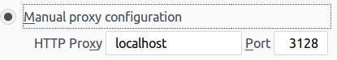
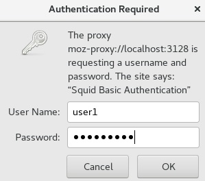

# 208.3. Implementing a proxy server

## **208.3 Implementing a proxy server**

**Weight:** 2

**Description:** Candidates should be able to install and configure a proxy server, including access policies, authentication and resource usage.

**Key Knowledge Areas:**

* Squid 3.x configuration files, terms and utilities
* Access restriction methods
* Client user authentication methods
* Layout and content of ACL in the Squid configuration files

**Terms and Utilities:**

* squid.conf
* acl
* http\_access

In this light weight lesson we talk about squid proxy server. Squid has a giant configuration file and covering all aspect of that needs spending more time, but for this course we just discuss about items which are important for LPIC2 exam.

## What is a proxy server?

A proxy server is a computer that acts as an intermediary between a desktop computer and the internet and allows a client machine to make an indirect connection to network servers and services. There are many reasons why we might want to include a proxy server on our network:

* To share internet connection on a LAN
* To speed up internet surfing
* To hide the IP address of the client computer for anonymous surfing
* To implement internet access control
* To scan outbound content
* To circumvent regional restrictions

Clearly some of the above reasons are perfectly fitting for a business and some others do not.Regardless, knowing how to install and configure a proxy server is a must-have skill for a network administrator.

## What is squid ?

**Squid** is a free and open-source full featured web proxy cache server released under GPL 3, which can be used in many other ways like a web server caching daemon to speed up websites loading, cache DNS lookups, filter the traffic and many other network protocols, right now, Squid server supports HTTP and FTP protocols, there is a limited support to other protocols like TLS and SSL, it was first released in 1996.


### Installing Squid

Lets install squid on CentOS7 and see what does really look like:

```text
[root@centos7-2 ~]# yum install squid

[root@centos7-2 ~]# rpm -ql squid | grep etc
/etc/NetworkManager/dispatcher.d/20-squid
/etc/httpd/conf.d/squid.conf
/etc/logrotate.d/squid
/etc/pam.d/squid
/etc/squid
/etc/squid/cachemgr.conf
/etc/squid/cachemgr.conf.default
/etc/squid/errorpage.css
/etc/squid/errorpage.css.default
/etc/squid/mime.conf
/etc/squid/mime.conf.default
/etc/squid/squid.conf
/etc/squid/squid.conf.default
/etc/sysconfig/squid
```

The current version of squid server is version 3 , so based on our distribution we might need to mention that or version 3 will be automatically installed.

### /etc/squid/squid.conf

The default configuration file for squid is located under /etc/squid3/squid.conf or /etc/squid/squid.conf.

```text
[root@centos7-2 ~]# cd /etc/squid/
[root@centos7-2 squid]# ls -l
total 48
-rw-r--r--. 1 root squid   692 Apr 10  2018 cachemgr.conf
-rw-r--r--. 1 root root    692 Apr 10  2018 cachemgr.conf.default
-rw-r--r--. 1 root root   1817 Apr 10  2018 errorpage.css
-rw-r--r--. 1 root root   1817 Apr 10  2018 errorpage.css.default
-rw-r--r--. 1 root root  12077 Apr 10  2018 mime.conf
-rw-r--r--. 1 root root  12077 Apr 10  2018 mime.conf.default
-rw-r-----. 1 root squid  2315 Apr 10  2018 squid.conf
-rw-r--r--. 1 root root   2315 Apr 10  2018 squid.conf.default
```

This file contains some configuration directives that needs to be configured to affect the behavior of the Squid.

```text
[root@centos7-2 squid]# cat squid.conf
#
# Recommended minimum configuration:
#

# Example rule allowing access from your local networks.
# Adapt to list your (internal) IP networks from where browsing
# should be allowed
acl localnet src 10.0.0.0/8    # RFC1918 possible internal network
acl localnet src 172.16.0.0/12    # RFC1918 possible internal network
acl localnet src 192.168.0.0/16    # RFC1918 possible internal network
acl localnet src fc00::/7       # RFC 4193 local private network range
acl localnet src fe80::/10      # RFC 4291 link-local (directly plugged) machines

acl SSL_ports port 443
acl Safe_ports port 80        # http
acl Safe_ports port 21        # ftp
acl Safe_ports port 443        # https
acl Safe_ports port 70        # gopher
acl Safe_ports port 210        # wais
acl Safe_ports port 1025-65535    # unregistered ports
acl Safe_ports port 280        # http-mgmt
acl Safe_ports port 488        # gss-http
acl Safe_ports port 591        # filemaker
acl Safe_ports port 777        # multiling http
acl CONNECT method CONNECT

#
# Recommended minimum Access Permission configuration:
#
# Deny requests to certain unsafe ports
http_access deny !Safe_ports

# Deny CONNECT to other than secure SSL ports
http_access deny CONNECT !SSL_ports

# Only allow cachemgr access from localhost
http_access allow localhost manager
http_access deny manager

# We strongly recommend the following be uncommented to protect innocent
# web applications running on the proxy server who think the only
# one who can access services on "localhost" is a local user
#http_access deny to_localhost

#
# INSERT YOUR OWN RULE(S) HERE TO ALLOW ACCESS FROM YOUR CLIENTS
#

# Example rule allowing access from your local networks.
# Adapt localnet in the ACL section to list your (internal) IP networks
# from where browsing should be allowed
http_access allow localnet
http_access allow localhost

# And finally deny all other access to this proxy
http_access deny all

# Squid normally listens to port 3128
http_port 3128

# Uncomment and adjust the following to add a disk cache directory.
#cache_dir ufs /var/spool/squid 100 16 256

# Leave coredumps in the first cache dir
coredump_dir /var/spool/squid

#
# Add any of your own refresh_pattern entries above these.
#
refresh_pattern ^ftp:        1440    20%    10080
refresh_pattern ^gopher:    1440    0%    1440
refresh_pattern -i (/cgi-bin/|\?) 0    0%    0
refresh_pattern .        0    20%    4320
```

The file in Ubuntu is so huge cause of its rich documents.Lets take a look at important ones:

**port \[mode\] \[options\]**

This is the default port for the HTTP proxy server, by default it is 3128

**cache\_mem \[bytes\]**

Defines the amount of memory Squid can use for cache. The default is 256 MB and it is commented out. This does not specify the memory usage of Squid and may be exceeded.

**maximum\_object\_size\_in\_memory \[bytes\]**

Objects greater than this size will not be attempted to kept in the memory cache. This should be set high enough to keep objects accessed frequently in memory to improve performance whilst low enough to keep larger objects from hoarding cache\_mem. And the default size is 512 KB.

**cache\_dir aufs Directory-Name Mbytes L1 L2 \[options\]**

The entry cache\_dir defines the directory where all the objects are stored on disk. The numbers at the end indicate the maximum disk space in MB to use and the number of directories in the first and second level. "ufs" is the old well-known Squid storage format that has always been there. By default disk caching is not turned on and we can enable it by commenting it out.

`cache_dir ufs /var/cache/squid/ 100 16 256` : The default is 100 MB occupied disk space in the /var/cache/squid directory and creation of 16 subdirectories inside it, each containing 256 more subdirectories.

**maximum\_object\_size \[bytes\]**

Set the default value for max-size parameter on any cache\_dir. The value is specified in bytes, and the default is 4 MB.

And after doing some configurations \(as en example here we have turned on disk cache\) we need to restart squid service :

```text
[root@centos7-2 ~]# systemctl status squid.service 
● squid.service - Squid caching proxy
   Loaded: loaded (/usr/lib/systemd/system/squid.service; disabled; vendor preset: disabled)
   Active: inactive (dead)
[root@centos7-2 ~]# systemctl start squid.service 
[root@centos7-2 ~]# systemctl status squid.service 
● squid.service - Squid caching proxy
   Loaded: loaded (/usr/lib/systemd/system/squid.service; disabled; vendor preset: disabled)
   Active: active (running) since Wed 2018-10-10 11:49:42 EDT; 10s ago
  Process: 35580 ExecStart=/usr/sbin/squid $SQUID_OPTS -f $SQUID_CONF (code=exited, status=0/SUCCESS)
  Process: 35571 ExecStartPre=/usr/libexec/squid/cache_swap.sh (code=exited, status=0/SUCCESS)
 Main PID: 35582 (squid)
   CGroup: /system.slice/squid.service
           ├─35582 /usr/sbin/squid -f /etc/squid/squid.conf
           ├─35584 (squid-1) -f /etc/squid/squid.conf
           └─35588 (logfile-daemon) /var/log/squid/access.log

Oct 10 11:49:42 centos7-2 systemd[1]: Starting Squid caching proxy...
Oct 10 11:49:42 centos7-2 squid[35582]: Squid Parent: will start 1 kids
Oct 10 11:49:42 centos7-2 squid[35582]: Squid Parent: (squid-1) process 35584 started
Oct 10 11:49:42 centos7-2 systemd[1]: Started Squid caching proxy.

[root@centos7-2 ~]# telnet localhost 3128
Trying ::1...
Connected to localhost.
Escape character is '^]'.
helo
........
```

And as a next step we need to configure our browser to goes trough proxy server \(we use the same computer for our demonstration\):



And if you like browsing in terminal with programs like lynx:

```text
[root@centos7-2 squid]# export http_proxy=http://192.168.52.135:3128
```

Well, for testing purpose we need to show the speed of web surfing in our browser which is not possible here. Do not forget that each web browser has a local cache and try to clear that before reloading a page again and again.

## **ACLs**\(**Access Control Lists**\)

ACLs allow us to restrict the access to websites, and / or monitor the access on a per user basis. We can restrict access based on day of week or time of day, or domain, for example.

The access control scheme of the Squid web proxy server consists of two different components:

1-The ACL elements are directive lines that begin with the word “acl” and represent types of data that are performed against any request transaction.

**acl aclname acltype argument ...**

```text
acl SSL_ports port 443
acl Safe_ports port 80          # http
acl Safe_ports port 21          # ftp
acl Safe_ports port 443         # https
acl Safe_ports port 70          # gopher
acl Safe_ports port 210         # wais
acl Safe_ports port 1025-65535  # unregistered ports
acl Safe_ports port 280         # http-mgmt
acl Safe_ports port 488         # gss-http
acl Safe_ports port 591         # filemaker
acl Safe_ports port 777         # multiling http
```

The lines above for squid.conf represent a basic example of the usage of ACL elements.

The first word, acl, indicates that this is a ACL element directive line.

The second word, localhost or Safe\_ports, specify a name for the directive.

The third word, port in this case, is an ACL element type that is used to represent a TCP port. It can be a client IP address or range of addresses. Also it is possible to use hostname, if we have some sort of DNS resolution implemented.

```text
***** Different ACL Elements  *****

src: source (client) IP addresses
dst: destination (server) IP addresses
myip: the local IP address of a client's connection
arp: Ethernet (MAC) address matchingsrcdomain: source (client) domain name
dstdomain: destination (server) domain name
srcdom_regex: source (client) regular expression pattern matching
dstdom_regex: destination (server) regular expression pattern matching
src_as: source (client) Autonomous System numberdst_as: destination (server) Autonomous System number
peername: name tag assigned to the cache_peer where request is expected to be sent.
time: time of day, and day of week
url_regex: URL regular expression pattern matching
urlpath_regex: URL-path regular expression pattern matching, leaves out the protocol and hostname
port: destination (server) port number
myport: local port number that client connected tomyportname: name tag assigned to the squid listening port that client connected toproto: transfer protocol (http, ftp, etc)
method: HTTP request method (get, post, etc)
http_status: HTTP response status (200 302 404 etc.)
browser: regular expression pattern matching on the request user-agent header
referer_regex: regular expression pattern matching on the request http-referer header
ident: string matching on the user's name
ident_regex: regular expression pattern matching on the user's name
proxy_auth: user authentication via external processes
proxy_auth_regex: regular expression pattern matching on user authentication via external processes
snmp_community: SNMP community string matching
maxconn: a limit on the maximum number of connections from a single client IP address
max_user_ip: a limit on the maximum number of IP addresses one user can login from
req_mime_type: regular expression pattern matching on the request content-type header
req_header: regular expression pattern matching on a request header contentrep_mime_type: regular expression pattern matching on the reply (downloaded content) content-type header. This is only usable in the http_reply_access directive, not http_access.
rep_header: regular expression pattern matching on a reply header content. This is only usable in the http_reply_access directive, not http_access.
external: lookup via external acl helper defined by external_acl_typeuser_cert: match against attributes in a user SSL certificate
ca_cert: match against attributes a users issuing CA SSL certificate
ext_user: match on user= field returned by external acl helper defined by external_acl_type
ext_user_regex: regular expression pattern matching on user= field returned by external acl helper defined by external_acl_type
```

2-The access list rules consist of an allow or deny action followed by a number of ACL elements, and are used to indicate what action or limitation has to be enforced for a given request. There are a number of different access lists:

```text
***** Different ACL types *****
http_access: Allows HTTP clients (browsers) to access the HTTP port. This is the primary access control list.
http_reply_access: Allows HTTP clients (browsers) to receive the reply to their request. This further restricts permissions given by http_access, and is primarily intended to be used together with rep_mime_type acl for blocking different content types.
icp_access: Allows neighbor caches to query your cache with ICP.
miss_access: Allows certain clients to forward cache misses through your cache. This further restricts permissions given by http_access, and is primarily intended to be used for enforcing sibling relations by denying siblings from forwarding cache misses through your cache.
cache: Defines responses that should not be cached.
url_rewrite_access: Controls which requests are sent through the redirector pool.
ident_lookup_access: Controls which requests need an Ident lookup.
always_direct: Controls which requests should always be forwarded directly to origin servers.
never_direct: Controls which requests should never be forwarded directly to origin servers.
snmp_access: Controls SNMP client access to the cache.
broken_posts: Defines requests for which squid appends an extra CRLF after POST message bodies as required by some broken origin servers.
cache_peer_access: Controls which requests can be forwarded to a given neighbor (cache_peer).
htcp_access: Controls which remote machines are able to make HTCP requests.
htcp_clr_access: Controls which remote machines are able to make HTCP CLR requests.
request_header_access: Controls which request headers are removed when violating HTTP protocol.
reply_header_access: Controls which reply headers are removed from delivery to the client when violating HTTP protocol.
delay_access: Controls which requests are handled by what delay pool
icap_access: (replaced by adaptation_access in Squid-3.1) What requests may be sent to a particular ICAP server.
adaptation_access: What requests may be sent to a particular ICAP or eCAP filter service.
log_access: Controls which requests are logged. This is global and overrides specific file access lists appended to access_log directives.
```

Lets go back to squid.conf and fine some examples:

```text
# Deny requests to certain unsafe ports
http_access deny !Safe_ports
```

The two lines above are access list rules and represent an explicit implementation of the ACL directives mentioned earlier and it denies access to the localhost unsafe ports.

Notes:

1. An access list rule consists of an allow or deny keyword, followed by a list of ACL element names.
2. An access list consists of one or more access list rules.
3. Access list rules are checked in the order they are written. List searching terminates as soon as one of the rules is a match.
4. If a rule has multiple ACL elements, it uses AND logic. In other words, all ACL elements of the rule must be a match in order for the rule to be a match. This means that it is possible to write a rule that can never be matched. For example, a port number can never be equal to both 80 AND 8000 at the same time.
5. To summarize the ACL logics can be described as: \(note: AND/OR below is just for illustartion, not part of the syntax\)

```text
http_access allow|deny acl AND acl AND ...
        OR
http_access allow|deny acl AND acl AND ...
        OR
...
```

If none of the rules are matched, then the default action is the opposite of the last rule in the list. Its a good idea to be explicit with the default action. The best way is to use the all ACL \(Cache All\). For example:

```text
http_access deny all
```

So to have a big picture in mind of how squid works, it works like that :

For demonstration Lets create required ACL elements and ACL rules to avoid visiting yahoo web site on Fridays:

```text
acl YAHOO dstdomain .yahoo.com
acl FRIDAY time Friday
```

Do not forget to define acl rule before cache all:

```text
#
# INSERT YOUR OWN RULE(S) HERE TO ALLOW ACCESS FROM YOUR CLIENTS
#

http_access deny YAHOO FRIDAY

# Example rule allowing access from your local networks.
# Adapt localnet in the ACL section to list your (internal) IP networks
# from where browsing should be allowed
#http_access allow localnet
http_access allow localhost

# And finally deny all other access to this proxy
http_access deny all
```

and finally do not forget to restart thr service:

```text
[root@centos7-2 squid]# systemctl restart squid.service
```

## Squid Authentication

One another option of squid is adding user authentication . For that we need to use auth\_param ACL element.

### auth\_param

The auth\_param directive controls almost every aspect of Squid's external user authentication interface. Squid currently supports three authentication schemes: Basic, Digest, and NTLM. Basic authentication support is compiled by default \(For the others, you must use the enable-auth option with ./configure.\).

The auth\_param directive is very complex, what we are presenting here for LPIC2 exam is HTTP Basic authentication helper, and the syntax would be:

**auth\_param basic program command ...**

example:`auth_param basic program /opt/squid/ncsa /etc/squid/passwd`

So basic says what type of authentication we are going to use, so in browser it just pops up a window.

program defines what program is going to be used for Authentication, and the actual location of that program \(the location might be different in different distributions, be careful and check it\).

> ncsa is a very simple program which uses the same apache htpasswd type format.

some others are:

```text
=> NCSA: Uses an NCSA-style username and password file.
=> LDAP: Uses the Lightweight Directory Access Protocol
=> MSNT: Uses a Windows NT authentication domain.
=> PAM: Uses the Linux Pluggable Authentication Modules scheme.
=> SMB: Uses a SMB server like Windows NT or Samba.
=> getpwam: Uses the old-fashioned Unix password file.
=> SASL: Uses SALS libraries.
=> NTLM, Negotiate and Digest authentication
```

And the last argument for ncsa is where the user password file is stored.

Start implementing basic user authentication in squid and as first step locate nsa\_auth place in our distribution

\(In ubuntu use `dpkg -L squid | grep ncsa_auth` \) :

```text
[root@centos7-2 squid]# locate ncsa_auth
[root@centos7-2 squid]# rpm -ql squid | grep ncsa_auth
/usr/lib64/squid/basic_ncsa_auth
/usr/share/man/man8/basic_ncsa_auth.8.gz

[root@centos7-2 squid]# ls -l /usr/lib64/squid/ | grep auth
-rwxr-xr-x. 1 root root  5399 Apr 10  2018 basic_db_auth
-rwxr-xr-x. 1 root root 11360 Apr 10  2018 basic_getpwnam_auth
-rwxr-xr-x. 1 root root 23768 Apr 10  2018 basic_ldap_auth
-rwxr-xr-x. 1 root root  5502 Apr 10  2018 basic_msnt_multi_domain_auth
-rwxr-xr-x. 1 root root 24032 Apr 10  2018 basic_ncsa_auth
-rwxr-xr-x. 1 root root 15488 Apr 10  2018 basic_nis_auth
-rwxr-xr-x. 1 root root 19664 Apr 10  2018 basic_pam_auth
-rwxr-xr-x. 1 root root  2975 Apr 10  2018 basic_pop3_auth
-rwxr-xr-x. 1 root root 20048 Apr 10  2018 basic_radius_auth
-rwxr-xr-x. 1 root root 15456 Apr 10  2018 basic_sasl_auth
-rwxr-xr-x. 1 root root 15536 Apr 10  2018 basic_smb_auth
-rwxr-xr-x. 1 root root  2657 Apr 10  2018 basic_smb_auth.sh
-rwxr-xr-x. 1 root root 41512 Apr 10  2018 basic_smb_lm_auth
-rwxr-xr-x. 1 root root 32192 Apr 10  2018 digest_edirectory_auth
-rwxr-xr-x. 1 root root 24112 Apr 10  2018 digest_file_auth
-rwxr-xr-x. 1 root root 28016 Apr 10  2018 digest_ldap_auth
-rwxr-xr-x. 1 root root 44688 Apr 10  2018 negotiate_kerberos_auth
-rwxr-xr-x. 1 root root 15648 Apr 10  2018 negotiate_kerberos_auth_test
-rwxr-xr-x. 1 root root 19744 Apr 10  2018 ntlm_fake_auth
-rwxr-xr-x. 1 root root 63088 Apr 10  2018 ntlm_smb_lm_auth
```

Next we configure squid.conf file and search for auth\_param . There are some documentations and examples :

```text
#    === Example Configuration ===
#
#    This configuration displays the recommended authentication scheme
#    order from most to least secure with recommended minimum configuration
#    settings for each scheme:
#
##auth_param negotiate program <uncomment and complete this line to activate>
##auth_param negotiate children 20 startup=0 idle=1
##auth_param negotiate keep_alive on
##
##auth_param digest program <uncomment and complete this line to activate>
##auth_param digest children 20 startup=0 idle=1
##auth_param digest realm Squid proxy-caching web server
##auth_param digest nonce_garbage_interval 5 minutes
##auth_param digest nonce_max_duration 30 minutes
##auth_param digest nonce_max_count 50
##
##auth_param ntlm program <uncomment and complete this line to activate>
##auth_param ntlm children 20 startup=0 idle=1
##auth_param ntlm keep_alive on
##
##auth_param basic program <uncomment and complete this line>
##auth_param basic children 5 startup=5 idle=1
##auth_param basic realm Squid proxy-caching web server
##auth_param basic credentialsttl 2 hours
#Default:
# none
```

and the default is none. We add the previously discussed basic http authentication options :

```text
auth_param basic program /usr/lib64/squid/basic_ncsa_auth /etc/squid/passwords
###Specify squid password file and helper program location

auth_param basic children 5
###The number of authenticator processes to spawn:

auth_param basic realm Squid Basic Authentication
###Part of the text the user will see when prompted their username and password 

auth_param basic credentialsttl 2 hours
Specifies how long squid assumes an externally validated username:password pair is valid for - in other words how often the helper program is called for that user with password prompt. It is set to 2 hours.
```

Next we need to create an ACL element and then tell it to use that element in an ACL:

```text
### ACL element
acl BASICAUTHENTICATED proxy_auth REQUIRED
```

```text
### ACL 
http_access allow BASICAUTHENTICATED
```

do not forget that based on the order you put your rules the result would be different. So if we put it above other rules, as long as users can authenticate it works fine. part of our squid.conf file:

```text
acl Safe_ports port 591         # filemaker
acl Safe_ports port 777         # multiling http
acl CONNECT method CONNECT

auth_param basic program /usr/lib64/squid/basic_ncsa_auth /etc/squid/passwords
auth_param basic children 5
auth_param basic realm Squid Basic Authentication
auth_param basic credentialsttl 2 hours
acl MYBASICAUTH proxy_auth REQUIRED
http_access allow MYBASICAUTH

##acl YAHOO dstdomain .yahoo.com
##acl FRIDAY time Friday


#
# Recommended minimum Access Permission configuration:
#
# Deny requests to certain unsafe ports
http_access deny !Safe_ports
```

Now we have to create password file\(for that we might need to install apach2-utils \(Deb\)or httpd-tools \(RedHat\)\) :

```text
[root@centos7-2 squid]# htpasswd -c /etc/squid/passwords user1
New password: 
Re-type new password: 
Adding password for user user1
[root@centos7-2 squid]# ls -l
total 52
-rw-r--r--. 1 root squid   692 Apr 10  2018 cachemgr.conf
-rw-r--r--. 1 root root    692 Apr 10  2018 cachemgr.conf.default
-rw-r--r--. 1 root root   1817 Apr 10  2018 errorpage.css
-rw-r--r--. 1 root root   1817 Apr 10  2018 errorpage.css.default
-rw-r--r--. 1 root root  12077 Apr 10  2018 mime.conf
-rw-r--r--. 1 root root  12077 Apr 10  2018 mime.conf.default
-rw-r--r--. 1 root root     44 Oct 10 14:21 passwords
-rw-r-----. 1 root squid  2565 Oct 10 13:49 squid.conf
-rw-r--r--. 1 root root   2315 Apr 10  2018 squid.conf.default
```

and to make sure every thing is working properly with our passwords file:

```text
[root@centos7-2 squid]# /usr/lib64/squid/basic_ncsa_auth /etc/squid/passwords 
user1 Aa@123?
OK
```

lets restart the service and see the results:

```text
[root@centos7-2 squid]# systemctl restart squid.service
```

### 

### /var/log/squid/

That is squid log file directory. The logs give us information about Squid workloads and performance. The logs record not only access information, but also system configuration errors and resource consumption \(eg, memory, disk space\). There are several log file maintained by Squid. Some have to be explicitely activated during compile time, others can safely be deactivated during.

* **/var/log/squid/access.log** : Most log file analysis program are based on the entries in access.log. We can use this file to find out who is using squid server and what they are doing etc
* **/var/log/squid/cache.log** : The cache.log file contains the debug and error messages that Squid generates. 
* **/var/log/squid/store.log** : The store.log file covers the objects currently kept on disk or removed ones. As a kind of transaction log it is ususally used for debugging purposes. 

To display log files in real time use tail command:

```text
tail -f /var/log/squid/access.log
```

that is all.

Links: [http://www.comfsm.fm/computing/squid/FAQ-10.html](http://www.comfsm.fm/computing/squid/FAQ-10.html)

[http://www.linuxmail.info/squid-acl-elements/](http://www.linuxmail.info/squid-acl-elements/)

[https://wiki.squid-cache.org/SquidFaq/SquidAcl](https://wiki.squid-cache.org/SquidFaq/SquidAcl)

[http://etutorials.org/Server+Administration/Squid.+The+definitive+guide/Appendix+A.+Config+File+Reference/auth\_param/](http://etutorials.org/Server+Administration/Squid.+The+definitive+guide/Appendix+A.+Config+File+Reference/auth_param/)

[https://hostpresto.com/community/tutorials/how-to-install-and-configure-squid-proxy-on-centos-7/](https://hostpresto.com/community/tutorials/how-to-install-and-configure-squid-proxy-on-centos-7/)

