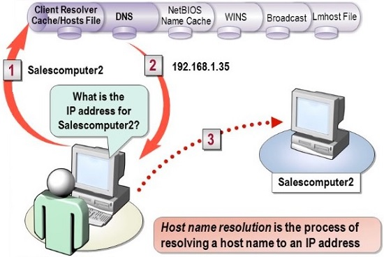
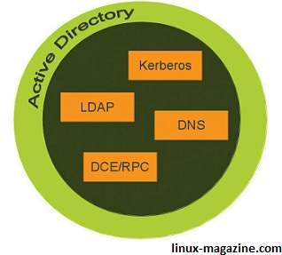
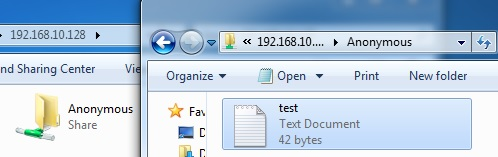
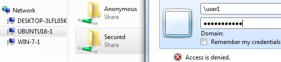
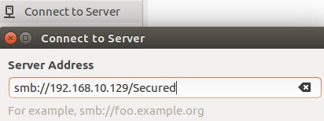

# 209.1. SAMBA Server Configuration

## **209.1 SAMBA Server Configuration**

**Weight:** 5

**Description:** Candidates should be able to set up a Samba server for various clients. This objective includes setting up Samba as a standalone server as well as integrating Samba as a member in an Active Directory. Furthermore, the configuration of simple CIFS and printer shares is covered. Also covered is a configuring a Linux client to use a Samba server. Troubleshooting installations is also tested.

**Key Knowledge Areas:**

* Samba 4 documentation
* Samba 4 configuration files
* Samba 4 tools and utilities and daemons
* Mounting CIFS shares on Linux
* Mapping Windows user names to Linux user names
* User-Level, Share-Level and AD security

**Terms and Utilities:**

* smbd, nmbd, winbindd
* smbcontrol, smbstatus, testparm, smbpasswd, nmblookup
* samba-tool
* net
* smbclient
* mount.cifs
* /etc/samba/
* /var/log/samba/

In old days it was easy to find a group of computers which just talked to each other and were isolated from other types of computers, but it rarely happens nowadays. Any how as a system administrator or engineer, we might be expectedto know how to set up and maintain a network with multiple types of servers.

Two key role players of today computers world are Linux and Microsft windows. It is easy to find both of them in a server farm so we need to know about some differences and solutions which might be helpfull.

In this lesson we will talk about some differences and we will see how SAMBA can help us. The first difference between Microsoft is in name resolution method.

#### NetBios Name resolution

One of the important steps in trying to resolve IP problems is determining if name resolution is working. The first issue is determining the kind of name. In the Windows client world, there are two basic types of names. The first kind is a name for IP addresses. Host name resolution uses a host’s file and DNS for resolution. The second kind of name is the NetBIOS name, which is used for Windows \(SMB\) type sharing and messaging. These are the names that are used when you are mapping a drive or connecting to a printer. These names are resolved either by using an LMHosts file on the local machine or WINS server, or by broadcasting a request.Lets draw Name resolution big picture:



The order is not really important and can be modified, but the default order is like this:

1. The first resolution mechanism is not really a resolution mechanism at all. It is an internal cache that is in each Windows machine. This cache is populated by previous name resolution attempts and by a special option in the LMHosts file \(described next\).
2. The second resolution method is where the LMHosts file is consulted to see if there are any NetBIOS names that match the NetBIOS name being queried. In its simplest form, the LMHosts file contains an IP address and a host name.
3. The third resolution mechanism used by the local computer to resolve the NetBIOS name involves consulting one or more naming servers. In most cases, the naming server contacted is a Windows Internet Naming Server \(WINS\). Technically, you could create a NetBIOS naming server that is not a WINS server, but it is rarely done.
4. The fourth and final resolution method is to broadcast for the NetBIOS name. The computer broadcasts a special packet that is received and processed by all machines on the network. The packet then requests that the computer identify itself. This is effective within a local network but is ineffective across routers, which do not forward broadcast packets.

So if we want to communicate with Microsoft Windows Operating system we need to find a way to work with this NetBios Name resolution. The other protocol which need alittle explanation and review is SMB.

#### SMB Protocol

The Server Message Block Protocol \(SMB protocol\) is a client-server communication protocol used for sharing access to files, printers, serial ports and other resources on a network. Created by IBM in the 1980s, the SMB protocol has since spawned multiple variants or implementations, also known as dialects, to meet evolving network requirements over the years.

SMB protocol dialects : Variants of the SMB protocol have improved the original implementation's capabilities, scalability, security and efficiency. Here is a brief overview of the SMB protocol's notable dialects:

* SMB 1.0 \(1984\): Created by IBM for file sharing in DOS.
* CIFS \(1996\): Microsoft-developed SMB dialect that debuted in Windows 95. Added support for larger file sizes, transport directly over TCP/IP, and symbolic links and hard links.
* SMB 2.0 \(2006\): Released with Windows Vista and Windows Server 2008.
* SMB 2.1 \(2010\): Introduced with Windows Server 2008 R2 and Windows 7.
* SMB 3.0 \(2012\): Debuted in Windows 8 and Windows Server 2012.
* SMB 3.02 \(2014\): Introduced in Windows 8.1 and Windows Server 2012 R2.
* SMB 3.1.1 \(2015\): Released with Windows 10 and Windows Server 2016.

**CIFS vs. SMB**

As noted in the list above, CIFS is an early dialect of the SMB protocol developed by Microsoft. Although the terms are sometimes used interchangeably, CIFS only refers to a single implementation of SMB. Most modern systems use more recent dialects of the SMB protocol.

#### Security Levels

There are two basic means for protecting resources offered on a network. Each method strives to make the protected resources available only to users who have been authorized access to these resources.

* **Share-level security** involves securing connections to a network share point by a password. Users who know the name of the share point and the password can connect to the share point. All subdirectories and files found under the share point are accessible by using only the **single password**.
* **User-level security** involves using access controls in the file system and does not stop at placing a single password on an entire tree of resources \(although you can do it that way if you want\). Instead, access permissions can be placed on any directory or file in a directory, or subdirectories. When a user connects to a resource protected by user-level security mechanisms, the user must first authenticate himself \(log on to the server\) using his **username and password**. The user then is granted access rights to each file or directory on the resource, either by the access control restrictions implicitly placed on the resource or by inheritance of access rights.

## SAMBA vs SMB

Released in 1992, Samba is an open source implementation of the SMB protocol for Unix systems and Linux distributions. It supports file sharing and print services, authentication and authorization, name resolution, and service announcements between Linux/Unix servers and Windows clients.

### Samba Versions

For all versions of Samba, the goal is the same: sharing Windows resources with Unix-style operating systems such as Linux, and sharing Linux resources with Windows systems . Unfortunately, support for Microsoft systems is a moving target: Redmond is not exactly renowned for their willingness to publish specifications, and the software giant keeps extending its SMB/ CIFS protocols from one Windows version to the next. Open source developers try to keep track of the changes to SMB by using tools such as Ethereal to sniff connections, but Microsoft stepped up its game with Windows 2000, introducing the object-based directory system called Active Directory Service .

### Samba Version 3 vs 4

When Samba 3 was released in 2003, it consisted of three services: the file server smbd, the name server nmbd, and the authentication server winbind. In their interaction with the rest of the system, these three services provided a file service and an NT4 domain controller.

In December 2012, the open source world received the first, and very long awaited, release of the Samba 4.x series. Samba 4 has been under development for 10 years. In that same time, the Samba 3.x series also has seen numerous releases and advancements. This parallel development has led to some confusion over the nature of Samba 4; and, some distributions release both samba3 and samba4 packages that can be installed in parallel, with varying degrees of success.

Samba 4.x is a full replacement and upgrade to Samba 3. For the first time, it's now possible to use Samba 4 to map a full Windows domain structure on Linux.



Samba 4's support for an Active Directory domain means that it needs to provide a wider range of services: Classic NETBIOS name resolution was superseded by DNS, authentication was centralized using Kerberos, and centralized data storage was implemented via LDAP – only the file server remained the same, with changes to match the new structure.


Traditionally Samba is comprised of three main daemons \(smbd, nmbd, and winbindd\).

* **nmbd** : The nmbd daemon provides NetBIOS nameservice and browsing support. The configuration file for this daemon is described in smb.conf
* **smbd** : The smbd daemon provides the file and print services to SMB clients, such as Windows 95/98, Windows NT, Windows for Workgroups or LanManager.
* **webbindd** : winbindd is a daemon that is used for integrating authentication and the user database into unix.

According to the samba man page:

### 1- nmbd

The nmbd server daemon understands and replies to NetBIOS name service requests such as those produced by SMB/CIFS in Windows-based systems. These systems include Windows 95/98/ME, Windows NT, Windows 2000, Windows XP, and LanManager clients. It also participates in the browsing protocols that make up the Windows Network Neighborhood view. The default port that the server listens to for NMB traffic is UDP port 137. The configuration file for this daemon is described in smb.conf.The nmbd daemon is controlled by the smb service.

in linux we can use nmblookup command.

```text
root@ubuntu16-1:~# nmbdlookup
No command 'nmbdlookup' found, did you mean:
 Command 'nmblookup' from package 'samba-common-bin' (main)
nmbdlookup: command not found
root@ubuntu16-1:~# apt install samba-common-bin
```

#### nmblookup

`nmblookup`is used to query NetBIOS names and map them to IP addresses in a network using NetBIOS over TCP/IP queries. All queries are done over UDP.

```text
root@ubuntu16-1:~# nmblookup --help
Usage: <NODE> ...
  -B, --broadcast=BROADCAST-ADDRESS      Specify address to use for broadcasts
  -f, --flags                            List the NMB flags returned
  -U, --unicast=STRING                   Specify address to use for unicast
  -M, --master-browser                   Search for a master browser
  -R, --recursion                        Set recursion desired in package
  -S, --status                           Lookup node status as well
  -T, --translate                        Translate IP addresses into names
  -r, --root-port                        Use root port 137 (Win95 only replies
                                         to this)
  -A, --lookup-by-ip                     Do a node status on <name> as an IP
                                         Address

Help options:
  -?, --help                             Show this help message
      --usage                            Display brief usage message

Common samba options:
  -d, --debuglevel=DEBUGLEVEL            Set debug level
  -s, --configfile=CONFIGFILE            Use alternate configuration file
  -l, --log-basename=LOGFILEBASE         Base name for log files
  -V, --version                          Print version
      --option=name=value                Set smb.conf option from command line

Connection options:
  -O, --socket-options=SOCKETOPTIONS     socket options to use
  -n, --netbiosname=NETBIOSNAME          Primary netbios name
  -W, --workgroup=WORKGROUP              Set the workgroup name
  -i, --scope=SCOPE                      Use this Netbios scope
```

For example lets NetBios Name lookup for a Windows 7 client:

```text
root@ubuntu16-1:~# nmblookup WIN-7-1
192.168.10.150 WIN-7-1<00>
```

use `nmblookup WORKGROUP` for looking up for a bunch of Workgroup computers.

### 2- smbd

The smbdserver daemon provides file sharing and printing services to Windows clients . In addition, it is responsible for user authentication, resource locking, and data sharing through the SMB protocol. The default ports on which the server listens for SMB traffic are TCP ports 139 and 445. The configuration file for this daemon is described in smb.conf.The smbddaemon is controlled by the smbservice.

#### Setting Up Anonymous Samba File Sharing

One of the reason why Samba is so relevant is because it provides file and print services to SMB/CIFS clients, which causes those clients to see the server as if it was a Windows system.

**samba instalation**

There are three samba related packages that are mostly used:

* **samba :** provide software for the sevrer.
* **samba-client :** The package that contains all the client programs.\(to connect samba servers or windows file shares \)
* **samba-common :** Contain softwares which are used both by the samba server as well as samba client

An there another usefull packages with Samba 4 `cifs-utils`which contains lates windows security changes inside. Here we have used Ubuntu:

```text
root@ubuntu16-1:~# apt install samba
```

Now lets create a shared samba directory where the files will be stored:

```text
root@ubuntu16-1:~# mkdir -p /srv/samba/anonymous_shares
```

And set appropriate permissions on the directory:

```text
root@ubuntu16-1:~# chmod 0777 /srv/samba/anonymous_shares
root@ubuntu16-1:~# chown nobody:nogroup /srv/samba/anonymous_shares
```

### **/etc/samba/smb.conf**

Samba configuration is straightforward. All modifications to Samba are done in the `/etc/samba/smb.conf`configuration file.

```text
root@ubuntu16-1:/etc/samba# ls
dhcp.conf  gdbcommands  smb.conf  tls
root@ubuntu16-1:/etc/samba# cat smb.conf 
#
# Sample configuration file for the Samba suite for Debian GNU/Linux.
#
#
# This is the main Samba configuration file. You should read the
# smb.conf(5) manual page in order to understand the options listed
# here. Samba has a huge number of configurable options most of which 
# are not shown in this example
#
# Some options that are often worth tuning have been included as
# commented-out examples in this file.
#  - When such options are commented with ";", the proposed setting
#    differs from the default Samba behaviour
#  - When commented with "#", the proposed setting is the default
#    behaviour of Samba but the option is considered important
#    enough to be mentioned here
#
# NOTE: Whenever you modify this file you should run the command
# "testparm" to check that you have not made any basic syntactic 
# errors. 

#======================= Global Settings =======================

[global]

## Browsing/Identification ###

# Change this to the workgroup/NT-domain name your Samba server will part of
   workgroup = WORKGROUP

# server string is the equivalent of the NT Description field
    server string = %h server (Samba, Ubuntu)

# Windows Internet Name Serving Support Section:
# WINS Support - Tells the NMBD component of Samba to enable its WINS Server
#   wins support = no

# WINS Server - Tells the NMBD components of Samba to be a WINS Client
# Note: Samba can be either a WINS Server, or a WINS Client, but NOT both
;   wins server = w.x.y.z

# This will prevent nmbd to search for NetBIOS names through DNS.
   dns proxy = no

#### Networking ####

# The specific set of interfaces / networks to bind to
# This can be either the interface name or an IP address/netmask;
# interface names are normally preferred
;   interfaces = 127.0.0.0/8 eth0

# Only bind to the named interfaces and/or networks; you must use the
# 'interfaces' option above to use this.
# It is recommended that you enable this feature if your Samba machine is
# not protected by a firewall or is a firewall itself.  However, this
# option cannot handle dynamic or non-broadcast interfaces correctly.
;   bind interfaces only = yes


#### Debugging/Accounting ####

# This tells Samba to use a separate log file for each machine
# that connects
   log file = /var/log/samba/log.%m

# Cap the size of the individual log files (in KiB).
   max log size = 1000

# If you want Samba to only log through syslog then set the following
# parameter to 'yes'.
#   syslog only = no

# We want Samba to log a minimum amount of information to syslog. Everything
# should go to /var/log/samba/log.{smbd,nmbd} instead. If you want to log
# through syslog you should set the following parameter to something higher.
   syslog = 0

# Do something sensible when Samba crashes: mail the admin a backtrace
   panic action = /usr/share/samba/panic-action %d


####### Authentication #######

# Server role. Defines in which mode Samba will operate. Possible
# values are "standalone server", "member server", "classic primary
# domain controller", "classic backup domain controller", "active
# directory domain controller". 
#
# Most people will want "standalone sever" or "member server".
# Running as "active directory domain controller" will require first
# running "samba-tool domain provision" to wipe databases and create a
# new domain.
   server role = standalone server

# If you are using encrypted passwords, Samba will need to know what
# password database type you are using.  
   passdb backend = tdbsam

   obey pam restrictions = yes

# This boolean parameter controls whether Samba attempts to sync the Unix
# password with the SMB password when the encrypted SMB password in the
# passdb is changed.
   unix password sync = yes

# For Unix password sync to work on a Debian GNU/Linux system, the following
# parameters must be set (thanks to Ian Kahan <<kahan@informatik.tu-muenchen.de> for
# sending the correct chat script for the passwd program in Debian Sarge).
   passwd program = /usr/bin/passwd %u
   passwd chat = *Enter\snew\s*\spassword:* %n\n *Retype\snew\s*\spassword:* %n\n *password\supdated\ssuccessfully* .

# This boolean controls whether PAM will be used for password changes
# when requested by an SMB client instead of the program listed in
# 'passwd program'. The default is 'no'.
   pam password change = yes

# This option controls how unsuccessful authentication attempts are mapped
# to anonymous connections
   map to guest = bad user

########## Domains ###########

#
# The following settings only takes effect if 'server role = primary
# classic domain controller', 'server role = backup domain controller'
# or 'domain logons' is set 
#

# It specifies the location of the user's
# profile directory from the client point of view) The following
# required a [profiles] share to be setup on the samba server (see
# below)
;   logon path = \\%N\profiles\%U
# Another common choice is storing the profile in the user's home directory
# (this is Samba's default)
#   logon path = \\%N\%U\profile

# The following setting only takes effect if 'domain logons' is set
# It specifies the location of a user's home directory (from the client
# point of view)
;   logon drive = H:
#   logon home = \\%N\%U

# The following setting only takes effect if 'domain logons' is set
# It specifies the script to run during logon. The script must be stored
# in the [netlogon] share
# NOTE: Must be store in 'DOS' file format convention
;   logon script = logon.cmd

# This allows Unix users to be created on the domain controller via the SAMR
# RPC pipe.  The example command creates a user account with a disabled Unix
# password; please adapt to your needs
; add user script = /usr/sbin/adduser --quiet --disabled-password --gecos "" %u

# This allows machine accounts to be created on the domain controller via the 
# SAMR RPC pipe.  
# The following assumes a "machines" group exists on the system
; add machine script  = /usr/sbin/useradd -g machines -c "%u machine account" -d /var/lib/samba -s /bin/false %u

# This allows Unix groups to be created on the domain controller via the SAMR
# RPC pipe.  
; add group script = /usr/sbin/addgroup --force-badname %g

############ Misc ############

# Using the following line enables you to customise your configuration
# on a per machine basis. The %m gets replaced with the netbios name
# of the machine that is connecting
;   include = /home/samba/etc/smb.conf.%m

# Some defaults for winbind (make sure you're not using the ranges
# for something else.)
;   idmap uid = 10000-20000
;   idmap gid = 10000-20000
;   template shell = /bin/bash

# Setup usershare options to enable non-root users to share folders
# with the net usershare command.

# Maximum number of usershare. 0 (default) means that usershare is disabled.
;   usershare max shares = 100

# Allow users who've been granted usershare privileges to create
# public shares, not just authenticated ones
   usershare allow guests = yes

#======================= Share Definitions =======================

# Un-comment the following (and tweak the other settings below to suit)
# to enable the default home directory shares. This will share each
# user's home directory as \\server\username
;[homes]
;   comment = Home Directories
;   browseable = no

# By default, the home directories are exported read-only. Change the
# next parameter to 'no' if you want to be able to write to them.
;   read only = yes

# File creation mask is set to 0700 for security reasons. If you want to
# create files with group=rw permissions, set next parameter to 0775.
;   create mask = 0700

# Directory creation mask is set to 0700 for security reasons. If you want to
# create dirs. with group=rw permissions, set next parameter to 0775.
;   directory mask = 0700

# By default, \\server\username shares can be connected to by anyone
# with access to the samba server.
# Un-comment the following parameter to make sure that only "username"
# can connect to \\server\username
# This might need tweaking when using external authentication schemes
;   valid users = %S

# Un-comment the following and create the netlogon directory for Domain Logons
# (you need to configure Samba to act as a domain controller too.)
;[netlogon]
;   comment = Network Logon Service
;   path = /home/samba/netlogon
;   guest ok = yes
;   read only = yes

# Un-comment the following and create the profiles directory to store
# users profiles (see the "logon path" option above)
# (you need to configure Samba to act as a domain controller too.)
# The path below should be writable by all users so that their
# profile directory may be created the first time they log on
;[profiles]
;   comment = Users profiles
;   path = /home/samba/profiles
;   guest ok = no
;   browseable = no
;   create mask = 0600
;   directory mask = 0700

[printers]
   comment = All Printers
   browseable = no
   path = /var/spool/samba
   printable = yes
   guest ok = no
   read only = yes
   create mask = 0700

# Windows clients look for this share name as a source of downloadable
# printer drivers
[print$]
   comment = Printer Drivers
   path = /var/lib/samba/printers
   browseable = yes
   read only = yes
   guest ok = no
# Uncomment to allow remote administration of Windows print drivers.
# You may need to replace 'lpadmin' with the name of the group your
# admin users are members of.
# Please note that you also need to set appropriate Unix permissions
# to the drivers directory for these users to have write rights in it
;   write list = root, @lpadmin
```

Although the default `smb.conf` file is well documented, it does not address complex topics such as LDAP, Active Directory, and the numerous domain controller implementations.

The file consists of sections and parameters. A section begins with the name of the section in square brackets and continues until the next section begins.There are three special sections, \[global\], \[homes\] and \[printers\].

The configuration file really only has one main section. The \[global\] section and its directives provide all the options and parameters required for the Samba daemon \(smbd\) and NetBIOS daemon \(nmbd\) to operate within the network. This \(in a nutshell\) is how our server will operate and be seen on the network.

Each section in the configuration file \(except for the \[global\] section\) describes a shared resource \(known as a “share”\). The section name is the name of the shared resource and the parameters within the section define the shares attributes.

For now we just want to setup an anonymous share so we add a new section on th bottom of smb.conf configuration file:

```text
[Anonymous]
comment = Anonymous File Server Share
path = /srv/samba/anonymous_shares
browsable =yes
read only = no
writable = yes
guest ok = yes
force user = nobody
```

where

* \[Anonymous\]: The name inside the brackets is the name of our share.
* comment: A brief description of the share.
* path: The directory of our share.
* browsable: When set to yes, file managers such as Ubuntu's default file manager will list this share under "Network" \(it could also appear as browseable\).
* read only: Permission to modify the contents of the share folder is only granted when the value of this directive is no.
* writable : Inverted synonym for read only.
* guest ok : If this parameter is yes for a service, then no password is required to connect to the service.
* force user :This specifies a UNIX user name that will be assigned as the default user for all users connecting to this service. This is useful for sharing files. We should also use it carefully as using it incorrectly can cause security problems.

keep in mind that altough we are setting some permissions here, but still underlying File system permissions are still going to apply.

### testparm

Now verify current samba settings by running the `testparm` command \(Not `testparam` be carefull\) :

```text
root@ubuntu16-1:/etc/samba# testparm 
Load smb config files from /etc/samba/smb.conf
rlimit_max: increasing rlimit_max (1024) to minimum Windows limit (16384)
WARNING: The "syslog" option is deprecated
Processing section "[printers]"
Processing section "[print$]"
Processing section "[Anonymous]"
Loaded services file OK.
Server role: ROLE_STANDALONE

Press enter to see a dump of your service definitions
```

Finally, start and enable samba services to start automatically at next boot and also apply the above changes to take effect.On modern Ubuntu the main Samba service is`samba-ad-dc`

```text
root@ubuntu16-1:~# systemctl enable samba-ad-dc
samba-ad-dc.service is not a native service, redirecting to systemd-sysv-install
Executing /lib/systemd/systemd-sysv-install enable samba-ad-dc
root@ubuntu16-1:~# systemctl start samba-ad-dc
root@ubuntu16-1:~# systemctl status samba-ad-dc
● samba-ad-dc.service - LSB: start Samba daemons for the AD DC
   Loaded: loaded (/etc/init.d/samba-ad-dc; bad; vendor preset: enabled)
   Active: active (exited) since Mon 2018-08-13 00:08:52 PDT; 1h 17min ago
     Docs: man:systemd-sysv-generator(8)

Aug 13 00:08:51 ubuntu16-1 systemd[1]: Starting LSB: start Samba daemons for the
Aug 13 00:08:52 ubuntu16-1 systemd[1]: Started LSB: start Samba daemons for the 
Aug 13 01:18:32 ubuntu16-1 systemd[1]: Started LSB: start Samba daemons for the 
Aug 13 01:26:38 ubuntu16-1 systemd[1]: Started LSB: start Samba daemons for the 
lines 1-9/9 (END)
```

Inorder to our changes take effect we need need to restart samba service, but there is a samba tool called smbcontrol. The

### smbcontrol

`smbcontrol` is a very small program, which sends messages to a smbd, a nmbd, or a winbindd daemon running on the system. smbcontrol -? command print a summary of command line options. The general format of command is like this:

```text
smbcontrol [destination] [message-type] [parameter]
```

We can use it to reload smb.conf configurations without restarting the service:

```text
root@ubuntu16-1:~# smbcontrol smbd reload-config
```

After reloading configurations in a way that you like, we can show all Samba shares with smbclietn:

### smbclient

smbclient is a client that is part of the Samba software suite. It communicates with a LAN Manager server, offering an interface similar to that of the ftp program. Operations include things like getting files from the server to the local machine, putting files from the local machine to the server, retrieving directory information from the server and so on.

```text
root@ubuntu16-1:/etc/samba# smbclient -L localhost
The program 'smbclient' is currently not installed. You can install it by typing:
apt install smbclient
root@ubuntu16-1:/etc/samba# apt install smbclient

root@ubuntu16-1:/etc/samba# smbclient --help
Usage: smbclient service <password>
  -R, --name-resolve=NAME-RESOLVE-ORDER     Use these name resolution services
                                            only
  -M, --message=HOST                        Send message
  -I, --ip-address=IP                       Use this IP to connect to
  -E, --stderr                              Write messages to stderr instead
                                            of stdout
  -L, --list=HOST                           Get a list of shares available on
                                            a host
  -m, --max-protocol=LEVEL                  Set the max protocol level
  -T, --tar=<c|x>IXFqgbNan                  Command line tar
  -D, --directory=DIR                       Start from directory
  -c, --command=STRING                      Execute semicolon separated
                                            commands
  -b, --send-buffer=BYTES                   Changes the transmit/send buffer
  -t, --timeout=SECONDS                     Changes the per-operation timeout
  -p, --port=PORT                           Port to connect to
  -g, --grepable                            Produce grepable output
  -B, --browse                              Browse SMB servers using DNS

Help options:
  -?, --help                                Show this help message
      --usage                               Display brief usage message

Common samba options:
  -d, --debuglevel=DEBUGLEVEL               Set debug level
  -s, --configfile=CONFIGFILE               Use alternate configuration file
  -l, --log-basename=LOGFILEBASE            Base name for log files
  -V, --version                             Print version
      --option=name=value                   Set smb.conf option from command
                                            line

Connection options:
  -O, --socket-options=SOCKETOPTIONS        socket options to use
  -n, --netbiosname=NETBIOSNAME             Primary netbios name
  -W, --workgroup=WORKGROUP                 Set the workgroup name
  -i, --scope=SCOPE                         Use this Netbios scope

Authentication options:
  -U, --user=USERNAME                       Set the network username
  -N, --no-pass                             Don't ask for a password
  -k, --kerberos                            Use kerberos (active directory)
                                            authentication
  -A, --authentication-file=FILE            Get the credentials from a file
  -S, --signing=on|off|required             Set the client signing state
  -P, --machine-pass                        Use stored machine account password
  -e, --encrypt                             Encrypt SMB transport (UNIX
                                            extended servers only)
  -C, --use-ccache                          Use the winbind ccache for
                                            authentication
      --pw-nt-hash                          The supplied password is the NT
                                            hash
```

To see which shares are available on a given host:

```text
root@ubuntu16-1:/etc/samba# smbclient -L localhost
WARNING: The "syslog" option is deprecated
Enter root's password: 
Domain=[WORKGROUP] OS=[Windows 6.1] Server=[Samba 4.3.11-Ubuntu]

    Sharename       Type      Comment
    ---------       ----      -------
    print$          Disk      Printer Drivers
    IPC$            IPC       IPC Service (ubuntu16-1 server (Samba, Ubuntu))
    Anonymous       Disk      Anonymous File Server Share
Domain=[WORKGROUP] OS=[Windows 6.1] Server=[Samba 4.3.11-Ubuntu]

    Server               Comment
    ---------            -------
    DESKTOP-3LFL05K      
    UBUNTU16-1           ubuntu16-1 server (Samba, Ubuntu)

    Workgroup            Master
    ---------            -------
    WORKGROUP            UBUNTU16-1
```

and it time ti check result from our windows 7 client:

### 

### smbstatus

`smbstatus`is a very simple program to list who is connected, and what shares they currently have as well as locked file\(s\) if there are any:

```text
root@ubuntu16-1:/srv/samba# smbstatus --help
Usage: [OPTION...]
  -p, --processes                    Show processes only
  -v, --verbose                      Be verbose
  -L, --locks                        Show locks only
  -S, --shares                       Show shares only
  -N, --notify                       Show notifies
  -u, --user=STRING                  Switch to user
  -b, --brief                        Be brief
  -P, --profile                      Do profiling
  -R, --profile-rates                Show call rates
  -B, --byterange                    Include byte range locks
  -n, --numeric                      Numeric uid/gid
  -f, --fast                         Skip checks if processes still exist

Help options:
  -?, --help                         Show this help message
      --usage                        Display brief usage message

Common samba options:
  -d, --debuglevel=DEBUGLEVEL        Set debug level
  -s, --configfile=CONFIGFILE        Use alternate configuration file
  -l, --log-basename=LOGFILEBASE     Base name for log files
  -V, --version                      Print version
      --option=name=value            Set smb.conf option from command line
```

in our example:

```text
root@ubuntu16-1:/srv/samba# smbstatus 

Samba version 4.3.11-Ubuntu
PID     Username      Group         Machine            Protocol Version       
------------------------------------------------------------------------------
7032      nobody        nogroup       192.168.10.155 (ipv4:192.168.10.155:49180) SMB2_10     

Service      pid     machine       Connected at
-------------------------------------------------------
Anonymous    7032   192.168.10.155  Mon Aug 13 04:46:10 2018

Locked files:
Pid          Uid        DenyMode   Access      R/W        Oplock           SharePath   Name   Time
--------------------------------------------------------------------------------------------------
7032         65534      DENY_NONE  0x100081    RDONLY     NONE             /srv/samba/anonymous_shares   .   Mon Aug 13 04:48:48 2018
7032         65534      DENY_NONE  0x100081    RDONLY     NONE             /srv/samba/anonymous_shares   .   Mon Aug 13 04:48:48 2018
```

### net

The Samba net utility is meant to work just like the net utility available for windows and DOS. The first argument should be used to specify the protocol to use when executing a certain command. ADS is used for ActiveDirectory, RAP is using for old \(Win9x/NT3\) clients and RPC can be used for NT4 and Windows 2000. If this argument is omitted, net will try to determine it automatically. Not all commands are available on all protocols.

```text
root@ubuntu16-1:/srv/samba# net --help
Usage:
  Use 'net help rpc' to get more extensive information about 'net rpc' commands.
  Use 'net help rap' to get more extensive information about 'net rap' commands.
  Use 'net help ads' to get more extensive information about 'net ads' commands.
  Use 'net help file' to get more information about 'net file' commands.
  Use 'net help share' to get more information about 'net share' commands.
  Use 'net help session' to get more information about 'net session' commands.
  Use 'net help server' to get more information about 'net server' commands.
  Use 'net help domain' to get more information about 'net domain' commands.
  Use 'net help printq' to get more information about 'net printq' commands.
  Use 'net help user' to get more information about 'net user' commands.
  Use 'net help group' to get more information about 'net group' commands.
  Use 'net help groupmap' to get more information about 'net groupmap' commands.
  Use 'net help sam' to get more information about 'net sam' commands.
  Use 'net help validate' to get more information about 'net validate' commands.
  Use 'net help groupmember' to get more information about 'net groupmember' commands.
  Use 'net help admin' to get more information about 'net admin' commands.
  Use 'net help service' to get more information about 'net service' commands.
  Use 'net help password' to get more information about 'net password' commands.
  Use 'net help changetrustpw' to get more information about 'net changetrustpw'.
  net [options] changesecretpw
    Change the ADS domain member machine account password in secrets.tdb.
    Do NOT use this function unless you know what it does.
    Requires the -f flag to work.
  net -U user[%%password] [-W domain] setauthuser
    Set the auth user, password (and optionally domain
    Will prompt for password if not given.
  net setauthuser delete
    Delete the existing auth user settings.
  net getauthuser
    Get the current winbind auth user settings.
  Use 'net help time' to get more information about 'net time' commands.
  Use 'net help lookup' to get more information about 'net lookup' commands.
  Use 'net help g_lock' to get more information about 'net g_lock' commands.
  Use 'net help join' to get more information about 'net join'.
  Use 'net help dom' to get more information about 'net dom' commands.
  Use 'net help cache' to get more information about 'net cache' commands.
  net getlocalsid
  net setlocalsid S-1-5-21-x-y-z
  net setdomainsid S-1-5-21-x-y-z
  net getdomainsid
  net maxrid
  Use 'net help idmap to get more information about 'net idmap' commands.
  Use 'net help status' to get more information about 'net status' commands.
  Use 'net help usershare to get more information about 'net usershare' commands.
  Use 'net help usersidlist' to get more information about 'net usersidlist'.
  Use 'net help conf' to get more information about 'net conf' commands.
  Use 'net help registry' to get more information about 'net registry' commands.
  Use 'net help eventlog' to get more information about 'net eventlog' commands.
  Use 'net help printing' to get more information about 'net printing' commands.
  Use 'net help serverid' to get more information about 'net serverid' commands.
  Use 'net help notify' to get more information about 'net notify' commands.
  Use 'net help help' to list usage information for 'net' commands.
```

The `net status` command can list all smb connections :

```text
root@ubuntu16-1:/srv/samba# net status shares

Service      pid     machine       Connected at
-------------------------------------------------------
Anonymous    7032   192.168.10.155  Mon Aug 13 04:46:10 2018
Anonymous    7919   192.168.10.149  Tue Aug 14 00:20:48 2018
IPC$         7919   192.168.10.149  Tue Aug 14 00:20:48 2018
```

and sessions:

```text
root@ubuntu16-1:/srv/samba# net status sessions
PID     Username      Group         Machine                        
-------------------------------------------------------------------
   7032   nobody        nogroup       192.168.10.155 (ipv4:192.168.10.155:49180)
   7919   nobody        nogroup       192.168.10.149 (ipv4:192.168.10.149:49185)
```

## Secure Samba File Sharing

The first step for securing Samba File share is making a union between passwords. Both Linux and Microsoft Windows operating systems using Hashed passwords. Since a hash function is one-way, this provides some measure of security for the storage of the passwords. But the problem is that Linux and Windows do not use the same Hash Algorithem inorder to store passwords!

Normally, Windows store passwords on single computer systems usnig SAM . The Security Accounts Manager \(SAM\) is a registry file in Windows NT and later versions until the most recent Windows 10. It stores users' passwords in a hashed format \(in LM hash and NTLM hash\).

In Linux distributions login passwords are commonly hashed and stored in the /etc/shadow file using the MD5 algorithm. The security of the MD5 hash function has been severely compromised by collision vulnerabilities. This does not mean MD5 is insecure for password hashing but in some distrobutions SHA algorithems are used \(as NSA has benn recommended\)which are more secure and dosen't have known weaknesses .\(we can change it using pam\_unit module, will be describe in PAM course\).

Offf, so it seems impossible to come to a conclusion. The solution is using a seperate mechanisem to hash and store passwords and use it for smb shares authentication.

For demonstration we create a new share directory :

```text
root@ubuntu16-1:~# mkdir /securedshares
root@ubuntu16-1:~# chmod 777 /securedshares
root@ubuntu16-1:~# chown user1:user1 /securedshares
```

and a new samba user:

### smbpasswd

This tool lets us to create smbpasswd file which is the Samba encrypted password file:

```text
root@ubuntu16-1:~# smbpasswd -a user1
New SMB password:
Retype new SMB password:
Added user user1.
```

It contains the username, Unix user id and the SMB hashed passwords of the user, as well as account flag information and the time the password was last changed.In Ubuntu try `cat /usr/bin/smbpasswd` to see the contents.

Okey now lets configure smb.conf for adding a new secure share:

```text
[Secured]
comment = This is just for user1
path = /securedshares
valid users = user1
read only = no
create mask = 0777
directory mask = 0777
```

after checking configurations with testparm and restarting samba service \(samba\|samba-ad-dc\), check the results:



Do not forget that Samba default security level is user level , how ever it is configurable. Also we create a test file inside it called "testfileinsecured.txt"

### Mounting the Samba Share in Linux

First lets make sure the Samba share is accessible from our CentOS client\(need samba-client\):

```text
[root@centos7-1 ~]# smbclient -L 192.168.10.129 -U user1
Enter SAMBA\user1's password: 
Domain=[UBUNTU16-1] OS=[Windows 6.1] Server=[Samba 4.3.11-Ubuntu]

    Sharename       Type      Comment
    ---------       ----      -------
    print$          Disk      Printer Drivers
    Anonymous       Disk      Anonymous File Server Share
    IPC$            IPC       IPC Service (ubuntu16-1 server (Samba, Ubuntu))
    Secured         Disk      This is just for user1

Domain=[UBUNTU16-1] OS=[Windows 6.1] Server=[Samba 4.3.11-Ubuntu]

    Server               Comment
    ---------            -------

    Workgroup            Master
    ---------            -------
    WORKGROUP
```

It is good to know that smbclient can be used to access a share without mounting it:

```text
[root@centos7-1 ~]# smbclient  -U user1 //192.168.10.129/Secured
Enter SAMBA\user1's password: 
Domain=[UBUNTU16-1] OS=[Windows 6.1] Server=[Samba 4.3.11-Ubuntu]
smb: \> ls
  .                                   D        0  Sun Aug 19 03:15:31 2018
  ..                                  D        0  Tue Aug 14 06:14:11 2018
  testfileinsecured.txt               A       26  Sun Aug 19 03:15:40 2018

        50442940 blocks of size 1024. 43335112 blocks available
smb: \> quit
```

We can mount \(and later unmount\) this network share when needed with `mount` command:

```text
[root@centos7-1 ~]# mount //192.168.10.129/Secured /mnt -o username=user1
Password for user1@//192.168.10.129/Secured:  ***********

[root@centos7-1 ~]# df -h
Filesystem                Size  Used Avail Use% Mounted on
/dev/mapper/centos-root    46G  3.6G   42G   8% /
devtmpfs                  1.9G     0  1.9G   0% /dev
tmpfs                     1.9G     0  1.9G   0% /dev/shm
tmpfs                     1.9G  9.0M  1.9G   1% /run
tmpfs                     1.9G     0  1.9G   0% /sys/fs/cgroup
/dev/sda1                1014M  179M  836M  18% /boot
tmpfs                     378M   20K  378M   1% /run/user/1000
//192.168.10.129/Secured   49G  4.4G   42G  10% /mnt

[root@centos7-1 ~]# ls -l /mnt/
total 4
-rwxrw-rw-. 1 1001 1001 26 Aug 19  2018 testfileinsecured.txt

[root@centos7-1 ~]# umount /mnt/
```

also we could have use mount.cifs command\(same as mount -t cifs\) which is a part of the cifs-utils suite. cifs-utils is available with Samba v4 and generaly it is not required when we talk about Samba V3.The reason to use that goes back to the security enhancements and changes in New Micorosft Windows versions and New cifs-utils nows how to deal with that.\(In Samaba3 use user=user1\).

To make our share permanent, we should add the following entry in**/etc/fstab**  file:

```text
//192.168.10.129/Secured /mnt cifs username=user1,password=Aa12345? 0 0
```

Obviously it is not a good idea to set username an password in fstab file, so lets define it some where else:

```text
//192.168.10.129/Secured /mnt cifs credentials=/mnt/.smbcredentials 0 0
```

Where the hidden file /mnt/.smbcredentials \(whose permissions and ownership have been set to 600 and root:root, respectively\) contains two lines that indicate the username and password of an account that is allowed to use the share:

```text
[root@centos7-1 ~]# ls -la /mnt
total 4
drwxr-xr-x.  2 root root  29 Aug 18 23:50 .
dr-xr-xr-x. 17 root root 224 Oct 28  2017 ..
-rw-------.  1 root root  36 Aug 18 23:49 .smbcredentials

[root@centos7-1 ~]# cat /mnt/.smbcredentials 
username=user1
password=Aa12345?
```

and inorder to check it without rebooting:

```text
[root@centos7-1 ~]# mount -a

[root@centos7-1 ~]# ls /mnt/
testfileinsecured.txt
```

Also there are some GUI options that we can use.



### /var/log/samba

Samba is extremely robust. Once we have everything set up the way we want, we'll probably forget that it is running. When trouble occurs, it's typically during installation or when we're trying to reconfigure the server. The Samba log files can help diagnose the vast majority of the problems faced by beginning- to intermediate-level Samba administrators.

```text
root@ubuntu16-1:~# ls -lrth /var/log/samba/
total 60K
drwx------ 4 root root 4.0K Aug 12 20:16 cores
-rw-r--r-- 1 root root    0 Aug 12 20:16 log.
-rw-r--r-- 1 root root    0 Aug 13 01:25 log.127.0.0.1
-rw-r--r-- 1 root root    0 Aug 13 01:25 log.ubuntu16-1
-rw-r--r-- 1 root root    0 Aug 13 03:18 log.192.168.10.151
-rw-r--r-- 1 root root    0 Aug 13 04:13 log.192.168.10.153
-rw-r--r-- 1 root root  16K Aug 13 04:14 log.win-ksd21tfjcnj
-rw-r--r-- 1 root root  462 Aug 13 04:32 log.smbd
-rw-r--r-- 1 root root    0 Aug 13 04:32 log.192.168.10.155
-rw-r--r-- 1 root root 1.6K Aug 13 04:32 log.nmbd
-rw-r--r-- 1 root root  26K Aug 13 04:43 log.win-7-1
-rw-r--r-- 1 root root    0 Aug 14 00:20 log.192.168.10.149
-rw-r--r-- 1 root root    0 Aug 14 00:48 log.192.168.10.154

root@ubuntu16-1:~# tail /var/log/samba/log.win-7-1 
[2018/08/13 04:43:30.394519,  0] ../source3/smbd/service.c:710(make_connection_snum)
  canonicalize_connect_path failed for service Anonymous, path /srv/samba/anonymous_share
[2018/08/13 04:43:30.395768,  0] ../source3/smbd/service.c:710(make_connection_snum)
  canonicalize_connect_path failed for service Anonymous, path /srv/samba/anonymous_share
[2018/08/13 04:43:30.399871,  0] ../source3/smbd/service.c:710(make_connection_snum)
  canonicalize_connect_path failed for service Anonymous, path /srv/samba/anonymous_share
[2018/08/13 04:43:39.510635,  0] ../source3/smbd/service.c:710(make_connection_snum)
  canonicalize_connect_path failed for service Anonymous, path /srv/samba/anonymous_share
[2018/08/13 04:43:39.511952,  0] ../source3/smbd/service.c:710(make_connection_snum)
  canonicalize_connect_path failed for service Anonymous, path /srv/samba/anonymous_share
```

The level of logging that Samba uses can be set in the smb.conf file using the global log level or debug level option.

### Samba and Active Directory

Till now we have seen that Samba provides file and print services for various Microsoft Windows clients but as we mentioned in introduction it has another ability and it can integrate with a Microsoft Windows Server domain, either as a Domain Controller \(DC\) or as a domain member. As of version 4, it supports Active Directory and Microsoft Windows NT domains.

Samba configuration is straightforward.Although the default smb.conf file is well documented, it does not address complex topics such as LDAP, Active Directory, and the numerous domain controller implementations.

### 3- webbindd

The winbind service resolves user and group information on a server running Windows NT 2000 or Windows Server 2003. This makes Windows user / group information understandable by UNIX platforms. This is achieved by using Microsoft RPC calls, Pluggable Authentication Modules \(PAM\), and the Name Service Switch \(NSS\). This allows Windows NT domain users to appear and operate as UNIX users on a UNIX machine. Though bundled with the Samba distribution, the winbind service is controlled separately from the smb service.

The winbindd daemon is controlled by the winbind service and does not require the smb service to be started in order to operate. Winbindd is also used when Samba is an Active Directory member, and may also be used on a Samba domain controller \(to implement nested groups and/or interdomain trust\). Because winbind is a client-side service used to connect to Windows NT-based servers, further discussion of winbind is beyond the scope of this manual.

refrences:

[https://www.serverbrain.org/network-services-2003/lesson-configuring-netbios-name-resolution.html](https://www.serverbrain.org/network-services-2003/lesson-configuring-netbios-name-resolution.html)

[https://www.centos.org/docs/5/html/Deployment\_Guide-en-US/s1-samba-daemons.html](https://www.centos.org/docs/5/html/Deployment_Guide-en-US/s1-samba-daemons.html)

[https://www.centos.org/docs/5/html/5.1/Deployment\_Guide/s2-samba-services.htm](https://www.centos.org/docs/5/html/5.1/Deployment_Guide/s2-samba-services.htm)

[https://flylib.com/books/en/4.152.1.242/1/](https://flylib.com/books/en/4.152.1.242/1/)

[https://www.samba.org/samba/docs/](https://www.samba.org/samba/docs/)

[https://www.tecmint.com](https://www.tecmint.com)

[https://wiki.archlinux.org/index.php/SHA\_password\_hashes](https://wiki.archlinux.org/index.php/SHA_password_hashes)

[http://www.linux-magazine.com](http://www.linux-magazine.com)

[https://www.centos.org/docs/5/html/Deployment\_Guide-en-US/s1-samba-servers.html](https://www.centos.org/docs/5/html/Deployment_Guide-en-US/s1-samba-servers.html)

