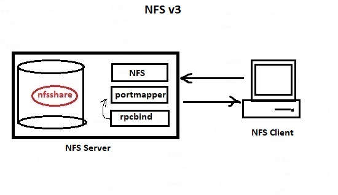

# 209.2. NFS Server Configuration

## **209.2 NFS Server Configuration**

**Weight:** 3

**Description:** Candidates should be able to export filesystems using NFS. This objective includes access restrictions, mounting an NFS filesystem on a client and securing NFS.

**Key Knowledge Areas:**

* NFS version 3 configuration files
* NFS tools and utilities
* Access restrictions to certain hosts and/or subnets
* Mount options on server and client
* TCP Wrappers
* Awareness of NFSv4

**Terms and Utilities:**

* /etc/exports
* exportfs
* showmount
* nfsstat
* /proc/mounts
* /etc/fstab
* rpcinfo
* mountd
* portmapper

## What is NFS?

NFS \(Network File System\) is basically developed for sharing of files and folders between Linux/Unix systems by Sun Microsystems in 1980. It allows us to mount our local file systems over a network and remote hosts to interact with them as they are mounted locally on the same system. With the help of NFS, we can set up file sharing between Unix to Linux system and visa versa.

#### NFS Advantages

* NFS allows local access to remote files.
* It uses standard client/server architecture for file sharing between all unix based machines.
* With NFS it is not necessary that both machines run on the same OS.
* With the help of NFS we can configure centralized storage solutions.
* Users get their data with no concern about  physical location of data.
* No manual refresh needed for new files.
* Newer version of NFS also supports acl, pseudo root mounts.
* Can be secured with Firewalls and Kerberos.

#### NFS Versions

Currently, there are three versions of NFS. NFS version 2 \(NFSv2\) is older and is widely supported. NFS version 3 \(NFSv3\) has more features but has some security issues and dis advantages. And NFS version 4 \(NFSv4\) wich is lates full feature and secure version of NFS.

* NFS v2 – March 1989
* NFS v3 – June 1995
* NFS v4 – December 2000
* NFS v4.1 – January 2010

For LPIC2 exam we are required to work NFS version3 but we also have to know a little bit about NFS version4 and differences.

#### NFS v3

The NFS server version 3 service includes three facilities:



* nfs: It translates remote file sharing requests into requests on the local file system.
* portmap : It maps calls made from other machines to the correct RPC service .it uses rpcbind\(not required with NFSv4\).
* rpcbind: The rpcbind service redirects the client to the proper port number so it can communicate with the requested service.\(not required with NFSv4\)

#### NFS v3 Disadvantage

Probably the greatest disadvantage is the issue of security. Because NFS v3 is based on RPC, remote procedure calls, it is inherently insecure and should only be used on a trusted network behind a firewall. This is not to say that steps can't be taken to secure NFS but it still will not be ready for the wilds of the open Internet.

#### NFS v4

* In NFSv4 , there is no more rpcbind and portmapper. 
* In NFSv3 there is a nfslock service which that starts the appropriate RPC processes to allow NFS clients to lock files on the server but NFSv4 has native file locking mechanisem.
* In NFSv3 rpc.mountd  service is responsible for mounting and unmounting of file systems, In NFSv4 there no rpc.mound.
* While NFSv3 Works with TCP/UDP ports, NFSv4 just works with TCP

### Installing NFSv3

Lets install NFS server \(v3\) on a CentOS system:

```text
[root@centos7-1 ~]# yum nfs-utils rpcbin
Loaded plugins: fastestmirror, langpacks
No such command: nfs-utils. Please use /bin/yum --help
[root@centos7-1 ~]# yum install nfs-utils rpcbind
Loaded plugins: fastestmirror, langpacks
Loading mirror speeds from cached hostfile
 * base: mirrors.gigenet.com
 * epel: mirror.clarkson.edu
 * extras: mirror.cs.vt.edu
 * updates: mirrors.sorengard.com
Package 1:nfs-utils-1.3.0-0.54.el7.x86_64 already installed and latest version
Package rpcbind-0.2.0-44.el7.x86_64 already installed and latest version
Nothing to do
```

#### Important  NFS Configuration Files:

**/etc/exports** : Its a main configuration file of NFS, all exported files and directories are defined in this file at the NFS Server end.

**/etc/fstab** : To mount a NFS directory on your system across the reboots, we need to make an entry in /etc/fstab.

**/etc/sysconfig/nfs** : Configuration file of NFS to control on which port rpc and other services are listening.

* We will spend more time on them during the course. Now lets create something to share:

```text
[root@centos7-1 ~]# mkdir /nfsshare
[root@centos7-1 ~]# chmod 777 /nfsshare
```

We will discuse about NFS security later in this course but for now keep it simple and grant 777 permission.\( Also in RedHat based distributions do not forget to turn off selinux by using `setenforce 0`command.

Next we have to export this file system to one or more clients.

## /etc/exports

Its a main configuration file of NFS, all exported files and directories are defined in this file at the NFS Server end. A line for an exported file system has the following structure:

```text
<export> <host1>(<options>) <hostN>(<options>)...
```

This file might be populated by some examples and explanation or might not exist and should be created, like here on CentOS:

```text
[root@centos7-1 ~]# cat /etc/exports
/nfsshare    centos7-2(rw) (ro)
```

In this example we have shared /nfsshared directory with centos7-2 client with read and write permissions. Also we have let everybody to have readonly permission. It is possible to use Ip addresses and wild cards intstead of HostNames.The following methods can be used to specify host names:

* single host — Where one particular host is specified with a fully qualified domain name, hostname, or IP address.
* wildcards — Where a \* or ? character is used to take into account a grouping of fully qualified domain names that match a particular string of letters. Wildcards should not be used with IP addresses; however, it is possible for them to work accidentally if reverse DNS lookups fail.
* IP networks — Allows the matching of hosts based on their IP addresses within a larger network. For example, 192.168.0.0/28 allows the first 16 IP addresses, from 192.168.0.0 to 192.168.0.15, to access the exported file system, but not 192.168.0.16 and higher.
* netgroups —This option is pretty old but noy bad to know. It Permits an NIS netgroup name, written as @&lt;group-name&gt;, to be used. This effectively puts the NIS server in charge of access control for this exported file system, where users can be added and removed from an NIS group without affecting /etc/exports.

Some other options we can use in /etc/exports file for file sharing is as follows:

* **ro**: With the help of this option we can provide read only access to the shared files i.e client will only be able to read.
* **rw**: This option allows the client server to both read and write access within the shared directory.
* **sync**: Syncronize nfs file system to the disk immediatly, so this way we reduce the chance of ifle system corruption.
* **no\_subtree\_check**: This option prevents the subtree checking. When a shared directory is the subdirectory of a larger file system, nfs performs scans of every directory above it, in order to verify its permissions and details. Disabling the subtree check may increase the reliability of NFS, but reduce security.
* **no\_root\_squash**: This phrase allows root to connect to the designated directory. \[it needs more explanation:\]

#### Mapping user's ides and group ides, What NFS does?

The way that NFS permissions work is that , they are the permissions both for subdirectories within the share as well as files created by users, they have userid\(uid\) and groupid\(gid\) of the user on the remote system that creates them. The problem is that those user ides and group ides can be different on different systems. From the security perspective that sounds like a problem.Why? Lets imagine in a client server environment we have a user with uid 1101\( on the server\) called user1, and we have user3 on the remote system \(client system\) with the same user id 1101.

The problem is that any files created by user1 locally on the server \(or from any other systems \) , are made with permissions for uid1101. Now imagine another user like user3 with the same uid 1101 is permitted to get connected to the NFS server. user3 is another person, from different computer but he/she has uid 1101 so he/she would have the same persmissions as user1 has.

So we have problem in syncronizing user's permissions becaused they are handled by user id and group id. So we need to map uid and gid between client and server for users who access them. It could be done by choosing right uid and gid while we are creating users. also there are some other solutions like OpenLDAP to automatically syncronized accounts.

But the option that we are talking about , whould be different from root user perspective. the root user is going to have thae same id on the both client and server. so lets explain it again :

* **root\_squash** : says do not map root client account to the server root account, it prevents remote root user to have the same access to the file system as the server root user.
* **no\_root\_squash**: says hey go and map users root client acount to the server root account. It depends on you and security profile of your organization.

Now that we know about more options, lets complete our configuration:

```text
[root@centos7-1 ~]# cat /etc/exports
/nfsshare    centos7-2(rw,no_root_squash,sync) (ro)
```

Now we need to start a couple of processes we need to start, we need to start nfs server and we need to start rpcbind process.One Supports the other, and we need both of them so NFS server works corectlly.

```text
[root@centos7-1 ~]# systemctl start rpcbind
[root@centos7-1 ~]# systemctl status rpcbind
● rpcbind.service - RPC bind service
   Loaded: loaded (/usr/lib/systemd/system/rpcbind.service; disabled; vendor preset: enabled)
   Active: active (running) since Wed 2018-07-04 04:28:05 EDT; 3 days ago
  Process: 24901 ExecStart=/sbin/rpcbind -w $RPCBIND_ARGS (code=exited, status=0/SUCCESS)
 Main PID: 24902 (rpcbind)
    Tasks: 1
   Memory: 660.0K
   CGroup: /system.slice/rpcbind.service
           └─24902 /sbin/rpcbind -w

Jul 04 04:28:05 centos7-1 systemd[1]: Starting RPC bind service...
Jul 04 04:28:05 centos7-1 systemd[1]: Started RPC bind service.

[root@centos7-1 ~]# systemctl start nfs.service
[root@centos7-1 ~]# systemctl status nfs.service
● nfs-server.service - NFS server and services
   Loaded: loaded (/usr/lib/systemd/system/nfs-server.service; disabled; vendor preset: disabled)
   Active: active (exited) since Sun 2018-07-08 03:04:40 EDT; 43s ago
  Process: 29178 ExecStart=/usr/sbin/rpc.nfsd $RPCNFSDARGS (code=exited, status=0/SUCCESS)
  Process: 29175 ExecStartPre=/bin/sh -c /bin/kill -HUP `cat /run/gssproxy.pid` (code=exited, status=0/SUCCESS)
  Process: 29172 ExecStartPre=/usr/sbin/exportfs -r (code=exited, status=0/SUCCESS)
 Main PID: 29178 (code=exited, status=0/SUCCESS)
    Tasks: 0
   Memory: 0B
   CGroup: /system.slice/nfs-server.service

Jul 08 03:04:40 centos7-1 systemd[1]: Starting NFS server and services...
Jul 08 03:04:40 centos7-1 exportfs[29172]: exportfs: No host name given with /nfss...ng
Jul 08 03:04:40 centos7-1 systemd[1]: Started NFS server and services.
Hint: Some lines were ellipsized, use -l to show in full.
```

nfsd process is primary process that handles clients. But Because RPC-based services rely on rpcbind to make all connections with incoming client requests, rpcbind must be available before any of these services start,\(1-rpc--&gt;2-nfs\) lets check the rpc services and tale a closer look at them:

```text
[root@centos7-1 ~]# ps ax | grep rpc
   699 ?        S<     0:00 [rpciod]
 29162 ?        Ss     0:00 /usr/sbin/rpc.statd
 29450 ?        Ss     0:00 /sbin/rpcbind -w
 29451 ?        Ss     0:00 /usr/sbin/rpc.mountd
 29452 ?        Ss     0:00 /usr/sbin/rpc.idmapd
 29623 pts/0    S+     0:00 grep --color=auto rpc
```

Based on Linux distro that we are using, we might see some additional rpc services. following RPC processes facilitate NFS services.For those who like details:

```text
The following RPC processes facilitate NFS services:

rpc.mountd — This process receives mount requests from NFS clients and verifies the requested file system is currently exported. This process is started automatically by the nfs service and does not require user configuration. This is not used with NFSv4.

rpc.nfsd — Allows explicit NFS versions and protocols the server advertises to be defined. It works with the Linux kernel to meet the dynamic demands of NFS clients, such as providing server threads each time an NFS client connects. This process corresponds to the nfs service.

rpc.lockd — allows NFS clients to lock files on the server. If rpc.lockd is not started, file locking will fail. rpc.lockd implements the Network Lock Manager (NLM) protocol. This process corresponds to the nfslock service. This is not used with NFSv4.

rpc.statd — This process implements the Network Status Monitor (NSM) RPC protocol which notifies NFS clients when an NFS server is restarted without being gracefully brought down. This process is started automatically by the nfslock service and does not require user configuration. This is not used with NFSv4.

rpc.rquotad — This process provides user quota information for remote users. This process is started automatically by the nfs service and does not require user configuration.

rpc.idmapd — This process provides NFSv4 client and server upcalls which map between on-the-wire NFSv4 names (which are strings in the form of user@domain) and local UIDs and GIDs. For idmapd to function with NFSv4, the /etc/idmapd.conf must be configured. This service is required for use with NFSv4.
```

among them rpc.idmap is for hybrid NFSv3 and NFSv4 systems, which is why we see here.

### rpcinfo

`rpcbind`provides coordination between RPC services and the port numbers used to communicate with them, it is useful to view the status of current RPC services using`rpcbind`when troubleshooting. The`rpcinfo`command shows each RPC-based service with port numbers, an RPC program number, a version number, and an IP protocol type \(TCP or UDP\).

rpcinfo makes an RPC call to an RPC server and reports what it finds. It has lots of options but for now we just show how rpc feeds portmap:

```text
[root@centos7-1 ~]# rpc
rpcbind      rpcdebug     rpc.gssd     rpcinfo      rpc.nfsd     rpc.statd
rpcclient    rpcgen       rpc.idmapd   rpc.mountd   rpc.rquotad  

[root@centos7-1 ~]# rpcinfo -?
rpcinfo: invalid option -- '?'
Usage: rpcinfo [-m | -s] [host]
       rpcinfo -p [host]
       rpcinfo -T netid host prognum [versnum]
       rpcinfo -l host prognum versnum
       rpcinfo [-n portnum] -u | -t host prognum [versnum]
       rpcinfo -a serv_address -T netid prognum [version]
       rpcinfo -b prognum versnum
       rpcinfo -d [-T netid] prognum versnum

[root@centos7-1 ~]# rpcinfo -p
   program vers proto   port  service
    100000    4   tcp    111  portmapper
    100000    3   tcp    111  portmapper
    100000    2   tcp    111  portmapper
    100000    4   udp    111  portmapper
    100000    3   udp    111  portmapper
    100000    2   udp    111  portmapper
    100024    1   udp  39073  status
    100024    1   tcp  53933  status
    100005    1   udp  20048  mountd
    100005    1   tcp  20048  mountd
    100005    2   udp  20048  mountd
    100005    2   tcp  20048  mountd
    100005    3   udp  20048  mountd
    100005    3   tcp  20048  mountd
    100003    3   tcp   2049  nfs
    100003    4   tcp   2049  nfs
    100227    3   tcp   2049  nfs_acl
    100003    3   udp   2049  nfs
    100003    4   udp   2049  nfs
    100227    3   udp   2049  nfs_acl
    100021    1   udp  58591  nlockmgr
    100021    3   udp  58591  nlockmgr
    100021    4   udp  58591  nlockmgr
    100021    1   tcp  37458  nlockmgr
    100021    3   tcp  37458  nlockmgr
    100021    4   tcp  37458  nlockmgr
```

If one of the NFS services does not start up correctly,`rpcbind`will be unable to map RPC requests from clients for that service to the correct port. In many cases, if NFS is not present in`rpcinfo`output, restarting NFS causes the service to correctly register with`rpcbind`and begin working. For more information and a list of options on`rpcinfo`, refer to its`man`page.

### TCP Wrappers

The`rpcbind`service uses TCP wrappers for access control, and access control rules for`rpcbind`affect all __ RPC-based services. Alternatively, it is possible to specify access control rules using /etc/host.allow and etc/host.deny files.

By default both of hosts.allow and hosts.deny files are blank. So the access will be granted to any client.

```text
[root@centos7-1 ~]# cat /etc/hosts.allow 
#
# hosts.allow    This file contains access rules which are used to
#        allow or deny connections to network services that
#        either use the tcp_wrappers library or that have been
#        started through a tcp_wrappers-enabled xinetd.
#
#        See 'man 5 hosts_options' and 'man 5 hosts_access'
#        for information on rule syntax.
#        See 'man tcpd' for information on tcp_wrappers
#

[root@centos7-1 ~]# cat /etc/hosts.deny 
#
# hosts.deny    This file contains access rules which are used to
#        deny connections to network services that either use
#        the tcp_wrappers library or that have been
#        started through a tcp_wrappers-enabled xinetd.
#
#        The rules in this file can also be set up in
#        /etc/hosts.allow with a 'deny' option instead.
#
#        See 'man 5 hosts_options' and 'man 5 hosts_access'
#        for information on rule syntax.
#        See 'man tcpd' for information on tcp_wrappers
#
```

Keep in mind that hosts.allow over rides hosts.deny. For example if we want to let specific network range can access and use "portmap" we specify `portmap: 192.168.10.0/24` in `/etc/hosts.allow` and then define `portmanp: ALL` in `/etc/hosts.deny` . Do not forget to restart `rpcbind` and `nfs` service in order to changes take effect.

### exportfs

that is a utility to show what shares are available.

```text
[root@centos7-1 ~]# exportfs 
/nfsshare         centos7-1.example.com
/nfsshare         <world>
```

Some usefull switches are:

| exportfs examples | Description |
| :--- | :--- |
| exportfs -v | Displays a list of shares files and options on a server |
| exportfs -a | Exports all shares listed in /etc/exports, or given name |
| exportfs -u | Unexports all shares listed in /etc/exports, or given name |
| exportfs -r | Refresh the server’s list after modifying /etc/exports |

### nfsstat

nfstat let us config client connections to export

```text
[root@centos7-1 ~]# nfsstat 
Server rpc stats:
calls      badcalls   badclnt    badauth    xdrcall
0          0          0          0          0       

[root@centos7-1 ~]# nfsstat --help
Usage: nfsstat [OPTION]...

  -m, --mounts        Show statistics on mounted NFS filesystems
  -c, --client        Show NFS client statistics
  -s, --server        Show NFS server statistics
  -2            Show NFS version 2 statistics
  -3            Show NFS version 3 statistics
  -4            Show NFS version 4 statistics
  -o [facility]        Show statistics on particular facilities.
     nfs        NFS protocol information
     rpc        General RPC information
     net        Network layer statistics
     fh            Usage information on the server's file handle cache
     rc            Usage information on the server's request reply cache
     all        Select all of the above
  -v, --verbose, --all    Same as '-o all'
  -r, --rpc        Show RPC statistics
  -n, --nfs        Show NFS statistics
  -Z[#], --sleep[=#]    Collects stats until interrupted.
                Cumulative stats are then printed
                      If # is provided, stats will be output every
                # seconds.
  -S, --since file    Shows difference between current stats and those in 'file'
  -l, --list        Prints stats in list format
  --version        Show program version
  --help        What you just did

[root@centos7-1 ~]# nfsstat -m
[root@centos7-1 ~]#
```

### NFS Client Configuration

Lets configure NFS client, First we need to have some utilites set to mount NFS File system\(Centos7\):

```text
[root@centos7-2 ~]# yum install nfs-utils nfs-utils-lib rpcbind
[root@centos7-2 ~]# systemctl start rpcbind
[root@centos7-2 ~]# systemctl start nfs
```

Now we create a mount point before mounting NFS file system under /mnt directory :

```text
[root@centos7-2 ~]# cd /mnt/
[root@centos7-2 mnt]# mkdir nfsmounthere
[root@centos7-2 mnt]# ls -l
total 0
drwxr-xr-x. 2 root root 6 Jul 10 02:39 nfsmounthere
```

and for demostrating the discussion we had about user id mapping and group id , we create two users:

```text
[root@centos7-2 mnt]# useradd -u 1101 -m nfsuser1
[root@centos7-2 mnt]# useradd -u 1102 -m nfsuser2

[root@centos7-2 mnt]# cat /etc/passwd | grep nfsuser
nfsuser1:x:1101:1101::/home/nfsuser1:/bin/bash
nfsuser2:x:1102:1102::/home/nfsuser2:/bin/bash

[root@centos7-2 mnt]# passwd nfsuser1
Changing password for user nfsuser1.
New password: 
Retype new password: 
passwd: all authentication tokens updated successfully.

[root@centos7-2 mnt]# passwd nfsuser2
Changing password for user nfsuser2.
New password: 
Retype new password: 
passwd: all authentication tokens updated successfully.

[root@centos7-2 mnt]# getent passwd nfsuser1
nfsuser1:x:1101:1101::/home/nfsuser1:/bin/bash
[root@centos7-2 mnt]# getent passwd nfsuser2
nfsuser2:x:1102:1102::/home/nfsuser2:/bin/bash
```

we can use showmount command to findout what has been shared on the server:

```text
[nfsuser2@centos7-2 ~]$ showmount --help
Usage: showmount [-adehv]
       [--all] [--directories] [--exports]
       [--no-headers] [--help] [--version] [host]
```

| showmount command examples | Description |
| :--- | :--- |
| showmount -e | Shows the available shares on your local machine |
| showmount -e &lt;server-ip or hostname&gt; | Lists the available shares at the remote server |
| showmount -d | Lists all the sub directories |

```text
[root@centos7-2 ~]# showmount -e 192.168.10.133
clnt_create: RPC: Port mapper failure - Unable to receive: errno 113 (No route to host)
```

Ops lets check remote rpc service with rpcinfo command:

```text
[root@centos7-2 ~]# rpcinfo -p 192.168.10.133
rpcinfo: can't contact portmapper: RPC: Remote system error - No route to host
```

Oh No, we have forgot to set NFS required ports on the server firewall, so :

```text
[root@centos7-1 ~]# firewall-cmd --permanent --add-service=rpc-bind
success
[root@centos7-1 ~]# firewall-cmd --permanent --add-service=mountd
success
[root@centos7-1 ~]# firewall-cmd --permanent --add-port=2049/tcp
success
[root@centos7-1 ~]# firewall-cmd --permanent --add-port=2049/udp
success
[root@centos7-1 ~]# firewall-cmd --reload
success
```

okey , lets check it again:

```text
[root@centos7-2 ~]# rpcinfo -p 192.168.10.133
   program vers proto   port  service
    100000    4   tcp    111  portmapper
    100000    3   tcp    111  portmapper
    100000    2   tcp    111  portmapper
    100000    4   udp    111  portmapper
    100000    3   udp    111  portmapper
    100000    2   udp    111  portmapper
    100024    1   udp  51943  status
    100024    1   tcp  34420  status
    100005    1   udp  20048  mountd
    100005    1   tcp  20048  mountd
    100005    2   udp  20048  mountd
    100005    2   tcp  20048  mountd
    100005    3   udp  20048  mountd
    100005    3   tcp  20048  mountd
    100003    3   tcp   2049  nfs
    100003    4   tcp   2049  nfs
    100227    3   tcp   2049  nfs_acl
    100003    3   udp   2049  nfs
    100003    4   udp   2049  nfs
    100227    3   udp   2049  nfs_acl
    100021    1   udp  39146  nlockmgr
    100021    3   udp  39146  nlockmgr
    100021    4   udp  39146  nlockmgr
    100021    1   tcp  46184  nlockmgr
    100021    3   tcp  46184  nlockmgr
    100021    4   tcp  46184  nlockmgr

[root@centos7-2 ~]# showmount -e 192.168.10.133
Export list for 192.168.10.133:
/nfsshare (everyone)
```

and now it is mounting time:

```text
[root@centos7-2 ~]# mount 192.168.10.133:/nfsshare /mnt/nfsmounthere/
[root@centos7-2 ~]# df -h
Filesystem                          Size  Used Avail Use% Mounted on
/dev/mapper/centos_centos7--2-root   17G  3.7G   14G  22% /
devtmpfs                            1.9G     0  1.9G   0% /dev
tmpfs                               1.9G     0  1.9G   0% /dev/shm
tmpfs                               1.9G  9.1M  1.9G   1% /run
tmpfs                               1.9G     0  1.9G   0% /sys/fs/cgroup
/dev/sda1                          1014M  179M  836M  18% /boot
tmpfs                               378M   20K  378M   1% /run/user/1000
tmpfs                               378M     0  378M   0% /run/user/0
192.168.10.133:/nfsshare             46G  4.6G   41G  11% /mnt/nfsmounthere
```

lets create a file there:

```text
[root@centos7-2 ~]# cd /mnt/nfsmounthere/
[root@centos7-2 nfsmounthere]# echo "hello" > hello.txt
[root@centos7-2 nfsmounthere]# ls -l
total 4
-rw-r--r--. 1 root root 6 Jul 10 04:48 hello.txt
```

as we have set no root squash option, if root user create a file it would have root permisions, wheather from the client mashine or the server:

```text
[root@centos7-1 ~]# cd /nfsshare/
[root@centos7-1 nfsshare]# ls -l
total 4
-rw-r--r--. 1 root root 6 Jul 10 04:48 hello.txt
[root@centos7-1 nfsshare]# cat hello.txt 
hello
```

see boot root users have the same permissions to this file, if we have used no root squash, as root users wouldn't be mapped among client and server it would get `nfsnobody` user permissions.

Lets do another example, let create two text files, nfsuser1 created user1.txt and nfsuser2 creates user2.txt file:

```text
[root@centos7-2 nfsmounthere]# su nfsuser1
[nfsuser1@centos7-2 nfsmounthere]$ echo " user1 id 1101 from client" > user1.txt
[nfsuser1@centos7-2 nfsmounthere]$ su nfsuser2
Password: 
[nfsuser2@centos7-2 nfsmounthere]$ echo " user2 id 1102 from client" > user2.txt
[nfsuser2@centos7-2 nfsmounthere]$ ls -l
total 12
-rw-r--r--. 1 root     root      6 Jul 10 04:48 hello.txt
-rw-rw-r--. 1 nfsuser1 nfsuser1 27 Jul 10 04:58 user1.txt
-rw-rw-r--. 1 nfsuser2 nfsuser2 27 Jul 10 04:59 user2.txt

[nfsuser2@centos7-2 nfsmounthere]$ echo "I am user2 from client, i was here too" >> user1.txt 
bash: user1.txt: Permission denied
```

Now on the server we create nfsuser1 with uid 1102 \(this id is nfsuser2's id on client machine\):

```text
[root@centos7-1 nfsshare]# useradd -u 1101 -m nfsuser2
[root@centos7-1 nfsshare]# passwd nfsuser2
Changing password for user nfsuser2.
New password: 
Retype new password: 
passwd: all authentication tokens updated successfully.
[root@centos7-1 nfsshare]# su nfsuser2
[nfsuser2@centos7-1 nfsshare]$ cd /nfsshare/
[nfsuser2@centos7-1 nfsshare]$ ls -l
total 12
-rw-r--r--. 1 root     root      6 Jul 10 04:48 hello.txt
-rw-rw-r--. 1 nfsuser2 nfsuser2 27 Jul 10 04:58 user1.txt
-rw-rw-r--. 1     1102     1102 27 Jul 10 04:59 user2.txt
[nfsuser2@centos7-1 nfsshare]$ echo "I am user2 from the server, I can do it HAHA" >> user1.txt 
[nfsuser2@centos7-1 nfsshare]$ cat user1.txt 
 user1 id 1101 from client
I am user2 from the server, I can do it HAHA
```

Hm, It seem unsecure hm? Be carefull about usning NFSv3 and use OpenLDAP with it.

### NFS /etc/fstab options

As u have seen we use mount command to mount NFS File System on the clint computer, that is not permanent and it would dissapear after rebooting the system.

```text
[root@centos7-2 ~]# umount /mnt/nfsmounthere/
[root@centos7-2 ~]# vim /etc/fstab

[root@centos7-2 ~]# cat /etc/fstab 

#
# /etc/fstab
# Created by anaconda on Sun Jun 10 02:22:51 2018
#
# Accessible filesystems, by reference, are maintained under '/dev/disk'
# See man pages fstab(5), findfs(8), mount(8) and/or blkid(8) for more info
#
/dev/mapper/centos_centos7--2-root /                       xfs     defaults        0 0
UUID=b388d696-cb03-4156-9576-c2cddf954366 /boot                   xfs     defaults        0 0
/dev/mapper/centos_centos7--2-swap swap                    swap    defaults        0 0

# creating an entry to mount our NFS share
192.168.10.133:/nfsshare    /mnt/nfsmounthere    nfs    defaults    0 0
```

and lets chek it:

```text
[root@centos7-2 ~]# mount -a
[root@centos7-2 ~]# df -h
Filesystem                          Size  Used Avail Use% Mounted on
/dev/mapper/centos_centos7--2-root   17G  3.7G   14G  22% /
devtmpfs                            1.9G     0  1.9G   0% /dev
tmpfs                               1.9G     0  1.9G   0% /dev/shm
tmpfs                               1.9G  9.1M  1.9G   1% /run
tmpfs                               1.9G     0  1.9G   0% /sys/fs/cgroup
/dev/sda1                          1014M  179M  836M  18% /boot
tmpfs                               378M  4.0K  378M   1% /run/user/42
tmpfs                               378M   20K  378M   1% /run/user/1000
192.168.10.133:/nfsshare             46G  4.6G   41G  11% /mnt/nfsmounthere

[root@centos7-2 ~]# cd /mnt/nfsmounthere/
[root@centos7-2 nfsmounthere]# ls -l
total 12
-rw-r--r--. 1 root     root      6 Jul 10 04:48 hello.txt
-rw-rw-r--. 1 nfsuser1 nfsuser1 72 Jul 10 05:06 user1.txt
-rw-rw-r--. 1 nfsuser2 nfsuser2 27 Jul 10 04:59 user2.txt
```

As it is a network file system it can make problems during boot process if network is not available, so we change the configurations, there are number of different defaults which determined the behaviour of our attemted mount depending upon its availability.We can indicated weather we want to mount soft or hard. If the server is unavailable and we set it to soft, it would stop trying after determining NFS server is unavailable, if we set it to hard mount it would countinue trying upto the timeout option.

We can also set it foreground or background, fg or bg. It determines if the attempt for mounting happens on the foreground, then the boot of system would wait until it succeeded or fail . Or in the background , so the boot can countinue silently attemting to mount while boot process is doing its job. it usually used with Hard mount option, inorder to the system from hanging.

timeout option wich is defined with tmeo=10 in seconds, and indicates timeout value before the mount attempts fail.

retrans option, defines how many times the system will retry to mount duting a boot.

rsize and wsize which are the maximum read and write sizes requests, allowed in the remote server. Typically set to 8MegaBytes in size or 8192. We can perforamncing testing if we have very very small files or large of files.

ro and rw it is obvious as you can guess it mount file system Read-Only or for Read-Write, but if share Read-Only on the server side it would be Read-Only.

```text
[root@centos7-2 nfsmounthere]# cd
[root@centos7-2 ~]# umount /mnt/nfsmounthere/
[root@centos7-2 ~]# vim /etc/fstab 
[root@centos7-2 ~]# cat /etc/fstab 

#
# /etc/fstab
# Created by anaconda on Sun Jun 10 02:22:51 2018
#
# Accessible filesystems, by reference, are maintained under '/dev/disk'
# See man pages fstab(5), findfs(8), mount(8) and/or blkid(8) for more info
#
/dev/mapper/centos_centos7--2-root /                       xfs     defaults        0 0
UUID=b388d696-cb03-4156-9576-c2cddf954366 /boot                   xfs     defaults        0 0
/dev/mapper/centos_centos7--2-swap swap                    swap    defaults        0 0

# creating an entry to mount our NFS share
192.168.10.133:/nfsshare    /mnt/nfsmounthere    nfs    hard,bg,timeo=300,rsize=1024,wsize=2048        0 0

[root@centos7-2 ~]# mount -a
[root@centos7-2 ~]# df -h
Filesystem                          Size  Used Avail Use% Mounted on
/dev/mapper/centos_centos7--2-root   17G  3.7G   14G  22% /
devtmpfs                            1.9G     0  1.9G   0% /dev
tmpfs                               1.9G     0  1.9G   0% /dev/shm
tmpfs                               1.9G  9.1M  1.9G   1% /run
tmpfs                               1.9G     0  1.9G   0% /sys/fs/cgroup
/dev/sda1                          1014M  179M  836M  18% /boot
tmpfs                               378M  4.0K  378M   1% /run/user/42
tmpfs                               378M   20K  378M   1% /run/user/1000
192.168.10.133:/nfsshare             46G  4.6G   41G  11% /mnt/nfsmounthere
```

Thats all.

