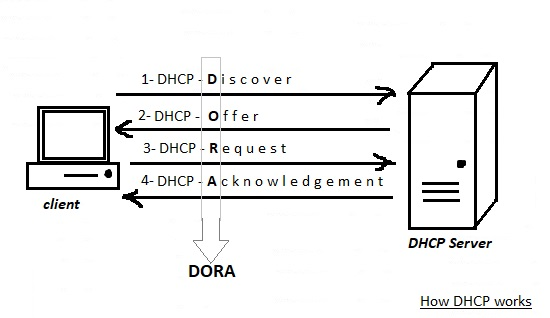
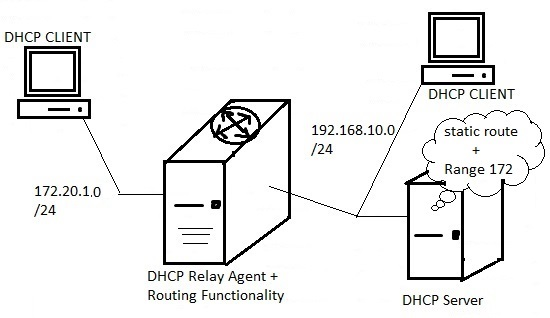

# 210.1. DHCP configuration

## **210.1 DHCP configuration**

**Weight:** 2

**Description:** Candidates should be able to configure a DHCP server. This objective includes setting default and per client options, adding static hosts and BOOTP hosts. Also included is configuring a DHCP relay agent and maintaining the DHCP server.

**Key Knowledge Areas:**

* DHCP configuration files, terms and utilities
* Subnet and dynamically-allocated range setup
* Awareness of DHCPv6 and IPv6 Router Advertisements

**Terms and Utilities:**

* dhcpd.conf
* dhcpd.leases
* DHCP Log messages in syslog or systemd journal
* arp
* dhcpd
* radvd
* radvd.conf

## What is DHCP?

Dynamic Host Configuration Protocol \(DHCP\) is a network protocol that is used to enable host computers to be automatically assigned IP addresses and related network configurations from a server. DHCP reduce the need for a network administrator or a user to manually assign IP addresses to all network devices .

## How DHCP works?

The following steps show how DHCP actually works:



1. Once a client \(that is configured to use DHCP\) and connected to a network boots up, it broadcats a DHCPDISCOVER packet to all the network. and attempts to find a DHCP server on the wire.
2. Router/ Switch forwards the DHCPDISCOVER to the proper DHCP Server\(as configured\).When the DHCP server receives the DHCPDISCOVER request packet, it replies with a DHCPOFFER packet.Based on the configuration of available addresses, the client hardware address and/or host name and the configuration of DHCP server software determines the appropriate address to assign to the machine which originated the request. The the address temprorary reserved for the client.  
3. Then the client gets the DHCPOFFER packet, and it sends a DHCPREQUEST packet to the server showing it is ready to receive the network configuration information provided in the DHCPOFFER packet.
4. Finally, after the DHCP server receives the DHCPREQUEST packet from the client, it sends the DHCPACK packet showing that the client is now permitted to use the IP address assigned to it for \(configured\) period of time.

DHCP use udp port number 67 be default.

## Implementing DHCP Server

DHCP packages \(on the server side\) are not typically installed by default in most distributions.

* Packages can be:
* dhcp
* dhcp-server
* isc-dhcp-server \(older\)
* dhcp3-server \(LPIC-2 Exam Objectivd\)
* dhcp4-server

We use ubuntu for demontration with two network card:

```text
root@server1:~# ip  a s
1: lo: <LOOPBACK,UP,LOWER_UP> mtu 65536 qdisc noqueue state UNKNOWN group default qlen 1000
    link/loopback 00:00:00:00:00:00 brd 00:00:00:00:00:00
    inet 127.0.0.1/8 scope host lo
       valid_lft forever preferred_lft forever
    inet6 ::1/128 scope host 
       valid_lft forever preferred_lft forever
2: ens33: <BROADCAST,MULTICAST,UP,LOWER_UP> mtu 1500 qdisc pfifo_fast state UP group default qlen 1000
    link/ether 00:0c:29:03:64:0d brd ff:ff:ff:ff:ff:ff
    inet 192.168.10.129/24 brd 192.168.10.255 scope global ens33
       valid_lft forever preferred_lft forever
    inet6 fe80::6650:e873:a8c5:ea55/64 scope link 
       valid_lft forever preferred_lft forever
3: ens38: <BROADCAST,MULTICAST,UP,LOWER_UP> mtu 1500 qdisc pfifo_fast state UP group default qlen 1000
    link/ether 00:0c:29:03:64:17 brd ff:ff:ff:ff:ff:ff
    inet 192.168.1.129/24 brd 192.168.1.255 scope global dynamic ens38
       valid_lft 1520sec preferred_lft 1520sec
    inet6 fe80::68fa:5477:cc90:fc/64 scope link 
       valid_lft forever preferred_lft forever
```

Lets serach for the package name in ubuntu and starts:

```text
root@server1:~# apt-cache search dhcp | grep server
dnsmasq-base - Small caching DNS proxy and DHCP/TFTP server
isc-dhcp-dbg - ISC DHCP server for automatic IP address assignment (debuging symbols)
isc-dhcp-dev - API for accessing and modifying the DHCP server and client state
isc-dhcp-server - ISC DHCP server for automatic IP address assignment
maas-dhcp - MAAS DHCP server
resolvconf - name server information handler
strongswan-plugin-dhcp - strongSwan plugin for forwarding DHCP request to a server
bootp - server for the bootp protocol with DHCP support
cobbler - Install server
cobbler-common - Cobbler Install server - common files
cobbler-web - Cobbler Install server - web interface
dhcp-probe - network DHCP or BootP server discover
dhcpy6d - MAC address aware DHCPv6 server written in Python
dhis-server - Dynamic Host Information System - server
dibbler-server - portable DHCPv6 server
dibbler-server-dbg - portable DHCPv6 server
dnsmasq - Small caching DNS proxy and DHCP/TFTP server
isc-dhcp-server-ldap - DHCP server that uses LDAP as its backend
kea-admin - Administration utilities for ISC KEA DHCP server
kea-common - Common libraries for the ISC KEA DHCP server
kea-dev - Development headers for ISC KEA DHCP server
kea-dhcp-ddns-server - ISC KEA DHCP Dynamic DNS service
kea-dhcp4-server - ISC KEA IPv4 DHCP server
kea-dhcp6-server - ISC KEA IPv6 DHCP server
kea-doc - Documentation for ISC KEA DHCP server
ltsp-server-standalone - complete LTSP server environment
mythbuntu-diskless-server - Basic Mythbuntu-diskless server environment
mythbuntu-diskless-server-standalone - Mythbuntu-diskless server environment with DHCP server
python-cobbler - Install server - python libraries.
python-pydhcplib - Python DHCP client/server library
udhcpd - Provides the busybox DHCP server implementation
uec-provisioning-dhcpd - the UEC Provisioning DHCP server
wide-dhcpv6-server - DHCPv6 server for automatic IPv6 hosts configuration

root@server1:~# apt install isc-dhcp-server
```

Now lets see where are configuration and other files:

```text
root@server1:~# dpkg -L isc-dhcp-server 
/.
/etc
/etc/logcheck
/etc/logcheck/ignore.d.server
/etc/logcheck/ignore.d.server/isc-dhcp-server
/etc/dhcp
/etc/dhcp/dhcpd.conf
/etc/apparmor.d
/etc/apparmor.d/dhcpd.d
/etc/apparmor.d/usr.sbin.dhcpd
/etc/init.d
/etc/init.d/isc-dhcp-server
/etc/init
/etc/init/isc-dhcp-server6.conf
/etc/init/isc-dhcp-server.conf
/lib
/lib/systemd
/lib/systemd/system
/lib/systemd/system/isc-dhcp-server6.service
/lib/systemd/system/isc-dhcp-server.service
/var
/var/lib
/var/lib/dhcp
/usr
/usr/bin
/usr/bin/omshell
/usr/sbin
/usr/sbin/dhcp-lease-list
/usr/sbin/dhcpd
/usr/share
/usr/share/doc
/usr/share/doc/isc-dhcp-server
/usr/share/doc/isc-dhcp-server/changelog.Debian.gz
/usr/share/doc/isc-dhcp-server/examples
/usr/share/doc/isc-dhcp-server/examples/dhcpd.conf.example
/usr/share/doc/isc-dhcp-server/copyright
/usr/share/doc/isc-dhcp-server/NEWS.Debian.gz
/usr/share/doc/isc-dhcp-server/README.Debian
/usr/share/doc/isc-dhcp-server/TODO.Debian
/usr/share/apport
/usr/share/apport/package-hooks
/usr/share/apport/package-hooks/isc-dhcp-server.py
/usr/share/man
/usr/share/man/man1
/usr/share/man/man1/omshell.1.gz
/usr/share/man/man5
/usr/share/man/man5/dhcpd.conf.5.gz
/usr/share/man/man5/dhcpd.leases.5.gz
/usr/share/man/man8
/usr/share/man/man8/dhcpd.8.gz
```

based on our distribution and service manager which is used \(SysV , Upstart, Systemd\) DHCP service migh be started right after installation, but weather its started or stopped, its okey because it wont serve and DHCP requests from any interfaces, till we configure that, here in ubuntu we use systemd and its enabled but stoped right after DHCP server installation:

```text
root@server1:/etc/dhcp# systemctl list-unit-files --type=service | grep dhcp
isc-dhcp-server.service                    enabled 
isc-dhcp-server6.service                   enabled
```

Lets configure which interface our DHCP service listen on:

/etc/default/isc-dhcp-server

```text
root@server1:/# cd /etc/default/
root@server1:/etc/default# cat isc-dhcp-server 
# Defaults for isc-dhcp-server initscript
# sourced by /etc/init.d/isc-dhcp-server
# installed at /etc/default/isc-dhcp-server by the maintainer scripts

#
# This is a POSIX shell fragment
#

# Path to dhcpd's config file (default: /etc/dhcp/dhcpd.conf).
#DHCPD_CONF=/etc/dhcp/dhcpd.conf

# Path to dhcpd's PID file (default: /var/run/dhcpd.pid).
#DHCPD_PID=/var/run/dhcpd.pid

# Additional options to start dhcpd with.
#    Don't use options -cf or -pf here; use DHCPD_CONF/ DHCPD_PID instead
#OPTIONS=""

# On what interfaces should the DHCP server (dhcpd) serve DHCP requests?
#    Separate multiple interfaces with spaces, e.g. "eth0 eth1".
INTERFACES=""
```

and set enterface like INTERFACE="ens38"

If your firewall is ON do not forget to configure it for DHCP service:

```text
---------- iptables (CentOS/RHEL 6) ----------
iptables -A INPUT -p udp -m state --state NEW --dport 67 -j ACCEPT
service iptables save
---------- firewalld (CentOS/RHEL 7)----------
firewall-cmd --add-service=dhcp --permanent 
firewall-cmd --reload 
---------- uncomplicated firewall (Ubuntu)----------
ufw allow  67/udp
ufw reload
ufw show
```

## /etc/dhcpd.conf

The first step in configuring a DHCP server is to create the configuration file that stores the network information for the clients.

Primary location of DHCP configuration file can be found in /etc/dhcpd.conf \(CentOS\) or in /etc/dhcp/dhcp.conf \(ubuntu\)also is can be copied from /usr/share/doc/dhcp-4.2.5/dhcpd.conf.example in \(CentOS\) or /usr/share/doc/isc-dhcp-server/examples/dhcpd.conf.example\(ubuntu\) directory.

The configuration file can contain extra tabs or blank lines for easier formatting. Keywords are case-insensitive and lines beginning with a hash sign \(\#\) are considered comments.

```text
root@server1:~# cd /etc/dhcp/

root@server1:/etc/dhcp# ls -l
total 24
drwxr-x--- 2 root dhcpd 4096 Apr 22 01:43 ddns-keys
-rw-r--r-- 1 root root  1426 Oct  3  2015 debug
-rw-r--r-- 1 root root  1735 Jan 13  2016 dhclient.conf
drwxr-xr-x 2 root root  4096 Nov 26 02:43 dhclient-enter-hooks.d
drwxr-xr-x 2 root root  4096 Aug  1  2017 dhclient-exit-hooks.d
-rw-r--r-- 1 root root  3641 Dec  9  2016 dhcpd.conf
```

Lets get into main configuration file:

```text
root@server1:/etc/dhcp# cat dhcpd.conf 
#
# Sample configuration file for ISC dhcpd for Debian
#
# Attention: If /etc/ltsp/dhcpd.conf exists, that will be used as
# configuration file instead of this file.
#
#

# The ddns-updates-style parameter controls whether or not the server will
# attempt to do a DNS update when a lease is confirmed. We default to the
# behavior of the version 2 packages ('none', since DHCP v2 didn't
# have support for DDNS.)
ddns-update-style none;

# option definitions common to all supported networks...
option domain-name "example.org";
option domain-name-servers ns1.example.org, ns2.example.org;

default-lease-time 600;
max-lease-time 7200;

# If this DHCP server is the official DHCP server for the local
# network, the authoritative directive should be uncommented.
#authoritative;

# Use this to send dhcp log messages to a different log file (you also
# have to hack syslog.conf to complete the redirection).
log-facility local7;

# No service will be given on this subnet, but declaring it helps the 
# DHCP server to understand the network topology.

#subnet 10.152.187.0 netmask 255.255.255.0 {
#}

# This is a very basic subnet declaration.

#subnet 10.254.239.0 netmask 255.255.255.224 {
#  range 10.254.239.10 10.254.239.20;
#  option routers rtr-239-0-1.example.org, rtr-239-0-2.example.org;
#}

# This declaration allows BOOTP clients to get dynamic addresses,
# which we don't really recommend.

#subnet 10.254.239.32 netmask 255.255.255.224 {
#  range dynamic-bootp 10.254.239.40 10.254.239.60;
#  option broadcast-address 10.254.239.31;
#  option routers rtr-239-32-1.example.org;
#}

# A slightly different configuration for an internal subnet.
#subnet 10.5.5.0 netmask 255.255.255.224 {
#  range 10.5.5.26 10.5.5.30;
#  option domain-name-servers ns1.internal.example.org;
#  option domain-name "internal.example.org";
#  option subnet-mask 255.255.255.224;
#  option routers 10.5.5.1;
#  option broadcast-address 10.5.5.31;
#  default-lease-time 600;
#  max-lease-time 7200;
#}

# Hosts which require special configuration options can be listed in
# host statements.   If no address is specified, the address will be
# allocated dynamically (if possible), but the host-specific information
# will still come from the host declaration.

#host passacaglia {
#  hardware ethernet 0:0:c0:5d:bd:95;
#  filename "vmunix.passacaglia";
#  server-name "toccata.fugue.com";
#}

# Fixed IP addresses can also be specified for hosts.   These addresses
# should not also be listed as being available for dynamic assignment.
# Hosts for which fixed IP addresses have been specified can boot using
# BOOTP or DHCP.   Hosts for which no fixed address is specified can only
# be booted with DHCP, unless there is an address range on the subnet
# to which a BOOTP client is connected which has the dynamic-bootp flag
# set.
#host fantasia {
#  hardware ethernet 08:00:07:26:c0:a5;
#  fixed-address fantasia.fugue.com;
#}

# You can declare a class of clients and then do address allocation
# based on that.   The example below shows a case where all clients
# in a certain class get addresses on the 10.17.224/24 subnet, and all
# other clients get addresses on the 10.0.29/24 subnet.

#class "foo" {
#  match if substring (option vendor-class-identifier, 0, 4) = "SUNW";
#}

#shared-network 224-29 {
#  subnet 10.17.224.0 netmask 255.255.255.0 {
#    option routers rtr-224.example.org;
#  }
#  subnet 10.0.29.0 netmask 255.255.255.0 {
#    option routers rtr-29.example.org;
#  }
#  pool {
#    allow members of "foo";
#    range 10.17.224.10 10.17.224.250;
#  }
#  pool {
#    deny members of "foo";
#    range 10.0.29.10 10.0.29.230;
#  }
#}
```

there are two types of statements defined in the DHCP configuration file, these are:

* **parameters** state how to carry out a task, whether to perform a task, or what network configuration options to send to the DHCP client.
* **declarations**  specify the network topology, define the clients, offer addresses for the clients, or apply a group of parameters to a group of declarations.

The parameters that start with the keyword option are referred to as _options_. These options control DHCP options; whereas, parameters configure values that are not optional or control how the DHCP server behaves.

Some of the most important options and directives are:

### DNS Dynamic Updates

Determine whether you want the DHCP server to attempt to update the requesting clients DNS server addresses or not.

#### ddns-update-style \[style\];

#### ignore client-updates;

valid values are:

* none : no attempt to update DNS servers is made
* ad-hoc : oldest method, it is retired method of updating based on a script value\(valid for DHCP3\).
* interim : C language based update of DNS, \(named "interim" as such as it was intended as temporary replacement of "ad-hoc" method\)
* standard : newset method \(DHCP v4\), incorporates new standards for Dynamic DNS Services.

okey for now we do not configure Dynamic updates so lets continue.

### IP Ranges:

#### subnet \[network\] netmask \[mask\] {\[options and directives\]}

defines and identifies a network IP and associated netmask as the network our server will maintain

| Key Directives | Description |
| :--- | :--- |
| option routers "192.168.1.2" | define default GW for clients |
| option subnet-mask "255.255.255.0" | subnet mask of clients which are going to receive an IP addr |
| range 10.10.1.1 10.10.1.10 | Define range of IP addr to release |
| option domain-name "example.com"; | Domain name which our clients belong to |
| option domain-name-servers 8.8.8.8; | Define DNS server IP address or HostName |

The ISC server allows the network architect to specify a default lease length, a minimum lease length, and a maximum lease length.

| min-lease-time 400; | The minimum lease length is used to force the client to take a longer lease than it has requested. |
| :--- | :--- |
| default-lease-time 600; | The default lease length is used if the client does not request a specific lease. |
| max-lease-time 7200; | The maximum lease length defines the longest lease that the server can allocate. |

for defining IP range:

Do not forget to restart DHCP service in order to changes take effect.

and also lets configure IP range by copying and modifying examples like this:

```text
subnet 192.168.10.1 netmask 255.255.255.0 {
  range 192.168.10.101 192.168.10.110;
  option routers 192.168.10.2;
}
```

Okey after doing some modifications on configuration file , lets check it :

```text
root@server1:~# vim /etc/dhcp/dhcpd.conf 
root@server1:~# dhcpd -t -cf /etc/dhcp/dhcpd.conf 
Internet Systems Consortium DHCP Server 4.3.3
Copyright 2004-2015 Internet Systems Consortium.
All rights reserved.
For info, please visit https://www.isc.org/software/dhcp/
Config file: /etc/dhcp/dhcpd.conf
Database file: /var/lib/dhcp/dhcpd.leases
PID file: /var/run/dhcpd.pid
```

and if there is no errors restart the service :

```text
root@server1:/etc/dhcp# systemctl restart isc-dhcp-server
root@server1:/etc/dhcp# journalctl -xe
-- 
-- Unit isc-dhcp-server.service has finished starting up.
-- 
-- The start-up result is done.
Apr 22 03:52:11 server1 dhcpd[8402]: Internet Systems Consortium DHCP Server 4.3
Apr 22 03:52:11 server1 sh[8402]: Internet Systems Consortium DHCP Server 4.3.3
Apr 22 03:52:11 server1 dhcpd[8402]: Copyright 2004-2015 Internet Systems Consor
Apr 22 03:52:11 server1 sh[8402]: Copyright 2004-2015 Internet Systems Consortiu
Apr 22 03:52:11 server1 dhcpd[8402]: All rights reserved.
Apr 22 03:52:11 server1 sh[8402]: All rights reserved.
Apr 22 03:52:11 server1 dhcpd[8402]: For info, please visit https://www.isc.org/
Apr 22 03:52:11 server1 sh[8402]: For info, please visit https://www.isc.org/sof
Apr 22 03:52:11 server1 dhcpd[8402]: Config file: /etc/dhcp/dhcpd.conf
Apr 22 03:52:11 server1 sh[8402]: Config file: /etc/dhcp/dhcpd.conf
Apr 22 03:52:11 server1 dhcpd[8402]: Database file: /var/lib/dhcp/dhcpd.leases
Apr 22 03:52:11 server1 sh[8402]: Database file: /var/lib/dhcp/dhcpd.leases
Apr 22 03:52:11 server1 dhcpd[8402]: PID file: /run/dhcp-server/dhcpd.pid
Apr 22 03:52:11 server1 sh[8402]: PID file: /run/dhcp-server/dhcpd.pid
Apr 22 03:52:11 server1 dhcpd[8402]: Internet Systems Consortium DHCP Server 4.3
Apr 22 03:52:11 server1 dhcpd[8402]: Copyright 2004-2015 Internet Systems Consor
Apr 22 03:52:11 server1 dhcpd[8402]: All rights reserved.
Apr 22 03:52:11 server1 dhcpd[8402]: For info, please visit https://www.isc.org/
Apr 22 03:52:11 server1 dhcpd[8402]: Wrote 0 leases to leases file.
Apr 22 03:52:11 server1 sh[8402]: Wrote 0 leases to leases file.
Apr 22 03:52:11 server1 dhcpd[8402]: Listening on LPF/ens38/00:0c:29:03:64:17/19
Apr 22 03:52:11 server1 sh[8402]: Listening on LPF/ens38/00:0c:29:03:64:17/192.1
Apr 22 03:52:11 server1 dhcpd[8402]: Sending on   LPF/ens38/00:0c:29:03:64:17/19
Apr 22 03:52:11 server1 sh[8402]: Sending on   LPF/ens38/00:0c:29:03:64:17/192.1
Apr 22 03:52:11 server1 dhcpd[8402]: Sending on   Socket/fallback/fallback-net
Apr 22 03:52:11 server1 sh[8402]: Sending on   Socket/fallback/fallback-net
Apr 22 03:52:11 server1 dhcpd[8402]: Server starting service.
```

and as you can see Wrote 0 leases to leases file !! oh lets bring up our client \(server3\) and see what will happen:

```text
root@server3:~# ip a s
1: lo: <LOOPBACK,UP,LOWER_UP> mtu 65536 qdisc noqueue state UNKNOWN group default qlen 1000
    link/loopback 00:00:00:00:00:00 brd 00:00:00:00:00:00
    inet 127.0.0.1/8 scope host lo
       valid_lft forever preferred_lft forever
    inet6 ::1/128 scope host 
       valid_lft forever preferred_lft forever
2: ens33: <BROADCAST,MULTICAST,UP,LOWER_UP> mtu 1500 qdisc pfifo_fast state UP group default qlen 1000
    link/ether 00:0c:29:9f:ee:a3 brd ff:ff:ff:ff:ff:ff
    inet6 fe80::d3cf:d091:a93d:be9d/64 scope link 
       valid_lft forever preferred_lft forever
root@server3:~# dhclient -r
root@server3:~# dhclient
```

to make sure which DHCP server has issued our address, we can check it on the DHCP client :

```text
root@server3:~# cat /var/lib/dhcp/dhclient.leases 
lease {
  interface "ens33";
  fixed-address 192.168.1.110;
  option subnet-mask 255.255.255.0;
  option routers 192.168.1.2;
  option dhcp-lease-time 600;
  option dhcp-message-type 5;
  option domain-name-servers 8.8.8.8;
  option dhcp-server-identifier 192.168.1.129;
  option domain-name "example.com";
  renew 1 2018/04/23 08:21:18;
  rebind 1 2018/04/23 08:25:03;
  expire 1 2018/04/23 08:26:18;
}
lease {
  interface "ens33";
  fixed-address 192.168.1.110;
  option subnet-mask 255.255.255.0;
  option routers 192.168.1.2;
  option dhcp-lease-time 600;
  option dhcp-message-type 5;
  option domain-name-servers 8.8.8.8;
  option dhcp-server-identifier 192.168.1.129;
  option domain-name "example.com";
  renew 1 2018/04/23 08:26:12;
  rebind 1 2018/04/23 08:30:03;
  expire 1 2018/04/23 08:31:18;
}
lease {
  interface "ens33";
  fixed-address 192.168.1.110;
  option subnet-mask 255.255.255.0;
  option routers 192.168.1.2;
  option dhcp-lease-time 600;
  option dhcp-message-type 5;
  option domain-name-servers 8.8.8.8;
  option dhcp-server-identifier 192.168.1.129;
  option domain-name "example.com";
  renew 1 2018/04/23 08:30:53;
  rebind 1 2018/04/23 08:34:57;
  expire 1 2018/04/23 08:36:12;
}
```

### DHCP Logging

Logs are in one of these two places depends on our distrobutions:

* /var/log/messages
* /var/log/daemon.log

and see the logs in server side:

```text
root@server1:/etc/dhcp# tail /var/log/syslog
Apr 22 03:52:11 server1 sh[8402]: Listening on LPF/ens38/00:0c:29:03:64:17/192.168.1.0/24
Apr 22 03:52:11 server1 dhcpd[8402]: Sending on   LPF/ens38/00:0c:29:03:64:17/192.168.1.0/24
Apr 22 03:52:11 server1 sh[8402]: Sending on   LPF/ens38/00:0c:29:03:64:17/192.168.1.0/24
Apr 22 03:52:11 server1 dhcpd[8402]: Sending on   Socket/fallback/fallback-net
Apr 22 03:52:11 server1 sh[8402]: Sending on   Socket/fallback/fallback-net
Apr 22 03:52:11 server1 dhcpd[8402]: Server starting service.
Apr 22 03:52:20 server1 dhcpd[8402]: DHCPDISCOVER from 00:0c:29:9f:ee:a3 via ens38
Apr 22 03:52:21 server1 dhcpd[8402]: DHCPOFFER on 192.168.1.101 to 00:0c:29:9f:ee:a3 (server3) via ens38
Apr 22 03:52:21 server1 dhcpd[8402]: DHCPREQUEST for 192.168.1.101 (192.168.1.129) from 00:0c:29:9f:ee:a3 (server3) via ens38
Apr 22 03:52:21 server1 dhcpd[8402]: DHCPACK on 192.168.1.101 to 00:0c:29:9f:ee:a3 (server3) via ens38
```

ahun One IP address is released. Congratulations :\).

## /var/lib/dhcp/dhcp/leases

to see the leased IP adresses from our DHCP server:

```text
root@server1:/# cat /var/lib/dhcp/dhcpd.leases
# The format of this file is documented in the dhcpd.leases(5) manual page.
# This lease file was written by isc-dhcp-4.3.3

server-duid "\000\001\000\001\"o%\333\000\014)\003d\027";

lease 192.168.1.101 {
  starts 0 2018/04/22 10:52:21;
  ends 0 2018/04/22 11:02:21;
  cltt 0 2018/04/22 10:52:21;
  binding state active;
  next binding state free;
  rewind binding state free;
  hardware ethernet 00:0c:29:9f:ee:a3;
  client-hostname "server3";
}
lease 192.168.1.101 {
  starts 0 2018/04/22 10:56:11;
  ends 0 2018/04/22 11:06:11;
  cltt 0 2018/04/22 10:56:11;
  binding state active;
  next binding state free;
  rewind binding state free;
  hardware ethernet 00:0c:29:9f:ee:a3;
  client-hostname "server3";
}
lease 192.168.1.101 {
  starts 0 2018/04/22 11:00:08;
  ends 0 2018/04/22 11:10:08;
  cltt 0 2018/04/22 11:00:08;
  binding state active;
  next binding state free;
  rewind binding state free;
  hardware ethernet 00:0c:29:9f:ee:a3;
  client-hostname "server3";
}
```

## Assign Static IP to DHCP Client

Some times we need to assign a specific IP address to a specific client, this way that client would get the same IP address even if it leaves our network and return.This way we can configure firewall rules in our network easily and add one level of security.

For accomplish our goal we need to simply define the section below in `/etc/dhcp/dhcpd.conf` ****file, where we must explicitly specify client’s MAC addresses and the fixed IP to be assigned.

#### host \[name\] { \[static network information\] }

| key directives | description |
| :--- | :--- |
| hardware ether 00:0c:29:9f:ee:a3; | define mac address of client |
| fixed-address 192.168.1.110; | reserved IP address |
| option host-name "server3"; | Client host name if u like to define |

Lets go back and see released on the server:

```text
root@server1:/# cat /var/lib/dhcp/dhcpd.leases
# The format of this file is documented in the dhcpd.leases(5) manual page.
# This lease file was written by isc-dhcp-4.3.3

lease 192.168.1.101 {
  starts 0 2018/04/22 11:51:15;
  ends 0 2018/04/22 12:01:15;
  tstp 0 2018/04/22 12:01:15;
  cltt 0 2018/04/22 11:51:15;
  binding state free;
  hardware ethernet 00:0c:29:9f:ee:a3;
}
lease 192.168.1.101 {
  starts 1 2018/04/23 02:21:33;
  ends 1 2018/04/23 02:31:33;
  cltt 1 2018/04/23 02:21:33;
  binding state active;
  next binding state free;
  rewind binding state free;
  hardware ethernet 00:0c:29:9f:ee:a3;
  client-hostname "server3";
}
```

Now we want to assign another IP address to the DHCP client called "server3", with the mac address of "00:0c:29:9f:ee:a3". Lets double check our information:

```text
root@server3:~# hostname
server3
root@server3:~# ifconfig -a 
ens33     Link encap:Ethernet  HWaddr 00:0c:29:9f:ee:a3  
          inet addr:192.168.1.101  Bcast:192.168.1.255  Mask:255.255.255.0
          inet6 addr: fe80::d3cf:d091:a93d:be9d/64 Scope:Link
          UP BROADCAST RUNNING MULTICAST  MTU:1500  Metric:1
          RX packets:214 errors:0 dropped:0 overruns:0 frame:0
          TX packets:2723 errors:0 dropped:0 overruns:0 carrier:0
          collisions:0 txqueuelen:1000 
          RX bytes:34491 (34.4 KB)  TX bytes:200675 (200.6 KB)
```

and add following section right after subnet section which we previously defined in /etc/dhcp/dhcpd.conf in DHCP server:

```text
### add static IP address
host server3 {
hardware  ethernet 00:0c:29:9f:ee:a3;
fixed-address 192.168.1.110;
}
```

okey lets restart DHCP service:

```text
root@server1:/etc/dhcp# systemctl restart isc-dhcp-server
root@server1:/etc/dhcp# systemctl status isc-dhcp-server
● isc-dhcp-server.service - ISC DHCP IPv4 server
   Loaded: loaded (/lib/systemd/system/isc-dhcp-server.service; enabled; vendor 
   Active: active (running) since Sun 2018-04-22 19:56:07 PDT; 8s ago
     Docs: man:dhcpd(8)
 Main PID: 9236 (dhcpd)
   CGroup: /system.slice/isc-dhcp-server.service
           └─9236 dhcpd -user dhcpd -group dhcpd -f -4 -pf /run/dhcp-server/dhcp

Apr 22 19:56:07 server1 sh[9236]: Wrote 0 new dynamic host decls to leases file.
Apr 22 19:56:07 server1 dhcpd[9236]: Wrote 1 leases to leases file.
Apr 22 19:56:07 server1 sh[9236]: Wrote 1 leases to leases file.
Apr 22 19:56:07 server1 dhcpd[9236]: Listening on LPF/ens38/00:0c:29:03:64:17/19
Apr 22 19:56:07 server1 sh[9236]: Listening on LPF/ens38/00:0c:29:03:64:17/192.1
Apr 22 19:56:07 server1 dhcpd[9236]: Sending on   LPF/ens38/00:0c:29:03:64:17/19
Apr 22 19:56:07 server1 sh[9236]: Sending on   LPF/ens38/00:0c:29:03:64:17/192.1
Apr 22 19:56:07 server1 dhcpd[9236]: Sending on   Socket/fallback/fallback-net
Apr 22 19:56:07 server1 sh[9236]: Sending on   Socket/fallback/fallback-net
Apr 22 19:56:07 server1 dhcpd[9236]: Server starting service.
```

and to check the result on DHCP client:

```text
root@server3:~# dhclient -r
Killed old client process
root@server3:~# dhclient
root@server3:~# ifconfig -a | grep -i inet
          inet addr:192.168.1.110  Bcast:192.168.1.255  Mask:255.255.255.0
          inet6 addr: fe80::d3cf:d091:a93d:be9d/64 Scope:Link
          inet addr:127.0.0.1  Mask:255.0.0.0
          inet6 addr: ::1/128 Scope:Host
```

and on the server side:

```text
root@server1:~# tail /var/log/syslog
Apr 22 19:56:23 server1 dhcpd[9236]: DHCPREQUEST for 192.168.1.110 (192.168.1.129) from 00:0c:29:9f:ee:a3 via ens38
Apr 22 19:56:23 server1 dhcpd[9236]: DHCPACK on 192.168.1.110 to 00:0c:29:9f:ee:a3 via ens38
Apr 22 19:57:15 server1 dhcpd[9236]: DHCPRELEASE of 192.168.1.101 from 00:0c:29:9f:ee:a3 (server3) via ens38 (found)
Apr 22 19:57:29 server1 dhcpd[9236]: DHCPDISCOVER from 00:0c:29:9f:ee:a3 via ens38
Apr 22 19:57:29 server1 dhcpd[9236]: DHCPOFFER on 192.168.1.110 to 00:0c:29:9f:ee:a3 via ens38
Apr 22 19:57:29 server1 dhcpd[9236]: Dynamic and static leases present for 192.168.1.110.
Apr 22 19:57:29 server1 dhcpd[9236]: Remove host declaration server3 or remove 192.168.1.110
Apr 22 19:57:29 server1 dhcpd[9236]: from the dynamic address pool for 192.168.1.0/24
Apr 22 19:57:29 server1 dhcpd[9236]: DHCPREQUEST for 192.168.1.110 (192.168.1.129) from 00:0c:29:9f:ee:a3 via ens38
Apr 22 19:57:29 server1 dhcpd[9236]: DHCPACK on 192.168.1.110 to 00:0c:29:9f:ee:a3 via ens38
```

and seems every thing is working properly.

## DHCP relay agent

One of the main golas of Network Subnetting is reducing Network traffic by controlling Network broadcasts. But there is problem here, The process of DHCP DISCOVERY use broadcasts. So if we have a network with different subnets and routers we should know that our routers do not allow BROADCASTS deliver from one subnet to another one include DHCP DISCOVERY process.

One solution is running a DHCP server for each subnet and clients which are beside the routers , but it doesn't sound good. The right solution is using DHCP relay agent.

DHCP Relay Agent is a special agent that can listen on a subnet that do not have a DHCP Server for DHCP requests \(or BOOTP\) and then forward those on to a specific DHCP sever on another network.



DHCP Relay is like a piece of software which can be run on Network switches/ routers or can be installed and modified on a linux machine.

For demonstration we imaging new Centos Client with ip range 172.20.10.0/24 has come and ask for ip address, for that we configure DHCP relay agent on ubuntu as "server2". We use our previously configured DHCP Server ubuntu "server1" .

```text
###Main DHCP server
root@server1:~# ifconfig | grep inet
          inet addr:192.168.10.129  Bcast:192.168.10.255  Mask:255.255.255.0
          inet6 addr: fe80::6650:e873:a8c5:ea55/64 Scope:Link
          inet addr:192.168.1.129  Bcast:192.168.1.255  Mask:255.255.255.0
          inet6 addr: fe80::68fa:5477:cc90:fc/64 Scope:Link
          inet addr:127.0.0.1  Mask:255.0.0.0
          inet6 addr: ::1/128 Scope:Host
root@server1:~# systemctl restart isc-dhcp-server
root@server1:~# systemctl status isc-dhcp-server
● isc-dhcp-server.service - ISC DHCP IPv4 server
   Loaded: loaded (/lib/systemd/system/isc-dhcp-server.service; enabled; vendor 
   Active: active (running) since Mon 2018-04-23 00:38:38 PDT; 7s ago
     Docs: man:dhcpd(8)
 Main PID: 11459 (dhcpd)
   CGroup: /system.slice/isc-dhcp-server.service
           └─11459 dhcpd -user dhcpd -group dhcpd -f -4 -pf /run/dhcp-server/dhc
```

Our Relay:

```text
root@server2:~# ifconfig | grep inet
          inet addr:192.168.1.102  Bcast:192.168.1.255  Mask:255.255.255.0
          inet6 addr: fe80::47a6:91f0:8edb:9a49/64 Scope:Link
          inet addr:172.20.1.102  Bcast:172.20.1.255  Mask:255.255.255.0
          inet6 addr: fe80::b908:fa71:d6fe:b8cf/64 Scope:Link
          inet addr:127.0.0.1  Mask:255.0.0.0
          inet6 addr: ::1/128 Scope:Host
```

And our poor client is waiting to receive an IP address from Rage Address 172:

```text
[root@centos7 ~]# ifconfig
ens33: flags=4163<UP,BROADCAST,RUNNING,MULTICAST>  mtu 1500
        inet6 fe80::c645:f0c3:7796:4d77  prefixlen 64  scopeid 0x20<link>
        ether 00:0c:29:a0:58:c8  txqueuelen 1000  (Ethernet)
        RX packets 33  bytes 10722 (10.4 KiB)
        RX errors 0  dropped 0  overruns 0  frame 0
        TX packets 103  bytes 9803 (9.5 KiB)
        TX errors 0  dropped 0 overruns 0  carrier 0  collisions 0
```

Okey Lets start With DHCP Server and add bellow range to /etc/dhcp/dhcpd.conf :

```text
###For clients behind the router
subnet 172.20.1.0 netmask 255.255.255.0 {
  range 172.20.1.101 172.20.1.110;
  option routers 172.20.1.102;
}
```

and add the route on it:

```text
root@server1:~# ip route add 172.20.1.0/24 via 192.168.1.102 dev ens38
root@server1:~# route -n
Kernel IP routing table
Destination     Gateway         Genmask         Flags Metric Ref    Use Iface
169.254.0.0     0.0.0.0         255.255.0.0     U     1000   0        0 ens38
172.20.1.0      192.168.1.102   255.255.255.0   UG    0      0        0 ens38
192.168.1.0     0.0.0.0         255.255.255.0   U     100    0        0 ens38
192.168.10.0    0.0.0.0         255.255.255.0   U     100    0        0 ens33
root@server1:~#
```

okey Lets go and install DHCP relay Agent on ubuntu "server2":

```text
root@server2:~# apt-get  install isc-dhcp-relay
```

and during installation it ask for DHCP server IP address and the interface which DHCP Relay Agent should listen on. For later modifying we should configure /etc/default/isc-dhcp-relay :

```text
root@server2:~# cat  /etc/default/isc-dhcp-relay
# Defaults for isc-dhcp-relay initscript
# sourced by /etc/init.d/isc-dhcp-relay
# installed at /etc/default/isc-dhcp-relay by the maintainer scripts

#
# This is a POSIX shell fragment
#

# What servers should the DHCP relay forward requests to?
SERVERS="192.168.1.129"

# On what interfaces should the DHCP relay (dhrelay) serve DHCP requests?
INTERFACES="ens38"

# Additional options that are passed to the DHCP relay daemon?
OPTIONS=""
```

do not forget to restart isc-dhcp-relay service after any configuration.:

```text
root@server2:~# systemctl start isc-dhcp-relay

root@server2:~# systemctl status isc-dhcp-relay
● isc-dhcp-relay.service - ISC DHCP IPv4 relay
   Loaded: loaded (/lib/systemd/system/isc-dhcp-relay.service; enabled; vendor p
   Active: active (running) since Mon 2018-04-23 05:43:38 PDT; 7min ago
     Docs: man:dhcrelay(8)
 Main PID: 2604 (dhcrelay)
   CGroup: /system.slice/isc-dhcp-relay.service
           └─2604 /usr/sbin/dhcrelay -d -4 -i ens38 192.168.1.129
```

the comand to run agent is `dhcrelay [IP of DHCP Server to Forward to]` :

```text
root@server2:~# dhcrelay 192.168.1.129
Internet Systems Consortium DHCP Relay Agent 4.3.3
Copyright 2004-2015 Internet Systems Consortium.
All rights reserved.
For info, please visit https://www.isc.org/software/dhcp/
Listening on LPF/ens38/00:0c:29:40:b1:d4
Sending on   LPF/ens38/00:0c:29:40:b1:d4
Listening on LPF/ens33/00:0c:29:40:b1:ca
Sending on   LPF/ens33/00:0c:29:40:b1:ca
Sending on   Socket/fallback
```

and Finally lets check our "CentOS7" DHCP Client machine:

```text
[root@centos7 ~]#  ip a s
1: lo: <LOOPBACK,UP,LOWER_UP> mtu 65536 qdisc noqueue state UNKNOWN qlen 1
    link/loopback 00:00:00:00:00:00 brd 00:00:00:00:00:00
    inet 127.0.0.1/8 scope host lo
       valid_lft forever preferred_lft forever
    inet6 ::1/128 scope host 
       valid_lft forever preferred_lft forever
2: ens33: <BROADCAST,MULTICAST,UP,LOWER_UP> mtu 1500 qdisc pfifo_fast state UP qlen 1000
    link/ether 00:0c:29:a0:58:c8 brd ff:ff:ff:ff:ff:ff
    inet 172.20.1.101/24 brd 172.20.1.255 scope global dynamic ens33
       valid_lft 590sec preferred_lft 590sec
    inet6 fe80::20c:29ff:fea0:58c8/64 scope link 
       valid_lft forever preferred_lft forever
3: virbr0: <NO-CARRIER,BROADCAST,MULTICAST,UP> mtu 1500 qdisc noqueue state DOWN qlen 1000
    link/ether 52:54:00:68:0d:c9 brd ff:ff:ff:ff:ff:ff
    inet 192.168.122.1/24 brd 192.168.122.255 scope global virbr0
       valid_lft forever preferred_lft forever
4: virbr0-nic: <NO-CARRIER,BROADCAST,MULTICAST,UP> mtu 1500 qdisc pfifo_fast master virbr0 state DOWN qlen 1000
    link/ether 52:54:00:68:0d:c9 brd ff:ff:ff:ff:ff:ff
```

and you can go and see more logs on "server1" our main DHCP server :\)

## Configuring DHCP on client Machine

There are always some clients which we have manually set the IP address on them. If we want these clients use our DHCP server we have to modify interface configuration file so based on our distro:

in cent os /etc/sysconfig/network-scripts/ifcfg-eth0 should be like this :

```text
DEVICE=eth0
BOOTPROTO=dhcp
TYPE=Ethernet
ONBOOT=yes
```

and in ubuntu /etc/network/interfaces should be modified like this:

```text
auto  eth0
iface eth0 inet dhcp
```

## DHCP FOR IPV6 \(DHCPV6\)

The ISC DHCP includes support for IPv6 \(DHCPv6\) since the 4.x release with a DHCPv6 server, client and relay agent functionality. The server, client and relay agents support both IPv4 and IPv6. However, the client and the server can only manage one protocol at a time . for dual support they must be started separately for IPv4 and IPv6.

The DHCPv6 server configuration file is installed together with the dhcp package and it can be found at `/etc/dhcp/dhcpd6.conf`.

The sample server configuration file can be found at `/usr/share/doc/dhcp-<version>/dhcpd6.conf.sample` . Like what we have in IPv4.

A simple DHCPv6 server configuration file looks like this:

```text
subnet6 2001:db8:0:1::/64 {
        range6 2001:db8:0:1::129 2001:db8:0:1::254;
        option dhcp6.name-servers fec0:0:0:1::1;
        option dhcp6.domain-search "domain.example";
}
```

the DHCPv6 service is named "dhcpd6" which should be started and stopped as root.

DHCPv6 can be configured two modes to work in:

* **statefull :** Stateless configuration \(also known as SLAAC-StateLess AutoConfiguration\) The stateful version of DHCPv6 is pretty much the same as for IPv4. Our DHCPv6 server will assign IPv6 addresses to all DHCPv6 clients and it will keep track of the bindings. In short, the DHCPv6 servers knows exactly what IPv6 address has been assigned to what host.
* **stateless :** Stateless works a bit different. The DHCPv6 server does not assign IPv6 addresses to the DHCPv6 clients, this is done through "autoconfiguration." The DHCPv6 server is only used to assign information that autoconfiguration doesn’t….stuff like a domain-name, multiple DNS servers and all the other options that DHCP has to offer.

## radvd

IPv6 has a lot more support for autoconfiguration than IPv4. But for this autoconfiguration to work on the hosts of a network, the routers of the local network have to run a program which answers the autoconfiguration requests of the hosts.

On Linux this program is called radvd, which stands for Router ADVertisement Daemon. This daemon listens to router solicitations \(RS\) and answers with router advertisement \(RA\).

These RAs contain information, which is used by hosts to configure their interfaces. This information includes address prefixes, the MTU of the link and information about default routers.

Of course the routers can't autoconfigure themself, so the information on the routers has to be provided by the administrator of the system. This is done by manually configuring the interfaces and routes and by configuring the router advertisement daemon.

## radvd.conf

Radvd's config file is normally /etc/radvd.conf. An simple example looks like following:

```text
interface eth0 {
        AdvSendAdvert on;
        prefix 5f15:9100:c2dd:1400:8000::0/80
    {
                AdvOnLink on;
                AdvAutonomous on;
        };
};
```

## RADVD or DHCPv6

we need at least radvd. Router advertisements communicate to devices on the network what the default gateway is and what the network configuration is. we always need that.

The router advertisement can tell clients whether they are allowed to choose their own addresses or not \(auto configuration\). If we allow this then we might not need DHCP at all. Then we can add DHCP, either stateless or stateful.

As we need radvd anyway it's the easiest, possibly combined with stateless DHCP. Don't bother with stateful DHCP unless we really need to manage addresses manually.

