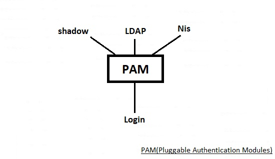
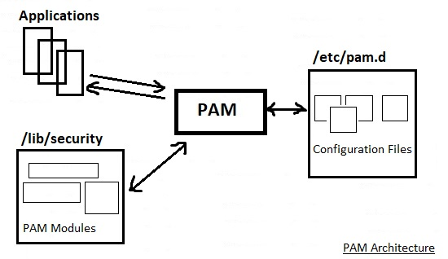

# 210.2. PAM authentication

## **210.2 PAM authentication**

**Weight:** 3

**Description:** The candidate should be able to configure PAM to support authentication using various available methods. This includes basic SSSD functionality.

**Key Knowledge Areas:**

* PAM configuration files, terms and utilities
* passwd and shadow passwords
* Use sssd for LDAP authentication

**Terms and Utilities:**

* /etc/pam.d/
* pam.conf
* nsswitch.conf
* pam\_unix, pam\_cracklib, pam\_limits, pam\_listfile, pam\_sss
* sssd.conf

Having Control over users and Authenticatios and auditing is so important. But there is not just one Authentication source which alway we use. There are different authentication sources like traditionamunix shadow file, LDAP servers, old Nis.

## PAM \(Pluggable Authentication Modules\)

PAM is a kind of abstaraction layer which seats between programs and different kinds of Authentication sources, and handles the process of negotiating with authentication source and take the result back to the program.



This way developers do not need to find out how to design their programs to deal with different authentication sources and they just concentrate on their programs and use pam. From another perspective when a new authentication source implemented, there is no need to change programs, just implement a new pammodule and use it again and again, this way pam bring kind of mobilabilty for programs too.

### PAM Architecure



Any program like passwd, or su which deal with username and password use pam. To do that, the program should work with pam library file pam\_lib . PAM by itself is using configuration files /etc/pam.d. PAM is modular and uses differnt modules which are placed in /lib/security .

For example lets check login tool to findout if it uses pam or not\(CentOS 7\) :

```text
[root@centos7-1 ~]# ldd $(which login)
    linux-vdso.so.1 =>  (0x00007fff3cdfe000)
    libpam.so.0 => /lib64/libpam.so.0 (0x00007f1b30124000)
    libpam_misc.so.0 => /lib64/libpam_misc.so.0 (0x00007f1b2ff20000)
    libaudit.so.1 => /lib64/libaudit.so.1 (0x00007f1b2fcf7000)
    libselinux.so.1 => /lib64/libselinux.so.1 (0x00007f1b2fad0000)
    libc.so.6 => /lib64/libc.so.6 (0x00007f1b2f703000)
    libdl.so.2 => /lib64/libdl.so.2 (0x00007f1b2f4ff000)
    libcap-ng.so.0 => /lib64/libcap-ng.so.0 (0x00007f1b2f2f9000)
    libpcre.so.1 => /lib64/libpcre.so.1 (0x00007f1b2f097000)
    /lib64/ld-linux-x86-64.so.2 (0x00007f1b30333000)
    libpthread.so.0 => /lib64/libpthread.so.0 (0x00007f1b2ee7b000)
```

`libpam` and`libpam_misc` bring passwd tool to the pam.

### /etc/pam.d

The /etc/pam.d/ directory contains the PAM configuration files for each PAM-aware application. In earlier versions of PAM, the /etc/pam.conf file was used, but this file is now deprecated and is only used if the /etc/pam.d/ directory does not exist:

```text
[root@centos7-1 ~]# cd /etc/
[root@centos7-1 etc]# cat pam.conf
cat: pam.conf: No such file or directory

[root@centos7-1 ~]# cd
[root@centos7-1 ~]# cd /etc/pam.d/
[root@centos7-1 pam.d]# ls
atd                     gdm-pin           postlogin-ac       su
chfn                    gdm-smartcard     ppp                sudo
chsh                    ksu               remote             sudo-i
config-util             liveinst          runuser            su-l
crond                   login             runuser-l          system-auth
cups                    other             setup              system-auth-ac
fingerprint-auth        passwd            smartcard-auth     systemd-user
fingerprint-auth-ac     password-auth     smartcard-auth-ac  vlock
gdm-autologin           password-auth-ac  smtp               vmtoolsd
gdm-fingerprint         pluto             smtp.postfix       xserver
gdm-launch-environment  polkit-1          sshd
gdm-password            postlogin         sssd-shadowutils
```

Every binary which has some thing to do with pam need to have a configuration file.There are some generic configuration files also. Configuration files define what should exactly happen. PAM Configuration File Format is like this :

```text
<service>    <module-interface>    <control-flag>    <module-name>    <module-arguments>
```

1-Service: It defines what service, this line of configuration is about. Like ssh, or FTP. This way /etc/pam.conf file becomes a one huge file with many lines, that doesn't seem so good which is why in many moder linux distrobutions each service has its own configuration file with its name inside /etc/pam.d directory, as you can see above. Lets take a look at one of them before countinue:

```text
[root@centos7-1 pam.d]# cat login 
#%PAM-1.0
auth [user_unknown=ignore success=ok ignore=ignore default=bad] pam_securetty.so
auth       substack     system-auth
auth       include      postlogin
account    required     pam_nologin.so
account    include      system-auth
password   include      system-auth
# pam_selinux.so close should be the first session rule
session    required     pam_selinux.so close
session    required     pam_loginuid.so
session    optional     pam_console.so
# pam_selinux.so open should only be followed by sessions to be executed in the user context
session    required     pam_selinux.so open
session    required     pam_namespace.so
session    optional     pam_keyinit.so force revoke
session    include      system-auth
session    include      postlogin
-session   optional     pam_ck_connector.so
```

system-auth is a generic configuration file that is included almost in every process that do some thing with authentication.

```text
[root@centos7-1 pam.d]# cat system-auth
#%PAM-1.0
# This file is auto-generated.
# User changes will be destroyed the next time authconfig is run.
auth        required      pam_env.so
auth        required      pam_faildelay.so delay=2000000
auth        sufficient    pam_fprintd.so
auth        sufficient    pam_unix.so nullok try_first_pass
auth        requisite     pam_succeed_if.so uid >= 1000 quiet_success
auth        required      pam_deny.so

account     required      pam_unix.so
account     sufficient    pam_localuser.so
account     sufficient    pam_succeed_if.so uid < 1000 quiet
account     required      pam_permit.so

password    requisite     pam_pwquality.so try_first_pass local_users_only retry=3 authtok_type=
password    sufficient    pam_unix.so sha512 shadow nullok try_first_pass use_authtok
password    required      pam_deny.so

session     optional      pam_keyinit.so revoke
session     required      pam_limits.so
-session     optional      pam_systemd.so
session     [success=1 default=ignore] pam_succeed_if.so service in crond quiet use_uid
session     required      pam_unix.so
```

2- module-interface: Four types of PAM module interface are available. Each of these corresponds to a different aspect of the authorization process:

* auth: This module interface authenticates use. For example, it requests and verifies the validity of a password. Modules with this interface can also set credentials, such as group memberships or Kerberos tickets.
* account: This module interface verifies that access is allowed. For example, it may check if a user account has expired or if a user is allowed to log in at a particular time of day.
* password: This module interface is used for changing user passwords.
* session: This module interface configures and manages user sessions. Modules with this interface can also perform additional tasks that are needed to allow access, like mounting a user's home directory and making the user's mailbox available. For better understandning take a look at control.

3- control-flag : All PAM modules generate a success or failure result when called. Control flags tell PAM what do with the result. Modules can be stacked in a particular order, and the control flags determine how important the success or failure of a particular module is to the overall goal of authenticating the user to the service.

There are several simple flags, which use only a keyword to set the configuration:

* requisite : The module result must be successful for authentication to continue. However, if a test fails at this point, the user is notified immediately with a message reflecting the first failed`required`_or_`requisite`module test.
* required :The module result must be successful for authentication to continue. If the test fails at this point, the user is not notified until the results of all module tests that reference that interface are complete.
* sufficient : The module result is ignored if it fails. However, if the result of a module flagged `sufficient`is successful_and_ no previous modules flagged`required`have failed, then no other results are required and the user is authenticated to the service.
* optional : The module result is ignored. A module flagged as `optional`only becomes necessary for successful authentication when no other modules reference the interface.
* include : Unlike the other controls, this does not relate to how the module result is handled. This flag pulls in all lines in the configuration file which match the given parameter and appends them as an argument to the module.

4-pam module name : The module name provides PAM with the name of the pluggable module containing the specified module interface. The directory name is omitted because the application is linked to the appropriate version of `libpam`, which can locate the correct version of the module.

5- module arguments : PAM uses \_arguments \_to pass information to a pluggable module during authentication for some modules. For example:

```text
auth    required    pam_userdb.so db=/path/to/MyDB_file
```

Invalid arguments are generally ignored and do not otherwise affect the success or failure of the PAM module. Some modules, however, may fail on invalid arguments. Most modules report errors to the`/var/log/secure`file.

Now that we now the format of PAM configuration file lets take a look at another one:

```text
[root@centos7-1 pam.d]# cat sshd 
#%PAM-1.0
auth       required    pam_sepermit.so
auth       substack     password-auth
auth       include      postlogin
# Used with polkit to reauthorize users in remote sessions
-auth      optional     pam_reauthorize.so prepare
account    required     pam_nologin.so
account    include      password-auth
password   include      password-auth
# pam_selinux.so close should be the first session rule
session    required     pam_selinux.so close
session    required     pam_loginuid.so
# pam_selinux.so open should only be followed by sessions to be executed in the user context
session    required     pam_selinux.so open env_params
session    required     pam_namespace.so
session    optional     pam_keyinit.so force revoke
session    include      password-auth
session    include      postlogin
# Used with polkit to reauthorize users in remote sessions
-session   optional     pam_reauthorize.so prepare
```

As you can see there are some generic configuration files like password-auth wich might be included and used in other configuration files again and again.

## /lib/security or /lib64/security

There is a place for pam modules itself:

```text
[root@centos7-1 pam.d]# cd /lib64/security/
[root@centos7-1 security]# ls
pam_access.so     pam_gdm.so               pam_permit.so          pam_time.so
pam_cap.so        pam_gnome_keyring.so     pam_postgresok.so      pam_timestamp.so
pam_chroot.so     pam_group.so             pam_pwhistory.so       pam_tty_audit.so
pam_console.so    pam_issue.so             pam_pwquality.so       pam_umask.so
pam_cracklib.so   pam_keyinit.so           pam_rhosts.so          pam_unix_acct.so
pam_debug.so      pam_lastlog.so           pam_rootok.so          pam_unix_auth.so
pam_deny.so       pam_limits.so            pam_securetty.so       pam_unix_passwd.so
pam_echo.so       pam_listfile.so          pam_selinux_permit.so  pam_unix_session.so
pam_env.so        pam_localuser.so         pam_selinux.so         pam_unix.so
pam_exec.so       pam_loginuid.so          pam_sepermit.so        pam_userdb.so
pam_faildelay.so  pam_mail.so              pam_shells.so          pam_warn.so
pam_faillock.so   pam_mkhomedir.so         pam_sss.so             pam_wheel.so
pam_filter        pam_motd.so              pam_stress.so          pam_xauth.so
pam_filter.so     pam_namespace.so         pam_succeed_if.so
pam_fprintd.so    pam_nologin.so           pam_systemd.so
pam_ftp.so        pam_oddjob_mkhomedir.so  pam_tally2.so
```

If new way of authentication has been invented\(Like finger print reader\), there is a place which requied module should be placed and integrated with pam configuration files.

For lPIC2 exam we are required to know some of these modules:

* pam\_unix
* pam\_cracklib
* pam\_limits
* pam\_listfile
* pam\_sss

**pam\_unix:** This module configures authentication via /etc/passwd and /etc/shadow.

The pam\_unix.so module supports the following management groups:

```text
account
    The type “account” does not authenticate the user but checks other things such as the expiration date of the password and might force the user to change his password based on the contents of the files /etc/passwd and /etc/shadow.

    The following options are supported:

    debug
    Log information using syslog.

    audit
    Also logs information, even more than debug does.

auth
The type “auth” checks the user's password against the password database(s). This component is configured in the file /etc/nsswitch.conf. Please consult the man page (man nsswitch.conf) for further details.

The following options are supported:

    audit
    Log information using syslog.

    debug
    Also logs information using syslog but less than audit.

    nodelay
    This argument sets the delay-on-failure, which has a default of a second, to nodelay.

    nullok
    Allows empty passwords. Normally authentication fails if the password is blank.

    try_first_pass
    Use the password from the previous stacked auth module and prompt for a new password if the retrieved password is blank or incorrect.

    use_first_pass
    Use the result from the previous stacked auth module, never prompt the user for a password and fails if the result was a fail.
password
The type “password” changes the user's password.

The following options are supported:

    audit
    Log information using syslog.

    bigcrypt
    Use the DEC “C2” extension to crypt().

    debug
    Also logs information using syslog but less than audit.

    md5
    Use md5 encryption instead of crypt().

    nis
    Use NIS (Network Information Service) passwords.

    not_set_pass
    Don't use the passwords from other stacked modules and do not give the new password to other stacked modules.

    nullok
    Allows empty passwords. Normally authentication fails if the password is blank.

    remember
    Remember the last n passwords to prevent the user from using one of the last n passwords again.

    try_first_pass
    Use the password from the previous stacked auth module, and prompt for a new password if the retrieved password is blank or incorrect.

    use_authtok
    Set the new password to the one provided by a previous module.

    use_first_pass
    Use the result from the previous stacked auth module, never prompt the user for a password and fails if the result was a fail.

session
    The type “session” uses syslog to log the user's name and session type at the start and end of a session.

    The “session” type does not support any options.
```

Most of services which need authentication include pam\_unix.so . As an example we can add options to that inorder to remember last 3 user's password and dose not let user to set them again.

```text
[root@centos7-1 ~]# cd /etc/pam.d/
[root@centos7-1 pam.d]# vim system-auth

[root@centos7-1 pam.d]# cat system-auth
#%PAM-1.0
# This file is auto-generated.
# User changes will be destroyed the next time authconfig is run.
auth        required      pam_env.so
auth        required      pam_faildelay.so delay=2000000
auth        sufficient    pam_fprintd.so
auth        sufficient    pam_unix.so nullok try_first_pass
auth        requisite     pam_succeed_if.so uid >= 1000 quiet_success
auth        required      pam_deny.so

account     required      pam_unix.so
account     sufficient    pam_localuser.so
account     sufficient    pam_succeed_if.so uid < 1000 quiet
account     required      pam_permit.so

password    requisite     pam_pwquality.so try_first_pass local_users_only retry=3 authtok_type=
password    sufficient    pam_unix.so sha512 shadow nullok try_first_pass use_authtok remember=3
password    required      pam_deny.so

session     optional      pam_keyinit.so revoke
session     required      pam_limits.so
-session     optional      pam_systemd.so
session     [success=1 default=ignore] pam_succeed_if.so service in crond quiet use_uid
session     required      pam_unix.so
```

And fortunatley there is no need to do any thing else. Test it by creating a user and set different passwords for that 3 times and on forth effort try to set the first password which you have used, it won't let you.

**pam\_cracklib :** This plugin provides strength-checking for passwords. This is done by performing a number of checks to ensure passwords are not too weak. It checks the password against dictonaries, the previous password\(s\) and rules about the use of numbers, upper and lowercase and other characters. Based on your distro `pam_cracklib` name might be name different.

```text
Options
debug

This option makes the module write information to syslog(3) indicating the behavior of the module (this option does not write password information to the log file).
authtok_type=XXX
The default action is for the module to use the following prompts when requesting passwords: "New UNIX password: " and "Retype UNIX password: ". The example word UNIX can be replaced with this option, by default it is empty.
retry=N
    Prompt user at most N times before returning with error. The default is 1.
difok=N
    This argument will change the default of 5 for the number of character changes in the new password that differentiate it from the old password.
minlen=N
    The minimum acceptable size for the new password (plus one if credits are not disabled which is the default). In addition to the number of characters in the new password, credit (of +1 in length) is given for each different kind of character (other, upper, lower and digit). The default for this parameter is 9 which is good for a old style UNIX password all of the same type of character but may be too low to exploit the added security of a md5 system. Note that there is a pair of length limits in Cracklib itself, a "way too short" limit of 4 which is hard coded in and a defined limit (6) that will be checked without reference to minlen. If you want to allow passwords as short as 5 characters you should not use this module.
    dcredit=N
    (N >= 0) This is the maximum credit for having digits in the new password. If you have less than or N digits, each digit will count +1 towards meeting the current minlen value. The default for dcredit is 1 which is the recommended value for minlen less than 10.
    (N < 0) This is the minimum number of digits that must be met for a new password.

ucredit=N
    (N >= 0) This is the maximum credit for having upper case letters in the new password. If you have less than or N upper case letters each letter will count +1 towards meeting the current minlen value. The default for ucredit is 1 which is the recommended value for minlen less than 10.
    (N < 0) This is the minimum number of upper case letters that must be met for a new password.

lcredit=N
    (N >= 0) This is the maximum credit for having lower case letters in the new password. If you have less than or N lower case letters, each letter will count +1 towards meeting the current minlen value. The default for lcredit is 1 which is the recommended value for minlen less than 10.
    (N < 0) This is the minimum number of lower case letters that must be met for a new password.

ocredit=N
    (N >= 0) This is the maximum credit for having other characters in the new password. If you have less than or N other characters, each character will count +1 towards meeting the current minlen value. The default for ocredit is 1 which is the recommended value for minlen less than 10.
    (N < 0) This is the minimum number of other characters that must be met for a new password.

minclass=N
    The minimum number of required classes of characters for the new password. The default number is zero. The four classes are digits, upper and lower letters and other characters. The difference to the credit check is that a specific class if of characters is not required. Instead N out of four of the classes are required.
maxrepeat=N
    Reject passwords which contain more than N same consecutive characters. The default is 0 which means that this check is disabled.
maxsequence=N
    Reject passwords which contain monotonic character sequences longer than N. The default is 0 which means that this check is disabled. Examples of such sequence are '12345' or 'fedcb'. Note that most such passwords will not pass the simplicity check unless the sequence is only a minor part of the password.
maxclassrepeat=N
    Reject passwords which contain more than N consecutive characters of the same class. The default is 0 which means that this check is disabled.
reject_username
    Check whether the name of the user in straight or reversed form is contained in the new password. If it is found the new password is rejected.
gecoscheck
    Check whether the words from the GECOS field (usualy full name of the user) longer than 3 characters in straight or reversed form are contained in the new password. If any such word is found the new password is rejected.
enforce_for_root
    The module will return error on failed check also if the user changing the password is root. This option is off by default which means that just the message about the failed check is printed but root can change the password anyway.
use_authtok
    This argument is used to force the module to not prompt the user for a new password but use the one provided by the previously stacked password module.
dictpath=/path/to/dict
    Path to the cracklib dictionaries.
```

For example we can set minimum charachters wich are required for a password, by the way you can see the name of```_``pam**cracklib.so\`** _**has been changed here in CentOS7 and that is**_ **pam\**\_pwquality.so :

```text
[root@centos7-1 pam.d]# vim system-auth
[root@centos7-1 pam.d]# cat system-auth
#%PAM-1.0
# This file is auto-generated.
# User changes will be destroyed the next time authconfig is run.
auth        required      pam_env.so
auth        required      pam_faildelay.so delay=2000000
auth        sufficient    pam_fprintd.so
auth        sufficient    pam_unix.so nullok try_first_pass
auth        requisite     pam_succeed_if.so uid >= 1000 quiet_success
auth        required      pam_deny.so

account     required      pam_unix.so
account     sufficient    pam_localuser.so
account     sufficient    pam_succeed_if.so uid < 1000 quiet
account     required      pam_permit.so

password    requisite     pam_pwquality.so try_first_pass local_users_only retry=3 minlen=10 authtok_type=
password    sufficient    pam_unix.so sha512 shadow nullok try_first_pass use_authtok remember=3
password    required      pam_deny.so

session     optional      pam_keyinit.so revoke
session     required      pam_limits.so
-session     optional      pam_systemd.so
session     [success=1 default=ignore] pam_succeed_if.so service in crond quiet use_uid
session     required      pam_unix.so
```

**pam\_limits** : The pam\_limits PAM module sets limits on the system resources that can be obtained in a user-session. Users of uid=0 are affected by this limits, too. By default limits are taken from the `/etc/security/limits.conf`config file. Then ndividual files from the`/etc/security/limits.d/`directory are read.

```text
[root@centos7-1 pam.d]# grep pam_limits *
fingerprint-auth:session     required      pam_limits.so
fingerprint-auth-ac:session     required      pam_limits.so
password-auth:session     required      pam_limits.so
password-auth-ac:session     required      pam_limits.so
runuser:session        required    pam_limits.so
smartcard-auth:session     required      pam_limits.so
smartcard-auth-ac:session     required      pam_limits.so
sudo:session    required     pam_limits.so
sudo-i:session    required     pam_limits.so
system-auth:session     required      pam_limits.so
system-auth-ac:session     required      pam_limits.so
[root@centos7-1 pam.d]# cat sudo
#%PAM-1.0
auth       include      system-auth
account    include      system-auth
password   include      system-auth
session    optional     pam_keyinit.so revoke
session    required     pam_limits.so
```

As you can see pam\_\_limists.so is used in session module, so instead of manipulating that module which would have effects on other services we put our setting inside /etc/security/limits.conf :

```text
[root@centos7-1 pam.d]# cd /etc/security/
[root@centos7-1 security]# ls
access.conf       console.perms    limits.d        opasswd         time.conf
chroot.conf       console.perms.d  namespace.conf  pam_env.conf
console.apps      group.conf       namespace.d     pwquality.conf
console.handlers  limits.conf      namespace.init  sepermit.conf
[root@centos7-1 security]# cat limits.conf 
# /etc/security/limits.conf
#
#This file sets the resource limits for the users logged in via PAM.
#It does not affect resource limits of the system services.
#
#Also note that configuration files in /etc/security/limits.d directory,
#which are read in alphabetical order, override the settings in this
#file in case the domain is the same or more specific.
#That means for example that setting a limit for wildcard domain here
#can be overriden with a wildcard setting in a config file in the
#subdirectory, but a user specific setting here can be overriden only
#with a user specific setting in the subdirectory.
#
#Each line describes a limit for a user in the form:
#
#<domain>        <type>  <item>  <value>
#
#Where:
#<domain> can be:
#        - a user name
#        - a group name, with @group syntax
#        - the wildcard *, for default entry
#        - the wildcard %, can be also used with %group syntax,
#                 for maxlogin limit
#
#<type> can have the two values:
#        - "soft" for enforcing the soft limits
#        - "hard" for enforcing hard limits
#
#<item> can be one of the following:
#        - core - limits the core file size (KB)
#        - data - max data size (KB)
#        - fsize - maximum filesize (KB)
#        - memlock - max locked-in-memory address space (KB)
#        - nofile - max number of open file descriptors
#        - rss - max resident set size (KB)
#        - stack - max stack size (KB)
#        - cpu - max CPU time (MIN)
#        - nproc - max number of processes
#        - as - address space limit (KB)
#        - maxlogins - max number of logins for this user
#        - maxsyslogins - max number of logins on the system
#        - priority - the priority to run user process with
#        - locks - max number of file locks the user can hold
#        - sigpending - max number of pending signals
#        - msgqueue - max memory used by POSIX message queues (bytes)
#        - nice - max nice priority allowed to raise to values: [-20, 19]
#        - rtprio - max realtime priority
#
#<domain>      <type>  <item>         <value>
#

#*               soft    core            0
#*               hard    rss             10000
#@student        hard    nproc           20
#@faculty        soft    nproc           20
#@faculty        hard    nproc           50
#ftp             hard    nproc           0
#@student        -       maxlogins       4

# End of file
```

For example, adding line below at the end of `/etc/security/limits.conf` can avoid `pooruser` from loging more than once :

```text
@pooruser    hard    maxlogins    1
```

For testing, create pooruser and try to ssh to the system more than once, see the results.

**pam\_listfile :** This module allows or denies an action based on the presence of the item in a listfile. A listfile is a textfile containing a list of usernames, one username per line. The type of item can be set via the configuration parameter item and can have the value of user, tty, rhost, ruser, group, or shell. The _sense_  configuration parameter determines whether the entries in the list are allowed. Possible values are allow and deny.

```text
[root@centos7-1 security]# cd /etc/pam.d/
[root@centos7-1 pam.d]# grep pam_listfile.so *
```

Right now no package or service is currently using pam\_list file, for testing lets install a FTP server:

```text
[root@centos7-1 pam.d]# yum install vsftpd

[root@centos7-1 pam.d]# grep pam_listfile.so *
vsftpd:auth       required    pam_listfile.so item=user sense=deny file=/etc/vsftpd/ftpusers onerr=succeed

[root@centos7-1 pam.d]# cat vsftpd 
#%PAM-1.0
session    optional     pam_keyinit.so    force revoke
auth       required    pam_listfile.so item=user sense=deny file=/etc/vsftpd/ftpusers onerr=succeed
auth       required    pam_shells.so
auth       include    password-auth
account    include    password-auth
session    required     pam_loginuid.so
session    include    password-auth
```

The thing that it does is denying every user which his name/ her name is inside /etc/vsftpd/ftpusers. see:

```text
[root@centos7-1 pam.d]# cat /etc/vsftpd/ftpusers 
# Users that are not allowed to login via ftp
root
bin
daemon
adm
lp
sync
shutdown
halt
mail
news
uucp
operator
games
nobody
```

For testing , start vsftp service, create a pooruser and add it to this list, then try to login to the ftp server with pooruser.

#### sssd

sssd is a centeral service in the authentication process, that determines how exactly the authentication is going to happen. sssd can authenticate us against LDAP, ActiveDirectory, Nis , ... . sssd is especialy developed to do that. Lets just take a look at it inorder to have a better understanding of pam\_sss. Here we just chek the service and read sample configuration file:

```text
root@centos7-1 ~]# systemctl status sssd
● sssd.service - System Security Services Daemon
   Loaded: loaded (/usr/lib/systemd/system/sssd.service; disabled; vendor preset: disabled)
   Active: inactive (dead)

[root@centos7-1 ~]# cp /usr/share/doc/sssd-common-1.16.0/sssd-example.conf /etc/sssd/sssd.conf
[root@centos7-1 ~]# cat /etc/sssd/sssd.conf 
[sssd]
config_file_version = 2
services = nss, pam
# SSSD will not start if you do not configure any domains.
# Add new domain configurations as [domain/<NAME>] sections, and
# then add the list of domains (in the order you want them to be
# queried) to the "domains" attribute below and uncomment it.
; domains = LDAP

[nss]

[pam]

# Example LDAP domain
; [domain/LDAP]
; id_provider = ldap
; auth_provider = ldap
# ldap_schema can be set to "rfc2307", which stores group member names in the
# "memberuid" attribute, or to "rfc2307bis", which stores group member DNs in
# the "member" attribute. If you do not know this value, ask your LDAP
# administrator.
; ldap_schema = rfc2307
; ldap_uri = ldap://ldap.mydomain.org
; ldap_search_base = dc=mydomain,dc=org
# Note that enabling enumeration will have a moderate performance impact.
# Consequently, the default value for enumeration is FALSE.
# Refer to the sssd.conf man page for full details.
; enumerate = false
# Allow offline logins by locally storing password hashes (default: false).
; cache_credentials = true

# An example Active Directory domain. Please note that this configuration
# works for AD 2003R2 and AD 2008, because they use pretty much RFC2307bis
# compliant attribute names. To support UNIX clients with AD 2003 or older,
# you must install Microsoft Services For Unix and map LDAP attributes onto
# msSFU30* attribute names.
; [domain/AD]
; id_provider = ldap
; auth_provider = krb5
; chpass_provider = krb5
;
; ldap_uri = ldap://your.ad.example.com
; ldap_search_base = dc=example,dc=com
; ldap_schema = rfc2307bis
; ldap_sasl_mech = GSSAPI
; ldap_user_object_class = user
; ldap_group_object_class = group
; ldap_user_home_directory = unixHomeDirectory
; ldap_user_principal = userPrincipalName
; ldap_account_expire_policy = ad
; ldap_force_upper_case_realm = true
;
; krb5_server = your.ad.example.com
; krb5_realm = EXAMPLE.COM
```

We need to configure and start sssd serviceif have a plan to use it but leave it for now.

**pam\_sss.so :**  is the PAM interface to the System Security Services daemon \(SSSD\). Errors and results are logged through syslog.

## nsswitch.conf

nsswitch determines the order that files or services are used to perform either Authentication or Authorative responses to some thing on the system. We typically nsswitch.conf is edited when we are dealing with DNS entries. \(We have talked about nsswitch when we talked about BIND DNS in previous course\).

```text
[root@centos7-1 ~]# cat /etc/nsswitch.conf
#
# /etc/nsswitch.conf
#
# An example Name Service Switch config file. This file should be
# sorted with the most-used services at the beginning.
#
# The entry '[NOTFOUND=return]' means that the search for an
# entry should stop if the search in the previous entry turned
# up nothing. Note that if the search failed due to some other reason
# (like no NIS server responding) then the search continues with the
# next entry.
#
# Valid entries include:
#
#    nisplus            Use NIS+ (NIS version 3)
#    nis            Use NIS (NIS version 2), also called YP
#    dns            Use DNS (Domain Name Service)
#    files            Use the local files
#    db            Use the local database (.db) files
#    compat            Use NIS on compat mode
#    hesiod            Use Hesiod for user lookups
#    [NOTFOUND=return]    Stop searching if not found so far
#

# To use db, put the "db" in front of "files" for entries you want to be
# looked up first in the databases
#
# Example:
#passwd:    db files nisplus nis
#shadow:    db files nisplus nis
#group:     db files nisplus nis

passwd:     files sss
shadow:     files sss
group:      files sss
#initgroups: files sss

#hosts:     db files nisplus nis dns
hosts:      files dns myhostname

# Example - obey only what nisplus tells us...
#services:   nisplus [NOTFOUND=return] files
#networks:   nisplus [NOTFOUND=return] files
#protocols:  nisplus [NOTFOUND=return] files
#rpc:        nisplus [NOTFOUND=return] files
#ethers:     nisplus [NOTFOUND=return] files
#netmasks:   nisplus [NOTFOUND=return] files     

bootparams: nisplus [NOTFOUND=return] files

ethers:     files
netmasks:   files
networks:   files
protocols:  files
rpc:        files
services:   files sss

netgroup:   nisplus sss

publickey:  nisplus

automount:  files nisplus sss
aliases:    files nisplus
```

The Authentication order and nsswitch can effect how authentication takes place on our system, including wehther pam any modules are involved ,since they are files. So one way for troubleshooting pam if it not applied, is by controlling nsswitch and the see the order of files.

That is all.

