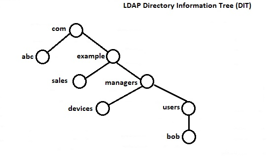
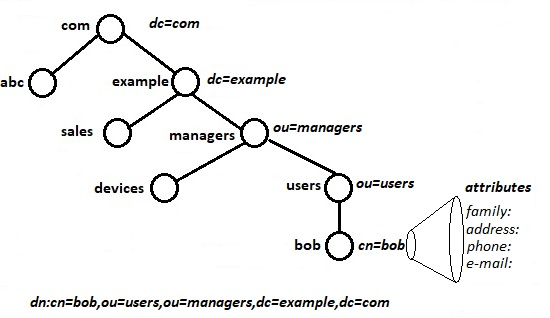

# 210.4. Configuring an OpenLDAP server

**Weight:** 4

**Description:** Candidates should be able to configure a basic OpenLDAP server including knowledge of LDIF format and essential access controls.

**Key Knowledge Areas:**

* OpenLDAP
* Directory based configuration
* Access Control
* Distinguished Names
* Changetype Operations
* Schemas and Whitepages
* Directories
* Object IDs, Attributes and Classes

**Terms and Utilities:**

* slapd
* slapd-config
* LDIF
* slapadd
* slapcat
* slapindex
* /var/lib/ldap/
* loglevel

We begin this course by talking about basics of LDAP. What is LDAP? Where it is used and why ?

### LDAP

LDAP is not a program, that is a protocol. LDAP stands for  **Lightweight Directory Access Protocol**  and consists in a set of protocols that allows a client to access centrally stored information \(over a network\). It can be used in numerous ways such as for authentication, shared directory \(for mail clients\), address book, etc. As LDAP different usages, it can store any kind of information.

The standard TCP ports for LDAP are 389 for unencrypted communication and 636 for LDAP over a TLS-encrypted channel, although it’s not uncommon for LDAP servers to listen on alternate ports for a variety of reasons.

#### LDAP Directory tree structure

An LDAP directory has a tree structure. All entries \(called objects\) of the directory have a defined position within this hierarchy. This hierarchy is called the directory information tree \(DIT\).



Entries at the higher level of hierarchy, represent larger groupings or organizations. Entries under the larger organizations represent smaller organizations that make up the larger ones. The leaf nodes \(or entries\) of the tree structure represent the individuals or resources.

#### Namig Model

The naming model defines how entries and data in the DIT are uniquely referenced.



There are some defination which we are expected to know about before start working with ldap:

**Object:** Sometimes reffered to as a record or an entry, reperesnt a single item in the direstory. This object provides a description based on the structure of the schema.

**Schema:** This is the structure that is built to define the characteristics \(or attributes\) of an object. It also defines what can be stored in each attributes.

**Attribute:** This is a part of an object. One or more attributes make up an object, as defined by schema.

**LDIF:** Stands for LDAP Interchange Format. It is used to create objects within the LDAP directory. These values are placed into a file and can be loaded into a directory with the slapadd command.

**DC:** Stands for **Domain Component**. And that is one of the domain that is reflected in hierarchy.

**OU:** Stands for **Organizational Unit**.

**CN:** Stands for **Common Name** and is the name of object\(often a username, but not always\)

**DN:** Stands for **Distinguished Name**. Each object in our directory has to have a unique name in order to provide structure. It is build with a CN and one or more DC \(example: cn=user,dc=abc,dc=com\)

#### SSSD

Stands for System Security Service Daemon. This provides authentication of user accounts for a LDAP Server\(if we want we can use a different solutions\)

Note: Configuration of this item is NOT an eaxm objective, Only that we know what it is.

### OpenLDAP

OpenLDAP is a free, open source implementation of the Lightweight Directory Access Protocol \(LDAP\) developed by the OpenLDAP Project. It is released under its own BSD-style license called the OpenLDAP Public License.

OpenLDAP provides a distributed directory service. It stores information associated with users that can be used to authenticate them for login and can provide other information about those users.


OpenLDAP is most commonly used in Linux, but can be compared to Active Directory on Windows as a service provided hierarchical based user information much the same as OpenLDAP.

#### Installing  OpenLDAP server

For demonstaration Lets install OpenLDAP server on a centOS system, we install both sever and client packages to work with that. We should install the following three packages:

* openldap-servers – This is the main LDAP server
* openldap-clients – This contains all required LDAP client utilities
* openldap – This packages contains the LDAP support libraries

```text
[root@centos7-1 ~]# yum install openldap openldap-servers openldap-clients.x86_64
```

Next try to start slapd service\(do not forget to disable selinux with `setenforce 0` command\):

```text
[root@centos7-1 ~]# systemctl status slapd.service
● slapd.service - OpenLDAP Server Daemon
   Loaded: loaded (/usr/lib/systemd/system/slapd.service; disabled; vendor preset: disabled)
   Active: inactive (dead)
     Docs: man:slapd
           man:slapd-config
           man:slapd-hdb
           man:slapd-mdb
           file:///usr/share/doc/openldap-servers/guide.html
[root@centos7-1 ~]# systemctl start slapd.service
[root@centos7-1 ~]# systemctl status slapd.service
● slapd.service - OpenLDAP Server Daemon
   Loaded: loaded (/usr/lib/systemd/system/slapd.service; disabled; vendor preset: disabled)
   Active: active (running) since Sun 2018-08-26 04:48:47 EDT; 2min 29s ago
     Docs: man:slapd
           man:slapd-config
           man:slapd-hdb
           man:slapd-mdb
           file:///usr/share/doc/openldap-servers/guide.html
  Process: 2979 ExecStart=/usr/sbin/slapd -u ldap -h ${SLAPD_URLS} $SLAPD_OPTIONS (code=exited, status=0/SUCCESS)
  Process: 2961 ExecStartPre=/usr/libexec/openldap/check-config.sh (code=exited, status=0/SUCCESS)
 Main PID: 2981 (slapd)
   CGroup: /system.slice/slapd.service
           └─2981 /usr/sbin/slapd -u ldap -h ldapi:/// ldap:///

Aug 26 04:48:46 localhost.localdomain systemd[1]: Starting OpenLDAP Server Da...
Aug 26 04:48:46 localhost.localdomain runuser[2965]: pam_unix(runuser:session...
Aug 26 04:48:46 localhost.localdomain slapcat[2971]: DIGEST-MD5 common mech free
Aug 26 04:48:46 localhost.localdomain slapd[2979]: @(#) $OpenLDAP: slapd 2.4....
                                                           mockbuild@c1bm.rdu...
Aug 26 04:48:47 localhost.localdomain slapd[2979]: tlsmc_get_pin: INFO: Pleas...
Aug 26 04:48:47 localhost.localdomain slapd[2981]: hdb_db_open: warning - no ...
                                                   Expect poor performance fo...
Aug 26 04:48:47 localhost.localdomain slapd[2981]: slapd starting
Aug 26 04:48:47 localhost.localdomain systemd[1]: Started OpenLDAP Server Dae...
Hint: Some lines were ellipsized, use -l to show in full.
```

and check whether it is listening or not:

```text
[root@centos7-1 ~]# netstat -tulpen | grep -i 389
tcp        0      0 0.0.0.0:389             0.0.0.0:*               LISTEN      0          33468      2981/slapd          
tcp6       0      0 :::389                  :::*                    LISTEN      0          33469      2981/slapd
```

#### /etc/openldap

There are number of diffrent things:

```text
[root@centos7-1 ~]# cd /etc/openldap/
[root@centos7-1 openldap]# ll
total 12
drwxr-xr-x. 2 root root   90 Aug 25 01:01 certs
-rw-r--r--. 1 root root  121 May 16 05:56 check_password.conf
-rw-r--r--. 1 root root  363 May 16 05:56 ldap.conf
drwxr-xr-x. 2 root root 4096 Aug 25 01:01 schema
drwxr-x---. 3 ldap ldap   45 Aug 25 01:01 slapd.d
```

#### ldap.conf

Used to set system-wide defaults to be applied when running LDAP client tools\( like`ldapsearch`and`ldapadd`\).

```text
[root@centos7-1 openldap]# cat ldap.conf 
#
# LDAP Defaults
#

# See ldap.conf(5) for details
# This file should be world readable but not world writable.

#BASE    dc=example,dc=com
#URI    ldap://ldap.example.com ldap://ldap-master.example.com:666

#SIZELIMIT    12
#TIMELIMIT    15
#DEREF        never

TLS_CACERTDIR    /etc/openldap/certs

# Turning this off breaks GSSAPI used with krb5 when rdns = false
SASL_NOCANON    on
```

Where

* SIZELIMIT &lt;integer&gt; : Specifies a size limit \(number of entries\)  to  use  when performing searches.  
* TIMELIMIT &lt;integer&gt; : Specifies   a   time  limit  \(in  seconds\)  to  use  when performing searches.  

By default ldap.conf is world readable and there are no special setting to edit and it is not a part of exam objective.

#### /etc/openldap/schema/\*

Directory that contains a set of default schema specifications which describe the different object classes that are available by default with the OpenLDAP Software. Each set is defined in a file \(i.e. core.schema\) suitable for inclusion using the include directive in the global definitions portion of the slapd.conf file. It is helpful to browse the contents of these files to determine the required and available attributes for a particular object class.

```text
[root@centos7-1 openldap]# ls  schema
collective.ldif    cosine.schema         java.ldif      openldap.schema
collective.schema  duaconf.ldif          java.schema    pmi.ldif
corba.ldif         duaconf.schema        misc.ldif      pmi.schema
corba.schema       dyngroup.ldif         misc.schema    ppolicy.ldif
core.ldif          dyngroup.schema       nis.ldif       ppolicy.schema
core.schema        inetorgperson.ldif    nis.schema
cosine.ldif        inetorgperson.schema  openldap.ldif
```

Try to cat some of core.ldif files and see how they look like.This a part of that:

```text
[root@centos7-1 schema]# cat core.ldif 
# OpenLDAP Core schema
# $OpenLDAP$
## This work is part of OpenLDAP Software <http://www.openldap.org/>.
##
## Copyright 1998-2016 The OpenLDAP Foundation.
## All rights reserved.
##
## Redistribution and use in source and binary forms, with or without
## modification, are permitted only as authorized by the OpenLDAP
## Public License.
##
## A copy of this license is available in the file LICENSE in the
## top-level directory of the distribution or, alternatively, at
## <http://www.OpenLDAP.org/license.html>.
#
## Portions Copyright (C) The Internet Society (1997-2003).
## All Rights Reserved.
##
## This document and translations of it may be copied and furnished to
## others, and derivative works that comment on or otherwise explain it
## or assist in its implementation may be prepared, copied, published
## and distributed, in whole or in part, without restriction of any
## kind, provided that the above copyright notice and this paragraph are
## included on all such copies and derivative works.  However, this
## document itself may not be modified in any way, such as by removing
## the copyright notice or references to the Internet Society or other
## Internet organizations, except as needed for the purpose of
## developing Internet standards in which case the procedures for
## copyrights defined in the Internet Standards process must be         
## followed, or as required to translate it into languages other than
## English.
##                                                                      
## The limited permissions granted above are perpetual and will not be  
## revoked by the Internet Society or its successors or assigns.        
## 
## This document and the information contained herein is provided on an 
## "AS IS" basis and THE INTERNET SOCIETY AND THE INTERNET ENGINEERING
## TASK FORCE DISCLAIMS ALL WARRANTIES, EXPRESS OR IMPLIED, INCLUDING
## BUT NOT LIMITED TO ANY WARRANTY THAT THE USE OF THE INFORMATION
## HEREIN WILL NOT INFRINGE ANY RIGHTS OR ANY IMPLIED WARRANTIES OF
## MERCHANTABILITY OR FITNESS FOR A PARTICULAR PURPOSE.
#
#
#
# Includes LDAPv3 schema items from:
#    RFC 2252/2256 (LDAPv3)
#
# Select standard track schema items:
#    RFC 1274 (uid/dc)
#    RFC 2079 (URI)
#    RFC 2247 (dc/dcObject)
#    RFC 2587 (PKI)
#    RFC 2589 (Dynamic Directory Services)
#
# Select informational schema items:
#    RFC 2377 (uidObject)
#
#
# Standard attribute types from RFC 2256
#
dn: cn=core,cn=schema,cn=config
objectClass: olcSchemaConfig
cn: core
#
# system schema
#olcAttributeTypes: ( 2.5.4.0 NAME 'objectClass'
#    DESC 'RFC2256: object classes of the entity'
#    EQUALITY objectIdentifierMatch
#    SYNTAX 1.3.6.1.4.1.1466.115.121.1.38 )
#
# system schema
#olcAttributeTypes: ( 2.5.4.1 NAME ( 'aliasedObjectName' 'aliasedEntryName' )
#    DESC 'RFC2256: name of aliased object'
#    EQUALITY distinguishedNameMatch
#    SYNTAX 1.3.6.1.4.1.1466.115.121.1.12 SINGLE-VALUE )
#
olcAttributeTypes: ( 2.5.4.2 NAME 'knowledgeInformation'
  DESC 'RFC2256: knowledge information'
  EQUALITY caseIgnoreMatch
  SYNTAX 1.3.6.1.4.1.1466.115.121.1.15{32768} )
#
# system schema
#olcAttributeTypes: ( 2.5.4.3 NAME ( 'cn' 'commonName' )
#    DESC 'RFC2256: common name(s) for which the entity is known by'
#    SUP name )
#
olcAttributeTypes: ( 2.5.4.4 NAME ( 'sn' 'surname' )
  DESC 'RFC2256: last (family) name(s) for which the entity is known by'
  SUP name )
#
olcAttributeTypes: ( 2.5.4.5 NAME 'serialNumber'
  DESC 'RFC2256: serial number of the entity'
  EQUALITY caseIgnoreMatch
  SUBSTR caseIgnoreSubstringsMatch
  SYNTAX 1.3.6.1.4.1.1466.115.121.1.44{64} )
#
# RFC 4519 definition ('countryName' in X.500 and RFC2256)
olcAttributeTypes: ( 2.5.4.6 NAME ( 'c' 'countryName' )
  DESC 'RFC4519: two-letter ISO-3166 country code'
  SUP name
  SYNTAX 1.3.6.1.4.1.1466.115.121.1.11
  SINGLE-VALUE )
#
olcAttributeTypes: ( 2.5.4.7 NAME ( 'l' 'localityName' )
  DESC 'RFC2256: locality which this object resides in'
  SUP name )
#
olcAttributeTypes: ( 2.5.4.8 NAME ( 'st' 'stateOrProvinceName' )
  DESC 'RFC2256: state or province which this object resides in'
  SUP name )
#
olcAttributeTypes: ( 2.5.4.9 NAME ( 'street' 'streetAddress' )
  DESC 'RFC2256: street address of this object'
  EQUALITY caseIgnoreMatch
  SUBSTR caseIgnoreSubstringsMatch
  SYNTAX 1.3.6.1.4.1.1466.115.121.1.15{128} )
#
olcAttributeTypes: ( 2.5.4.10 NAME ( 'o' 'organizationName' )
  DESC 'RFC2256: organization this object belongs to'
  SUP name )
#
olcAttributeTypes: ( 2.5.4.11 NAME ( 'ou' 'organizationalUnitName' )
  DESC 'RFC2256: organizational unit this object belongs to'
  SUP name )
#
olcAttributeTypes: ( 2.5.4.12 NAME 'title'
  DESC 'RFC2256: title associated with the entity'
  SUP name )
#
# system schema
#olcAttributeTypes: ( 2.5.4.13 NAME 'description'
#    DESC 'RFC2256: descriptive information'
#    EQUALITY caseIgnoreMatch
#    SUBSTR caseIgnoreSubstringsMatch
#    SYNTAX 1.3.6.1.4.1.1466.115.121.1.15{1024} )
#
........
.....
...
..
.
```

### slapd.conf

Main server configuration file that contains information needed by the slapd LDAP server. Lets take a look at it:

```text
[root@centos7-1 ~]# cd /etc/openldap/
[root@centos7-1 openldap]# ll
total 12
drwxr-xr-x. 2 root root   90 Aug 25 01:01 certs
-rw-r--r--. 1 root root  121 May 16 05:56 check_password.conf
-rw-r--r--. 1 root root  363 May 16 05:56 ldap.conf
drwxr-xr-x. 2 root root 4096 Aug 25 01:01 schema
drwxr-x---. 3 ldap ldap   45 Aug 25 01:01 slapd.d
```

Where is it?

```text
[root@centos7-1 openldap]# updatedb 

[root@centos7-1 openldap]# locate slapd.conf
/usr/lib/tmpfiles.d/slapd.conf
/usr/share/man/man5/slapd.conf.5.gz

[root@centos7-1 openldap]# cat /usr/lib/tmpfiles.d/slapd.conf 
# openldap runtime directory for slapd.arg and slapd.pid
d /var/run/openldap 0755 ldap ldap -
```

Historically OpenLDAP has been statically configured, that is, to make a change to the configuration the slapd.conf file was modified and slapd stopped and started. In the case of larger users this could take a considerable period of time and had become increasingly unacceptable as an operational method.

#### slapd.conf or  dynamic runtime configuration engine

Significant changes to slapd were introduced with version 2.3 and 2.4. The most significant change is that, while slapd.conf is still supported \(as of 2.4\), increasingly OpenLDAP is moving toward On-Line Configuration \(OLC\) - frequently also known as cn=config or slapd.d configuration. This method enables most configuration changes to be made without starting and stopping the LDAP server.

If you have got confused, in a simple world, it is like having a configuration data base for configuring a database and no more single configuration file slapd.conf.

Unfortunately LPIC2 exam objective is about Old OpenLDAP versions \(perior v2.3 \) but here what we have is OpenLDAP v2.4:

```text
[root@centos7-1 openldap]# slapd -V
@(#) $OpenLDAP: slapd 2.4.44 (May 16 2018 09:55:53) $
    mockbuild@c1bm.rdu2.centos.org:/builddir/build/BUILD/openldap-2.4.44/openldap-2.4.44/servers/slapd

tlsmc_get_pin: INFO: Please note the extracted key file will not be protected with a PIN any more, however it will be still protected at least by file permissions.

[root@centos7-1 openldap]# pwd
/etc/openldap
[root@centos7-1 openldap]# ls -l
total 12
drwxr-xr-x. 2 root root   90 Aug 25 01:01 certs
-rw-r--r--. 1 root root  121 May 16 05:56 check_password.conf
-rw-r--r--. 1 root root  363 May 16 05:56 ldap.conf
drwxr-xr-x. 2 root root 4096 Aug 25 01:01 schema
drwxr-x---. 3 ldap ldap   45 Aug 25 01:01 slapd.d
```

So lets stick to our modern OpenLDAP how ever we need to cover exam objectives .So i have prepared another system, with CentOS5 and OpenLDAP 2.3.x on it to show differences:

```text
[root@centos5-1 ~]# slapd -V
@(#) $OpenLDAP: slapd 2.3.43 (Sep 29 2015 06:22:05) $
        mockbuild@builder17.centos.org:/builddir/build/BUILD/openldap-2.3.43/openldap-2.3.43/build-servers/servers/slapd

[root@centos5-1 ~]# ls -l /etc/openldap/
total 40
drwxr-xr-x 2 root root 4096 Sep 29  2015 cacerts
-rw-r----- 1 root ldap  921 Sep 29  2015 DB_CONFIG.example
-rw-r--r-- 1 root root  327 Aug 26 23:26 ldap.conf
drwxr-xr-x 3 root root 4096 Aug 27 01:31 schema
-rw-r----- 1 root ldap 3801 Sep 29  2015 slapd.conf

[root@centos5-1 openldap]# cat ldap.conf 
#
# LDAP Defaults
#

# See ldap.conf(5) for details
# This file should be world readable but not world writable.

#BASE   dc=example, dc=com
#URI    ldap://ldap.example.com ldap://ldap-master.example.com:666

#SIZELIMIT      12
#TIMELIMIT      15
#DEREF          never
URI ldap://127.0.0.1/
BASE dc=example,dc=com
TLS_CACERTDIR /etc/openldap/cacerts

[root@centos5-1 openldap]# cat slapd.conf 
#
# See slapd.conf(5) for details on configuration options.
# This file should NOT be world readable.
#
include         /etc/openldap/schema/core.schema
include         /etc/openldap/schema/cosine.schema
include         /etc/openldap/schema/inetorgperson.schema
include         /etc/openldap/schema/nis.schema

# Allow LDAPv2 client connections.  This is NOT the default.
allow bind_v2

# Do not enable referrals until AFTER you have a working directory
# service AND an understanding of referrals.
#referral       ldap://root.openldap.org

pidfile         /var/run/openldap/slapd.pid
argsfile        /var/run/openldap/slapd.args

# Load dynamic backend modules:
# modulepath    /usr/lib64/openldap

# Modules available in openldap-servers-overlays RPM package
# Module syncprov.la is now statically linked with slapd and there
# is no need to load it here
# moduleload accesslog.la
# moduleload auditlog.la
# moduleload denyop.la
# moduleload dyngroup.la
# moduleload dynlist.la
# moduleload lastmod.la
# moduleload pcache.la
# moduleload ppolicy.la
# moduleload refint.la
# moduleload retcode.la
# moduleload rwm.la
# moduleload smbk5pwd.la
# moduleload translucent.la
# moduleload unique.la
# moduleload valsort.la

# modules available in openldap-servers-sql RPM package:
# moduleload back_sql.la

# The next three lines allow use of TLS for encrypting connections using a
# dummy test certificate which you can generate by changing to
# /etc/pki/tls/certs, running "make slapd.pem", and fixing permissions on
# slapd.pem so that the ldap user or group can read it.  Your client software
# may balk at self-signed certificates, however.
# TLSCACertificateFile /etc/pki/tls/certs/ca-bundle.crt
# TLSCertificateFile /etc/pki/tls/certs/slapd.pem
# TLSCertificateKeyFile /etc/pki/tls/certs/slapd.pem

# Sample security restrictions
#       Require integrity protection (prevent hijacking)
#       Require 112-bit (3DES or better) encryption for updates
#       Require 63-bit encryption for simple bind
# security ssf=1 update_ssf=112 simple_bind=64

# Sample access control policy:
#       Root DSE: allow anyone to read it
#       Subschema (sub)entry DSE: allow anyone to read it
#       Other DSEs:
#               Allow self write access
#               Allow authenticated users read access
#               Allow anonymous users to authenticate
#       Directives needed to implement policy:
# access to dn.base="" by * read
# access to dn.base="cn=Subschema" by * read
# access to *
#       by self write
#       by users read
#       by anonymous auth
#
# if no access controls are present, the default policy
# allows anyone and everyone to read anything but restricts
# updates to rootdn.  (e.g., "access to * by * read")
#
# rootdn can always read and write EVERYTHING!

#######################################################################
# ldbm and/or bdb database definitions
#######################################################################

database        bdb
suffix          "dc=my-domain,dc=com"
rootdn          "cn=Manager,dc=my-domain,dc=com"
# Cleartext passwords, especially for the rootdn, should
# be avoided.  See slappasswd(8) and slapd.conf(5) for details.
# Use of strong authentication encouraged.
# rootpw                secret
# rootpw                {crypt}ijFYNcSNctBYg

# The database directory MUST exist prior to running slapd AND 
# should only be accessible by the slapd and slap tools.
# Mode 700 recommended.
directory       /var/lib/ldap

# Indices to maintain for this database
index objectClass                       eq,pres
index ou,cn,mail,surname,givenname      eq,pres,sub
index uidNumber,gidNumber,loginShell    eq,pres
index uid,memberUid                     eq,pres,sub
index nisMapName,nisMapEntry            eq,pres,sub

# Replicas of this database
#replogfile /var/lib/ldap/openldap-master-replog
#replica host=ldap-1.example.com:389 starttls=critical
#     bindmethod=sasl saslmech=GSSAPI
#     authcId=host/ldap-master.example.com@EXAMPLE.COM
```

## Configuring OpenLDAP v 2.4 :

OpenLDAP v2.4 servers configuration files are found in /etc/openldap/slapd.d/

```text
[root@centos7-1 openldap]# cd slapd.d/

[root@centos7-1 slapd.d]# ls -l
total 4
drwxr-x---. 3 ldap ldap 182 Aug 25 01:01 cn=config
-rw-------. 1 ldap ldap 589 Aug 25 01:01 cn=config.ldif
[root@centos7-1 slapd.d]# tree
.
├── cn=config
│   ├── cn=schema
│   │   └── cn={0}core.ldif
│   ├── cn=schema.ldif
│   ├── olcDatabase={0}config.ldif
│   ├── olcDatabase={-1}frontend.ldif
│   ├── olcDatabase={1}monitor.ldif
│   └── olcDatabase={2}hdb.ldif
└── cn=config.ldif

2 directories, 7 files
```

**Note** : Although the slapd-config system stores its configuration as \(text-based\) LDIF files, you should never edit any of the LDIF files directly. Configuration changes should be performed via LDAP operations, e.g. ldapadd, ldapdelete, or ldapmodify.

### slapcat

Slapcat is used to generate an LDAP Directory Interchange Format \(LDIF\) output based upon the contents of a slapd database. It opens the given database determined by the database number or suffix and writes the corresponding LDIF to standard output or the specified file.

```text
[root@centos7-1 ~]# slapcat 
5b82165c The first database does not allow slapcat; using the first available one (2)
5b82165c hdb_db_open: warning - no DB_CONFIG file found in directory /var/lib/ldap: (2).
Expect poor performance for suffix "dc=my-domain,dc=com".
```

By default slapcat in version 2.3 \(and prior versions\) shows default database .but here in version 2.4.x \(and above\) it shows nothing , so we define where configuration database is placed in slapd data base and it shows default configurations:

```text
[root@centos7-1 ~]# slapcat -b cn=config
dn: cn=config
objectClass: olcGlobal
cn: config
olcArgsFile: /var/run/openldap/slapd.args
olcPidFile: /var/run/openldap/slapd.pid
olcTLSCACertificatePath: /etc/openldap/certs
olcTLSCertificateFile: "OpenLDAP Server"
olcTLSCertificateKeyFile: /etc/openldap/certs/password
structuralObjectClass: olcGlobal
entryUUID: b08165de-3c6f-1038-830f-65a4f4479506
creatorsName: cn=config
createTimestamp: 20180825050137Z
entryCSN: 20180825050137.110276Z#000000#000#000000
modifiersName: cn=config
modifyTimestamp: 20180825050137Z

dn: cn=schema,cn=config
objectClass: olcSchemaConfig
cn: schema
structuralObjectClass: olcSchemaConfig
entryUUID: b081765a-3c6f-1038-8310-65a4f4479506
creatorsName: cn=config
createTimestamp: 20180825050137Z
entryCSN: 20180825050137.110757Z#000000#000#000000
modifiersName: cn=config
modifyTimestamp: 20180825050137Z

dn: cn={0}core,cn=schema,cn=config
objectClass: olcSchemaConfig
cn: {0}core
olcAttributeTypes: {0}( 2.5.4.2 NAME 'knowledgeInformation' DESC 'RFC2256: k
 nowledge information' EQUALITY caseIgnoreMatch SYNTAX 1.3.6.1.4.1.1466.115.
 121.1.15{32768} )
olcAttributeTypes: {1}( 2.5.4.4 NAME ( 'sn' 'surname' ) DESC 'RFC2256: last 
 (family) name(s) for which the entity is known by' SUP name )
olcAttributeTypes: {2}( 2.5.4.5 NAME 'serialNumber' DESC 'RFC2256: serial nu
 mber of the entity' EQUALITY caseIgnoreMatch SUBSTR caseIgnoreSubstringsMat
 ch SYNTAX 1.3.6.1.4.1.1466.115.121.1.44{64} )
olcAttributeTypes: {3}( 2.5.4.6 NAME ( 'c' 'countryName' ) DESC 'RFC4519: tw
 o-letter ISO-3166 country code' SUP name SYNTAX 1.3.6.1.4.1.1466.115.121.1.
 11 SINGLE-VALUE )
.....
.....
.....
olcObjectClasses: {0}( 2.5.6.2 NAME 'country' DESC 'RFC2256: a country' SUP 
 top STRUCTURAL MUST c MAY ( searchGuide $ description ) )
olcObjectClasses: {1}( 2.5.6.3 NAME 'locality' DESC 'RFC2256: a locality' SU
 P top STRUCTURAL MAY ( street $ seeAlso $ searchGuide $ st $ l $ descriptio
 n ) )
olcObjectClasses: {2}( 2.5.6.4 NAME 'organization' DESC 'RFC2256: an organiz
 ation' SUP top STRUCTURAL MUST o MAY ( userPassword $ searchGuide $ seeAlso
  $ businessCategory $ x121Address $ registeredAddress $ destinationIndicato
 r $ preferredDeliveryMethod $ telexNumber $ teletexTerminalIdentifier $ tel
 ephoneNumber $ internationaliSDNNumber $  facsimileTelephoneNumber $ street
  $ postOfficeBox $ postalCode $ postalAddress $ physicalDeliveryOfficeName 
 $ st $ l $ description ) )
olcObjectClasses: {3}( 2.5.6.5 NAME 'organizationalUnit' DESC 'RFC2256: an o
 rganizational unit' SUP top STRUCTURAL MUST ou MAY ( userPassword $ searchG
 uide $ seeAlso $ businessCategory $ x121Address $ registeredAddress $ desti
 nationIndicator $ preferredDeliveryMethod $ telexNumber $ teletexTerminalId
 entifier $ telephoneNumber $ internationaliSDNNumber $ facsimileTelephoneNu
 mber $ street $ postOfficeBox $ postalCode $ postalAddress $ physicalDelive
 ryOfficeName $ st $ l $ description ) )
.....
.....
.....
olcObjectClasses: {25}( 1.3.6.1.4.1.1466.344 NAME 'dcObject' DESC 'RFC2247: 
 domain component object' SUP top AUXILIARY MUST dc )
olcObjectClasses: {26}( 1.3.6.1.1.3.1 NAME 'uidObject' DESC 'RFC2377: uid ob
 ject' SUP top AUXILIARY MUST uid )
structuralObjectClass: olcSchemaConfig
entryUUID: b0818bfe-3c6f-1038-8311-65a4f4479506
creatorsName: cn=config
createTimestamp: 20180825050137Z
entryCSN: 20180825050137.111311Z#000000#000#000000
modifiersName: cn=config
modifyTimestamp: 20180825050137Z

dn: olcDatabase={-1}frontend,cn=config
objectClass: olcDatabaseConfig
objectClass: olcFrontendConfig
olcDatabase: {-1}frontend
structuralObjectClass: olcDatabaseConfig
entryUUID: b081be26-3c6f-1038-8312-65a4f4479506
creatorsName: cn=config
createTimestamp: 20180825050137Z
entryCSN: 20180825050137.112594Z#000000#000#000000
modifiersName: cn=config
modifyTimestamp: 20180825050137Z

dn: olcDatabase={0}config,cn=config
objectClass: olcDatabaseConfig
olcDatabase: {0}config
olcAccess: {0}to * by dn.base="gidNumber=0+uidNumber=0,cn=peercred,cn=extern
 al,cn=auth" manage by * none
structuralObjectClass: olcDatabaseConfig
entryUUID: b081e6e4-3c6f-1038-8313-65a4f4479506
creatorsName: cn=config
createTimestamp: 20180825050137Z
entryCSN: 20180825050137.113635Z#000000#000#000000
modifiersName: cn=config
modifyTimestamp: 20180825050137Z

dn: olcDatabase={1}monitor,cn=config
objectClass: olcDatabaseConfig
olcDatabase: {1}monitor
olcAccess: {0}to * by dn.base="gidNumber=0+uidNumber=0,cn=peercred,cn=extern
 al,cn=auth" read by dn.base="cn=Manager,dc=my-domain,dc=com" read by * none
structuralObjectClass: olcDatabaseConfig
entryUUID: b081ed42-3c6f-1038-8314-65a4f4479506
creatorsName: cn=config
createTimestamp: 20180825050137Z
entryCSN: 20180825050137.113801Z#000000#000#000000
modifiersName: cn=config
modifyTimestamp: 20180825050137Z

dn: olcDatabase={2}hdb,cn=config
objectClass: olcDatabaseConfig
objectClass: olcHdbConfig
olcDatabase: {2}hdb
olcDbDirectory: /var/lib/ldap
olcSuffix: dc=my-domain,dc=com
olcRootDN: cn=Manager,dc=my-domain,dc=com
olcDbIndex: objectClass eq,pres
olcDbIndex: ou,cn,mail,surname,givenname eq,pres,sub
structuralObjectClass: olcHdbConfig
entryUUID: b081f3fa-3c6f-1038-8315-65a4f4479506
creatorsName: cn=config
createTimestamp: 20180825050137Z
entryCSN: 20180825050137.113973Z#000000#000#000000
modifiersName: cn=config
modifyTimestamp: 20180825050137Z
```

`-bsuffix` Use the specified suffix to determine which database to generate output for.

To start with the configuration of LDAP, we would need to update the variables “olcSuffix” and “olcRootDN“.

* olcSuffix – Database Suffix, it is the domain name for which the LDAP server provides the information. In simple words, it should be changed to your domainname.
* olcRootDN – Root Distinguished Name \(DN\) entry for the user who has the unrestricted access to perform all administration activities on LDAP, like a root user.
* olcRootPW – LDAP admin password for the above RootDN.

The above entries need to be updated in /etc/openldap/slapd.d/cn=config/olcDatabase={2}hdb.ldif file. Manually edit of LDAP configuration is not recommended as we will lose changes whenever you run ldapmodify command.

First lets generate an admin password:

### slappasswd

OpenLDAP password utility, Slappasswd is used to generate an userPassword value suitable for use with ldapmodify, slapd.conf\(5\) rootpw configuration directive or the slapd-config olcRootPW configuration directive.

```text
[root@centos7-1 ~]# slappasswd 
New password: 
Re-enter new password: 
{SSHA}un1ELmHXVCdBQOOx+eK0V9hWtGYj1RYF
```

To add something to the LDAP directory, we need to first create a LDIF file.The ldif file should contain definitions for all attributes that are required for the entries that you want to create, modify or change.

Now lets create a ldif file define requiered changes inside that \(include generated password for ldap admin user"ldapadm"\):

```text
root@centos7-1 ~]# vim mydb.ldif
[root@centos7-1 ~]# cat mydb.ldif
dn: olcDatabase={2}hdb,cn=config
changetype: modify
replace: olcSuffix
olcSuffix: dc=example,dc=com

dn: olcDatabase={2}hdb,cn=config
changetype: modify
replace: olcRootDN
olcRootDN: cn=ldapadm,dc=example,dc=com

dn: olcDatabase={2}hdb,cn=config
changetype: modify
replace: olcRootPW
olcRootPW: {SSHA}un1ELmHXVCdBQOOx+eK0V9hWtGYj1RYF
```

Now send the configuration to the LDAP server:

### ldapmodify

ldapmodify opens a connection to an LDAP server, binds, and modifies or adds entries. The entry information is read from standard input or from file through the use of the -f option.

```text
[root@centos7-1 ~]# ldapmodify -Y EXTERNAL -H ldapi:/// -f mydb.ldif
SASL/EXTERNAL authentication started
SASL username: gidNumber=0+uidNumber=0,cn=peercred,cn=external,cn=auth
SASL SSF: 0
modifying entry "olcDatabase={2}hdb,cn=config"

modifying entry "olcDatabase={2}hdb,cn=config"

modifying entry "olcDatabase={2}hdb,cn=config"
```

by default ldapmodify chekh our ldif file for syntax errors before inserting into ldap databas and it seems good.

### slaptest

slaptest - Check the suitability of the OpenLDAP slapd.conf file. Although there is no slapd.conf in 2.4 version but it still works . We use -u switch to enable dry-run mode \(i.e. don't fail if databases cannot be opened, but config is fine\) and -v for verbrosity:

```text
[root@centos7-1 ~]# slaptest -u -v
config file testing succeeded
```

and finally lets see what we have added:

```text
[root@centos7-1 ~]# slapcat -b "cn=config" | tail -n 18
dn: olcDatabase={2}hdb,cn=config
objectClass: olcDatabaseConfig
objectClass: olcHdbConfig
olcDatabase: {2}hdb
olcDbDirectory: /var/lib/ldap
olcDbIndex: objectClass eq,pres
olcDbIndex: ou,cn,mail,surname,givenname eq,pres,sub
structuralObjectClass: olcHdbConfig
entryUUID: 8b4fc7bc-3d58-1038-8a82-1b16564c9910
creatorsName: cn=config
createTimestamp: 20180826084827Z
olcSuffix: dc=example,dc=com
olcRootDN: cn=ldapadm,dc=example,dc=com
olcRootPW:: e1NTSEF9dW4xRUxtSFhWQ2RCUU9PeCtlSzBWOWhXdEdZajFSWUY=
entryCSN: 20180826091327.632638Z#000000#000#000000
modifiersName: gidNumber=0+uidNumber=0,cn=peercred,cn=external,cn=auth
modifyTimestamp: 20180826091327Z
```

### Configuring OpenLDAP v2.3.X \(and perior\) :

Configuting OpenLDAP v2.3.x is much easier. We need to configure Database-Specific Directives in slapd.conf:

```text
database        bdb
suffix          "dc=my-domain,dc=com"
rootdn          "cn=Manager,dc=my-domain,dc=com"
# Cleartext passwords, especially for the rootdn, should
# be avoided.  See slappasswd(8) and slapd.conf(5) for details.
# Use of strong authentication encouraged.
# rootpw                secret
# rootpw                {crypt}ijFYNcSNctBYg
# The database directory MUST exist prior to running slapd AND 
# should only be accessible by the slapd and slap tools.
# Mode 700 recommended.
directory       /var/lib/ldap
```

* **database:** The type of database, a Berkeley database in this case, is determined in the first line of this section.
* **suffix:** The suffix line names the domain for which the LDAP server provides information and should be changed.
* **rootdn:**The rootdn entry is the Distinguished Name \(DN\) for a user who is unrestricted by access controls or administrative limit parameters set for operations on the LDAP directory. The rootdn user can be thought of as the root user for the LDAP directory. In the configuration file, change the rootdn line from its default value.
* **rootpw :** The administrator password is set with rootpw. Instead of using secret here, it is possible to enter the hash of the administrator password created by slappasswd.
* **directory** : The directory directive indicates the directory \(in the file system\) where the database directories are stored on the server. There is no need to change it.

and the slapd.conf file would be like this after doing changes:

```text
database        bdb
suffix          "dc=example,dc=com"
rootdn          "cn=ldapadm,dc=example,dc=com"
# Cleartext passwords, especially for the rootdn, should
# be avoided.  See slappasswd(8) and slapd.conf(5) for details.
# Use of strong authentication encouraged.
  rootpw                secret
# rootpw                {crypt}ijFYNcSNctBYg
# The database directory MUST exist prior to running slapd AND 
# should only be accessible by the slapd and slap tools.
# Mode 700 recommended.
directory       /var/lib/ldap
```

test configuration \(we are using OpenLDAP server version before 2.3\):

```text
[root@centos5-1 openldap]# slaptest -u -v -f slapd.conf
config file testing succeeded
```

and done:

```text
[root@localhost log]# service ldap stop
Stopping slapd:                                            [  OK  ]
[root@localhost log]# service ldap start
Starting slapd:                                            [  OK  ]
```

## /var/lib/ldap

Contains all files that make up the LDAP directory database\( LDAP Background Data Bases and log files\). None of the files contained in this directory should be manually edited. The LDAP directory database type and location will be defined in the`/etc/openldap/slapd.conf`

```text
[root@centos7-1 ~]# ls -l /var/lib/ | grep ldap
drwx------  2 ldap           ldap            126 Aug 26 08:11 ldap
[root@centos7-1 ~]# ls -la /var/lib/ldap/
total 380
drwx------   2 ldap ldap      126 Aug 26 08:11 .
drwxr-xr-x. 58 root root     4096 Aug 26 04:48 ..
-rw-r--r--   1 ldap ldap     4096 Aug 26 08:11 alock
-rw-------   1 ldap ldap   303104 Aug 26 08:23 __db.001
-rw-------   1 ldap ldap    40960 Aug 26 08:23 __db.002
-rw-------   1 ldap ldap    49152 Aug 26 08:23 __db.003
-rw-------   1 ldap ldap     8192 Aug 26 04:48 dn2id.bdb
-rw-------   1 ldap ldap    32768 Aug 26 04:48 id2entry.bdb
-rw-------   1 ldap ldap 10485760 Aug 26 07:21 log.0000000001
```

These files are reponsible for serving the context of our directory server once we start the service .

**Note:**slapd runs as ldap user by default, if you attempted to start it \(or loaded ldif etc..\) as root user, it'd create files with incorrect permission. Try chown -R ldap.ldap /var/lib/ldap to fix the permissions and start the service.

OpenLDAP v2.4:

```text
[root@centos7-1 ~]# chown -R ldap:ldap /var/lib/ldap
[root@centos7-1 ~]# ls -la /var/lib/ldap/
total 380
drwx------   2 ldap ldap      126 Aug 26 23:10 .
drwxr-xr-x. 58 root root     4096 Aug 26 04:48 ..
-rw-r--r--   1 ldap ldap     4096 Aug 26 08:11 alock
-rw-------   1 ldap ldap   303104 Aug 26 08:23 __db.001
-rw-------   1 ldap ldap    40960 Aug 26 08:23 __db.002
-rw-------   1 ldap ldap    49152 Aug 26 08:23 __db.003
-rw-------   1 ldap ldap     8192 Aug 26 04:48 dn2id.bdb
-rw-------   1 ldap ldap    32768 Aug 26 04:48 id2entry.bdb
-rw-------   1 ldap ldap 10485760 Aug 26 07:21 log.0000000001
```

But the way Where is the configuration data base in Version 2.4.X and higher?

#### /etc/openldad/slapd.d \(Ver 2.4.X and above\)

```text
[root@centos7-1 ~]# tree /etc/openldap/slapd.d/
/etc/openldap/slapd.d/
├── cn=config
│   ├── cn=schema
│   │   └── cn={0}core.ldif
│   ├── cn=schema.ldif
│   ├── olcDatabase={0}config.ldif
│   ├── olcDatabase={-1}frontend.ldif
│   ├── olcDatabase={1}monitor.ldif
│   └── olcDatabase={2}hdb.ldif
└── cn=config.ldif

2 directories, 7 files
```

OpenLDAP v2.3.x:

```text
[root@centos5-1 openldap]# ls -l /var/lib/ldap/
total 956
-rw-r--r-- 1 root root     4096 Aug 27 02:25 alock
-rw------- 1 root root    24576 Aug 27 02:25 __db.001
-rw------- 1 root root   368640 Aug 27 02:25 __db.002
-rw------- 1 root root   270336 Aug 27 02:25 __db.003
-rw------- 1 root root    98304 Aug 27 02:25 __db.004
-rw------- 1 root root   557056 Aug 27 02:25 __db.005
-rw------- 1 root root    24576 Aug 27 02:25 __db.006
-rw------- 1 root root     8192 Aug 27 02:12 dn2id.bdb
-rw------- 1 root root    32768 Aug 27 02:12 id2entry.bdb
-rw------- 1 root root 10485760 Aug 27 02:12 log.0000000001
-rw-r--r-- 1 root root       37 Aug 27 01:31 openldap-severs-update.log
[root@centos5-1 openldap]# chown -R ldap:ldap /var/lib/ldap
```

and restart the Open LDAP service to check:

OpenLDAP v2.4:

```text
[root@centos7-1 ~]# systemctl stop slapd.service 
[root@centos7-1 ~]# systemctl startp slapd.service
```

OpenLDAP v2.3.x:

```text
[root@localhost log]# service ldap stop
Stopping slapd:                                            [  OK  ]
[root@localhost log]# service ldap start
Starting slapd:                                            [  OK  ]
```

to make sure every thing is okey lets do a search in our directory server:

### ldapsearch

ldapsearch opens a connection to an LDAP server, binds, and performs a search using specified parameters. The filter should conform to the string representation for search filters:

OpenLDPA v2.4 :

```text
[root@centos7-1 ~]# ldapsearch -x -b '' -s base '(objectclass=*)' namingContexts
# extended LDIF
#
# LDAPv3
# base <> with scope baseObject
# filter: (objectclass=*)
# requesting: namingContexts 
#

#
dn:
namingContexts: dc=example,dc=com

# search result
search: 2
result: 0 Success

# numResponses: 2
# numEntries: 1
```

`-x` means use simple authentication ,`-b` for defining search base that we want to run search on \(which is blank in our example because we want to search for every thing\), `-s` indicates the base we want to use \(we defined just our base with all object classes in our directory server\) and finally we want all of the names \(namingContext\).

OpenLDAP v2.3.x:

```text
[root@centos5-1 ~]# ldapsearch -x -b 'dc=example,dc=com'
```

#### Quick look at OpenLDAP Back-end Database:

The bdb backend to slapd uses the Oracle Berkeley DB \(BDB\) package to store data. It makes extensive use of indexing and caching to speed data access.

Note that BDB is deprecated and support will be dropped in future OpenLDAP releases. Installations should use the mdb backend instead.

hdb is a variant of the bdb backend that uses a hierarchical database layout which supports subtree renames. It is both more space-efficient and more execution-efficient than the bdb backend. It is otherwise identical to the bdb behavior, and all the same configuration options apply.

Please notice that these options are intended to complement Berkeley DB configuration options set in the environment's DB\_CONFIG file. See Berkeley DB documentation for details on DB\_CONFIG configuration options. Where there is overlap, settings in DB\_CONFIG take precedence.

### slapindex

slapindex - Reindex entries in a SLAPD database. It makes extensive use of indexing and caching to speed data access.

Unfortunately there are no usefull documentation for slapindex in OpenLDAP2.4 and its still show information for previous OpenLDAP versions and needs slapd.conf file!\(try man slapindex on CentOS7 to see \).So lets try it using OpenLDAP v2.3.X:

```text
[root@centos5-1 openldap]# slapindex -f /etc/openldap/slapd.conf -b "dc=example,dc=com"
bdb_db_open: database already in use
backend_startup_one: bi_db_open failed! (-1)
slap_startup failed

[root@centos5-1 openldap]# service ldap stop
Stopping slapd:                                            [  OK  ]

[root@centos5-1 openldap]# slapindex -f /etc/openldap/slapd.conf -b "dc=example,dc=com"
bdb_db_open: Warning - No DB_CONFIG file found in directory /var/lib/ldap: (2)
Expect poor performance for suffix dc=example,dc=com.
```

As you can see it nags about not founding DB\_CONFIG file. Fortunately there is Example DB\_CONFIG file for use in conjunction with slapd databases.We can simply copy this file to your LDAP directory's base directory.

```text
[root@centos5-1 openldap]# locate DB_CONFIG
/etc/openldap/DB_CONFIG.example
[root@centos5-1 openldap]# cp /etc/openldap/DB_CONFIG.example /var/lib/ldap/DB_CONFIG
[root@centos5-1 openldap]# chown -R ldap:ldap /var/lib/ldap
[root@centos5-1 openldap]# ls -l /var/lib/ldap/
total 9888
-rw-r--r-- 1 ldap ldap      4096 Aug 27 21:11 alock
-rw------- 1 root root     24576 Aug 27 21:11 __db.001
-rw------- 1 root root 104857600 Aug 27 21:11 __db.002
-rw------- 1 root root 335552512 Aug 27 21:11 __db.003
-rw------- 1 root root   2359296 Aug 27 21:11 __db.004
-rw------- 1 root root    557056 Aug 27 21:11 __db.005
-rw------- 1 root root     24576 Aug 27 21:11 __db.006
-rw-r----- 1 ldap ldap       921 Aug 27 21:10 DB_CONFIG
-rw------- 1 ldap ldap      8192 Aug 27 02:12 dn2id.bdb
-rw------- 1 ldap ldap     32768 Aug 27 02:12 id2entry.bdb
-rw------- 1 ldap ldap  10485760 Aug 27 21:11 log.0000000001
-rw-r--r-- 1 ldap ldap        37 Aug 27 01:31 openldap-severs-update.log
```

and take look at it:

```text
[root@centos5-1 openldap]# cat /var/lib/ldap/DB_CONFIG 
# $OpenLDAP: pkg/ldap/servers/slapd/DB_CONFIG,v 1.1.2.4 2007/12/18 11:51:46 ghenry Exp $
# Example DB_CONFIG file for use with slapd(8) BDB/HDB databases.
#
# See the Oracle Berkeley DB documentation
#   <http://www.oracle.com/technology/documentation/berkeley-db/db/ref/env/db_config.html>
# for detail description of DB_CONFIG syntax and semantics.
#
# Hints can also be found in the OpenLDAP Software FAQ
#       <http://www.openldap.org/faq/index.cgi?file=2>
# in particular:
#   <http://www.openldap.org/faq/index.cgi?file=1075>

# Note: most DB_CONFIG settings will take effect only upon rebuilding
# the DB environment.

# one 0.25 GB cache
set_cachesize 0 268435456 1

# Data Directory
#set_data_dir db

# Transaction Log settings
set_lg_regionmax 262144
set_lg_bsize 2097152
#set_lg_dir logs

# Note: special DB_CONFIG flags are no longer needed for "quick"
# slapadd(8) or slapindex(8) access (see their -q option).
```

and check again:

```text
[root@centos5-1 openldap]# slapindex -f /etc/openldap/slapd.conf -b "dc=example,dc=com"
bdb_db_open: DB_CONFIG for suffix dc=example,dc=com has changed.
Performing database recovery to activate new settings.
```

### loglevel

Although not included by default in the configuration file, logging can be setup using the loglevel directive. This directive specifies the level at which debugging statements and operation statistics should be logged. Log levels may be specified as integers or by keyword; however, most people stick to using loglevel integers.

```text
loglevel number
```

Log levels may be specified as integers or by keyword.

```text
Level    Keyword        Description
-1        any            enable all debugging
0                     no debugging
1        (0x1 trace)    trace function calls
2        (0x2 packets)    debug packet handling
4        (0x4 args)    heavy trace debugging
8        (0x8 conns)    connection management
16        (0x10 BER)    print out packets sent and received
32        (0x20 filter)    search filter processing
64        (0x40 config)    configuration processing
128       (0x80 ACL)    access control list processing
256       (0x100 stats)    stats log connections/operations/results
512       (0x200 stats2)    stats log entries sent
1024      (0x400 shell)    print communication with shell backends
2048      (0x800 parse)    print entry parsing debugging
16384     (0x4000 sync)    syncrepl consumer processing
32768     (0x8000 none)    only messages that get logged whatever log level is set
```

Multiple log levels may be used and the levels are additive.

```text
#  (1 + 8 + 128 + 256)=393
loglevel 393
```

Another setting related to logging that is not included by default is the`logfile`directive. By default, log entries for LDAP are sent to syslog. While this has its benefits, I find it more convenient to direct log entries to a file using the`logfile`directive:

```text
# Logging
#  - trace function calls (1)
#  - connection management (8)
#  - ACL processing (128)
#  - stats log connections/operations/results (256)
#  (1 + 8 + 128 + 256)=393
loglevel 393

logfile   /var/log/ldap.log
```

When specifying the`logfile`directive, we need to make certain that the log file exists prior to starting the LDAP server.

```text
touch /var/log/ldap.log
```

### LDAP implementations

Once upon a time OpenLDAP was the only game in the Open Source LDAP town. It is still regarded as the LDAP reference implementation and remains an excellent system with many production implementations, is actively developed and extremly complex to implement for other than trivial applications. It is, however, no longer the only game in town. There is now the 389 Directory Server \(ex-Fedora Directory Server\), another University of Michigan derivative, OpenDJ \(a fork of OpenDS a Sun-led Java-based LDAP implementation which now appears inactive\), and the ApacheDS \(Apache Directory\) project. All appear excellent projects and together with OpenLDAP provide an embarrassment of riches in the Open Source LDAP space - driving forward capabilities and functionality.

Now that we have our OpenLDAP up and running it is time to create some OU and Users inside it.

### slapadd

**slapadd**: Adds entries to an LDAP directory by accepting input via a file or standard input; ldapadd is actually a hard link to ldapmodify -a

* **slapdelete**: Deletes entries from an LDAP directory by accepting user input at a shell prompt or via a file.

Now we have created our inital LDAP server, we have to create DN an the associated top levels DCs that we can add entries into.To get the best results and covering LPIC2 exam objectives, we have used OpenLDAP v2.3.x on CentOS 5 in this section. First we need to create LDIF file:

```text
[root@centos5-1 openldap]# vi mydc.ldif
[root@centos5-1 openldap]# cat mydc.ldif 
dn: dc=example,dc=com
dc: example
description: creating my dc 
objectClass: dcObject
objectClass: organization
o: example,organization.
```

**Flash back:** How it can realize dcObject consept or organization concept? From schema files! Try `ls -l schema/` and `cat schema/core.ldif | grep dcObject` or `grep for organization`.

```text
[root@centos5-1 openldap]# cat schema/core.ldif | grep -i dcobject
#       RFC 2247 (dc/dcObject)
olcObjectClasses: ( 1.3.6.1.4.1.1466.344 NAME 'dcObject'
```

slapadd command writes directly into Ldap data base, so obviously it is not possible if the service is running :

```text
[root@centos5-1 openldap]# slapadd -l mydc.ldif 
bdb_db_open: database already in use
backend_startup_one: bi_db_open failed! (-1)
slap_startup failed

[root@centos5-1 openldap]# service ldap stop
Stopping slapd:                                            [  OK  ]

[root@centos5-1 openldap]# slapadd -l mydc.ldif
```

and lets check the result:

```text
[root@centos5-1 openldap]# slapcat
dn: dc=example,dc=com
dc: example
description:: Y3JlYXRpbmcgbXkgZGMg
objectClass: dcObject
objectClass: organization
o: example,com.
structuralObjectClass: organization
entryUUID: 59ef0b24-3ee8-1038-97d2-0fe81e362862
creatorsName: cn=ldapadm,dc=example,dc=com
modifiersName: cn=ldapadm,dc=example,dc=com
createTimestamp: 20180828083023Z
modifyTimestamp: 20180828083023Z
entryCSN: 20180828083023Z#000000#00#000000
```

yes we actually modified ldap data base:

```text
[root@centos5-1 openldap]# ls /var/lib/ldap/
alock     __db.003  __db.006   id2entry.bdb     openldap-severs-update.log
__db.001  __db.004  DB_CONFIG  log.0000000001
__db.002  __db.005  dn2id.bdb  objectClass.bdb
```

as slapadd and slapdelete access directly to the data base it is not possible to use them from a remote computer. In the next lesson we will learn how to use ldapadd and ldapdelete tools inorder to configure our Open LDAP server from a remote host.

### Please go back to 210.3 course for  more details. :-\)

Any problem in install OpenLDAP 2.3.x on CentOS5? Look at[ here](https://unix.stackexchange.com/questions/359902/yum-update-error-on-centos-5-6) and [here](https://developer.ibm.com/answers/questions/2629/error-missing-dependency-libltdl-so-3-is-needed-by-package-graphviz/) .

