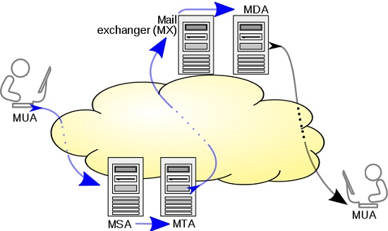

# 211.1. Using e-mail servers

## **211.1 Using e-mail servers**

**Weight:** 4

**Description:** Candidates should be able to manage an e-mail server, including the configuration of e-mail aliases, e-mail quotas and virtual e-mail domains. This objective includes configuring internal e-mail relays and monitoring e-mail servers.

**Key Knowledge Areas:**

* Configuration files for postfix
* Basic TLS configuration for postfix
* Basic knowledge of the SMTP protocol
* Awareness of sendmail and exim

**Terms and Utilities:**

* Configuration files and commands for postfix
* /etc/postfix/
* /var/spool/postfix/
* sendmail emulation layer commands
* /etc/aliases
* mail-related logs in /var/log/

## What is e-mail ?

Electronic mail \(email or e-mail\) is a method of exchanging messages \("mail"\) between people using electronic devices. Email first entered limited use in the 1960s and by the mid-1970s had taken the form now recognized as email. Email operates across computer networks, which today is primarily the Internet. As its obvious e-mail is pretty old method of communication and some times it is said that the e-mail is as old as the internet itself! But nowadays no successfull bussiness can live with out that.

## How e-mail Works?

Email is based around the use of electronic mailboxes. When an email is sent, the message is routed from server to server, all the way to the recipient's email server.



1.First the User open its mail box using using one of many mail client applications \(Like Thunderbolt, Evolution, SquirrelMail, ...\) \(which is Called MUA, Mail user Agent\) and send an e-mail.

2.Then Mail Submission Agent\(MSA\) receives electronic mail messages from a mail user agent \(MUA\) and cooperates with a mail transfer agent \(MTA\) for delivery of the mail.

3.The message is sent to the mail server tasked with transporting emails \(called the MTA, for Mail Transport Agent\) to the recipient's MTA. On the Internet, MTAs communicate with one another using the protocol SMTP, and so are logically called SMTP servers \(or sometimes outgoing mail servers\).

* **SMTP**  \(Simple Mail Transfer Protocol\). It is a protocol that really defines how e-mail is transfered and saved and is a part of the TCP/IP application layer as well as settings rules that e-mail applications follow.

4.The recipient's MTA then delivers the email to the incoming mail server \(called the MDA, for Mail Delivery Agent\), which stores the email as it waits for the user to accept it.\(Sometimes MTA can also function as an MDA\)But often \(procmail for example\) , They are independent applications that can also filter mail\(like spam\).

There are two main protocols used for retrieving email on an MDA:

* **POP3** \(Post Office Protocol\), which is used by MUAs, for retrieving email and, in certain cases, leaving a copy of it on the server.
* **IMAP** \(Internet Message Access Protocol\), which is used by MUAs,for coordinating the status of emails \(read, deleted, moved\) across multiple email clients. With IMAP, a copy of every message is saved on the server, so that this synchronization task can be completed.

  Both of those can be secured with TLS or SSL Certificates, so it is encrypted at some levels between the server and end user client \(MUA\).

### MX Record

MX records are the mail DNS record \(we discussed about earlier in DNS Course\). These records are used by MTAs to determine the authorative mail server for any particular e-mail message.

### MUA

Mail User Agent. This is whatever application we use to create and send e-mail \(Like Thunderbolt, Evolution, SquirrelMail, etc\).

### MSA

Mail Submission Agen. Acts as an intermediary or gateway between the MUA and an MTA to strat the transfer of e-mail.

### MTA

Mail Transfer Agent. Accepts e-mail from the MUA and sends it \(if needed\) to the receiving mail address \(could be another MTA if this is not the destination.

## Mail Transfer Agents\(MTAs\) for Linux

Lets look at a round up of the best and most used MTA’s on Linux mail servers:

#### 1.Send Mail

Sendmail now known as proofpoint \(after Proofpoint, Inc acquired Sendmail, Inc\) is by far the most popular and one of the oldest MTA on the Linux server platform. Sendmail has a lot of limitations though, in comparison to modern MTAs.

Because of its complicated configuration steps and demands, and weak security mechanisms, many new MTAs have come up as alternatives to Sendmail, but importantly, it offers everything to do with mail on a network.

#### 2.Exim

Exim is a free MTA developed for Unix-like operating systems such as Linux, Mac OSX, Solaris and many more. Exim offers a great level of flexibility in routing mail on a network, with outstanding mechanisms and facilities for incoming mail monitoring.

Its notable features include among others:

* No support for POP and IMAP protocols
* Supports protocols such as RFC 2821 SMTP and RFC 2033 LMTP email message transport\(LMTP is an alternative to normal SMTP for situations where the receiving side does not have a mail queue \)
* Configurations include access control lists, content scanning, encryption, routing controls among others
* Excellent documentation
* It has utilities such as Lemonade which is an assortment of SMTP and IMAP extensions to enable mobile messaging plus many more.

#### 3.Qmail

Qmail is also another free, open-source and modern Linux MTA when compared to the other MTAs we have looked at. More over, it is simple, reliable, efficient and offers extensive security features hence a secure MTA package.

It is relatively small but feature-rich and some of its features include:

* Runs on multiple Unix-like operating systems such as FreeBSD, Solaris, Mac OSX plus many more
* Simple and quick installation
* Automatic per-host configuration
* Clear separation between addresses, files and programs
* Full support for address groups
* Lets each user manage their own mail lists
* Supports an easy way to set up mailing list
* Supports VERPs \(variable envelope return path addresses on request\) undeliverable mail can reveal the undeliverable recipient address without requiring the list owner to parse bounce messages.
* Supports automatic prevention of mailing list loops
* Supports ezmlm mailing list manager
* No random lists supported and many more

#### 4.Postfix

Postfix is a cross-platform, popular MTA that was designed and developed by Wietse Zweitze Venema for his mail server while working at IBM research department.

It was primarily developed as an alternative to well known and popular**Sendmail MTA**. Postfix runs on Linux, Mac OSX, Solaris and several other Unix-like operating systems.

It borrows a lot of Sendmail properties on the outside, but it has a totally and comprehensively distinct internal operation. Additionally, it bids to be fast in performance with easy configurations and secure operation mechanism and has the following major features:

* Junk mail control
* Supports multiple protocols
* Database support
* Mailbox support
* Address manipulation support and many more

For LPIC2 exam we are just expected to know about Postfix and its configuration files, so just know about other MTAs existance.

### Postfix Configuration

Lets Install post fix and mail ustils \(We will use CentOS7\):

```text
[root@localhost ~]# yum install postfix
.....
...
..
Package 2:postfix-2.10.1-6.el7.x86_64 already installed and latest version
Nothing to do
```

as Postfix in our distrobution is used as local mail delivary service it is already installed.

```text
[root@localhost ~]# systemctl status postfix.service 
● postfix.service - Postfix Mail Transport Agent
   Loaded: loaded (/usr/lib/systemd/system/postfix.service; enabled; vendor preset: disabled)
   Active: active (running) since Sun 2018-05-20 02:20:59 EDT; 8min ago
  Process: 1080 ExecStart=/usr/sbin/postfix start (code=exited, status=0/SUCCESS)
  Process: 1071 ExecStartPre=/usr/libexec/postfix/chroot-update (code=exited, status=0/SUCCESS)
  Process: 1048 ExecStartPre=/usr/libexec/postfix/aliasesdb (code=exited, status=0/SUCCESS)
 Main PID: 1324 (master)
   CGroup: /system.slice/postfix.service
           ├─1324 /usr/libexec/postfix/master -w
           ├─1325 pickup -l -t unix -u
           └─1326 qmgr -l -t unix -u

May 20 02:20:58 localhost.localdomain systemd[1]: Starting Postfix Mail Transport A....
May 20 02:20:59 localhost.localdomain postfix/master[1324]: daemon started -- versio...
May 20 02:20:59 localhost.localdomain systemd[1]: Started Postfix Mail Transport Agent.
Hint: Some lines were ellipsized, use -l to show in full.
```

### /etc/postfix

Lets see configurations to find out how its configured.

```text
[root@localhost ~]# cd /etc/postfix/
[root@localhost postfix]# ls -la
total 160
drwxr-xr-x.   2 root root   154 Oct 28  2017 .
drwxr-xr-x. 138 root root  8192 May 20 02:23 ..
-rw-r--r--.   1 root root 20876 Jun  9  2014 access
-rw-r--r--.   1 root root 11681 Jun  9  2014 canonical
-rw-r--r--.   1 root root  9904 Jun  9  2014 generic
-rw-r--r--.   1 root root 21545 Jun  9  2014 header_checks
-rw-r--r--.   1 root root 27176 Jun  9  2014 main.cf
-rw-r--r--.   1 root root  6105 Jun  9  2014 master.cf
-rw-r--r--.   1 root root  6816 Jun  9  2014 relocated
-rw-r--r--.   1 root root 12549 Jun  9  2014 transport
-rw-r--r--.   1 root root 12494 Jun  9  2014 virtual
```

### main.cf

The Postfix main configuration file is main.cf \(please note that there is a master.cf also\). The main.cf file has tones of Documentations and settiing are in key value pairs \(Something = Value\). try `cat main.cf` to see.

```text
[root@localhost postfix]# cat main.cf 
# Global Postfix configuration file. This file lists only a subset
# of all parameters. For the syntax, and for a complete parameter
# list, see the postconf(5) manual page (command: "man 5 postconf").
#
# For common configuration examples, see BASIC_CONFIGURATION_README
# and STANDARD_CONFIGURATION_README. To find these documents, use
# the command "postconf html_directory readme_directory", or go to
# http://www.postfix.org/.
#
# For best results, change no more than 2-3 parameters at a time,
# and test if Postfix still works after every change.

# SOFT BOUNCE
#
# The soft_bounce parameter provides a limited safety net for
# testing.  When soft_bounce is enabled, mail will remain queued that
# would otherwise bounce. This parameter disables locally-generated
# bounces, and prevents the SMTP server from rejecting mail permanently
# (by changing 5xx replies into 4xx replies). However, soft_bounce
# is no cure for address rewriting mistakes or mail routing mistakes.
#
#soft_bounce = no

# LOCAL PATHNAME INFORMATION
#
# The queue_directory specifies the location of the Postfix queue.
# This is also the root directory of Postfix daemons that run chrooted.
# See the files in examples/chroot-setup for setting up Postfix chroot
# environments on different UNIX systems.
#
queue_directory = /var/spool/postfix

# The command_directory parameter specifies the location of all
# postXXX commands.
#
command_directory = /usr/sbin

# The daemon_directory parameter specifies the location of all Postfix
# daemon programs (i.e. programs listed in the master.cf file). This
# directory must be owned by root.
#
daemon_directory = /usr/libexec/postfix

# The data_directory parameter specifies the location of Postfix-writable
# data files (caches, random numbers). This directory must be owned
# by the mail_owner account (see below).
#
data_directory = /var/lib/postfix

# QUEUE AND PROCESS OWNERSHIP
#
# The mail_owner parameter specifies the owner of the Postfix queue
# and of most Postfix daemon processes.  Specify the name of a user
# account THAT DOES NOT SHARE ITS USER OR GROUP ID WITH OTHER ACCOUNTS
# AND THAT OWNS NO OTHER FILES OR PROCESSES ON THE SYSTEM.  In
# particular, don't specify nobody or daemon. PLEASE USE A DEDICATED
# USER.
#
mail_owner = postfix

# The default_privs parameter specifies the default rights used by
# the local delivery agent for delivery to external file or command.
# These rights are used in the absence of a recipient user context.
# DO NOT SPECIFY A PRIVILEGED USER OR THE POSTFIX OWNER.
#
#default_privs = nobody

# INTERNET HOST AND DOMAIN NAMES
# 
# The myhostname parameter specifies the internet hostname of this
# mail system. The default is to use the fully-qualified domain name
# from gethostname(). $myhostname is used as a default value for many
# other configuration parameters.
#
#myhostname = host.domain.tld
#myhostname = virtual.domain.tld

# The mydomain parameter specifies the local internet domain name.
# The default is to use $myhostname minus the first component.
# $mydomain is used as a default value for many other configuration
# parameters.
#
#mydomain = domain.tld

# SENDING MAIL
# 
# The myorigin parameter specifies the domain that locally-posted
# mail appears to come from. The default is to append $myhostname,
# which is fine for small sites.  If you run a domain with multiple
# machines, you should (1) change this to $mydomain and (2) set up
# a domain-wide alias database that aliases each user to
# user@that.users.mailhost.
#
# For the sake of consistency between sender and recipient addresses,
# myorigin also specifies the default domain name that is appended
# to recipient addresses that have no @domain part.
#
#myorigin = $myhostname
#myorigin = $mydomain

# RECEIVING MAIL

# The inet_interfaces parameter specifies the network interface
# addresses that this mail system receives mail on.  By default,
# the software claims all active interfaces on the machine. The
# parameter also controls delivery of mail to user@[ip.address].
#
# See also the proxy_interfaces parameter, for network addresses that
# are forwarded to us via a proxy or network address translator.
#
# Note: you need to stop/start Postfix when this parameter changes.
#
#inet_interfaces = all
#inet_interfaces = $myhostname
#inet_interfaces = $myhostname, localhost
inet_interfaces = localhost

# Enable IPv4, and IPv6 if supported
inet_protocols = all

# The proxy_interfaces parameter specifies the network interface
# addresses that this mail system receives mail on by way of a
# proxy or network address translation unit. This setting extends
# the address list specified with the inet_interfaces parameter.
#
# You must specify your proxy/NAT addresses when your system is a
# backup MX host for other domains, otherwise mail delivery loops
# will happen when the primary MX host is down.
#
#proxy_interfaces =
#proxy_interfaces = 1.2.3.4

# The mydestination parameter specifies the list of domains that this
# machine considers itself the final destination for.
#
# These domains are routed to the delivery agent specified with the
# local_transport parameter setting. By default, that is the UNIX
# compatible delivery agent that lookups all recipients in /etc/passwd
# and /etc/aliases or their equivalent.
#
# The default is $myhostname + localhost.$mydomain.  On a mail domain
# gateway, you should also include $mydomain.
#
# Do not specify the names of virtual domains - those domains are
# specified elsewhere (see VIRTUAL_README).
#
# Do not specify the names of domains that this machine is backup MX
# host for. Specify those names via the relay_domains settings for
# the SMTP server, or use permit_mx_backup if you are lazy (see
# STANDARD_CONFIGURATION_README).
#
# The local machine is always the final destination for mail addressed
# to user@[the.net.work.address] of an interface that the mail system
# receives mail on (see the inet_interfaces parameter).
#
# Specify a list of host or domain names, /file/name or type:table
# patterns, separated by commas and/or whitespace. A /file/name
# pattern is replaced by its contents; a type:table is matched when
# a name matches a lookup key (the right-hand side is ignored).
# Continue long lines by starting the next line with whitespace.
#
# See also below, section "REJECTING MAIL FOR UNKNOWN LOCAL USERS".
#
mydestination = $myhostname, localhost.$mydomain, localhost
#mydestination = $myhostname, localhost.$mydomain, localhost, $mydomain
#mydestination = $myhostname, localhost.$mydomain, localhost, $mydomain,
#    mail.$mydomain, www.$mydomain, ftp.$mydomain

# REJECTING MAIL FOR UNKNOWN LOCAL USERS
#
# The local_recipient_maps parameter specifies optional lookup tables
# with all names or addresses of users that are local with respect
# to $mydestination, $inet_interfaces or $proxy_interfaces.
#
# If this parameter is defined, then the SMTP server will reject
# mail for unknown local users. This parameter is defined by default.
#
# To turn off local recipient checking in the SMTP server, specify
# local_recipient_maps = (i.e. empty).
#
# The default setting assumes that you use the default Postfix local
# delivery agent for local delivery. You need to update the
# local_recipient_maps setting if:
#
# - You define $mydestination domain recipients in files other than
#   /etc/passwd, /etc/aliases, or the $virtual_alias_maps files.
#   For example, you define $mydestination domain recipients in    
#   the $virtual_mailbox_maps files.
#
# - You redefine the local delivery agent in master.cf.
#
# - You redefine the "local_transport" setting in main.cf.
#
# - You use the "luser_relay", "mailbox_transport", or "fallback_transport"
#   feature of the Postfix local delivery agent (see local(8)).
#
# Details are described in the LOCAL_RECIPIENT_README file.
#
# Beware: if the Postfix SMTP server runs chrooted, you probably have
# to access the passwd file via the proxymap service, in order to
# overcome chroot restrictions. The alternative, having a copy of
# the system passwd file in the chroot jail is just not practical.
#
# The right-hand side of the lookup tables is conveniently ignored.
# In the left-hand side, specify a bare username, an @domain.tld
# wild-card, or specify a user@domain.tld address.
# 
#local_recipient_maps = unix:passwd.byname $alias_maps
#local_recipient_maps = proxy:unix:passwd.byname $alias_maps
#local_recipient_maps =

# The unknown_local_recipient_reject_code specifies the SMTP server
# response code when a recipient domain matches $mydestination or
# ${proxy,inet}_interfaces, while $local_recipient_maps is non-empty
# and the recipient address or address local-part is not found.
#
# The default setting is 550 (reject mail) but it is safer to start
# with 450 (try again later) until you are certain that your
# local_recipient_maps settings are OK.
#
unknown_local_recipient_reject_code = 550

# TRUST AND RELAY CONTROL

# The mynetworks parameter specifies the list of "trusted" SMTP
# clients that have more privileges than "strangers".
#
# In particular, "trusted" SMTP clients are allowed to relay mail
# through Postfix.  See the smtpd_recipient_restrictions parameter
# in postconf(5).
#
# You can specify the list of "trusted" network addresses by hand
# or you can let Postfix do it for you (which is the default).
#
# By default (mynetworks_style = subnet), Postfix "trusts" SMTP
# clients in the same IP subnetworks as the local machine.
# On Linux, this does works correctly only with interfaces specified
# with the "ifconfig" command.
# 
# Specify "mynetworks_style = class" when Postfix should "trust" SMTP
# clients in the same IP class A/B/C networks as the local machine.
# Don't do this with a dialup site - it would cause Postfix to "trust"
# your entire provider's network.  Instead, specify an explicit
# mynetworks list by hand, as described below.
#  
# Specify "mynetworks_style = host" when Postfix should "trust"
# only the local machine.
# 
#mynetworks_style = class
#mynetworks_style = subnet
#mynetworks_style = host

# Alternatively, you can specify the mynetworks list by hand, in
# which case Postfix ignores the mynetworks_style setting.
#
# Specify an explicit list of network/netmask patterns, where the
# mask specifies the number of bits in the network part of a host
# address.
#
# You can also specify the absolute pathname of a pattern file instead
# of listing the patterns here. Specify type:table for table-based lookups
# (the value on the table right-hand side is not used).
#
#mynetworks = 168.100.189.0/28, 127.0.0.0/8
#mynetworks = $config_directory/mynetworks
#mynetworks = hash:/etc/postfix/network_table

# The relay_domains parameter restricts what destinations this system will
# relay mail to.  See the smtpd_recipient_restrictions description in
# postconf(5) for detailed information.
#
# By default, Postfix relays mail
# - from "trusted" clients (IP address matches $mynetworks) to any destination,
# - from "untrusted" clients to destinations that match $relay_domains or
#   subdomains thereof, except addresses with sender-specified routing.
# The default relay_domains value is $mydestination.
# 
# In addition to the above, the Postfix SMTP server by default accepts mail
# that Postfix is final destination for:
# - destinations that match $inet_interfaces or $proxy_interfaces,
# - destinations that match $mydestination
# - destinations that match $virtual_alias_domains,
# - destinations that match $virtual_mailbox_domains.
# These destinations do not need to be listed in $relay_domains.
# 
# Specify a list of hosts or domains, /file/name patterns or type:name
# lookup tables, separated by commas and/or whitespace.  Continue
# long lines by starting the next line with whitespace. A file name
# is replaced by its contents; a type:name table is matched when a
# (parent) domain appears as lookup key.
#
# NOTE: Postfix will not automatically forward mail for domains that
# list this system as their primary or backup MX host. See the
# permit_mx_backup restriction description in postconf(5).
#
#relay_domains = $mydestination

# INTERNET OR INTRANET

# The relayhost parameter specifies the default host to send mail to
# when no entry is matched in the optional transport(5) table. When
# no relayhost is given, mail is routed directly to the destination.
#
# On an intranet, specify the organizational domain name. If your
# internal DNS uses no MX records, specify the name of the intranet
# gateway host instead.
#
# In the case of SMTP, specify a domain, host, host:port, [host]:port,
# [address] or [address]:port; the form [host] turns off MX lookups.
#
# If you're connected via UUCP, see also the default_transport parameter.
#
#relayhost = $mydomain
#relayhost = [gateway.my.domain]
#relayhost = [mailserver.isp.tld]
#relayhost = uucphost
#relayhost = [an.ip.add.ress]

# REJECTING UNKNOWN RELAY USERS
#
# The relay_recipient_maps parameter specifies optional lookup tables
# with all addresses in the domains that match $relay_domains.
#
# If this parameter is defined, then the SMTP server will reject
# mail for unknown relay users. This feature is off by default.
#
# The right-hand side of the lookup tables is conveniently ignored.
# In the left-hand side, specify an @domain.tld wild-card, or specify
# a user@domain.tld address.
# 
#relay_recipient_maps = hash:/etc/postfix/relay_recipients

# INPUT RATE CONTROL
#
# The in_flow_delay configuration parameter implements mail input
# flow control. This feature is turned on by default, although it
# still needs further development (it's disabled on SCO UNIX due
# to an SCO bug).
# 
# A Postfix process will pause for $in_flow_delay seconds before
# accepting a new message, when the message arrival rate exceeds the
# message delivery rate. With the default 100 SMTP server process
# limit, this limits the mail inflow to 100 messages a second more
# than the number of messages delivered per second.
# 
# Specify 0 to disable the feature. Valid delays are 0..10.
# 
#in_flow_delay = 1s

# ADDRESS REWRITING
#
# The ADDRESS_REWRITING_README document gives information about
# address masquerading or other forms of address rewriting including
# username->Firstname.Lastname mapping.

# ADDRESS REDIRECTION (VIRTUAL DOMAIN)
#
# The VIRTUAL_README document gives information about the many forms
# of domain hosting that Postfix supports.

# "USER HAS MOVED" BOUNCE MESSAGES
#
# See the discussion in the ADDRESS_REWRITING_README document.

# TRANSPORT MAP
#
# See the discussion in the ADDRESS_REWRITING_README document.

# ALIAS DATABASE
#
# The alias_maps parameter specifies the list of alias databases used
# by the local delivery agent. The default list is system dependent.
#
# On systems with NIS, the default is to search the local alias
# database, then the NIS alias database. See aliases(5) for syntax
# details.
# 
# If you change the alias database, run "postalias /etc/aliases" (or
# wherever your system stores the mail alias file), or simply run
# "newaliases" to build the necessary DBM or DB file.
#
# It will take a minute or so before changes become visible.  Use
# "postfix reload" to eliminate the delay.
#
#alias_maps = dbm:/etc/aliases
alias_maps = hash:/etc/aliases
#alias_maps = hash:/etc/aliases, nis:mail.aliases
#alias_maps = netinfo:/aliases

# The alias_database parameter specifies the alias database(s) that
# are built with "newaliases" or "sendmail -bi".  This is a separate
# configuration parameter, because alias_maps (see above) may specify
# tables that are not necessarily all under control by Postfix.
#
#alias_database = dbm:/etc/aliases
#alias_database = dbm:/etc/mail/aliases
alias_database = hash:/etc/aliases
#alias_database = hash:/etc/aliases, hash:/opt/majordomo/aliases

# ADDRESS EXTENSIONS (e.g., user+foo)
#
# The recipient_delimiter parameter specifies the separator between
# user names and address extensions (user+foo). See canonical(5),
# local(8), relocated(5) and virtual(5) for the effects this has on
# aliases, canonical, virtual, relocated and .forward file lookups.
# Basically, the software tries user+foo and .forward+foo before
# trying user and .forward.
#
#recipient_delimiter = +

# DELIVERY TO MAILBOX
#
# The home_mailbox parameter specifies the optional pathname of a
# mailbox file relative to a user's home directory. The default
# mailbox file is /var/spool/mail/user or /var/mail/user.  Specify
# "Maildir/" for qmail-style delivery (the / is required).
#
#home_mailbox = Mailbox
#home_mailbox = Maildir/

# The mail_spool_directory parameter specifies the directory where
# UNIX-style mailboxes are kept. The default setting depends on the
# system type.
#
#mail_spool_directory = /var/mail
#mail_spool_directory = /var/spool/mail

# The mailbox_command parameter specifies the optional external
# command to use instead of mailbox delivery. The command is run as
# the recipient with proper HOME, SHELL and LOGNAME environment settings.
# Exception:  delivery for root is done as $default_user.
#
# Other environment variables of interest: USER (recipient username),
# EXTENSION (address extension), DOMAIN (domain part of address),
# and LOCAL (the address localpart).
#
# Unlike other Postfix configuration parameters, the mailbox_command
# parameter is not subjected to $parameter substitutions. This is to
# make it easier to specify shell syntax (see example below).
#
# Avoid shell meta characters because they will force Postfix to run
# an expensive shell process. Procmail alone is expensive enough.
#
# IF YOU USE THIS TO DELIVER MAIL SYSTEM-WIDE, YOU MUST SET UP AN
# ALIAS THAT FORWARDS MAIL FOR ROOT TO A REAL USER.
#
#mailbox_command = /some/where/procmail
#mailbox_command = /some/where/procmail -a "$EXTENSION"

# The mailbox_transport specifies the optional transport in master.cf
# to use after processing aliases and .forward files. This parameter
# has precedence over the mailbox_command, fallback_transport and
# luser_relay parameters.
#
# Specify a string of the form transport:nexthop, where transport is
# the name of a mail delivery transport defined in master.cf.  The
# :nexthop part is optional. For more details see the sample transport
# configuration file.
#
# NOTE: if you use this feature for accounts not in the UNIX password
# file, then you must update the "local_recipient_maps" setting in
# the main.cf file, otherwise the SMTP server will reject mail for    
# non-UNIX accounts with "User unknown in local recipient table".
#
# Cyrus IMAP over LMTP. Specify ``lmtpunix      cmd="lmtpd"
# listen="/var/imap/socket/lmtp" prefork=0'' in cyrus.conf.
#mailbox_transport = lmtp:unix:/var/lib/imap/socket/lmtp

# If using the cyrus-imapd IMAP server deliver local mail to the IMAP
# server using LMTP (Local Mail Transport Protocol), this is prefered
# over the older cyrus deliver program by setting the
# mailbox_transport as below:
#
# mailbox_transport = lmtp:unix:/var/lib/imap/socket/lmtp
#
# The efficiency of LMTP delivery for cyrus-imapd can be enhanced via
# these settings.
#
# local_destination_recipient_limit = 300
# local_destination_concurrency_limit = 5
#
# Of course you should adjust these settings as appropriate for the
# capacity of the hardware you are using. The recipient limit setting
# can be used to take advantage of the single instance message store
# capability of Cyrus. The concurrency limit can be used to control
# how many simultaneous LMTP sessions will be permitted to the Cyrus
# message store. 
#
# Cyrus IMAP via command line. Uncomment the "cyrus...pipe" and
# subsequent line in master.cf.
#mailbox_transport = cyrus

# The fallback_transport specifies the optional transport in master.cf
# to use for recipients that are not found in the UNIX passwd database.
# This parameter has precedence over the luser_relay parameter.
#
# Specify a string of the form transport:nexthop, where transport is
# the name of a mail delivery transport defined in master.cf.  The
# :nexthop part is optional. For more details see the sample transport
# configuration file.
#
# NOTE: if you use this feature for accounts not in the UNIX password
# file, then you must update the "local_recipient_maps" setting in
# the main.cf file, otherwise the SMTP server will reject mail for    
# non-UNIX accounts with "User unknown in local recipient table".
#
#fallback_transport = lmtp:unix:/var/lib/imap/socket/lmtp
#fallback_transport =

# The luser_relay parameter specifies an optional destination address
# for unknown recipients.  By default, mail for unknown@$mydestination,
# unknown@[$inet_interfaces] or unknown@[$proxy_interfaces] is returned
# as undeliverable.
#
# The following expansions are done on luser_relay: $user (recipient
# username), $shell (recipient shell), $home (recipient home directory),
# $recipient (full recipient address), $extension (recipient address
# extension), $domain (recipient domain), $local (entire recipient
# localpart), $recipient_delimiter. Specify ${name?value} or
# ${name:value} to expand value only when $name does (does not) exist.
#
# luser_relay works only for the default Postfix local delivery agent.
#
# NOTE: if you use this feature for accounts not in the UNIX password
# file, then you must specify "local_recipient_maps =" (i.e. empty) in
# the main.cf file, otherwise the SMTP server will reject mail for    
# non-UNIX accounts with "User unknown in local recipient table".
#
#luser_relay = $user@other.host
#luser_relay = $local@other.host
#luser_relay = admin+$local

# JUNK MAIL CONTROLS
# 
# The controls listed here are only a very small subset. The file
# SMTPD_ACCESS_README provides an overview.

# The header_checks parameter specifies an optional table with patterns
# that each logical message header is matched against, including
# headers that span multiple physical lines.
#
# By default, these patterns also apply to MIME headers and to the
# headers of attached messages. With older Postfix versions, MIME and
# attached message headers were treated as body text.
#
# For details, see "man header_checks".
#
#header_checks = regexp:/etc/postfix/header_checks

# FAST ETRN SERVICE
#
# Postfix maintains per-destination logfiles with information about
# deferred mail, so that mail can be flushed quickly with the SMTP
# "ETRN domain.tld" command, or by executing "sendmail -qRdomain.tld".
# See the ETRN_README document for a detailed description.
# 
# The fast_flush_domains parameter controls what destinations are
# eligible for this service. By default, they are all domains that
# this server is willing to relay mail to.
# 
#fast_flush_domains = $relay_domains

# SHOW SOFTWARE VERSION OR NOT
#
# The smtpd_banner parameter specifies the text that follows the 220
# code in the SMTP server's greeting banner. Some people like to see
# the mail version advertised. By default, Postfix shows no version.
#
# You MUST specify $myhostname at the start of the text. That is an
# RFC requirement. Postfix itself does not care.
#
#smtpd_banner = $myhostname ESMTP $mail_name
#smtpd_banner = $myhostname ESMTP $mail_name ($mail_version)

# PARALLEL DELIVERY TO THE SAME DESTINATION
#
# How many parallel deliveries to the same user or domain? With local
# delivery, it does not make sense to do massively parallel delivery
# to the same user, because mailbox updates must happen sequentially,
# and expensive pipelines in .forward files can cause disasters when
# too many are run at the same time. With SMTP deliveries, 10
# simultaneous connections to the same domain could be sufficient to
# raise eyebrows.
# 
# Each message delivery transport has its XXX_destination_concurrency_limit
# parameter.  The default is $default_destination_concurrency_limit for
# most delivery transports. For the local delivery agent the default is 2.

#local_destination_concurrency_limit = 2
#default_destination_concurrency_limit = 20

# DEBUGGING CONTROL
#
# The debug_peer_level parameter specifies the increment in verbose
# logging level when an SMTP client or server host name or address
# matches a pattern in the debug_peer_list parameter.
#
debug_peer_level = 2

# The debug_peer_list parameter specifies an optional list of domain
# or network patterns, /file/name patterns or type:name tables. When
# an SMTP client or server host name or address matches a pattern,
# increase the verbose logging level by the amount specified in the
# debug_peer_level parameter.
#
#debug_peer_list = 127.0.0.1
#debug_peer_list = some.domain

# The debugger_command specifies the external command that is executed
# when a Postfix daemon program is run with the -D option.
#
# Use "command .. & sleep 5" so that the debugger can attach before
# the process marches on. If you use an X-based debugger, be sure to
# set up your XAUTHORITY environment variable before starting Postfix.
#
debugger_command =
     PATH=/bin:/usr/bin:/usr/local/bin:/usr/X11R6/bin
     ddd $daemon_directory/$process_name $process_id & sleep 5

# If you can't use X, use this to capture the call stack when a
# daemon crashes. The result is in a file in the configuration
# directory, and is named after the process name and the process ID.
#
# debugger_command =
#    PATH=/bin:/usr/bin:/usr/local/bin; export PATH; (echo cont;
#    echo where) | gdb $daemon_directory/$process_name $process_id 2>&1
#    >$config_directory/$process_name.$process_id.log & sleep 5
#
# Another possibility is to run gdb under a detached screen session.
# To attach to the screen sesssion, su root and run "screen -r
# <id_string>" where <id_string> uniquely matches one of the detached
# sessions (from "screen -list").
#
# debugger_command =
#    PATH=/bin:/usr/bin:/sbin:/usr/sbin; export PATH; screen
#    -dmS $process_name gdb $daemon_directory/$process_name
#    $process_id & sleep 1

# INSTALL-TIME CONFIGURATION INFORMATION
#
# The following parameters are used when installing a new Postfix version.
# 
# sendmail_path: The full pathname of the Postfix sendmail command.
# This is the Sendmail-compatible mail posting interface.
# 
sendmail_path = /usr/sbin/sendmail.postfix

# newaliases_path: The full pathname of the Postfix newaliases command.
# This is the Sendmail-compatible command to build alias databases.
#
newaliases_path = /usr/bin/newaliases.postfix

# mailq_path: The full pathname of the Postfix mailq command.  This
# is the Sendmail-compatible mail queue listing command.
# 
mailq_path = /usr/bin/mailq.postfix

# setgid_group: The group for mail submission and queue management
# commands.  This must be a group name with a numerical group ID that
# is not shared with other accounts, not even with the Postfix account.
#
setgid_group = postdrop

# html_directory: The location of the Postfix HTML documentation.
#
html_directory = no

# manpage_directory: The location of the Postfix on-line manual pages.
#
manpage_directory = /usr/share/man

# sample_directory: The location of the Postfix sample configuration files.
# This parameter is obsolete as of Postfix 2.1.
#
sample_directory = /usr/share/doc/postfix-2.10.1/samples

# readme_directory: The location of the Postfix README files.
#
readme_directory = /usr/share/doc/postfix-2.10.1/README_FILES
```

To see just customized settings in post fix configuration we use `postconf -n` command:

```text
[root@localhost postfix]# postconf -n
alias_database = hash:/etc/aliases
alias_maps = hash:/etc/aliases
command_directory = /usr/sbin
config_directory = /etc/postfix
daemon_directory = /usr/libexec/postfix
data_directory = /var/lib/postfix
debug_peer_level = 2
debugger_command = PATH=/bin:/usr/bin:/usr/local/bin:/usr/X11R6/bin ddd $daemon_directory/$process_name $process_id & sleep 5
html_directory = no
inet_interfaces = localhost
inet_protocols = all
mail_owner = postfix
mailq_path = /usr/bin/mailq.postfix
manpage_directory = /usr/share/man
mydestination = $myhostname, localhost.$mydomain, localhost
newaliases_path = /usr/bin/newaliases.postfix
queue_directory = /var/spool/postfix
readme_directory = /usr/share/doc/postfix-2.10.1/README_FILES
sample_directory = /usr/share/doc/postfix-2.10.1/samples
sendmail_path = /usr/sbin/sendmail.postfix
setgid_group = postdrop
unknown_local_recipient_reject_code = 550
```

And if we use postconf without -n then it shows all settings ,even defaults. So if we have made some changes we would use "-n" switches to do more investigation on that.

Lets take a look at most impotant setting of postfix in main.cf file:

myhostname : By default specifies the internet name host name of this mail system, For none public Postfix mail servers\(Like what we have here \) by defualt it uses`get hostname` if it is not set! How ever if we are going to have a publicly available email server or even internally , as long as we have a DNS entry for our Server, we should certainly set what our hostname is with Full Domain:

```text
#myhostname = host.domain.tld
#myhostname = virtual.domain.tld
myhostname = centos7.example.com
```

One of the benefits of setting myhostname and mydomain is that from now on we can easily reffer to it using `$myhostname` during configuratoin.

mydomain : Set domain name for our email server, The default is to use `$myhostname` minus the first component:

```text
#mydomain = domain.tld
mydomain = example.com
```

disable-vrfy-command \(might not exist in configurations\) It avoid e-mail address mining by doing some things behinde the scenes, that make scanning for e-mail addresses more deficault for thoese systems which are designed to do exactly that. if we are going to configure a publicly available mail server then we should set it to "yes". The default value, even if dose not exist, is "no",\( no matter where we put that in configuration file\):

```text
disable_vrfy_command = no
# The default value is "no", no changes was necessary
```

inet\_interfaces it determines what interfaces on our server that the postfix process will listen for connections on. by default it is set for "only local host"

But for configuring an internl mail server which provides connectivity for other clients, or if we are going to offer connectivity for internal and external clients, we should set it to "all":

```text
# Note: you need to stop/start Postfix when this parameter changes.
#
#inet_interfaces = all
#inet_interfaces = $myhostname
#inet_interfaces = $myhostname, localhost
inet_interfaces = localhost
#no changes has beed made
```

mydestination it is set to "myhostname" by default, and it is a list of all the domain or the systems and host that the postfix accept e-mail for. If we had a plan for accepting e-mails from other domains, or aggregate multiple domains then would list the appropriate host and domains here "," delimited and postfix would accpet mail from each of those domains.

We should also make sure that if we are accepting mail from domains outside of localhost, then we should have mx records for our mail server in our DNS, because many mail servers won't deliver e-mail to the host which dosen't have appropriate mx record for the host that is the authorative responsibilty for a paricular doman.

```text
mydestination = $myhostname, localhost.$mydomain, localhost
#mydestination = $myhostname, localhost.$mydomain, localhost, $mydomain
#mydestination = $myhostname, localhost.$mydomain, localhost, $mydomain,
#       mail.$mydomain, www.$mydomain, ftp.$mydomain
#no changes has beed made
```

relay-domains : it canhave multiple values that depends on what we are going to allow ourself to e-mail relay for, we can use `$mydestination` which previously defined or we ca use full host and domain name that we are going to accept e-mail and then relay e-mail to another domain:

```text
#relay_domains = $mydestination
#no changes is made
```

relayhost : defines the next connection that we have for SMTP:

```text
#relayhost = $mydomain
#relayhost = [gateway.my.domain]
#relayhost = [mailserver.isp.tld]
#relayhost = uucphost
#relayhost = [an.ip.add.ress]
#no changes has beed made
```

These were settings that we need to know at minimum to setup our postfix configuration for a local host based distribution system for SMTP email.Lets go a head. Unfortunately there isn't any tools for configuration test so we use ordinary things:

```text
[root@localhost postfix]# systemctl restart postfix
[root@localhost postfix]# systemctl status postfix
● postfix.service - Postfix Mail Transport Agent
   Loaded: loaded (/usr/lib/systemd/system/postfix.service; enabled; vendor preset: disabled)
   Active: active (running) since Mon 2018-05-21 02:04:46 EDT; 15s ago
  Process: 12585 ExecStop=/usr/sbin/postfix stop (code=exited, status=0/SUCCESS)
  Process: 12682 ExecStart=/usr/sbin/postfix start (code=exited, status=0/SUCCESS)
  Process: 12678 ExecStartPre=/usr/libexec/postfix/chroot-update (code=exited, status=0/SUCCESS)
  Process: 12671 ExecStartPre=/usr/libexec/postfix/aliasesdb (code=exited, status=0/SUCCESS)
 Main PID: 12763 (master)
   CGroup: /system.slice/postfix.service
           ├─12763 /usr/libexec/postfix/master -w
           ├─12765 pickup -l -t unix -u
           └─12766 qmgr -l -t unix -u

May 21 02:04:45 localhost.localdomain systemd[1]: Starting Postfix Mail Transport A....
May 21 02:04:46 localhost.localdomain postfix/master[12763]: daemon started -- versi...
May 21 02:04:46 localhost.localdomain systemd[1]: Started Postfix Mail Transport Agent.
Hint: Some lines were ellipsized, use -l to show in full.

[root@localhost postfix]# telnet localhost 25
Trying ::1...
Connected to localhost.
Escape character is '^]'.
220 centos7.example.com ESMTP Postfix
helo
501 Syntax: HELO hostname
quit
221 2.0.0 Bye
Connection closed by foreign host.
```

### sendmail emulation layer commands

As we said Sendmail is the oldest MTA, thus any other MTA which has come after SendMail, has tried to keep itself backward compatible with sendmail by providing a sendmail emulation layer. So we can use sendmail commands on the command line regardless of what MTA has been installed in our distrobiution. Two examples of that are `mailq`and `sendmail`. mailq is available on most systems to check the mail queue. It is equivalent to sendmail -bp, which works with Postfix too.

```text
[root@localhost ~]# sendmail -bp
-Queue ID- --Size-- ----Arrival Time---- -Sender/Recipient-------
5A0F861A6DDD      524 Mon May 21 03:45:15  user1@centos7.example.com
              (connect to localhost.com[74.125.224.72]:25: Connection refused)
                                         user2@localhost.com

8C43F61A6DC9      447 Mon May 21 03:46:04  user1@centos7.example.com
              (connect to localhost.com[74.125.224.72]:25: Connection refused)
                                         user2@localhost.com

-- 1 Kbytes in 2 Requests.
```

### mail command

Lets send a local e-mail from one user to another:

```text
[root@localhost ~]# mail
No mail for root
```

```text
[user1@localhost ~]$ mail -s "hello root!" root@localhost
Hi there! I am user1
EOT
```

```text
[root@localhost ~]# mail
Heirloom Mail version 12.5 7/5/10.  Type ? for help.
"/var/spool/mail/root": 1 message 1 new
>N  1 user1@centos7.exampl  Mon May 21 03:57  18/640   "hello root!"
& n
Message  1:
From user1@centos7.example.com  Mon May 21 03:57:19 2018
Return-Path: <user1@centos7.example.com>
X-Original-To: root@localhost
Delivered-To: root@localhost.example.com
Date: Mon, 21 May 2018 03:57:19 -0400
To: root@localhost.example.com, ""@root.example.com
Subject: hello
User-Agent: Heirloom mailx 12.5 7/5/10
Content-Type: text/plain; charset=us-ascii
From: user1@centos7.example.com
Status: R

Hi there! I am user1

& r
To: ""@root.example.com root@localhost.example.com
 user1@centos7.example.com
Subject: Re: hello root!

user1@centos7.example.com wrote:

> Hi there! I am user1
Hi user! I am root. Thank you :-)
EOT
& q
New mail has arrived.
Held 1 message in /var/spool/mail/root
You have mail in /var/spool/mail/root
```

some of mail command hot keys are:

```text
Mail Command               Description
-------------------------  --------------------------------------------
t [message list]           type message(s).
n                          goto and type next message.
e [message list]           edit message(s).
f [message list]           give head lines of messages.
d [message list]           delete message(s).
s [message list] <file>    append message(s) to file.
u [message list]           undelete message(s).
R [message list]           reply to message sender(s).
r [message list]           reply to message sender(s) and all recipients.
p [message list]           print message list.
pre [message list]         make messages go back to /var/mail.
m <recipient list>         mail to specific recipient(s).
q                          quit, saving unresolved messages in mbox.
x                          quit, do not remove system mailbox.
h                          print out active message headers.
!                          shell escape.
| [msglist] command        pipe message(s) to shell command.
pi [msglist] command       pipe message(s) to shell command.
cd [directory]             chdir to directory or home if none given
fi <file>                  switch to file (%=system inbox, %user=user's
                           system inbox).  + searches in your folder
                           directory for the file.
set variable[=value]       set Mail variable.
```

## /var/spool/postfix

In this directory postfix does its stuf. Any queued messagesare stored here:

```text
[root@localhost ~]# cd /var/spool/postfix/
You have new mail in /var/spool/mail/root
[root@localhost postfix]# ls -l
total 0
drwx------. 2 postfix root       6 May 21 04:38 active
drwx------. 2 postfix root       6 May 21 04:38 bounce
drwx------. 2 postfix root       6 Jun  9  2014 corrupt
drwx------. 4 postfix root      24 May 21 03:46 defer
drwx------. 4 postfix root      24 May 21 03:46 deferred
drwx------. 2 postfix root       6 Jun  9  2014 flush
drwx------. 2 postfix root       6 Jun  9  2014 hold
drwx------. 2 postfix root       6 May 21 04:38 incoming
drwx-wx---. 2 postfix postdrop   6 May 21 04:38 maildrop
drwxr-xr-x. 2 root    root     133 May 21 03:55 pid
drwx------. 2 postfix root     256 May 21 02:04 private
drwx--x---. 2 postfix postdrop  73 May 21 02:04 public
drwx------. 2 postfix root       6 Jun  9  2014 saved
drwx------. 2 postfix root       6 Jun  9  2014 trace
```

You can see large number of directories here. Most of these directories will only have information if postfix configuration is holding e-mail for some reason or if it is waiting to deliver it, otherwise most of these directories\(except pid or corrupt\) should always remain empty.

## /var/spool/mail

Specifies the default mail drop directory. By default all mail is delivered to the /var/spool/mail/&lt;username&gt; file.

```text
[root@localhost postfix]# cd ..
[root@localhost spool]# cd mail/
[root@localhost mail]# pwd
/var/spool/mail
[root@localhost mail]# ls -l
total 20
-rw-rw----. 1 pabros mail    0 Oct 28  2017 payam
-rw-------. 1 root   mail 1268 May 21 04:38 root
-rw-rw----. 1 rpc    mail    0 Oct 28  2017 rpc
-rw-rw----. 1 user1  mail 8564 May 21 04:35 user1
-rw-rw----. 1 user2  mail 2563 May 21 04:38 user2
```

when postfix recieve a message, if its going localy then it goes to /var/spool/mail directory on the local system, if it is going to be send it some where else , \( it will exist in /var/spool/postfix directory long enough to send the e-mail out and then it wiil flush and clear the directory once it has been successfully sent.

### Logging

Postfix uses the syslog daemon for its logging. When`/etc/syslog.conf`is configured.Lets take a closer look at look at postfix activities :

```text
[root@localhost mail]#  cd /var/log
[root@localhost log]# ls
anaconda           firewalld           pluto              tallylog
audit              gdm                 ppp                tuned
boot.log           glusterfs           qemu-ga            vmware-vgauthsvc.log.0
boot.log-20180520  grubby_prune_debug  rhsm               vmware-vmsvc.log
boot.log-20180521  httpd               sa                 wpa_supplicant.log
btmp               lastlog             samba              wtmp
chrony             libvirt             secure             Xorg.0.log
cron               maillog             secure-20180520    Xorg.0.log.old
cron-20180520      maillog-20180520    speech-dispatcher  Xorg.9.log
cups               messages            spooler            yum.log
dmesg              messages-20180520   spooler-20180520
dmesg.old          ntpstats            sssd
[root@localhost log]# tail maillog
May 21 04:38:08 localhost postfix/qmgr[12766]: 9ACDC61278A9: removed
May 21 04:39:47 localhost postfix/qmgr[12766]: 5A0F861A6DDD: from=<user1@centos7.example.com>, size=524, nrcpt=1 (queue active)
May 21 04:40:11 localhost postfix/smtp[20507]: connect to localhost.com[74.125.224.72]:25: Connection refused
May 21 04:40:11 localhost postfix/smtp[20507]: 5A0F861A6DDD: to=<user2@localhost.com>, relay=none, delay=3296, delays=3272/0/24/0, dsn=4.4.1, status=deferred (connect to localhost.com[74.125.224.72]:25: Connection refused)
May 21 21:34:09 localhost postfix/qmgr[12766]: 5A0F861A6DDD: from=<user1@centos7.example.com>, size=524, nrcpt=1 (queue active)
May 21 21:34:09 localhost postfix/qmgr[12766]: 8C43F61A6DC9: from=<user1@centos7.example.com>, size=447, nrcpt=1 (queue active)
May 21 21:34:31 localhost postfix/smtp[21023]: connect to localhost.com[74.125.224.72]:25: Connection refused
May 21 21:34:31 localhost postfix/smtp[21023]: 5A0F861A6DDD: to=<user2@localhost.com>, relay=none, delay=64156, delays=64134/0.05/22/0, dsn=4.4.1, status=deferred (connect to localhost.com[74.125.224.72]:25: Connection refused)
May 21 21:34:31 localhost postfix/smtp[21024]: connect to localhost.com[74.125.224.72]:25: Connection refused
May 21 21:34:31 localhost postfix/smtp[21024]: 8C43F61A6DC9: to=<user2@localhost.com>, relay=none, delay=64107, delays=64085/0.04/22/0, dsn=4.4.1, status=deferred (connect to localhost.com[74.125.224.72]:25: Connection refused)
```

## email aliases

email aliases are desgined for e-mail system to take an e-mail that is for one destination address, and then send it to a different one. Literally an alias for different name.

### /etc/aliases

Used to redirect mail for local recepients.

```text
[root@localhost log]# cat /etc/aliases
#
#  Aliases in this file will NOT be expanded in the header from
#  Mail, but WILL be visible over networks or from /bin/mail.
#
#    >>>>>>>>>>    The program "newaliases" must be run after
#    >> NOTE >>    this file is updated for any changes to
#    >>>>>>>>>>    show through to sendmail.
#

# Basic system aliases -- these MUST be present.
mailer-daemon:    postmaster
postmaster:    root

# General redirections for pseudo accounts.
bin:        root
daemon:        root
adm:        root
lp:        root
sync:        root
shutdown:    root
halt:        root
mail:        root
news:        root
uucp:        root
operator:    root
games:        root
gopher:        root
ftp:        root
nobody:        root
radiusd:    root
nut:        root
dbus:        root
vcsa:        root
canna:        root
wnn:        root
rpm:        root
nscd:        root
pcap:        root
apache:        root
webalizer:    root
dovecot:    root
fax:        root
quagga:        root
radvd:        root
pvm:        root
amandabackup:        root
privoxy:    root
ident:        root
named:        root
xfs:        root
gdm:        root
mailnull:    root
postgres:    root
sshd:        root
smmsp:        root
postfix:    root
netdump:    root
ldap:        root
squid:        root
ntp:        root
mysql:        root
desktop:    root
rpcuser:    root
rpc:        root
nfsnobody:    root

ingres:        root
system:        root
toor:        root
manager:    root
dumper:        root
abuse:        root

newsadm:    news
newsadmin:    news
usenet:        news
ftpadm:        ftp
ftpadmin:    ftp
ftp-adm:    ftp
ftp-admin:    ftp
www:        webmaster
webmaster:    root
noc:        root
security:    root
hostmaster:    root
info:        postmaster
marketing:    postmaster
sales:        postmaster
support:    postmaster


# trap decode to catch security attacks
decode:        root

# Person who should get root's mail
#root:        marc

###Add a user alias for our system
user3:    root
```

Each line of /etc/aliases has the format of alias: user. Two system aliases must always be present: mailer\_daemon: postmaster and postmaster: root. We can use aliases for all kind of daemons, for example use ntp: root. Now we can add a line to redirect all mail to root to a specific user or group of administrators, for example user3: root. So although we dont have any "user3" in our system, but if an e-mail is sent to user3 it would not be rejected.

### newaliases

After any changes in /etc/aliases we need to re-create binary file aliases.db . For that we stop postfix service, use newaliases command to re-create aliases.db and then start the postfix service again:

```text
[root@localhost ~]# cat /etc/passwd | grep user3
[root@localhost ~]# systemctl stop postfix.service 
[root@localhost ~]# ls -la /etc/aliases.db
-rw-r--r--. 1 root root 12288 Oct 28  2017 /etc/aliases.db
[root@localhost ~]# newaliases
[root@localhost ~]# ls -la /etc/aliases.db
-rw-r--r--. 1 root root 12288 May 21 23:13 /etc/aliases.db
[root@localhost ~]# systemctl start postfix
```

Now lets send an e-mail to user3:

```text
[user1@localhost ~]$ mail -s "From user1 to user3" user3@localhost
Hi my dear friend are you there? 
.
EOT
```

```text
[root@localhost ~]# whoami
root
You have mail in /var/spool/mail/root
[root@localhost ~]# mail
Heirloom Mail version 12.5 7/5/10.  Type ? for help.
"/var/spool/mail/root": 1 message 1 new
>N  1 user1@centos7.exampl  Mon May 21 23:27  18/648   "From user1 to user3"
& r
To: user1@centos7.example.com user3@localhost.example.com
Subject: Re: From user1 to user3

user1@centos7.example.com wrote:

> Hi my dear friend are you there?
```

```text
[user1@localhost ~]$ mail
Heirloom Mail version 12.5 7/5/10.  Type ? for help.
"/var/spool/mail/user1": 11 messages 11 new
>N  1 root                  Mon May 21 23:31  24/871   "Re: From user1 to user3"
& 1
Message 1:
From root@centos7.example.com  Mon May 21 23:31:19 2018
Return-Path: <root@centos7.example.com>
X-Original-To: user1@centos7.example.com
Delivered-To: user1@centos7.example.com
Date: Mon, 21 May 2018 23:31:19 -0400
To: user3@localhost.example.com, user1@centos7.example.com
Subject: Re: From user1 to user3
User-Agent: Heirloom mailx 12.5 7/5/10
Content-Type: text/plain; charset=us-ascii
From: root@centos7.example.com (root)
Status: R

user1@centos7.example.com wrote:

> Hi my dera friend are you there?
r
HA HA HA i am root!
```

### virtual

virtual is similar to aliases but it is used to redirect e-mail to the virtual destinations. It is common in multiple domain e-mail implementations. Like aliases we provied a list of an e-mail address that goes to something else.

In our case as we are not doing any relays, we are not configuring for any domains, there is nothing for us to really test here, other than being aware of this particular setting allow us to control e-mail for other domains especially in a multi domain systems or seperate servers.

For demonstration we just show how it would be:

Try `cat /etc/postfix/virtual` . It has all kinds of rules that we can apply .

For example we can add these two items at the bottom of /etc/postfix/virtual file\(stop postfix service before that\):

```text
abc@xyz.com        user1
efg@lmnop.com        user2
```

Like aliases we would need to convert it to binary files using postmap command:

```text
[root@localhost ~]# postmap /etc/postfix/virtual
```

Next we need to set  __`aliasvirtualmaps` in main.cf configuration file:

```text
  ### if have plan to use virtual feature add:
  #virtual_alias_map = unix:hash:/etc/postfix/virtual
```

and do not forget to start postfix service . try tail /var/log/maillog to find out what is going on after setting up virtuals.

That was some of most important postfix files and configurations!

