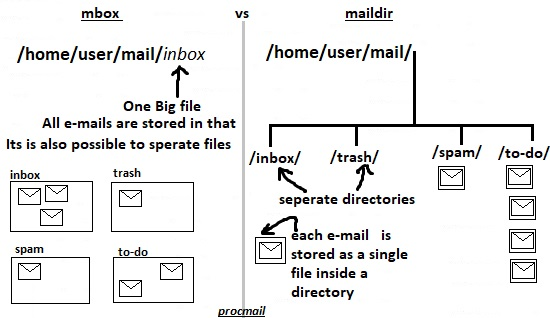

# 211.2. Managing E-Mail Delivery

## **211.2 Managing E-Mail Delivery**

**Weight:** 2

**Description:** Candidates should be able to implement client e-mail management software to filter, sort and monitor incoming user e-mail.

**Key Knowledge Areas:**

* Understanding of Sieve functionality, syntax and operators
* Use Sieve to filter and sort mail with respect to sender, recipient\(s\), headers and size
* Awareness of procmail

**Terms and Utilities:**

* Conditions and comparison operators
* keep, fileinto, redirect, reject, discard, stop
* Dovecot vacation extension

In previous lesson we understand that the postfix store e-mails in /var/spool/mail directory. In this lesson we will get familiar with procmail software for managing e-mails and different ways of doing that.

## procmail 

Most of MTAs \(Mail Transfer Agents / Mail Servers\) work with procmail or at leased they are enabled to work with procmail.


procmail, a mail delivery agent \(MDA\), can sort incoming mail into various directories and filter out spam messages. Procmail is stable, but no longer maintained, and a number of security vulnerabilities have been discovered since its last release. Users who wish to use a maintained program are advised by procmail's author, Philip Guenther, to use an alternative tool\(like maildrop or sieve\), because it has not been updated since 2001.Any how,as we are preparing for lpic2 exam lets continue.

postfix stores users emails in /var/spool/mail/&lt;user name&gt; . It creates a file and append every user's e-mail to the end of that big text file! Mean while it takes space from system /var directory.

procmail lets us to store e-mails in one of specified user's directories, usually `/home/<user name>/mail/` directory and sort it.

procmail can store e-mails in two different storage formats, mbox format or maildr format.



mbox is the older mail storage system. While mbox places all messages in the same file on the server, Maildir stores messages in individual files with unique names.

#### Mbox format

Mbox is the traditional email storage format. In this format there is only one regular text file which serves as the user’s mailbox.Typically, the name of this file is /var/spool/mail/&lt;user name&gt;. Mbox locks the mailbox when an operation is performed on the mailbox. After the operation the mailbox is unlocked.

Advantages:

* Mbox format is universally supported
* Appending new email is fast
* Searching inside single mailbox is fast

Disadvantages:

* Mbox is known for locking problems
* The mbox format is prone to corruption

#### Maildir format

Maildir is the newer email storage format. A directory maildir is created for each email user, typically in the users’ home directories. Under this maildir directory by default three more directories exist: new, cur and tmp.

Advantages:

* Locating, retrieving and deleting a specific email is fast, particularly when a email folder contains hundreds of messages
* Minimal to no file locking needed
* Can be used on a network file system
* Immune to mailbox corruption \(assuming the hardware will not fail\)

Disadvantages:

* Some filesystems may not efficiently handle a large number of small files
* Searching text, which requires all email files to be opened is slow

procmail might has been installed on your distro, other wise install it:

```text
[root@localhost ~]# yum install procmail
```

with that procmail just install some binary files which would be used by postfix. procmail dosen't have any services! And it doesn't have any configuration files!

Procmail can be invoked in several different ways. As email is placed on your email spool file, Procmail can be configured to start up, filter the email to locations configured for use with your MUA, and quit. Or, your MUA could be configured to bring up Procmail any time a message is received so that messages are moved into their correct mailboxes\(as we do here\).

So what we need to do is configuring postfix to use procmail by setting up `mailbox_command = procmail` in main.cf configuration file.

```text
[root@localhost ~]# cd /etc/postfix/
[root@localhost postfix]# ls
access     generic        main.cf    relocated  virtual
canonical  header_checks  master.cf  transport  virtual.db
[root@localhost postfix]# vim main.cf 
[root@localhost postfix]# cat main.cf | grep mailbox_command
# The mailbox_command parameter specifies the optional external
# Unlike other Postfix configuration parameters, the mailbox_command
#mailbox_command = /some/where/procmail
#mailbox_command = /some/where/procmail -a "$EXTENSION"
# has precedence over the mailbox_command, fallback_transport and
mailbox_command = procmail

[root@localhost postfix]# systemctl restart postfix
```

Now postfix sends every thing which delivers localy to the procmail, how ever our procmail is not configured.

There are two layers of prcmail configuration files:

1. Global Configuration : /etc/procmailrc
2. User specified configuration \(Recipes\) : ~/.procmailrc

When Procmail starts, it reads the email message and separates the body from the header information. Next, Procmail looks for the /etc/procmailrc file and rc files in the /etc/procmailrcs directory for default, system-wide, Procmail environmental variables and recipes. Then, Procmail looks for a .procmailrc file in the user's home directory to find rules specific to that user. Many users also create additional rc files of their own for Procmail that are referred to by their .procmailrc file but may be turned on or off quickly if a mail filtering problem develops.

Be careful using the system-wide /etc/procmailrc. It is usually read and processed as root. This fact means that a poorly designed recipe in that file could do serious damage. For instance, a typo could cause Procmail to overwrite an important system binary rather than use that binary to process a message. For this reason, you should keep system-wide Procmail processing to a minimum and instead focus on using ~/.procmailrc to process email using individual accounts.

Okey lets start with Global Configuration. By default the Global configuration file does not exit and we should create `procmailrc` file under `/etc` directory:

```text
[root@localhost postfix]# cd /etc/
[root@localhost etc]# vim procmailrc
[root@localhost etc]# cat procmailrc 
### Define where we want to emails be stored
MAILDIR=$HOME/mail

### Defining mail storage Format

# For mbox format
DEFAULT=$HOME/mail/inbox

#For maildir format
#DEFAULT=$HOME/mail/inbox/
```

Please notice that "/" changes the behaviour! Now let stick to mbox and check it:

```text
[user1@localhost ~]$ ls
dead.letter
[user1@localhost ~]$ mkdir mail
[user1@localhost ~]$ ls mail/
```

```text
[user2@localhost ~]$ mail -s "test mbox for user 1" user1@localhost
Hi this is my first message for testing mbox
.
EOT
[user2@localhost ~]$ mail -s "test mbox for user 1 #2" user1@localhost
Hi this is my second message for testing mbox 
.
EOT
```

```text
[user1@localhost ~]$ ls -l mail/
total 4
-rw-------. 1 user1 user1 1327 May 23 03:36 inbox
[user1@localhost ~]$ cd mail
[user1@localhost mail]$ cat inbox 
From user2@centos7.example.com  Wed May 23 03:36:33 2018
Return-Path: <user2@centos7.example.com>
X-Original-To: user1@localhost
Delivered-To: user1@localhost.example.com
Received: by centos7.example.com (Postfix, from userid 1002)
    id D0AC76128210; Wed, 23 May 2018 03:36:33 -0400 (EDT)
Date: Wed, 23 May 2018 03:36:33 -0400
To: user1@localhost.example.com
Subject: test mbox for user 1
User-Agent: Heirloom mailx 12.5 7/5/10
MIME-Version: 1.0
Content-Type: text/plain; charset=us-ascii
Content-Transfer-Encoding: 7bit
Message-Id: <20180523073633.D0AC76128210@centos7.example.com>
From: user2@centos7.example.com

Hi this is my first messege for testing mbox

From user2@centos7.example.com  Wed May 23 03:36:58 2018
Return-Path: <user2@centos7.example.com>
X-Original-To: user1@localhost
Delivered-To: user1@localhost.example.com
Received: by centos7.example.com (Postfix, from userid 1002)
    id C9B0F6128210; Wed, 23 May 2018 03:36:58 -0400 (EDT)
Date: Wed, 23 May 2018 03:36:58 -0400
To: user1@localhost.example.com
Subject: test mbox for user 1 #2
User-Agent: Heirloom mailx 12.5 7/5/10
MIME-Version: 1.0
Content-Type: text/plain; charset=us-ascii
Content-Transfer-Encoding: 7bit
Message-Id: <20180523073658.C9B0F6128210@centos7.example.com>
From: user2@centos7.example.com

Hi this is my second message for testing mbox
```

it concatenate emails after each other.it would be much easier to use `mail` utility but we need to specify the folder in which mails exist by usinf `-f` option:

```text
[user1@localhost mail]$ mail -f ~/mail/inbox 
Heirloom Mail version 12.5 7/5/10.  Type ? for help.
"/home/user1/mail/inbox": 2 messages 2 new
>N  1 user2@centos7.exampl  Wed May 23 03:36  18/661   "test mbox for user 1"
 N  2 user2@centos7.exampl  Wed May 23 03:36  18/666   "test mbox for user 1 #2"
&
```

### Recipes

As we said Procmail allows us to filter email as it is received from a remote email server, or placed in our spool file on a local or remote email server. Filtering is done by using Recipes\( user specified configurations\). Recipes are configured by creating `.procmailrc` in the home directory of user.

The construction of recipes is the most difficult part of learning to use Procmail, beacause recipes do their message matching using regular expressions. However, regular expressions are not very difficult to construct and even less difficult to understand when read. the problem is understanding of Procmail recipe structure.

Procmail recipes take the following form:

```text
:0 [flags] [: lockfile-name ]
* [ condition_1_special-condition-character condition_1_regular_expression ]
* [ condition_2_special-condition-character condition-2_regular_expression ]
* [ condition_N_special-condition-character condition-N_regular_expression ]
        special-action-character
        action-to-perform
```

The first two characters in a Procmail recipe are a colon and a zero. Various flags can be placed after the zero to control how Procmail processes the recipe. A colon after the `flags`_\_section specifies that a lockfile is created for this message. If a lockfile is created, the name can be specified by replacing_ `lockfile-name`\_ .

A recipe can contain several conditions to match against the message. If it has no conditions, every message matches the recipe. Regular expressions are placed in some conditions to facilitate message matching. If multiple conditions are used, they must all match for the action to be performed. Conditions are checked based on the flags set in the recipe's first line. Optional special characters placed after the asterisk character \( `*`\) can further control the condition.

The `action-to-perform` argument specifies the action taken when the message matches one of the conditions. There can only be one action per recipe. In many cases, the name of a mailbox is used here to direct matching messages into that file, effectively sorting the email. Special action characters may also be used before the action is specified.

For now lets take a look at simple recipe which take e-mails with "lpi" subject and throw them into "linuxcert" file:

```text
:0:
* ^Subject:.lpi
linuxcert
```

Lets test:

```text
[user1@localhost mail]$ pwd
/home/user1/mail

[user1@localhost mail]$ ls -l
total 4
-rw-------. 1 user1 user1 1347 May 26 02:25 inbox
[user1@localhost mail]$ cd
[user1@localhost ~]$ vim .procmailrc

[user1@localhost ~]$ mail -s "lpi" user1@localhost
EOT
Null message body; hope that's ok
[user1@localhost ~]$ ls -l mail/
total 8
-rw-------. 1 user1 user1 1347 May 26 02:25 inbox
-rw-------. 1 user1 user1  613 May 26 02:27 linuxcert

[user1@localhost ~]$ cat mail/linuxcert 
From user1@centos7.example.com  Sat May 26 02:27:57 2018
Return-Path: <user1@centos7.example.com>
X-Original-To: user1@localhost
Delivered-To: user1@localhost.example.com
Received: by centos7.example.com (Postfix, from userid 1001)
    id 1515B612820A; Sat, 26 May 2018 02:27:57 -0400 (EDT)
Date: Sat, 26 May 2018 02:27:56 -0400
To: user1@localhost.example.com
Subject: lpi
User-Agent: Heirloom mailx 12.5 7/5/10
MIME-Version: 1.0
Content-Type: text/plain; charset=us-ascii
Content-Transfer-Encoding: quoted-printable
Message-Id: <20180526062757.1515B612820A@centos7.example.com>
From: user1@centos7.example.com

=
```

And lets try another subject to make sure if our Recipe is working:

```text
[user1@localhost ~]$ mail -s "Nothing" user1@localhost
nothing
EOT

[user1@localhost ~]$ cat mail/inbox 
From user2@centos7.example.com  Wed May 23 03:36:33 2018
Return-Path: <user2@centos7.example.com>
X-Original-To: user1@localhost
Delivered-To: user1@localhost.example.com
Received: by centos7.example.com (Postfix, from userid 1002)
    id D0AC76128210; Wed, 23 May 2018 03:36:33 -0400 (EDT)
Date: Wed, 23 May 2018 03:36:33 -0400
To: user1@localhost.example.com
Subject: test mbox for user 1
User-Agent: Heirloom mailx 12.5 7/5/10
MIME-Version: 1.0
Content-Type: text/plain; charset=us-ascii
Content-Transfer-Encoding: 7bit
Message-Id: <20180523073633.D0AC76128210@centos7.example.com>
From: user2@centos7.example.com
Status: O

Hi this is my first messege for testing mbox

From user2@centos7.example.com  Wed May 23 03:36:58 2018
Return-Path: <user2@centos7.example.com>
X-Original-To: user1@localhost
Delivered-To: user1@localhost.example.com
Received: by centos7.example.com (Postfix, from userid 1002)
    id C9B0F6128210; Wed, 23 May 2018 03:36:58 -0400 (EDT)
Date: Wed, 23 May 2018 03:36:58 -0400
To: user1@localhost.example.com
Subject: test mbox for user 1 #2
User-Agent: Heirloom mailx 12.5 7/5/10
MIME-Version: 1.0
Content-Type: text/plain; charset=us-ascii
Content-Transfer-Encoding: 7bit
Message-Id: <20180523073658.C9B0F6128210@centos7.example.com>
From: user2@centos7.example.com
Status: O

Hi this is my second message for testing mbox 

From user1@centos7.example.com  Sat May 26 02:29:23 2018
Return-Path: <user1@centos7.example.com>
X-Original-To: user1@localhost
Delivered-To: user1@localhost.example.com
Received: by centos7.example.com (Postfix, from userid 1001)
    id A0D5B612820A; Sat, 26 May 2018 02:29:23 -0400 (EDT)
Date: Sat, 26 May 2018 02:29:23 -0400
To: user1@localhost.example.com
Subject: Nothing
User-Agent: Heirloom mailx 12.5 7/5/10
MIME-Version: 1.0
Content-Type: text/plain; charset=us-ascii
Content-Transfer-Encoding: 7bit
Message-Id: <20180526062923.A0D5B612820A@centos7.example.com>
From: user1@centos7.example.com

nothing
```

Now that we have seen mbox format lets see maldir format too lets remove inbox file which mbox format has made:

```text
[user1@localhost ~]$ ls mail/
inbox  linuxcert
[user1@localhost ~]$ rm mail/inbox mail/linuxcert
```

next lets edit systemwide promailrc :

```text
[root@localhost mail]# vim /etc/procmailrc 
[root@localhost mail]# cat /etc/procmailrc 
### Define where we want to emails be stored
MAILDIR=$HOME/mail

### Defining mail storage Format

# For mbox format
#DEFAULT=$HOME/mail/inbox

#For maildir format
DEFAULT=$HOME/mail/inbox/
```

Now lets send an email to user1 :

```text
[user2@localhost ~]$ mail -s "test maildir format" user1@localhost
Hi this a test message! .
.
EOT
```

and see the maildir format for stroing mail:

```text
[user1@localhost ~]$ tree mail/
mail/
└── inbox
    ├── cur
    ├── new
    │   └── 1527398388.50350_0.localhost.localdomain
    └── tmp

4 directories, 1 file
[user1@localhost ~]$ ls mail/
inbox
[user1@localhost ~]$ ls mail/inbox/
cur  new  tmp
```

good news is that mail tool works with both mbox and maildir format:

```text
[user1@localhost ~]$ mail -f mail/inbox/
Heirloom Mail version 12.5 7/5/10.  Type ? for help.
"mail/inbox/": 1 message 1 new
>N  1 user2@centos7.exampl  Sun May 27 01:19  17/584   "test maildir format"
& q
"mail/inbox/" complete
```

Okey that was all, surf the net and learn more about recipes if you like!

