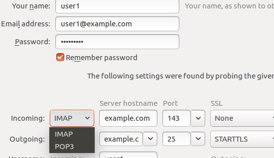

# 211.3. Managing Remote E-Mail Delivery Weight: 2

## **211.3 Managing Remote E-Mail Delivery**

**Weight:** 2

**Description:** Candidates should be able to install and configure POP and IMAP daemons.

**Key Knowledge Areas:**

* Dovecot IMAP and POP3 configuration and administration
* Basic TLS configuration for Dovecot
* Awareness of Courier

**Terms and Utilities:**

* /etc/dovecot/
* dovecot.conf
* doveconf
* doveadm

POP3 and IMAP are two famous protocols which are used to let us check our mail box remotly. There some deamons which seat beside Mail servers\(MTAs\) and provide these two protocols such as:

* Courier
* Dovecot

## POP3 vs IMAP

| POP3 \(**Post Office Protocol**\) | IMAP\(Internet Message Access Protocol\) |
| :--- | :--- |
| Downloads e-mails\(could be configured to leave a copy on server\) | e-mails stay on the server |
| Mails are stored on the clients | Clients read e-mail remotely |

The main advantage of IMAP over POP3 is the ability to keep the original e-mail stored on the mail server and the ability to access the same account from multiple locations. Unlike POP3 where e-mail is downloaded to the computer or device checking for mail and completely removed from the mail server, IMAP simply downloads a copy of the e-mail. This is much more convenient as the e-mail account can be set up on multiple computers and devices using IMAP and the original e-mail will always remain on the mail server.

Another advantage of IMAP over POP3 is that , In cases where a mobile phone or personal computer was configured to be the primary means of checking e-mail and malfunctions, is lost, stolen, or totally inoperable, the e-mails will not be lost.

Although POP3 client can be configured to leave a copy of e-mail on server but, if one were to set up an e-mail account on a mobile phone as POP3, the phone would download all e-mails, removing them from the server. If one were to then check the webmail or home computer for the same e-mail account, there would be no mails viewable as they have already been download by the mobile phone.

On the other hand, with IMAP as all e-mailes are kept on the server, if server crashs no one from client would have a local copy of e-mails even and administrator should have a storng backup plan for that. Keeping all e-mails on the sever has another disadvantage and it might cause mail server ran out of space!

## Courier

Courier is one of the oldest MTAs in the open source world and consequently it includes a sutie of softwares. As a server Courier provides ESMTP, IMAP, POP3, SMAP, webmail, and mailing list services with individual components.

Parts of Courier, such as the maildrop filtering system, the webmail and IMAP server, can also be installed as independent packages which can be used with other mail servers. It is best known for its IMAP server component.

Courier-IMAP is a particularly popular combination with Qmail, Exim, and Postfix servers that are configured to use **maildirs**.

Here we use Ubuntu to have a quick look at courier, \(Unfortunately there are no rpm packages for Courier-IMAP, Courier-Authlib, and Maildrop, therefore we have to build them \) :

```text
root@server1:~# apt-cache search courier | grep courier
courier-authdaemon - Courier authentication daemon
courier-authlib - Courier authentication library
courier-authlib-dev - Development libraries for the Courier authentication library
courier-authlib-ldap - LDAP support for the Courier authentication library
courier-authlib-mysql - MySQL support for the Courier authentication library
courier-authlib-pipe - External authentication support for the Courier authentication library
courier-authlib-postgresql - PostgreSQL support for the Courier authentication library
courier-authlib-sqlite - LDAP support for the Courier authentication library
courier-authlib-userdb - userdb support for the Courier authentication library
courier-base - Courier mail server - base system
courier-doc - Courier mail server - additional documentation
courier-faxmail - Courier mail server - Fax<->mail gateway
courier-filter-perl - purely Perl-based mail filter framework for the Courier MTA
courier-imap - Courier mail server - IMAP server
courier-imap-ssl - Courier mail server - IMAP over SSL
courier-ldap - Courier mail server - LDAP support
courier-maildrop - Courier mail server - mail delivery agent
courier-mlm - Courier mail server - mailing list manager
courier-mta - Courier mail server - ESMTP daemon
courier-mta-ssl - Courier mail server - ESMTP over SSL
courier-pcp - Courier mail server - PCP server
courier-pop - Courier mail server - POP3 server
courier-pop-ssl - Courier mail server - POP3 over SSL
courier-ssl - Courier mail server - SSL/TLS Support
courier-webadmin - Courier mail server - web-based administration frontend
couriergraph - Mail statistics RRDtool frontend for Courier-{POP,IMAP}
couriergrey - Mail filter interface of Courier-MTA to support greylisting
libcourier-unicode-dev - Courier Unicode library (development files and headers)
libcourier-unicode1 - Courier Unicode library (shared runtime library)
mysqmail-courier-logger - real-time logging system in MySQL - Courier traffic-logger

root@server1:~# apt-get install courier-imap courier-pop
```

during installtion if it ask for configuring web-based Administration say "no" and lets make our hands dirty with the command line:

```text
 ┌───────────────────────┤Configuring courier-base ├────────────────────────┐
 │                                                                           │ 
 │ Courier uses several configuration files in /etc/courier. Some of these   │ 
 │ files can be replaced by a subdirectory whose contents are concatenated   │ 
 │ and treated as a single, consolidated, configuration file.                │ 
 │                                                                           │ 
 │ The web-based administration provided by the courier-webadmin package     │ 
 │ relies on configuration directories instead of configuration files. If    │ 
 │ you agree, any directories needed for the web-based administration tool   │ 
 │ will be created unless there is already a plain file in place.            │ 
 │                                                                           │ 
 │ Create directories for web-based administration?                          │ 
 │                                                                           │ 
 │                    <Yes>                      <<<No>>>
```

it makse two configuration files:

```text
root@server1:~# cd /etc/courier/
root@server1:/etc/courier# ls -l
total 28
-rw-rw---- 1 daemon daemon  3678 Apr  5  2016 authdaemonrc
-rw-r--r-- 1 root   root   14386 Apr  5  2016 imapd
-rw-r--r-- 1 root   root    3739 Apr  5  2016 pop3d
drwxr-xr-x 2 daemon daemon  4096 May 27 04:23 shared
```

Lets take a look at imapd configuration file:

```text
  root@server1:/etc/courier# cat imapd 
##VERSION: $Id: imapd.dist.in 159 2011-11-14 02:07:00Z mrsam $
#
# imapd created from imapd.dist by sysconftool
#
# Do not alter lines that begin with ##, they are used when upgrading
# this configuration.
#
#  Copyright 1998 - 2008 Double Precision, Inc.  See COPYING for
#  distribution information.
#
#  This configuration file sets various options for the Courier-IMAP server
#  when used with the couriertcpd server.
#  A lot of the stuff here is documented in the manual page for couriertcpd.
#
#  NOTE - do not use \ to split long variable contents on multiple lines.
#  This will break the default imapd.rc script, which parses this file.
#
##NAME: ADDRESS:0
#
#  Address to listen on, can be set to a single IP address.
#
# ADDRESS=127.0.0.1

ADDRESS=0

##NAME: PORT:1
#
#  Port numbers that connections are accepted on.  The default is 143,
#  the standard IMAP port.
#
#  Multiple port numbers can be separated by commas.  When multiple port
#  numbers are used it is possible to select a specific IP address for a
#  given port as "ip.port".  For example, "127.0.0.1.900,192.68.0.1.900"
#  accepts connections on port 900 on IP addresses 127.0.0.1 and 192.68.0.1
#  The previous ADDRESS setting is a default for ports that do not have
#  a specified IP address.

PORT=143

##NAME: AUTHSERVICE:0
#
#  It's possible to authenticate using a different 'service' parameter
#  depending on the connection's port.  This only works with authentication
#  modules that use the 'service' parameter, such as PAM.  Example:
#
#  AUTHSERVICE143=imap
#  AUTHSERVICE993=imaps

##NAME: MAXDAEMONS:0
#
#  Maximum number of IMAP servers started
#

MAXDAEMONS=40

##NAME: MAXPERIP:0
#
#  Maximum number of connections to accept from the same IP address

MAXPERIP=20

##NAME: PIDFILE:0
#
#  File where couriertcpd will save its process ID
#

PIDFILE=/var/run/courier/imapd.pid

##NAME: TCPDOPTS:0
#
# Miscellaneous couriertcpd options that shouldn't be changed.
#

TCPDOPTS="-nodnslookup -noidentlookup"

##NAME: LOGGEROPTS:0
#
# courierlogger(1) options.                                        
#

LOGGEROPTS="-name=imapd"

##NAME: DEFDOMAIN:0
#
# Optional default domain. If the username does not contain the         
# first character of DEFDOMAIN, then it is appended to the username.
# If DEFDOMAIN and DOMAINSEP are both set, then DEFDOMAIN is appended
# only if the username does not contain any character from DOMAINSEP.
# You can set different default domains based on the the interface IP
# address using the -access and -accesslocal options of couriertcpd(1).

#DEFDOMAIN="@example.com"

##NAME: IMAP_CAPABILITY:1
#
# IMAP_CAPABILITY specifies what most of the response should be to the
# CAPABILITY command.
#
# If you have properly configured Courier to use CRAM-MD5, CRAM-SHA1, or
# CRAM-SHA256 authentication (see INSTALL), set IMAP_CAPABILITY as follows:
#
# IMAP_CAPABILITY="IMAP4rev1 UIDPLUS CHILDREN NAMESPACE THREAD=ORDEREDSUBJECT THREAD=REFERENCES SORT QUOTA AUTH=CRAM-MD5 AUTH=CRAM-SHA1 AUTH=CRAM-SHA256 IDLE"
#

IMAP_CAPABILITY="IMAP4rev1 UIDPLUS CHILDREN NAMESPACE THREAD=ORDEREDSUBJECT THREAD=REFERENCES SORT QUOTA IDLE"

##NAME: KEYWORDS_CAPABILITY:0
#
# IMAP_KEYWORDS=1 enables custom IMAP keywords.  Set this option to 0 to
# disable custom keywords.
#
# IMAP_KEYWORDS=2 also enables custom IMAP keywords, but uses a slower
# algorithm. Use this setting if keyword-related problems occur when
# multiple IMAP clients are updating keywords on the same message.

IMAP_KEYWORDS=1

##NAME: ACL_CAPABILITY:0
#
# IMAP_ACL=1 enables IMAP ACL extension. Set this option to 0 to
# disable ACL capabilities announce.

IMAP_ACL=1

##NAME: SMAP1_CAPABILITY:0
#
# EXPERIMENTAL
#
# To enable the experimental "Simple Mail Access Protocol" extensions,
# uncomment the following setting.
#
# SMAP_CAPABILITY=SMAP1

##NAME: IMAP_CAPABILITY_ORIG:2
#
# For use by webadmin

IMAP_CAPABILITY_ORIG="IMAP4rev1 UIDPLUS CHILDREN NAMESPACE THREAD=ORDEREDSUBJECT THREAD=REFERENCES SORT QUOTA AUTH=CRAM-MD5 AUTH=CRAM-SHA1 AUTH=CRAM-SHA256 IDLE"

##NAME: IMAP_PROXY:0
#
# Enable proxying.  See README.proxy

IMAP_PROXY=0

##NAME: PROXY_HOSTNAME:0
#
# Override value from gethostname() when checking if a proxy connection is
# required.
#
# PROXY_HOSTNAME=

##NAME: IMAP_PROXY_FOREIGN:0
#
# Proxying to non-Courier servers.  Re-sends the CAPABILITY command after
# logging in to the remote server.  May not work with all IMAP clients.

IMAP_PROXY_FOREIGN=0

##NAME: IMAP_IDLE_TIMEOUT:0
#
# This setting controls how often
# the server polls for changes to the folder, in IDLE mode (in seconds).

IMAP_IDLE_TIMEOUT=60

##NAME: IMAP_MAILBOX_SANITY_CHECK:0
#
# Sanity check -- make sure home directory and maildir's ownership matches
# the IMAP server's effective uid and gid

IMAP_MAILBOX_SANITY_CHECK=1

##NAME: IMAP_CAPABILITY_TLS:0
#
# The following setting will advertise SASL PLAIN authentication after
# STARTTLS is established.  If you want to allow SASL PLAIN authentication
# with or without TLS then just comment this out, and add AUTH=PLAIN to
# IMAP_CAPABILITY

IMAP_CAPABILITY_TLS="$IMAP_CAPABILITY AUTH=PLAIN"

##NAME: IMAP_TLS_ORIG:0
#
# For use by webadmin

IMAP_CAPABILITY_TLS_ORIG="$IMAP_CAPABILITY_ORIG AUTH=PLAIN"

##NAME: IMAP_DISABLETHREADSORT:0
#
# Set IMAP_DISABLETHREADSORT to disable the THREAD and SORT commands -
# server side sorting and threading.
#
# Those capabilities will still be advertised, but the server will reject
# them.  Set this option if you want to disable all the extra load from
# server-side threading and sorting.  Not advertising those capabilities
# will simply result in the clients reading the entire folder, and sorting
# it on the client side.  That will still put some load on the server.
# advertising these capabilities, but rejecting the commands, will stop this
# silliness.
#

IMAP_DISABLETHREADSORT=0

##NAME: IMAP_CHECK_ALL_FOLDERS:0
#
# Set IMAP_CHECK_ALL_FOLDERS to 1 if you want the server to check for new
# mail in every folder.  Not all IMAP clients use the IMAP's new mail
# indicator, but some do.  Normally new mail is checked only in INBOX,
# because it is a comparatively time consuming operation, and it would be
# a complete waste of time unless mail filters are used to deliver
# mail directly to folders.
#
# When IMAP clients are used which support new mail indication, and when
# mail filters are used to sort incoming mail into folders, setting
# IMAP_CHECK_ALL_FOLDERS to 1 will allow IMAP clients to announce new
# mail in folders.  Note that this will result in slightly more load on the
# server.
#

IMAP_CHECK_ALL_FOLDERS=0

##NAME: IMAP_OBSOLETE_CLIENT:0
#
# Set IMAP_OBSOLETE_CLIENT if your IMAP client expects \\NoInferiors to mean
# what \\HasNoChildren really means.

IMAP_OBSOLETE_CLIENT=0

##NAME: IMAP_UMASK:0
#
# IMAP_UMASK sets the umask of the server process.  The value of IMAP_UMASK is
# simply passed to the "umask" command.  The default value is 022.
#
# This feature is mostly useful for shared folders, where the file permissions
# of the messages may be important.

IMAP_UMASK=022

##NAME: IMAP_ULIMITD:0
#
# IMAP_ULIMITD sets the maximum size of the data segment of the server
# process.  The value of IMAP_ULIMITD is simply passed to the "ulimit -d"
# command (or ulimit -v).  The argument to ulimi sets the upper limit on the
# size of the data segment of the server process, in kilobytes.  The default
# value of 65536 sets a very generous limit of 64 megabytes, which should
# be more than plenty for anyone.
#
# This feature is used as an additional safety check that should stop
# any potential denial-of-service attacks that exploit any kind of
# a memory leak to exhaust all the available memory on the server.
# It is theoretically possible that obscenely huge folders will also
# result in the server running out of memory when doing server-side
# sorting (by my calculations you have to have at least 100,000 messages
# in a single folder, for that to happen).

IMAP_ULIMITD=131072

##NAME: IMAP_USELOCKS:0
#
# Setting IMAP_USELOCKS to 1 will use dot-locking to support concurrent
# multiple access to the same folder.  This incurs slight additional
# overhead.  Concurrent multiple access will still work without this setting,
# however occasionally a minor race condition may result in an IMAP client
# downloading the same message twice, or a keyword update will fail.
#
# IMAP_USELOCKS=1 is strongly recommended when shared folders are used.

IMAP_USELOCKS=1

##NAME: IMAP_SHAREDINDEXFILE:0
#
# The index of all accessible folders.  Do not change this setting unless
# you know what you're doing.  See README.sharedfolders for additional
# information.

IMAP_SHAREDINDEXFILE=/etc/courier/shared/index

##NAME: IMAP_ENHANCEDIDLE:0
#
# If Courier was compiled with the File Alteration Monitor, setting
# IMAP_ENHANCEDIDLE to 1 enables enhanced IDLE mode, where multiple
# clients may open the same folder concurrently, and receive updates to
# folder contents in realtime.  See the imapd(8) man page for additional
# information.
#
# IMPORTANT: IMAP_USELOCKS *MUST* also be set to 1, and IDLE must be included
# in the IMAP_CAPABILITY list.
#

IMAP_ENHANCEDIDLE=0

##NAME: IMAP_TRASHFOLDERNAME:0
#
# The name of the magic trash Folder.  For MSOE compatibility,
# you can set IMAP_TRASHFOLDERNAME="Deleted Items".
#
# IMPORTANT:  If you change this, you must also change IMAP_EMPTYTRASH

IMAP_TRASHFOLDERNAME=Trash

##NAME: IMAP_EMPTYTRASH:0
#
# The following setting is optional, and causes messages from the given
# folder to be automatically deleted after the given number of days.
# IMAP_EMPTYTRASH is a comma-separated list of folder:days.  The default
# setting, below, purges 7 day old messages from the Trash folder.
# Another useful setting would be:
#
# IMAP_EMPTYTRASH=Trash:7,Sent:30
#
# This would also delete messages from the Sent folder (presumably copies
# of sent mail) after 30 days.  This is a global setting that is applied to
# every mail account, and is probably useful in a controlled, corporate
# environment.
#
# Important: the purging is controlled by CTIME, not MTIME (the file time
# as shown by ls).  It is perfectly ordinary to see stuff in Trash that's
# a year old.  That's the file modification time, MTIME, that's displayed.
# This is generally when the message was originally delivered to this
# mailbox.  Purging is controlled by a different timestamp, CTIME, which is
# changed when the file is moved to the Trash folder (and at other times too).
#
# You might want to disable this setting in certain situations - it results
# in a stat() of every file in each folder, at login and logout.
#

IMAP_EMPTYTRASH=Trash:7

##NAME: IMAP_MOVE_EXPUNGE_TO_TRASH:0
#
# Set IMAP_MOVE_EXPUNGE_TO_TRASH to move expunged messages to Trash.  This
# effectively allows an undo of message deletion by fishing the deleted
# mail from trash.  Trash can be manually expunged as usually, and mail
# will get automatically expunged from Trash according to IMAP_EMPTYTRASH.
#
# NOTE: shared folders are still expunged as usual.  Shared folders are
# not affected.
#

IMAP_MOVE_EXPUNGE_TO_TRASH=0

##NAME: IMAP_LOG_DELETIONS:0
#
#
# Set IMAP_LOG_DELETIONS to log all message deletions to syslog.
#
# IMAP_LOG_DELETIONS=1

##NAME: IMAPDEBUGFILE:0
#
# IMAPDEBUGFILE="imaplog.dat"
#
# Generate diagnostic logging of IMAP commands.
#
# Set this globally, restart the server. Touch this file in an account's
# maildir directory, and Courier-IMAP will append all IMAP commands received
# for new sessions for this account. NOTE: existing IMAP sessions are not
# affected, only new IMAP logins.


##NAME: OUTBOX:0
#
# The next set of options deal with the "Outbox" enhancement.
# Uncomment the following setting to create a special folder, named
# INBOX.Outbox
#
# OUTBOX=.Outbox

##NAME: SENDMAIL:0
#
# If OUTBOX is defined, mail can be sent via the IMAP connection by copying
# a message to the INBOX.Outbox folder.  For all practical matters,
# INBOX.Outbox looks and behaves just like any other IMAP folder.  If this
# folder doesn't exist it must be created by the IMAP mail client, just
# like any other IMAP folder.  The kicker: any message copied or moved to
# this folder is will be E-mailed by the Courier-IMAP server, by running
# the SENDMAIL program.  Therefore, messages copied or moved to this
# folder must be well-formed RFC-2822 messages, with the recipient list
# specified in the To:, Cc:, and Bcc: headers.  Courier-IMAP relies on
# SENDMAIL to read the recipient list from these headers (and delete the Bcc:
# header) by running the command "$SENDMAIL -oi -t -f $SENDER", with the
# message piped on standard input.  $SENDER will be the return address
# of the message, which is set by the authentication module.
#
# DO NOT MODIFY SENDMAIL, below, unless you know what you're doing.
#

SENDMAIL=/usr/sbin/sendmail

##NAME: HEADERFROM:0
#
# For administrative and oversight purposes, the return address, $SENDER
# will also be saved in the X-IMAP-Sender mail header.  This header gets
# added to the sent E-mail (but it doesn't get saved in the copy of the
# message that's saved in the folder)
#
# WARNING - By enabling OUTBOX above, *every* IMAP mail client will receive
# the magic OUTBOX treatment.  Therefore advance LARTing is in order for
# _all_ of your lusers, until every one of them is aware of this.  Otherwise if
# OUTBOX is left at its default setting - a folder name that might be used
# accidentally - some people may be in for a rude surprise.  You can redefine
# the name of the magic folder by changing OUTBOX, above.  You should do that
# and pick a less-obvious name.  Perhaps brand it with your organizational
# name ( OUTBOX=.WidgetsAndSonsOutbox )

HEADERFROM=X-IMAP-Sender

##NAME: OUTBOX_MULTIPLE_SEND:0
#
# Remove the following comment to allow a COPY of more than one message to
# the Outbox, at a time.
#
# OUTBOX_MULTIPLE_SEND=1

##NAME: IMAPDSTART:0
#
# IMAPDSTART is not used directly.  Rather, this is a convenient flag to
# be read by your system startup script in /etc/rc.d, like this:
#
#  . /etc/courier/imapd
#
#  case x$IMAPDSTART in
#  x[yY]*)
#        /usr/lib/courier/imapd.rc start
#        ;;
#  esac
#
# The default setting is going to be NO, so you'll have to manually flip
# it to yes.

IMAPDSTART=YES

##NAME: MAILDIRPATH:0
#
# MAILDIRPATH - directory name of the maildir directory.
#
MAILDIRPATH=Maildir
```

`ADDRESS=0` says that our server will listed on all configured IP Addresses. `PORT=143` defines the IMAP standard port number. The Only place that we need to configure for basic setup is `MAILDIRPATCH` .

`MAILDIRPATH=mail/inbox`

define the same setting in `pop3d` file for POP3 protocol.

```text
root@server1:/etc/courier# cat pop3d | grep -v "^#"

PIDFILE=/var/run/courier/pop3d.pid


MAXDAEMONS=40


MAXPERIP=4


POP3AUTH=""


POP3AUTH_ORIG="PLAIN LOGIN CRAM-MD5 CRAM-SHA1 CRAM-SHA256"


POP3AUTH_TLS=""


POP3AUTH_TLS_ORIG="LOGIN PLAIN"


POP3_PROXY=0


PORT=110


ADDRESS=0


TCPDOPTS="-nodnslookup -noidentlookup"


LOGGEROPTS="-name=pop3d"


POP3DSTART=YES


MAILDIRPATH=mail/inbox
```

and do not forget to restart teh services:

```text
root@server1:/etc/courier# systemctl restart courier-imap.service 
root@server1:/etc/courier# systemctl restart courier-pop.service
```

time to check the result with an e-mail client, we used Mozilla thunder bird here:



check it with both imap and pop3 and make sure it is working.

## Dovecot 

Dovecot is an open-source IMAP and POP3 server for Linux/UNIX-like systems, written primarily with security in mind.Timo Sirainen originated Dovecot and first released it in July 2002. Dovecot developers primarily aim to produce a lightweight, fast and easy-to-set-up open-source mailserver.

Primary purpose of dovecot is to act as mail storage server. Mail is delivered to the server using some MDA and stored for later access with MUA. Dovecot can also act as mail proxy server, forwarding connection to another mail server, or act as a lightweight MUA in order to retrieve and manipulate mail on remote server for e.g. mail migration.

According to Openemailsurvey Dovecot has an installed base of more than 3 million email servers and a global market share of 68% of all IMAP servers. While Dovecot software can be used commercially without any license fees, a commercial version is also available as Dovecot Pro. The commercial version is provided by Dovecot Oy along with support and enterprise add-ons such as the object storage and full-text search plugins. Since March 2015, Dovecot Oy has been part of the Open-Xchange Family.

good news about **dovecot** is that it supports both mail store formats, **mbox** and **maildir**.

```text
root@server1:~# apt-cache search dovecot | grep dovecot
dovecot-core - secure POP3/IMAP server - core files
dovecot-dbg - secure POP3/IMAP server - debug symbols
dovecot-dev - secure POP3/IMAP server - header files
dovecot-imapd - secure POP3/IMAP server - IMAP daemon
dovecot-managesieved - secure POP3/IMAP server - ManageSieve server
dovecot-pop3d - secure POP3/IMAP server - POP3 daemon
dovecot-sieve - secure POP3/IMAP server - Sieve filters support
argonaut-dovecot - Argonaut (client-module for dovecot)
dovecot-antispam - Dovecot plugins for training spam filters
dovecot-gssapi - secure POP3/IMAP server - GSSAPI support
dovecot-ldap - secure POP3/IMAP server - LDAP support
dovecot-lmtpd - secure POP3/IMAP server - LMTP server
dovecot-lucene - secure POP3/IMAP server - Lucene support
dovecot-metadata-plugin - Experimental IMAP METADATA Extension for Dovecot
dovecot-mysql - secure POP3/IMAP server - MySQL support
dovecot-pgsql - secure POP3/IMAP server - PostgreSQL support
dovecot-solr - secure POP3/IMAP server - Solr support
dovecot-sqlite - secure POP3/IMAP server - SQLite support
fusiondirectory-plugin-dovecot - dovecot plugin for FusionDirectory
fusiondirectory-plugin-dovecot-schema - LDAP schema for FusionDirectory dovecot plugin
mysqmail-dovecot-logger - real-time logging system in MySQL - Dovecot traffic-logger
```

dovecot has a long list of packages but here we just focus on packages for e-mail access.\( Do not forget to remove any other e-mail access software before devecot installation inorder to avoid confilicts `apt-get purge courier*` \).

```text
root@server1:~# apt-get install dovecot-imapd dovecot-pop3d
```

for providing secure imap and pop3 dovecot generates its own self-signed certificate during installation proccess.

### /etc/dovecot/

The configuration of Dovecot can be found in /etc/dovecot.conf

```text
root@server1:~# cd /etc/dovecot/
root@server1:/etc/dovecot# ls -l
total 36
drwxr-xr-x 2 root root    4096 May 28 00:00 conf.d
-rw-r--r-- 1 root root    4401 Feb 27 11:17 dovecot.conf
-rw-r----- 1 root dovecot 1507 Mar 16  2016 dovecot-dict-auth.conf.ext
-rw-r----- 1 root dovecot  852 Mar 16  2016 dovecot-dict-sql.conf.ext
-rw-r----- 1 root dovecot 5612 Mar 16  2016 dovecot-sql.conf.ext
drwxr-xr-x 2 root root    4096 Feb 27 11:28 private
-rw-r--r-- 1 root root     121 Feb 27 11:29 README

root@server1:/etc/dovecot# tree
.
├── conf.d
│   ├── 10-auth.conf
│   ├── 10-director.conf
│   ├── 10-logging.conf
│   ├── 10-mail.conf
│   ├── 10-master.conf
│   ├── 10-ssl.conf
│   ├── 10-tcpwrapper.conf
│   ├── 15-lda.conf
│   ├── 15-mailboxes.conf
│   ├── 20-imap.conf
│   ├── 20-pop3.conf
│   ├── 90-acl.conf
│   ├── 90-plugin.conf
│   ├── 90-quota.conf
│   ├── auth-checkpassword.conf.ext
│   ├── auth-deny.conf.ext
│   ├── auth-dict.conf.ext
│   ├── auth-master.conf.ext
│   ├── auth-passwdfile.conf.ext
│   ├── auth-sql.conf.ext
│   ├── auth-static.conf.ext
│   ├── auth-system.conf.ext
│   └── auth-vpopmail.conf.ext
├── dovecot.conf
├── dovecot-dict-auth.conf.ext
├── dovecot-dict-sql.conf.ext
├── dovecot-sql.conf.ext
├── private
└── README

2 directories, 28 files
```

it is consist of the mail configuration file `dovecot.conf` and many other configuration files in `conf.d` directory which are included.

```text
root@server1:/etc/dovecot# grep include dovecot.conf 
!include_try /usr/share/dovecot/protocols.d/*.protocol
# Most of the actual configuration gets included below. The filenames are
!include conf.d/*.conf
# A config file can also tried to be included without giving an error if
!include_try local.conf
```

please note that `!include` means "include" and the "!" doesn't make negative meaning. That how dovecot's include syntax is! and the main configureation file:

### dovecot.conf

```text
root@server1:/etc/dovecot# cat dovecot.conf 
## Dovecot configuration file

# If you're in a hurry, see http://wiki2.dovecot.org/QuickConfiguration

# "doveconf -n" command gives a clean output of the changed settings. Use it
# instead of copy&pasting files when posting to the Dovecot mailing list.

# '#' character and everything after it is treated as comments. Extra spaces
# and tabs are ignored. If you want to use either of these explicitly, put the
# value inside quotes, eg.: key = "# char and trailing whitespace  "

# Most (but not all) settings can be overridden by different protocols and/or
# source/destination IPs by placing the settings inside sections, for example:
# protocol imap { }, local 127.0.0.1 { }, remote 10.0.0.0/8 { }

# Default values are shown for each setting, it's not required to uncomment
# those. These are exceptions to this though: No sections (e.g. namespace {})
# or plugin settings are added by default, they're listed only as examples.
# Paths are also just examples with the real defaults being based on configure
# options. The paths listed here are for configure --prefix=/usr
# --sysconfdir=/etc --localstatedir=/var

# Enable installed protocols
!include_try /usr/share/dovecot/protocols.d/*.protocol

# A comma separated list of IPs or hosts where to listen in for connections. 
# "*" listens in all IPv4 interfaces, "::" listens in all IPv6 interfaces.
# If you want to specify non-default ports or anything more complex,
# edit conf.d/master.conf.
#listen = *, ::

# Base directory where to store runtime data.
#base_dir = /var/run/dovecot/

# Name of this instance. In multi-instance setup doveadm and other commands
# can use -i <instance_name> to select which instance is used (an alternative
# to -c <config_path>). The instance name is also added to Dovecot processes
# in ps output.
#instance_name = dovecot

# Greeting message for clients.
#login_greeting = Dovecot ready.

# Space separated list of trusted network ranges. Connections from these
# IPs are allowed to override their IP addresses and ports (for logging and
# for authentication checks). disable_plaintext_auth is also ignored for
# these networks. Typically you'd specify your IMAP proxy servers here.
#login_trusted_networks =

# Space separated list of login access check sockets (e.g. tcpwrap)
#login_access_sockets = 

# With proxy_maybe=yes if proxy destination matches any of these IPs, don't do
# proxying. This isn't necessary normally, but may be useful if the destination
# IP is e.g. a load balancer's IP.
#auth_proxy_self =

# Show more verbose process titles (in ps). Currently shows user name and
# IP address. Useful for seeing who are actually using the IMAP processes
# (eg. shared mailboxes or if same uid is used for multiple accounts).
#verbose_proctitle = no

# Should all processes be killed when Dovecot master process shuts down.
# Setting this to "no" means that Dovecot can be upgraded without
# forcing existing client connections to close (although that could also be
# a problem if the upgrade is e.g. because of a security fix).
#shutdown_clients = yes

# If non-zero, run mail commands via this many connections to doveadm server,
# instead of running them directly in the same process.
#doveadm_worker_count = 0
# UNIX socket or host:port used for connecting to doveadm server
#doveadm_socket_path = doveadm-server

# Space separated list of environment variables that are preserved on Dovecot
# startup and passed down to all of its child processes. You can also give
# key=value pairs to always set specific settings.
#import_environment = TZ

##
## Dictionary server settings
##

# Dictionary can be used to store key=value lists. This is used by several
# plugins. The dictionary can be accessed either directly or though a
# dictionary server. The following dict block maps dictionary names to URIs
# when the server is used. These can then be referenced using URIs in format
# "proxy::<name>".

dict {
  #quota = mysql:/etc/dovecot/dovecot-dict-sql.conf.ext
  #expire = sqlite:/etc/dovecot/dovecot-dict-sql.conf.ext
}

# Most of the actual configuration gets included below. The filenames are
# first sorted by their ASCII value and parsed in that order. The 00-prefixes
# in filenames are intended to make it easier to understand the ordering.
!include conf.d/*.conf

# A config file can also tried to be included without giving an error if
# it's not found:
!include_try local.conf
```

for configuring dovecot we go through conf.d directory:

```text
root@server1:/etc/dovecot# cd conf.d/
root@server1:/etc/dovecot/conf.d# ls
10-auth.conf        15-mailboxes.conf            auth-dict.conf.ext
10-director.conf    20-imap.conf                 auth-master.conf.ext
10-logging.conf     20-pop3.conf                 auth-passwdfile.conf.ext
10-mail.conf        90-acl.conf                  auth-sql.conf.ext
10-master.conf      90-plugin.conf               auth-static.conf.ext
10-ssl.conf         90-quota.conf                auth-system.conf.ext
10-tcpwrapper.conf  auth-checkpassword.conf.ext  auth-vpopmail.conf.ext
15-lda.conf         auth-deny.conf.ext
```

We just need to define which directory mails are stored in 10-mail.conf file \(For configuring dovecot inorder to allow special mail clients like outlook modify 20-pop3.conf or 20-imap.conf which are not part of LPIC exam\) :

```text
root@server1:/etc/dovecot/conf.d# cat 10-mail.conf | grep mail_location
# path given in the mail_location setting.
#   mail_location = maildir:~/Maildir
#   mail_location = mbox:~/mail:INBOX=/var/mail/%u
#   mail_location = mbox:/var/mail/%d/%1n/%n:INDEX=/var/indexes/%d/%1n/%n
mail_location = mbox:~/mail:INBOX=/var/mail/%u
  # mail_location, which is also the default for it.
```

set mail\_location value to `mail_location = maildir:~/mail/inbox` .

dovecot does not have seperate services for imap and pop3, it has just one deamon and we need tor restart that inorder to our changes take effect:

```text
root@server1:/etc/dovecot/conf.d# systemctl restart dovecot.s
dovecot.service  dovecot.socket   
root@server1:/etc/dovecot/conf.d# systemctl restart dovecot.service
```

to make wheather dovecot is working properly:

```text
root@server1:/etc/dovecot/conf.d# lsof -i | grep dovecot
dovecot   9805     root   24u  IPv4  55915      0t0  TCP *:pop3 (LISTEN)
dovecot   9805     root   25u  IPv6  55916      0t0  TCP *:pop3 (LISTEN)
dovecot   9805     root   36u  IPv4  55951      0t0  TCP *:imap2 (LISTEN)
dovecot   9805     root   37u  IPv6  55952      0t0  TCP *:imap2 (LISTEN)

root@server1:/etc/dovecot/conf.d# netstat -tulpen | grep 143
tcp        0      0 0.0.0.0:143             0.0.0.0:*               LISTEN      0          55951       9805/dovecot    
tcp6       0      0 :::143                  :::*                    LISTEN      0          55952       9805/dovecot    
udp6       0      0 :::60143                :::*                                111        17792       745/avahi-daemon: r
root@server1:/etc/dovecot/conf.d# netstat -tulpen | grep 110
tcp        0      0 0.0.0.0:110             0.0.0.0:*               LISTEN      0          55915       9805/dovecot    
tcp6       0      0 :::110                  :::*                    LISTEN      0          55916       9805/dovecot
```

okey this time we use tell to test what we have done :

```text
user1@server1:~$ telnet localhost 110
Trying 127.0.0.1...
Connected to localhost.
Escape character is '^]'.
+OK Dovecot ready.
user user1
+OK
pass Fred@123?
+OK Logged in.
list
+OK 1 messages:
1 452
.
retr 1
+OK 452 octets
Return-Path: <user2@server1>
X-Original-To: user1@localhost
Delivered-To: user1@localhost
Received: by server1.localdomain (Postfix, from userid 1002)
    id F0D9BC0E16; Sun, 27 May 2018 04:08:02 -0700 (PDT)
Subject: test maildir
To: <user1@localhost>
X-Mailer: mail (GNU Mailutils 2.99.99)
Message-Id: <20180527110802.F0D9BC0E16@server1.localdomain>
Date: Sun, 27 May 2018 04:08:02 -0700 (PDT)
From: user2@server1

Hi there test maildir!
..
.
quit
+OK Logging out.
Connection closed by foreign host.
```

### doveconf

doveconf reads and parses Dovecot's configuration files and converts them into a simpler format used by the rest of Dovecot. :

```text
root@server1:/etc/dovecot/conf.d# doveconf | less
```

Most of them are defualt values but some of them are customized values. `-n` Show only settings with non-default values.

```text
root@server1:/etc/dovecot/conf.d# doveconf -n
# 2.2.22 (fe789d2): /etc/dovecot/dovecot.conf
# Pigeonhole version 0.4.13 (7b14904)
# OS: Linux 4.10.0-28-generic x86_64 Ubuntu 16.04.3 LTS 
mail_location = maildir:~/mail/inbox
namespace inbox {
  inbox = yes
  location = 
  mailbox Drafts {
    special_use = \Drafts
  }
  mailbox Junk {
    special_use = \Junk
  }
  mailbox Sent {
    special_use = \Sent
  }
  mailbox "Sent Messages" {
    special_use = \Sent
  }
  mailbox Trash {
    special_use = \Trash
  }
  prefix = 
}
passdb {
  driver = pam
}
protocols = " imap pop3"
ssl = no
userdb {
  driver = passwd
}
```

### Basic TLS Configuration for dovecot

Dovecot is now automatically configured to use SSL. It uses the package ssl-cert which provides a self signed certificate. Wecan edit the file /etc/dovecot/conf.d/10-ssl.conf .

```text
root@server1:/etc/dovecot/conf.d# cat 10-ssl.conf 
##
## SSL settings
##

# SSL/TLS support: yes, no, required. <doc/wiki/SSL.txt>
ssl = no

# PEM encoded X.509 SSL/TLS certificate and private key. They're opened before
# dropping root privileges, so keep the key file unreadable by anyone but
# root. Included doc/mkcert.sh can be used to easily generate self-signed
# certificate, just make sure to update the domains in dovecot-openssl.cnf
#ssl_cert = </etc/dovecot/dovecot.pem
#ssl_key = </etc/dovecot/private/dovecot.pem

# If key file is password protected, give the password here. Alternatively
# give it when starting dovecot with -p parameter. Since this file is often
# world-readable, you may want to place this setting instead to a different
# root owned 0600 file by using ssl_key_password = <path.
#ssl_key_password =

# PEM encoded trusted certificate authority. Set this only if you intend to use
# ssl_verify_client_cert=yes. The file should contain the CA certificate(s)
# followed by the matching CRL(s). (e.g. ssl_ca = </etc/ssl/certs/ca.pem)
#ssl_ca = 

# Require that CRL check succeeds for client certificates.
#ssl_require_crl = yes

# Directory and/or file for trusted SSL CA certificates. These are used only
# when Dovecot needs to act as an SSL client (e.g. imapc backend). The
# directory is usually /etc/ssl/certs in Debian-based systems and the file is
# /etc/pki/tls/cert.pem in RedHat-based systems.
#ssl_client_ca_dir =
#ssl_client_ca_file =

# Request client to send a certificate. If you also want to require it, set
# auth_ssl_require_client_cert=yes in auth section.
#ssl_verify_client_cert = no

# Which field from certificate to use for username. commonName and
# x500UniqueIdentifier are the usual choices. You'll also need to set
# auth_ssl_username_from_cert=yes.
#ssl_cert_username_field = commonName

# DH parameters length to use.
#ssl_dh_parameters_length = 1024

# SSL protocols to use
#ssl_protocols = !SSLv2

# SSL ciphers to use
#ssl_cipher_list = ALL:!LOW:!SSLv2:!EXP:!aNULL

# Prefer the server's order of ciphers over client's.
#ssl_prefer_server_ciphers = no

# SSL crypto device to use, for valid values run "openssl engine"
#ssl_crypto_device =

# SSL extra options. Currently supported options are:
#   no_compression - Disable compression.
#ssl_options =
```

By default the certificate is created to /etc/ssl/certs/dovecot.pem and the private key file is created to /etc/ssl/private/dovecot.pem.We can edit following lines if we want to set up a custom certificate:

```text
ssl_cert = </etc/dovecot/dovecot.pem
ssl_key = </etc/dovecot/private/dovecot.key
```

We can get the SSL certificate from a Certificate Issuing Authority or we can create self signed SSL certificate. Once we create the certificate, we will have a key file and a certificate file that we want to make known in the config shown above.

```text
root@server1:/etc/dovecot/conf.d# openssl req -new -x509 -days 1000 -nodes -out "/etc/dovecot/dovecot.pem" -keyout "/etc/dovecot/private/dovecot.key"
Generating a 2048 bit RSA private key
.......+++
..........................................................................................................................................................+++
writing new private key to '/etc/dovecot/private/dovecot.key'
-----
You are about to be asked to enter information that will be incorporated
into your certificate request.
What you are about to enter is what is called a Distinguished Name or a DN.
There are quite a few fields but you can leave some blank
For some fields there will be a default value,
If you enter '.', the field will be left blank.
-----
Country Name (2 letter code) [AU]:us
State or Province Name (full name) [Some-State]:wc
Locality Name (eg, city) []:
Organization Name (eg, company) [Internet Widgits Pty Ltd]:mycompany    
Organizational Unit Name (eg, section) []:IT
Common Name (e.g. server FQDN or YOUR name) []:example.com
Email Address []:nowhere@example.com

root@server1:/etc/dovecot/conf.d# ls -l ../private/
total 8
-rw-r--r-- 1 root root 1704 May 28 05:06 dovecot.key

root@server1:/etc/dovecot/conf.d# cd ..
root@server1:/etc/dovecot# ls -l | grep pem
-rw-r--r-- 1 root root    1359 May 28 05:06 dovecot.pem
```

Now lets edit 10-ssl.conf and restart dovecot daemon:

```text
root@server1:/etc/dovecot/conf.d# vim 10-ssl.conf 
root@server1:/etc/dovecot/conf.d# systemctl restart dovecot.service 
root@server1:/etc/dovecot/conf.d# lsof -i | grep dovecot
dovecot   12447     root   24u  IPv4  76973      0t0  TCP *:pop3 (LISTEN)
dovecot   12447     root   25u  IPv6  76974      0t0  TCP *:pop3 (LISTEN)
dovecot   12447     root   26u  IPv4  76975      0t0  TCP *:pop3s (LISTEN)
dovecot   12447     root   27u  IPv6  76976      0t0  TCP *:pop3s (LISTEN)
dovecot   12447     root   38u  IPv4  77011      0t0  TCP *:imap2 (LISTEN)
dovecot   12447     root   39u  IPv6  77012      0t0  TCP *:imap2 (LISTEN)
dovecot   12447     root   40u  IPv4  77013      0t0  TCP *:imaps (LISTEN)
dovecot   12447     root   41u  IPv6  77014      0t0  TCP *:imaps (LISTEN)
```

now lets get connected our server over pop3s\(995\) and imaps\(993\) protocols using open ssl utility:

```text
user1@server1:~$ openssl s_client -connect server1:995
CONNECTED(00000003)
depth=0 C = us, ST = wc, O = mycompany, OU = IT, CN = example.com, emailAddress = nowhere@example.com
verify error:num=18:self signed certificate
verify return:1
depth=0 C = us, ST = wc, O = mycompany, OU = IT, CN = example.com, emailAddress = nowhere@example.com
verify return:1
---
Certificate chain
 0 s:/C=us/ST=wc/O=mycompany/OU=IT/CN=example.com/emailAddress=nowhere@example.com
   i:/C=us/ST=wc/O=mycompany/OU=IT/CN=example.com/emailAddress=nowhere@example.com
---
Server certificate
-----BEGIN CERTIFICATE-----
MIIDvTCCAqWgAwIBAgIJAKrWQnuBHvkFMA0GCSqGSIb3DQEBCwUAMHUxCzAJBgNV
BAYTAnVzMQswCQYDVQQIDAJ3YzESMBAGA1UECgwJbXljb21wYW55MQswCQYDVQQL
DAJJVDEUMBIGA1UEAwwLZXhhbXBsZS5jb20xIjAgBgkqhkiG9w0BCQEWE25vd2hl
cmVAZXhhbXBsZS5jb20wHhcNMTgwNTI4MTIwNjIzWhcNMjEwMjIxMTIwNjIzWjB1
MQswCQYDVQQGEwJ1czELMAkGA1UECAwCd2MxEjAQBgNVBAoMCW15Y29tcGFueTEL
MAkGA1UECwwCSVQxFDASBgNVBAMMC2V4YW1wbGUuY29tMSIwIAYJKoZIhvcNAQkB
FhNub3doZXJlQGV4YW1wbGUuY29tMIIBIjANBgkqhkiG9w0BAQEFAAOCAQ8AMIIB
CgKCAQEAwhqQgpNxEU4iNkuhFJYYiMAK01asA5vlsNdQmuCDNs71mrjM+t2fhkmn
9ryHayFyPnMd10zGv4kSRdgkeLVoSCdeaRczTk87RAtsWfYuXDzWazqh1Tbv0749
zjKBMY0ki4MOpVVblzF+pBFJ3l8jdPOHDih+FFMBj7pm2SAmm2cmUGzmj4Au/Y5M
lvDQV8983JT2eCn47D8ey+UCja6KUg8wJJjtBqjTcCrfov1riIjlyOM7huow3dQM
VaNPyt9aXiCQ+m3lWNd7BUarqai/8GwQmXkUsfndvu3Q5IFX7remubH1BK9aCJX8
t2kyuL4ElXCld01peMRJRG748Xa9+wIDAQABo1AwTjAdBgNVHQ4EFgQUWNFnSS6j
Oruv4TK1Hxjs09ULtEwwHwYDVR0jBBgwFoAUWNFnSS6jOruv4TK1Hxjs09ULtEww
DAYDVR0TBAUwAwEB/zANBgkqhkiG9w0BAQsFAAOCAQEAC0BOT/hkt4qbTTyfcC9z
AiUNI1xyvTi/l47JdJKbpjEeLlzNGT6utkKae3nKQqH1yltNM4I/SAmjPoXWIs0O
FTHDEXHIj35Kx0DeTTpWwbM1MGAV63s4KJjGp7x9k0kRH39huNvFb1TvBITH3eRe
n9qBuSZCqbDjJeqwB4jX3F8TKc6yRDXGQdCEzKsuunsLBlnfLWVMqI6DYv5wC+Vv
nKM53v0XxovruavC+wj4vWXBhkRAEyLIaFwvhmmSgLeNum7glEg3zpnbqJ8Iig6n
wpWA+WCVObEdhx51vYEK9eLCfmWGYFngzln89tw1bnuwVUlPh781yzOPiDketssj
zg==
-----END CERTIFICATE-----
subject=/C=us/ST=wc/O=mycompany/OU=IT/CN=example.com/emailAddress=nowhere@example.com
issuer=/C=us/ST=wc/O=mycompany/OU=IT/CN=example.com/emailAddress=nowhere@example.com
---
No client certificate CA names sent
Peer signing digest: SHA512
Server Temp Key: ECDH, P-256, 256 bits
---
SSL handshake has read 1620 bytes and written 431 bytes
---
New, TLSv1/SSLv3, Cipher is ECDHE-RSA-AES256-GCM-SHA384
Server public key is 2048 bit
Secure Renegotiation IS supported
Compression: NONE
Expansion: NONE
No ALPN negotiated
SSL-Session:
    Protocol  : TLSv1.2
    Cipher    : ECDHE-RSA-AES256-GCM-SHA384
    Session-ID: D0A06B58F454B0BBC44CBDB1CCFC42900C990B89990BFB9A5148EEEF0380AA66
    Session-ID-ctx: 
    Master-Key: 0BFBCB27898F18D36E1E7D305B817B4D2062124EC780EFCF569C0156CD4B4950D4B2C119CC143B4AA04E9FCCEBC9F25F
    Key-Arg   : None
    PSK identity: None
    PSK identity hint: None
    SRP username: None
    TLS session ticket lifetime hint: 300 (seconds)
    TLS session ticket:
    0000 - c1 4e 34 72 29 86 bd 08-ae 4a de 43 72 43 90 01   .N4r)....J.CrC..
    0010 - 25 5a fc 1e 0d 18 7b 80-ac fd 36 d5 d9 99 26 c6   %Z....{...6...&.
    0020 - 18 bc 3a 95 91 24 dc d3-1e 37 ba 24 72 5e 7a fc   ..:..$...7.$r^z.
    0030 - 77 e0 80 2d 7a 19 5c b9-9a f9 1d eb dd 09 40 fc   w..-z.\.......@.
    0040 - 46 73 11 80 aa c5 e3 97-07 ac bd 5d 61 d5 02 af   Fs.........]a...
    0050 - 9a 05 c9 01 16 bf 40 28-dd 85 6e ef 14 6a 12 df   ......@(..n..j..
    0060 - 7b 44 bd 2e 89 f9 f0 a6-2f b1 e1 8e 39 55 a3 af   {D....../...9U..
    0070 - 8c 5b 85 ed 78 aa e0 70-2a a8 02 bc a3 48 dd 92   .[..x..p*....H..
    0080 - c5 4b 4c 42 43 7b 6b 1a-24 02 a8 eb e1 17 76 60   .KLBC{k.$.....v`
    0090 - 49 27 bf 15 92 94 06 6c-6f 77 e7 95 a8 66 ed a6   I'.....low...f..

    Start Time: 1527510044
    Timeout   : 300 (sec)
    Verify return code: 18 (self signed certificate)
---
+OK Dovecot ready.
^C
user1@server1:~$ openssl s_client -connect server1:imaps
CONNECTED(00000003)
depth=0 C = us, ST = wc, O = mycompany, OU = IT, CN = example.com, emailAddress = nowhere@example.com
verify error:num=18:self signed certificate
verify return:1
depth=0 C = us, ST = wc, O = mycompany, OU = IT, CN = example.com, emailAddress = nowhere@example.com
verify return:1
---
Certificate chain
 0 s:/C=us/ST=wc/O=mycompany/OU=IT/CN=example.com/emailAddress=nowhere@example.com
   i:/C=us/ST=wc/O=mycompany/OU=IT/CN=example.com/emailAddress=nowhere@example.com
---
Server certificate
-----BEGIN CERTIFICATE-----
MIIDvTCCAqWgAwIBAgIJAKrWQnuBHvkFMA0GCSqGSIb3DQEBCwUAMHUxCzAJBgNV
BAYTAnVzMQswCQYDVQQIDAJ3YzESMBAGA1UECgwJbXljb21wYW55MQswCQYDVQQL
DAJJVDEUMBIGA1UEAwwLZXhhbXBsZS5jb20xIjAgBgkqhkiG9w0BCQEWE25vd2hl
cmVAZXhhbXBsZS5jb20wHhcNMTgwNTI4MTIwNjIzWhcNMjEwMjIxMTIwNjIzWjB1
MQswCQYDVQQGEwJ1czELMAkGA1UECAwCd2MxEjAQBgNVBAoMCW15Y29tcGFueTEL
MAkGA1UECwwCSVQxFDASBgNVBAMMC2V4YW1wbGUuY29tMSIwIAYJKoZIhvcNAQkB
FhNub3doZXJlQGV4YW1wbGUuY29tMIIBIjANBgkqhkiG9w0BAQEFAAOCAQ8AMIIB
CgKCAQEAwhqQgpNxEU4iNkuhFJYYiMAK01asA5vlsNdQmuCDNs71mrjM+t2fhkmn
9ryHayFyPnMd10zGv4kSRdgkeLVoSCdeaRczTk87RAtsWfYuXDzWazqh1Tbv0749
zjKBMY0ki4MOpVVblzF+pBFJ3l8jdPOHDih+FFMBj7pm2SAmm2cmUGzmj4Au/Y5M
lvDQV8983JT2eCn47D8ey+UCja6KUg8wJJjtBqjTcCrfov1riIjlyOM7huow3dQM
VaNPyt9aXiCQ+m3lWNd7BUarqai/8GwQmXkUsfndvu3Q5IFX7remubH1BK9aCJX8
t2kyuL4ElXCld01peMRJRG748Xa9+wIDAQABo1AwTjAdBgNVHQ4EFgQUWNFnSS6j
Oruv4TK1Hxjs09ULtEwwHwYDVR0jBBgwFoAUWNFnSS6jOruv4TK1Hxjs09ULtEww
DAYDVR0TBAUwAwEB/zANBgkqhkiG9w0BAQsFAAOCAQEAC0BOT/hkt4qbTTyfcC9z
AiUNI1xyvTi/l47JdJKbpjEeLlzNGT6utkKae3nKQqH1yltNM4I/SAmjPoXWIs0O
FTHDEXHIj35Kx0DeTTpWwbM1MGAV63s4KJjGp7x9k0kRH39huNvFb1TvBITH3eRe
n9qBuSZCqbDjJeqwB4jX3F8TKc6yRDXGQdCEzKsuunsLBlnfLWVMqI6DYv5wC+Vv
nKM53v0XxovruavC+wj4vWXBhkRAEyLIaFwvhmmSgLeNum7glEg3zpnbqJ8Iig6n
wpWA+WCVObEdhx51vYEK9eLCfmWGYFngzln89tw1bnuwVUlPh781yzOPiDketssj
zg==
-----END CERTIFICATE-----
subject=/C=us/ST=wc/O=mycompany/OU=IT/CN=example.com/emailAddress=nowhere@example.com
issuer=/C=us/ST=wc/O=mycompany/OU=IT/CN=example.com/emailAddress=nowhere@example.com
---
No client certificate CA names sent
Peer signing digest: SHA512
Server Temp Key: ECDH, P-256, 256 bits
---
SSL handshake has read 1620 bytes and written 431 bytes
---
New, TLSv1/SSLv3, Cipher is ECDHE-RSA-AES256-GCM-SHA384
Server public key is 2048 bit
Secure Renegotiation IS supported
Compression: NONE
Expansion: NONE
No ALPN negotiated
SSL-Session:
    Protocol  : TLSv1.2
    Cipher    : ECDHE-RSA-AES256-GCM-SHA384
    Session-ID: 672B814EC50284C0E1B16695F8EF916A60C401202FC5A07D9CCF65ACD345907F
    Session-ID-ctx: 
    Master-Key: D53E09634329068C8274A4CCB95D6419742B703861BDE2088D450CA17B3B5FBE0EF78827E763E1AE10B448DAA86C0B92
    Key-Arg   : None
    PSK identity: None
    PSK identity hint: None
    SRP username: None
    TLS session ticket lifetime hint: 300 (seconds)
    TLS session ticket:
    0000 - 6e 24 dc ee 37 da dd 26-96 bc 0b be 67 11 ad 00   n$..7..&....g...
    0010 - 93 b6 7e 27 fd 0f 29 41-86 81 4a 4d 0c e8 c4 7a   ..~'..)A..JM...z
    0020 - 77 bb be d1 8b e1 fd b5-5d 57 c0 2f a4 cd 17 68   w.......]W./...h
    0030 - ce ba 7b 51 f7 f0 63 39-29 3b b6 3d ae 95 b9 9d   ..{Q..c9);.=....
    0040 - 76 b7 f1 a7 fc 57 9c ce-32 a0 90 b5 a3 f5 ed 21   v....W..2......!
    0050 - 29 6d 3b 82 57 b5 8e aa-30 04 d2 3e 70 4e 66 21   )m;.W...0..>pNf!
    0060 - f0 ec cf d6 c6 6b 0f 22-d1 c9 9b c2 48 63 fb af   .....k."....Hc..
    0070 - 4b dd 32 c5 14 cb ef 84-8a 2a 9d a3 ef ea de c8   K.2......*......
    0080 - c6 8c 43 2e de 9a a2 7b-77 12 14 e9 30 62 5b da   ..C....{w...0b[.
    0090 - 01 3e f5 ce 1c b0 f6 e9-78 fc ac 41 a4 90 13 0f   .>......x..A....

    Start Time: 1527510164
    Timeout   : 300 (sec)
    Verify return code: 18 (self signed certificate)
---
* OK [CAPABILITY IMAP4rev1 LITERAL+ SASL-IR LOGIN-REFERRALS ID ENABLE IDLE AUTH=PLAIN] Dovecot ready.
```

### doveadm

doveadm is the Dovecot administration tool. It can be used to manage various parts of Dovecot, as well as access users' mailboxes.Execute doveadm help, for a command usage listing.

```text
root@server1:/etc/dovecot/conf.d# doveadm help
usage: doveadm [-Dv] [-f <formatter>] <command> [<args>]

  altmove      [-u <user>|-A] [-S <socket_path>] [-r] <search query>
  auth         cache|login|lookup|test
  backup       [-u <user>|-A] [-S <socket_path>] [-fPRU] [-l <secs>] [-r <rawlog path>] [-m <mailbox>] [-g <mailbox_guid>] [-n <namespace> | -N] [-x <exclude>] [-s <state>] -d|<dest>
  batch        [-u <user>|-A] [-S <socket_path>] <sep> <cmd1> [<sep> <cmd2> [..]]
  config       [doveconf parameters]
  copy         [-u <user>|-A] [-S <socket_path>] <destination> [user <source user>] <search query>
  deduplicate  [-u <user>|-A] [-S <socket_path>] [-m] <search query>
  dict         get|inc|iter|set|unset
  director     add|down|dump|flush|kick|map|move|remove|ring|status|up|update
  dump         [-t <type>] <path>
  exec         <binary> [binary parameters]
  expunge      [-u <user>|-A] [-S <socket_path>] [-m] <search query>
  fetch        [-u <user>|-A] [-S <socket_path>] <fields> <search query>
  flags        add|remove|replace
  force-resync [-u <user>|-A] [-S <socket_path>] <mailbox mask>
  fs           copy|delete|get|iter|iter-dirs|metadata|put|stat
  help         <cmd>
  import       [-u <user>|-A] [-S <socket_path>] [-s] <source mail location> <dest parent mailbox> <search query>
  index        [-u <user>|-A] [-S <socket_path>] [-q] [-n <max recent>] <mailbox mask>
  instance     list|remove
  kick         [-a <anvil socket path>] <user mask>[|]<ip/bits>
  log          errors|find|reopen|test
  mailbox      create|delete|list|metadata|mutf7|rename|status|subscribe|unsubscribe
  mount        add|list|remove
  move         [-u <user>|-A] [-S <socket_path>] <destination> [user <source user>] <search query>
  penalty      [-a <anvil socket path>] [<ip/bits>]
  proxy        kick|list
  purge        [-u <user>|-A] [-S <socket_path>] 
  pw           [-l] [-p plaintext] [-r rounds] [-s scheme] [-t hash] [-u user] [-V]
  reload       
  replicator   add|dsync-status|remove|replicate|status
  save         [-u <user>|-A] [-S <socket_path>] [-m mailbox]
  search       [-u <user>|-A] [-S <socket_path>] <search query>
  sis          deduplicate|find
  stats        dump|reset|top
  stop         
  sync         [-u <user>|-A] [-S <socket_path>] [-1fPRU] [-l <secs>] [-r <rawlog path>] [-m <mailbox>] [-g <mailbox_guid>] [-n <namespace> | -N] [-x <exclude>] [-s <state>] -d|<dest>
  user         [-a <userdb socket path>] [-x <auth info>] [-f field] [-u] <user mask> [...]
  who          [-a <anvil socket path>] [-1] [<user mask>] [<ip/bits>]
  zlibconnect  <host> [<port>]
```

try `man doveadm` too !

that's all!

