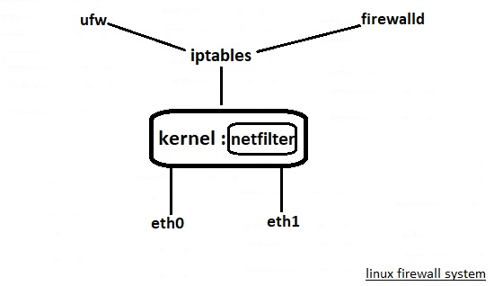
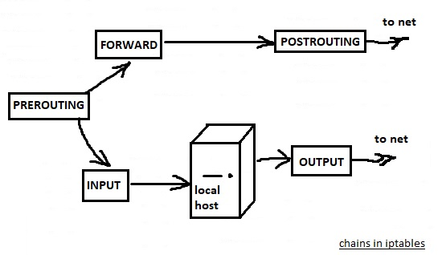
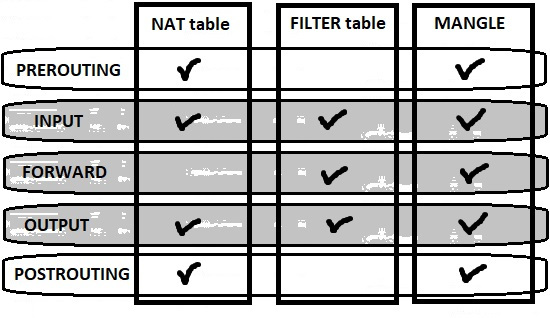
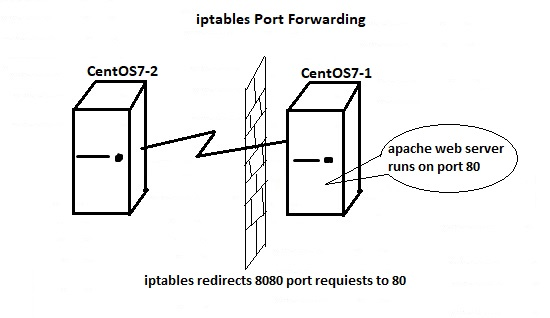
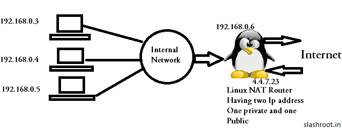
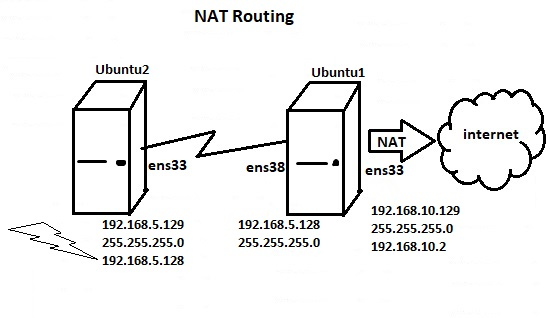

# 212.1. Configuring a router

## **212.1 Configuring a router**

**Weight:** 3

**Description:** Candidates should be able to configure a system to forward IP packet and perform network address translation \(NAT, IP masquerading\) and state its significance in protecting a network. This objective includes configuring port redirection, managing filter rules and averting attacks.

**Key Knowledge Areas:**

* iptables and ip6tables configuration files, tools and utilities
* Tools, commands and utilities to manage routing tables.
* Private address ranges \(IPv4\) and Unique Local Addresses as well as Link Local Addresses \(IPv6\)
* Port redirection and IP forwarding
* List and write filtering and rules that accept or block IP packets based on source or destination protocol, port and address
* Save and reload filtering configurations

**Terms and Utilities:**

* /proc/sys/net/ipv4/
* /proc/sys/net/ipv6/
* /etc/services
* iptables
* ip6tables

Like any other moder operating system, liunx has firewall. First lets see how linux firewalling is organized:



There is a firewalling functionality which is implemented in linux kernel with netfilter. netfilter is a kernel module and any network traffic which kernel forward to any interface\(s\), is pass through netfilter. This way netfilter can make decision wether incomming or out going traffic is allowed or not. The major interface to the netfilter module is iptables. iptables has been around for a long time and it let us to do any advanced configuration on linux firewalls.

While being able to do any advanced firewall configuration is count as iptables advantage, the biggest disadvantage of iptables is its complexity. This disadvantage has been caused other solutions have been invented like ufw , firewalld . They both work with iptables behind the sence and make firewall configuration easier for us. For lpic2 exam we just talk about iptables.

## iptables

iptables works with tables! There are at present three tables:

* **Filter :**  The filter table is used for packet filtering.
* **NAT :**  The nat table is used for address translation.
* **Mangle :** The mangle table can be used for special-purpose processing of packets.

Within tables there are chains.chains are used to define what kind of packet follow shoud be filtered exactly.



* **PREROUTING:** configured to block, redirect or allow th packet to the next chain.Commonly, used to redirect the packet to another address or/and port. \(DNAT-Destination NAT\).  If destination is local \( this machine\) sent to INPUT chain. If bound for another network, sent to the FORWARD chain.
* INPUT: Configured to be blocked, logged or sent to the local system to be handled by the appropriate client, application or service.
* OUTPUT:  packet is sent from the firewall out to the network to its final destination.\(Rules usually are not applied at this chain\)
* FORWARD : Configured to block, logged or sent to the POSTROUTING chain.
* **POSTROUTING:**  make changes to the packet as it exits the firewall, commonly used to do masquerading. 

How tables and chain are related so ? All three tree tables \(FILTER, NAT, MANGLE\) can be present in chains\(filter points\) but not every chain has all three table represented:



* **PREROUTING \(** _**NAT**_ **,** MANGLE**\)**
* INPUT \(**FILTER** , MANGLE \)
* FORWARD \(**FILTER** , MANGLE \)
* OUTPUT \(**FILTER**  ,  _**NAT**_ , MANGLE\)
* **POSTROUTING \(**_**NAT**_ **,** MANGLE**\)**

How rules are broken down within the firewall system? chains are filtering points that we can create rules, and rules are apllied to the packet passing trough. The rules define what exactly should happen to a packet.

When packets are filterd trough the iptables firewall it will go tough the rules one by one, and the idea is "exit on match". So if a packet matches specific rule , the rule will be applied and nothing else will be applied in that chain any more. So ordering in iptables is very important.

In every rule there us target, The typical target is ACCEPT:

* **ACCEPT** : the package is allowed
* **DROP** : The package is not allowed, the package will be sileintly dropped and the sender of package doesn't know anything.
* **REJECT** :  Do not allow package, the sender of package will get an ICMP warnnig message.
* **LOG :** just LOGs
* **MASQUARATE :** used for NAT.

the target indicated with -j option. we will talk about that.

In every chain there is a policy. The policy define the default behaviour. The default policy is ACCEPT but its isa good practice to have a policy that will drop every thing that doesn't match specific packet in a chain. to set chain default policy

```text
iptables -P drop INPUT
```

please do notice that is upper case "P".

### iptables commands

iptables commands can be pretty long, and sometimes hard to understand so lets defualt components in iptables commands to make it easier:

```text
iptables -A chain [-i/-o interface] [-s/-d address] -p udp --sport/--dport 80  -j TARGET
```

`-A` appends to the end gollowed by the name of the chain, `[-i/-o interface]` incomming or outgoing interface,`[ -s/-d ]` source address or destination address,`-p` defines the protocol like tcp or udp, `[--sport/--dport]`for setting source or destination port number, `-j TARGET` which define what will happend to the packet that match this rule.

iptables command options outside of adding rules to chain:

| Option | Description |
| :--- | :--- |
| -L &lt;chain-name&gt; -t &lt;table-name&gt; | Lists all of the rules in the  specified chain and table. If not chain or table specified, shows all. |
| -D | Deletes a rule in a particular chain by number |
| -F \(or --flush\) | flushes all \(or indicated chain\) of rules |
| -P | change the default policy for the chain\(can be set to DROP or ACCEPT\) |
| -v | typically used with -F\(or --flush\) to provide additional output |
| -n | Display IP address and port in numeric format |

For demonstration we use CentOS7, in RedHat the defualt solution is firewalld. We have to first stop and disable firewalld because firewalld interface and iptables can not work together:

```text
[root@centos7-1 ~]# systemctl stop firewalld
[root@centos7-1 ~]# systemctl disable firewalld
Removed symlink /etc/systemd/system/multi-user.target.wants/firewalld.service.
Removed symlink /etc/systemd/system/dbus-org.fedoraproject.FirewallD1.service.
[root@centos7-1 ~]# systemctl mask firewalld
Created symlink from /etc/systemd/system/firewalld.service to /dev/null.
```

Now lets install iptables and iptables-service packages which is required for systemd:

```text
[root@centos7-1 ~]# yum install iptables
Loaded plugins: fastestmirror, langpacks
Loading mirror speeds from cached hostfile
 * base: mirror.metrocast.net
 * epel: fedora-epel.mirrors.tds.net
 * extras: mirror.mojohost.com
 * updates: mirror.teklinks.com
Package iptables-1.4.21-24.1.el7_5.x86_64 already installed and latest version
Nothing to do

[root@centos7-1 ~]# yum install iptables-services

[root@centos7-1 ~]# systemctl start iptables
[root@centos7-1 ~]# systemctl enable iptables
Created symlink from /etc/systemd/system/basic.target.wants/iptables.service to /usr/lib/systemd/system/iptables.service.
```

okey every thing is ready for starting, lets list everything wich is currently used:

```text
[root@centos7-1 ~]# iptables -L
Chain INPUT (policy ACCEPT)
target     prot opt source               destination         
ACCEPT     all  --  anywhere             anywhere             state RELATED,ESTABLISHED
ACCEPT     icmp --  anywhere             anywhere            
ACCEPT     all  --  anywhere             anywhere            
ACCEPT     tcp  --  anywhere             anywhere             state NEW tcp dpt:ssh
REJECT     all  --  anywhere             anywhere             reject-with icmp-host-prohibited

Chain FORWARD (policy ACCEPT)
target     prot opt source               destination         
REJECT     all  --  anywhere             anywhere             reject-with icmp-host-prohibited

Chain OUTPUT (policy ACCEPT)
target     prot opt source               destination
```

we flush iptables rule : set the default chains policy to DROP for more security and see the results:

```text
[root@centos7-1 ~]# iptables -F -v
Flushing chain `INPUT'
Flushing chain `FORWARD'
Flushing chain `OUTPUT'
[root@centos7-1 ~]# iptables -L
Chain INPUT (policy ACCEPT)
target     prot opt source               destination         

Chain FORWARD (policy ACCEPT)
target     prot opt source               destination         

Chain OUTPUT (policy ACCEPT)
target     prot opt source               destination
```

set the default chains policy to DROP for more security and see the results:

```text
[root@centos7-1 ~]# iptables -P INPUT DROP
[root@centos7-1 ~]# iptables -P FORWARD DROP
[root@centos7-1 ~]# iptables -P OUTPUT DROP
[root@centos7-1 ~]# iptables -L
Chain INPUT (policy DROP)
target     prot opt source               destination         

Chain FORWARD (policy DROP)
target     prot opt source               destination         

Chain OUTPUT (policy DROP)
target     prot opt source               destination
```

There is one note that we should never forget, linux uses loopback adapter for internel communication. But we have drope that:

```text
[root@centos7-1 ~]# ping localhost 
PING localhost (127.0.0.1) 56(84) bytes of data.
ping: sendmsg: Operation not permitted
ping: sendmsg: Operation not permitted
ping: sendmsg: Operation not permitted
ping: sendmsg: Operation not permitted
^C
--- localhost ping statistics ---
4 packets transmitted, 0 received, 100% packet loss, time 3014ms
```

So do not forget to ACCEPT loopback adapter packetes if you want to set chain default policy to drop:

```text
[root@centos7-1 ~]# iptables -A INPUT -i lo -j ACCEPT
[root@centos7-1 ~]# iptables -A OUTPUT -o lo -j ACCEPT
```

and check:

```text
[root@centos7-1 ~]# ping localhost -c3
PING localhost (127.0.0.1) 56(84) bytes of data.
64 bytes from localhost (127.0.0.1): icmp_seq=1 ttl=64 time=0.030 ms
64 bytes from localhost (127.0.0.1): icmp_seq=2 ttl=64 time=0.117 ms
64 bytes from localhost (127.0.0.1): icmp_seq=3 ttl=64 time=0.148 ms

--- localhost ping statistics ---
3 packets transmitted, 3 received, 0% packet loss, time 2006ms
rtt min/avg/max/mdev = 0.030/0.098/0.148/0.050 ms
```

Now lets ACCEPT ssh coonection to be stablished with our host:

```text
[root@centos7-1 ~]# iptables -A INPUT -p tcp --dport 22 -j ACCEPT
```

it seems okey hah? but it doesn't work, check it from another computer\(centos7-2\):

```text
[root@centos7-2 ~]# ssh centos7-1

^C
```

The point is that do not forget to set reverse rules inorder to let incomming traffic to our server\(centos7-1\), can come back:

```text
[root@centos7-1 ~]# iptables -A OUTPUT -p tcp --sport 22 -j ACCEPT
[root@centos7-1 ~]# iptables -L
Chain INPUT (policy DROP)
target     prot opt source               destination         
ACCEPT     all  --  anywhere             anywhere            
ACCEPT     tcp  --  anywhere             anywhere             tcp dpt:ssh

Chain FORWARD (policy DROP)
target     prot opt source               destination         

Chain OUTPUT (policy DROP)
target     prot opt source               destination         
ACCEPT     all  --  anywhere             anywhere            
ACCEPT     tcp  --  anywhere             anywhere             tcp spt:ssh
```

and check:

```text
[root@centos7-2 ~]# ssh centos7-1
The authenticity of host 'centos7-1 (192.168.10.133)' can't be established.
ECDSA key fingerprint is SHA256:QtfM2iXh5pxZeFdAUXEBEnRXNSP40MWIhnSYvpOBMoY.
ECDSA key fingerprint is MD5:27:db:c1:d0:da:35:80:92:81:fa:8f:1c:e5:d7:f3:2e.
Are you sure you want to continue connecting (yes/no)? yes
Warning: Permanently added 'centos7-1,192.168.10.133' (ECDSA) to the list of known hosts.
root@centos7-1's password: 
Last login: Sun Jul 15 02:41:53 2018
Managed by ansible
```

#### Saving iptables rules

iptables rules are not persisyent and they are vanished after reboot. rules are stored in /etc/sysconfig/iptables . for saving rules we use iptables-save command,

```text
[root@centos7-1 ~]# iptables-save > /etc/sysconfig/iptables.$(date +%d-%m-%y)
[root@centos7-1 ~]# ls /etc/sysconfig | grep iptables
iptables
iptables.18-07-18
iptables-config
[root@centos7-1 ~]# cat /etc/sysconfig/iptables.18-07-18 
# Generated by iptables-save v1.4.21 on Wed Jul 18 00:12:18 2018
*filter
:INPUT DROP [136:9925]
:FORWARD DROP [0:0]
:OUTPUT DROP [209:34216]
-A INPUT -i lo -j ACCEPT
-A INPUT -p tcp -m tcp --dport 22 -j ACCEPT
-A OUTPUT -o lo -j ACCEPT
-A OUTPUT -p tcp -m tcp --sport 22 -j ACCEPT
COMMIT
# Completed on Wed Jul 18 00:12:18 2018
```

now we clear the previous rules:

```text
[root@centos7-1 ~]# iptables -F
[root@centos7-1 ~]# iptables -L
Chain INPUT (policy DROP)
target     prot opt source               destination         

Chain FORWARD (policy DROP)
target     prot opt source               destination         

Chain OUTPUT (policy DROP)
target     prot opt source               destination
```

use iptables-restoreto restore the backup:

```text
[root@centos7-1 ~]# iptables-restore < /etc/sysconfig/iptables.18-07-18 
[root@centos7-1 ~]# iptables -L
Chain INPUT (policy DROP)
target     prot opt source               destination         
ACCEPT     all  --  anywhere             anywhere            
ACCEPT     tcp  --  anywhere             anywhere             tcp dpt:ssh

Chain FORWARD (policy DROP)
target     prot opt source               destination         

Chain OUTPUT (policy DROP)
target     prot opt source               destination         
ACCEPT     all  --  anywhere             anywhere            
ACCEPT     tcp  --  anywhere             anywhere             tcp spt:ssh
```

How to delete a rule ? There are two ways for deleting a rule, using -D option with full lenght of rule that we have specified:

```text
[root@centos7-1 ~]# iptables -D OUTPUT -p tcp --sport 22 -j ACCEPT
[root@centos7-1 ~]# iptables -L
Chain INPUT (policy DROP)
target     prot opt source               destination         
ACCEPT     all  --  anywhere             anywhere            
ACCEPT     tcp  --  anywhere             anywhere             tcp dpt:ssh

Chain FORWARD (policy DROP)
target     prot opt source               destination         

Chain OUTPUT (policy DROP)
target     prot opt source               destination         
ACCEPT     all  --  anywhere             anywhere
```

or use iptables -L --line-numbers and delete a rule by using its number in the table:

```text
[root@centos7-1 ~]# iptables -L --line-numbers
Chain INPUT (policy DROP)
num  target     prot opt source               destination         
1    ACCEPT     all  --  anywhere             anywhere            
2    ACCEPT     tcp  --  anywhere             anywhere             tcp dpt:ssh

Chain FORWARD (policy DROP)
num  target     prot opt source               destination         

Chain OUTPUT (policy DROP)
num  target     prot opt source               destination         
1    ACCEPT     all  --  anywhere             anywhere      
[root@centos7-1 ~]# iptables -D INPUT 2
[root@centos7-1 ~]# iptables -L
Chain INPUT (policy DROP)
target     prot opt source               destination         
ACCEPT     all  --  anywhere             anywhere            

Chain FORWARD (policy DROP)
target     prot opt source               destination         

Chain OUTPUT (policy DROP)
target     prot opt source               destination         
ACCEPT     all  --  anywhere             anywhere
```

#### Now more iptables examples:

Block TCP traffic from Specific IP Address:

```text
iptables -A INPUT -p tcp -s xxx.xxx.xxx.xxx -j DROP
```

Allow All tcp xxx incomming port:

```text
iptables -A INPUT -p tcp --dport xxx -j ACCEPT
```

some time we need to load special iptables module to do something special. Allow Multiple Ports :

```text
iptables -A INPUT  -p tcp -m multiport --dports 22,80,443 -j ACCEPT
```

Allow Specific Network Range on Particular Port:

```text
iptables -A OUTPUT -p tcp -d 192.168.100.0/24 --dport 22 -j ACCEPT
```

Sometimes IP addresses may requests too many connections towards web ports on our website. This can cause number of issues and to prevent such problems, we can Block Network Flood on Apache Port using this rule:

```text
iptables -A INPUT -p tcp --dport 80 -m limit --limit 100/minute --limit-burst 200 -j ACCEPT
```

Some time we want to just monitor network traffic or we want to trouble shoot our iptables firewall, best thing is logging:

```text
iptables -A INPUT -i eth0 -j LOG --log-prefix "IPtables DROPPED:"
```

and then see the logs with `grep "IPtables DROPPED:" /var/log/messages`

If our firewall has alot of rules, iptables log is used with iptables-save and iptables-restore . The trick is saving current rules, Allowing traffic, log it and then restoring rules and adding new required setting.

### Port Redirection

Sometimes we may want to forward one service’s traffic to another port . Lets do this by an example:

Here we use two CentOS system, one as a web server which runs on port 80 and the other one as a web client. Every thing is working on port 80 smothly :

```text
[root@centos7-1 ~]# elinks http://192.168.10.133
```


but we want to do something whith iptables which redirect requests from port 8080 to port 80 this way clients from CentOS2 should be able to visit out site on port 8080:

```text
[root@centos7-1 ~]# iptables -A INPUT -p tcp --dport 80 -j ACCEPT
[root@centos7-1 ~]# iptables -t nat -A PREROUTING -i ens33 -p tcp --dport 8080 -j REDIRECT --to-port 80
```

and check the result from CentOS7-2:

```text
[root@centos7-2 ~]# elinks http://192.168.10.133:8080
```


### ip6tables

The introduction of the next-generation Internet Protocol, called IPv6, expands beyond the 32-bit address limit of IPv4 \(or IP\). IPv6 supports 128-bit addresses and, as such, carrier networks that are IPv6 aware are able to address a larger number of routable addresses than IPv4.

Linux supports IPv6 firewall rules using the Netfilter 6 subsystem and the`ip6tables`command. For example, SSH connections on a IPv6-aware network server can be enabled with the following rule:

```text
ip6tables -A INPUT -i eth0 -p tcp -s 3ffe:ffff:100::1/128 --dport 22 -j ACCEPT
```

### NAT IP Forwarding

Private \(None-Routable\) Networks have been set aside for use inside corporate networks.They are not able to communicate directly with internet hosts and require a firewall or similar device to translate Network Address. NAT \(Network Address Translation\) is used to originate IP to a public IP that can forward the traffic on their behalf.

Ranges are:

* 10.0.0.0 to 10.255.255.255
* 172.16.0.0 to 172.31.255.255
* 192.168.0.0 to 192.168.255.255



How linux does that ? Linux uses Connection tracking, Connection tracking is a mechanism done by Linux machine's to keep track of TCP connections that are going out and coming inside. This connection tracking mechanism enables Linux machine's to accurately send packet's which are NATed to the exact internal machines, who initiated the connection.

connection tracking tables consists of the following things.

* Ip addresses
* Protocols
* Port number's
* Status of the connection

With the help of that table, stateful firewall can filter out traffic based on the status of the connection, Do NAT and many other stuff.

There are two different types of NAT:

* **Source NAT\(SNAT\)**
* **Destination NAT \(DNAT\)**

### Masqueradeand SNAT in Linux

This is the most commonly used NAT. SNAT stands for Source Network Address Translation. It rewrites only the source address of the packets while nating. In the previously shown example of NAT many private ip addresses of the range 192.168.0.0/24 gets translated to the public source address of the Linux NAT router\(4.4.7.23\).

In this case the internal network hosts, with private ip addresses can reach the internet with the help of SNAT. But hosts from the internet cannot reach those internal hosts directly \(It will only reach the internal hosts, if the source was NATed to the Linux router's public IP address.\)

In other words, connection initiated by the internal hosts to the internet will only be fulfilled\(not the reverse\).

#### Static SNAT vs DynamicSNAT

Even SNAT can be classified into different types based on the translation it does. For example if many internal private IP addresses gets translated to one public ip address assigned to the Linux router, then its called as a**Static SNAT**.If many internal private IP addresses gets translated to many different public IP addresses assigned to the Linux router, then its called as a**Dynamic SNAT.** Please note that If we are using masquerading instead of SNAT, then we will be unable to specify the outgoing ip address. It will use the default IP address assigned to the outgoing interface.

### What is DNAT?

In the above shown example of SNAT, the connection was initiated by the host inside the internal network. What if a host on the internet needs to initiate the connection. In that case we need to design our Linux router in such a way that traffic from internet to a particular public IP address on the router will be forwarded to one particular private IP address.

Such kind of a configuration is called as DNAT, or destination NAT. It is called a destination NAT because the first address rewriting done by the router is for destination address.

Lets make our hands dirty and do some configurations. Here we have two Ubuntu machine, and we want to give internet access to Ubuntu2 using Ubuntu1.



First we have to configure kernel to let forward traffic trough this machine:

```text
root@server1:~# cat /proc/sys/net/ipv4/ip_forward
0
root@server1:~# echo "1" > /proc/sys/net/ipv4/ip_forward
root@server1:~# cat /proc/sys/net/ipv4/ip_forward
1
```

now lets MASQUERADE:

```text
root@server1:~# iptables --table nat --append POSTROUTING --out-interface ens33 -j MASQUERADE
root@server1:~# iptables --append FORWARD --in-interface ens38 -j ACCEPT
```

and do not forget if we don't specify any tables by default it appends to "filter" table. Okey lets now checks Ubntu2:

```text
root@server2:~# ip a s
1: lo: <LOOPBACK,UP,LOWER_UP> mtu 65536 qdisc noqueue state UNKNOWN group default qlen 1000
    link/loopback 00:00:00:00:00:00 brd 00:00:00:00:00:00
    inet 127.0.0.1/8 scope host lo
       valid_lft forever preferred_lft forever
    inet6 ::1/128 scope host 
       valid_lft forever preferred_lft forever
2: ens33: <BROADCAST,MULTICAST,UP,LOWER_UP> mtu 1500 qdisc pfifo_fast state UP group default qlen 1000
    link/ether 00:0c:29:40:b1:ca brd ff:ff:ff:ff:ff:ff
    inet 192.168.5.129/24 brd 192.168.5.255 scope global ens33
       valid_lft forever preferred_lft forever
    inet6 fe80::47a6:91f0:8edb:9a49/64 scope link 
       valid_lft forever preferred_lft forever
root@server2:~# ping 8.8.8.8
PING 8.8.8.8 (8.8.8.8) 56(84) bytes of data.
64 bytes from 8.8.8.8: icmp_seq=1 ttl=127 time=161 ms
64 bytes from 8.8.8.8: icmp_seq=2 ttl=127 time=179 ms
^C
--- 8.8.8.8 ping statistics ---
2 packets transmitted, 2 received, 0% packet loss, time 1002ms
rtt min/avg/max/mdev = 161.904/170.784/179.664/8.880 ms
```

That is all.

