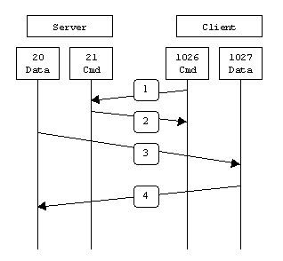
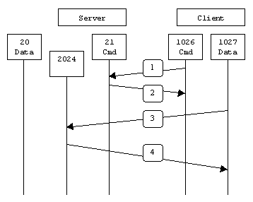

# 212.2. Securing FTP servers

## **212.2 Securing FTP servers**

**Weight:** 2

**Description:** Candidates should be able to configure an FTP server for anonymous downloads and uploads. This objective includes precautions to be taken if anonymous uploads are permitted and configuring user access.

**Key Knowledge Areas:**

* Configuration files, tools and utilities for Pure-FTPd and vsftpd
* Awareness of ProFTPd
* Understanding of passive vs. active FTP connections

**Terms and Utilities:**

* vsftpd.conf
* important Pure-FTPd command line options

## What is FTP?

FTP \(File Transfer Protocol\) is a traditional and widely used standard tool for transferring files between a server and clients over a network, especially where no authentication is necessary \( FTP permits anonymous users to connect to a server\). We must understand that FTP is unsecure by default, because it transmits user credentials and data without encryption.

If we planning to use FTP, consider configuring FTP connection with SSL/TLS . Otherwise, it’s always better to use secure FTP such as Very Secure FTP \(vsftp\).

### FTP ports

FTP is a TCP based service exclusively. There is no UDP component to FTP. FTP is an unusual service in that it utilizes two ports, a '**data**' port and a **'command**' port \(also known as the **control port**\). Traditionally these are port 21 for the command port and port 20 for the data port. The confusion begins however, when we find that depending on the mode, the data port is not always on port 20!

### Active FTP  vs Passive FTP

Data is transferred across a separate data channel, but this port varies dependant on the FTP mode being used. Generally there are 2 modes for FTP:

* Active mode
* Passive mode \(PASV\)

**Active Mode :** In active mode FTP the client connects from a random unprivileged port \(N &gt; 1023\) to the FTP server's command port, port 21. Then, the client starts listening to port N+1 and sends the FTP command`PORT N+1`to the FTP server. The server will then connect back to the client's specified data port from its local data port, which is port 20. This can cause problems if you are behind a firewall / NAT router!



From the server-side firewall's standpoint, to support active mode FTP the following communication channels need to be opened:

* FTP server's port 21 from anywhere \(Client initiates connection\)
* FTP server's port 21 to ports &gt; 1023 \(Server responds to client's control port\)
* FTP server's port 20 to ports &gt; 1023 \(Server initiates data connection to client's data port\)
* FTP server's port 20 from ports &gt; 1023 \(Client sends ACKs to server's data port\)

**Passive FTP :** In order to resolve the issue of the server initiating the connection to the client a different method for FTP connections was developed. This was known as passive mode, or PASV, after the command used by the client to tell the server it is in passive mode.

In passive mode FTP the client initiates both connections to the server, solving the problem of firewalls filtering the incoming data port connection to the client from the server. When opening an FTP connection, the client opens two random unprivileged ports locally \(N &gt; 1023 and N+1\). The first port contacts the server on port 21, but instead of then issuing a PORT command and allowing the server to connect back to its data port, the client will issue the PASV command. The result of this is that the server then opens a random unprivileged port \(P &gt; 1023\) and sends P back to the client in response to the PASV command. The client then initiates the connection from port N+1 to port P on the server to transfer data.



From the server-side firewall's standpoint, to support passive mode FTP the following communication channels need to be opened:

* FTP server's port 21 from anywhere \(Client initiates connection\)
* FTP server's port 21 to ports &gt; 1023 \(Server responds to client's control port\)
* FTP server's ports &gt; 1023 from anywhere \(Client initiates data connection to random port specified by server\)
* FTP server's ports &gt; 1023 to remote ports &gt; 1023 \(Server sends ACKs \(and data\) to client's data port\)

#### Summary

The following chart should help admins remember how each FTP mode works:

* Active FTP :

  command : client &gt;1023 -&gt; server 21

  data : client &gt;1023 &lt;- server 20

* Passive FTP :

  command : client &gt;1023 -&gt; server 21

  data : client &gt;1024 -&gt; server &gt;1023

## Very Secure FTP\(vsftp\)

vsftpd \(Very Secure FTP Daemon\) is a lightweight, stable and secure FTP server for UNIX-like systems. vsftp \(as its name says\) is not very secure and still dosen't encrypt the connection between client and the server, but that is more secure than standard ftp and many security options have been seen inside its configuration file.

Lets install vsftp \(use CentOS7\):

```text
[root@centos7-1 ~]# yum install vsftpd
```

the initial configuration is okey specially if want to run it in our private network, so lets start the service:

```text
[root@centos7-1 ~]# systemctl start vsftpd

[root@centos7-1 ~]# systemctl status vsftpd
● vsftpd.service - Vsftpd ftp daemon
   Loaded: loaded (/usr/lib/systemd/system/vsftpd.service; disabled; vendor preset: disabled)
   Active: active (running) since Sun 2018-07-22 01:51:40 EDT; 5s ago
  Process: 17788 ExecStart=/usr/sbin/vsftpd /etc/vsftpd/vsftpd.conf (code=exited, status=0/SUCCESS)
 Main PID: 17790 (vsftpd)
    Tasks: 1
   Memory: 576.0K
   CGroup: /system.slice/vsftpd.service
           └─17790 /usr/sbin/vsftpd /etc/vsftpd/vsftpd.conf

Jul 22 01:51:40 centos7-1 systemd[1]: Starting Vsftpd ftp daemon...
Jul 22 01:51:40 centos7-1 systemd[1]: Started Vsftpd ftp daemon.
```

### Files Installed with vsftpd

There are some vsftp configuration files inside /etc/vsftp directry:

```text
[root@centos7-1 ~]# cd /etc/vsftpd/
[root@centos7-1 vsftpd]# ls -l
total 20
-rw-------. 1 root root  125 Aug  3  2017 ftpusers
-rw-------. 1 root root  361 Aug  3  2017 user_list
-rw-------. 1 root root 5030 Aug  3  2017 vsftpd.conf
-rwxr--r--. 1 root root  338 Aug  3  2017 vsftpd_conf_migrate.sh
```

* /etc/vsftpd/user\_list — This file can be configured to either deny or allow access to the users listed, depending on whether the userlist\_deny directive is set to YES \(default\) or NO in /etc/vsftpd/vsftpd.conf. If /etc/vsftpd.user\_list is used to grant access to users, the usernames listed must not appear in /etc/vsftpd/ftpusers.

```text
[root@centos7-1 vsftpd]# cat user_list
# vsftpd userlist
# If userlist_deny=NO, only allow users in this file
# If userlist_deny=YES (default), never allow users in this file, and
# do not even prompt for a password.
# Note that the default vsftpd pam config also checks /etc/vsftpd/ftpusers
# for users that are denied.
root
bin
daemon
adm
lp
sync
shutdown
halt
mail
news
uucp
operator
games
nobody
```

* /etc/vsftpd/ftpusers — A list of users not allowed to log into vsftpd. By default, this list includes the root, bin, and daemon users, among others.

```text
[root@centos7-1 vsftpd]# cat ftpusers 
# Users that are not allowed to login via ftp
root
bin
daemon
adm
lp
sync
shutdown
halt
mail
news
uucp
operator
games
nobody
```

This file is used by vsftpd pam module /etc/pam.d/vsftpd .

* /etc/pam.d/vsftpd — The Pluggable Authentication Modules \(PAM\) configuration file for vsftpd. This file defines the requirements a user must meet to login to the FTP server. \(We have talked about previously in pam course\)

```text
[root@centos7-1 ~]# cat /etc/pam.d/vsftpd 
#%PAM-1.0
session    optional     pam_keyinit.so    force revoke
auth       required    pam_listfile.so item=user sense=deny file=/etc/vsftpd/ftpusers onerr=succeed
auth       required    pam_shells.so
auth       include    password-auth
account    include    password-auth
session    required     pam_loginuid.so
session    include    password-auth
```

* **/etc/vsftpd/vsftpd.conf**

The configuration file for vsftpd.

```text
[root@centos7-1 vsftpd]# cat vsftpd.conf 
# Example config file /etc/vsftpd/vsftpd.conf
#
# The default compiled in settings are fairly paranoid. This sample file
# loosens things up a bit, to make the ftp daemon more usable.
# Please see vsftpd.conf.5 for all compiled in defaults.
#
# READ THIS: This example file is NOT an exhaustive list of vsftpd options.
# Please read the vsftpd.conf.5 manual page to get a full idea of vsftpd's
# capabilities.
#
# Allow anonymous FTP? (Beware - allowed by default if you comment this out).
anonymous_enable=YES
#
# Uncomment this to allow local users to log in.
# When SELinux is enforcing check for SE bool ftp_home_dir
local_enable=YES
#
# Uncomment this to enable any form of FTP write command.
write_enable=YES
#
# Default umask for local users is 077. You may wish to change this to 022,
# if your users expect that (022 is used by most other ftpd's)
local_umask=022
#
# Uncomment this to allow the anonymous FTP user to upload files. This only
# has an effect if the above global write enable is activated. Also, you will
# obviously need to create a directory writable by the FTP user.
# When SELinux is enforcing check for SE bool allow_ftpd_anon_write, allow_ftpd_full_access
#anon_upload_enable=YES
#
# Uncomment this if you want the anonymous FTP user to be able to create
# new directories.
#anon_mkdir_write_enable=YES
#
# Activate directory messages - messages given to remote users when they
# go into a certain directory.
dirmessage_enable=YES
#
# Activate logging of uploads/downloads.
xferlog_enable=YES
#
# Make sure PORT transfer connections originate from port 20 (ftp-data).
connect_from_port_20=YES
#
# If you want, you can arrange for uploaded anonymous files to be owned by
# a different user. Note! Using "root" for uploaded files is not
# recommended!
#chown_uploads=YES
#chown_username=whoever
#
# You may override where the log file goes if you like. The default is shown
# below.
#xferlog_file=/var/log/xferlog
#
# If you want, you can have your log file in standard ftpd xferlog format.
# Note that the default log file location is /var/log/xferlog in this case.
xferlog_std_format=YES
#
# You may change the default value for timing out an idle session.
#idle_session_timeout=600
#
# You may change the default value for timing out a data connection.
#data_connection_timeout=120
#
# It is recommended that you define on your system a unique user which the
# ftp server can use as a totally isolated and unprivileged user.
#nopriv_user=ftpsecure
#
# Enable this and the server will recognise asynchronous ABOR requests. Not
# recommended for security (the code is non-trivial). Not enabling it,
# however, may confuse older FTP clients.
#async_abor_enable=YES
#
# By default the server will pretend to allow ASCII mode but in fact ignore
# the request. Turn on the below options to have the server actually do ASCII
# mangling on files when in ASCII mode.
# Beware that on some FTP servers, ASCII support allows a denial of service
# attack (DoS) via the command "SIZE /big/file" in ASCII mode. vsftpd
# predicted this attack and has always been safe, reporting the size of the
# raw file.
# ASCII mangling is a horrible feature of the protocol.
#ascii_upload_enable=YES
#ascii_download_enable=YES
#
# You may fully customise the login banner string:
#ftpd_banner=Welcome to blah FTP service.
#
# You may specify a file of disallowed anonymous e-mail addresses. Apparently
# useful for combatting certain DoS attacks.
#deny_email_enable=YES
# (default follows)
#banned_email_file=/etc/vsftpd/banned_emails
#
# You may specify an explicit list of local users to chroot() to their home
# directory. If chroot_local_user is YES, then this list becomes a list of
# users to NOT chroot().
# (Warning! chroot'ing can be very dangerous. If using chroot, make sure that
# the user does not have write access to the top level directory within the
# chroot)
#chroot_local_user=YES
#chroot_list_enable=YES
# (default follows)
#chroot_list_file=/etc/vsftpd/chroot_list
#
# You may activate the "-R" option to the builtin ls. This is disabled by
# default to avoid remote users being able to cause excessive I/O on large
# sites. However, some broken FTP clients such as "ncftp" and "mirror" assume
# the presence of the "-R" option, so there is a strong case for enabling it.
#ls_recurse_enable=YES
#
# When "listen" directive is enabled, vsftpd runs in standalone mode and
# listens on IPv4 sockets. This directive cannot be used in conjunction
# with the listen_ipv6 directive.
listen=NO
#
# This directive enables listening on IPv6 sockets. By default, listening
# on the IPv6 "any" address (::) will accept connections from both IPv6
# and IPv4 clients. It is not necessary to listen on *both* IPv4 and IPv6
# sockets. If you want that (perhaps because you want to listen on specific
# addresses) then you must run two copies of vsftpd with two configuration
# files.
# Make sure, that one of the listen options is commented !!
listen_ipv6=YES

pam_service_name=vsftpd
userlist_enable=YES
tcp_wrappers=YES
```

The most important ones are:

**anonymous\_enable** — When enabled, anonymous users are allowed to log in. The usernames anonymous and ftp are accepted.The default value is YES.

**anon\_upload\_enable** — When enabled in conjunction with the write\_enable directive, anonymous users are allowed to upload files within a parent directory which has write permissions.The default value is NO.

**local\_enable** — When enabled, local users are allowed to log into the system. The default value is YES.

**write\_enable** — When enabled, FTP commands which can change the file system are allowed, such as DELE, RNFR, and STOR. The default value is YES.

**local\_umask** — Specifies the umask value for file creation. Note that the default value is in octal form \(a numerical system with a base of eight\), which includes a "0" prefix. Otherwise the value is treated as a base-10 integer.

**anon\_mkdir\_write\_enable** — When enabled in conjunction with the write\_enable directive, anonymous users are allowed to create new directories within a parent directory which has write permissions.

**dirmessage\_enable** — When enabled, a message is displayed whenever a user enters a directory with a message file. This message resides within the current directory. The name of this file is specified in the message\_file directive and is .message by default.

**connect\_from\_port\_20** — When enabled, vsftpd runs with enough privileges to open port 20 on the server during active mode data transfers. Disabling this option allows vsftpd to run with less privileges, but may be incompatible with some FTP clients.

**pam\_service\_name** — Specifies the PAM service name for vsftpd.The default value is ftp. Note, in Fedora, the value is set to vsftpd.The default value is NO. Note, in Fedora, the value is set to YES.

**userlist\_enable** — When enabled, the users listed in the file specified by the userlist\_file directive are denied access. Because access is denied before the client is asked for a password, users are prevented from submitting unencrypted passwords over the network.

**ftpd\_banner** — When enabled, the string specified within this directive is displayed when a connection is established to the server. This option can be overridden by the banner\_file directive.By default vsftpd displays its standard banner.

**banner\_file** — Specifies the file containing text displayed when a connection is established to the server. This option overrides any text specified in the ftpd\_banner directive.

**anon\_max\_rate** — Specifies the maximum data transfer rate for anonymous users in bytes per second.The default value is 0, which does not limit the transfer rate.

**tcp\_wrappers** — If enabled, and vsftpd was compiled with tcp\_wrappers support, incoming connections will be fed through tcp\_wrappers access control. Furthermore, there is a mechanism for per-IP based configuration. If tcp\_wrappers sets the VSFTPD\_LOAD\_CONF environment variable, then the vsftpd session will try and load the vsftpd configuration file specified in this variable. the Default is set to YES.

**local\_root** — Specifies the directory vsftpd changes to after a local user logs in.There is no default value for this directive.

**anon\_root** — Specifies the directory vsftpd changes to after an anonymous user logs in. There is no default value for this directive. 

### ftp client commands

The standard ftp program is the original ftp client. It comes standard with most Linux distributions. It first appeared in 4.2BSD, which was developed by the University of California, Berkeley.

```text
[root@centos7-1 vsftpd]# yum search ftp | grep client
[root@centos7-1 vsftpd]# yum install ftp.x86_64
```

Now lets take a quick look at the use full ftp client commands.

#### Establishing an FTP connection:

```text
ftp example.com
ftp 192.168.10.133
ftp user@ftpdomain.com
```

Most FTP servers logins are password protected, so the server will ask us for a 'username'and a'password'. \(If you connect to a so-called anonymous FTP server, then try to use "anonymous" as username and an empty password \):

```text
Name: user1
Password:
230 Login successful.
Remote system type is UNIX.
Using binary mode to transfer files.
```

#### Listing directories with security settings:

```text
ftp> ls
229 Entering Extended Passive Mode (|||59162|).
150 Here comes the directory listing.
drwxrwxr-x    3 1001     1001           19 May 27 05:19 mail
226 Directory send OK.
```

#### Changing Directories:

```text
ftp> cd /home
250 Directory successfully changed.
```

#### Downloading files with FTP:

Before downloading a file, we should set the local FTP file download directory by using 'lcd' command:

```text
ftp> lcd /home/user1/
Local directory now /home/user1
```

If we dont specify the download directory, the file will be downloaded to the current directory where you were at the time you started the FTP session.

Now, we can use the command 'get' command to download a file, the usage is:

```text
ftp> get mail
```

The file will be downloaded to the directory previously set with the 'lcd' command.

#### Uploading Files with FTP:

```text
put file
```

To upload several files we can use the mput command similar to the mget example from above:

```text
mput *.xls
```

#### Closing the FTP connection:

```text
bye
exit
quit
```

## pureftpd

Pure-FTPd is a free \(BSD license\) FTP Server with a strong focus on software security. It can be compiled and run on a variety of Unix-like computer operating systems but it mostly used in debian based distroes how ever CentOS has it in its repository.

```text
root@server1:~# apt install pure-ftpd
```

You probably think of pure-ftpd configuration file:

```text
[root@centos7-2 ~]# cd /etc/pure-ftpd/
[root@centos7-2 pure-ftpd]# ls -l
total 24
-rw-r--r--. 1 root root 11567 Dec 23  2015 pure-ftpd.conf
-rw-r--r--. 1 root root  2009 Jul  8  2012 pureftpd-ldap.conf
-rw-r--r--. 1 root root  3445 Jul  9  2015 pureftpd-mysql.conf
-rw-r--r--. 1 root root  2966 Jul  9  2015 pureftpd-pgsql.conf
```

pure-ftpd is not configuration based ftp server, try `cat pure-ftpd.conf` . The configuration inside are for background service stuff and are out side the thing we need to know for LPIC2 exam.

pureftpd is driven by configuration that is done by the command line .There are some items which are configured by default when we start pure-ftpd as a service. We are goinng to take a look at those items and some additional item which are required for LPIC2 exam.

Now lets start working with pure-ftpd .Use pure-ftpd command line tool for starting pure-ftpd daemon:

```text
[root@centos7-2 pure-ftpd]# which pure-ftpd
/sbin/pure-ftpd

[root@centos7-2 pure-ftpd]# pure-ftpd -B -S localhost,21 -e
```

-B says start pure-ftpd starts as a background service in a Daemon mode , -S is used to bind ftp service to specific host \(if multiple servers are exist\)and a port, and -e enable Anonymouse access.

```text
[root@centos7-2 pure-ftpd]# ps aux | grep pure-ftpd
root      15051  0.0  0.0 202480  1888 ?        Ss   03:12   0:00 pure-ftpd (SERVER)
root      15053  0.0  0.0 112660   972 pts/0    R+   03:12   0:00 grep --color=auto pure-ftpd
```

and check it out:

```text
[root@centos7-2 pure-ftpd]# ftp localhost
Trying ::1...
Connected to localhost (::1).
220---------- Welcome to Pure-FTPd [privsep] [TLS] ----------
220-You are user number 2 of 50 allowed.
220-Local time is now 03:23. Server port: 21.
220-Only anonymous FTP is allowed here
220 You will be disconnected after 15 minutes of inactivity.
Name (localhost:root): anonymous
230 Anonymous user logged in
Remote system type is UNIX.
Using binary mode to transfer files.
ftp>
```

and some more usefull pure-ftpd command switches:

| pure-ftpd switches | Description |
| :--- | :--- |
| -c | Number of cuncurrence  connections in total |
| -C | Number of Maximum concurrence connections from a Host |
| -e | Enable Anonymouse access |
| -E | Disable Anonymouse access. Only authenticated users. |
| -M | Allow anonymous users to create directories. |
| -I | Change the maximum idle time in minutes\(defualt=15\) |

as an example lets disable anounymous access:

```text
[root@centos7-2 pure-ftpd]# killall pure-ftpd
[root@centos7-2 pure-ftpd]# ps aux | grep pure-ftpd
root      15872  0.0  0.0 112660   972 pts/0    R+   03:33   0:00 grep --color=auto pure-ftpd

[root@centos7-2 pure-ftpd]# pure-ftpd -B -S localhost,21 -E
```

```text
[root@centos7-2 pure-ftpd]# ftp localhost
Trying ::1...
Connected to localhost (::1).
220---------- Welcome to Pure-FTPd [privsep] [TLS] ----------
220-You are user number 1 of 50 allowed.
220-Local time is now 03:34. Server port: 21.
220-This is a private system - No anonymous login
220 You will be disconnected after 15 minutes of inactivity.
Name (localhost:root): user
331 User user OK. Password required
Password:
230 OK. Current directory is /home/user
Remote system type is UNIX.
Using binary mode to transfer files.
ftp>
```

ok if you like to see the full list:

```text
[root@centos7-2 pure-ftpd]# pure-ftpd -h
pure-ftpd v1.0.42 [privsep]

-0    --notruncate    
-1    --logpid    
-2    --certfile    <opt>
-4    --ipv4only    
-6    --ipv6only    
-8    --fscharset    <opt>
-9    --clientcharset    <opt>
-A    --chrooteveryone    
-a    --trustedgid    <opt>
-b    --brokenclientscompatibility    
-B    --daemonize    
-C    --maxclientsperip    <opt>
-c    --maxclientsnumber    <opt>
-d    --verboselog    
-D    --displaydotfiles    
-e    --anonymousonly    
-E    --noanonymous    
-f    --syslogfacility    <opt>
-F    --fortunesfile    <opt>
-g    --pidfile    <opt>
-G    --norename    
-h    --help    
-H    --dontresolve    
-I    --maxidletime    <opt>
-i    --anonymouscantupload    
-j    --createhomedir    
-K    --keepallfiles    
-k    --maxdiskusagepct    <opt>
-l    --login    <opt>
-L    --limitrecursion    <opt>
-M    --anonymouscancreatedirs    
-m    --maxload    <opt>
-N    --natmode    
-n    --quota    <opt>
-o    --uploadscript    
-O    --altlog    <opt>
-p    --passiveportrange    <opt>
-P    --forcepassiveip    <opt>
-q    --anonymousratio    <opt>
-Q    --userratio    <opt>
-r    --autorename    
-R    --nochmod    
-s    --antiwarez    
-S    --bind    <opt>
-t    --anonymousbandwidth    <opt>
-T    --userbandwidth    <opt>
-U    --umask    <opt>
-u    --minuid    <opt>
-V    --trustedip    <opt>
-w    --allowuserfxp    
-W    --allowanonymousfxp    
-x    --prohibitdotfileswrite    
-X    --prohibitdotfilesread    
-y    --peruserlimits    <opt>
-Y    --tls    <opt>
-J    --tlsciphersuite    <opt>
-z    --allowdotfiles    
-Z    --customerproof
```

## Proftpd

ProFTPD is an Open Source FTP Server and one of the most used, secure and reliable file transfer daemons on Unix environments, due to its file configurations simplicity speed and easy setup\(CentOS\)

```text
[root@centos7-2 pure-ftpd]# yum install proftpd.x86_64
```

Proftp has its own configuration file and that looks like Apache configurations:

```text
[root@centos7-2 etc]# cat /etc/proftpd.conf
```

That is enouhg for lpic2 exam.

### FTP Server Recommendations

* If you want to run a FTP server at scale with many users: vsftpd
* If you have just a few users and want a simple, secure FTP server: PureFTPd
* If you want a server with the most flexible configuration options and external modules: ProFTPd

