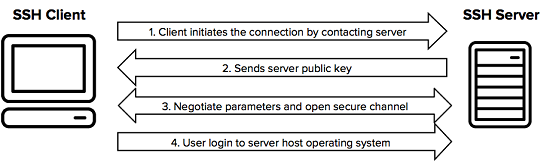
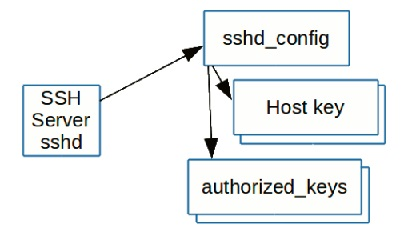
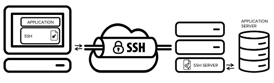
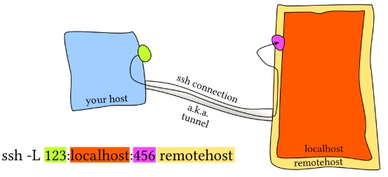
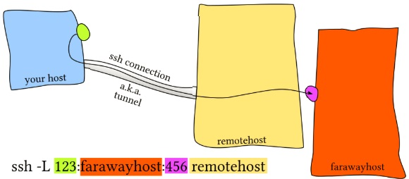
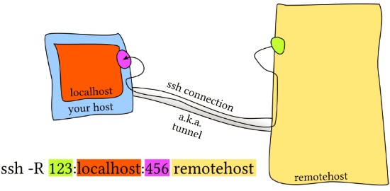
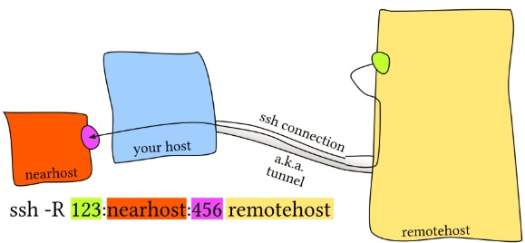
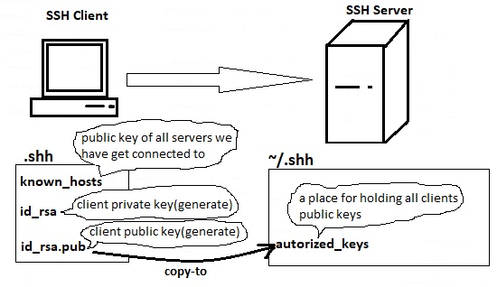

# 212.3 Secure shell \(SSH\)

**Weight:** 4

**Description:** Candidates should be able to configure and secure an SSH daemon. This objective includes managing keys and configuring SSH for users. Candidates should also be able to forward an application protocol over SSH and manage the SSH login.

**Key Knowledge Areas:**

* OpenSSH configuration files, tools and utilities
* Login restrictions for the superuser and the normal users
* Managing and using server and client keys to login with and without password
* Usage of multiple connections from multiple hosts to guard against loss of connection to remote host following configuration changes

**Terms and Utilities:**

* ssh
* sshd
* /etc/ssh/sshd\_config
* /etc/ssh/
* Private and public key files
* PermitRootLogin, PubKeyAuthentication, AllowUsers, PasswordAuthentication, Protocol

As an administrator we need deep knowledge about remote login protocols such as rlogin, rsh , telnet and ssh.

## Whats is SSH?

The SSH protocol \(also referred to as Secure Shell\) is a method for secure remote login from one computer to another. It provides several alternative options for strong authentication, and it protects the communications security and integrity with strong encryption. It is a secure alternative to the non-protected login protocols \(such as telnet, rlogin\) and insecure file transfer methods \(such as FTP\).

Typical uses of the SSH protocol are:

* providing secure access for users and automated processes
* interactive and automated file transfers
* issuing remote commands
* managing network infrastructure and other mission-critical system components.

## How does the ssh protocol work?

The way SSH works is by making use of a client-server model to allow for authentication of two remote systems and encryption of the data that passes between them.

SSH operates on TCP port 22 by default \(though this can be changed if needed\). The host \(server\) listens on port 22 \(or any other SSH assigned port\) for incoming connections.

SSH provides multiple mechanisms for authenticating the server and the client. Two of the commonly used authentication mechanism are password based, and key based authentication. Although password based authentication is also secure, its advisable to use key based authentication instead.



the connection is established by the SSH client connecting to the SSH server. The SSH client drives the connection setup process and uses public key cryptography to verify the identity of the SSH server. After the setup phase the SSH protocol uses strong symmetric encryption and hashing algorithms to ensure the privacy and integrity of the data that is exchanged between the client and server.

## What is OpenSSH?

OpenSSH is a free open source set of computer tools used to provide secure and encrypted communication over a computer network by using the ssh protocol. it is developed by the Open BSD group and it is released under Simplified BSD License. Open OpenSSH is so popular among system administrators because of its multi-platform capability and very useful nice features.


All communications and user credentials using OpenSSH are encrypted, they are also protected from man in the middle attacks. If a third party tries to intercept our connection, OpenSSH detects it and informs us about that.

Lets get started, We use CentOS7-1 as our server :

```text
[root@centos7-1 ~]# yum search openssh | grep -i server
openssh-server-sysvinit.x86_64 : The SysV initscript to manage the OpenSSH
                               : server.
gsi-openssh-server.x86_64 : SSH server daemon with GSI authentication
openssh-ldap.x86_64 : A LDAP support for open source SSH server daemon
openssh-server.x86_64 : An open source SSH server daemon
```

## /etc/ssh

OpenSSH has two different sets of configuration files: one for client programs \(ssh, scp, and sftp\) and one for the server daemon \(sshd\).

```text
[root@centos7-1 ~]# cd /etc/ss
ssh/  ssl/  sssd/ 
[root@centos7-1 ~]# cd /etc/ssh
[root@centos7-1 ssh]# ls -l
total 608
-rw-r--r--. 1 root root     581843 Apr 11 00:21 moduli
-rw-r--r--. 1 root root       2276 Apr 11 00:21 ssh_config
-rw-------. 1 root root       3905 Jun 10 04:54 sshd_config
-rw-------. 1 root root       3907 Apr 11 00:21 sshd_config.rpmnew
-rw-r-----. 1 root ssh_keys    227 Oct 28  2017 ssh_host_ecdsa_key
-rw-r--r--. 1 root root        162 Oct 28  2017 ssh_host_ecdsa_key.pub
-rw-r-----. 1 root ssh_keys    387 Oct 28  2017 ssh_host_ed25519_key
-rw-r--r--. 1 root root         82 Oct 28  2017 ssh_host_ed25519_key.pub
-rw-r-----. 1 root ssh_keys   1679 Oct 28  2017 ssh_host_rsa_key
-rw-r--r--. 1 root root        382 Oct 28  2017 ssh_host_rsa_key.pub
```

The`sshd_config`is the ssh  **daemon**\(or ssh server process\) configuration file, Whereas, the `ssh_config` file is the ssh client configuration file. The client configuration file only has bearing on when you use the ssh command to connect to another ssh host . As you can see there are public keys and private keys here with different algorithems and they can be used by SSH to encrypt the session.

### RELATIONSHIP OF CONFIGURATION FILES

The SSH server actually reads several configuration files. The sshd\_config file specifies the locations of one or more host key files \(mandatory\) and the location of authorized\_keys files for users. It may also refer to a number of other files.



## /etc/sshd\_config

The OpenSSH server reads a configuration file when it is started. Usually this file is /etc/ssh/sshd\_config:

```text
[root@centos7-1 ssh]# cat sshd_config
#    $OpenBSD: sshd_config,v 1.100 2016/08/15 12:32:04 naddy Exp $

# This is the sshd server system-wide configuration file.  See
# sshd_config(5) for more information.

# This sshd was compiled with PATH=/usr/local/bin:/usr/bin

# The strategy used for options in the default sshd_config shipped with
# OpenSSH is to specify options with their default value where
# possible, but leave them commented.  Uncommented options override the
# default value.

# If you want to change the port on a SELinux system, you have to tell
# SELinux about this change.
# semanage port -a -t ssh_port_t -p tcp #PORTNUMBER
#
#Port 22
#AddressFamily any
#ListenAddress 0.0.0.0
#ListenAddress ::

HostKey /etc/ssh/ssh_host_rsa_key
#HostKey /etc/ssh/ssh_host_dsa_key
HostKey /etc/ssh/ssh_host_ecdsa_key
HostKey /etc/ssh/ssh_host_ed25519_key

# Ciphers and keying
#RekeyLimit default none

# Logging
#SyslogFacility AUTH
SyslogFacility AUTHPRIV
#LogLevel INFO

# Authentication:

#LoginGraceTime 2m
PermitRootLogin yes
#StrictModes yes
#MaxAuthTries 6
#MaxSessions 10

#PubkeyAuthentication yes

# The default is to check both .ssh/authorized_keys and .ssh/authorized_keys2
# but this is overridden so installations will only check .ssh/authorized_keys
AuthorizedKeysFile    .ssh/authorized_keys

#AuthorizedPrincipalsFile none

#AuthorizedKeysCommand none
#AuthorizedKeysCommandUser nobody

# For this to work you will also need host keys in /etc/ssh/ssh_known_hosts
#HostbasedAuthentication no
# Change to yes if you don't trust ~/.ssh/known_hosts for
# HostbasedAuthentication
#IgnoreUserKnownHosts no
# Don't read the user's ~/.rhosts and ~/.shosts files
#IgnoreRhosts yes

# To disable tunneled clear text passwords, change to no here!
#PasswordAuthentication yes
#PermitEmptyPasswords no
PasswordAuthentication yes

# Change to no to disable s/key passwords
#ChallengeResponseAuthentication yes
ChallengeResponseAuthentication no

# Kerberos options
#KerberosAuthentication no
#KerberosOrLocalPasswd yes
#KerberosTicketCleanup yes
#KerberosGetAFSToken no
#KerberosUseKuserok yes

# GSSAPI options
GSSAPIAuthentication yes
GSSAPICleanupCredentials no
#GSSAPIStrictAcceptorCheck yes
#GSSAPIKeyExchange no
#GSSAPIEnablek5users no

# Set this to 'yes' to enable PAM authentication, account processing,
# and session processing. If this is enabled, PAM authentication will
# be allowed through the ChallengeResponseAuthentication and
# PasswordAuthentication.  Depending on your PAM configuration,
# PAM authentication via ChallengeResponseAuthentication may bypass
# the setting of "PermitRootLogin without-password".
# If you just want the PAM account and session checks to run without
# PAM authentication, then enable this but set PasswordAuthentication
# and ChallengeResponseAuthentication to 'no'.
# WARNING: 'UsePAM no' is not supported in Red Hat Enterprise Linux and may cause several
# problems.
UsePAM yes

#AllowAgentForwarding yes
#AllowTcpForwarding yes
#GatewayPorts no
X11Forwarding yes
#X11DisplayOffset 10
#X11UseLocalhost yes
#PermitTTY yes
#PrintMotd yes
#PrintLastLog yes
#TCPKeepAlive yes
#UseLogin no
#UsePrivilegeSeparation sandbox
#PermitUserEnvironment no
#Compression delayed
#ClientAliveInterval 0
#ClientAliveCountMax 3
#ShowPatchLevel no
#UseDNS no
#PidFile /var/run/sshd.pid
#MaxStartups 10:30:100
#PermitTunnel no
#ChrootDirectory none
#VersionAddendum none

# no default banner path
#Banner none

# Accept locale-related environment variables
AcceptEnv LANG LC_CTYPE LC_NUMERIC LC_TIME LC_COLLATE LC_MONETARY LC_MESSAGES
AcceptEnv LC_PAPER LC_NAME LC_ADDRESS LC_TELEPHONE LC_MEASUREMENT
AcceptEnv LC_IDENTIFICATION LC_ALL LANGUAGE
AcceptEnv XMODIFIERS

# override default of no subsystems
Subsystem    sftp    /usr/libexec/openssh/sftp-server

# Example of overriding settings on a per-user basis
#Match User anoncvs
#    X11Forwarding no
#    AllowTcpForwarding no
#    PermitTTY no
#    ForceCommand cvs server
```

lets talk about some of them:

**Port:** The port that the remote SSH daemon is running on. This option is only necessary if the remote SSH instance is not running on the default port 22.\(If you have a plan to change it do not forget about discretionary access controls. Like selinux or appa rmor \)

**SyslogFacility :** By default, the OpenSSH server logs to the AUTH facility of syslog.

* auth - is meant to log authentication and authorization related commands
* authpriv - is for non system authorization messages \(for security information of a sensitive nature\)

all logs are logged to /var/log/auth.log for debian based systems or /var/log/secure for RedHat CentOS based systems

**LogLevel:** By default OpenSSH logs at the INFO level. If we want to record more information \( such as failed login attempts\) we should increase the logging level to VERBOSE.

**PermitRootLogin :** Specifies whether root can log in over ssh or not . The argument could be:

* yes - root is allowed to log in.
* without-password - password authentication is disabled for root and root can only login using key pairs.
* forced-commands-only - root login with public key authentication will be allowed, but only if the `command`option has been specified \(which may be useful for taking remote backups even if root login is normally not allowed\). All other authentication methods are disabled for root.
* no - root is not allowed to log in.

**PubkeyAuthntication :** Lets people to loging just using ssh key files without entering password.

**PermitEmptyPassword :** Allow users with empty password get connected to our ssh server.

**PasswordAuthentication :** Of course we want ssh server authenticate users before lets them get connected, But if we like to force users to autheticate using their key pairs we can set it to No.

**Banner :** specify a text file based on what we like to be displayed when some one trys to ssh.

**PrintMotd :** Print a message after some one logs in.

**MaxAuthTries :** Specifies the maximum number of authentication attempts permitted per connection. Once the number of failures reaches half this value, additional failures are logged. It can be over write by PAM if any PAM modules is associated.

By default all users with user accounts can log in trough ssh, but there are two options which can be added to sshd\_config file in order to change the default behaviour:

**AllowUsers :** Specify user we like to let them log in trough ssh.\(No other user can login\)

**DenyUsers :** Avoid certain users to get login.

**ForwardX11 :** What is that ?

### What is SSH Tunneling / port forwarding ?

SSH tunneling is a method of transporting arbitrary networking data over an encrypted SSH connection. It can be used to add encryption to legacy applications. It can also be used to implement VPNs \(Virtual Private Networks\) and access intranet services across firewalls.

SSH is a standard for secure remote logins and file transfers over untrusted networks. It also provides a way to secure the data traffic of any given application using port forwarding, basically tunneling any TCP/IP port over SSH. This means that the application data traffic is directed to flow inside an encrypted SSH connection so that it cannot be eavesdropped or intercepted while it is in transit. SSH tunneling enables adding network security to legacy applications that do not natively support encryption.



so SSH port forwarding is a mechanism in SSH for tunneling application ports from the client machine to the server machine, or vice versa. some system administrators and IT professionals use it for opening backdoors into the internal network from their home machines. It can also be abused by hackers and malware to open access from the Internet to the internal network.

There are three types of SSH port forwarding:

* Local port forwarding - connections from an SSH client are forwarded, via the SSH server, to a destination server.





* Remote port forwarding - connections from an SSH server are forwarded, via the SSH client, to a destination server





* Dynamic port forwarding - connections from various programs are forwarded, via the SSH client to an SSH server, and finally to several destination servers.

Okey after this log explanation, lets go back to sshd\_config file options .

**X11Forwarding :** It lets us to run graphical programs remotely from the linux server. X11 forwarding needs to be enabled on both the client side and the server side. on the server side, On the server side,`X11Forwarding yes`must specified in `/etc/ssh/sshd_config` . On the client side, the`-X`\(capital X\) option to`ssh`enables X11 forwarding, and you can make this the default \(for all connections or for a specific conection\) with`ForwardX11 yes`in `~/.ssh/config`.

## /etc/ssh\_config

ssh\_config file has similar setting but its for ssh utilities, like scp, sftp. scp for secure copies and aftp for secure ftp.

```text
[root@centos7-1 ssh]# cat ssh_config 
#    $OpenBSD: ssh_config,v 1.30 2016/02/20 23:06:23 sobrado Exp $

# This is the ssh client system-wide configuration file.  See
# ssh_config(5) for more information.  This file provides defaults for
# users, and the values can be changed in per-user configuration files
# or on the command line.

# Configuration data is parsed as follows:
#  1. command line options
#  2. user-specific file
#  3. system-wide file
# Any configuration value is only changed the first time it is set.
# Thus, host-specific definitions should be at the beginning of the
# configuration file, and defaults at the end.

# Site-wide defaults for some commonly used options.  For a comprehensive
# list of available options, their meanings and defaults, please see the
# ssh_config(5) man page.

# Host *
#   ForwardAgent no
#   ForwardX11 no
#   RhostsRSAAuthentication no
#   RSAAuthentication yes
#   PasswordAuthentication yes
#   HostbasedAuthentication no
#   GSSAPIAuthentication no
#   GSSAPIDelegateCredentials no
#   GSSAPIKeyExchange no
#   GSSAPITrustDNS no
#   BatchMode no
#   CheckHostIP yes
#   AddressFamily any
#   ConnectTimeout 0
#   StrictHostKeyChecking ask
#   IdentityFile ~/.ssh/identity
#   IdentityFile ~/.ssh/id_rsa
#   IdentityFile ~/.ssh/id_dsa
#   IdentityFile ~/.ssh/id_ecdsa
#   IdentityFile ~/.ssh/id_ed25519
#   Port 22
#   Protocol 2
#   Cipher 3des
#   Ciphers aes128-ctr,aes192-ctr,aes256-ctr,arcfour256,arcfour128,aes128-cbc,3des-cbc
#   MACs hmac-md5,hmac-sha1,umac-64@openssh.com,hmac-ripemd160
#   EscapeChar ~
#   Tunnel no
#   TunnelDevice any:any
#   PermitLocalCommand no
#   VisualHostKey no
#   ProxyCommand ssh -q -W %h:%p gateway.example.com
#   RekeyLimit 1G 1h
#
# Uncomment this if you want to use .local domain
# Host *.local
#   CheckHostIP no

Host *
    GSSAPIAuthentication yes
# If this option is set to yes then remote X11 clients will have full access
# to the original X11 display. As virtually no X11 client supports the untrusted
# mode correctly we set this to yes.
    ForwardX11Trusted yes
# Send locale-related environment variables
    SendEnv LANG LC_CTYPE LC_NUMERIC LC_TIME LC_COLLATE LC_MONETARY LC_MESSAGES
    SendEnv LC_PAPER LC_NAME LC_ADDRESS LC_TELEPHONE LC_MEASUREMENT
    SendEnv LC_IDENTIFICATION LC_ALL LANGUAGE
    SendEnv XMODIFIERS
```

### ssh configuration files precedence

Do not forget that ssh client configuration file has precedence. The ssh program on a host receives its configuration from either the command line or from configuration files ~/.ssh/config and /etc/ssh/ssh\_config.

Command-line options take precedence over configuration files. The user-specific configuration file ~/.ssh/config is used next. Finally, the global /etc/ssh/ssh\_config file is used. The first obtained value for each configuration parameter will be used.

## Configuring SSH Key Based authentication

Till now we have understood how ssh works. As we mentioned when ssh connection is started, the public key of ssh server is tranfered to the client\(stored in ./ssh/known\_hosts\) and the client will use it to continue negotiation with the server and user will be required to get authenticated by sending username and password.

Its possible to omit entring user name and password and get connected to the ssh server using client public and private key.



Lets start by connecting to Centos7-1 from CentOS7-2 and see the keys:

```text
[user1@centos7-2 ~]$ ssh centos7-1
The authenticity of host 'centos7-1 (192.168.10.133)' can't be established.
ECDSA key fingerprint is SHA256:QtfM2iXh5pxZeFdAUXEBEnRXNSP40MWIhnSYvpOBMoY.
ECDSA key fingerprint is MD5:27:db:c1:d0:da:35:80:92:81:fa:8f:1c:e5:d7:f3:2e.
Are you sure you want to continue connecting (yes/no)? yes
Warning: Permanently added 'centos7-1,192.168.10.133' (ECDSA) to the list of known hosts.
user1@centos7-1's password: 
Last login: Sat Jul 28 03:34:33 2018
Managed by ansible
[user1@centos7-1 ~]$ exit
logout
Connection to centos7-1 closed.
```

```text
[user1@centos7-2 ~]$ cd .ssh/
[user1@centos7-2 .ssh]$ ls
known_hosts
[user1@centos7-2 .ssh]$ cat known_hosts 
centos7-1,192.168.10.133 ecdsa-sha2-nistp256 AAAAE2VjZHNhLXNoYTItbmlzdHAyNTYAAAAIbmlzdHAyNTYAAABBBKuy5+nza9QN5cqDE2E7jJLEdqDrIkOprS8n/HP7Cj3V31kx4rOShL61zjuevHROlt4niShqS1wy584SGBMmHgg=
```

Now lets generate public and private keys for client and copy client public key to the server, ssh-keygen - creates a key pair for public key authentication:

```text
[user1@centos7-2 .ssh]$ ssh-keygen
Generating public/private rsa key pair.
Enter file in which to save the key (/home/user1/.ssh/id_rsa): 
Enter passphrase (empty for no passphrase): 
Enter same passphrase again: 
Your identification has been saved in /home/user1/.ssh/id_rsa.
Your public key has been saved in /home/user1/.ssh/id_rsa.pub.
The key fingerprint is:
SHA256:2thZLmb/O+EAg5sWPNT2kiywZ+EbWpC2suZiiUcgKu4 user1@centos7-2
The key's randomart image is:
+---[RSA 2048]----+
|     . .         |
|    = o o        |
|   . O = o       |
|o . o % * .      |
|o. o = OS+.      |
|o + . == +. .    |
|++.  .o B .o .   |
|o+o    o o  o    |
|oE        ..oo   |
+----[SHA256]-----+
[user1@centos7-2 .ssh]$ ls
id_rsa  id_rsa.pub  known_hosts
[user1@centos7-2 .ssh]$ cat id_rsa.pub 
ssh-rsa AAAAB3NzaC1yc2EAAAADAQABAAABAQDJhDyHAb49NlI64qN6hLrRcE4AYm5CxXbmLiB214Ea46rBB5UlkrLvDyBO8pPMbpyIMmTco2B39N2BfvB3zyb7Ddu5v4KU9PzfrpUskYgFHjHGnnnCn5xY6/UCb+/bpIh/GlLCX3WZLtj6+9cA+J1h7UTRkSUNH4mVHqA2Esvx3YJJT/MrANurWUe4uFOwwvRy1IJT9XM9Z9RvRoYkm4Ughi1IJlq4qlgeXD6qOMCj6vbFLZvyaxG0cdtDItGGDGs8jj14306nt6a1qvJoLGVb7bV4GCISUgLa/Nf+N+ZtSGSdaqS5OkJ+RtYfZWJ8r+iaE+WXzYANh40n2/83+RFN user1@centos7-2
```

We haven't set passphrase in our demonstration but if we set we would be asked to enter it when we copy it to the server. any how. we use ssh-copy-id - configures a public key as authorized on a server :

```text
[user1@centos7-2 .ssh]$ ssh-copy-id -i id_rsa.pub user1@centos7-1
/bin/ssh-copy-id: INFO: Source of key(s) to be installed: "id_rsa.pub"
/bin/ssh-copy-id: INFO: attempting to log in with the new key(s), to filter out any that are already installed
/bin/ssh-copy-id: INFO: 1 key(s) remain to be installed -- if you are prompted now it is to install the new keys
user1@centos7-1's password: 

Number of key(s) added: 1

Now try logging into the machine, with:   "ssh 'user1@centos7-1'"
and check to make sure that only the key(s) you wanted were added.
```

ssh-copy-id might not be available in your distro, no problem you can copy the public in a way that you like:

```text
example : cat id_rsa.pub | ssh user1@centos7-1 'cat >> .ssh/authorized_keys'
```

Now lets take a look the server side:

```text
[user1@centos7-1 ~]$ cd .ssh/
[user1@centos7-1 .ssh]$ ls
authorized_keys
[user1@centos7-1 .ssh]$ cat authorized_keys 
ssh-rsa AAAAB3NzaC1yc2EAAAADAQABAAABAQDJhDyHAb49NlI64qN6hLrRcE4AYm5CxXbmLiB214Ea46rBB5UlkrLvDyBO8pPMbpyIMmTco2B39N2BfvB3zyb7Ddu5v4KU9PzfrpUskYgFHjHGnnnCn5xY6/UCb+/bpIh/GlLCX3WZLtj6+9cA+J1h7UTRkSUNH4mVHqA2Esvx3YJJT/MrANurWUe4uFOwwvRy1IJT9XM9Z9RvRoYkm4Ughi1IJlq4qlgeXD6qOMCj6vbFLZvyaxG0cdtDItGGDGs8jj14306nt6a1qvJoLGVb7bV4GCISUgLa/Nf+N+ZtSGSdaqS5OkJ+RtYfZWJ8r+iaE+WXzYANh40n2/83+RFN user1@centos7-2
```

now lets check the result from the client:

```text
[user1@centos7-2 .ssh]$ 
[user1@centos7-2 .ssh]$ ssh centos7-1
Last login: Sat Jul 28 03:37:53 2018 from 192.168.10.138
Managed by ansible
```

and it seems okey.We can copy and paste the keys for other users if you like, but do not forget that these keys give power to users to login with out the password.

### Why use passphrase? Why it is for?

We have configured a password less ssh connection using key based authentication. But what would hapenned if our system compromised? An evil hacker would be able to get connected to other servers using key based authentication without knowning the passwords.

Passphrase can help us to avoid this kinds of security issues by requiring a passphrase ath the begining of every ssh keybased authentication. So let clear previous authorized\_key, and start:

```text
[user1@centos7-1 .ssh]$ vim authorized_keys 
[user1@centos7-1 .ssh]$ cat authorized_keys
```

Now generate a new key pairs with passphrase on the client \(Let it over write current private and public key\):

```text
[user1@centos7-2 .ssh]$ ssh-keygen 
Generating public/private rsa key pair.
Enter file in which to save the key (/home/user1/.ssh/id_rsa): 
/home/user1/.ssh/id_rsa already exists.
Overwrite (y/n)? y
Enter passphrase (empty for no passphrase): 
Enter same passphrase again: 
Your identification has been saved in /home/user1/.ssh/id_rsa.
Your public key has been saved in /home/user1/.ssh/id_rsa.pub.
The key fingerprint is:
SHA256:UX/X1Kn95rTpPvEPJNTfSFpik0l0odnDaFZeBK6TmBQ user1@centos7-2
The key's randomart image is:
+---[RSA 2048]----+
|          E.o =+*|
|         . + # +o|
|        . . # & o|
|         o B @ *.|
|        S o * o +|
|             + .+|
|              .+=|
|               =o|
|              oo+|
+----[SHA256]-----+
[user1@centos7-2 .ssh]$ ls -l
total 12
-rw-------. 1 user1 user1 1766 Jul 29 02:15 id_rsa
-rw-r--r--. 1 user1 user1  397 Jul 29 02:15 id_rsa.pub
-rw-r--r--. 1 user1 user1  186 Jul 28 03:37 known_hosts
[user1@centos7-2 .ssh]$ cat id_rsa.pub 
ssh-rsa AAAAB3NzaC1yc2EAAAADAQABAAABAQC14333HmDgzDsdy7kRNklXPiNYF55ljyL/ma2A1ay/sS2KfX+M7BiWp99Utmx0H6eT/l0aqbQ/iSswC+ZGhpfScd6Hq5Gq1RX58Oy+dT1O6jlzEGbk402w/GyGRSNGOR2douZbta4joNwdDMSR+TtEdp65wpvosUcbEaa8zYVlrXD4n/jYmqQE95S7q0oPgD6eLFzsOsrjCvyH6mabIe0dzWhupw5OTdPGOpbw5uHZ/eRCUPzSw9Ex7dDB6yrjHefIYGpQ0wVooD/dVCMJQ7fHrLezvSzmIq9HAnLqVfnOlqIZosVTpiHbJ6gwV1ZxWtUD2bPmXQu0ZpntnBi6XT+/ user1@centos7-2
```

Now lets tranfer our new public key to the server:

```text
[user1@centos7-2 .ssh]$ ssh-copy-id -i id_rsa.pub user1@centos7-1
/bin/ssh-copy-id: INFO: Source of key(s) to be installed: "id_rsa.pub"
/bin/ssh-copy-id: INFO: attempting to log in with the new key(s), to filter out any that are already installed
/bin/ssh-copy-id: INFO: 1 key(s) remain to be installed -- if you are prompted now it is to install the new keys
user1@centos7-1's password: 

Number of key(s) added: 1

Now try logging into the machine, with:   "ssh 'user1@centos7-1'"
and check to make sure that only the key(s) you wanted were added.
```

Lets see the key we have copied on the server:

```text
[user1@centos7-1 .ssh]$ cat authorized_keys 
ssh-rsa AAAAB3NzaC1yc2EAAAADAQABAAABAQC14333HmDgzDsdy7kRNklXPiNYF55ljyL/ma2A1ay/sS2KfX+M7BiWp99Utmx0H6eT/l0aqbQ/iSswC+ZGhpfScd6Hq5Gq1RX58Oy+dT1O6jlzEGbk402w/GyGRSNGOR2douZbta4joNwdDMSR+TtEdp65wpvosUcbEaa8zYVlrXD4n/jYmqQE95S7q0oPgD6eLFzsOsrjCvyH6mabIe0dzWhupw5OTdPGOpbw5uHZ/eRCUPzSw9Ex7dDB6yrjHefIYGpQ0wVooD/dVCMJQ7fHrLezvSzmIq9HAnLqVfnOlqIZosVTpiHbJ6gwV1ZxWtUD2bPmXQu0ZpntnBi6XT+/ user1@centos7-2
```

Now when we ssh to the remote server \(CentOS7-1\) from our client\(CentOS7-2\), we are asked to enter our local key passphrase intead of remote user account password:

```text
[user1@centos7-2 .ssh]$ ssh centos7-1
Enter passphrase for key '/home/user1/.ssh/id_rsa': 
Last login: Sat Jul 28 04:15:00 2018 from 192.168.10.145
Managed by ansible
```

lets exit and ssh again and again:

```text
[user1@centos7-1 ~]$ exit
logout
Connection to centos7-1 closed.
[user1@centos7-2 .ssh]$ ssh centos7-1
Enter passphrase for key '/home/user1/.ssh/id_rsa': 
Last login: Sun Jul 29 02:22:34 2018 from 192.168.10.138
Managed by ansible
[user1@centos7-1 ~]$ exit
logout
Connection to centos7-1 closed.
[user1@centos7-2 .ssh]$ ssh centos7-1
Enter passphrase for key '/home/user1/.ssh/id_rsa': 
Last login: Sun Jul 29 02:43:07 2018 from 192.168.10.138
Managed by ansible
[user1@centos7-1 ~]$ exit
logout
Connection to centos7-1 closed.
```

as you can see each time we are asked to enter passphrase and that was what we were seeking for inorder to stop a hacker if our system get compromised. There is way to stick passphrase to the current user session and keept if for next ssh connections inorder to avoid entering passphrase again and again:

* **ssh-agent** - agent to hold private key for single sign-on
* **ssh-add** - tool to add a key to the agent

```text
[user1@centos7-2 .ssh]$ ssh-agent /bin/bash
[user1@centos7-2 .ssh]$ ssh-add 
Enter passphrase for /home/user1/.ssh/id_rsa: 
Identity added: /home/user1/.ssh/id_rsa (/home/user1/.ssh/id_rsa)
[user1@centos7-2 .ssh]$ ssh centos7-1
Last login: Sun Jul 29 02:43:15 2018 from 192.168.10.138
Managed by ansible
```

And it could happend again and agian :

```text
[user1@centos7-1 ~]$ exit
logout
Connection to centos7-1 closed.
[user1@centos7-2 .ssh]$ ssh centos7-1
Last login: Sun Jul 29 02:54:43 2018 from 192.168.10.138
Managed by ansible
[user1@centos7-1 ~]$ exit
logout
Connection to centos7-1 closed.
[user1@centos7-2 .ssh]$ ssh centos7-1
Last login: Sun Jul 29 02:58:39 2018 from 192.168.10.138
Managed by ansible
[user1@centos7-1 ~]$ exit
logout
Connection to centos7-1 closed.
```

Until we exit from the bash that uses associated key with that:

```text
[user1@centos7-2 .ssh]$ exit
exit
[user1@centos7-2 .ssh]$ ssh centos7-1
Enter passphrase for key '/home/user1/.ssh/id_rsa':
```

we would need to enter passphrase again.

## SSH Client tools

Here we want to take a look at most usefull client tools\(ssh, scp, sftp\) commands:

| SSH commands | Description |
| :--- | :--- |
| ssh -V | Shows ssh client version |
| ssh user1@server1.example.com | Connect to the remote host, add "-v" for verbose mode |
| ssh -l user1 server1.example.com | Connect to the remote host, add "-v" for verbose mode. |
| ssh user1@server1.example.com &lt;command&gt; | Running &lt;command&gt; on the remote host over ssh |
| ssh -X user@server1.example.com | Enable Xforwarding on the clients side,  X11Forwarding should be enabled on the server side in sshd\_config file. |

### SCP Commands

We can use the scp command to copy the files securely between the local host and remote host using the ssh authentication.

* Copy file from the localhost to the remotehost:

```text
scp localhostfile.txt user1@remotehost.example.com:/home/user1/localhostfile.txt
```

* Copy file from the remotehost to the localhost:

```text
scp user1@remotehost.example.com:/home/user1/remotehostfile.txt remotehostfile.txt
```

### sftp commands

SFTP \(SSH File Transfer Protocol\) is a secure file transfer protocol. It runs over the SSH protocol. It supports the full security and authentication functionality of SSH.

| sftp commands | Desciption |
| :--- | :--- |
| sftp user1@server1.example.com | get connected to the sftp server |
| sftp&gt; ? | getting help |
| sftp&gt; lpwd | Check Present Working Directory |
| sftp&gt;ls | Listing files and directories in remote system |
| sftp&gt;lls | Listing files and directories in local |
| sftp&gt; put local.profile | upload file |
| sftp&gt; mput \*.txt | upload multiple files |
| sftp&gt; get myfile.txt | get a single file |
| sftp&gt; mget \*.txt | get multiple files |
| sftp&gt; cd testdir | switching directory on remote |
| sftp&gt; lcd test | switching directory in local |
| sftp&gt; mkdir mytestdir | creates directory on remote system |
| sftp&gt; lmkdir mydownloads | creates  directory on local machine |
| sftp &gt; rm mytempfile.txt | remove file |
| sftp&gt; rmdir myremotedir | remove directory |
| sftp&gt; ! | exit sftp shell |

Sources and additional usefull links: [https://www.ssh.com/ssh/protocol/](https://www.ssh.com/ssh/protocol/) , [https://www.ssh.com/ssh/tunneling/](https://www.ssh.com/ssh/tunneling/) , [https://www.ssh.com/ssh/authorized\_keys/](https://www.ssh.com/ssh/authorized_keys/) , [https://www.ssh.com/ssh/command/](https://www.ssh.com/ssh/command/) , [https://www.ssh.com/ssh/agent](https://www.ssh.com/ssh/agent) , [https://www.ssh.com/ssh/add](https://www.ssh.com/ssh/add) , ... .

[ https://unix.stackexchange.com/questions/115897/whats-ssh-port-forwarding-and-whats-the-difference-between-ssh-local-and-remot](https://unix.stackexchange.com/questions/115897/whats-ssh-port-forwarding-and-whats-the-difference-between-ssh-local-and-remot)

