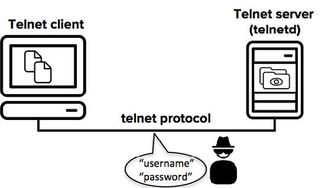

# 212.4. Security tasks

**Weight:** 3

**Description:** Candidates should be able to receive security alerts from various sources, install, configure and run intrusion detection systems and apply security patches and bugfixes.

**Key Knowledge Areas:**

* Tools and utilities to scan and test ports on a server
* Locations and organizations that report security alerts as Bugtraq, CERT or other sources
* Tools and utilities to implement an intrusion detection system \(IDS\)
* Awareness of OpenVAS and Snort

**Terms and Utilities:**

* telnet
* nmap
* fail2ban
* nc
* iptables

Talking about Linux security can be subject of a full course. Many Linux Security titles are covered in LPIC3 303 exam but for now we just discuss about what we are required to pass LPIC2 exam.

### What we can do for system security?

**Updates :**

We should keep our system\(s\) updated. Daily updates is recommended but in busy production environment it might be posteponed. Do not forget updates, keeping our critical remote access systems updated weekly is a must. Subscribing to third party systems that can provide security information is also important

**Monitoring**

We can gain valuable information of our system by doing periodic manual audits, but that is not something we can always rely on. Having automated monitoring of key systems is a must.

**Security tools**

There are some embeded security tool, some of them are free and some others cost mony.

* nmap
* nc
* telnet 
* iptables
* fail2ban
* snort
* openVAS

Lets start with updates and where we can gain information about lates Security Vulnerability and issues.There are some websites and organizations which we can gain valuable information from them:

### CERT \([http://www.cert.org](2124-security-tasks.md#cert-httpwwwcertorg)\)

* Computer Emergency response Team \(specifically the CERT Coordination Center or CRET-CC is located at Carnegie Mellon University  \)
* Provides tools for vulnerability assessments and analysis including comprehensive list of known vulnerabilities and attack vectors.
* Often found working with goverments organizations or private institutions regarding computer security policy issues.

### US-CERT [\(http://www.us-cert.gov](2124-security-tasks.md#us-cert-httpwwwus-certgov)\)

* United States- Computer Emergency Response Team
* Provides classified governments responses to computer security incidents.
* Works with the CERT-CC on computer policy issues.

### BugTraq \(mailing list hosted by [http://www.securityfocous.com](2124-security-tasks.md#bugtraq-mailing-list-in-httpwwwsecurityfocouscom)\)

* this is a subscription based e-mail list.
* Created and paid for by the _Security Focous Organization_.
* This list is a moderated \(and very detailed list\) for the discussion of \(and announcements of new\) security vulnerabilities.
* This list provides details on vulnerabilities as they are discovered and reported, including what is affected \(versions, types, devices and operating systems\), what the vulnerability is and any known attack vectors.

We have already talked about nmap and nc in previous courses, so lets just have a quick review of them here and show some related examples of them.

## nc

netcat \(or nc in short\) is a powerful and easy-to-use utility that can be employed for just about anything in Linux in relation to TCP, UDP, or UNIX-domain sockets.

We have used it to: open TCP connections, listen on arbitrary TCP and UDP ports, send packets, and port scanning which we review here.

By using netcat we can check if a single or multiple or a range of open ports exist in our system\(We use Ubuntu16.04 here\):

```text
root@server1:~# nc -zv localhost 21-29
Connection to localhost 21 port [tcp/ftp] succeeded!
nc: connect to localhost port 22 (tcp) failed: Connection refused
nc: connect to localhost port 23 (tcp) failed: Connection refused
nc: connect to localhost port 24 (tcp) failed: Connection refused
nc: connect to localhost port 25 (tcp) failed: Connection refused
nc: connect to localhost port 26 (tcp) failed: Connection refused
nc: connect to localhost port 27 (tcp) failed: Connection refused
nc: connect to localhost port 28 (tcp) failed: Connection refused
nc: connect to localhost port 29 (tcp) failed: Connection refused
```

`-z`sets nc to simply scan for listening daemons, without actually sending any data to them. `-v` enables verbose mode. netcat can be used for port scanning under both IPv4 and IPv6 protocols.

## nmap

We have discussed about nmap but as a review, nmap is an open source and a very usefull tool for Linux system/network administrators. Nmap is used for exploring networks, perform security scans, network audit and finding open ports on remote machine. It scans for Live hosts, Operating systems, packet filters and open ports running on remote hosts.

```text
root@server1:~# nmap -v -r  192.168.10.128,138

Starting Nmap 7.01 ( https://nmap.org ) at 2018-07-31 03:02 PDT
Initiating ARP Ping Scan at 03:02
Scanning 192.168.10.138 [1 port]
Completed ARP Ping Scan at 03:02, 0.20s elapsed (1 total hosts)
Initiating Parallel DNS resolution of 1 host. at 03:02
Completed Parallel DNS resolution of 1 host. at 03:02, 0.14s elapsed
Initiating SYN Stealth Scan at 03:02
Scanning example.com (192.168.10.128) [1000 ports]
Discovered open port 21/tcp on 192.168.10.128
Completed SYN Stealth Scan at 03:02, 1.60s elapsed (1000 total ports)
Nmap scan report for example.com (192.168.10.128)
Host is up (0.0000080s latency).
Not shown: 999 closed ports
PORT   STATE SERVICE
21/tcp open  ftp

Initiating SYN Stealth Scan at 03:02
Scanning 192.168.10.138 [1000 ports]
Discovered open port 22/tcp on 192.168.10.138
Discovered open port 80/tcp on 192.168.10.138
Completed SYN Stealth Scan at 03:02, 14.28s elapsed (1000 total ports)
Nmap scan report for 192.168.10.138
Host is up (-0.0062s latency).
Not shown: 998 filtered ports
PORT   STATE SERVICE
22/tcp open  ssh
80/tcp open  http
MAC Address: 00:0C:29:7A:7F:7B (VMware)

Read data files from: /usr/bin/../share/nmap
Nmap done: 2 IP addresses (2 hosts up) scanned in 16.29 seconds
           Raw packets sent: 4041 (177.772KB) | Rcvd: 2147 (90.800KB)
```

`-v` option is giving more detailed information about the remote machine.`-r` Scan Ports Consecutively and doesn’t randomize.

## telnet

Telnet is a user command and an underlying TCP/IP protocol for accessing remote computers. Through Telnet, an administrator or another user can access someone else's computer remotely. On the Web, HTTP and FTP protocols allow us to request specific files from remote computers, but not to actually be logged on as a user of that computer. With Telnet, we log on as a regular user with whatever privileges you may have been granted to the specific application and data on that computer.

Telnet is one of the earliest remote login protocols on the Internet. It was initally released in the early days of IP networking in 1969, and was for a long time the default way to access remote networked computers. It is a client-server protocol that provides the user a terminal session to the remote host from the telnet client application. Since the protocol provides no built-in security measures, it suffers from serious security issues that have limited its usefulness in environments where the network cannot be fully trusted. The use of Telnet over the public Internet should be avoided due to the risk of eavesdropping.

The most usage of telnet command is for testing perposes:

```text
[root@centos7-2 ~]# telnet 192.168.10.128 21 
Trying 192.168.10.128...
Connected to 192.168.10.128.
Escape character is '^]'.
220---------- Welcome to Pure-FTPd [privsep] [TLS] ----------
220-You are user number 1 of 50 allowed.
220-Local time is now 04:38. Server port: 21.
220-This is a private system - No anonymous login
220-IPv6 connections are also welcome on this server.
220 You will be disconnected after 15 minutes of inactivity.
```

### TELNET security problems

The Telnet session between the client and the server is not encrypted. Anyone with access to the TCP/IP packet flow between the communicating hosts can reconstruct the data that flows between the endpoints and read the messaging, including the usernames and passwords that are used to log in to the remote machine. This network attack requires very little expertise and can be performed with network debugging tools that are readily available.



Packet sniffing attacks like the above were the underlying reason for developing SSH, and they were the most common security problem on the Internet already in the mid-1990s.

### replace insecureTELNET with secure shell\(SSH\)

SSH \(Secure Shell\) provides a secure alternative to Telnet. SSH protects user identities, passwords, and data from network snooping attacks, and allows secure logins and file transfers.

SSH has practically replaced Telnet, and the older protocol is used these days only in rare cases to access decades old legacy equipment that does not support more modern protocols. And there are still organizations that simply do not care about security.

For Unix and Linux operating systems, the OpenSSH implementation comes free with the operating system and can be used to replace Telnet.\(see the previous course\).

## fail2ban

Fail2ban is a log-parsing application that monitors system logs for symptoms of an automated attack on our server. When an attempted compromise is located, using the defined parameters, Fail2ban will add a new rule to iptables to block the IP address of the attacker, either for a set amount of time or permanently. Fail2ban can also alert us Fail2ban is primarily focused on SSH attacks, although it can be further configured to work for any service that uses log files and can be subject to a compromise.through email that an attack is occurring.


Fail2ban is primarily focused on SSH attacks, although it can be further configured to work for any service that uses log files and can be subject to a compromise. Lets install it \(Ubuntu\):

```text
root@server1:~# apt search fail2ban
Sorting... Done
Full Text Search... Done
fail2ban/xenial,xenial 0.9.3-1 all
  ban hosts that cause multiple authentication errors

roundcube-plugins-extra/xenial,xenial 1.1.3-20151025 all
  skinnable AJAX based webmail solution - extra plugins

root@server1:~# apt install fail2ban

root@server1:/etc/fail2ban# systemctl status fail2ban
● fail2ban.service - Fail2Ban Service
   Loaded: loaded (/lib/systemd/system/fail2ban.service; enabled; vendor preset:
   Active: active (running) since Sat 2018-08-04 21:00:57 PDT; 5h 1min ago
     Docs: man:fail2ban(1)
 Main PID: 11717 (fail2ban-server)
   CGroup: /system.slice/fail2ban.service
           └─11717 /usr/bin/python3 /usr/bin/fail2ban-server -s /var/run/fail2ba

Aug 04 21:00:56 server1 systemd[1]: Starting Fail2Ban Service...
Aug 04 21:00:57 server1 fail2ban-client[11714]: 2018-08-04 21:00:57,001 fail2ban
Aug 04 21:00:57 server1 fail2ban-client[11714]: 2018-08-04 21:00:57,002 fail2ban
Aug 04 21:00:57 server1 systemd[1]: Started Fail2Ban Service.
```

## fail2ban configuration files

The fail2ban service keeps its configuration files in the`/etc/fail2ban`directory.

```text
root@server1:~# cd /etc/fail2ban/
root@server1:/etc/fail2ban# ls -l
total 48
drwxr-xr-x 2 root root  4096 Aug  4 21:00 action.d
-rw-r--r-- 1 root root  2328 Jul 31  2015 fail2ban.conf
drwxr-xr-x 2 root root  4096 Aug  2  2015 fail2ban.d
drwxr-xr-x 3 root root  4096 Aug  4 21:00 filter.d
-rw-r--r-- 1 root root 18562 Jul 31  2015 jail.conf
drwxr-xr-x 2 root root  4096 Aug  4 21:00 jail.d
-rw-r--r-- 1 root root  1939 Jul 31  2015 paths-common.conf
-rw-r--r-- 1 root root   642 Jul 31  2015 paths-debian.conf
```

Fail2ban reads `.conf` configuration files first, then`.local`files override any settings. Because of this, all changes to the configuration are generally done in `.local`files, leaving the `.conf` files untouched.

### Configure fail2ban.local

`fail2ban.conf` contains the default configuration profile. The default settings will give us a reasonable working setup. If we want to make any changes, it’s best to do it in a separate file,`fail2ban.local`, which overrides`fail2ban.conf`. Rename a copy`fail2ban.conf`to`fail2ban.local`.

```text
root@server1:/etc/fail2ban# cp fail2ban.conf fail2ban.local
```

```text
root@server1:/etc/fail2ban# cat fail2ban.conf 
# Fail2Ban main configuration file
#
# Comments: use '#' for comment lines and ';' (following a space) for inline comments
#
# Changes:  in most of the cases you should not modify this
#           file, but provide customizations in fail2ban.local file, e.g.:
#
# [Definition]
# loglevel = DEBUG
#

[Definition]

# Option: loglevel
# Notes.: Set the log level output.
#         CRITICAL
#         ERROR
#         WARNING
#         NOTICE
#         INFO
#         DEBUG
# Values: [ LEVEL ]  Default: ERROR
#
loglevel = INFO

# Option: logtarget
# Notes.: Set the log target. This could be a file, SYSLOG, STDERR or STDOUT.
#         Only one log target can be specified.
#         If you change logtarget from the default value and you are
#         using logrotate -- also adjust or disable rotation in the
#         corresponding configuration file
#         (e.g. /etc/logrotate.d/fail2ban on Debian systems)
# Values: [ STDOUT | STDERR | SYSLOG | FILE ]  Default: STDERR
#
logtarget = /var/log/fail2ban.log

# Option: syslogsocket
# Notes: Set the syslog socket file. Only used when logtarget is SYSLOG
#        auto uses platform.system() to determine predefined paths
# Values: [ auto | FILE ]  Default: auto
syslogsocket = auto

# Option: socket
# Notes.: Set the socket file. This is used to communicate with the daemon. Do
#         not remove this file when Fail2ban runs. It will not be possible to
#         communicate with the server afterwards.
# Values: [ FILE ]  Default: /var/run/fail2ban/fail2ban.sock
#
socket = /var/run/fail2ban/fail2ban.sock

# Option: pidfile
# Notes.: Set the PID file. This is used to store the process ID of the
#         fail2ban server.
# Values: [ FILE ]  Default: /var/run/fail2ban/fail2ban.pid
#
pidfile = /var/run/fail2ban/fail2ban.pid

# Options: dbfile
# Notes.: Set the file for the fail2ban persistent data to be stored.
#         A value of ":memory:" means database is only stored in memory 
#         and data is lost when fail2ban is stopped.
#         A value of "None" disables the database.
# Values: [ None :memory: FILE ] Default: /var/lib/fail2ban/fail2ban.sqlite3
dbfile = /var/lib/fail2ban/fail2ban.sqlite3

# Options: dbpurgeage
# Notes.: Sets age at which bans should be purged from the database
# Values: [ SECONDS ] Default: 86400 (24hours)
dbpurgeage = 86400
```

### Configuring jail.local Settings

The`jail.conf`file will enable Fail2ban for SSH by default for Debian and Ubuntu, but not CentOS. All other protocols and configurations \(HTTP, FTP, etc.\) are commented out. If we want to change this, we should create a`jail.local`for editing:

```text
root@server1:/etc/fail2ban# cp jail.conf jail.local
```

as `jail.conf` has is a big configuration file, we just take a look at general configurations and ssh related ones:

```text
root@server1:/etc/fail2ban# cat jail.conf 

#
# WARNING: heavily refactored in 0.9.0 release.  Please review and
#          customize settings for your setup.
#
# Changes:  in most of the cases you should not modify this
#           file, but provide customizations in jail.local file,
#           or separate .conf files under jail.d/ directory, e.g.:
#
# HOW TO ACTIVATE JAILS:
#
# YOU SHOULD NOT MODIFY THIS FILE.
#
# It will probably be overwritten or improved in a distribution update.
#
# Provide customizations in a jail.local file or a jail.d/customisation.local.
# For example to change the default bantime for all jails and to enable the
# ssh-iptables jail the following (uncommented) would appear in the .local file.
# See man 5 jail.conf for details.
#
# [DEFAULT]
# bantime = 3600
#
# [sshd]
# enabled = true
#
# See jail.conf(5) man page for more information


# Comments: use '#' for comment lines and ';' (following a space) for inline comments


[INCLUDES]

#before = paths-distro.conf
before = paths-debian.conf

# The DEFAULT allows a global definition of the options. They can be overridden
# in each jail afterwards.

[DEFAULT]

#
# MISCELLANEOUS OPTIONS
#

# "ignoreip" can be an IP address, a CIDR mask or a DNS host. Fail2ban will not
# ban a host which matches an address in this list. Several addresses can be
# defined using space separator.
ignoreip = 127.0.0.1/8

# External command that will take an tagged arguments to ignore, e.g. <ip>,
# and return true if the IP is to be ignored. False otherwise.
#
# ignorecommand = /path/to/command <ip>
ignorecommand =

# "bantime" is the number of seconds that a host is banned.
bantime  = 600

# A host is banned if it has generated "maxretry" during the last "findtime"
# seconds.
findtime  = 600

# "maxretry" is the number of failures before a host get banned.
maxretry = 5

# "backend" specifies the backend used to get files modification.
# Available options are "pyinotify", "gamin", "polling", "systemd" and "auto".
# This option can be overridden in each jail as well.
#
# pyinotify: requires pyinotify (a file alteration monitor) to be installed.
#              If pyinotify is not installed, Fail2ban will use auto.
# gamin:     requires Gamin (a file alteration monitor) to be installed.
#              If Gamin is not installed, Fail2ban will use auto.
# polling:   uses a polling algorithm which does not require external libraries.
# systemd:   uses systemd python library to access the systemd journal.
#              Specifying "logpath" is not valid for this backend.
#              See "journalmatch" in the jails associated filter config
# auto:      will try to use the following backends, in order:
#              pyinotify, gamin, polling.
#
# Note: if systemd backend is choses as the default but you enable a jail
#       for which logs are present only in its own log files, specify some other
#       backend for that jail (e.g. polling) and provide empty value for
#       journalmatch. See https://github.com/fail2ban/fail2ban/issues/959#issuecomment-74901200
backend = auto

# "usedns" specifies if jails should trust hostnames in logs,
#   warn when DNS lookups are performed, or ignore all hostnames in logs
#
# yes:   if a hostname is encountered, a DNS lookup will be performed.
# warn:  if a hostname is encountered, a DNS lookup will be performed,
#        but it will be logged as a warning.
# no:    if a hostname is encountered, will not be used for banning,
#        but it will be logged as info.
usedns = warn

# "logencoding" specifies the encoding of the log files handled by the jail
#   This is used to decode the lines from the log file.
#   Typical examples:  "ascii", "utf-8"
#
#   auto:   will use the system locale setting
logencoding = auto

# "enabled" enables the jails.
#  By default all jails are disabled, and it should stay this way.
#  Enable only relevant to your setup jails in your .local or jail.d/*.conf
#
# true:  jail will be enabled and log files will get monitored for changes
# false: jail is not enabled
enabled = false


# "filter" defines the filter to use by the jail.
#  By default jails have names matching their filter name
#
filter = %(__name__)s


#
# ACTIONS
#

# Some options used for actions

# Destination email address used solely for the interpolations in
# jail.{conf,local,d/*} configuration files.
destemail = root@localhost

# Sender email address used solely for some actions
sender = root@localhost

# E-mail action. Since 0.8.1 Fail2Ban uses sendmail MTA for the
# mailing. Change mta configuration parameter to mail if you want to
# revert to conventional 'mail'.
mta = sendmail

# Default protocol
protocol = tcp

# Specify chain where jumps would need to be added in iptables-* actions
chain = INPUT

# Ports to be banned
# Usually should be overridden in a particular jail
port = 0:65535

#
# Action shortcuts. To be used to define action parameter

# Default banning action (e.g. iptables, iptables-new,
# iptables-multiport, shorewall, etc) It is used to define
# action_* variables. Can be overridden globally or per
# section within jail.local file
banaction = iptables-multiport

# The simplest action to take: ban only
action_ = %(banaction)s[name=%(__name__)s, bantime="%(bantime)s", port="%(port)s", protocol="%(protocol)s", chain="%(chain)s"]

# ban & send an e-mail with whois report to the destemail.
action_mw = %(banaction)s[name=%(__name__)s, bantime="%(bantime)s", port="%(port)s", protocol="%(protocol)s", chain="%(chain)s"]
            %(mta)s-whois[name=%(__name__)s, dest="%(destemail)s", protocol="%(protocol)s", chain="%(chain)s"]

# ban & send an e-mail with whois report and relevant log lines
# to the destemail.
action_mwl = %(banaction)s[name=%(__name__)s, bantime="%(bantime)s", port="%(port)s", protocol="%(protocol)s", chain="%(chain)s"]
             %(mta)s-whois-lines[name=%(__name__)s, dest="%(destemail)s", logpath=%(logpath)s, chain="%(chain)s"]

# See the IMPORTANT note in action.d/xarf-login-attack for when to use this action
#
# ban & send a xarf e-mail to abuse contact of IP address and include relevant log lines
# to the destemail.
action_xarf = %(banaction)s[name=%(__name__)s, bantime="%(bantime)s", port="%(port)s", protocol="%(protocol)s", chain="%(chain)s"]
             xarf-login-attack[service=%(__name__)s, sender="%(sender)s", logpath=%(logpath)s, port="%(port)s"]

# ban IP on CloudFlare & send an e-mail with whois report and relevant log lines
# to the destemail.
action_cf_mwl = cloudflare[cfuser="%(cfemail)s", cftoken="%(cfapikey)s"]
                %(mta)s-whois-lines[name=%(__name__)s, dest="%(destemail)s", logpath=%(logpath)s, chain="%(chain)s"]

# Report block via blocklist.de fail2ban reporting service API
# 
# See the IMPORTANT note in action.d/blocklist_de.conf for when to
# use this action. Create a file jail.d/blocklist_de.local containing
# [Init]
# blocklist_de_apikey = {api key from registration]
#
action_blocklist_de  = blocklist_de[email="%(sender)s", service=%(filter)s, apikey="%(blocklist_de_apikey)s"]

# Report ban via badips.com, and use as blacklist
#
# See BadIPsAction docstring in config/action.d/badips.py for
# documentation for this action.
#
# NOTE: This action relies on banaction being present on start and therefore
# should be last action defined for a jail.
#
action_badips = badips.py[category="%(name)s", banaction="%(banaction)s"]

# Choose default action.  To change, just override value of 'action' with the
# interpolation to the chosen action shortcut (e.g.  action_mw, action_mwl, etc) in jail.local
# globally (section [DEFAULT]) or per specific section
action = %(action_)s


#
# JAILS
#

#
# SSH servers
#

[sshd]

port    = ssh
logpath = %(sshd_log)s


[sshd-ddos]
# This jail corresponds to the standard configuration in Fail2ban.
# The mail-whois action send a notification e-mail with a whois request
# in the body.
port    = ssh
logpath = %(sshd_log)s


[dropbear]

port     = ssh
logpath  = %(dropbear_log)s


[selinux-ssh]

port     = ssh
logpath  = %(auditd_log)s
maxretry = 5
```

**Ban Time and Retry Amount:**

* ignoreip : To ignore specific IPs, add them to the`ignoreip`line. By default, this command will not ban the localhost
* bantime: The length of time in seconds for which an IP is banned. If set to a negative number, the ban will be permanent. The default value of`600`is set to ban an IP for a 10-minute duration.
* findtime: The length of time between login attempts before a ban is set. For example, if Fail2ban is set to ban an IP after five \(5\) failed log-in attempts, those 5 attempts must occur within the set 10-minute`findtime`limit. The`findtime`value should be a set number of seconds.
* maxretry: How many attempts can be made to access the server from a single IP before a ban is imposed. The default is set to 3.

**email alerts:**

* destemail: The email address where you would like to receive the emails.
* sendername: The name under which the email shows up.
* sender: The email address from which Fail2ban will send emails.

### Service specified Jail Configurations

* enabled: Determines whether or not the filter is turned on.
* port: The port Fail2ban should be referencing in regards to the service. If using the default port, then the service name can be placed here. If using a non-traditional port, this should be the port number. For example, if we move our SSH port to 3456, ew would replace`ssh`with`3456`.
* filter: The name of the file located in`/etc/fail2ban/filter.d`that contains the failregex information used to parse log files appropriately. The`.conf`suffix need not be included.
* logpath: Gives the location of the service’s logs.
* maxretry: Will override the global`maxretry`for the defined service.`findtime`and`bantime`can also be added.
* action: This can be added as an additional setting, if the default action is not suitable for the jail. Additional actions can be found in the`action.d`folder.

### Failregexs

Although Fail2ban comes with a number of filters, you may want to further customize these filters or create your own to suit your needs. Fail2ban uses regular expressions \(regex\) to parse log files, looking for instances of attempted break-ins and password failures. Fail2ban uses Python’s regex extensions.

```text
root@server1:/etc/fail2ban# ls
action.d       fail2ban.d      filter.d   jail.d      paths-common.conf
fail2ban.conf  fail2ban.local  jail.conf  jail.local  paths-debian.conf
root@server1:/etc/fail2ban# cd filter.d/
root@server1:/etc/fail2ban/filter.d# ls
3proxy.conf                exim.conf             postfix-sasl.conf
apache-auth.conf           exim-spam.conf        proftpd.conf
apache-badbots.conf        freeswitch.conf       pure-ftpd.conf
apache-botsearch.conf      froxlor-auth.conf     qmail.conf
apache-common.conf         groupoffice.conf      recidive.conf
apache-fakegooglebot.conf  gssftpd.conf          roundcube-auth.conf
apache-modsecurity.conf    guacamole.conf        selinux-common.conf
apache-nohome.conf         horde.conf            selinux-ssh.conf
apache-noscript.conf       ignorecommands        sendmail-auth.conf
apache-overflows.conf      kerio.conf            sendmail-reject.conf
apache-pass.conf           lighttpd-auth.conf    sieve.conf
apache-shellshock.conf     monit.conf            sogo-auth.conf
assp.conf                  mysqld-auth.conf      solid-pop3d.conf
asterisk.conf              nagios.conf           squid.conf
botsearch-common.conf      named-refused.conf    squirrelmail.conf
common.conf                nginx-botsearch.conf  sshd.conf
counter-strike.conf        nginx-http-auth.conf  sshd-ddos.conf
courier-auth.conf          nsd.conf              stunnel.conf
courier-smtp.conf          openwebmail.conf      suhosin.conf
cyrus-imap.conf            oracleims.conf        tine20.conf
directadmin.conf           pam-generic.conf      uwimap-auth.conf
dovecot.conf               perdition.conf        vsftpd.conf
dropbear.conf              php-url-fopen.conf    webmin-auth.conf
drupal-auth.conf           portsentry.conf       wuftpd.conf
ejabberd-auth.conf         postfix.conf          xinetd-fail.conf
exim-common.conf           postfix-rbl.conf
```

as you can there are sshd.conf and sshd-ddos.conf which are related to ssh service. Lets chek it in action, we ssh to ubuntu server1 from buntu server2 and enter many bad passwords:

```text
root@server2:~# ssh user1@192.168.10.129 
user1@192.168.10.129's password: 
Permission denied, please try again.
user1@192.168.10.129's password: 
Permission denied, please try again.
user1@192.168.10.129's password: 
Permission denied (publickey,password).
root@server2:~# ssh user1@192.168.10.129 
user1@192.168.10.129's password: 
Permission denied, please try again.
user1@192.168.10.129's password: 
Permission denied, please try again.
user1@192.168.10.129's password: 
Permission denied (publickey,password).
root@server2:~# ssh user1@192.168.10.129 
user1@192.168.10.129's password: 
Permission denied, please try again.
user1@192.168.10.129's password: 


asdasd

asd
asd

asdasd^C
root@server2:~# ssh user1@192.168.10.129 
ssh: connect to host 192.168.10.129 port 22: Connection refused
```

Wow lets see what fail2ban has been done:

```text
root@server1:/etc/fail2ban/filter.d# iptables -S
-P INPUT ACCEPT
-P FORWARD ACCEPT
-P OUTPUT ACCEPT
-N f2b-sshd
-A INPUT -p tcp -m multiport --dports 22 -j f2b-sshd
-A FORWARD -i ens38 -j ACCEPT
-A f2b-sshd -s 192.168.10.137/32 -j REJECT --reject-with icmp-port-unreachable
-A f2b-sshd -j RETURN

root@server1:/etc/fail2ban/filter.d# fail2ban-client status sshd
Status for the jail: sshd
|- Filter
|  |- Currently failed:    1
|  |- Total failed:    6
|  `- File list:    /var/log/auth.log
`- Actions
   |- Currently banned:    1
   |- Total banned:    1
   `- Banned IP list:    192.168.10.137

root@server1:/etc/fail2ban/filter.d# cat /var/log/fail2ban.log 
2018-08-05 23:11:34,928 fail2ban.filter         [16742]: INFO    [sshd] Found 192.168.10.137
2018-08-05 23:11:37,420 fail2ban.filter         [16742]: INFO    [sshd] Found 192.168.10.137
2018-08-05 23:11:49,375 fail2ban.filter         [16742]: INFO    [sshd] Found 192.168.10.137
2018-08-05 23:11:51,260 fail2ban.filter         [16742]: INFO    [sshd] Found 192.168.10.137
2018-08-05 23:12:02,017 fail2ban.filter         [16742]: INFO    [sshd] Found 192.168.10.137
2018-08-05 23:12:02,292 fail2ban.actions        [16742]: NOTICE  [sshd] Ban 192.168.10.137
2018-08-05 23:12:03,686 fail2ban.filter         [16742]: INFO    [sshd] Found 192.168.10.137
```

## Firewall vs  IDS vs IPS

What is difference?

**Firewall**- A device or application that analyzes packet headers and enforces policy based on protocol type, source address, destination address, source port, and/or destination port. Packets that do not match policy are rejected.

**Intrusion Detection System**  **\(IDS\)**- A device or application that analyzes whole packets, both header and payload, looking for known events. When a known event is detected a log message is generated detailing the event.

**Intrusion Prevention System**  **\(IPS\)**- A device or application that analyzes whole packets, both header and payload, looking for known events. When a known event is detected the packet is rejected.

Now lets talk about some other security tools, openVAS and snort:

## 

OpenVAS \(Open Vulnerability Assessment System\) is a suite of tools that provide information on vulnerabilities and provide various levels of alerting when discovered. Good news is that All OpenVAS products are free software, and most components are licensed under the GNU General Public License\(GPL\).

* Uses a database \(constantly updated\) of know vulnerability for varous remote tools and remote acess applications.
* Identifies and reports on security holes that are known or discovered in our environment.
* test configuration settings for security issues and highlights changes to make.
* Commercially available and supported.

## 

Snort is a free open source network intrusion detection system \(IDS\)created by Martin Roesch in 1998. Snort is now developed by Sourcefireand and bad news is that it has been owned by Cisco since 2013 .The means we have to pay for signature files.

* Snort Can help to determine when someone/something is "probing" our system for vulnerabilities, or attacking with known vectors.
* Network traffic analysis is used in real time \(called 'sniffing'\) to determine if/when attacks are occurring.
* Snort can be configured in three main modes:
* sniffer
* packet logger
* network intrusion detection.

  In sniffer mode, the program will read network packets and display them on the console. In packet logger mode, the program will log packets to the disk. In intrusion detection mode, the program will monitor network traffic and analyze it against a rule set defined by the user. The program will then perform a specific action based on what has been identified

A good alternative free open source for snort is Suricata.

