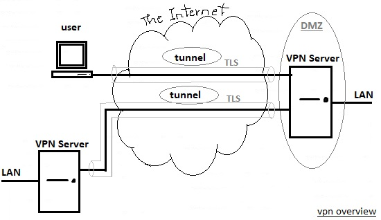

# 212.5. OpenVPN

**Weight:** 2

**Description:** Candidates should be able to configure a VPN \(Virtual Private Network\) and create secure point-to-point or site-to-site connections.

**Key Knowledge Areas:**

* OpenVPN

**Terms and Utilities:**

* /etc/openvpn/
* openvpn

In this light weight lesson we talk about OpenVPN but before that lets talk about VPN itself.

### What is VPN all about?

Imagine that your are working for a company. And you have been asked to provide secure access to the company lan for another user or remote company branch. The problem is that our traffic shoud be transfer over the internet, which is routed and untrusted. The solution is VPN.

A **Virtual Private Network**  \(**VPN**\) is a technology solution used to provide privacy and security for network connections.

* It's  **Virtual**...because it's as if we have a private connection directly to another computer we connect to.
* It's  **Private**...because all our traffic is encrypted and no one can recognize what is really transfered.
* It's a  **Network**...because we're using a special network of VPN servers that covers the entire globe.



Typically an encryption is added and that is SSL/TLS, which uses certificates to make sure that the connection is encrypted and established between trusted parties as well.

As its shown above there are two types of vpn connections:

* **Point to Point :**  the most commonly used VPN. PPTP VPNs are used by remote users to connect them to the VPN network using their existing internet connection. This is a useful VPN for both business users and home users.
* **Site to Site :** is mostly used in corporate based operations. The fact that many companies have offices located both nationally and internationally, a Site-to-Site VPN is used to connect the network of the main office location to multiple offices. This is also known as an Intranet based VPN.

## OpenVPN

OpenVPN is an open-source software application that implements virtual private network \(VPN\) techniques to create secure point-to-point or site-to-site connections.

OpenVPN can use a variety of methods such as pre-shared secret keys, certificates, or usernames/passwords, to let clients authenticate to the server. OpenVPN uses the OpenSSL protocol and implements many security and control features such as challenge response authentication, single sign-on capability, load balancing and failover features and multi daemon support.

By default OpenVPN works on port 1194 UDP but Open VPN is highly capable of transparently traversing through firewalls especially when the default port is chnaged to 443.


Lets get started by installing OpenVPN and establish a VPN connection between two computers.

We use CentOS\(192.168.10.147\) computer az a server and ubuntu\(192.168.10.129\) machine as a client, also for keeping simple we will use pre-shared keys instead of generating certificates:

```text
[root@centos7-1 ~]# yum search openvpn
Loaded plugins: fastestmirror, langpacks
Loading mirror speeds from cached hostfile
 * base: mirrors.maine.edu
 * extras: mirror.clarkson.edu
 * updates: mirror.math.princeton.edu
Warning: No matches found for: openvpn
No matches found
```

For installing Open VPN we have to add epel-release repository :

```text
[root@centos7-1 ~]# yum install epel-release.noarch  -y

[root@centos7-1 ~]# yum repolist 
Loaded plugins: fastestmirror, langpacks
Loading mirror speeds from cached hostfile
 * base: mirror.linux.duke.edu
 * epel: fedora-epel.mirrors.tds.net
 * extras: repos.forethought.net
 * updates: centos.mirror.ndchost.com
repo id                      repo name                                           status
base/7/x86_64                CentOS-7 - Base                                      9,911
docker-ce-stable/x86_64      Docker CE Stable - x86_64                               16
epel/x86_64                  Extra Packages for Enterprise Linux 7 - x86_64      12,640
extras/7/x86_64              CentOS-7 - Extras                                      363
updates/7/x86_64             CentOS-7 - Updates                                   1,004
repolist: 23,934
```

and lets install open vpn:

```text
[root@centos7-1 ~]# yum search openvpn
Loaded plugins: fastestmirror, langpacks
epel/x86_64/metalink                                                                                                 |  19 kB  00:00:00     
epel                                                                                                                 | 3.2 kB  00:00:00     
(1/3): epel/x86_64/group_gz                                                                                          |  88 kB  00:00:02     
(2/3): epel/x86_64/updateinfo                                                                                        | 933 kB  00:00:08     
(3/3): epel/x86_64/primary                                                                                           | 3.6 MB  00:00:23     
Loading mirror speeds from cached hostfile
 * base: mirrors.maine.edu
 * epel: mirror.clarkson.edu
 * extras: mirror.clarkson.edu
 * updates: mirror.math.princeton.edu
epel                                                                                                                            12642/12642
=========================================================== N/S matched: openvpn ===========================================================
NetworkManager-openvpn.x86_64 : NetworkManager VPN plugin for OpenVPN
NetworkManager-openvpn-gnome.x86_64 : NetworkManager VPN plugin for OpenVPN - GNOME files
kde-plasma-networkmanagement-openvpn.x86_64 : OpenVPN support for kde-plasma-networkmanagement-extras
openvpn-auth-ldap.x86_64 : OpenVPN plugin for LDAP authentication
openvpn-devel.x86_64 : Development headers and examples for OpenVPN plug-ins
openvpn.x86_64 : A full-featured SSL VPN solution
stonevpn.noarch : Easy OpenVPN certificate and configuration management

  Name and summary matches only, use "search all" for everything.

[root@centos7-1 ~]# yum install openvpn.x86_64 -y
```

okey lets start generating shared keys:

```text
[root@centos7-1 ~]# openvpn --genkey --secret openvpn.key
[root@centos7-1 ~]# ls
anaconda-ks.cfg  initial-setup-ks.cfg  openvpn.key
[root@centos7-1 ~]# cat openvpn.key 
#
# 2048 bit OpenVPN static key
#
-----BEGIN OpenVPN Static key V1-----
6149f8d2af7902514d2b8644adfcffbe
38ddc9d9e098b789a5d0d86b08087354
5d1da124e366467caca99b441a0a1b23
1f84f6f62f7cc8e42e032015c4810c9a
7d6ff4e5d45269c8d33162697993d51f
b0a2401a67df25d6b509fff1daa1e22d
f541b06cda4fe022aaa55e7d11d538c4
36a1328174a37bd664a98d746da180e2
eefed62516266f54819d6ce2d43595fb
9f1b05fc0aee8b51248fb070f31c90a7
a610caaa67e56420ca51067d346d0b5b
b418e8f054438eb9c0ec3e35b171a0b5
b0abeeca0090b3204e5d7722ace098b6
334ba1c2d612b67a51cfbe65d2d38ca5
3442bfa9e9affb53382897213a801362
26c466dd85e53c5a37215a90be421e04
-----END OpenVPN Static key V1-----
```

Transfer shared-key to the client machine with any method that you like:

```text
[root@centos7-1 ~]# scp openvpn.key 192.168.10.129:/root/
The authenticity of host '192.168.10.129 (192.168.10.129)' can't be established.
ECDSA key fingerprint is SHA256:GV/PpX9YGvMZTAbuz6w3zBDreokesZHhVSM1zrXmHLw.
ECDSA key fingerprint is MD5:80:73:95:56:eb:94:6e:f6:45:df:1e:c4:bb:62:f7:9c.
Are you sure you want to continue connecting (yes/no)? yes
Warning: Permanently added '192.168.10.129' (ECDSA) to the list of known hosts.
root@192.168.10.129's password: 
openvpn.key
```

on the ubuntu client:

```text
root@ubuntu16-1:~# cd
root@ubuntu16-1:~# ls
openvpn.key
```

Okey lets go back to our CentOS server and configre OpenVPN Server configuration file:

```text
[root@centos7-1 ~]# vi server.conf
[root@centos7-1 ~]# cat server.conf 
dev tun
ifconfig 10.10.10.1 10.10.10.2
secret openvpn.key
```

and lets start the openvpn sever to recieve connections:

```text
[root@centos7-1 ~]# openvpn --config server.conf
Sat Aug 11 04:28:59 2018 disabling NCP mode (--ncp-disable) because not in P2MP client or server mode
Sat Aug 11 04:28:59 2018 OpenVPN 2.4.6 x86_64-redhat-linux-gnu [Fedora EPEL patched] [SSL (OpenSSL)] [LZO] [LZ4] [EPOLL] [PKCS11] [MH/PKTINFO] [AEAD] built on Apr 26 2018
Sat Aug 11 04:28:59 2018 library versions: OpenSSL 1.0.2k-fips  26 Jan 2017, LZO 2.06
Sat Aug 11 04:28:59 2018 WARNING: INSECURE cipher with block size less than 128 bit (64 bit).  This allows attacks like SWEET32.  Mitigate by using a --cipher with a larger block size (e.g. AES-256-CBC).
Sat Aug 11 04:28:59 2018 WARNING: INSECURE cipher with block size less than 128 bit (64 bit).  This allows attacks like SWEET32.  Mitigate by using a --cipher with a larger block size (e.g. AES-256-CBC).
Sat Aug 11 04:28:59 2018 TUN/TAP device tun0 opened
Sat Aug 11 04:28:59 2018 do_ifconfig, tt->did_ifconfig_ipv6_setup=0
Sat Aug 11 04:28:59 2018 /sbin/ip link set dev tun0 up mtu 1500
Sat Aug 11 04:28:59 2018 /sbin/ip addr add dev tun0 local 10.10.10.1 peer 10.10.10.2
Sat Aug 11 04:28:59 2018 Could not determine IPv4/IPv6 protocol. Using AF_INET
Sat Aug 11 04:28:59 2018 UDPv4 link local (bound): [AF_INET][undef]:1194
Sat Aug 11 04:28:59 2018 UDPv4 link remote: [AF_UNSPEC]
```

and it is client configuration time:

```text
root@ubuntu16-1:~# apt install openvpn

root@ubuntu16-1:~# vim client.conf
root@ubuntu16-1:~# cat client.conf 
remote 192.168.10.147
dev tun
ifconfig 10.10.10.2 10.10.10.1
secret openvpn.key
```

and lets get connected:

```text
root@ubuntu16-1:~# openvpn --config client.conf 
Sat Aug 11 02:39:53 2018 OpenVPN 2.3.10 x86_64-pc-linux-gnu [SSL (OpenSSL)] [LZO] [EPOLL] [PKCS11] [MH] [IPv6] built on Jun 22 2017
Sat Aug 11 02:39:53 2018 library versions: OpenSSL 1.0.2g  1 Mar 2016, LZO 2.08
Sat Aug 11 02:39:53 2018 WARNING: this cipher's block size is less than 128 bit (64 bit).  Consider using a --cipher with a larger block size.
Sat Aug 11 02:39:53 2018 WARNING: this cipher's block size is less than 128 bit (64 bit).  Consider using a --cipher with a larger block size.
Sat Aug 11 02:39:53 2018 TUN/TAP device tun0 opened
Sat Aug 11 02:39:53 2018 do_ifconfig, tt->ipv6=0, tt->did_ifconfig_ipv6_setup=0
Sat Aug 11 02:39:53 2018 /sbin/ip link set dev tun0 up mtu 1500
Sat Aug 11 02:39:53 2018 /sbin/ip addr add dev tun0 local 10.10.10.2 peer 10.10.10.1
Sat Aug 11 02:39:53 2018 UDPv4 link local (bound): [undef]
Sat Aug 11 02:39:53 2018 UDPv4 link remote: [AF_INET]192.168.10.147:1194
^CSat Aug 11 02:43:07 2018 event_wait : Interrupted system call (code=4)
Sat Aug 11 02:43:07 2018 /sbin/ip addr del dev tun0 local 10.10.10.2 peer 10.10.10.1
Sat Aug 11 02:43:07 2018 SIGINT[hard,] received, process exiting
root@ubuntu16-1:~# openvpn --config client.conf 
Sat Aug 11 02:43:09 2018 OpenVPN 2.3.10 x86_64-pc-linux-gnu [SSL (OpenSSL)] [LZO] [EPOLL] [PKCS11] [MH] [IPv6] built on Jun 22 2017
Sat Aug 11 02:43:09 2018 library versions: OpenSSL 1.0.2g  1 Mar 2016, LZO 2.08
Sat Aug 11 02:43:09 2018 WARNING: this cipher's block size is less than 128 bit (64 bit).  Consider using a --cipher with a larger block size.
Sat Aug 11 02:43:09 2018 WARNING: this cipher's block size is less than 128 bit (64 bit).  Consider using a --cipher with a larger block size.
Sat Aug 11 02:43:09 2018 TUN/TAP device tun0 opened
Sat Aug 11 02:43:09 2018 do_ifconfig, tt->ipv6=0, tt->did_ifconfig_ipv6_setup=0
Sat Aug 11 02:43:09 2018 /sbin/ip link set dev tun0 up mtu 1500
Sat Aug 11 02:43:09 2018 /sbin/ip addr add dev tun0 local 10.10.10.2 peer 10.10.10.1
Sat Aug 11 02:43:09 2018 UDPv4 link local (bound): [undef]
Sat Aug 11 02:43:09 2018 UDPv4 link remote: [AF_INET]192.168.10.147:1194
Sat Aug 11 02:43:19 2018 Peer Connection Initiated with [AF_INET]192.168.10.147:1194
Sat Aug 11 02:43:20 2018 Initialization Sequence Completed
```

And as you can see our virtual private network connection has been established and we can ping each other on an imaginary ip addresses that we have set. Before checking, Please make sure that UDP port 1194 is open on the server and the virtual TUN interface used by OpenVPN is not blocked on either the client or server :

```text
### CentOS server
[root@centos7-1 ~]# ifconfig
ens33: flags=4163<UP,BROADCAST,RUNNING,MULTICAST>  mtu 1500
        inet 192.168.10.147  netmask 255.255.255.0  broadcast 192.168.10.255
        inet6 fe80::20c:29ff:fe2d:76a6  prefixlen 64  scopeid 0x20<link>
        ether 00:0c:29:2d:76:a6  txqueuelen 1000  (Ethernet)
        RX packets 17624  bytes 17631188 (16.8 MiB)
        RX errors 0  dropped 0  overruns 0  frame 0
        TX packets 4459  bytes 320008 (312.5 KiB)
        TX errors 0  dropped 0 overruns 0  carrier 0  collisions 0

lo: flags=73<UP,LOOPBACK,RUNNING>  mtu 65536
        inet 127.0.0.1  netmask 255.0.0.0
        inet6 ::1  prefixlen 128  scopeid 0x10<host>
        loop  txqueuelen 1  (Local Loopback)
        RX packets 486  bytes 40650 (39.6 KiB)
        RX errors 0  dropped 0  overruns 0  frame 0
        TX packets 486  bytes 40650 (39.6 KiB)
        TX errors 0  dropped 0 overruns 0  carrier 0  collisions 0

tun0: flags=4305<UP,POINTOPOINT,RUNNING,NOARP,MULTICAST>  mtu 1500
        inet 10.10.10.1  netmask 255.255.255.255  destination 10.10.10.2
        inet6 fe80::60a8:4a69:efdf:2e03  prefixlen 64  scopeid 0x20<link>
        unspec 00-00-00-00-00-00-00-00-00-00-00-00-00-00-00-00  txqueuelen 100  (UNSPEC)
        RX packets 7  bytes 444 (444.0 B)
        RX errors 0  dropped 0  overruns 0  frame 0
        TX packets 64  bytes 5268 (5.1 KiB)
        TX errors 0  dropped 0 overruns 0  carrier 0  collisions 0

virbr0: flags=4099<UP,BROADCAST,MULTICAST>  mtu 1500
        inet 192.168.122.1  netmask 255.255.255.0  broadcast 192.168.122.255
        ether 52:54:00:68:0d:c9  txqueuelen 1000  (Ethernet)
        RX packets 0  bytes 0 (0.0 B)
        RX errors 0  dropped 0  overruns 0  frame 0
        TX packets 0  bytes 0 (0.0 B)
        TX errors 0  dropped 0 overruns 0  carrier 0  collisions 0

virbr0-nic: flags=4099<UP,BROADCAST,MULTICAST>  mtu 1500
        ether 52:54:00:68:0d:c9  txqueuelen 1000  (Ethernet)
        RX packets 0  bytes 0 (0.0 B)
        RX errors 0  dropped 0  overruns 0  frame 0
        TX packets 0  bytes 0 (0.0 B)
        TX errors 0  dropped 0 overruns 0  carrier 0  collisions 0

[root@centos7-1 ~]# ping 10.10.10.2
PING 10.10.10.2 (10.10.10.2) 56(84) bytes of data.
64 bytes from 10.10.10.2: icmp_seq=1 ttl=64 time=0.808 ms
64 bytes from 10.10.10.2: icmp_seq=2 ttl=64 time=0.890 ms
^C
--- 10.10.10.2 ping statistics ---
2 packets transmitted, 2 received, 0% packet loss, time 1003ms
rtt min/avg/max/mdev = 0.808/0.849/0.890/0.041 ms
```

```text
### Client
root@ubuntu16-1:~# ping 10.10.10.2
PING 10.10.10.2 (10.10.10.2) 56(84) bytes of data.
64 bytes from 10.10.10.2: icmp_seq=1 ttl=64 time=0.090 ms
^C
--- 10.10.10.2 ping statistics ---
1 packets transmitted, 1 received, 0% packet loss, time 0ms
rtt min/avg/max/mdev = 0.090/0.090/0.090/0.000 ms
root@ubuntu16-1:~# ifconfig 
ens33     Link encap:Ethernet  HWaddr 00:0c:29:03:64:0d  
          inet addr:192.168.10.128  Bcast:192.168.10.255  Mask:255.255.255.0
          inet6 addr: fe80::6b27:5482:7f91:fe70/64 Scope:Link
          UP BROADCAST RUNNING MULTICAST  MTU:1500  Metric:1
          RX packets:441392 errors:0 dropped:0 overruns:0 frame:0
          TX packets:168340 errors:0 dropped:0 overruns:0 carrier:0
          collisions:0 txqueuelen:1000 
          RX bytes:434873292 (434.8 MB)  TX bytes:11126119 (11.1 MB)

lo        Link encap:Local Loopback  
          inet addr:127.0.0.1  Mask:255.0.0.0
          inet6 addr: ::1/128 Scope:Host
          UP LOOPBACK RUNNING  MTU:65536  Metric:1
          RX packets:25627 errors:0 dropped:0 overruns:0 frame:0
          TX packets:25627 errors:0 dropped:0 overruns:0 carrier:0
          collisions:0 txqueuelen:1000 
          RX bytes:1725455 (1.7 MB)  TX bytes:1725455 (1.7 MB)

tun0      Link encap:UNSPEC  HWaddr 00-00-00-00-00-00-00-00-00-00-00-00-00-00-00-00  
          inet addr:10.10.10.2  P-t-P:10.10.10.1  Mask:255.255.255.255
          inet6 addr: fe80::dbb5:654:4d57:f049/64 Scope:Link
          UP POINTOPOINT RUNNING NOARP MULTICAST  MTU:1500  Metric:1
          RX packets:0 errors:0 dropped:0 overruns:0 frame:0
          TX packets:11 errors:0 dropped:0 overruns:0 carrier:0
          collisions:0 txqueuelen:100 
          RX bytes:0 (0.0 B)  TX bytes:636 (636.0 B)

root@ubuntu16-1:~# ping 10.10.10.1
PING 10.10.10.1 (10.10.10.1) 56(84) bytes of data.
64 bytes from 10.10.10.1: icmp_seq=1 ttl=64 time=1.55 ms
64 bytes from 10.10.10.1: icmp_seq=2 ttl=64 time=2.17 ms
64 bytes from 10.10.10.1: icmp_seq=3 ttl=64 time=2.05 ms
^C
--- 10.10.10.1 ping statistics ---
3 packets transmitted, 3 received, 0% packet loss, time 2004ms
rtt min/avg/max/mdev = 1.557/1.928/2.177/0.269 ms
```

It was the simplest example we could demonstrate for establishing point-to-point VPN connection between to computers using a shared key, but as we said, we can use Certificates inorder to provide SSL/TLS connections to make secure, encrypted VPN connections.This way we can prevent snooping our traffic in a higher level. For that we have to install easy-rsa package and do some extra steps\(LPIC3 303 course\)

## /etc/openvpn/

All OpenVPN configuration files should be configured under /etc/openvpn directory but by default no configuration files are found here. So we should either create new ones \(which seems complicated\) or we can easily copy sample configuration files from /usr/share/doc/openvpn-x to /etc/openvpn directory and modify them \(the simplest way\)

```text
[root@centos7-1 ~]# tree /usr/share/doc/openvpn-2.4.6/
/usr/share/doc/openvpn-2.4.6/
├── AUTHORS
├── ChangeLog
├── Changes.rst
├── contrib
│   ├── OCSP_check
│   │   └── OCSP_check.sh
│   ├── openvpn-fwmarkroute-1.00
│   │   ├── fwmarkroute.down
│   │   ├── fwmarkroute.up
│   │   └── README
│   ├── pull-resolv-conf
│   │   ├── client.down
│   │   └── client.up
│   └── README
├── COPYING
├── COPYRIGHT.GPL
├── management-notes.txt
├── README
├── README.auth-pam
├── README.down-root
├── README.systemd
└── sample
    ├── sample-config-files
    │   ├── client.conf
    │   ├── firewall.sh
    │   ├── home.up
    │   ├── loopback-client
    │   ├── loopback-server
    │   ├── office.up
    │   ├── openvpn-shutdown.sh
    │   ├── openvpn-startup.sh
    │   ├── README
    │   ├── roadwarrior-client.conf
    │   ├── roadwarrior-server.conf
    │   ├── server.conf
    │   ├── static-home.conf
    │   ├── static-office.conf
    │   ├── tls-home.conf
    │   ├── tls-office.conf
    │   ├── xinetd-client-config
    │   └── xinetd-server-config
    ├── sample-scripts
    │   ├── auth-pam.pl
    │   ├── bridge-start
    │   ├── bridge-stop
    │   ├── ucn.pl
    │   └── verify-cn
    └── sample-windows
        └── sample.ovpn

8 directories, 41 files
```

Keep this information in your mind for lpic 3 course.

that's all folks!

## Congratulation we have done lpic2-202 !!! do not forget to give a [start](https://github.com/Borosan) and [donate](https://payping.ir/@borosan) :-\)

