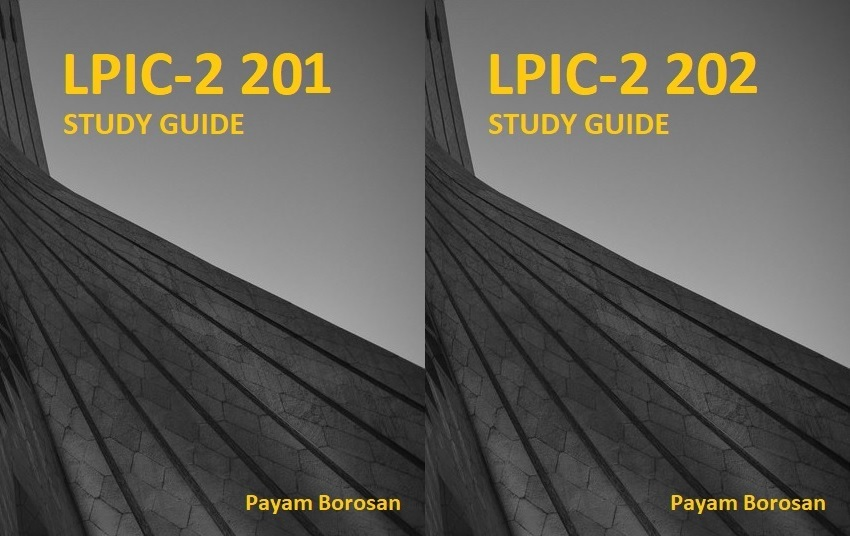

# Introduction

Welcome to LPIC2 Certification Exam guide.If you are here and studying this article it means you love linux and you are excited to learn and experience new things. So Fasten your seat belts and be prepared to explore Linux world.

You can see the overview of LPIC2 Certification [here ](http://www.lpi.org/our-certifications/lpic-2-overview)and as you probably know LPIC2 is consist of two exams [201](http://www.lpi.org/our-certifications/exam-201-objectives) and [202](http://www.lpi.org/our-certifications/exam-202-objectives).As light of way 201 exam is more about linux itself and you will add more tools to your toolbox .In contrast, in 202 course we will start learning about Linux Infrastructure services. We will talk about some extra products which will let us to use linux as an infrastructure server in our real environments.

Okey, Lets keep it simple and start ... :-\)

By Payam Borosan

* Site: [www.linuxcert.ir](http://linuxcert.ir/)
* GitBook: [https://borosan.gitbook.io/lpic2-exam-guide/](https://borosan.gitbook.io/lpic2-exam-guide/)
* e-mail: p.borosan \[at\] gmail.com

Donation :

* bitcoin: bc1qhm5nr98su6xupv4dd6zt2m0sq2dzxh69zejm85
* ethereum: 0x6F3D43A6957CC61b74Fe85Ad52D05d91a2B13c67
* litecoin: ltc1qvxu57q2f3ay9tzu6tffkayc65te80vax9wzxn7
* payping: [https://payping.ir/borosan](https://payping.ir/borosan)

